# 部署监控与维护

<cite>
**本文引用的文件**
- [model-monitoring-and-maintenance.md](file://docs/en/guides/model-monitoring-and-maintenance.md)
- [yolo-performance-metrics.md](file://docs/en/guides/yolo-performance-metrics.md)
- [triton-inference-server.md](file://docs/en/guides/triton-inference-server.md)
- [queue-management.md](file://docs/en/guides/queue-management.md)
- [analytics.md](file://docs/en/guides/analytics.md)
- [benchmark.md](file://docs/en/modes/benchmark.md)
- [benchmarks/run.py](file://benchmarks/run.py)
- [benchmarks/suite.py](file://benchmarks/suite.py)
- [benchmarks/suites.yaml](file://benchmarks/suites.yaml)
- [benchmarks/benchmark_molora_dispatch.py](file://benchmarks/benchmark_molora_dispatch.py)
- [benchmarks/benchmark_mot_dispatch.py](file://benchmarks/benchmark_mot_dispatch.py)
- [utils/benchmarks.py](file://ultralytics/utils/benchmarks.py)
- [utils/logger.py](file://ultralytics/utils/logger.py)
- [utils/events.py](file://ultralytics/utils/events.py)
- [engine/predictor.py](file://ultralytics/engine/predictor.py)
- [engine/validator.py](file://ultralytics/engine/validator.py)
- [engine/trainer.py](file://ultralytics/engine/trainer.py)
- [solutions/streamlit_inference.py](file://ultralytics/solutions/streamlit_inference.py)
- [solutions/analytics.py](file://ultralytics/solutions/analytics.py)
- [tests/test_benchmark_suite.py](file://tests/test_benchmark_suite.py)
- [tests/test_metrics_numerical_stability.py](file://tests/test_metrics_numerical_stability.py)
- [tests/test_runtime_state_reset.py](file://tests/test_runtime_state_reset.py)
- [tests/test_ddp_error_propagation_e2e.py](file://tests/test_ddp_error_propagation_e2e.py)
- [tests/test_ddp_root_cause_reporting.py](file://tests/test_ddp_root_cause_reporting.py)
- [scripts/smoke_test_coco2017.py](file://scripts/smoke_test_coco2017.py)
- [scripts/run_planner_lovo_calibration.py](file://scripts/run_planner_lovo_calibration.py)
- [tools/config_drift_detector.py](file://tools/config_drift_detector.py)
- [governance/performance-gates.md](file://docs/governance/performance-gates.md)
</cite>

## 目录
1. [简介](#简介)
2. [项目结构](#项目结构)
3. [核心组件](#核心组件)
4. [架构总览](#架构总览)
5. [详细组件分析](#详细组件分析)
6. [依赖关系分析](#依赖关系分析)
7. [性能考量](#性能考量)
8. [故障排查指南](#故障排查指南)
9. [结论](#结论)
10. [附录](#附录)

## 简介
本技术文档面向YOLO-Master的部署、监控与维护，围绕以下目标展开：
- 定义并采集关键性能指标（延迟、吞吐量、内存使用率、GPU利用率等）
- 设计分布式部署的监控策略（多节点协调与负载均衡监控）
- 构建日志收集与集中化管理方案（结构化日志与链路追踪）
- 制定告警规则与阈值配置方法
- 自动化执行性能基准测试与回归测试
- 实现健康检查与自愈机制
- 提供容量规划与扩容策略指导
- 建立故障诊断与根因分析工具与方法
- 编写运维手册与应急预案

## 项目结构
仓库中与“部署监控与维护”直接相关的代码与文档主要分布在如下位置：
- 文档与指南：docs/en/guides 下的模型监控、性能指标、Triton推理服务、队列管理、分析等
- 基准测试套件：benchmarks 目录及 ultralytics/utils/benchmarks.py
- 运行时与引擎：ultralytics/engine 下的预测器、验证器、训练器
- 解决方案与示例：ultralytics/solutions 中的流式推理与分析模块
- 测试与治理：tests 与 docs/governance 下的基准与性能门禁相关用例与规范
- 工具脚本：scripts 与 tools 下用于冒烟测试、校准、配置漂移检测等

```mermaid
graph TB
subgraph "文档与指南"
D1["模型监控与维护<br/>docs/en/guides/model-monitoring-and-maintenance.md"]
D2["YOLO性能指标<br/>docs/en/guides/yolo-performance-metrics.md"]
D3["Triton推理服务<br/>docs/en/guides/triton-inference-server.md"]
D4["队列管理<br/>docs/en/guides/queue-management.md"]
D5["分析能力<br/>docs/en/guides/analytics.md"]
end
subgraph "基准与工具"
B1["基准运行入口<br/>benchmarks/run.py"]
B2["基准套件定义<br/>benchmarks/suite.py"]
B3["基准数据表<br/>benchmarks/suites.yaml"]
U1["通用基准工具<br/>ultralytics/utils/benchmarks.py"]
end
subgraph "运行时与引擎"
E1["预测器<br/>ultralytics/engine/predictor.py"]
E2["验证器<br/>ultralytics/engine/validator.py"]
E3["训练器<br/>ultralytics/engine/trainer.py"]
S1["流式推理UI<br/>ultralytics/solutions/streamlit_inference.py"]
S2["分析模块<br/>ultralytics/solutions/analytics.py"]
end
subgraph "测试与治理"
T1["基准套件测试<br/>tests/test_benchmark_suite.py"]
T2["指标数值稳定性<br/>tests/test_metrics_numerical_stability.py"]
T3["运行时状态重置<br/>tests/test_runtime_state_reset.py"]
T4["DDP错误传播E2E<br/>tests/test_ddp_error_propagation_e2e.py"]
T5["DDP根因报告<br/>tests/test_ddp_root_cause_reporting.py"]
G1["性能门禁<br/>docs/governance/performance-gates.md"]
end
D1 --> E1
D2 --> U1
D3 --> E1
D4 --> E1
D5 --> S2
B1 --> U1
B2 --> U1
B3 --> B2
E1 --> S1
E1 --> S2
T1 --> B1
T2 --> E2
T3 --> E1
T4 --> E3
T5 --> E3
G1 --> B1
```

图表来源
- [model-monitoring-and-maintenance.md](file://docs/en/guides/model-monitoring-and-maintenance.md)
- [yolo-performance-metrics.md](file://docs/en/guides/yolo-performance-metrics.md)
- [triton-inference-server.md](file://docs/en/guides/triton-inference-server.md)
- [queue-management.md](file://docs/en/guides/queue-management.md)
- [analytics.md](file://docs/en/guides/analytics.md)
- [benchmarks/run.py](file://benchmarks/run.py)
- [benchmarks/suite.py](file://benchmarks/suite.py)
- [benchmarks/suites.yaml](file://benchmarks/suites.yaml)
- [utils/benchmarks.py](file://ultralytics/utils/benchmarks.py)
- [engine/predictor.py](file://ultralytics/engine/predictor.py)
- [engine/validator.py](file://ultralytics/engine/validator.py)
- [engine/trainer.py](file://ultralytics/engine/trainer.py)
- [solutions/streamlit_inference.py](file://ultralytics/solutions/streamlit_inference.py)
- [solutions/analytics.py](file://ultralytics/solutions/analytics.py)
- [tests/test_benchmark_suite.py](file://tests/test_benchmark_suite.py)
- [tests/test_metrics_numerical_stability.py](file://tests/test_metrics_numerical_stability.py)
- [tests/test_runtime_state_reset.py](file://tests/test_runtime_state_reset.py)
- [tests/test_ddp_error_propagation_e2e.py](file://tests/test_ddp_error_propagation_e2e.py)
- [tests/test_ddp_root_cause_reporting.py](file://tests/test_ddp_root_cause_reporting.py)
- [governance/performance-gates.md](file://docs/governance/performance-gates.md)

章节来源
- [model-monitoring-and-maintenance.md](file://docs/en/guides/model-monitoring-and-maintenance.md)
- [yolo-performance-metrics.md](file://docs/en/guides/yolo-performance-metrics.md)
- [triton-inference-server.md](file://docs/en/guides/triton-inference-server.md)
- [queue-management.md](file://docs/en/guides/queue-management.md)
- [analytics.md](file://docs/en/guides/analytics.md)
- [benchmarks/run.py](file://benchmarks/run.py)
- [benchmarks/suite.py](file://benchmarks/suite.py)
- [benchmarks/suites.yaml](file://benchmarks/suites.yaml)
- [utils/benchmarks.py](file://ultralytics/utils/benchmarks.py)
- [engine/predictor.py](file://ultralytics/engine/predictor.py)
- [engine/validator.py](file://ultralytics/engine/validator.py)
- [engine/trainer.py](file://ultralytics/engine/trainer.py)
- [solutions/streamlit_inference.py](file://ultralytics/solutions/streamlit_inference.py)
- [solutions/analytics.py](file://ultralytics/solutions/analytics.py)
- [tests/test_benchmark_suite.py](file://tests/test_benchmark_suite.py)
- [tests/test_metrics_numerical_stability.py](file://tests/test_metrics_numerical_stability.py)
- [tests/test_runtime_state_reset.py](file://tests/test_runtime_state_reset.py)
- [tests/test_ddp_error_propagation_e2e.py](file://tests/test_ddp_error_propagation_e2e.py)
- [tests/test_ddp_root_cause_reporting.py](file://tests/test_ddp_root_cause_reporting.py)
- [governance/performance-gates.md](file://docs/governance/performance-gates.md)

## 核心组件
- 性能指标与采集
  - 延迟、吞吐、内存与GPU利用率的定义与采集方式在性能指标文档中给出；基准工具提供统一度量接口。
  - 参考路径：[yolo-performance-metrics.md](file://docs/en/guides/yolo-performance-metrics.md)、[utils/benchmarks.py](file://ultralytics/utils/benchmarks.py)
- 推理与服务化
  - Triton推理服务集成指南与队列管理策略为高并发场景提供支撑。
  - 参考路径：[triton-inference-server.md](file://docs/en/guides/triton-inference-server.md)、[queue-management.md](file://docs/en/guides/queue-management.md)
- 分析与可视化
  - 分析模块与流式推理UI便于在线观测与离线复盘。
  - 参考路径：[analytics.md](file://docs/en/guides/analytics.md)、[solutions/analytics.py](file://ultralytics/solutions/analytics.py)、[solutions/streamlit_inference.py](file://ultralytics/solutions/streamlit_inference.py)
- 基准与回归
  - 基准套件与测试用例覆盖端到端流程，确保回归稳定。
  - 参考路径：[benchmarks/run.py](file://benchmarks/run.py)、[benchmarks/suite.py](file://benchmarks/suite.py)、[benchmarks/suites.yaml](file://benchmarks/suites.yaml)、[tests/test_benchmark_suite.py](file://tests/test_benchmark_suite.py)
- 分布式与容错
  - DDP错误传播与根因报告测试保障分布式训练/推理的可观测性与可恢复性。
  - 参考路径：[tests/test_ddp_error_propagation_e2e.py](file://tests/test_ddp_error_propagation_e2e.py)、[tests/test_ddp_root_cause_reporting.py](file://tests/test_ddp_root_cause_reporting.py)
- 配置与门禁
  - 性能门禁与配置漂移检测用于发布前质量把关。
  - 参考路径：[governance/performance-gates.md](file://docs/governance/performance-gates.md)、[tools/config_drift_detector.py](file://tools/config_drift_detector.py)

章节来源
- [yolo-performance-metrics.md](file://docs/en/guides/yolo-performance-metrics.md)
- [utils/benchmarks.py](file://ultralytics/utils/benchmarks.py)
- [triton-inference-server.md](file://docs/en/guides/triton-inference-server.md)
- [queue-management.md](file://docs/en/guides/queue-management.md)
- [analytics.md](file://docs/en/guides/analytics.md)
- [solutions/analytics.py](file://ultralytics/solutions/analytics.py)
- [solutions/streamlit_inference.py](file://ultralytics/solutions/streamlit_inference.py)
- [benchmarks/run.py](file://benchmarks/run.py)
- [benchmarks/suite.py](file://benchmarks/suite.py)
- [benchmarks/suites.yaml](file://benchmarks/suites.yaml)
- [tests/test_benchmark_suite.py](file://tests/test_benchmark_suite.py)
- [tests/test_ddp_error_propagation_e2e.py](file://tests/test_ddp_error_propagation_e2e.py)
- [tests/test_ddp_root_cause_reporting.py](file://tests/test_ddp_root_cause_reporting.py)
- [governance/performance-gates.md](file://docs/governance/performance-gates.md)
- [tools/config_drift_detector.py](file://tools/config_drift_detector.py)

## 架构总览
下图展示从请求进入、推理执行、指标采集到日志与告警的整体流程，并与实际源码文件对应。

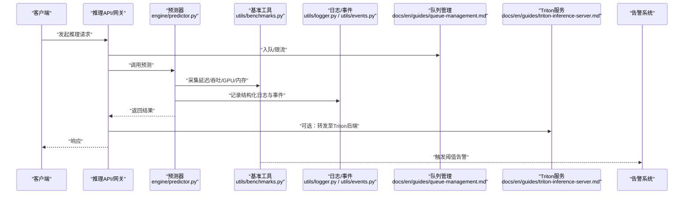

图表来源
- [engine/predictor.py](file://ultralytics/engine/predictor.py)
- [utils/benchmarks.py](file://ultralytics/utils/benchmarks.py)
- [utils/logger.py](file://ultralytics/utils/logger.py)
- [utils/events.py](file://ultralytics/utils/events.py)
- [queue-management.md](file://docs/en/guides/queue-management.md)
- [triton-inference-server.md](file://docs/en/guides/triton-inference-server.md)

## 详细组件分析

### 性能指标定义与采集
- 指标定义
  - 延迟：端到端请求处理时间（含预处理、推理、后处理）
  - 吞吐：单位时间内处理的请求数或样本数
  - 内存使用率：进程/设备内存占用比例
  - GPU利用率：GPU计算单元与显存占用情况
- 采集方法
  - 通过基准工具封装的计时与资源探针进行采集
  - 在预测器与验证器中埋点，结合事件系统上报
  - 参考路径：[yolo-performance-metrics.md](file://docs/en/guides/yolo-performance-metrics.md)、[utils/benchmarks.py](file://ultralytics/utils/benchmarks.py)、[engine/predictor.py](file://ultralytics/engine/predictor.py)、[engine/validator.py](file://ultralytics/engine/validator.py)

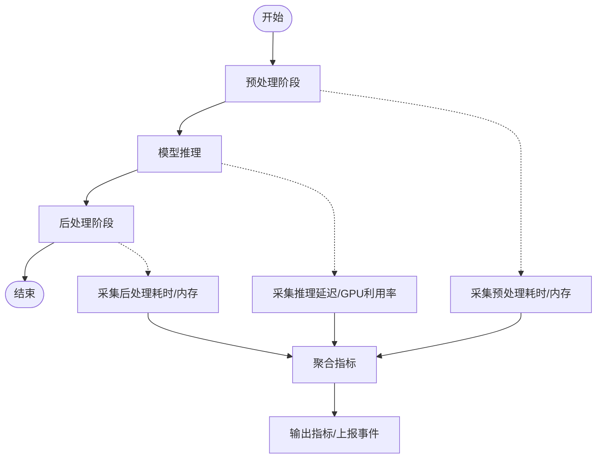

图表来源
- [utils/benchmarks.py](file://ultralytics/utils/benchmarks.py)
- [engine/predictor.py](file://ultralytics/engine/predictor.py)
- [engine/validator.py](file://ultralytics/engine/validator.py)

章节来源
- [yolo-performance-metrics.md](file://docs/en/guides/yolo-performance-metrics.md)
- [utils/benchmarks.py](file://ultralytics/utils/benchmarks.py)
- [engine/predictor.py](file://ultralytics/engine/predictor.py)
- [engine/validator.py](file://ultralytics/engine/validator.py)

### 分布式部署监控策略
- 多节点协调
  - 基于DDP的错误传播与根因报告测试，保障跨节点异常定位与恢复
  - 参考路径：[tests/test_ddp_error_propagation_e2e.py](file://tests/test_ddp_error_propagation_e2e.py)、[tests/test_ddp_root_cause_reporting.py](file://tests/test_ddp_root_cause_reporting.py)
- 负载均衡监控
  - 结合队列管理与Triton服务，对入队速率、排队长度、节点负载进行监控
  - 参考路径：[queue-management.md](file://docs/en/guides/queue-management.md)、[triton-inference-server.md](file://docs/en/guides/triton-inference-server.md)

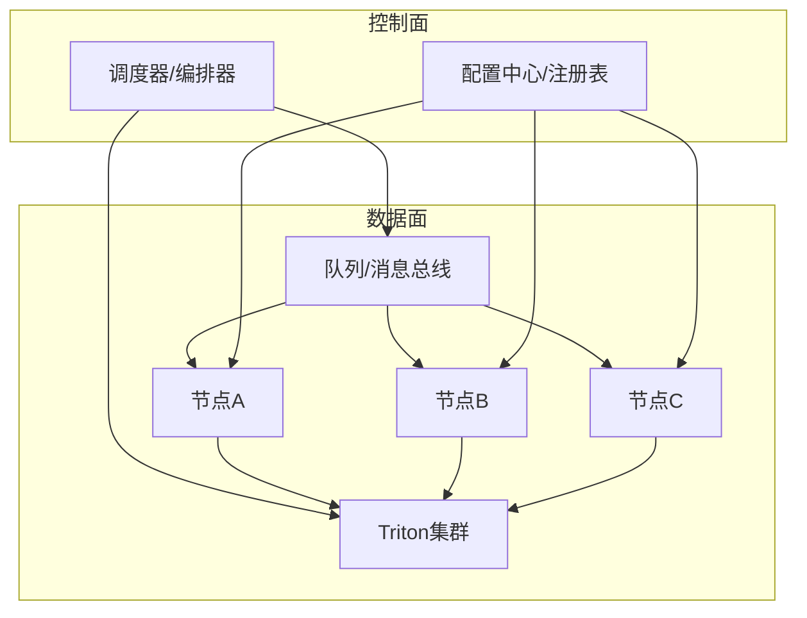

图表来源
- [queue-management.md](file://docs/en/guides/queue-management.md)
- [triton-inference-server.md](file://docs/en/guides/triton-inference-server.md)
- [tests/test_ddp_error_propagation_e2e.py](file://tests/test_ddp_error_propagation_e2e.py)
- [tests/test_ddp_root_cause_reporting.py](file://tests/test_ddp_root_cause_reporting.py)

章节来源
- [tests/test_ddp_error_propagation_e2e.py](file://tests/test_ddp_error_propagation_e2e.py)
- [tests/test_ddp_root_cause_reporting.py](file://tests/test_ddp_root_cause_reporting.py)
- [queue-management.md](file://docs/en/guides/queue-management.md)
- [triton-inference-server.md](file://docs/en/guides/triton-inference-server.md)

### 日志收集与集中化管理
- 结构化日志
  - 使用统一日志器与事件系统进行结构化输出，便于检索与关联
  - 参考路径：[utils/logger.py](file://ultralytics/utils/logger.py)、[utils/events.py](file://ultralytics/utils/events.py)
- 链路追踪
  - 在预测器与验证器中注入上下文标识，贯穿预处理、推理、后处理各阶段
  - 参考路径：[engine/predictor.py](file://ultralytics/engine/predictor.py)、[engine/validator.py](file://ultralytics/engine/validator.py)
- 集中化方案
  - 将日志与事件汇聚至日志平台，结合看板与告警联动
  - 参考路径：[analytics.md](file://docs/en/guides/analytics.md)

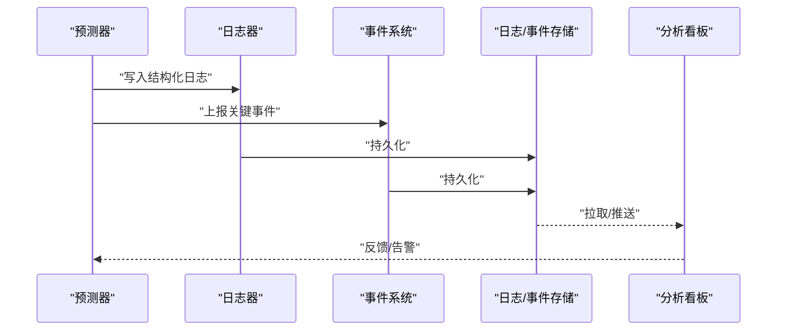

图表来源
- [utils/logger.py](file://ultralytics/utils/logger.py)
- [utils/events.py](file://ultralytics/utils/events.py)
- [engine/predictor.py](file://ultralytics/engine/predictor.py)
- [engine/validator.py](file://ultralytics/engine/validator.py)
- [analytics.md](file://docs/en/guides/analytics.md)

章节来源
- [utils/logger.py](file://ultralytics/utils/logger.py)
- [utils/events.py](file://ultralytics/utils/events.py)
- [engine/predictor.py](file://ultralytics/engine/predictor.py)
- [engine/validator.py](file://ultralytics/engine/validator.py)
- [analytics.md](file://docs/en/guides/analytics.md)

### 告警规则与阈值配置
- 指标阈值
  - 针对延迟分位、吞吐下降、内存/GPU超阈设置多级告警
- 动态调整
  - 结合队列长度与节点负载动态调整阈值与扩缩容策略
- 参考路径：[yolo-performance-metrics.md](file://docs/en/guides/yolo-performance-metrics.md)、[queue-management.md](file://docs/en/guides/queue-management.md)

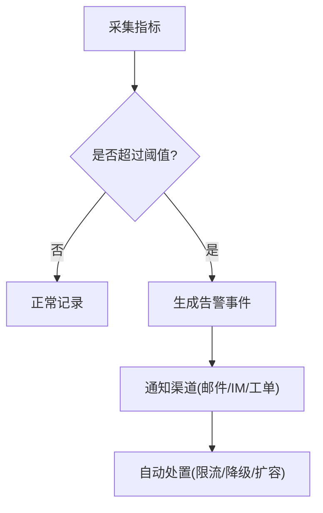

图表来源
- [yolo-performance-metrics.md](file://docs/en/guides/yolo-performance-metrics.md)
- [queue-management.md](file://docs/en/guides/queue-management.md)

章节来源
- [yolo-performance-metrics.md](file://docs/en/guides/yolo-performance-metrics.md)
- [queue-management.md](file://docs/en/guides/queue-management.md)

### 性能基准与回归测试自动化
- 基准套件
  - 通过基准运行入口与套件定义驱动标准化测试
  - 参考路径：[benchmarks/run.py](file://benchmarks/run.py)、[benchmarks/suite.py](file://benchmarks/suite.py)、[benchmarks/suites.yaml](file://benchmarks/suites.yaml)
- 专项基准
  - MoRA/MoT分发等场景的专用基准脚本
  - 参考路径：[benchmarks/benchmark_molora_dispatch.py](file://benchmarks/benchmark_molora_dispatch.py)、[benchmarks/benchmark_mot_dispatch.py](file://benchmarks/benchmark_mot_dispatch.py)
- 回归测试
  - 基准套件测试用例保证回归稳定
  - 参考路径：[tests/test_benchmark_suite.py](file://tests/test_benchmark_suite.py)

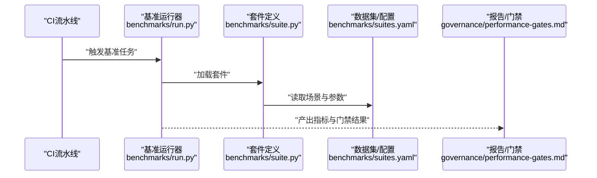

图表来源
- [benchmarks/run.py](file://benchmarks/run.py)
- [benchmarks/suite.py](file://benchmarks/suite.py)
- [benchmarks/suites.yaml](file://benchmarks/suites.yaml)
- [governance/performance-gates.md](file://docs/governance/performance-gates.md)

章节来源
- [benchmarks/run.py](file://benchmarks/run.py)
- [benchmarks/suite.py](file://benchmarks/suite.py)
- [benchmarks/suites.yaml](file://benchmarks/suites.yaml)
- [benchmarks/benchmark_molora_dispatch.py](file://benchmarks/benchmark_molora_dispatch.py)
- [benchmarks/benchmark_mot_dispatch.py](file://benchmarks/benchmark_mot_dispatch.py)
- [tests/test_benchmark_suite.py](file://tests/test_benchmark_suite.py)
- [governance/performance-gates.md](file://docs/governance/performance-gates.md)

### 健康检查与自愈机制
- 健康检查
  - 预测器与验证器的状态重置与数值稳定性测试保障运行时健康
  - 参考路径：[tests/test_runtime_state_reset.py](file://tests/test_runtime_state_reset.py)、[tests/test_metrics_numerical_stability.py](file://tests/test_metrics_numerical_stability.py)
- 自愈策略
  - 检测到异常时触发重启、回滚或降级；结合队列与Triton进行流量切换
  - 参考路径：[queue-management.md](file://docs/en/guides/queue-management.md)、[triton-inference-server.md](file://docs/en/guides/triton-inference-server.md)

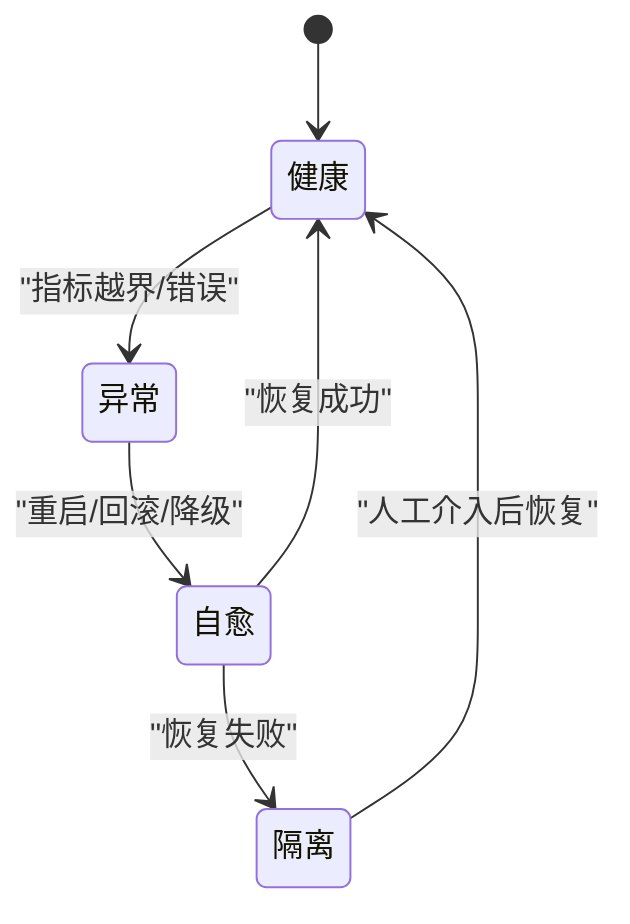

图表来源
- [tests/test_runtime_state_reset.py](file://tests/test_runtime_state_reset.py)
- [tests/test_metrics_numerical_stability.py](file://tests/test_metrics_numerical_stability.py)
- [queue-management.md](file://docs/en/guides/queue-management.md)
- [triton-inference-server.md](file://docs/en/guides/triton-inference-server.md)

章节来源
- [tests/test_runtime_state_reset.py](file://tests/test_runtime_state_reset.py)
- [tests/test_metrics_numerical_stability.py](file://tests/test_metrics_numerical_stability.py)
- [queue-management.md](file://docs/en/guides/queue-management.md)
- [triton-inference-server.md](file://docs/en/guides/triton-inference-server.md)

### 容量规划与扩容策略
- 容量规划
  - 基于历史吞吐与延迟分位估算所需实例数与资源规格
- 弹性扩容
  - 结合队列长度与节点负载动态扩缩容，优先保障低延迟SLA
- 参考路径：[yolo-performance-metrics.md](file://docs/en/guides/yolo-performance-metrics.md)、[queue-management.md](file://docs/en/guides/queue-management.md)

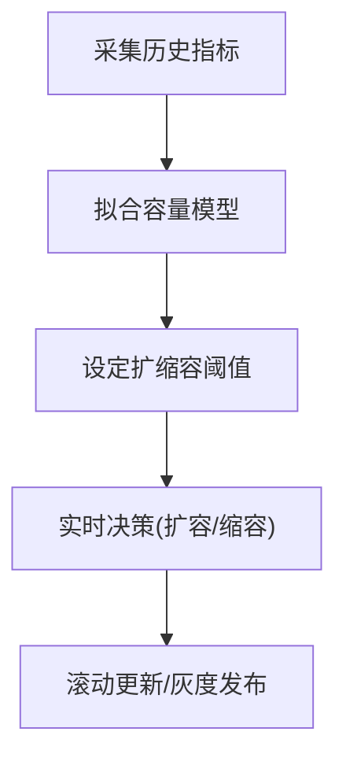

图表来源
- [yolo-performance-metrics.md](file://docs/en/guides/yolo-performance-metrics.md)
- [queue-management.md](file://docs/en/guides/queue-management.md)

章节来源
- [yolo-performance-metrics.md](file://docs/en/guides/yolo-performance-metrics.md)
- [queue-management.md](file://docs/en/guides/queue-management.md)

### 故障诊断与根因分析
- 分布式错误传播与根因报告
  - 通过端到端测试验证错误传播路径与根因信息完整性
  - 参考路径：[tests/test_ddp_error_propagation_e2e.py](file://tests/test_ddp_error_propagation_e2e.py)、[tests/test_ddp_root_cause_reporting.py](file://tests/test_ddp_root_cause_reporting.py)
- 诊断工具
  - 使用分析模块与流式推理UI辅助定位问题
  - 参考路径：[solutions/analytics.py](file://ultralytics/solutions/analytics.py)、[solutions/streamlit_inference.py](file://ultralytics/solutions/streamlit_inference.py)

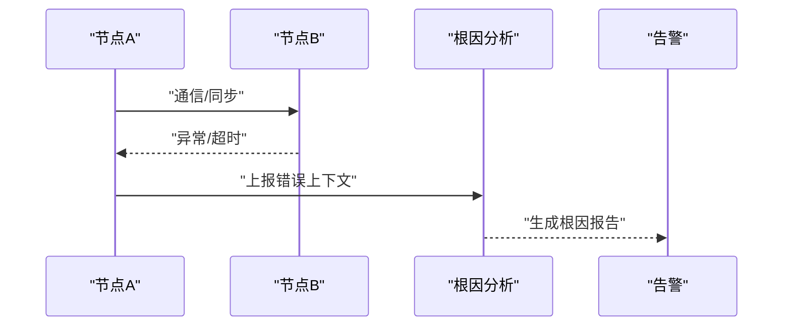

图表来源
- [tests/test_ddp_error_propagation_e2e.py](file://tests/test_ddp_error_propagation_e2e.py)
- [tests/test_ddp_root_cause_reporting.py](file://tests/test_ddp_root_cause_reporting.py)
- [solutions/analytics.py](file://ultralytics/solutions/analytics.py)
- [solutions/streamlit_inference.py](file://ultralytics/solutions/streamlit_inference.py)

章节来源
- [tests/test_ddp_error_propagation_e2e.py](file://tests/test_ddp_error_propagation_e2e.py)
- [tests/test_ddp_root_cause_reporting.py](file://tests/test_ddp_root_cause_reporting.py)
- [solutions/analytics.py](file://ultralytics/solutions/analytics.py)
- [solutions/streamlit_inference.py](file://ultralytics/solutions/streamlit_inference.py)

### 运维手册与应急预案
- 运维手册要点
  - 启动/停止流程、健康检查、指标看板、日志查询、告警处理
- 应急预案
  - 常见故障场景（节点宕机、GPU异常、队列积压、模型回滚）与处置步骤
- 参考路径：[model-monitoring-and-maintenance.md](file://docs/en/guides/model-monitoring-and-maintenance.md)、[triton-inference-server.md](file://docs/en/guides/triton-inference-server.md)、[queue-management.md](file://docs/en/guides/queue-management.md)

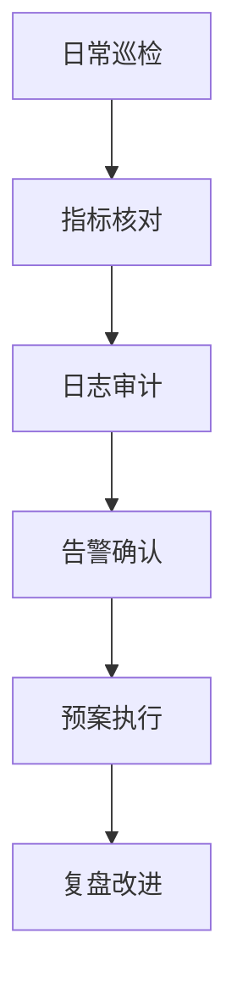

图表来源
- [model-monitoring-and-maintenance.md](file://docs/en/guides/model-monitoring-and-maintenance.md)
- [triton-inference-server.md](file://docs/en/guides/triton-inference-server.md)
- [queue-management.md](file://docs/en/guides/queue-management.md)

章节来源
- [model-monitoring-and-maintenance.md](file://docs/en/guides/model-monitoring-and-maintenance.md)
- [triton-inference-server.md](file://docs/en/guides/triton-inference-server.md)
- [queue-management.md](file://docs/en/guides/queue-management.md)

## 依赖关系分析
- 组件耦合
  - 预测器依赖基准工具与日志/事件系统；验证器与训练器共享指标与事件上报逻辑
  - 基准套件与治理门禁形成闭环的质量保障
- 外部集成
  - Triton推理服务与队列管理作为外部依赖，提升可扩展性与弹性

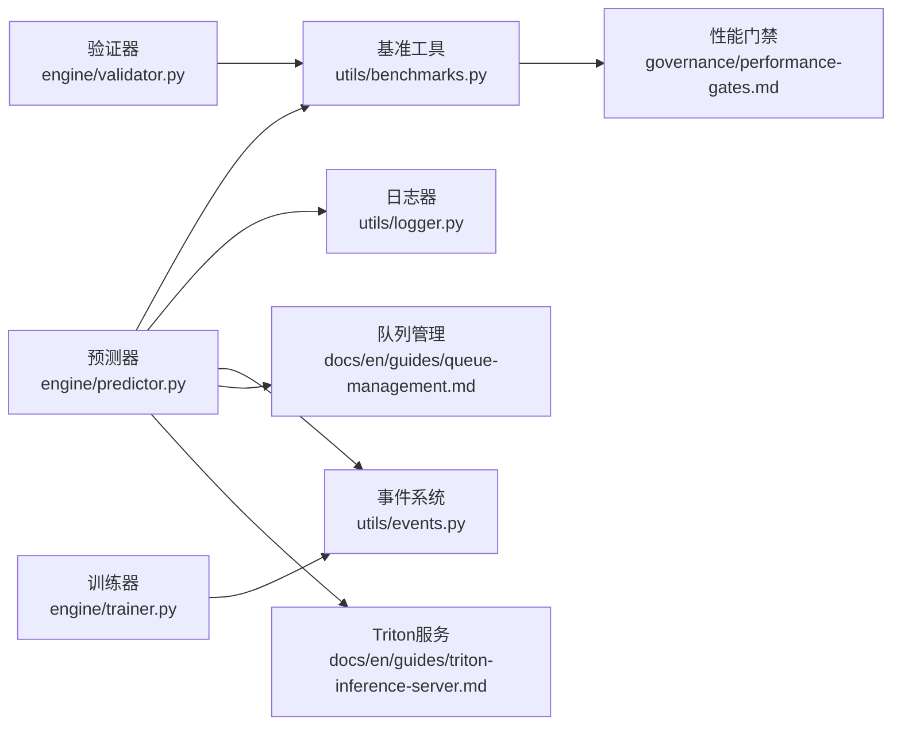

图表来源
- [engine/predictor.py](file://ultralytics/engine/predictor.py)
- [engine/validator.py](file://ultralytics/engine/validator.py)
- [engine/trainer.py](file://ultralytics/engine/trainer.py)
- [utils/benchmarks.py](file://ultralytics/utils/benchmarks.py)
- [utils/logger.py](file://ultralytics/utils/logger.py)
- [utils/events.py](file://ultralytics/utils/events.py)
- [governance/performance-gates.md](file://docs/governance/performance-gates.md)
- [queue-management.md](file://docs/en/guides/queue-management.md)
- [triton-inference-server.md](file://docs/en/guides/triton-inference-server.md)

章节来源
- [engine/predictor.py](file://ultralytics/engine/predictor.py)
- [engine/validator.py](file://ultralytics/engine/validator.py)
- [engine/trainer.py](file://ultralytics/engine/trainer.py)
- [utils/benchmarks.py](file://ultralytics/utils/benchmarks.py)
- [utils/logger.py](file://ultralytics/utils/logger.py)
- [utils/events.py](file://ultralytics/utils/events.py)
- [governance/performance-gates.md](file://docs/governance/performance-gates.md)
- [queue-management.md](file://docs/en/guides/queue-management.md)
- [triton-inference-server.md](file://docs/en/guides/triton-inference-server.md)

## 性能考量
- 批大小与并行度调优：平衡吞吐与延迟，避免OOM
- 缓存与预热：模型与算子预热减少冷启动抖动
- 资源隔离：容器/进程级限制防止相互干扰
- 监控采样：高频指标采用滑动窗口与降采样降低开销

## 故障排查指南
- 快速定位
  - 查看结构化日志与事件，结合链路ID追踪请求全生命周期
- 常见问题
  - 延迟突增：检查队列积压、GPU利用率、I/O瓶颈
  - 吞吐下降：检查批大小、并行度、模型版本变更
  - 内存泄漏：关注运行时状态重置与数值稳定性测试
- 参考路径：[tests/test_runtime_state_reset.py](file://tests/test_runtime_state_reset.py)、[tests/test_metrics_numerical_stability.py](file://tests/test_metrics_numerical_stability.py)

章节来源
- [tests/test_runtime_state_reset.py](file://tests/test_runtime_state_reset.py)
- [tests/test_metrics_numerical_stability.py](file://tests/test_metrics_numerical_stability.py)

## 结论
通过统一的指标采集、结构化日志与事件上报、基准与回归测试、健康检查与自愈、以及完善的告警与应急预案，YOLO-Master可在生产环境实现高可用、可观测、可演进的部署与运维体系。建议持续完善性能门禁与配置漂移检测，强化分布式容错与根因分析能力，以支撑更大规模与更复杂场景的稳定运行。

## 附录
- 常用脚本与工具
  - 冒烟测试与校准脚本：[scripts/smoke_test_coco2017.py](file://scripts/smoke_test_coco2017.py)、[scripts/run_planner_lovo_calibration.py](file://scripts/run_planner_lovo_calibration.py)
  - 配置漂移检测：[tools/config_drift_detector.py](file://tools/config_drift_detector.py)
- 参考文档
  - 模型监控与维护：[model-monitoring-and-maintenance.md](file://docs/en/guides/model-monitoring-and-maintenance.md)
  - YOLO性能指标：[yolo-performance-metrics.md](file://docs/en/guides/yolo-performance-metrics.md)
  - Triton推理服务：[triton-inference-server.md](file://docs/en/guides/triton-inference-server.md)
  - 队列管理：[queue-management.md](file://docs/en/guides/queue-management.md)
  - 分析能力：[analytics.md](file://docs/en/guides/analytics.md)
  - 基准模式：[benchmark.md](file://docs/en/modes/benchmark.md)