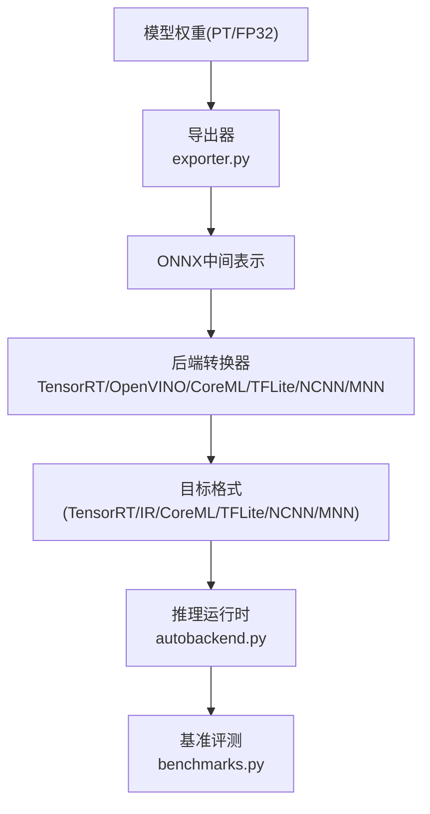
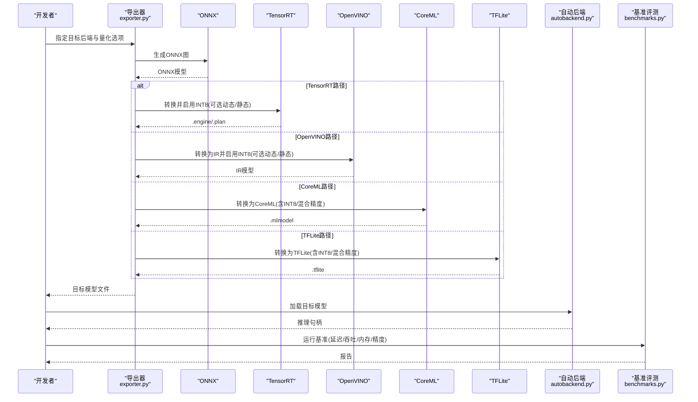
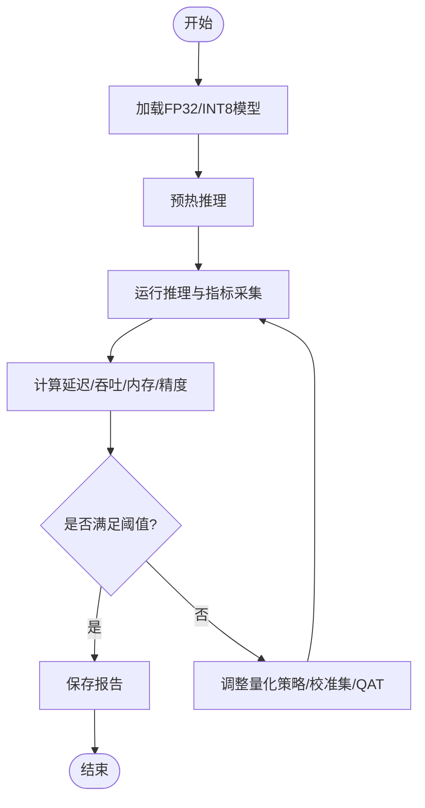
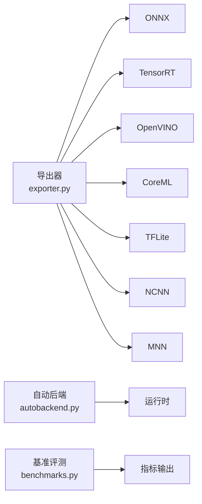

# INT8量化技术

<cite>
**本文引用的文件**
- [exporter.py](file://ultralytics/engine/exporter.py)
- [autobackend.py](file://ultralytics/nn/autobackend.py)
- [benchmarks.py](file://ultralytics/utils/benchmarks.py)
- [tensorrt.md](file://docs/en/integrations/tensorrt.md)
- [openvino.md](file://docs/en/integrations/openvino.md)
- [coreml.md](file://docs/en/integrations/coreml.md)
- [tflite.md](file://docs/en/integrations/tflite.md)
- [onnx.md](file://docs/en/integrations/onnx.md)
- [ncnn.md](file://docs/en/integrations/ncnn.md)
- [mnn.md](file://docs/en/integrations/mnn.md)
- [edge_utils.py](file://examples/YOLO-Master-Edge-Deployment/edge_utils.py)
- [export_edge_models.py](file://examples/YOLO-Master-Edge-Deployment/export_edge_models.py)
</cite>

## 目录
1. [简介](#简介)
2. [项目结构](#项目结构)
3. [核心组件](#核心组件)
4. [架构总览](#架构总览)
5. [详细组件分析](#详细组件分析)
6. [依赖关系分析](#依赖关系分析)
7. [性能考量](#性能考量)
8. [故障排查指南](#故障排查指南)
9. [结论](#结论)
10. [附录](#附录)

## 简介
本文件面向YOLO-Master的INT8量化能力，系统性梳理动态量化与静态量化的实现原理、混合精度配置、量化感知训练（QAT）要点、多后端（TensorRT、OpenVINO、CoreML等）的配置示例、精度评估与基准测试方法、内存与速度收益分析，以及自定义量化算法开发与调试指南。文档以仓库现有导出与集成能力为依据，结合工程实践给出可操作建议。

## 项目结构
与INT8量化相关的代码与文档主要分布在以下位置：
- 引擎导出与自动后端选择：ultralytics/engine/exporter.py、ultralytics/nn/autobackend.py
- 基准评测工具：ultralytics/utils/benchmarks.py
- 各后端集成文档：docs/en/integrations/*.md（如 tensorrt.md、openvino.md、coreml.md、tflite.md、onnx.md、ncnn.md、mnn.md）
- 边缘部署示例：examples/YOLO-Master-Edge-Deployment/edge_utils.py、examples/YOLO-Master-Edge-Deployment/export_edge_models.py

图表来源
- [exporter.py](file://ultralytics/engine/exporter.py)
- [autobackend.py](file://ultralytics/nn/autobackend.py)
- [benchmarks.py](file://ultralytics/utils/benchmarks.py)
- [tensorrt.md](file://docs/en/integrations/tensorrt.md)
- [openvino.md](file://docs/en/integrations/openvino.md)
- [coreml.md](file://docs/en/integrations/coreml.md)
- [tflite.md](file://docs/en/integrations/tflite.md)
- [onnx.md](file://docs/en/integrations/onnx.md)
- [ncnn.md](file://docs/en/integrations/ncnn.md)
- [mnn.md](file://docs/en/integrations/mnn.md)

章节来源
- [exporter.py](file://ultralytics/engine/exporter.py)
- [autobackend.py](file://ultralytics/nn/autobackend.py)
- [benchmarks.py](file://ultralytics/utils/benchmarks.py)
- [tensorrt.md](file://docs/en/integrations/tensorrt.md)
- [openvino.md](file://docs/en/integrations/openvino.md)
- [coreml.md](file://docs/en/integrations/coreml.md)
- [tflite.md](file://docs/en/integrations/tflite.md)
- [onnx.md](file://docs/en/integrations/onnx.md)
- [ncnn.md](file://docs/en/integrations/ncnn.md)
- [mnn.md](file://docs/en/integrations/mnn.md)

## 核心组件
- 导出器（Exporter）：负责将PyTorch模型导出为中间或目标格式，并承载后端特定的优化与量化选项（例如INT8校准参数、层类型白名单/黑名单、算子支持矩阵）。
- 自动后端（AutoBackend）：在推理阶段根据可用环境与模型格式选择最优后端，加载对应运行时并执行推理。
- 基准评测（Benchmarks）：提供端到端延迟、吞吐、内存占用与精度对比的工具链，便于量化前后效果评估。
- 后端集成文档：对各后端的导出参数、量化开关、校准数据准备、精度恢复策略进行说明。

章节来源
- [exporter.py](file://ultralytics/engine/exporter.py)
- [autobackend.py](file://ultralytics/nn/autobackend.py)
- [benchmarks.py](file://ultralytics/utils/benchmarks.py)

## 架构总览
下图展示了从训练好的FP32模型到INT8推理模型的完整流程，包括导出、转换、量化（动态/静态）、校准、精度恢复与部署。

图表来源
- [exporter.py](file://ultralytics/engine/exporter.py)
- [autobackend.py](file://ultralytics/nn/autobackend.py)
- [benchmarks.py](file://ultralytics/utils/benchmarks.py)
- [tensorrt.md](file://docs/en/integrations/tensorrt.md)
- [openvino.md](file://docs/en/integrations/openvino.md)
- [coreml.md](file://docs/en/integrations/coreml.md)
- [tflite.md](file://docs/en/integrations/tflite.md)

## 详细组件分析

### 动态量化 vs 静态量化
- 动态量化（Dynamic Quantization）
  - 原理：在推理时按批次或按算子统计激活值的范围，实时计算缩放因子与零点，无需离线校准集。
  - 适用场景：对部署环境要求低、快速验证；某些后端对动态量化支持有限。
  - 典型配置：在后端导出选项中开启动态量化开关，设置每通道/逐层量化粒度、数值范围裁剪策略等。
- 静态量化（Static Quantization）
  - 原理：使用代表性校准数据集在前向过程中收集激活分布，离线计算全局或逐层的缩放因子与零点，固化到模型中。
  - 校准数据准备：覆盖输入分布的关键样本，包含不同尺度、遮挡、光照变化等；通常需数百至数千张图像。
  - 精度恢复策略：若精度下降明显，可采用混合精度（关键层保持FP16/FP32）、重校准（改变校准集大小/分位数）、回退策略（禁用特定层量化）。

章节来源
- [tensorrt.md](file://docs/en/integrations/tensorrt.md)
- [openvino.md](file://docs/en/integrations/openvino.md)
- [coreml.md](file://docs/en/integrations/coreml.md)
- [tflite.md](file://docs/en/integrations/tflite.md)

### 混合精度量化配置
- 分层策略：卷积/线性层常用INT8，而检测头、归一化、激活、NMS等敏感层保留FP16/FP32。
- 配置方式：通过导出器的层白名单/黑名单或按模块名匹配规则控制量化粒度；部分后端支持“按算子”级别开关。
- 调优建议：先全INT8基线，再逐步放开敏感层，观察mAP/P50-95变化；必要时引入逐通道量化或对称/非对称量化策略。

章节来源
- [exporter.py](file://ultralytics/engine/exporter.py)
- [tensorrt.md](file://docs/en/integrations/tensorrt.md)
- [openvino.md](file://docs/en/integrations/openvino.md)
- [coreml.md](file://docs/en/integrations/coreml.md)
- [tflite.md](file://docs/en/integrations/tflite.md)

### 量化感知训练（QAT）实现要点
- 梯度传播：在训练图中插入可微的量化仿真节点，使权重与激活的离散化误差参与反向传播，帮助模型学习鲁棒特征。
- 损失函数调整：可加入正则项抑制异常激活、采用渐进式量化强度（由软到硬），或在早期阶段放宽量化位宽。
- 训练流程：预训练→插入量化仿真→微调若干轮→导出为INT8模型；注意学习率衰减与早停策略。
- 注意事项：QAT对数据分布敏感，需保证校准/验证集的代表性；避免过拟合导致泛化下降。

章节来源
- [exporter.py](file://ultralytics/engine/exporter.py)
- [benchmarks.py](file://ultralytics/utils/benchmarks.py)

### 多后端量化配置示例（概念性步骤）
以下为通用步骤，具体参数请参考各后端文档：
- TensorRT
  - 导出ONNX → 构建Engine → 启用INT8（动态/静态）→ 准备校准集（静态）→ 构建并保存Engine。
- OpenVINO
  - 导出ONNX → 转换为IR → 启用INT8（动态/静态）→ 校准（静态）→ 保存IR。
- CoreML
  - 导出CoreML → 选择INT8或混合精度 → 针对iOS设备优化。
- TFLite
  - 导出TFLite → 选择INT8/混合精度 → 可选代表数据集用于静态校准。
- NCNN / MNN
  - 导出ONNX → 转换为NCNN/MNN → 启用INT8（视平台支持）→ 部署到移动端/嵌入式。

章节来源
- [tensorrt.md](file://docs/en/integrations/tensorrt.md)
- [openvino.md](file://docs/en/integrations/openvino.md)
- [coreml.md](file://docs/en/integrations/coreml.md)
- [tflite.md](file://docs/en/integrations/tflite.md)
- [onnx.md](file://docs/en/integrations/onnx.md)
- [ncnn.md](file://docs/en/integrations/ncnn.md)
- [mnn.md](file://docs/en/integrations/mnn.md)

### 精度评估与基准测试
- 精度指标：mAP@0.5、mAP@[0.5:0.95]、PR曲线、混淆矩阵；对比FP32基线与INT8模型。
- 性能指标：端到端延迟（ms）、吞吐（FPS）、GPU/CPU利用率、峰值内存（MB）。
- 工具链：使用基准评测模块统一采集，确保相同输入尺寸、批大小、预热次数与随机种子。

图表来源
- [benchmarks.py](file://ultralytics/utils/benchmarks.py)

章节来源
- [benchmarks.py](file://ultralytics/utils/benchmarks.py)

### 内存占用分析与推理速度提升对比
- 内存占用：INT8模型权重体积显著减小，显存/内存占用降低；但需注意激活缓存与后端内部缓冲区。
- 推理速度：得益于更低带宽与专用INT8内核，延迟下降、吞吐提升；受限于算子支持与数据搬运开销。
- 分析方法：在同一硬件与驱动版本下，固定输入尺寸与批大小，多次采样取稳定值；关注热路径（主干+检测头+NMS）。

章节来源
- [benchmarks.py](file://ultralytics/utils/benchmarks.py)
- [autobackend.py](file://ultralytics/nn/autobackend.py)

### 自定义量化算法开发指南与调试技巧
- 开发步骤
  - 定义量化策略：逐层/逐通道/对称或非对称、动态或静态、混合精度规则。
  - 接入导出器：在导出流程中注入量化参数计算与图重写逻辑。
  - 后端适配：确保目标后端支持新算子或扩展点；必要时提供降级路径。
  - 回归测试：覆盖常见任务（检测/分割/姿态）与边界条件（极小/极大目标、密集场景）。
- 调试技巧
  - 可视化激活分布：检查异常峰值与长尾分布，调整截断阈值。
  - 逐层消融：定位敏感层，优先采用混合精度或回退策略。
  - 校准集多样性：增加难例与域外样本，提升鲁棒性。
  - 日志与断点：记录缩放因子、零点与数值范围，辅助定位溢出/下溢。

章节来源
- [exporter.py](file://ultralytics/engine/exporter.py)
- [autobackend.py](file://ultralytics/nn/autobackend.py)
- [benchmarks.py](file://ultralytics/utils/benchmarks.py)

## 依赖关系分析
- 导出器依赖后端SDK与算子支持矩阵，决定哪些层可被量化及如何重写。
- 自动后端负责运行时选择与加载，影响最终性能表现。
- 基准评测依赖统一的输入管线与计时器，确保结果可比性。

图表来源
- [exporter.py](file://ultralytics/engine/exporter.py)
- [autobackend.py](file://ultralytics/nn/autobackend.py)
- [benchmarks.py](file://ultralytics/utils/benchmarks.py)
- [tensorrt.md](file://docs/en/integrations/tensorrt.md)
- [openvino.md](file://docs/en/integrations/openvino.md)
- [coreml.md](file://docs/en/integrations/coreml.md)
- [tflite.md](file://docs/en/integrations/tflite.md)
- [ncnn.md](file://docs/en/integrations/ncnn.md)
- [mnn.md](file://docs/en/integrations/mnn.md)

章节来源
- [exporter.py](file://ultralytics/engine/exporter.py)
- [autobackend.py](file://ultralytics/nn/autobackend.py)
- [benchmarks.py](file://ultralytics/utils/benchmarks.py)

## 性能考量
- 硬件差异：GPU/ASIC/NPU对INT8加速效果不同，需针对性调参。
- 算子覆盖：未覆盖的算子会触发回退路径，影响整体性能。
- 数据通路：I/O与预处理可能成为瓶颈，需与量化优化协同考虑。
- 批大小与分辨率：大分辨率与大批次能更好利用并行，但需平衡内存。

[本节为通用指导，不直接分析具体文件]

## 故障排查指南
- 精度骤降
  - 检查校准集代表性；尝试扩大或重采样。
  - 启用混合精度，逐步放开敏感层。
  - 调整量化粒度（逐层→逐通道）与对称/非对称策略。
- 运行时报错
  - 确认后端版本与算子支持；查看导出日志中的不支持算子列表。
  - 检查输入形状与数据类型是否与导出一致。
- 性能不达预期
  - 关闭不必要的优化，定位热点层。
  - 调整批大小、预热次数与测量窗口。

章节来源
- [tensorrt.md](file://docs/en/integrations/tensorrt.md)
- [openvino.md](file://docs/en/integrations/openvino.md)
- [coreml.md](file://docs/en/integrations/coreml.md)
- [tflite.md](file://docs/en/integrations/tflite.md)
- [onnx.md](file://docs/en/integrations/onnx.md)
- [ncnn.md](file://docs/en/integrations/ncnn.md)
- [mnn.md](file://docs/en/integrations/mnn.md)

## 结论
YOLO-Master通过统一的导出器与自动后端机制，为INT8量化提供了灵活且可扩展的工程基础。动态量化适合快速迭代，静态量化配合校准与混合精度可获得更稳定的精度与性能。借助基准评测工具与后端文档，可在多平台上高效完成量化部署与调优。对于高级需求，可在导出器中注入自定义量化策略，并通过系统化的调试手段保障质量与性能。

[本节为总结，不直接分析具体文件]

## 附录
- 边缘部署参考脚本与工具：
  - [edge_utils.py](file://examples/YOLO-Master-Edge-Deployment/edge_utils.py)
  - [export_edge_models.py](file://examples/YOLO-Master-Edge-Deployment/export_edge_models.py)

章节来源
- [edge_utils.py](file://examples/YOLO-Master-Edge-Deployment/edge_utils.py)
- [export_edge_models.py](file://examples/YOLO-Master-Edge-Deployment/export_edge_models.py)