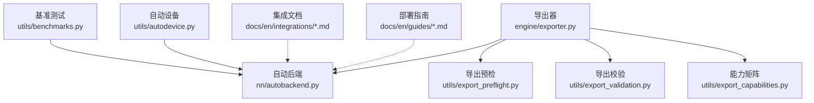
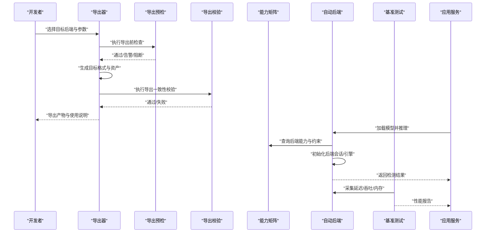
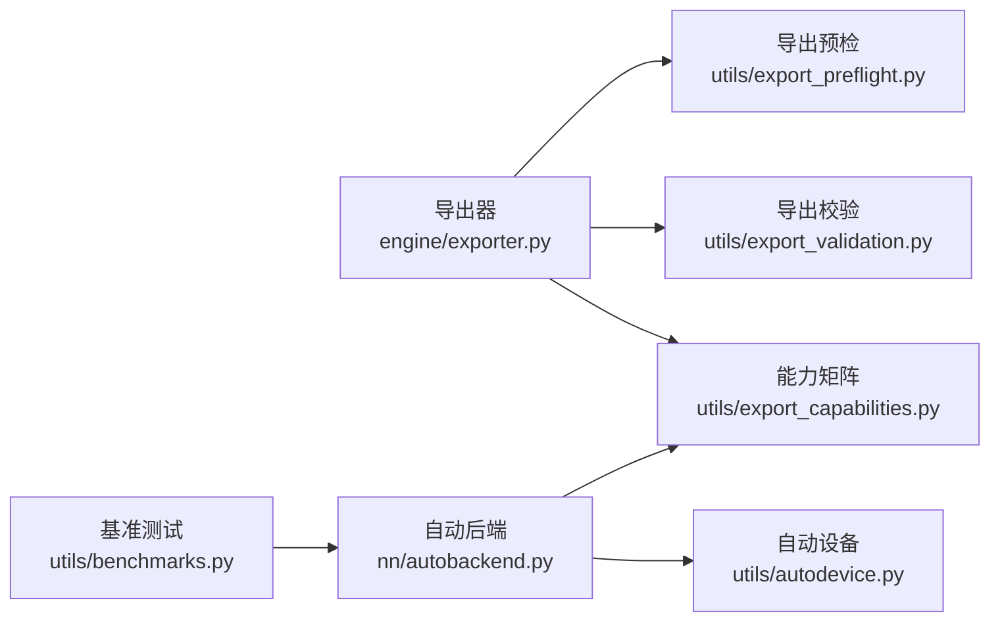

# 压缩后端与部署优化

<cite>
**本文引用的文件**
- [exporter.py](file://ultralytics/engine/exporter.py)
- [autobackend.py](file://ultralytics/nn/autobackend.py)
- [export_preflight.py](file://ultralytics/utils/export_preflight.py)
- [export_validation.py](file://ultralytics/utils/export_validation.py)
- [export_capabilities.py](file://ultralytics/utils/export_capabilities.py)
- [benchmarks.py](file://ultralytics/utils/benchmarks.py)
- [autodevice.py](file://ultralytics/utils/autodevice.py)
- [tensorrt.md](file://docs/en/integrations/tensorrt.md)
- [openvino.md](file://docs/en/integrations/openvino.md)
- [coreml.md](file://docs/en/integrations/coreml.md)
- [tflite.md](file://docs/en/integrations/tflite.md)
- [model-deployment-options.md](file://docs/en/guides/model-deployment-options.md)
- [model-deployment-practices.md](file://docs/en/guides/model-deployment-practices.md)
- [triton-inference-server.md](file://docs/en/guides/triton-inference-server.md)
- [nvidia-jetson.md](file://docs/en/guides/nvidia-jetson.md)
- [raspberry-pi.md](file://docs/en/guides/raspberry-pi.md)
- [edge-tpu.md](file://docs/en/integrations/edge-tpu.md)
- [ncnn.md](file://docs/en/integrations/ncnn.md)
- [mnn.md](file://docs/en/integrations/mnn.md)
- [litert.md](file://docs/en/integrations/litert.md)
- [executorch.md](file://docs/en/integrations/executorch.md)
- [rockchip-rknn.md](file://docs/en/integrations/rockchip-rknn.md)
- [hailo.md](file://docs/en/integrations/hailo.md)
- [deepstream-nvidia-jetson.md](file://docs/en/guides/deepstream-nvidia-jetson.md)
- [dlstreamer-intel.md](file://docs/en/guides/dlstreamer-intel.md)
- [optimize-openvino-latency-vs-throughput-modes.md](file://docs/en/guides/optimizing-openvino-latency-vs-throughput-modes.md)
- [test_autobackend_warmup.py](file://tests/test_autobackend_warmup.py)
- [test_export_preflight.py](file://tests/test_export_preflight.py)
- [test_export_roundtrip.py](file://tests/test_export_roundtrip.py)
- [test_engine.py](file://tests/test_engine.py)
- [test_integrations.py](file://tests/test_integrations.py)
</cite>

## 目录
1. [简介](#简介)
2. [项目结构](#项目结构)
3. [核心组件](#核心组件)
4. [架构总览](#架构总览)
5. [详细组件分析](#详细组件分析)
6. [依赖关系分析](#依赖关系分析)
7. [性能考虑](#性能考虑)
8. [故障排查指南](#故障排查指南)
9. [结论](#结论)
10. [附录](#附录)

## 简介
本技术文档聚焦于YOLO-Master的“压缩后端与部署优化系统”，覆盖以下关键主题：
- 多后端导出与运行：TensorRT、OpenVINO、CoreML、TFLite等后端的集成方法与配置要点
- 边缘设备部署：内存、算力、功耗约束下的适配策略
- 移动端优化：iOS与Android平台的部署方案
- 云端部署：批量推理与服务化（如Triton）的性能优化
- 硬件加速器适配：GPU、NPU、DSP等加速器的选择与调优
- 部署前验证与兼容性检查：导出预检、导出校验、端到端一致性
- 跨平台统一接口与抽象层：Autobackend的统一推理入口
- 错误诊断与性能调优：从导出到推理的全链路问题定位方法

## 项目结构
与压缩后端和部署优化相关的核心代码与文档分布如下：
- 引擎与导出
  - 引擎导出器：负责将PyTorch模型转换为多种目标格式，并生成运行时所需资产
  - 自动后端：在推理阶段根据目标环境与可用库动态加载最优后端
- 工具与能力矩阵
  - 导出预检：在导出前进行算子/特性支持性检查，避免失败或不可用
  - 导出校验：对转换结果进行数值一致性与形状完整性校验
  - 能力矩阵：汇总各后端对不同任务/算子的支持情况
- 基准测试与设备探测
  - 基准测试：提供端到端延迟/吞吐测量与对比
  - 自动设备：自动选择CPU/GPU/NPU等可用设备
- 文档与示例
  - 集成文档：针对各后端的使用说明、参数与注意事项
  - 部署实践：面向边缘、移动端、云端的最佳实践与案例

图表来源
- [exporter.py](file://ultralytics/engine/exporter.py)
- [autobackend.py](file://ultralytics/nn/autobackend.py)
- [export_preflight.py](file://ultralytics/utils/export_preflight.py)
- [export_validation.py](file://ultralytics/utils/export_validation.py)
- [export_capabilities.py](file://ultralytics/utils/export_capabilities.py)
- [benchmarks.py](file://ultralytics/utils/benchmarks.py)
- [autodevice.py](file://ultralytics/utils/autodevice.py)

章节来源
- [exporter.py](file://ultralytics/engine/exporter.py)
- [autobackend.py](file://ultralytics/nn/autobackend.py)
- [export_preflight.py](file://ultralytics/utils/export_preflight.py)
- [export_validation.py](file://ultralytics/utils/export_validation.py)
- [export_capabilities.py](file://ultralytics/utils/export_capabilities.py)
- [benchmarks.py](file://ultralytics/utils/benchmarks.py)
- [autodevice.py](file://ultralytics/utils/autodevice.py)

## 核心组件
- 导出器（Exporter）
  - 职责：将训练好的模型导出为ONNX及目标后端专用格式；管理权重、配置文件与运行时资产；触发预检与校验流程。
  - 关键点：目标格式选择、精度设置、输入形状与动态轴、算子兼容性与图优化开关。
- 自动后端（AutoBackend）
  - 职责：在推理时根据环境检测与能力矩阵，选择最合适的后端（如TensorRT、OpenVINO、CoreML、TFLite等），并提供统一调用接口。
  - 关键点：后端发现、会话/引擎初始化、预热、设备绑定、异常回退。
- 导出预检（Export Preflight）
  - 职责：在导出前检查模型结构、算子支持、输入输出规格、目标平台限制，提前暴露不兼容项。
  - 关键点：规则集、告警级别、修复建议。
- 导出校验（Export Validation）
  - 职责：对比原始模型与导出模型的输出一致性、形状与类型，确保转换正确性。
  - 关键点：容差阈值、随机种子、样本集构造。
- 能力矩阵（Export Capabilities）
  - 职责：维护不同后端对任务、算子、精度的支持矩阵，指导导出策略与降级路径。
  - 关键点：版本差异、平台差异、任务维度。
- 基准测试（Benchmarks）
  - 职责：在不同后端与设备上测量延迟、吞吐、内存占用，辅助选型与调参。
  - 关键点：批大小、输入分辨率、预热轮次、统计指标。
- 自动设备（AutoDevice）
  - 职责：探测可用设备（CPU/GPU/NPU/DSP），返回优先级排序与资源信息。
  - 关键点：驱动可用性、显存/内存容量、设备拓扑。

章节来源
- [exporter.py](file://ultralytics/engine/exporter.py)
- [autobackend.py](file://ultralytics/nn/autobackend.py)
- [export_preflight.py](file://ultralytics/utils/export_preflight.py)
- [export_validation.py](file://ultralytics/utils/export_validation.py)
- [export_capabilities.py](file://ultralytics/utils/export_capabilities.py)
- [benchmarks.py](file://ultralytics/utils/benchmarks.py)
- [autodevice.py](file://ultralytics/utils/autodevice.py)

## 架构总览
下图展示了从模型导出到多后端推理的整体流程，以及预检、校验、能力矩阵与基准测试的协作关系。

图表来源
- [exporter.py](file://ultralytics/engine/exporter.py)
- [export_preflight.py](file://ultralytics/utils/export_preflight.py)
- [export_validation.py](file://ultralytics/utils/export_validation.py)
- [export_capabilities.py](file://ultralytics/utils/export_capabilities.py)
- [autobackend.py](file://ultralytics/nn/autobackend.py)
- [benchmarks.py](file://ultralytics/utils/benchmarks.py)

## 详细组件分析

### 导出器（Exporter）
- 功能要点
  - 支持多目标格式导出（例如ONNX、TensorRT、OpenVINO、CoreML、TFLite等）
  - 管理导出选项：输入形状、动态轴、精度、算子融合、优化开关
  - 生成运行时所需资产：权重、配置文件、元数据
- 设计模式
  - 工厂式选择目标后端
  - 钩子机制用于预检与校验
- 典型流程
  - 解析导出参数 -> 构建中间表示（如ONNX）-> 应用后端特定优化 -> 生成最终产物 -> 触发校验

章节来源
- [exporter.py](file://ultralytics/engine/exporter.py)

### 自动后端（AutoBackend）
- 功能要点
  - 运行时自动选择最优后端（依据能力矩阵与环境检测）
  - 统一推理接口，屏蔽后端差异
  - 支持后端预热、设备绑定、异常回退
- 设计模式
  - 适配器模式：封装不同后端API
  - 策略模式：按条件选择具体后端实现
- 典型流程
  - 探测设备与库 -> 查询能力矩阵 -> 选择后端 -> 初始化会话/引擎 -> 执行推理 -> 收集指标

章节来源
- [autobackend.py](file://ultralytics/nn/autobackend.py)

### 导出预检（Export Preflight）
- 功能要点
  - 检查模型结构与算子是否受目标后端支持
  - 检查输入输出形状、数据类型、动态范围
  - 给出修复建议或降级策略
- 设计模式
  - 规则引擎：可插拔的检查规则集合
- 典型流程
  - 遍历模型节点 -> 匹配规则 -> 记录告警/阻断 -> 输出报告

章节来源
- [export_preflight.py](file://ultralytics/utils/export_preflight.py)

### 导出校验（Export Validation）
- 功能要点
  - 对比原始模型与导出模型的输出一致性
  - 检查形状、类型、数值误差是否在容差范围内
- 设计模式
  - 采样驱动：使用代表性样本集进行回归测试
- 典型流程
  - 准备样本 -> 运行原始模型与导出模型 -> 计算误差 -> 判定通过/失败

章节来源
- [export_validation.py](file://ultralytics/utils/export_validation.py)

### 能力矩阵（Export Capabilities）
- 功能要点
  - 维护后端-任务-算子-精度的支持矩阵
  - 随版本更新扩展，指导导出策略与回退路径
- 设计模式
  - 注册表：集中管理能力声明
- 典型流程
  - 查询某后端在某任务上的能力 -> 决定导出选项与优化开关

章节来源
- [export_capabilities.py](file://ultralytics/utils/export_capabilities.py)

### 基准测试（Benchmarks）
- 功能要点
  - 测量延迟、吞吐、内存占用
  - 支持多后端、多设备、多批次的对比实验
- 设计模式
  - 可配置实验套件：批大小、分辨率、预热轮次、统计指标
- 典型流程
  - 加载模型 -> 预热 -> 循环推理 -> 统计指标 -> 输出报告

章节来源
- [benchmarks.py](file://ultralytics/utils/benchmarks.py)

### 自动设备（AutoDevice）
- 功能要点
  - 探测CPU/GPU/NPU/DSP等设备可用性
  - 返回设备优先级与资源信息（显存/内存）
- 设计模式
  - 插件式设备发现：可扩展新设备类型
- 典型流程
  - 扫描设备 -> 评估资源 -> 排序推荐 -> 供后端选择

章节来源
- [autodevice.py](file://ultralytics/utils/autodevice.py)

### 后端集成与配置要点（TensorRT、OpenVINO、CoreML、TFLite）
- TensorRT
  - 适用场景：NVIDIA GPU高性能推理
  - 关键配置：精度（FP16/INT8）、动态输入、层融合、优化级别
  - 参考文档：[tensorrt.md](file://docs/en/integrations/tensorrt.md)
- OpenVINO
  - 适用场景：Intel CPU/集成GPU/NPU
  - 关键配置：精度、I/O布局、优化模式（延迟/吞吐）
  - 参考文档：[openvino.md](file://docs/en/integrations/openvino.md)、[optimize-openvino-latency-vs-throughput-modes.md](file://docs/en/guides/optimizing-openvino-latency-vs-throughput-modes.md)
- CoreML
  - 适用场景：Apple生态（macOS/iOS）
  - 关键配置：精度、Metal加速、模型压缩
  - 参考文档：[coreml.md](file://docs/en/integrations/coreml.md)
- TFLite
  - 适用场景：Android/iOS移动端
  - 关键配置：量化（INT8）、NNAPI/Delegate、线程数
  - 参考文档：[tflite.md](file://docs/en/integrations/tflite.md)

章节来源
- [tensorrt.md](file://docs/en/integrations/tensorrt.md)
- [openvino.md](file://docs/en/integrations/openvino.md)
- [coreml.md](file://docs/en/integrations/coreml.md)
- [tflite.md](file://docs/en/integrations/tflite.md)
- [optimize-openvino-latency-vs-throughput-modes.md](file://docs/en/guides/optimizing-openvino-latency-vs-throughput-modes.md)

### 边缘设备部署特殊考虑
- 内存限制
  - 控制模型体积与中间激活大小，优先选择低精度与量化
  - 参考：[raspberry-pi.md](file://docs/en/guides/raspberry-pi.md)
- 计算能力
  - 选择适合的设备（CPU/集成GPU/NPU），调整批大小与分辨率
  - 参考：[nvidia-jetson.md](file://docs/en/guides/nvidia-jetson.md)
- 功耗约束
  - 降低频率、减少预热、采用低功耗模式
  - 参考：[deepstream-nvidia-jetson.md](file://docs/en/guides/deepstream-nvidia-jetson.md)

章节来源
- [raspberry-pi.md](file://docs/en/guides/raspberry-pi.md)
- [nvidia-jetson.md](file://docs/en/guides/nvidia-jetson.md)
- [deepstream-nvidia-jetson.md](file://docs/en/guides/deepstream-nvidia-jetson.md)

### 移动端优化（iOS与Android）
- iOS
  - 使用CoreML与Metal加速，结合Xcode工具链优化
  - 参考：[coreml.md](file://docs/en/integrations/coreml.md)
- Android
  - 使用TFLite与NNAPI/Delegate，结合量化与线程池优化
  - 参考：[tflite.md](file://docs/en/integrations/tflite.md)
- 其他移动端后端
  - NCNN、MNN、LiteRT、ExecutorTorch等
  - 参考：[ncnn.md](file://docs/en/integrations/ncnn.md)、[mnn.md](file://docs/en/integrations/mnn.md)、[litert.md](file://docs/en/integrations/litert.md)、[executorch.md](file://docs/en/integrations/executorch.md)

章节来源
- [coreml.md](file://docs/en/integrations/coreml.md)
- [tflite.md](file://docs/en/integrations/tflite.md)
- [ncnn.md](file://docs/en/integrations/ncnn.md)
- [mnn.md](file://docs/en/integrations/mnn.md)
- [litert.md](file://docs/en/integrations/litert.md)
- [executorch.md](file://docs/en/integrations/executorch.md)

### 云端部署性能优化（批量推理与服务化）
- 批量推理
  - 合理设置批大小与输入分辨率，平衡延迟与吞吐
  - 参考：[benchmarks.py](file://ultralytics/utils/benchmarks.py)
- 服务化部署
  - 使用Triton Inference Server进行高并发服务化
  - 参考：[triton-inference-server.md](file://docs/en/guides/triton-inference-server.md)
- 通用部署实践
  - 容器化、健康检查、监控与日志
  - 参考：[model-deployment-options.md](file://docs/en/guides/model-deployment-options.md)、[model-deployment-practices.md](file://docs/en/guides/model-deployment-practices.md)

章节来源
- [benchmarks.py](file://ultralytics/utils/benchmarks.py)
- [triton-inference-server.md](file://docs/en/guides/triton-inference-server.md)
- [model-deployment-options.md](file://docs/en/guides/model-deployment-options.md)
- [model-deployment-practices.md](file://docs/en/guides/model-deployment-practices.md)

### 硬件加速器适配（GPU、NPU、DSP）
- NVIDIA GPU（TensorRT、DeepStream）
  - 参考：[tensorrt.md](file://docs/en/integrations/tensorrt.md)、[deepstream-nvidia-jetson.md](file://docs/en/guides/deepstream-nvidia-jetson.md)
- Intel CPU/集成GPU/NPU（OpenVINO、DLStreamer）
  - 参考：[openvino.md](file://docs/en/integrations/openvino.md)、[dlstreamer-intel.md](file://docs/en/guides/dlstreamer-intel.md)
- Apple NPU（CoreML）
  - 参考：[coreml.md](file://docs/en/integrations/coreml.md)
- Edge TPU（Coral）
  - 参考：[edge-tpu.md](file://docs/en/integrations/edge-tpu.md)
- 其他NPU/DSP（Rockchip RKNN、Hailo）
  - 参考：[rockchip-rknn.md](file://docs/en/integrations/rockchip-rknn.md)、[hailo.md](file://docs/en/integrations/hailo.md)

章节来源
- [tensorrt.md](file://docs/en/integrations/tensorrt.md)
- [deepstream-nvidia-jetson.md](file://docs/en/guides/deepstream-nvidia-jetson.md)
- [openvino.md](file://docs/en/integrations/openvino.md)
- [dlstreamer-intel.md](file://docs/en/guides/dlstreamer-intel.md)
- [coreml.md](file://docs/en/integrations/coreml.md)
- [edge-tpu.md](file://docs/en/integrations/edge-tpu.md)
- [rockchip-rknn.md](file://docs/en/integrations/rockchip-rknn.md)
- [hailo.md](file://docs/en/integrations/hailo.md)

### 部署前验证与兼容性检查
- 导出预检
  - 在导出前进行算子与特性支持检查，避免失败
  - 参考：[export_preflight.py](file://ultralytics/utils/export_preflight.py)、[test_export_preflight.py](file://tests/test_export_preflight.py)
- 导出校验
  - 对比原始与导出模型输出一致性，确保转换正确
  - 参考：[export_validation.py](file://ultralytics/utils/export_validation.py)、[test_export_roundtrip.py](file://tests/test_export_roundtrip.py)
- 端到端引擎测试
  - 验证导出产物在目标后端上可正常推理
  - 参考：[test_engine.py](file://tests/test_engine.py)
- 集成测试
  - 覆盖多后端与多设备的集成用例
  - 参考：[test_integrations.py](file://tests/test_integrations.py)

章节来源
- [export_preflight.py](file://ultralytics/utils/export_preflight.py)
- [test_export_preflight.py](file://tests/test_export_preflight.py)
- [export_validation.py](file://ultralytics/utils/export_validation.py)
- [test_export_roundtrip.py](file://tests/test_export_roundtrip.py)
- [test_engine.py](file://tests/test_engine.py)
- [test_integrations.py](file://tests/test_integrations.py)

### 跨平台统一接口与抽象层设计
- 统一推理入口
  - 通过自动后端屏蔽不同后端API差异，提供一致的预测接口
  - 参考：[autobackend.py](file://ultralytics/nn/autobackend.py)
- 设备与资源抽象
  - 自动设备探测与资源信息上报，辅助后端选择
  - 参考：[autodevice.py](file://ultralytics/utils/autodevice.py)
- 能力矩阵驱动的策略
  - 基于能力矩阵的动态选择与回退策略
  - 参考：[export_capabilities.py](file://ultralytics/utils/export_capabilities.py)

章节来源
- [autobackend.py](file://ultralytics/nn/autobackend.py)
- [autodevice.py](file://ultralytics/utils/autodevice.py)
- [export_capabilities.py](file://ultralytics/utils/export_capabilities.py)

### 部署过程中的错误诊断与性能调优
- 错误诊断
  - 导出失败：查看预检报告与能力矩阵，定位不支持的算子或配置
  - 推理异常：检查设备状态、后端初始化日志、输入形状与数据类型
  - 参考：[test_autobackend_warmup.py](file://tests/test_autobackend_warmup.py)
- 性能调优
  - 调整批大小、输入分辨率、精度与优化开关
  - 使用基准测试对比不同配置的效果
  - 参考：[benchmarks.py](file://ultralytics/utils/benchmarks.py)

章节来源
- [test_autobackend_warmup.py](file://tests/test_autobackend_warmup.py)
- [benchmarks.py](file://ultralytics/utils/benchmarks.py)

## 依赖关系分析
下图展示核心模块之间的依赖关系与交互方式。

图表来源
- [exporter.py](file://ultralytics/engine/exporter.py)
- [export_preflight.py](file://ultralytics/utils/export_preflight.py)
- [export_validation.py](file://ultralytics/utils/export_validation.py)
- [export_capabilities.py](file://ultralytics/utils/export_capabilities.py)
- [autobackend.py](file://ultralytics/nn/autobackend.py)
- [autodevice.py](file://ultralytics/utils/autodevice.py)
- [benchmarks.py](file://ultralytics/utils/benchmarks.py)

章节来源
- [exporter.py](file://ultralytics/engine/exporter.py)
- [autobackend.py](file://ultralytics/nn/autobackend.py)
- [export_preflight.py](file://ultralytics/utils/export_preflight.py)
- [export_validation.py](file://ultralytics/utils/export_validation.py)
- [export_capabilities.py](file://ultralytics/utils/export_capabilities.py)
- [benchmarks.py](file://ultralytics/utils/benchmarks.py)
- [autodevice.py](file://ultralytics/utils/autodevice.py)

## 性能考虑
- 精度与速度权衡
  - FP16/INT8量化可显著降低内存与提升吞吐，但需关注精度损失
- 批大小与分辨率
  - 增大批大小提高吞吐，但会增加延迟与内存占用；分辨率影响计算量
- 后端优化开关
  - 层融合、算子替换、内存复用等优化手段需结合目标平台特性启用
- 预热与冷启动
  - 首次加载可能较慢，预热可减少首帧延迟
- 监控与回归
  - 持续采集延迟/吞吐/内存指标，建立回归基线

[本节为通用性能指导，无需引用具体文件]

## 故障排查指南
- 导出阶段
  - 预检失败：检查能力矩阵与算子支持，调整导出选项或降级策略
  - 校验失败：核对输入形状、数据类型与容差设置，复现实验样本
- 推理阶段
  - 后端初始化失败：确认驱动与库版本，检查设备资源与权限
  - 输出不一致：比对原始与导出模型，逐步定位算子差异
- 性能问题
  - 延迟过高：降低分辨率或批大小，尝试更高精度或不同后端
  - 吞吐不足：增加并行度、优化预处理流水线、使用服务化部署

章节来源
- [test_export_preflight.py](file://tests/test_export_preflight.py)
- [test_export_roundtrip.py](file://tests/test_export_roundtrip.py)
- [test_autobackend_warmup.py](file://tests/test_autobackend_warmup.py)
- [test_engine.py](file://tests/test_engine.py)
- [test_integrations.py](file://tests/test_integrations.py)

## 结论
YOLO-Master通过导出器、自动后端、预检与校验、能力矩阵与基准测试等组件，构建了完整的压缩后端与部署优化体系。借助统一的抽象层与丰富的集成文档，用户可在边缘、移动端与云端高效部署，并在不同硬件加速器上获得稳定且高性能的推理体验。建议在部署前充分使用预检与校验工具，结合基准测试进行参数调优，并通过服务化与监控保障生产环境的稳定性与可观测性。

[本节为总结性内容，无需引用具体文件]

## 附录
- 相关文档索引
  - 集成文档：[tensorrt.md](file://docs/en/integrations/tensorrt.md)、[openvino.md](file://docs/en/integrations/openvino.md)、[coreml.md](file://docs/en/integrations/coreml.md)、[tflite.md](file://docs/en/integrations/tflite.md)
  - 部署指南：[model-deployment-options.md](file://docs/en/guides/model-deployment-options.md)、[model-deployment-practices.md](file://docs/en/guides/model-deployment-practices.md)、[triton-inference-server.md](file://docs/en/guides/triton-inference-server.md)
  - 平台指南：[nvidia-jetson.md](file://docs/en/guides/nvidia-jetson.md)、[raspberry-pi.md](file://docs/en/guides/raspberry-pi.md)、[deepstream-nvidia-jetson.md](file://docs/en/guides/deepstream-nvidia-jetson.md)、[dlstreamer-intel.md](file://docs/en/guides/dlstreamer-intel.md)
  - 其他后端：[edge-tpu.md](file://docs/en/integrations/edge-tpu.md)、[ncnn.md](file://docs/en/integrations/ncnn.md)、[mnn.md](file://docs/en/integrations/mnn.md)、[litert.md](file://docs/en/integrations/litert.md)、[executorch.md](file://docs/en/integrations/executorch.md)、[rockchip-rknn.md](file://docs/en/integrations/rockchip-rknn.md)、[hailo.md](file://docs/en/integrations/hailo.md)

[本节为索引性内容，无需引用具体文件]