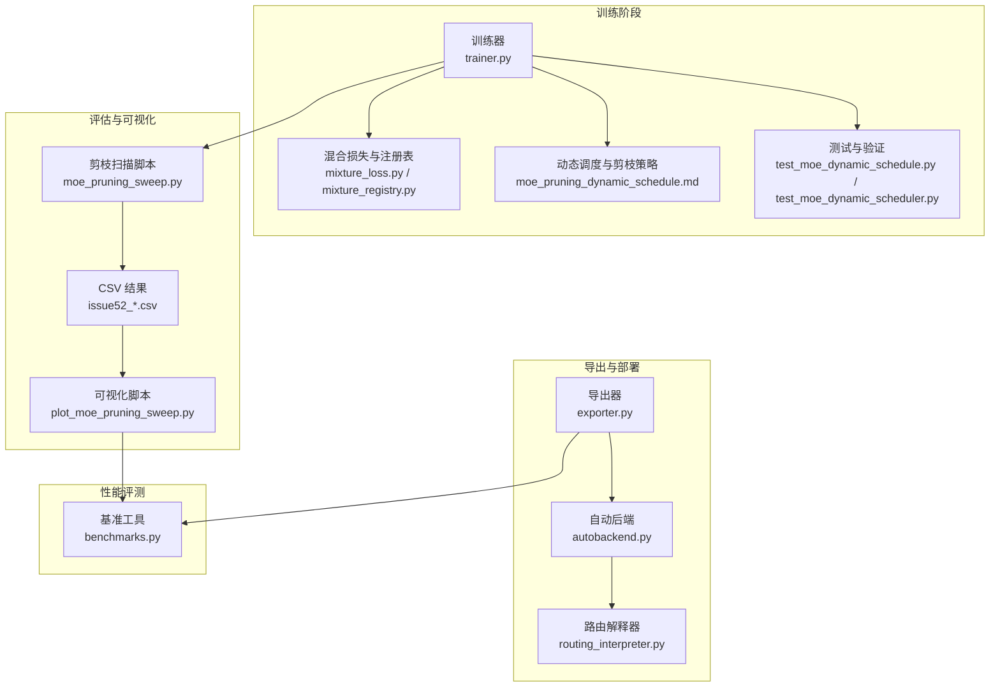
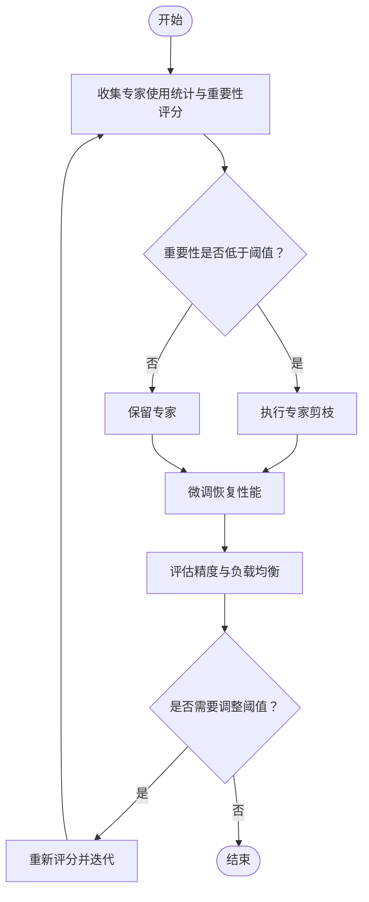
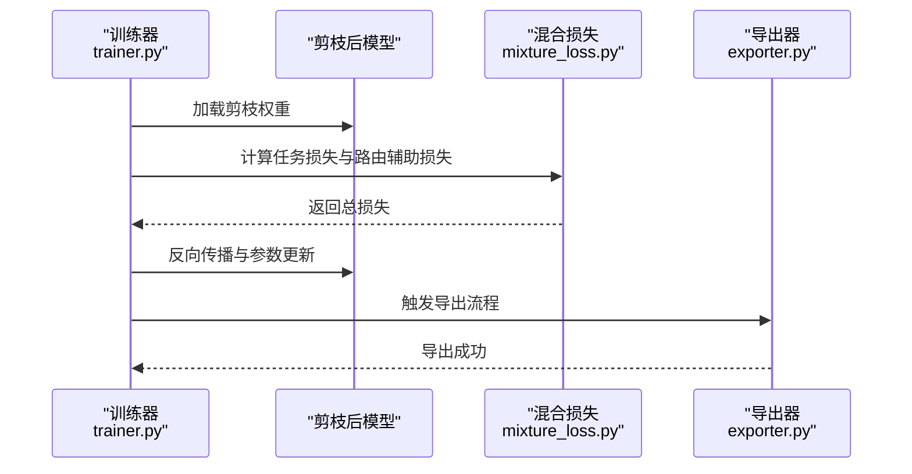
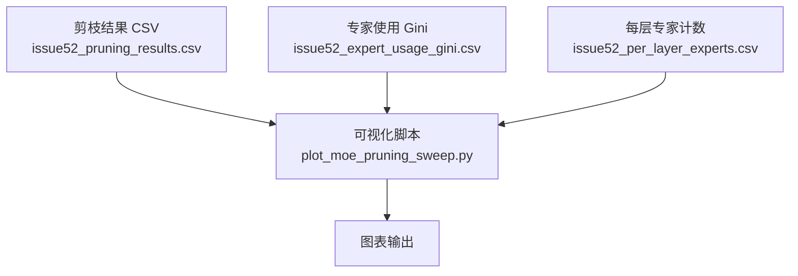
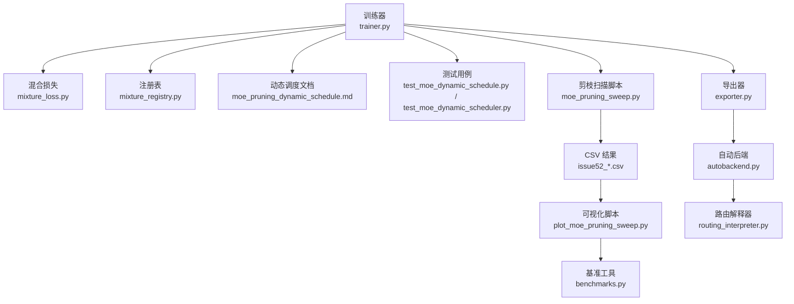

# 模型稀疏化与剪枝

<cite>
**本文引用的文件**
- [moe_pruning_dynamic_schedule.md](file://docs/moe_pruning_dynamic_schedule.md)
- [issue52_pruning_results.csv](file://scripts/issue52_pruning_results.csv)
- [issue52_expert_usage_gini.csv](file://scripts/issue52_expert_usage_gini.csv)
- [issue52_per_layer_experts.csv](file://scripts/issue52_per_layer_experts.csv)
- [plot_moe_pruning_sweep.py](file://scripts/plot_moe_pruning_sweep.py)
- [moe_pruning_sweep.py](file://scripts/moe_pruning_sweep.py)
- [test_moe_dynamic_scheduler.py](file://tests/test_moe_dynamic_scheduler.py)
- [test_moe_dynamic_schedule.py](file://tests/test_moe_dynamic_schedule.py)
- [mixture_loss.py](file://ultralytics/nn/mixture_loss.py)
- [mixture_registry.py](file://ultralytics/nn/mixture_registry.py)
- [trainer.py](file://ultralytics/engine/trainer.py)
- [exporter.py](file://ultralytics/engine/exporter.py)
- [autobackend.py](file://ultralytics/nn/autobackend.py)
- [routing_interpreter.py](file://ultralytics/utils/routing_interpreter.py)
- [benchmarks.py](file://ultralytics/utils/benchmarks.py)
</cite>

## 目录
1. [简介](#简介)
2. [项目结构](#项目结构)
3. [核心组件](#核心组件)
4. [架构总览](#架构总览)
5. [详细组件分析](#详细组件分析)
6. [依赖关系分析](#依赖关系分析)
7. [性能考量](#性能考量)
8. [故障排查指南](#故障排查指南)
9. [结论](#结论)
10. [附录](#附录)

## 简介
本技术文档围绕 YOLO-Master 的模型稀疏化与剪枝系统，系统化阐述结构化与非结构化剪枝的差异与应用场景，覆盖权重剪枝、通道剪枝与滤波器剪枝；解释渐进式与一次性剪枝策略选择及动态调整机制；深入解析 MoE（Mixture of Experts）架构中的专家剪枝技术，包括专家重要性评估与负载均衡保持；提供剪枝后模型重训练与微调策略；讨论稀疏性对推理性能的影响与优化方法；并给出可视化分析与性能监控指标，以及自定义剪枝算法的开发接口与最佳实践。

## 项目结构
仓库中与“稀疏化与剪枝”直接相关的资源主要分布在以下位置：
- 文档与计划：docs/moe_pruning_dynamic_schedule.md
- 实验脚本与结果：scripts/issue52_*.csv、scripts/moe_pruning_sweep.py、scripts/plot_moe_pruning_sweep.py
- 测试用例：tests/test_moe_dynamic_schedule.py、tests/test_moe_dynamic_scheduler.py
- 核心模块：ultralytics/nn/mixture_loss.py、ultralytics/nn/mixture_registry.py、ultralytics/engine/trainer.py、ultralytics/engine/exporter.py、ultralytics/nn/autobackend.py、ultralytics/utils/routing_interpreter.py、ultralytics/utils/benchmarks.py

```mermaid
graph TB
A["文档<br/>docs/moe_pruning_dynamic_schedule.md"] --> B["MoE 动态调度与剪枝策略"]
C["实验脚本<br/>scripts/moe_pruning_sweep.py"] --> D["剪枝扫描与记录"]
E["可视化脚本<br/>scripts/plot_moe_pruning_sweep.py"] --> F["图表输出"]
G["测试结果<br/>scripts/issue52_*.csv"] --> H["效果对比与统计"]
I["测试用例<br/>tests/test_moe_dynamic_schedule.py"] --> J["动态调度正确性验证"]
K["核心模块<br/>ultralytics/nn/mixture_loss.py"] --> L["路由辅助损失与负载均衡"]
M["核心模块<br/>ultralytics/nn/mixture_registry.py"] --> N["混合专家注册与配置"]
O["训练器<br/>ultralytics/engine/trainer.py"] --> P["训练流程集成"]
Q["导出器<br/>ultralytics/engine/exporter.py"] --> R["导出与部署"]
S["自动后端<br/>ultralytics/nn/autobackend.py"] --> T["运行时适配"]
U["路由解释器<br/>ultralytics/utils/routing_interpreter.py"] --> V["路由可解释性与诊断"]
W["基准工具<br/>ultralytics/utils/benchmarks.py"] --> X["性能评测"]
```

**图示来源**
- [moe_pruning_dynamic_schedule.md:1-200](file://docs/moe_pruning_dynamic_schedule.md#L1-L200)
- [moe_pruning_sweep.py:1-200](file://scripts/moe_pruning_sweep.py#L1-L200)
- [plot_moe_pruning_sweep.py:1-200](file://scripts/plot_moe_pruning_sweep.py#L1-L200)
- [issue52_pruning_results.csv:1-200](file://scripts/issue52_pruning_results.csv#L1-L200)
- [issue52_expert_usage_gini.csv:1-200](file://scripts/issue52_expert_usage_gini.csv#L1-L200)
- [issue52_per_layer_experts.csv:1-200](file://scripts/issue52_per_layer_experts.csv#L1-L200)
- [test_moe_dynamic_schedule.py:1-200](file://tests/test_moe_dynamic_schedule.py#L1-L200)
- [test_moe_dynamic_scheduler.py:1-200](file://tests/test_moe_dynamic_scheduler.py#L1-L200)
- [mixture_loss.py:1-200](file://ultralytics/nn/mixture_loss.py#L1-L200)
- [mixture_registry.py:1-200](file://ultralytics/nn/mixture_registry.py#L1-L200)
- [trainer.py:1-200](file://ultralytics/engine/trainer.py#L1-L200)
- [exporter.py:1-200](file://ultralytics/engine/exporter.py#L1-L200)
- [autobackend.py:1-200](file://ultralytics/nn/autobackend.py#L1-L200)
- [routing_interpreter.py:1-200](file://ultralytics/utils/routing_interpreter.py#L1-L200)
- [benchmarks.py:1-200](file://ultralytics/utils/benchmarks.py#L1-L200)

**章节来源**
- [moe_pruning_dynamic_schedule.md:1-200](file://docs/moe_pruning_dynamic_schedule.md#L1-L200)
- [moe_pruning_sweep.py:1-200](file://scripts/moe_pruning_sweep.py#L1-L200)
- [plot_moe_pruning_sweep.py:1-200](file://scripts/plot_moe_pruning_sweep.py#L1-L200)
- [issue52_pruning_results.csv:1-200](file://scripts/issue52_pruning_results.csv#L1-L200)
- [issue52_expert_usage_gini.csv:1-200](file://scripts/issue52_expert_usage_gini.csv#L1-L200)
- [issue52_per_layer_experts.csv:1-200](file://scripts/issue52_per_layer_experts.csv#L1-L200)
- [test_moe_dynamic_schedule.py:1-200](file://tests/test_moe_dynamic_schedule.py#L1-L200)
- [test_moe_dynamic_scheduler.py:1-200](file://tests/test_moe_dynamic_scheduler.py#L1-L200)
- [mixture_loss.py:1-200](file://ultralytics/nn/mixture_loss.py#L1-L200)
- [mixture_registry.py:1-200](file://ultralytics/nn/mixture_registry.py#L1-L200)
- [trainer.py:1-200](file://ultralytics/engine/trainer.py#L1-L200)
- [exporter.py:1-200](file://ultralytics/engine/exporter.py#L1-L200)
- [autobackend.py:1-200](file://ultralytics/nn/autobackend.py#L1-L200)
- [routing_interpreter.py:1-200](file://ultralytics/utils/routing_interpreter.py#L1-L200)
- [benchmarks.py:1-200](file://ultralytics/utils/benchmarks.py#L1-L200)

## 核心组件
- 动态调度与剪枝策略文档：定义渐进式剪枝、一次性剪枝、动态阈值与负载均衡约束等策略要点。
- 剪枝扫描脚本：支持多组剪枝率与层级的扫描，生成 CSV 结果用于对比。
- 可视化脚本：将扫描结果绘制为图表，便于直观分析不同剪枝方案的效果。
- 测试用例：验证动态调度在训练过程中的行为正确性与稳定性。
- 混合专家相关模块：包含路由辅助损失、负载均衡与注册表，支撑专家剪枝与调度。
- 训练器与导出器：负责训练流程集成与导出部署，确保剪枝后的模型可正常训练与导出。
- 自动后端与路由解释器：提供运行时适配与路由可解释性诊断。
- 基准工具：用于性能评测与延迟/吞吐测量。

**章节来源**
- [moe_pruning_dynamic_schedule.md:1-200](file://docs/moe_pruning_dynamic_schedule.md#L1-L200)
- [moe_pruning_sweep.py:1-200](file://scripts/moe_pruning_sweep.py#L1-L200)
- [plot_moe_pruning_sweep.py:1-200](file://scripts/plot_moe_pruning_sweep.py#L1-L200)
- [test_moe_dynamic_schedule.py:1-200](file://tests/test_moe_dynamic_schedule.py#L1-L200)
- [test_moe_dynamic_scheduler.py:1-200](file://tests/test_moe_dynamic_scheduler.py#L1-L200)
- [mixture_loss.py:1-200](file://ultralytics/nn/mixture_loss.py#L1-L200)
- [mixture_registry.py:1-200](file://ultralytics/nn/mixture_registry.py#L1-L200)
- [trainer.py:1-200](file://ultralytics/engine/trainer.py#L1-L200)
- [exporter.py:1-200](file://ultralytics/engine/exporter.py#L1-L200)
- [autobackend.py:1-200](file://ultralytics/nn/autobackend.py#L1-L200)
- [routing_interpreter.py:1-200](file://ultralytics/utils/routing_interpreter.py#L1-L200)
- [benchmarks.py:1-200](file://ultralytics/utils/benchmarks.py#L1-L200)

## 架构总览
下图展示了稀疏化与剪枝系统在训练、评估、导出与部署阶段的整体交互关系。

**图示来源**
- [trainer.py:1-200](file://ultralytics/engine/trainer.py#L1-L200)
- [mixture_loss.py:1-200](file://ultralytics/nn/mixture_loss.py#L1-L200)
- [mixture_registry.py:1-200](file://ultralytics/nn/mixture_registry.py#L1-L200)
- [moe_pruning_dynamic_schedule.md:1-200](file://docs/moe_pruning_dynamic_schedule.md#L1-L200)
- [test_moe_dynamic_schedule.py:1-200](file://tests/test_moe_dynamic_schedule.py#L1-L200)
- [test_moe_dynamic_scheduler.py:1-200](file://tests/test_moe_dynamic_scheduler.py#L1-L200)
- [moe_pruning_sweep.py:1-200](file://scripts/moe_pruning_sweep.py#L1-L200)
- [issue52_pruning_results.csv:1-200](file://scripts/issue52_pruning_results.csv#L1-L200)
- [issue52_expert_usage_gini.csv:1-200](file://scripts/issue52_expert_usage_gini.csv#L1-L200)
- [issue52_per_layer_experts.csv:1-200](file://scripts/issue52_per_layer_experts.csv#L1-L200)
- [plot_moe_pruning_sweep.py:1-200](file://scripts/plot_moe_pruning_sweep.py#L1-L200)
- [exporter.py:1-200](file://ultralytics/engine/exporter.py#L1-L200)
- [autobackend.py:1-200](file://ultralytics/nn/autobackend.py#L1-L200)
- [routing_interpreter.py:1-200](file://ultralytics/utils/routing_interpreter.py#L1-L200)
- [benchmarks.py:1-200](file://ultralytics/utils/benchmarks.py#L1-L200)

## 详细组件分析

### 结构化与非结构化剪枝：区别与应用场景
- 非结构化剪枝（权重级稀疏）
  - 特点：按权重幅值或梯度信息剔除单个参数，形成不规则稀疏矩阵。
  - 优势：压缩率高，易于实现；适合离线压缩与存储优化。
  - 劣势：推理时难以获得显著加速，需要稀疏张量库或定制内核。
  - 适用场景：存储受限、带宽敏感、具备稀疏计算支持的部署环境。
- 结构化剪枝（通道/滤波器级稀疏）
  - 特点：整条通道或滤波器被移除，保持规则张量形状。
  - 优势：推理加速明显，兼容现有硬件与框架。
  - 劣势：压缩率通常低于非结构化剪枝，需更精细的策略以避免精度下降。
  - 适用场景：边缘设备、实时推理、追求端到端加速的场景。

[本节为概念性说明，不直接分析具体文件]

### 渐进式与一次性剪枝：策略选择与动态调整
- 渐进式剪枝
  - 逐步提高剪枝率，配合重训练以恢复精度。
  - 优点：稳定收敛，精度损失可控。
  - 缺点：训练周期长，资源消耗大。
- 一次性剪枝
  - 在预训练模型上一次性应用目标剪枝率，随后进行少量微调。
  - 优点：快速迭代，适合探索不同剪枝率组合。
  - 缺点：可能引发较大精度波动，需更强的微调策略。
- 动态调整机制
  - 基于验证集指标或路由负载分布自适应调整剪枝率或阈值。
  - 结合负载均衡约束，避免某些专家过载或闲置。

**章节来源**
- [moe_pruning_dynamic_schedule.md:1-200](file://docs/moe_pruning_dynamic_schedule.md#L1-L200)
- [test_moe_dynamic_schedule.py:1-200](file://tests/test_moe_dynamic_schedule.py#L1-L200)
- [test_moe_dynamic_scheduler.py:1-200](file://tests/test_moe_dynamic_scheduler.py#L1-L200)

### 权重剪枝、通道剪枝与滤波器剪枝
- 权重剪枝
  - 通过幅值阈值或稀疏正则项筛选重要权重。
  - 常作为非结构化剪枝的基础手段。
- 通道剪枝
  - 依据通道贡献度（如 L1/L2 范数、激活统计）移除冗余通道。
  - 适用于卷积层与注意力层的输入/输出通道。
- 滤波器剪枝
  - 针对卷积核维度进行整核删除，减少计算图规模。
  - 与通道剪枝协同，进一步降低内存占用与计算量。

[本节为概念性说明，不直接分析具体文件]

### MoE 架构中的专家剪枝：重要性评估与负载均衡
- 专家重要性评估
  - 使用路由分配频率、损失贡献、梯度幅度等指标衡量专家重要性。
  - 结合每层专家使用情况统计，识别低效专家。
- 负载均衡保持
  - 引入路由辅助损失，鼓励均衡分配，防止少数专家垄断。
  - 在剪枝过程中维持最低负载阈值，避免单点过载。
- 专家剪枝流程
  - 收集专家使用统计与重要性评分。
  - 设定剪枝比例与保护策略（保留关键专家）。
  - 执行剪枝后进行微调，恢复性能。

**图示来源**
- [mixture_loss.py:1-200](file://ultralytics/nn/mixture_loss.py#L1-L200)
- [mixture_registry.py:1-200](file://ultralytics/nn/mixture_registry.py#L1-L200)
- [issue52_expert_usage_gini.csv:1-200](file://scripts/issue52_expert_usage_gini.csv#L1-L200)
- [issue52_per_layer_experts.csv:1-200](file://scripts/issue52_per_layer_experts.csv#L1-L200)

**章节来源**
- [mixture_loss.py:1-200](file://ultralytics/nn/mixture_loss.py#L1-L200)
- [mixture_registry.py:1-200](file://ultralytics/nn/mixture_registry.py#L1-L200)
- [issue52_expert_usage_gini.csv:1-200](file://scripts/issue52_expert_usage_gini.csv#L1-L200)
- [issue52_per_layer_experts.csv:1-200](file://scripts/issue52_per_layer_experts.csv#L1-L200)

### 剪枝后模型的重训练与微调策略
- 重训练
  - 全量参数继续训练，帮助模型适应新的稀疏结构。
  - 学习率退火与早停策略有助于稳定收敛。
- 微调
  - 仅更新部分参数（如头部或适配器），缩短训练时间。
  - 结合路由辅助损失与负载均衡约束，提升鲁棒性。
- 训练器集成
  - 训练器负责加载剪枝后的模型权重，配置优化器与回调。
  - 导出器确保剪枝后的模型可正确导出至目标格式。

**图示来源**
- [trainer.py:1-200](file://ultralytics/engine/trainer.py#L1-L200)
- [mixture_loss.py:1-200](file://ultralytics/nn/mixture_loss.py#L1-L200)
- [exporter.py:1-200](file://ultralytics/engine/exporter.py#L1-L200)

**章节来源**
- [trainer.py:1-200](file://ultralytics/engine/trainer.py#L1-L200)
- [exporter.py:1-200](file://ultralytics/engine/exporter.py#L1-L200)
- [mixture_loss.py:1-200](file://ultralytics/nn/mixture_loss.py#L1-L200)

### 稀疏性对推理性能的影响与优化方法
- 影响
  - 非结构化稀疏：存储减小但推理加速有限，需稀疏内核支持。
  - 结构化稀疏：计算图缩小，推理加速显著，兼容性更好。
- 优化方法
  - 使用自动后端适配，选择最优执行路径。
  - 结合导出器转换为高效格式（如 ONNX/TensorRT/OpenVINO）。
  - 利用路由解释器进行诊断，定位瓶颈层。
  - 使用基准工具进行延迟与吞吐评测，指导进一步优化。

**章节来源**
- [autobackend.py:1-200](file://ultralytics/nn/autobackend.py#L1-L200)
- [exporter.py:1-200](file://ultralytics/engine/exporter.py#L1-L200)
- [routing_interpreter.py:1-200](file://ultralytics/utils/routing_interpreter.py#L1-L200)
- [benchmarks.py:1-200](file://ultralytics/utils/benchmarks.py#L1-L200)

### 剪枝效果的可视化分析与性能监控指标
- 可视化分析
  - 剪枝扫描结果 CSV 提供多维度数据（如剪枝率、精度、FLOPs）。
  - 可视化脚本将数据绘制为曲线或柱状图，便于对比不同方案。
- 性能监控指标
  - 精度指标：mAP、准确率、召回率等。
  - 效率指标：FLOPs、参数量、延迟、吞吐。
  - 负载均衡指标：专家使用分布、Gini 系数、每层专家计数。

**图示来源**
- [issue52_pruning_results.csv:1-200](file://scripts/issue52_pruning_results.csv#L1-L200)
- [issue52_expert_usage_gini.csv:1-200](file://scripts/issue52_expert_usage_gini.csv#L1-L200)
- [issue52_per_layer_experts.csv:1-200](file://scripts/issue52_per_layer_experts.csv#L1-L200)
- [plot_moe_pruning_sweep.py:1-200](file://scripts/plot_moe_pruning_sweep.py#L1-L200)

**章节来源**
- [issue52_pruning_results.csv:1-200](file://scripts/issue52_pruning_results.csv#L1-L200)
- [issue52_expert_usage_gini.csv:1-200](file://scripts/issue52_expert_usage_gini.csv#L1-L200)
- [issue52_per_layer_experts.csv:1-200](file://scripts/issue52_per_layer_experts.csv#L1-L200)
- [plot_moe_pruning_sweep.py:1-200](file://scripts/plot_moe_pruning_sweep.py#L1-L200)

### 自定义剪枝算法的开发接口与最佳实践
- 开发接口建议
  - 在训练器中插入剪枝钩子，支持在训练前后执行自定义逻辑。
  - 提供统一的剪枝策略抽象类，封装重要性评估、阈值计算与权重更新。
  - 与路由解释器集成，获取专家使用统计与路由分布。
- 最佳实践
  - 先进行小规模扫描，确定合理剪枝率范围。
  - 结合动态调度，根据验证集指标自适应调整剪枝强度。
  - 定期评估负载均衡，避免专家过载或闲置。
  - 导出前进行完整性校验，确保剪枝后的模型可正常推理。

**章节来源**
- [trainer.py:1-200](file://ultralytics/engine/trainer.py#L1-L200)
- [routing_interpreter.py:1-200](file://ultralytics/utils/routing_interpreter.py#L1-L200)
- [moe_pruning_dynamic_schedule.md:1-200](file://docs/moe_pruning_dynamic_schedule.md#L1-L200)

## 依赖关系分析
下图展示关键模块之间的依赖关系，突出剪枝系统与训练、导出、评测的耦合点。

**图示来源**
- [trainer.py:1-200](file://ultralytics/engine/trainer.py#L1-L200)
- [mixture_loss.py:1-200](file://ultralytics/nn/mixture_loss.py#L1-L200)
- [mixture_registry.py:1-200](file://ultralytics/nn/mixture_registry.py#L1-L200)
- [moe_pruning_dynamic_schedule.md:1-200](file://docs/moe_pruning_dynamic_schedule.md#L1-L200)
- [test_moe_dynamic_schedule.py:1-200](file://tests/test_moe_dynamic_schedule.py#L1-L200)
- [test_moe_dynamic_scheduler.py:1-200](file://tests/test_moe_dynamic_scheduler.py#L1-L200)
- [moe_pruning_sweep.py:1-200](file://scripts/moe_pruning_sweep.py#L1-L200)
- [issue52_pruning_results.csv:1-200](file://scripts/issue52_pruning_results.csv#L1-L200)
- [issue52_expert_usage_gini.csv:1-200](file://scripts/issue52_expert_usage_gini.csv#L1-L200)
- [issue52_per_layer_experts.csv:1-200](file://scripts/issue52_per_layer_experts.csv#L1-L200)
- [plot_moe_pruning_sweep.py:1-200](file://scripts/plot_moe_pruning_sweep.py#L1-L200)
- [exporter.py:1-200](file://ultralytics/engine/exporter.py#L1-L200)
- [autobackend.py:1-200](file://ultralytics/nn/autobackend.py#L1-L200)
- [routing_interpreter.py:1-200](file://ultralytics/utils/routing_interpreter.py#L1-L200)
- [benchmarks.py:1-200](file://ultralytics/utils/benchmarks.py#L1-L200)

**章节来源**
- [trainer.py:1-200](file://ultralytics/engine/trainer.py#L1-L200)
- [mixture_loss.py:1-200](file://ultralytics/nn/mixture_loss.py#L1-L200)
- [mixture_registry.py:1-200](file://ultralytics/nn/mixture_registry.py#L1-L200)
- [moe_pruning_dynamic_schedule.md:1-200](file://docs/moe_pruning_dynamic_schedule.md#L1-L200)
- [test_moe_dynamic_schedule.py:1-200](file://tests/test_moe_dynamic_schedule.py#L1-L200)
- [test_moe_dynamic_scheduler.py:1-200](file://tests/test_moe_dynamic_scheduler.py#L1-L200)
- [moe_pruning_sweep.py:1-200](file://scripts/moe_pruning_sweep.py#L1-L200)
- [issue52_pruning_results.csv:1-200](file://scripts/issue52_pruning_results.csv#L1-L200)
- [issue52_expert_usage_gini.csv:1-200](file://scripts/issue52_expert_usage_gini.csv#L1-L200)
- [issue52_per_layer_experts.csv:1-200](file://scripts/issue52_per_layer_experts.csv#L1-L200)
- [plot_moe_pruning_sweep.py:1-200](file://scripts/plot_moe_pruning_sweep.py#L1-L200)
- [exporter.py:1-200](file://ultralytics/engine/exporter.py#L1-L200)
- [autobackend.py:1-200](file://ultralytics/nn/autobackend.py#L1-L200)
- [routing_interpreter.py:1-200](file://ultralytics/utils/routing_interpreter.py#L1-L200)
- [benchmarks.py:1-200](file://ultralytics/utils/benchmarks.py#L1-L200)

## 性能考量
- 稀疏性带来的收益与权衡
  - 非结构化稀疏：存储与带宽节省显著，但推理加速有限。
  - 结构化稀疏：推理加速明显，但需平衡精度与压缩率。
- 硬件与后端适配
  - 选择合适的导出格式与后端，最大化硬件利用率。
  - 利用自动后端选择最优执行路径。
- 监控与调优
  - 使用基准工具进行延迟与吞吐评测。
  - 结合路由解释器诊断瓶颈层，针对性优化。

[本节为通用性能讨论，不直接分析具体文件]

## 故障排查指南
- 常见问题
  - 剪枝后精度骤降：检查剪枝率是否过高，或微调不足。
  - 专家负载失衡：调整路由辅助损失权重或剪枝保护策略。
  - 导出失败：确认剪枝后的模型结构与导出器兼容性。
- 调试步骤
  - 使用路由解释器查看专家使用分布与路由决策。
  - 检查 CSV 结果与可视化图表，定位异常剪枝方案。
  - 运行测试用例验证动态调度与剪枝逻辑的正确性。

**章节来源**
- [routing_interpreter.py:1-200](file://ultralytics/utils/routing_interpreter.py#L1-L200)
- [issue52_pruning_results.csv:1-200](file://scripts/issue52_pruning_results.csv#L1-L200)
- [plot_moe_pruning_sweep.py:1-200](file://scripts/plot_moe_pruning_sweep.py#L1-L200)
- [test_moe_dynamic_schedule.py:1-200](file://tests/test_moe_dynamic_schedule.py#L1-L200)
- [test_moe_dynamic_scheduler.py:1-200](file://tests/test_moe_dynamic_scheduler.py#L1-L200)

## 结论
YOLO-Master 的稀疏化与剪枝系统提供了从策略设计、动态调度、专家剪枝到可视化与性能评测的完整闭环。通过结构化与非结构化剪枝的组合、渐进式与一次性剪枝的策略选择，以及 MoE 专家剪枝的重要性评估与负载均衡保持，可在保证精度的同时显著提升推理效率。结合训练器与导出器的集成、自动后端适配与路由解释器诊断，用户可高效落地剪枝后的模型。

[本节为总结性内容，不直接分析具体文件]

## 附录
- 术语表
  - 非结构化剪枝：按权重粒度剔除参数，形成不规则稀疏。
  - 结构化剪枝：按通道或滤波器粒度剔除，保持规则张量形状。
  - 渐进式剪枝：逐步提高剪枝率，配合重训练恢复精度。
  - 一次性剪枝：一次性应用目标剪枝率，随后微调。
  - 专家剪枝：在 MoE 架构中剔除低效专家，保持负载均衡。
- 参考资源
  - 动态调度与剪枝策略文档
  - 剪枝扫描与可视化脚本
  - 混合损失与注册表模块
  - 训练器、导出器与自动后端
  - 路由解释器与基准工具

[本节为补充信息，不直接分析具体文件]