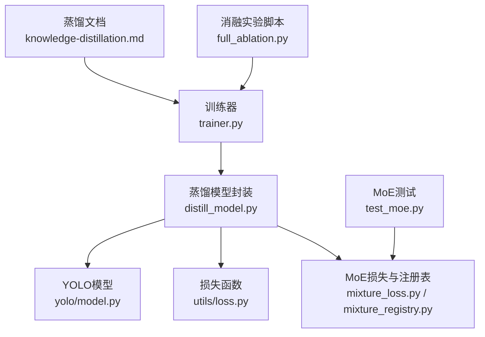
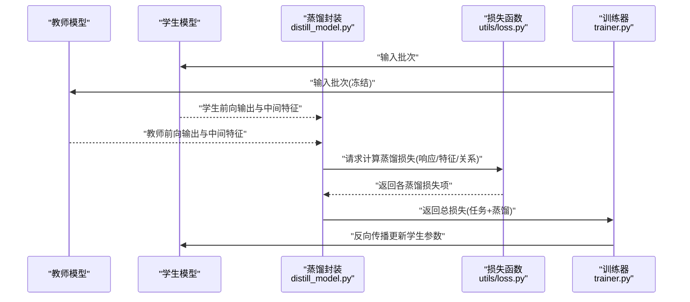
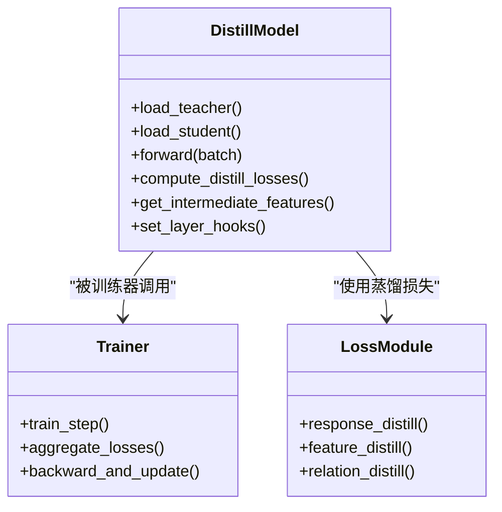
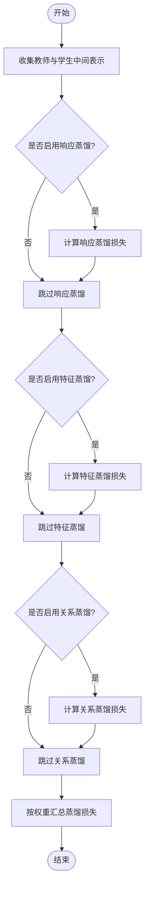
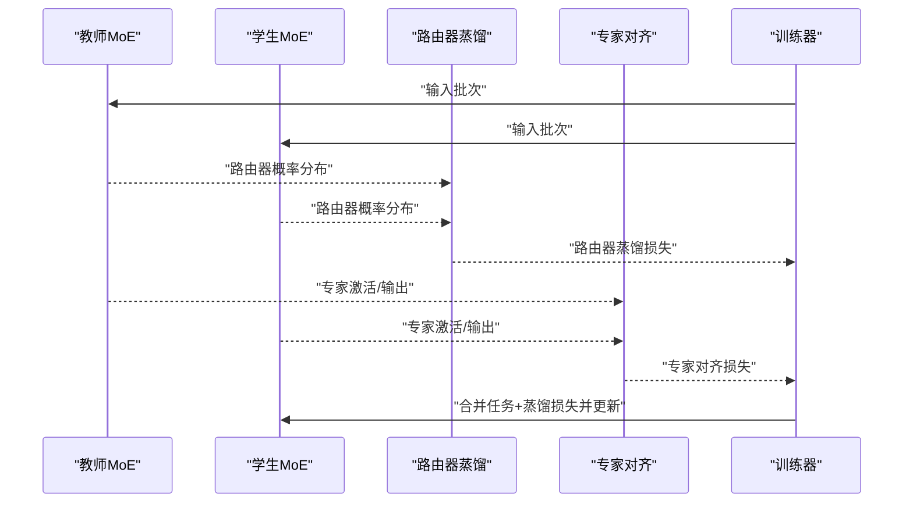
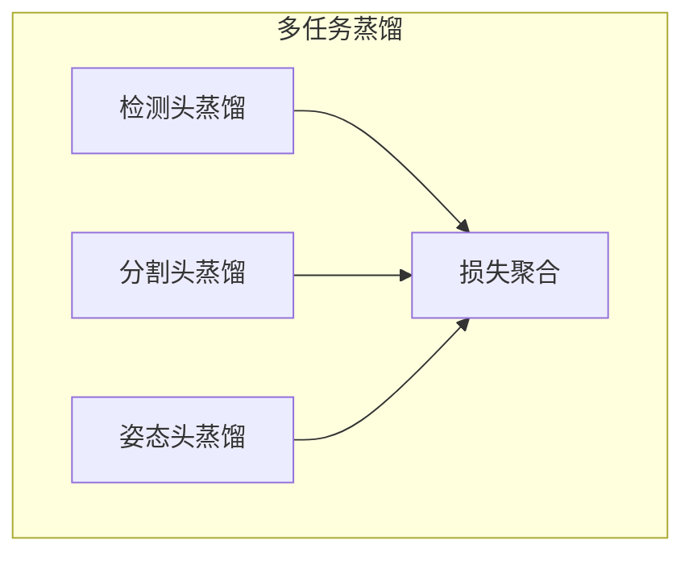
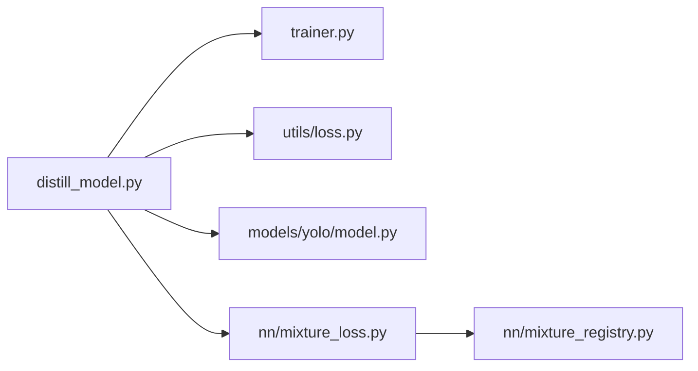

# 知识蒸馏与模型压缩

<cite>
**本文引用的文件**
- [ultralytics/nn/distill_model.py](file://ultralytics/nn/distill_model.py)
- [ultralytics/engine/trainer.py](file://ultralytics/engine/trainer.py)
- [ultralytics/utils/loss.py](file://ultralytics/utils/loss.py)
- [ultralytics/models/yolo/model.py](file://ultralytics/models/yolo/model.py)
- [docs/en/guides/knowledge-distillation.md](file://docs/en/guides/knowledge-distillation.md)
- [ultralytics/nn/mixture_loss.py](file://ultralytics/nn/mixture_loss.py)
- [ultralytics/nn/mixture_registry.py](file://ultralytics/nn/mixture_registry.py)
- [scripts/ablation_suite/full_ablation.py](file://scripts/ablation_suite/full_ablation.py)
- [tests/test_moe.py](file://tests/test_moe.py)
</cite>

## 目录
1. [简介](#简介)
2. [项目结构](#项目结构)
3. [核心组件](#核心组件)
4. [架构总览](#架构总览)
5. [详细组件分析](#详细组件分析)
6. [依赖关系分析](#依赖关系分析)
7. [性能考量](#性能考量)
8. [故障排查指南](#故障排查指南)
9. [结论](#结论)
10. [附录](#附录)

## 简介
本技术文档围绕YOLO-Master的知识蒸馏与模型压缩体系，系统阐述教师-学生训练架构、特征/响应/关系三类蒸馏策略、MoE（混合专家）中的知识迁移与路由器蒸馏优化、多任务联合蒸馏（检测、分割、姿态估计等）、跨规模模型蒸馏配置示例、损失函数设计与超参数调优策略、评估指标与对比分析方法，以及自定义蒸馏算法开发与实验设计建议。文档以仓库现有实现为依据，结合工程化实践给出可操作的指导。

## 项目结构
与知识蒸馏和模型压缩相关的核心代码主要分布在以下位置：
- 蒸馏模型封装与装配：ultralytics/nn/distill_model.py
- 训练流程集成：ultralytics/engine/trainer.py
- 损失函数与蒸馏损失：ultralytics/utils/loss.py
- YOLO模型入口与配置解析：ultralytics/models/yolo/model.py
- MoE相关损失与注册表：ultralytics/nn/mixture_loss.py, ultralytics/nn/mixture_registry.py
- 蒸馏文档说明：docs/en/guides/knowledge-distillation.md
- 蒸馏消融与实验脚本：scripts/ablation_suite/full_ablation.py
- MoE测试用例：tests/test_moe.py

图表来源
- [ultralytics/engine/trainer.py](file://ultralytics/engine/trainer.py)
- [ultralytics/nn/distill_model.py](file://ultralytics/nn/distill_model.py)
- [ultralytics/models/yolo/model.py](file://ultralytics/models/yolo/model.py)
- [ultralytics/utils/loss.py](file://ultralytics/utils/loss.py)
- [ultralytics/nn/mixture_loss.py](file://ultralytics/nn/mixture_loss.py)
- [ultralytics/nn/mixture_registry.py](file://ultralytics/nn/mixture_registry.py)
- [docs/en/guides/knowledge-distillation.md](file://docs/en/guides/knowledge-distillation.md)
- [scripts/ablation_suite/full_ablation.py](file://scripts/ablation_suite/full_ablation.py)
- [tests/test_moe.py](file://tests/test_moe.py)

章节来源
- [ultralytics/nn/distill_model.py](file://ultralytics/nn/distill_model.py)
- [ultralytics/engine/trainer.py](file://ultralytics/engine/trainer.py)
- [ultralytics/utils/loss.py](file://ultralytics/utils/loss.py)
- [ultralytics/models/yolo/model.py](file://ultralytics/models/yolo/model.py)
- [docs/en/guides/knowledge-distillation.md](file://docs/en/guides/knowledge-distillation.md)
- [ultralytics/nn/mixture_loss.py](file://ultralytics/nn/mixture_loss.py)
- [ultralytics/nn/mixture_registry.py](file://ultralytics/nn/mixture_registry.py)
- [scripts/ablation_suite/full_ablation.py](file://scripts/ablation_suite/full_ablation.py)
- [tests/test_moe.py](file://tests/test_moe.py)

## 核心组件
- 蒸馏模型封装：负责将教师与学生模型组合，提取中间层特征、响应输出与关系信息，并计算蒸馏损失。
- 训练器集成：在标准训练循环中注入蒸馏前向、损失聚合与反向传播逻辑。
- 损失函数库：提供响应级、特征级与关系级蒸馏损失的实现与权重调度。
- MoE蒸馏支持：在混合专家场景下对专家知识与路由器决策进行蒸馏优化。
- 多任务蒸馏：面向检测、分割、姿态估计等多任务的统一蒸馏接口与任务特定头对齐。
- 配置与文档：通过配置文件与文档指引完成不同规模模型的蒸馏设置与复现实验。

章节来源
- [ultralytics/nn/distill_model.py](file://ultralytics/nn/distill_model.py)
- [ultralytics/engine/trainer.py](file://ultralytics/engine/trainer.py)
- [ultralytics/utils/loss.py](file://ultralytics/utils/loss.py)
- [ultralytics/nn/mixture_loss.py](file://ultralytics/nn/mixture_loss.py)
- [ultralytics/nn/mixture_registry.py](file://ultralytics/nn/mixture_registry.py)
- [docs/en/guides/knowledge-distillation.md](file://docs/en/guides/knowledge-distillation.md)

## 架构总览
下图展示教师-学生蒸馏的整体数据流与控制流，包括前向传播、中间层对齐、损失聚合与梯度回传路径。

图表来源
- [ultralytics/nn/distill_model.py](file://ultralytics/nn/distill_model.py)
- [ultralytics/utils/loss.py](file://ultralytics/utils/loss.py)
- [ultralytics/engine/trainer.py](file://ultralytics/engine/trainer.py)

## 详细组件分析

### 蒸馏模型封装（教师-学生装配）
- 职责：加载教师与学生模型，建立中间层钩子或访问点，收集教师与学生对应层的特征与响应，调用蒸馏损失模块计算对齐误差。
- 关键流程：
  - 初始化阶段：根据配置选择需要蒸馏的层索引与通道映射策略。
  - 前向阶段：并行执行教师与学生前向，缓存必要中间表示。
  - 损失阶段：按策略组合响应蒸馏、特征蒸馏与关系蒸馏，并与任务损失加权求和。
  - 控制流：由训练器驱动，支持动态权重与学习率调度。

图表来源
- [ultralytics/nn/distill_model.py](file://ultralytics/nn/distill_model.py)
- [ultralytics/engine/trainer.py](file://ultralytics/engine/trainer.py)
- [ultralytics/utils/loss.py](file://ultralytics/utils/loss.py)

章节来源
- [ultralytics/nn/distill_model.py](file://ultralytics/nn/distill_model.py)
- [ultralytics/engine/trainer.py](file://ultralytics/engine/trainer.py)
- [ultralytics/utils/loss.py](file://ultralytics/utils/loss.py)

### 蒸馏策略：响应、特征与关系
- 响应蒸馏：对学生与教师的最终输出（如分类概率、边界框回归量）进行软标签对齐，常用KL散度或MSE。
- 特征蒸馏：对中间层激活进行空间或通道维度的对齐，常采用归一化后的MSE或余弦相似度约束。
- 关系蒸馏：对特征图之间的相关性矩阵（如Gram矩阵）进行匹配，捕获高层语义关系。

图表来源
- [ultralytics/utils/loss.py](file://ultralytics/utils/loss.py)
- [ultralytics/nn/distill_model.py](file://ultralytics/nn/distill_model.py)

章节来源
- [ultralytics/utils/loss.py](file://ultralytics/utils/loss.py)
- [ultralytics/nn/distill_model.py](file://ultralytics/nn/distill_model.py)

### MoE架构中的知识蒸馏
- 专家知识迁移：在MoE训练中，教师模型的不同专家可提供领域特化的表征；学生可通过蒸馏学习路由器的软选择与专家输出的融合策略。
- 路由器蒸馏优化：对教师的路由器概率分布进行监督，使学生路由器学会相似的场景-专家分配模式，提升稀疏性与稳定性。
- 损失组成：除常规任务损失外，加入专家激活对齐与路由器分布对齐的辅助蒸馏项。

图表来源
- [ultralytics/nn/mixture_loss.py](file://ultralytics/nn/mixture_loss.py)
- [ultralytics/nn/mixture_registry.py](file://ultralytics/nn/mixture_registry.py)
- [ultralytics/engine/trainer.py](file://ultralytics/engine/trainer.py)

章节来源
- [ultralytics/nn/mixture_loss.py](file://ultralytics/nn/mixture_loss.py)
- [ultralytics/nn/mixture_registry.py](file://ultralytics/nn/mixture_registry.py)
- [tests/test_moe.py](file://tests/test_moe.py)

### 多任务知识蒸馏（检测、分割、姿态估计）
- 统一接口：在多任务模型中，蒸馏封装对各任务头的输出与中间特征进行统一采集与对齐。
- 任务特定对齐：针对不同任务头的尺度与语义差异，采用适配的归一化与损失形式（如分割掩码的像素级对齐、姿态关键点的热图对齐）。
- 联合训练：在单轮训练中同时优化多个任务的蒸馏损失，并通过权重调度平衡任务贡献。

章节来源
- [ultralytics/nn/distill_model.py](file://ultralytics/nn/distill_model.py)
- [ultralytics/utils/loss.py](file://ultralytics/utils/loss.py)

### 跨规模模型蒸馏配置示例
- 大型预训练到轻量部署：从大参数量教师模型蒸馏至小参数学生模型，重点在于特征通道降维与响应软标签的温度缩放。
- 同构与异构：同构模型可直接层对层对齐；异构模型需引入投影层或自适应池化进行维度匹配。
- 配置要点：指定蒸馏层索引、温度系数、损失权重与正则项；在训练器中启用蒸馏开关与日志记录。

章节来源
- [docs/en/guides/knowledge-distillation.md](file://docs/en/guides/knowledge-distillation.md)
- [ultralytics/models/yolo/model.py](file://ultralytics/models/yolo/model.py)
- [ultralytics/engine/trainer.py](file://ultralytics/engine/trainer.py)

### 损失函数设计与超参数调优
- 损失设计：任务损失与蒸馏损失线性加权；蒸馏内部包含响应、特征、关系三项，可按任务特性调整比例。
- 超参数：温度系数、蒸馏权重、特征对齐正则强度、路由器蒸馏权重（MoE场景）。
- 调优策略：网格搜索或贝叶斯优化；监控验证集指标与训练稳定性（NaN/梯度爆炸），逐步放宽蒸馏权重。

章节来源
- [ultralytics/utils/loss.py](file://ultralytics/utils/loss.py)
- [scripts/ablation_suite/full_ablation.py](file://scripts/ablation_suite/full_ablation.py)

### 评估指标与性能对比
- 精度指标：检测AP、分割mIoU、姿态mAP等任务指标；蒸馏前后对比。
- 效率指标：参数量、FLOPs、推理时延、吞吐；导出后在不同后端（ONNX/TensorRT/OpenVINO）上评测。
- 报告生成：通过基准脚本与可视化脚本汇总结果，形成对比表格与曲线。

章节来源
- [scripts/ablation_suite/full_ablation.py](file://scripts/ablation_suite/full_ablation.py)
- [docs/en/guides/knowledge-distillation.md](file://docs/en/guides/knowledge-distillation.md)

### 自定义蒸馏算法开发指南与实验设计
- 扩展点：在蒸馏封装中插入新的中间层采集逻辑；在损失模块中添加新的蒸馏项；在训练器中注册新损失权重调度。
- 实验设计：基线蒸馏 vs 自定义蒸馏；A/B对比；消融研究（逐项移除响应/特征/关系）；跨数据集泛化性验证。
- 复现与审计：固定随机种子、记录配置与日志、保存中间统计（路由器分布、专家激活直方图）。

章节来源
- [ultralytics/nn/distill_model.py](file://ultralytics/nn/distill_model.py)
- [ultralytics/utils/loss.py](file://ultralytics/utils/loss.py)
- [ultralytics/engine/trainer.py](file://ultralytics/engine/trainer.py)

## 依赖关系分析
- 耦合与内聚：蒸馏封装集中管理教师-学生交互与损失计算，内聚性高；训练器仅负责调度与优化，耦合清晰。
- 外部依赖：损失模块依赖数值稳定工具；MoE蒸馏依赖混合损失与注册表；YOLO模型提供统一的中间层访问接口。
- 潜在循环：避免蒸馏封装直接依赖训练器内部状态，通过接口回调传递损失与日志。

图表来源
- [ultralytics/nn/distill_model.py](file://ultralytics/nn/distill_model.py)
- [ultralytics/engine/trainer.py](file://ultralytics/engine/trainer.py)
- [ultralytics/utils/loss.py](file://ultralytics/utils/loss.py)
- [ultralytics/models/yolo/model.py](file://ultralytics/models/yolo/model.py)
- [ultralytics/nn/mixture_loss.py](file://ultralytics/nn/mixture_loss.py)
- [ultralytics/nn/mixture_registry.py](file://ultralytics/nn/mixture_registry.py)

章节来源
- [ultralytics/nn/distill_model.py](file://ultralytics/nn/distill_model.py)
- [ultralytics/engine/trainer.py](file://ultralytics/engine/trainer.py)
- [ultralytics/utils/loss.py](file://ultralytics/utils/loss.py)
- [ultralytics/models/yolo/model.py](file://ultralytics/models/yolo/model.py)
- [ultralytics/nn/mixture_loss.py](file://ultralytics/nn/mixture_loss.py)
- [ultralytics/nn/mixture_registry.py](file://ultralytics/nn/mixture_registry.py)

## 性能考量
- 内存占用：教师模型通常冻结，但仍需保留中间特征缓存；合理选择蒸馏层数量与通道维度以降低显存压力。
- 计算开销：蒸馏损失多为逐元素或矩阵运算，注意批量大小与设备利用率；必要时采用异步或分块计算。
- 导出与部署：蒸馏后模型应导出为轻量化格式并进行端到端延迟测试；关注算子兼容性与量化友好性。

## 故障排查指南
- NaN与梯度异常：检查蒸馏损失数值范围与温度系数；确认特征归一化与正则项强度。
- 路由器不稳定（MoE）：观察路由器熵与专家使用分布；适当增加路由器蒸馏权重或引入负载均衡辅助损失。
- 多任务不平衡：调整任务损失与蒸馏损失的权重比例；针对困难任务增强数据增强与采样策略。
- 复现问题：固定随机种子、记录完整配置与日志；使用消融脚本逐项验证改动影响。

章节来源
- [ultralytics/utils/loss.py](file://ultralytics/utils/loss.py)
- [ultralytics/nn/mixture_loss.py](file://ultralytics/nn/mixture_loss.py)
- [scripts/ablation_suite/full_ablation.py](file://scripts/ablation_suite/full_ablation.py)

## 结论
YOLO-Master的知识蒸馏与模型压缩体系提供了完整的教师-学生训练框架，覆盖响应、特征与关系三类蒸馏策略，并在MoE与多任务场景中具备可扩展性。通过合理的损失设计与超参数调优，可在保持精度的同时显著降低模型规模与推理成本。建议在实际工程中结合基准评估与消融实验，持续迭代蒸馏策略与部署流程。

## 附录
- 快速上手：参考蒸馏文档与示例脚本，完成基础蒸馏训练与导出。
- 高级定制：基于蒸馏封装与损失模块扩展自定义蒸馏项，配合训练器调度实现复杂实验。
- 资源链接：文档与脚本路径已在“本文引用的文件”中列出，便于定位与复现。