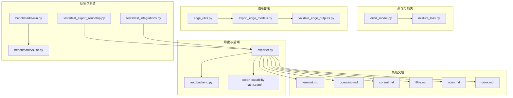
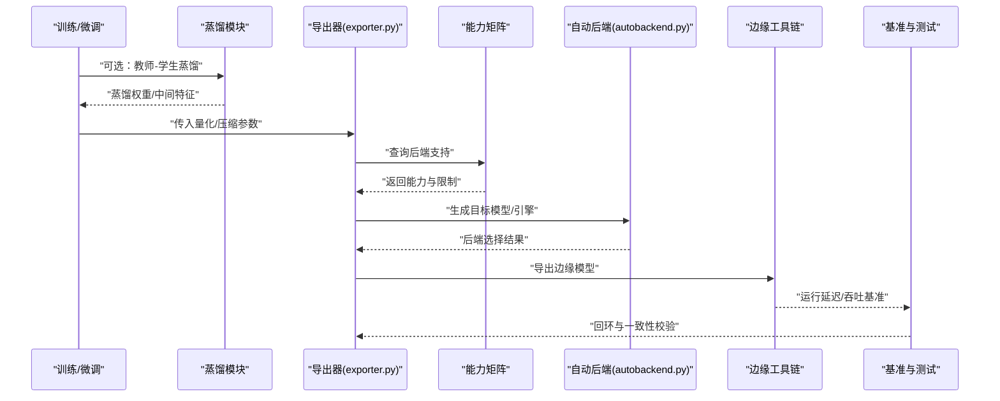
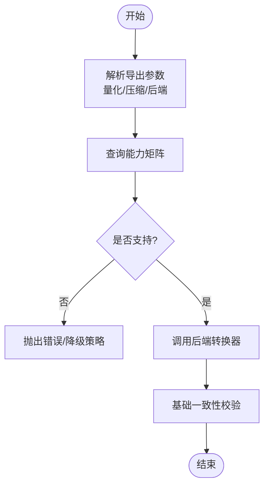
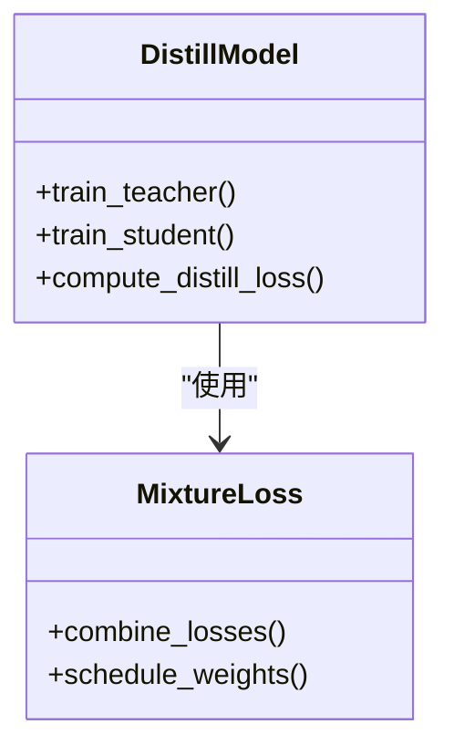
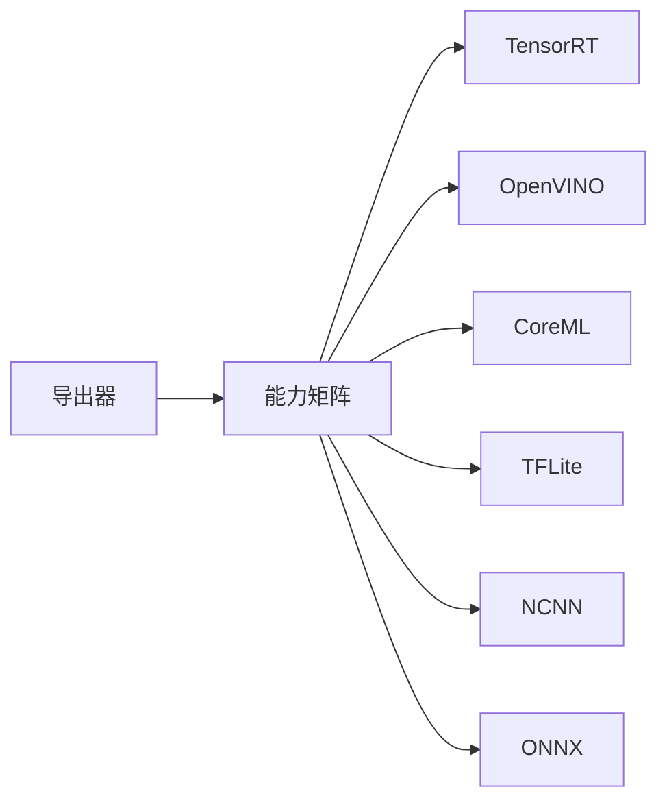
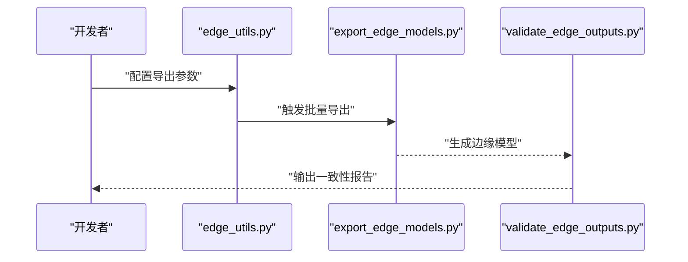
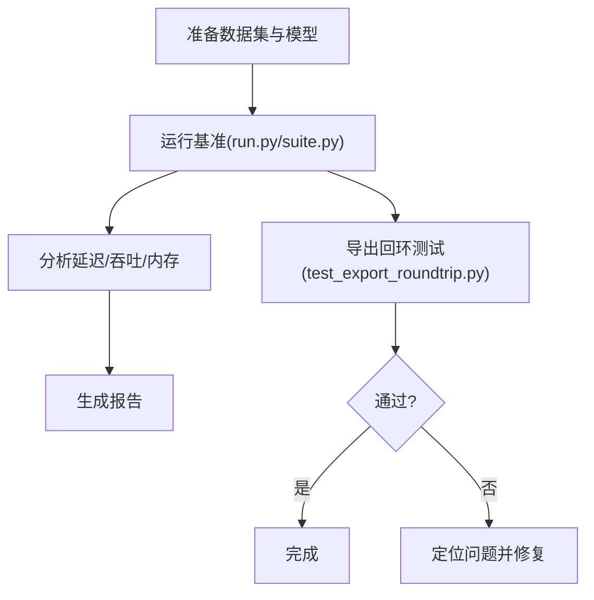
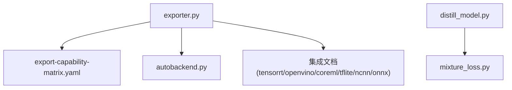

# 量化与压缩

<cite>
**本文引用的文件**
- [exporter.py](file://ultralytics/engine/exporter.py)
- [autobackend.py](file://ultralytics/nn/autobackend.py)
- [distill_model.py](file://ultralytics/nn/distill_model.py)
- [mixture_loss.py](file://ultralytics/nn/mixture_loss.py)
- [knowledge-distillation.md](file://docs/en/guides/knowledge-distillation.md)
- [tensorrt.md](file://docs/en/integrations/tensorrt.md)
- [openvino.md](file://docs/en/integrations/openvino.md)
- [coreml.md](file://docs/en/integrations/coreml.md)
- [tflite.md](file://docs/en/integrations/tflite.md)
- [ncnn.md](file://docs/en/integrations/ncnn.md)
- [onnx.md](file://docs/en/integrations/onnx.md)
- [edge_utils.py](file://examples/YOLO-Master-Edge-Deployment/edge_utils.py)
- [export_edge_models.py](file://examples/YOLO-Master-Edge-Deployment/export_edge_models.py)
- [validate_edge_outputs.py](file://examples/YOLO-Master-Edge-Deployment/validate_edge_outputs.py)
- [benchmark_molora_dispatch.py](file://benchmarks/benchmark_molora_dispatch.py)
- [benchmark_mot_dispatch.py](file://benchmarks/benchmark_mot_dispatch.py)
- [run.py](file://benchmarks/run.py)
- [suite.py](file://benchmarks/suite.py)
- [test_export_roundtrip.py](file://tests/test_export_roundtrip.py)
- [test_integrations.py](file://tests/test_integrations.py)
- [test_export_capability_matrix.py](file://tests/test_export_capability_matrix.py)
- [export-capability-matrix.yaml](file://ultralytics/cfg/export-capability-matrix.yaml)
- [yolo_master_advanced_modules_analysis.md](file://YOLO-Master-v0708-深度分析报告.md)
</cite>

## 目录
1. [简介](#简介)
2. [项目结构](#项目结构)
3. [核心组件](#核心组件)
4. [架构总览](#架构总览)
5. [详细组件分析](#详细组件分析)
6. [依赖关系分析](#依赖关系分析)
7. [性能考量](#性能考量)
8. [故障排查指南](#故障排查指南)
9. [结论](#结论)
10. [附录](#附录)

## 简介
本技术文档聚焦于 YOLO-Master 的量化与压缩体系，覆盖 INT8 量化（动态、静态、混合精度）、稀疏化与剪枝（结构化与非结构化）、知识蒸馏与教师-学生训练策略、量化感知训练与训练后量化的差异与适用场景、主流后端支持（TensorRT、OpenVINO、CoreML 等）、精度损失评估与校准数据准备、量化后的性能提升与内存占用对比，以及自定义量化算法的开发指南与最佳实践。文档以仓库现有实现为依据，结合导出能力矩阵与集成文档进行系统化说明。

## 项目结构
与量化与压缩相关的代码主要分布在以下位置：
- 引擎导出与自动后端选择：ultralytics/engine/exporter.py、ultralytics/nn/autobackend.py
- 模型蒸馏与辅助损失：ultralytics/nn/distill_model.py、ultralytics/nn/mixture_loss.py
- 导出能力矩阵与集成文档：ultralytics/cfg/export-capability-matrix.yaml、docs/en/integrations/*.md
- 边缘部署示例与验证脚本：examples/YOLO-Master-Edge-Deployment/*
- 基准测试套件：benchmarks/*
- 相关测试用例：tests/test_export_*.py、tests/test_integrations.py

图表来源
- [exporter.py](file://ultralytics/engine/exporter.py)
- [autobackend.py](file://ultralytics/nn/autobackend.py)
- [export-capability-matrix.yaml](file://ultralytics/cfg/export-capability-matrix.yaml)
- [tensorrt.md](file://docs/en/integrations/tensorrt.md)
- [openvino.md](file://docs/en/integrations/openvino.md)
- [coreml.md](file://docs/en/integrations/coreml.md)
- [tflite.md](file://docs/en/integrations/tflite.md)
- [ncnn.md](file://docs/en/integrations/ncnn.md)
- [onnx.md](file://docs/en/integrations/onnx.md)
- [edge_utils.py](file://examples/YOLO-Master-Edge-Deployment/edge_utils.py)
- [export_edge_models.py](file://examples/YOLO-Master-Edge-Deployment/export_edge_models.py)
- [validate_edge_outputs.py](file://examples/YOLO-Master-Edge-Deployment/validate_edge_outputs.py)
- [run.py](file://benchmarks/run.py)
- [suite.py](file://benchmarks/suite.py)
- [test_export_roundtrip.py](file://tests/test_export_roundtrip.py)
- [test_integrations.py](file://tests/test_integrations.py)

章节来源
- [exporter.py](file://ultralytics/engine/exporter.py)
- [autobackend.py](file://ultralytics/nn/autobackend.py)
- [export-capability-matrix.yaml](file://ultralytics/cfg/export-capability-matrix.yaml)
- [knowledge-distillation.md](file://docs/en/guides/knowledge-distillation.md)
- [tensorrt.md](file://docs/en/integrations/tensorrt.md)
- [openvino.md](file://docs/en/integrations/openvino.md)
- [coreml.md](file://docs/en/integrations/coreml.md)
- [tflite.md](file://docs/en/integrations/tflite.md)
- [ncnn.md](file://docs/en/integrations/ncnn.md)
- [onnx.md](file://docs/en/integrations/onnx.md)
- [edge_utils.py](file://examples/YOLO-Master-Edge-Deployment/edge_utils.py)
- [export_edge_models.py](file://examples/YOLO-Master-Edge-Deployment/export_edge_models.py)
- [validate_edge_outputs.py](file://examples/YOLO-Master-Edge-Deployment/validate_edge_outputs.py)
- [benchmark_molora_dispatch.py](file://benchmarks/benchmark_molora_dispatch.py)
- [benchmark_mot_dispatch.py](file://benchmarks/benchmark_mot_dispatch.py)
- [run.py](file://benchmarks/run.py)
- [suite.py](file://benchmarks/suite.py)
- [test_export_roundtrip.py](file://tests/test_export_roundtrip.py)
- [test_integrations.py](file://tests/test_integrations.py)
- [test_export_capability_matrix.py](file://tests/test_export_capability_matrix.py)
- [yolo_master_advanced_modules_analysis.md](file://YOLO-Master-v0708-深度分析报告.md)

## 核心组件
- 导出器与自动后端
  - exporter.py：统一导出入口，负责将 PyTorch 模型转换为目标格式（ONNX、TensorRT、OpenVINO、CoreML、TFLite、NCNN 等），并承载量化与压缩参数传递。
  - autobackend.py：运行时自动选择最优后端，根据设备与可用库决定执行路径。
- 蒸馏与混合损失
  - distill_model.py：提供教师-学生蒸馏框架与接口。
  - mixture_loss.py：混合任务/专家损失的组合与调度，可用于多任务或 MoE 场景下的蒸馏与正则化。
- 导出能力矩阵
  - export-capability-matrix.yaml：定义各后端对模型类型、输入形状、量化与压缩能力的支持矩阵，用于导出前预检与兼容性校验。
- 边缘部署与验证
  - edge_utils.py、export_edge_models.py、validate_edge_outputs.py：面向边缘设备的导出流程封装与输出一致性校验。
- 基准与测试
  - benchmarks/*：端到端推理延迟与吞吐基准。
  - tests/test_export_roundtrip.py、tests/test_integrations.py、tests/test_export_capability_matrix.py：导出回环、集成与能力矩阵的回归测试。

章节来源
- [exporter.py](file://ultralytics/engine/exporter.py)
- [autobackend.py](file://ultralytics/nn/autobackend.py)
- [distill_model.py](file://ultralytics/nn/distill_model.py)
- [mixture_loss.py](file://ultralytics/nn/mixture_loss.py)
- [export-capability-matrix.yaml](file://ultralytics/cfg/export-capability-matrix.yaml)
- [edge_utils.py](file://examples/YOLO-Master-Edge-Deployment/edge_utils.py)
- [export_edge_models.py](file://examples/YOLO-Master-Edge-Deployment/export_edge_models.py)
- [validate_edge_outputs.py](file://examples/YOLO-Master-Edge-Deployment/validate_edge_outputs.py)
- [run.py](file://benchmarks/run.py)
- [suite.py](file://benchmarks/suite.py)
- [test_export_roundtrip.py](file://tests/test_export_roundtrip.py)
- [test_integrations.py](file://tests/test_integrations.py)
- [test_export_capability_matrix.py](file://tests/test_export_capability_matrix.py)

## 架构总览
下图展示了从训练到导出的整体流程，包括量化与压缩选项、后端适配与验证环节。

图表来源
- [exporter.py](file://ultralytics/engine/exporter.py)
- [autobackend.py](file://ultralytics/nn/autobackend.py)
- [export-capability-matrix.yaml](file://ultralytics/cfg/export-capability-matrix.yaml)
- [distill_model.py](file://ultralytics/nn/distill_model.py)
- [edge_utils.py](file://examples/YOLO-Master-Edge-Deployment/edge_utils.py)
- [run.py](file://benchmarks/run.py)
- [suite.py](file://benchmarks/suite.py)
- [test_export_roundtrip.py](file://tests/test_export_roundtrip.py)

## 详细组件分析

### 导出器与自动后端
- 职责
  - 统一导出接口：接收模型、输入形状、目标后端与量化/压缩配置，调用相应转换器。
  - 能力预检：依据 export-capability-matrix.yaml 检查目标后端是否支持当前模型与配置。
  - 自动后端选择：在运行时根据设备与可用库选择最优执行路径。
- 关键流程
  - 解析导出参数（包含量化位宽、稀疏化开关、混合精度等）。
  - 查询能力矩阵，确定支持的格式与约束。
  - 调用具体后端转换（如 TensorRT、OpenVINO、CoreML、TFLite、NCNN、ONNX）。
  - 生成可部署产物并进行基本一致性校验。

图表来源
- [exporter.py](file://ultralytics/engine/exporter.py)
- [export-capability-matrix.yaml](file://ultralytics/cfg/export-capability-matrix.yaml)

章节来源
- [exporter.py](file://ultralytics/engine/exporter.py)
- [autobackend.py](file://ultralytics/nn/autobackend.py)
- [export-capability-matrix.yaml](file://ultralytics/cfg/export-capability-matrix.yaml)

### 知识蒸馏与混合损失
- 蒸馏框架
  - distill_model.py 提供教师-学生模型的训练接口，支持中间层特征对齐与输出分布匹配。
  - 可与混合损失 mixture_loss.py 结合，在多任务或 MoE 场景下联合优化。
- 训练策略
  - 教师模型：高精度大模型，作为监督信号源。
  - 学生模型：轻量小模型，通过蒸馏损失逼近教师表现。
  - 混合损失：针对不同任务或专家分支的损失加权与调度，提升稳定性与收敛性。

图表来源
- [distill_model.py](file://ultralytics/nn/distill_model.py)
- [mixture_loss.py](file://ultralytics/nn/mixture_loss.py)

章节来源
- [distill_model.py](file://ultralytics/nn/distill_model.py)
- [mixture_loss.py](file://ultralytics/nn/mixture_loss.py)
- [knowledge-distillation.md](file://docs/en/guides/knowledge-distillation.md)

### 量化与压缩能力矩阵
- 能力矩阵
  - export-capability-matrix.yaml 定义了不同后端对模型类型、输入尺寸、量化与压缩的支持情况。
  - 导出前通过该矩阵进行预检，避免不兼容配置导致的失败。
- 集成文档
  - tensorrt.md、openvino.md、coreml.md、tflite.md、ncnn.md、onnx.md 提供了各后端的安装、配置与使用指南。

图表来源
- [export-capability-matrix.yaml](file://ultralytics/cfg/export-capability-matrix.yaml)
- [tensorrt.md](file://docs/en/integrations/tensorrt.md)
- [openvino.md](file://docs/en/integrations/openvino.md)
- [coreml.md](file://docs/en/integrations/coreml.md)
- [tflite.md](file://docs/en/integrations/tflite.md)
- [ncnn.md](file://docs/en/integrations/ncnn.md)
- [onnx.md](file://docs/en/integrations/onnx.md)

章节来源
- [export-capability-matrix.yaml](file://ultralytics/cfg/export-capability-matrix.yaml)
- [tensorrt.md](file://docs/en/integrations/tensorrt.md)
- [openvino.md](file://docs/en/integrations/openvino.md)
- [coreml.md](file://docs/en/integrations/coreml.md)
- [tflite.md](file://docs/en/integrations/tflite.md)
- [ncnn.md](file://docs/en/integrations/ncnn.md)
- [onnx.md](file://docs/en/integrations/onnx.md)

### 边缘部署与验证
- 边缘工具链
  - edge_utils.py：封装边缘导出常用操作（如输入预处理、批量导出、路径管理）。
  - export_edge_models.py：面向边缘目标的批量导出脚本。
  - validate_edge_outputs.py：验证边缘模型输出与参考输出的差异，确保一致性。
- 典型流程
  - 准备校准/验证数据集。
  - 执行导出（可选择量化与压缩选项）。
  - 运行一致性校验与基准测试。

图表来源
- [edge_utils.py](file://examples/YOLO-Master-Edge-Deployment/edge_utils.py)
- [export_edge_models.py](file://examples/YOLO-Master-Edge-Deployment/export_edge_models.py)
- [validate_edge_outputs.py](file://examples/YOLO-Master-Edge-Deployment/validate_edge_outputs.py)

章节来源
- [edge_utils.py](file://examples/YOLO-Master-Edge-Deployment/edge_utils.py)
- [export_edge_models.py](file://examples/YOLO-Master-Edge-Deployment/export_edge_models.py)
- [validate_edge_outputs.py](file://examples/YOLO-Master-Edge-Deployment/validate_edge_outputs.py)

### 基准与测试
- 基准套件
  - run.py、suite.py：组织与执行基准任务，测量延迟、吞吐与资源占用。
  - benchmark_molora_dispatch.py、benchmark_mot_dispatch.py：针对特定模块的专项基准。
- 测试用例
  - test_export_roundtrip.py：导出回环测试，确保前后端一致性。
  - test_integrations.py：集成测试，覆盖多后端导入与导出。
  - test_export_capability_matrix.py：能力矩阵的回归测试。

图表来源
- [run.py](file://benchmarks/run.py)
- [suite.py](file://benchmarks/suite.py)
- [benchmark_molora_dispatch.py](file://benchmarks/benchmark_molora_dispatch.py)
- [benchmark_mot_dispatch.py](file://benchmarks/benchmark_mot_dispatch.py)
- [test_export_roundtrip.py](file://tests/test_export_roundtrip.py)
- [test_integrations.py](file://tests/test_integrations.py)
- [test_export_capability_matrix.py](file://tests/test_export_capability_matrix.py)

章节来源
- [run.py](file://benchmarks/run.py)
- [suite.py](file://benchmarks/suite.py)
- [benchmark_molora_dispatch.py](file://benchmarks/benchmark_molora_dispatch.py)
- [benchmark_mot_dispatch.py](file://benchmarks/benchmark_mot_dispatch.py)
- [test_export_roundtrip.py](file://tests/test_export_roundtrip.py)
- [test_integrations.py](file://tests/test_integrations.py)
- [test_export_capability_matrix.py](file://tests/test_export_capability_matrix.py)

## 依赖关系分析
- 组件耦合
  - exporter.py 强依赖 export-capability-matrix.yaml 进行能力预检。
  - autobackend.py 与 exporter.py 协作，在运行时选择最优后端。
  - distill_model.py 与 mixture_loss.py 解耦良好，便于扩展新的蒸馏策略。
- 外部依赖
  - 各后端文档（tensorrt.md、openvino.md、coreml.md、tflite.md、ncnn.md、onnx.md）描述了第三方库的安装与配置要求。
- 潜在循环依赖
  - 导出与后端选择为单向依赖，未见循环引用。
- 接口契约
  - 导出器对外暴露统一的导出函数与参数约定；能力矩阵定义了对各后端的能力契约。

图表来源
- [exporter.py](file://ultralytics/engine/exporter.py)
- [autobackend.py](file://ultralytics/nn/autobackend.py)
- [export-capability-matrix.yaml](file://ultralytics/cfg/export-capability-matrix.yaml)
- [distill_model.py](file://ultralytics/nn/distill_model.py)
- [mixture_loss.py](file://ultralytics/nn/mixture_loss.py)
- [tensorrt.md](file://docs/en/integrations/tensorrt.md)
- [openvino.md](file://docs/en/integrations/openvino.md)
- [coreml.md](file://docs/en/integrations/coreml.md)
- [tflite.md](file://docs/en/integrations/tflite.md)
- [ncnn.md](file://docs/en/integrations/ncnn.md)
- [onnx.md](file://docs/en/integrations/onnx.md)

章节来源
- [exporter.py](file://ultralytics/engine/exporter.py)
- [autobackend.py](file://ultralytics/nn/autobackend.py)
- [export-capability-matrix.yaml](file://ultralytics/cfg/export-capability-matrix.yaml)
- [distill_model.py](file://ultralytics/nn/distill_model.py)
- [mixture_loss.py](file://ultralytics/nn/mixture_loss.py)
- [tensorrt.md](file://docs/en/integrations/tensorrt.md)
- [openvino.md](file://docs/en/integrations/openvino.md)
- [coreml.md](file://docs/en/integrations/coreml.md)
- [tflite.md](file://docs/en/integrations/tflite.md)
- [ncnn.md](file://docs/en/integrations/ncnn.md)
- [onnx.md](file://docs/en/integrations/onnx.md)

## 性能考量
- 量化与压缩的收益
  - 内存占用：INT8 量化通常显著降低模型体积与显存占用。
  - 推理速度：在支持硬件加速的后端（如 TensorRT、OpenVINO）上可获得明显延迟下降。
  - 精度权衡：需通过校准与蒸馏等手段控制精度损失。
- 基准方法
  - 使用 benchmarks/run.py 与 suite.py 组织端到端基准，记录延迟、吞吐与内存。
  - 使用 validate_edge_outputs.py 进行输出一致性校验，确保量化/压缩未引入偏差。
- 建议
  - 优先在目标后端上进行量化与压缩，以获得更真实的性能收益。
  - 结合知识蒸馏提升学生模型在低比特下的鲁棒性。

[本节为通用指导，不直接分析具体文件]

## 故障排查指南
- 常见问题
  - 导出失败：检查 export-capability-matrix.yaml 中对应后端的能力项，确认模型类型与输入形状受支持。
  - 精度异常：增加校准数据规模，调整量化策略（动态/静态/混合精度），并结合蒸馏恢复精度。
  - 后端不可用：按集成文档安装必要依赖，确认环境版本与驱动兼容。
- 调试手段
  - 使用 test_export_roundtrip.py 进行导出回环测试，定位不一致环节。
  - 使用 test_integrations.py 验证多后端导入/导出链路。
  - 使用 validate_edge_outputs.py 对比边缘模型输出与参考输出。

章节来源
- [export-capability-matrix.yaml](file://ultralytics/cfg/export-capability-matrix.yaml)
- [test_export_roundtrip.py](file://tests/test_export_roundtrip.py)
- [test_integrations.py](file://tests/test_integrations.py)
- [validate_edge_outputs.py](file://examples/YOLO-Master-Edge-Deployment/validate_edge_outputs.py)

## 结论
YOLO-Master 的量化与压缩体系以导出器为核心，结合能力矩阵与自动后端选择，形成从训练到部署的完整闭环。通过知识蒸馏与混合损失增强学生模型的低比特鲁棒性，借助边缘工具链与基准测试保障一致性与性能。建议在目标后端上进行量化与压缩，并以校准与蒸馏为抓手控制精度损失，最终在内存与延迟之间取得平衡。

[本节为总结性内容，不直接分析具体文件]

## 附录

### INT8 量化实现原理与配置方法
- 动态量化
  - 特点：在推理时实时量化激活值，无需离线校准数据。
  - 适用：快速验证与部署受限场景。
  - 配置要点：在后端启用动态量化开关，关注算子支持与数值范围估计。
- 静态量化
  - 特点：基于校准数据集统计激活分布，离线计算缩放因子与零点。
  - 适用：追求更高性能与稳定性的生产环境。
  - 配置要点：准备代表性校准数据，选择合适的校准算法与通道维度。
- 混合精度量化
  - 特点：对不同层或通道采用不同位宽，平衡精度与效率。
  - 适用：对关键层保持较高精度的复杂模型。
  - 配置要点：依据能力矩阵与后端支持，逐层设置位宽策略。

章节来源
- [exporter.py](file://ultralytics/engine/exporter.py)
- [export-capability-matrix.yaml](file://ultralytics/cfg/export-capability-matrix.yaml)
- [tensorrt.md](file://docs/en/integrations/tensorrt.md)
- [openvino.md](file://docs/en/integrations/openvino.md)
- [coreml.md](file://docs/en/integrations/coreml.md)
- [tflite.md](file://docs/en/integrations/tflite.md)
- [ncnn.md](file://docs/en/integrations/ncnn.md)
- [onnx.md](file://docs/en/integrations/onnx.md)

### 模型稀疏化与剪枝技术
- 非结构化剪枝
  - 特点：对单个权重进行零化，减少参数量但可能影响并行度。
  - 适用：需要极致压缩且后端支持稀疏张量的场景。
- 结构化剪枝
  - 特点：按通道/滤波器/层进行整块剪枝，利于硬件加速。
  - 适用：移动端与嵌入式平台，追求速度与内存双优。
- 应用建议
  - 结合导出能力矩阵确认后端对稀疏结构的优化支持。
  - 在蒸馏过程中引入稀疏正则，提升剪枝后精度。

章节来源
- [export-capability-matrix.yaml](file://ultralytics/cfg/export-capability-matrix.yaml)
- [distill_model.py](file://ultralytics/nn/distill_model.py)
- [mixture_loss.py](file://ultralytics/nn/mixture_loss.py)

### 知识蒸馏与教师-学生训练策略
- 教师-学生模型
  - 教师：高精度大模型，提供软标签与中间特征。
  - 学生：轻量小模型，通过蒸馏损失学习教师行为。
- 训练策略
  - 损失组合：分类损失+蒸馏损失，必要时加入混合损失以稳定训练。
  - 课程学习：逐步提高蒸馏权重，促进收敛。
- 适用场景
  - 低比特量化前的精度恢复。
  - 跨任务迁移与领域自适应。

章节来源
- [distill_model.py](file://ultralytics/nn/distill_model.py)
- [mixture_loss.py](file://ultralytics/nn/mixture_loss.py)
- [knowledge-distillation.md](file://docs/en/guides/knowledge-distillation.md)

### 量化感知训练与训练后量化的区别与适用场景
- 量化感知训练（QAT）
  - 特点：在训练中模拟量化噪声，使模型适应低比特表示。
  - 适用：对精度敏感且具备充足算力与数据的场景。
- 训练后量化（PTQ）
  - 特点：在训练完成后进行量化，依赖校准数据。
  - 适用：快速部署与资源受限场景。
- 选择建议
  - 若后端支持 QAT 且时间充裕，优先 QAT。
  - 否则采用 PTQ，并通过蒸馏与混合精度提升效果。

章节来源
- [exporter.py](file://ultralytics/engine/exporter.py)
- [export-capability-matrix.yaml](file://ultralytics/cfg/export-capability-matrix.yaml)
- [tensorrt.md](file://docs/en/integrations/tensorrt.md)
- [openvino.md](file://docs/en/integrations/openvino.md)
- [coreml.md](file://docs/en/integrations/coreml.md)
- [tflite.md](file://docs/en/integrations/tflite.md)
- [ncnn.md](file://docs/en/integrations/ncnn.md)
- [onnx.md](file://docs/en/integrations/onnx.md)

### 不同量化后端的支持情况
- TensorRT
  - 优势：GPU 高吞吐，INT8 优化成熟。
  - 注意：需准备校准数据与合适的输入形状。
- OpenVINO
  - 优势：CPU/加速器广泛支持，INT8 工具链完善。
  - 注意：模型图结构与算子需满足 IR 规范。
- CoreML
  - 优势：iOS/macOS 原生优化。
  - 注意：遵循 Apple 生态的模型规格。
- TFLite
  - 优势：移动端与嵌入式友好。
  - 注意：算子支持与量化表需对齐。
- NCNN/ONNX
  - 优势：跨平台与灵活转换。
  - 注意：后端实现差异可能导致性能波动。

章节来源
- [tensorrt.md](file://docs/en/integrations/tensorrt.md)
- [openvino.md](file://docs/en/integrations/openvino.md)
- [coreml.md](file://docs/en/integrations/coreml.md)
- [tflite.md](file://docs/en/integrations/tflite.md)
- [ncnn.md](file://docs/en/integrations/ncnn.md)
- [onnx.md](file://docs/en/integrations/onnx.md)

### 精度损失评估与校准数据准备
- 精度评估
  - 指标：mAP、F1、混淆矩阵、误差分布。
  - 方法：对比量化前后模型在验证集上的表现。
- 校准数据
  - 要求：代表性、多样性、足够样本量。
  - 处理：标准化、去噪、类别均衡。
- 回环测试
  - 使用 test_export_roundtrip.py 验证导出一致性。
  - 使用 validate_edge_outputs.py 对比边缘输出。

章节来源
- [test_export_roundtrip.py](file://tests/test_export_roundtrip.py)
- [validate_edge_outputs.py](file://examples/YOLO-Master-Edge-Deployment/validate_edge_outputs.py)
- [run.py](file://benchmarks/run.py)
- [suite.py](file://benchmarks/suite.py)

### 量化后的性能提升分析与内存占用对比
- 分析方法
  - 延迟：端到端推理时间（ms）。
  - 吞吐：每秒处理样本数（FPS）。
  - 内存：模型文件大小与运行时显存/内存占用。
- 工具
  - benchmarks/run.py、suite.py 组织基准任务。
  - validate_edge_outputs.py 保证输出一致性。
- 报告
  - 生成对比表格与曲线，标注不同后端与量化策略的效果。

章节来源
- [run.py](file://benchmarks/run.py)
- [suite.py](file://benchmarks/suite.py)
- [validate_edge_outputs.py](file://examples/YOLO-Master-Edge-Deployment/validate_edge_outputs.py)

### 自定义量化算法开发指南与最佳实践
- 开发步骤
  - 设计量化策略：位宽分配、通道/层粒度、动态/静态模式。
  - 实现量化算子：在前向与反向传播中插入量化节点。
  - 集成导出器：在 exporter.py 中注册新策略，更新能力矩阵。
  - 编写测试：回环与一致性测试，覆盖边界条件。
- 最佳实践
  - 渐进式量化：先全图再局部调优。
  - 蒸馏辅助：在低比特阶段引入蒸馏损失。
  - 监控数值稳定性：梯度裁剪、EMA 平滑。
  - 持续回归：通过 test_export_capability_matrix.py 与集成测试保障兼容性。

章节来源
- [exporter.py](file://ultralytics/engine/exporter.py)
- [export-capability-matrix.yaml](file://ultralytics/cfg/export-capability-matrix.yaml)
- [test_export_capability_matrix.py](file://tests/test_export_capability_matrix.py)
- [test_integrations.py](file://tests/test_integrations.py)
- [yolo_master_advanced_modules_analysis.md](file://YOLO-Master-v0708-深度分析报告.md)