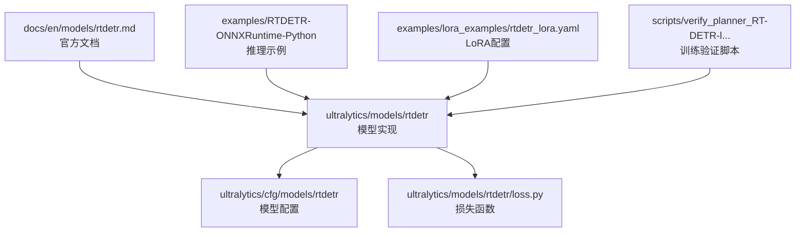
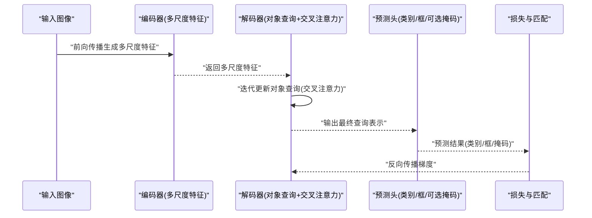
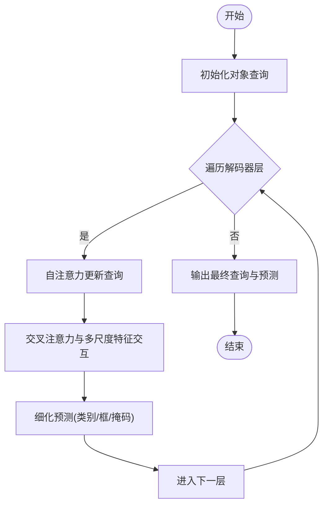
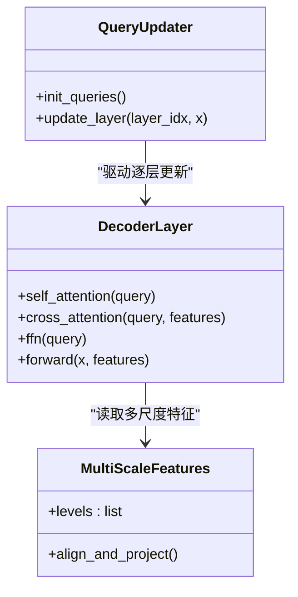
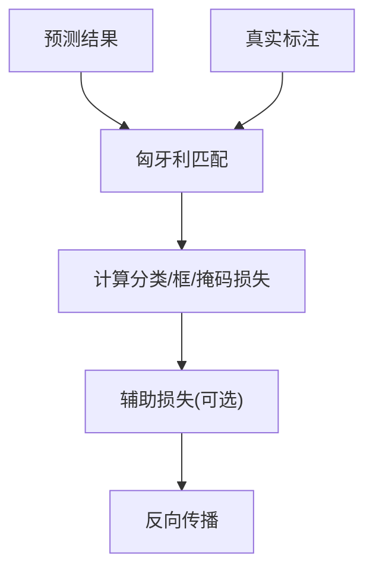
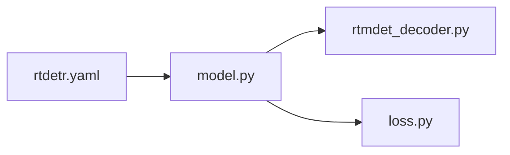

# RT-DETR模型

<cite>
**本文引用的文件**
- [ultralytics/models/rtdetr/model.py](file://ultralytics/models/rtdetr/model.py)
- [ultralytics/models/rtdetr/rtmdet_decoder.py](file://ultralytics/models/rtdetr/rtmdet_decoder.py)
- [ultralytics/models/rtdetr/loss.py](file://ultralytics/models/rtdetr/loss.py)
- [ultralytics/cfg/models/rtdetr/rtdetr.yaml](file://ultralytics/cfg/models/rtdetr/rtdetr.yaml)
- [docs/en/models/rtdetr.md](file://docs/en/models/rtdetr.md)
- [examples/RTDETR-ONNXRuntime-Python/main.py](file://examples/RTDETR-ONNXRuntime-Python/main.py)
- [examples/lora_examples/rtdetr_lora.yaml](file://examples/lora_examples/rtdetr_lora.yaml)
- [scripts/verify_planner_RT-DETR-l Planner+training validation.py](file://scripts/verify_planner_RT-DETR-l Planner+training validation.py)
</cite>

## 目录
1. [简介](#简介)
2. [项目结构](#项目结构)
3. [核心组件](#核心组件)
4. [架构总览](#架构总览)
5. [详细组件分析](#详细组件分析)
6. [依赖关系分析](#依赖关系分析)
7. [性能考量](#性能考量)
8. [故障排查指南](#故障排查指南)
9. [结论](#结论)
10. [附录](#附录)

## 简介
本文件面向希望系统掌握并工程化应用RT-DETR端到端目标检测模型的读者，围绕以下目标展开：
- 解释RT-DETR的端到端架构原理：DETR基础、实时优化与多尺度特征融合。
- 深入解析查询向量设计、交叉注意力模块与高效解码器的工作机制。
- 梳理不同规模RT-DETR模型配置与性能特点。
- 对比YOLO系列在架构与适用场景上的差异。
- 提供训练配置、数据准备与模型导出流程，以及自定义数据集训练示例与优化技巧。
- 展示在实际项目中集成与使用RT-DETR的方法。

## 项目结构
仓库中RT-DETR相关代码主要分布在以下位置：
- 模型定义与实现：ultralytics/models/rtdetr
- 配置文件：ultralytics/cfg/models/rtdetr
- 文档说明：docs/en/models/rtdetr.md
- 推理示例（ONNX Runtime）：examples/RTDETR-ONNXRuntime-Python
- LoRA微调示例：examples/lora_examples/rtdetr_lora.yaml
- 训练验证脚本：scripts/verify_planner_RT-DETR-l Planner+training validation.py

图表来源
- [ultralytics/models/rtdetr/model.py:1-200](file://ultralytics/models/rtdetr/model.py#L1-L200)
- [ultralytics/models/rtdetr/rtmdet_decoder.py:1-200](file://ultralytics/models/rtdetr/rtmdet_decoder.py#L1-L200)
- [ultralytics/models/rtdetr/loss.py:1-200](file://ultralytics/models/rtdetr/loss.py#L1-L200)
- [ultralytics/cfg/models/rtdetr/rtdetr.yaml:1-200](file://ultralytics/cfg/models/rtdetr/rtdetr.yaml#L1-L200)
- [docs/en/models/rtdetr.md:1-200](file://docs/en/models/rtdetr.md#L1-L200)
- [examples/RTDETR-ONNXRuntime-Python/main.py:1-200](file://examples/RTDETR-ONNXRuntime-Python/main.py#L1-L200)
- [examples/lora_examples/rtdetr_lora.yaml:1-200](file://examples/lora_examples/rtdetr_lora.yaml#L1-L200)
- [scripts/verify_planner_RT-DETR-l Planner+training validation.py:1-200](file://scripts/verify_planner_RT-DETR-l Planner+training validation.py#L1-L200)

章节来源
- [ultralytics/models/rtdetr/model.py:1-200](file://ultralytics/models/rtdetr/model.py#L1-L200)
- [ultralytics/cfg/models/rtdetr/rtdetr.yaml:1-200](file://ultralytics/cfg/models/rtdetr/rtdetr.yaml#L1-L200)
- [docs/en/models/rtdetr.md:1-200](file://docs/en/models/rtdetr.md#L1-L200)

## 核心组件
- 编码器-解码器主干：基于Transformer的端到端检测框架，采用多尺度特征输入与可学习对象查询进行直接预测。
- 高效解码器：通过交叉注意力将对象查询与多尺度特征交互，结合去重与匹配策略提升收敛速度与精度。
- 损失与匹配：匈牙利匹配与分类/边界框/掩码等任务损失组合，支持动态正样本分配。
- 配置体系：按规模（n/s/m/l/x）提供统一参数模板，便于快速切换与实验。
- 训练与导出：支持标准训练流程、混合精度、分布式训练与多种导出格式（如ONNX）。

章节来源
- [ultralytics/models/rtdetr/model.py:1-200](file://ultralytics/models/rtdetr/model.py#L1-L200)
- [ultralytics/models/rtdetr/rtmdet_decoder.py:1-200](file://ultralytics/models/rtdetr/rtmdet_decoder.py#L1-L200)
- [ultralytics/models/rtdetr/loss.py:1-200](file://ultralytics/models/rtdetr/loss.py#L1-L200)
- [ultralytics/cfg/models/rtdetr/rtdetr.yaml:1-200](file://ultralytics/cfg/models/rtdetr/rtdetr.yaml#L1-L200)

## 架构总览
RT-DETR采用“编码器-解码器”端到端范式：
- 多尺度特征提取：从骨干网络输出多个分辨率的特征图，增强对小目标和复杂场景的鲁棒性。
- 对象查询：一组可学习的向量作为解码器初始状态，并行迭代更新以捕获全局上下文。
- 交叉注意力：解码器层内对查询与特征进行跨模态交互，聚焦关键区域。
- 高效解码：减少冗余计算与重复检测，配合匹配策略加速收敛。

图表来源
- [ultralytics/models/rtdetr/model.py:1-200](file://ultralytics/models/rtdetr/model.py#L1-L200)
- [ultralytics/models/rtdetr/rtmdet_decoder.py:1-200](file://ultralytics/models/rtdetr/rtmdet_decoder.py#L1-L200)
- [ultralytics/models/rtdetr/loss.py:1-200](file://ultralytics/models/rtdetr/loss.py#L1-L200)

## 详细组件分析

### 查询向量设计与更新机制
- 查询初始化：可学习对象查询作为解码器起点，数量与任务相关。
- 迭代更新：每层解码器通过自注意力和交叉注意力更新查询，逐步细化目标语义与位置信息。
- 去重与稳定：引入抑制或去重策略，避免冗余预测，提高稳定性与速度。

图表来源
- [ultralytics/models/rtdetr/rtmdet_decoder.py:1-200](file://ultralytics/models/rtdetr/rtmdet_decoder.py#L1-L200)
- [ultralytics/models/rtdetr/model.py:1-200](file://ultralytics/models/rtdetr/model.py#L1-L200)

章节来源
- [ultralytics/models/rtdetr/rtmdet_decoder.py:1-200](file://ultralytics/models/rtdetr/rtmdet_decoder.py#L1-L200)
- [ultralytics/models/rtdetr/model.py:1-200](file://ultralytics/models/rtdetr/model.py#L1-L200)

### 交叉注意力模块与多尺度特征融合
- 交叉注意力：查询作为Query，多尺度特征作为Key/Value，使查询能关注到不同尺度的细节与上下文。
- 多尺度融合：通过特征对齐与拼接/投影，将浅层高分辨率与深层强语义特征有效整合。
- 效率优化：选择性注意力或稀疏化策略降低计算量，适配实时需求。

图表来源
- [ultralytics/models/rtdetr/rtmdet_decoder.py:1-200](file://ultralytics/models/rtdetr/rtmdet_decoder.py#L1-L200)
- [ultralytics/models/rtdetr/model.py:1-200](file://ultralytics/models/rtdetr/model.py#L1-L200)

章节来源
- [ultralytics/models/rtdetr/rtmdet_decoder.py:1-200](file://ultralytics/models/rtdetr/rtmdet_decoder.py#L1-L200)
- [ultralytics/models/rtdetr/model.py:1-200](file://ultralytics/models/rtdetr/model.py#L1-L200)

### 损失函数与匹配策略
- 匹配策略：匈牙利匹配用于将预测与真实标注建立一一对应，确保训练稳定性。
- 损失组成：分类损失、边界框回归损失、可选掩码损失；可能包含辅助损失以提升中间层监督。
- 动态正样本：根据置信度或IoU阈值自适应选择正样本，改善小目标与难例训练。

图表来源
- [ultralytics/models/rtdetr/loss.py:1-200](file://ultralytics/models/rtdetr/loss.py#L1-L200)

章节来源
- [ultralytics/models/rtdetr/loss.py:1-200](file://ultralytics/models/rtdetr/loss.py#L1-L200)

### 模型配置与规模特性
- 规模族：n/s/m/l/x等不同尺寸，对应不同的深度、宽度与查询数，平衡精度与速度。
- 关键超参：层数、隐藏维度、注意力头数、查询数量、多尺度特征通道数等。
- 配置模板：通过统一YAML模板管理，便于一键切换与复现实验。

章节来源
- [ultralytics/cfg/models/rtdetr/rtdetr.yaml:1-200](file://ultralytics/cfg/models/rtdetr/rtdetr.yaml#L1-L200)

### 与YOLO系列的架构差异与适用场景
- 架构差异：
  - RT-DETR：端到端Transformer，对象查询+交叉注意力，无需锚点与非极大值抑制。
  - YOLO：基于网格/锚点的卷积式检测，强调速度与工程优化，后处理依赖NMS。
- 适用场景：
  - RT-DETR：需要端到端建模、复杂场景与多尺度融合能力强的任务；对精度要求高且算力充足。
  - YOLO：对延迟敏感、部署资源受限的场景；工业落地成熟度高。

[本节为概念性对比，不直接分析具体文件]

## 依赖关系分析
RT-DETR模块内部依赖关系如下：
- model.py：组装编码器、解码器与预测头，协调训练/推理流程。
- rtmdet_decoder.py：实现高效解码器与查询更新逻辑。
- loss.py：定义匹配与损失计算。
- rtdetr.yaml：提供不同规模的模型配置。

图表来源
- [ultralytics/models/rtdetr/model.py:1-200](file://ultralytics/models/rtdetr/model.py#L1-L200)
- [ultralytics/models/rtdetr/rtmdet_decoder.py:1-200](file://ultralytics/models/rtdetr/rtmdet_decoder.py#L1-L200)
- [ultralytics/models/rtdetr/loss.py:1-200](file://ultralytics/models/rtdetr/loss.py#L1-L200)
- [ultralytics/cfg/models/rtdetr/rtdetr.yaml:1-200](file://ultralytics/cfg/models/rtdetr/rtdetr.yaml#L1-L200)

章节来源
- [ultralytics/models/rtdetr/model.py:1-200](file://ultralytics/models/rtdetr/model.py#L1-L200)
- [ultralytics/models/rtdetr/rtmdet_decoder.py:1-200](file://ultralytics/models/rtdetr/rtmdet_decoder.py#L1-L200)
- [ultralytics/models/rtdetr/loss.py:1-200](file://ultralytics/models/rtdetr/loss.py#L1-L200)
- [ultralytics/cfg/models/rtdetr/rtdetr.yaml:1-200](file://ultralytics/cfg/models/rtdetr/rtdetr.yaml#L1-L200)

## 性能考量
- 查询数量与层数：影响精度与计算开销，需根据任务与硬件权衡。
- 多尺度特征：增加小目标召回但带来额外计算，可通过通道压缩或选择性融合优化。
- 混合精度与分布式：利用AMP与DDP提升训练吞吐与稳定性。
- 导出优化：转换为ONNX/TensorRT等格式，结合算子融合与量化降低延迟。

[本节为通用指导，不直接分析具体文件]

## 故障排查指南
- 训练不稳定：检查学习率、批次大小与标签归一化；确认损失数值范围与梯度裁剪。
- 匹配失败：核对类别映射与边界框坐标格式；调整匹配阈值与正样本策略。
- 导出异常：确认输入形状与动态轴设置；验证导出后端兼容性。
- 推理错误：检查预处理/后处理一致性；确保模型权重与配置版本匹配。

章节来源
- [ultralytics/models/rtdetr/loss.py:1-200](file://ultralytics/models/rtdetr/loss.py#L1-L200)
- [ultralytics/models/rtdetr/model.py:1-200](file://ultralytics/models/rtdetr/model.py#L1-L200)

## 结论
RT-DETR凭借端到端Transformer架构、对象查询与交叉注意力机制，在多尺度特征融合与复杂场景下具备显著优势。通过合理的配置与优化策略，可在精度与速度之间取得良好平衡。与YOLO相比，RT-DETR更适合对精度与建模能力有更高要求的场景，而YOLO则在工程落地与低延迟部署方面更具优势。

[本节为总结性内容，不直接分析具体文件]

## 附录

### 训练配置与数据准备
- 数据格式：遵循YOLO格式组织图像与标注，确保类别索引一致。
- 配置文件：使用rtdetr.yaml指定骨干、解码器与任务参数。
- 训练命令：参考官方文档与示例脚本，启用混合精度与分布式训练。

章节来源
- [docs/en/models/rtdetr.md:1-200](file://docs/en/models/rtdetr.md#L1-L200)
- [ultralytics/cfg/models/rtdetr/rtdetr.yaml:1-200](file://ultralytics/cfg/models/rtdetr/rtdetr.yaml#L1-L200)

### 模型导出流程
- ONNX导出：设置输入形状与动态轴，验证导出模型的前向一致性。
- 推理集成：使用ONNX Runtime加载模型，执行预处理、推理与后处理。

章节来源
- [examples/RTDETR-ONNXRuntime-Python/main.py:1-200](file://examples/RTDETR-ONNXRuntime-Python/main.py#L1-L200)

### 自定义数据集训练示例
- 数据准备：将标注转换为YOLO格式，划分训练/验证集。
- 配置修改：更新类别数与路径，必要时调整查询数与层数以适配数据规模。
- 训练与评估：运行训练脚本，监控损失与指标，进行超参搜索与调优。

章节来源
- [examples/lora_examples/rtdetr_lora.yaml:1-200](file://examples/lora_examples/rtdetr_lora.yaml#L1-L200)
- [scripts/verify_planner_RT-DETR-l Planner+training validation.py:1-200](file://scripts/verify_planner_RT-DETR-l Planner+training validation.py#L1-L200)

### 性能优化技巧
- 数据增强：合理运用Mosaic、MixUp与随机仿射变换提升泛化。
- 正则化：权重衰减、DropPath与标签平滑改善过拟合。
- 推理优化：批量推理、内存复用与算子融合降低延迟。

[本节为通用指导，不直接分析具体文件]