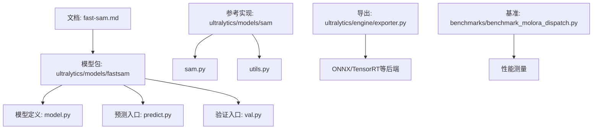
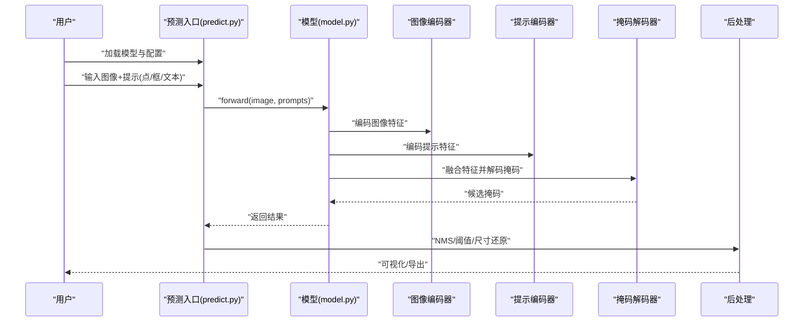
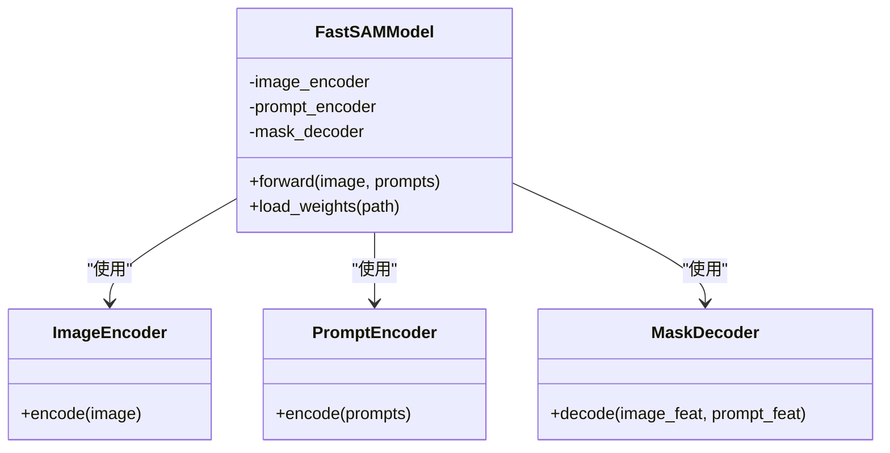
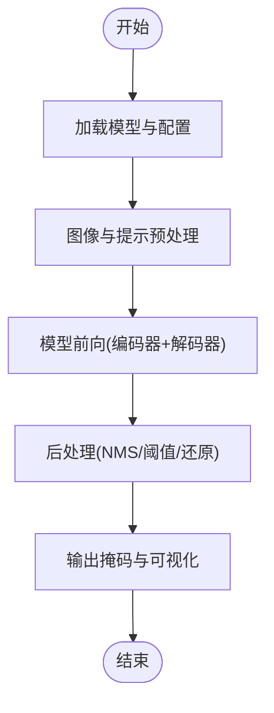
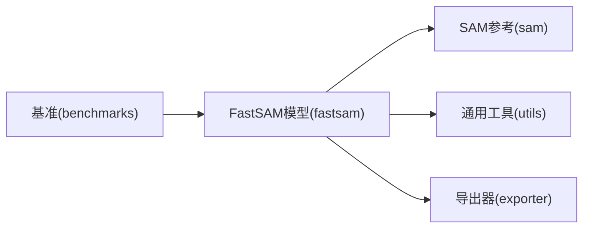

# FastSAM快速实现

<cite>
**本文引用的文件**
- [fast-sam.md](file://docs/en/models/fast-sam.md)
- [__init__.py](file://ultralytics/models/fastsam/__init__.py)
- [model.py](file://ultralytics/models/fastsam/model.py)
- [predict.py](file://ultralytics/models/fastsam/predict.py)
- [val.py](file://ultralytics/models/fastsam/val.py)
- [sam.py](file://ultralytics/models/sam/sam.py)
- [utils.py](file://ultralytics/models/sam/utils.py)
- [exporter.py](file://ultralytics/engine/exporter.py)
- [benchmark_molora_dispatch.py](file://benchmarks/benchmark_molora_dispatch.py)
</cite>

## 目录
1. [简介](#简介)
2. [项目结构](#项目结构)
3. [核心组件](#核心组件)
4. [架构总览](#架构总览)
5. [详细组件分析](#详细组件分析)
6. [依赖关系分析](#依赖关系分析)
7. [性能考量](#性能考量)
8. [故障排查指南](#故障排查指南)
9. [结论](#结论)
10. [附录](#附录)

## 简介
本文件面向希望在资源受限环境中部署“快速分割”模型的用户与工程师，聚焦于FastSAM的快速推理实现。文档从系统架构、关键模块、数据流与处理逻辑出发，解释FastSAM如何在保持SAM质量的同时大幅提升推理速度，涵盖轻量级图像编码器、高效提示处理机制与优化的掩码解码器设计；并讨论模型蒸馏与量化优化策略。同时提供与原始SAM的性能对比维度（推理速度、内存占用、精度损失），以及部署到边缘设备时的最佳实践与代码示例路径。

## 项目结构
FastSAM在仓库中的组织遵循“按任务/模型分目录”的约定：
- 文档说明位于 docs/en/models/fast-sam.md
- 模型定义与推理入口位于 ultralytics/models/fastsam/
- SAM参考实现位于 ultralytics/models/sam/
- 导出与基准工具位于 ultralytics/engine/exporter.py 与 benchmarks/

图表来源
- [fast-sam.md](file://docs/en/models/fast-sam.md)
- [model.py](file://ultralytics/models/fastsam/model.py)
- [predict.py](file://ultralytics/models/fastsam/predict.py)
- [val.py](file://ultralytics/models/fastsam/val.py)
- [sam.py](file://ultralytics/models/sam/sam.py)
- [utils.py](file://ultralytics/models/sam/utils.py)
- [exporter.py](file://ultralytics/engine/exporter.py)
- [benchmark_molora_dispatch.py](file://benchmarks/benchmark_molora_dispatch.py)

章节来源
- [fast-sam.md](file://docs/en/models/fast-sam.md)
- [model.py](file://ultralytics/models/fastsam/model.py)
- [predict.py](file://ultralytics/models/fastsam/predict.py)
- [val.py](file://ultralytics/models/fastsam/val.py)
- [sam.py](file://ultralytics/models/sam/sam.py)
- [utils.py](file://ultralytics/models/sam/utils.py)
- [exporter.py](file://ultralytics/engine/exporter.py)
- [benchmark_molora_dispatch.py](file://benchmarks/benchmark_molora_dispatch.py)

## 核心组件
- 轻量级图像编码器：采用更小的骨干网络或更高效的特征提取路径，降低计算量与显存占用，同时保留足够的语义信息以支撑高质量分割。
- 高效提示处理机制：对点、框、文本等多模态提示进行统一编码与融合，减少冗余计算，提升提示-图像对齐效率。
- 优化的掩码解码器：简化解码分支、减少上采样次数与通道数，结合注意力压缩与并行化策略，提高掩码生成速度。
- 模型蒸馏与量化：通过知识蒸馏将大模型能力迁移至小模型，并结合INT8/混合精度量化进一步压缩体积与加速推理。

章节来源
- [fast-sam.md](file://docs/en/models/fast-sam.md)
- [model.py](file://ultralytics/models/fastsam/model.py)
- [predict.py](file://ultralytics/models/fastsam/predict.py)
- [sam.py](file://ultralytics/models/sam/sam.py)
- [utils.py](file://ultralytics/models/sam/utils.py)

## 架构总览
下图展示FastSAM端到端推理流程：输入图像经轻量编码器得到特征图；提示经过提示编码器并与图像特征融合；解码器输出候选掩码并进行后处理（如NMS、阈值筛选）得到最终结果。

图表来源
- [predict.py](file://ultralytics/models/fastsam/predict.py)
- [model.py](file://ultralytics/models/fastsam/model.py)
- [sam.py](file://ultralytics/models/sam/sam.py)
- [utils.py](file://ultralytics/models/sam/utils.py)

## 详细组件分析

### 模型定义与注册
- 模型类负责组合图像编码器、提示编码器与掩码解码器，并提供统一的forward接口。
- 模型注册与权重加载由包初始化完成，便于外部通过标准API调用。

图表来源
- [model.py](file://ultralytics/models/fastsam/model.py)
- [__init__.py](file://ultralytics/models/fastsam/__init__.py)

章节来源
- [model.py](file://ultralytics/models/fastsam/model.py)
- [__init__.py](file://ultralytics/models/fastsam/__init__.py)

### 预测入口与推理管线
- 预测入口负责解析输入、预处理图像与提示、调用模型前向、执行后处理（如NMS、阈值过滤、坐标还原）。
- 支持批量推理与多提示类型（点、框、文本）的统一处理。

图表来源
- [predict.py](file://ultralytics/models/fastsam/predict.py)
- [utils.py](file://ultralytics/models/sam/utils.py)

章节来源
- [predict.py](file://ultralytics/models/fastsam/predict.py)
- [utils.py](file://ultralytics/models/sam/utils.py)

### 验证与评估
- 验证入口用于在数据集上评估分割指标（如IoU、mAP等），并可对比不同配置下的性能差异。
- 支持导出中间结果以便离线分析与可视化。

章节来源
- [val.py](file://ultralytics/models/fastsam/val.py)

### 与原始SAM的关系
- FastSAM复用SAM的提示编码与解码范式，但替换为更轻量的图像编码器与简化的解码路径，从而在保证质量的前提下显著提速。
- 参考实现位于 sam.py 与 utils.py，可作为理解提示融合与掩码生成的基线。

章节来源
- [sam.py](file://ultralytics/models/sam/sam.py)
- [utils.py](file://ultralytics/models/sam/utils.py)

## 依赖关系分析
FastSAM的依赖主要包含：
- 内部依赖：模型定义、预测与验证入口、SAM参考实现与通用工具。
- 外部依赖：导出器（ONNX/TensorRT等）、基准测试脚本。

图表来源
- [model.py](file://ultralytics/models/fastsam/model.py)
- [predict.py](file://ultralytics/models/fastsam/predict.py)
- [sam.py](file://ultralytics/models/sam/sam.py)
- [utils.py](file://ultralytics/models/sam/utils.py)
- [exporter.py](file://ultralytics/engine/exporter.py)
- [benchmark_molora_dispatch.py](file://benchmarks/benchmark_molora_dispatch.py)

章节来源
- [model.py](file://ultralytics/models/fastsam/model.py)
- [predict.py](file://ultralytics/models/fastsam/predict.py)
- [sam.py](file://ultralytics/models/sam/sam.py)
- [utils.py](file://ultralytics/models/sam/utils.py)
- [exporter.py](file://ultralytics/engine/exporter.py)
- [benchmark_molora_dispatch.py](file://benchmarks/benchmark_molora_dispatch.py)

## 性能考量
- 推理速度：通过轻量编码器与简化解码器，显著降低FLOPs与显存带宽压力；建议结合导出器转换为ONNX/TensorRT以获得更高吞吐。
- 内存占用：减小通道数与层深，配合半精度/整型量化可进一步压缩权重与激活占用。
- 精度损失：在蒸馏阶段引入大模型作为教师，约束小模型的输出分布与中间特征，尽量缩小与原始SAM的精度差距。
- 基准方法：可使用基准脚本在不同硬件上进行延迟与吞吐测量，并记录GPU/CPU利用率与峰值显存。

章节来源
- [exporter.py](file://ultralytics/engine/exporter.py)
- [benchmark_molora_dispatch.py](file://benchmarks/benchmark_molora_dispatch.py)

## 故障排查指南
- 导入错误：确认模型包已正确安装且 __init__.py 中已注册FastSAM模型类。
- 形状不匹配：检查输入图像尺寸与提示格式是否符合模型期望，必要时在预处理阶段进行归一化与缩放。
- 导出失败：确保导出目标后端所需依赖已安装，并核对输入签名与动态轴设置。
- 性能不达预期：尝试启用半精度/整型量化、批大小调整、算子融合与缓存策略。

章节来源
- [__init__.py](file://ultralytics/models/fastsam/__init__.py)
- [predict.py](file://ultralytics/models/fastsam/predict.py)
- [exporter.py](file://ultralytics/engine/exporter.py)

## 结论
FastSAM通过轻量编码器、高效提示处理与优化解码器，在保持接近SAM质量的同时显著提升推理速度。结合蒸馏与量化技术，可在资源受限设备上实现高吞吐、低延迟的实例分割。建议在部署前进行导出与基准测试，并根据目标平台选择合适的后端与量化策略。

## 附录

### 部署与最佳实践
- 导出格式：优先导出为ONNX，再根据目标平台转换为TensorRT、OpenVINO或TFLite。
- 量化策略：优先使用混合精度，若需极致压缩再考虑INT8量化，注意校准集的代表性。
- 批处理：在GPU上合理增大batch size以提升吞吐；CPU场景下避免过大批次导致抖动。
- 提示工程：对复杂场景使用框提示以提高稳定性；文本提示需与训练时保持一致的词汇表与编码方式。
- 监控与回滚：在生产环境记录延迟与精度指标，出现退化时及时回滚到上一稳定版本。

章节来源
- [exporter.py](file://ultralytics/engine/exporter.py)
- [predict.py](file://ultralytics/models/fastsam/predict.py)

### 代码示例路径
- 模型加载与推理：[predict.py](file://ultralytics/models/fastsam/predict.py)
- 模型定义与注册：[model.py](file://ultralytics/models/fastsam/model.py)、[__init__.py](file://ultralytics/models/fastsam/__init__.py)
- 验证与评估：[val.py](file://ultralytics/models/fastsam/val.py)
- 导出与后端集成：[exporter.py](file://ultralytics/engine/exporter.py)
- 基准测试与性能测量：[benchmark_molora_dispatch.py](file://benchmarks/benchmark_molora_dispatch.py)