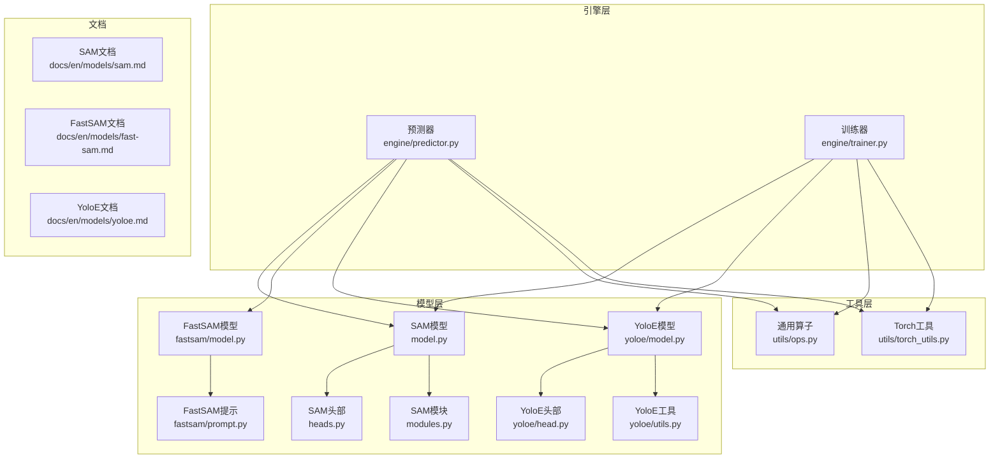
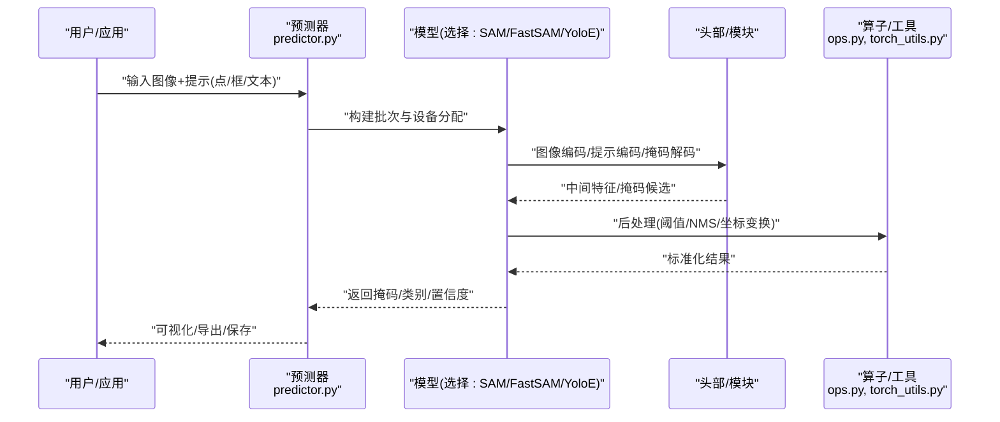
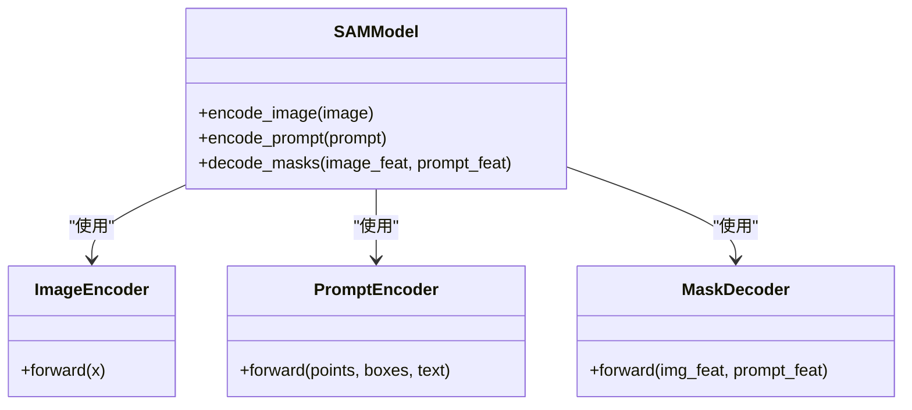
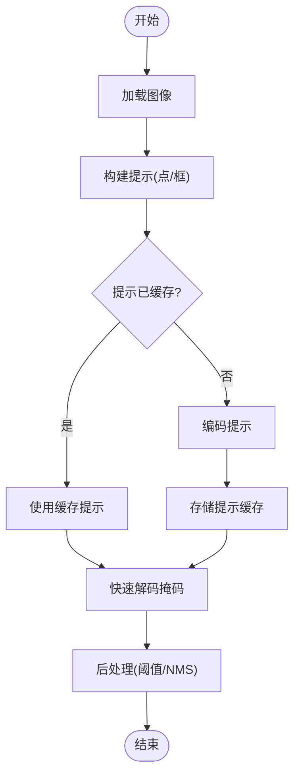
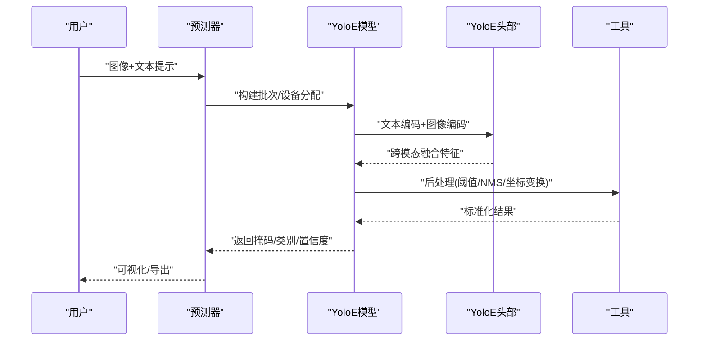
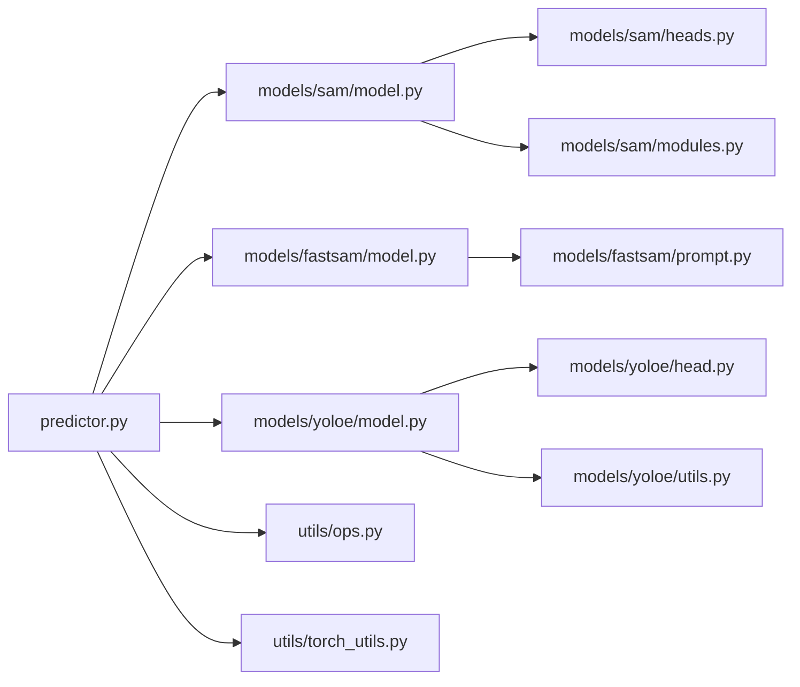

# SAM分割模型

<cite>
**本文引用的文件**
- [ultralytics/models/sam/model.py](file://ultralytics/models/sam/model.py)
- [ultralytics/models/sam/__init__.py](file://ultralytics/models/sam/__init__.py)
- [ultralytics/models/sam/heads.py](file://ultralytics/models/sam/heads.py)
- [ultralytics/models/sam/modules.py](file://ultralytics/models/sam/modules.py)
- [ultralytics/models/fastsam/model.py](file://ultralytics/models/fastsam/model.py)
- [ultralytics/models/fastsam/prompt.py](file://ultralytics/models/fastsam/prompt.py)
- [ultralytics/models/yoloe/model.py](file://ultralytics/models/yoloe/model.py)
- [ultralytics/models/yoloe/head.py](file://ultralytics/models/yoloe/head.py)
- [ultralytics/models/yoloe/utils.py](file://ultralytics/models/yoloe/utils.py)
- [ultralytics/engine/predictor.py](file://ultralytics/engine/predictor.py)
- [ultralytics/engine/trainer.py](file://ultralytics/engine/trainer.py)
- [ultralytics/utils/ops.py](file://ultralytics/utils/ops.py)
- [ultralytics/utils/torch_utils.py](file://ultralytics/utils/torch_utils.py)
- [ultralytics/cfg/default.yaml](file://ultralytics/cfg/default.yaml)
- [docs/en/models/sam.md](file://docs/en/models/sam.md)
- [docs/en/models/fast-sam.md](file://docs/en/models/fast-sam.md)
- [docs/en/models/yoloe.md](file://docs/en/models/yoloe.md)
</cite>

## 目录
1. [简介](#简介)
2. [项目结构](#项目结构)
3. [核心组件](#核心组件)
4. [架构总览](#架构总览)
5. [详细组件分析](#详细组件分析)
6. [依赖关系分析](#依赖关系分析)
7. [性能与内存优化](#性能与内存优化)
8. [故障排查指南](#故障排查指南)
9. [结论](#结论)
10. [附录：提示工程与训练流程](#附录提示工程与训练流程)

## 简介
本文件面向SAM系列分割模型的工程化使用与二次开发，覆盖以下主题：
- Segment Anything Model（SAM）的核心架构：图像编码器、提示编码器、掩码解码器的设计要点与数据流。
- FastSAM的快速分割实现与关键优化策略。
- YoloE系列的零样本分割能力与文本引导分割技术。
- 提示工程实践：点提示、框提示、文本提示等交互方式。
- 实例分割训练流程与自定义任务配置。
- 在应用中的集成方法：交互式分割与批量处理。
- 性能优化技巧与内存管理最佳实践。

## 项目结构
仓库中与SAM系列相关的代码主要分布在以下模块：
- ultralytics/models/sam：SAM模型定义、头部与模块实现。
- ultralytics/models/fastsam：FastSAM快速分割实现与提示处理。
- ultralytics/models/yoloe：YoloE的零样本分割与文本引导分支。
- ultralytics/engine：推理与训练引擎入口，负责加载模型、执行前向与后处理。
- ultralytics/utils：通用算子与工具函数，如张量操作、设备管理等。
- docs/en/models：官方文档，包含SAM、FastSAM、YoloE的使用说明与示例。

图表来源
- [ultralytics/models/sam/model.py](file://ultralytics/models/sam/model.py)
- [ultralytics/models/sam/heads.py](file://ultralytics/models/sam/heads.py)
- [ultralytics/models/sam/modules.py](file://ultralytics/models/sam/modules.py)
- [ultralytics/models/fastsam/model.py](file://ultralytics/models/fastsam/model.py)
- [ultralytics/models/fastsam/prompt.py](file://ultralytics/models/fastsam/prompt.py)
- [ultralytics/models/yoloe/model.py](file://ultralytics/models/yoloe/model.py)
- [ultralytics/models/yoloe/head.py](file://ultralytics/models/yoloe/head.py)
- [ultralytics/models/yoloe/utils.py](file://ultralytics/models/yoloe/utils.py)
- [ultralytics/engine/predictor.py](file://ultralytics/engine/predictor.py)
- [ultralytics/engine/trainer.py](file://ultralytics/engine/trainer.py)
- [ultralytics/utils/ops.py](file://ultralytics/utils/ops.py)
- [ultralytics/utils/torch_utils.py](file://ultralytics/utils/torch_utils.py)
- [docs/en/models/sam.md](file://docs/en/models/sam.md)
- [docs/en/models/fast-sam.md](file://docs/en/models/fast-sam.md)
- [docs/en/models/yoloe.md](file://docs/en/models/yoloe.md)

章节来源
- [docs/en/models/sam.md](file://docs/en/models/sam.md)
- [docs/en/models/fast-sam.md](file://docs/en/models/fast-sam.md)
- [docs/en/models/yoloe.md](file://docs/en/models/yoloe.md)

## 核心组件
- SAM模型
  - 图像编码器：将输入图像编码为多尺度特征图，用于后续提示融合与掩码生成。
  - 提示编码器：支持点、框、文本等多种提示形式，将其映射到与图像特征对齐的提示空间。
  - 掩码解码器：基于图像特征与提示特征进行交叉注意力融合，输出高质量实例掩码。
- FastSAM
  - 通过轻量级提示与高效解码路径实现实时分割；对提示进行预计算与缓存，减少重复计算。
  - 采用更紧凑的解码结构与并行化策略，提升吞吐并降低延迟。
- YoloE
  - 引入文本嵌入分支，实现零样本分割与文本引导分割；结合检测头与分割头完成端到端训练。
  - 提供文本-视觉对齐机制，使模型具备开放词汇分割能力。

章节来源
- [ultralytics/models/sam/model.py](file://ultralytics/models/sam/model.py)
- [ultralytics/models/sam/heads.py](file://ultralytics/models/sam/heads.py)
- [ultralytics/models/sam/modules.py](file://ultralytics/models/sam/modules.py)
- [ultralytics/models/fastsam/model.py](file://ultralytics/models/fastsam/model.py)
- [ultralytics/models/fastsam/prompt.py](file://ultralytics/models/fastsam/prompt.py)
- [ultralytics/models/yoloe/model.py](file://ultralytics/models/yoloe/model.py)
- [ultralytics/models/yoloe/head.py](file://ultralytics/models/yoloe/head.py)
- [ultralytics/models/yoloe/utils.py](file://ultralytics/models/yoloe/utils.py)

## 架构总览
下图展示了SAM、FastSAM与YoloE在推理与训练过程中的整体数据流与组件交互。

图表来源
- [ultralytics/engine/predictor.py](file://ultralytics/engine/predictor.py)
- [ultralytics/models/sam/model.py](file://ultralytics/models/sam/model.py)
- [ultralytics/models/fastsam/model.py](file://ultralytics/models/fastsam/model.py)
- [ultralytics/models/yoloe/model.py](file://ultralytics/models/yoloe/model.py)
- [ultralytics/utils/ops.py](file://ultralytics/utils/ops.py)
- [ultralytics/utils/torch_utils.py](file://ultralytics/utils/torch_utils.py)

## 详细组件分析

### SAM模型分析
- 图像编码器
  - 作用：提取多尺度图像特征，作为掩码解码的基础表示。
  - 关键点：分辨率降采样、通道扩展、跨层融合。
- 提示编码器
  - 支持点提示（单点/多点）、框提示（边界框）、文本提示（可选）。
  - 将离散提示转换为连续向量并与图像特征对齐。
- 掩码解码器
  - 基于交叉注意力融合图像与提示特征，生成高分辨率掩码。
  - 输出包括掩码分数与质量评估，便于后处理筛选。

图表来源
- [ultralytics/models/sam/model.py](file://ultralytics/models/sam/model.py)
- [ultralytics/models/sam/heads.py](file://ultralytics/models/sam/heads.py)
- [ultralytics/models/sam/modules.py](file://ultralytics/models/sam/modules.py)

章节来源
- [ultralytics/models/sam/model.py](file://ultralytics/models/sam/model.py)
- [ultralytics/models/sam/heads.py](file://ultralytics/models/sam/heads.py)
- [ultralytics/models/sam/modules.py](file://ultralytics/models/sam/modules.py)

### FastSAM快速分割分析
- 快速分割实现
  - 通过精简提示与解码路径，显著降低计算开销。
  - 提示预计算与缓存：避免重复编码相同提示。
- 优化策略
  - 并行提示批处理、低精度推理（按需）、算子融合。
  - 动态分辨率与ROI裁剪，聚焦目标区域。

图表来源
- [ultralytics/models/fastsam/model.py](file://ultralytics/models/fastsam/model.py)
- [ultralytics/models/fastsam/prompt.py](file://ultralytics/models/fastsam/prompt.py)

章节来源
- [ultralytics/models/fastsam/model.py](file://ultralytics/models/fastsam/model.py)
- [ultralytics/models/fastsam/prompt.py](file://ultralytics/models/fastsam/prompt.py)

### YoloE零样本分割与文本引导分析
- 零样本分割能力
  - 文本嵌入分支将自然语言描述映射到视觉空间，实现开放词汇分割。
  - 检测头与分割头联合训练，提升定位与掩码质量。
- 文本引导分割技术
  - 文本-视觉对齐损失，增强语义一致性。
  - 提示融合策略：将文本提示与图像特征进行跨模态注意力融合。

图表来源
- [ultralytics/models/yoloe/model.py](file://ultralytics/models/yoloe/model.py)
- [ultralytics/models/yoloe/head.py](file://ultralytics/models/yoloe/head.py)
- [ultralytics/models/yoloe/utils.py](file://ultralytics/models/yoloe/utils.py)
- [ultralytics/engine/predictor.py](file://ultralytics/engine/predictor.py)

章节来源
- [ultralytics/models/yoloe/model.py](file://ultralytics/models/yoloe/model.py)
- [ultralytics/models/yoloe/head.py](file://ultralytics/models/yoloe/head.py)
- [ultralytics/models/yoloe/utils.py](file://ultralytics/models/yoloe/utils.py)

## 依赖关系分析
- 组件耦合
  - 预测器统一封装不同模型的前向逻辑，降低上层调用复杂度。
  - 头部与模块解耦，便于替换与扩展。
- 外部依赖
  - 通用算子与Torch工具提供设备管理、张量操作与数值稳定性保障。
- 潜在循环依赖
  - 当前结构以单向依赖为主，未见明显循环引用。

图表来源
- [ultralytics/engine/predictor.py](file://ultralytics/engine/predictor.py)
- [ultralytics/models/sam/model.py](file://ultralytics/models/sam/model.py)
- [ultralytics/models/fastsam/model.py](file://ultralytics/models/fastsam/model.py)
- [ultralytics/models/yoloe/model.py](file://ultralytics/models/yoloe/model.py)
- [ultralytics/models/sam/heads.py](file://ultralytics/models/sam/heads.py)
- [ultralytics/models/sam/modules.py](file://ultralytics/models/sam/modules.py)
- [ultralytics/models/fastsam/prompt.py](file://ultralytics/models/fastsam/prompt.py)
- [ultralytics/models/yoloe/head.py](file://ultralytics/models/yoloe/head.py)
- [ultralytics/models/yoloe/utils.py](file://ultralytics/models/yoloe/utils.py)
- [ultralytics/utils/ops.py](file://ultralytics/utils/ops.py)
- [ultralytics/utils/torch_utils.py](file://ultralytics/utils/torch_utils.py)

章节来源
- [ultralytics/engine/predictor.py](file://ultralytics/engine/predictor.py)
- [ultralytics/utils/ops.py](file://ultralytics/utils/ops.py)
- [ultralytics/utils/torch_utils.py](file://ultralytics/utils/torch_utils.py)

## 性能与内存优化
- 推理加速
  - 启用混合精度与算子融合（按平台支持情况）。
  - 使用FastSAM的提示缓存与ROI裁剪策略。
  - 批量提示合并与并行解码，提高吞吐。
- 内存管理
  - 及时释放中间张量，避免显存泄漏。
  - 控制批次大小与图像分辨率，平衡速度与质量。
  - 在CPU/GPU间合理迁移权重与中间结果。
- 部署建议
  - 导出为ONNX/TensorRT等格式，结合后端优化。
  - 针对边缘设备调整模型尺寸与量化策略。

[本节为通用指导，不直接分析具体文件]

## 故障排查指南
- 常见问题
  - 提示格式错误：检查点/框/文本提示的维度与范围。
  - 显存不足：减小批次或分辨率，启用梯度检查点（训练时）。
  - 后处理异常：调整阈值与NMS参数，验证坐标归一化。
- 调试建议
  - 打印中间特征形状与统计信息，定位数值不稳定。
  - 使用日志与回调记录关键阶段耗时与资源占用。

章节来源
- [ultralytics/engine/predictor.py](file://ultralytics/engine/predictor.py)
- [ultralytics/utils/ops.py](file://ultralytics/utils/ops.py)
- [ultralytics/utils/torch_utils.py](file://ultralytics/utils/torch_utils.py)

## 结论
本文件系统梳理了SAM、FastSAM与YoloE在仓库中的实现与使用要点，涵盖架构设计、提示工程、训练流程与应用集成。通过合理的优化与内存管理，可在多种场景下获得稳定高效的分割效果。

[本节为总结性内容，不直接分析具体文件]

## 附录：提示工程与训练流程

### 提示工程使用方法
- 点提示
  - 输入单点或多点坐标，适用于细粒度对象定位。
- 框提示
  - 输入边界框，适合粗定位与快速分割。
- 文本提示
  - 输入自然语言描述，用于零样本与开放词汇分割。
- 组合提示
  - 同时使用点与框，或在YoloE中结合文本提示，提升鲁棒性。

章节来源
- [docs/en/models/sam.md](file://docs/en/models/sam.md)
- [docs/en/models/fast-sam.md](file://docs/en/models/fast-sam.md)
- [docs/en/models/yoloe.md](file://docs/en/models/yoloe.md)

### 实例分割训练流程与自定义任务配置
- 训练入口
  - 使用训练器加载数据集与模型，执行迭代优化。
- 配置文件
  - 参考默认配置与任务特定配置，设置数据路径、模型参数与优化器。
- 自定义任务
  - 修改数据加载与标注格式，适配新领域。
  - 调整损失函数与评估指标，满足业务需求。

章节来源
- [ultralytics/engine/trainer.py](file://ultralytics/engine/trainer.py)
- [ultralytics/cfg/default.yaml](file://ultralytics/cfg/default.yaml)