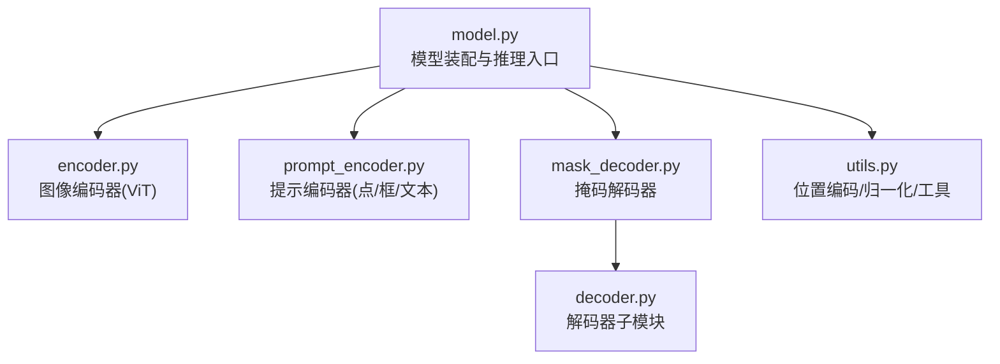
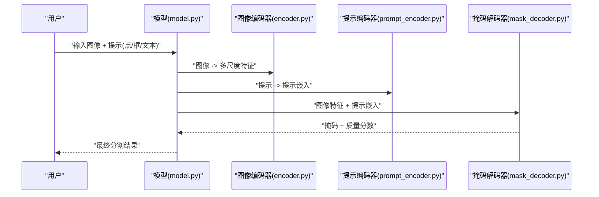
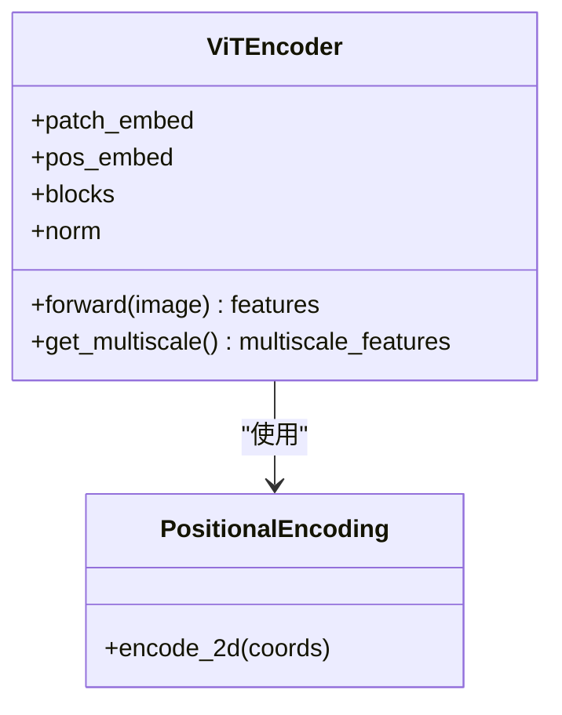
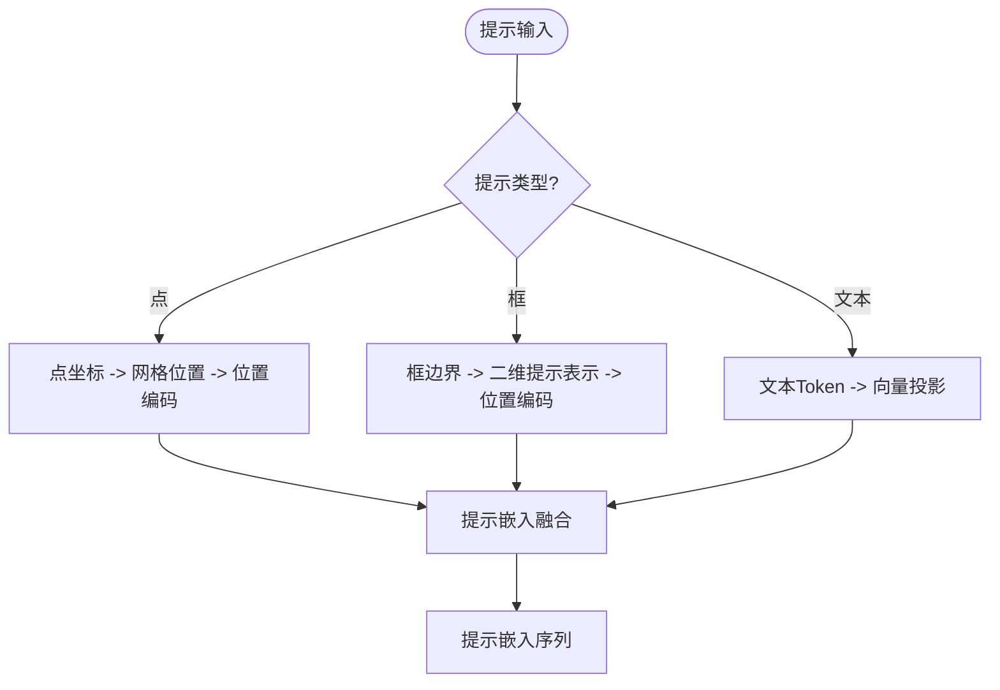
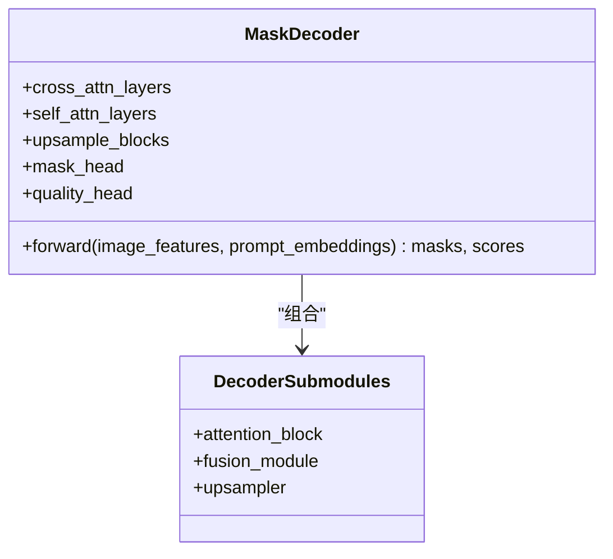
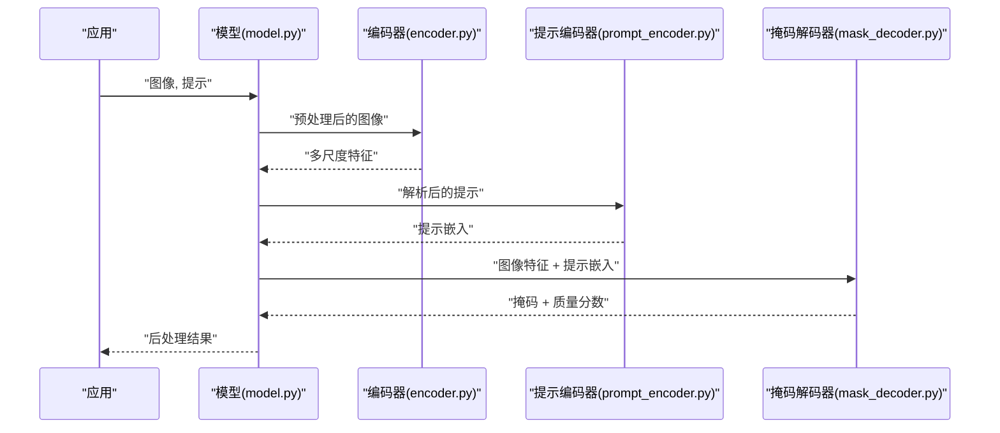
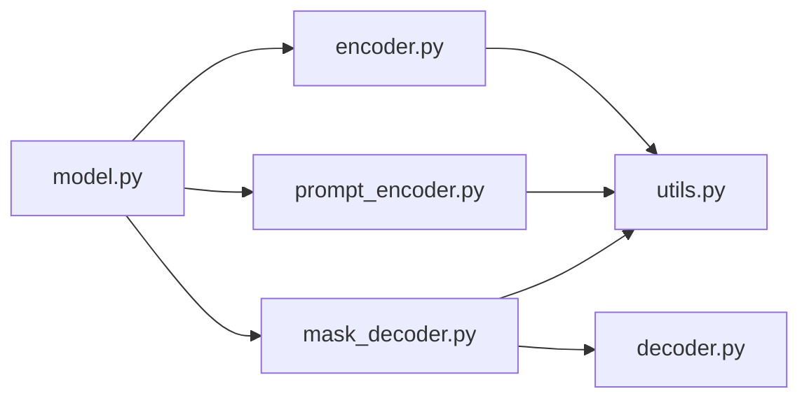

# SAM核心架构

<cite>
**本文引用的文件**
- [ultralytics/models/sam/model.py](file://ultralytics/models/sam/model.py)
- [ultralytics/models/sam/encoder.py](file://ultralytics/models/sam/encoder.py)
- [ultralytics/models/sam/decoder.py](file://ultralytics/models/sam/decoder.py)
- [ultralytics/models/sam/prompt_encoder.py](file://ultralytics/models/sam/prompt_encoder.py)
- [ultralytics/models/sam/utils.py](file://ultralytics/models/sam/utils.py)
- [ultralytics/models/sam/__init__.py](file://ultralytics/models/sam/__init__.py)
- [ultralytics/models/sam/mask_decoder.py](file://ultralytics/models/sam/mask_decoder.py)
</cite>

## 目录
1. [简介](#简介)
2. [项目结构](#项目结构)
3. [核心组件](#核心组件)
4. [架构总览](#架构总览)
5. [详细组件分析](#详细组件分析)
6. [依赖关系分析](#依赖关系分析)
7. [性能与优化](#性能与优化)
8. [故障排查指南](#故障排查指南)
9. [结论](#结论)
10. [附录](#附录)

## 简介
本技术文档聚焦于Segment Anything Model（SAM）在该仓库中的核心实现，围绕三组件架构展开：图像编码器（基于ViT-B/L/H）、提示编码器、掩码解码器。文档深入解释图像特征提取、多尺度特征融合、位置编码等关键技术；阐述提示编码器如何统一处理点、框、文本等多模态用户输入；解析掩码解码器如何生成高质量分割掩码。同时覆盖模型权重初始化、训练策略与推理优化要点，并提供架构图与数据流图帮助理解各组件交互关系。

## 项目结构
SAM相关代码位于 ultralytics/models/sam 目录下，采用“按功能模块拆分”的组织方式：
- model.py：对外暴露的模型封装与推理入口，负责组装编码器、提示编码器与解码器，管理输入输出与后处理。
- encoder.py：图像编码器，包含ViT主干与可选的多尺度特征融合模块。
- prompt_encoder.py：提示编码器，支持点、框、文本等多种提示类型并融合为提示嵌入。
- mask_decoder.py / decoder.py：掩码解码器，将图像特征与提示嵌入融合，迭代细化生成掩码。
- utils.py：通用工具函数（如位置编码、归一化、激活、辅助损失等）。
- __init__.py：包级导出与注册。

图表来源
- [ultralytics/models/sam/model.py](file://ultralytics/models/sam/model.py)
- [ultralytics/models/sam/encoder.py](file://ultralytics/models/sam/encoder.py)
- [ultralytics/models/sam/prompt_encoder.py](file://ultralytics/models/sam/prompt_encoder.py)
- [ultralytics/models/sam/mask_decoder.py](file://ultralytics/models/sam/mask_decoder.py)
- [ultralytics/models/sam/decoder.py](file://ultralytics/models/sam/decoder.py)
- [ultralytics/models/sam/utils.py](file://ultralytics/models/sam/utils.py)

章节来源
- [ultralytics/models/sam/model.py](file://ultralytics/models/sam/model.py)
- [ultralytics/models/sam/encoder.py](file://ultralytics/models/sam/encoder.py)
- [ultralytics/models/sam/prompt_encoder.py](file://ultralytics/models/sam/prompt_encoder.py)
- [ultralytics/models/sam/mask_decoder.py](file://ultralytics/models/sam/mask_decoder.py)
- [ultralytics/models/sam/decoder.py](file://ultralytics/models/sam/decoder.py)
- [ultralytics/models/sam/utils.py](file://ultralytics/models/sam/utils.py)
- [ultralytics/models/sam/__init__.py](file://ultralytics/models/sam/__init__.py)

## 核心组件
- 图像编码器（ViT-B/L/H）
  - 作用：将输入图像转换为深层语义特征图，提供高分辨率与多尺度特征用于后续融合。
  - 关键点：Patch Embedding、多层Transformer Block、层归一化、残差连接、可选多尺度特征输出。
- 提示编码器
  - 作用：将点、框、文本等用户提示编码为统一的提示嵌入序列，并与图像特征对齐。
  - 关键点：点坐标到网格位置的映射、框边界到二维提示表示、文本Token到向量投影、提示位置编码与融合。
- 掩码解码器
  - 作用：以图像特征与提示嵌入为条件，通过交叉注意力与自注意力迭代细化，输出高质量分割掩码。
  - 关键点：跨模态注意力、掩码头、掩码质量评分、多尺度融合与上采样。

章节来源
- [ultralytics/models/sam/encoder.py](file://ultralytics/models/sam/encoder.py)
- [ultralytics/models/sam/prompt_encoder.py](file://ultralytics/models/sam/prompt_encoder.py)
- [ultralytics/models/sam/mask_decoder.py](file://ultralytics/models/sam/mask_decoder.py)
- [ultralytics/models/sam/decoder.py](file://ultralytics/models/sam/decoder.py)
- [ultralytics/models/sam/utils.py](file://ultralytics/models/sam/utils.py)

## 架构总览
下图展示端到端数据流：图像经编码器得到多尺度特征；提示经提示编码器得到提示嵌入；两者在解码器中融合，迭代生成掩码与质量分数。

图表来源
- [ultralytics/models/sam/model.py](file://ultralytics/models/sam/model.py)
- [ultralytics/models/sam/encoder.py](file://ultralytics/models/sam/encoder.py)
- [ultralytics/models/sam/prompt_encoder.py](file://ultralytics/models/sam/prompt_encoder.py)
- [ultralytics/models/sam/mask_decoder.py](file://ultralytics/models/sam/mask_decoder.py)

## 详细组件分析

### 图像编码器（ViT-B/L/H）
- 设计原理
  - 使用Vision Transformer作为主干，将图像切分为Patch并通过线性投影进入Transformer堆叠。
  - 引入层归一化与残差连接提升稳定性与收敛性。
  - 可选多尺度特征输出，便于下游融合与高分辨率细节保留。
- 关键实现要点
  - Patch Embedding与位置编码注入。
  - 多层Transformer Block（多头注意力+前馈网络）。
  - 多尺度特征聚合（例如从不同深度层抽取特征并进行上采样或拼接）。
- 复杂度与内存
  - 时间复杂度随层数与通道数增长；多尺度特征会增加显存占用。
  - 可通过减少层级或通道数进行权衡。
- 优化建议
  - 使用混合精度训练与推理。
  - 对多尺度特征做选择性融合以降低计算量。
  - 缓存中间特征避免重复计算。

图表来源
- [ultralytics/models/sam/encoder.py](file://ultralytics/models/sam/encoder.py)
- [ultralytics/models/sam/utils.py](file://ultralytics/models/sam/utils.py)

章节来源
- [ultralytics/models/sam/encoder.py](file://ultralytics/models/sam/encoder.py)
- [ultralytics/models/sam/utils.py](file://ultralytics/models/sam/utils.py)

### 提示编码器（点、框、文本）
- 设计原理
  - 将多种提示类型统一编码为可融合的提示嵌入序列，以便与图像特征进行跨模态交互。
  - 点提示：将二维坐标映射到特征网格位置，并添加位置编码。
  - 框提示：将左上角与右下角坐标转化为二维提示表示，并加入相对位置信息。
  - 文本提示：通过文本Token编码器（或投影层）将词元映射到与视觉相同的维度空间。
- 关键实现要点
  - 提示类型判别与分支处理。
  - 提示位置编码与提示嵌入融合（拼接/相加）。
  - 输出固定长度的提示嵌入序列供解码器使用。
- 数据流
  - 输入：点集、框集、文本Token序列。
  - 处理：分别编码后对齐维度与长度，再融合。
  - 输出：提示嵌入序列。

图表来源
- [ultralytics/models/sam/prompt_encoder.py](file://ultralytics/models/sam/prompt_encoder.py)
- [ultralytics/models/sam/utils.py](file://ultralytics/models/sam/utils.py)

章节来源
- [ultralytics/models/sam/prompt_encoder.py](file://ultralytics/models/sam/prompt_encoder.py)
- [ultralytics/models/sam/utils.py](file://ultralytics/models/sam/utils.py)

### 掩码解码器（高质量分割掩码生成）
- 设计原理
  - 以图像特征与提示嵌入为条件，通过自注意力与交叉注意力迭代细化掩码表示。
  - 引入掩码头与质量评分头，分别预测像素级掩码与掩码可信度。
  - 多尺度融合与上采样策略保证细节与全局一致性。
- 关键实现要点
  - 跨模态注意力：图像特征作为KV，提示嵌入作为Q，或反之。
  - 掩码迭代细化：逐步更新掩码表示并上采样至目标分辨率。
  - 质量分数：评估每个候选掩码的可信度，用于筛选或加权。
- 复杂度与内存
  - 注意力计算随特征尺寸与提示数量增长；多尺度融合增加显存。
  - 可通过限制提示数量与选择关键尺度进行优化。

图表来源
- [ultralytics/models/sam/mask_decoder.py](file://ultralytics/models/sam/mask_decoder.py)
- [ultralytics/models/sam/decoder.py](file://ultralytics/models/sam/decoder.py)

章节来源
- [ultralytics/models/sam/mask_decoder.py](file://ultralytics/models/sam/mask_decoder.py)
- [ultralytics/models/sam/decoder.py](file://ultralytics/models/sam/decoder.py)

### 模型装配与推理流程（model.py）
- 角色与职责
  - 负责实例化并串联图像编码器、提示编码器与掩码解码器。
  - 管理输入预处理（尺寸归一化、格式转换）、提示解析与后处理（阈值化、NMS、可视化）。
- 推理步骤
  - 图像预处理 -> 编码器 -> 多尺度特征。
  - 提示解析 -> 提示编码器 -> 提示嵌入。
  - 解码器融合 -> 掩码与质量分数 -> 后处理输出。
- 错误处理
  - 输入形状校验、设备一致性检查、空提示处理。

图表来源
- [ultralytics/models/sam/model.py](file://ultralytics/models/sam/model.py)
- [ultralytics/models/sam/encoder.py](file://ultralytics/models/sam/encoder.py)
- [ultralytics/models/sam/prompt_encoder.py](file://ultralytics/models/sam/prompt_encoder.py)
- [ultralytics/models/sam/mask_decoder.py](file://ultralytics/models/sam/mask_decoder.py)

章节来源
- [ultralytics/models/sam/model.py](file://ultralytics/models/sam/model.py)

## 依赖关系分析
- 模块耦合
  - model.py 强耦合 encoder.py、prompt_encoder.py、mask_decoder.py。
  - mask_decoder.py 依赖 decoder.py 的子模块（注意力块、融合模块、上采样器）。
  - 各模块共享 utils.py 的工具函数（位置编码、归一化、激活等）。
- 外部依赖
  - PyTorch张量操作与自动微分。
  - 可能的ONNX/TensorRT导出工具链（由上层引擎调用）。
- 潜在循环依赖
  - 当前结构无直接循环导入；若新增跨模块回调需小心。

图表来源
- [ultralytics/models/sam/model.py](file://ultralytics/models/sam/model.py)
- [ultralytics/models/sam/encoder.py](file://ultralytics/models/sam/encoder.py)
- [ultralytics/models/sam/prompt_encoder.py](file://ultralytics/models/sam/prompt_encoder.py)
- [ultralytics/models/sam/mask_decoder.py](file://ultralytics/models/sam/mask_decoder.py)
- [ultralytics/models/sam/decoder.py](file://ultralytics/models/sam/decoder.py)
- [ultralytics/models/sam/utils.py](file://ultralytics/models/sam/utils.py)

章节来源
- [ultralytics/models/sam/model.py](file://ultralytics/models/sam/model.py)
- [ultralytics/models/sam/encoder.py](file://ultralytics/models/sam/encoder.py)
- [ultralytics/models/sam/prompt_encoder.py](file://ultralytics/models/sam/prompt_encoder.py)
- [ultralytics/models/sam/mask_decoder.py](file://ultralytics/models/sam/mask_decoder.py)
- [ultralytics/models/sam/decoder.py](file://ultralytics/models/sam/decoder.py)
- [ultralytics/models/sam/utils.py](file://ultralytics/models/sam/utils.py)

## 性能与优化
- 训练策略
  - 混合精度训练（AMP）降低显存与加速计算。
  - 多尺度特征选择性融合，平衡精度与速度。
  - 提示数量上限与批内提示分布控制，稳定梯度。
- 推理优化
  - 静态形状与算子融合（ONNX/TensorRT）。
  - 特征缓存与复用（同一图像多次提示时）。
  - 动态提示裁剪（仅保留高置信度提示）。
- 内存与速度权衡
  - 调整ViT层数与通道数以适配资源。
  - 减少上采样阶段分辨率或使用渐进式上采样。
  - 量化（INT8/FP16）与编译优化（torch.compile）。

[本节为通用指导，不直接分析具体文件]

## 故障排查指南
- 常见错误
  - 输入形状不一致：确保图像尺寸与编码器期望一致，提示坐标范围正确。
  - 设备不一致：所有子模块与张量应在同一设备上。
  - 空提示或无效提示：在提示编码器中加入空提示检测与默认行为。
- 调试建议
  - 打印中间特征形状与统计量（均值、方差、NaN检查）。
  - 逐模块断点验证数据流（编码器输出、提示嵌入、解码器中间表示）。
  - 使用最小复现示例隔离问题。

章节来源
- [ultralytics/models/sam/model.py](file://ultralytics/models/sam/model.py)
- [ultralytics/models/sam/utils.py](file://ultralytics/models/sam/utils.py)

## 结论
该仓库中的SAM实现遵循经典的三组件架构：ViT图像编码器提供多尺度特征，提示编码器统一处理点、框、文本，掩码解码器通过跨模态注意力与迭代细化生成高质量掩码。通过合理的权重初始化、训练策略与推理优化，可在精度与效率之间取得良好平衡。建议在工程实践中结合具体任务需求调整多尺度融合策略与提示数量，以获得最佳性能。

[本节为总结性内容，不直接分析具体文件]

## 附录
- 术语表
  - 多尺度特征：来自不同深度的特征图，兼顾全局语义与局部细节。
  - 提示嵌入：将用户输入（点、框、文本）编码为与图像特征同维度的向量序列。
  - 掩码质量分数：对每个候选掩码的可信度评分，用于筛选与加权。
- 参考路径
  - 模型装配与推理入口：[ultralytics/models/sam/model.py](file://ultralytics/models/sam/model.py)
  - 图像编码器实现：[ultralytics/models/sam/encoder.py](file://ultralytics/models/sam/encoder.py)
  - 提示编码器实现：[ultralytics/models/sam/prompt_encoder.py](file://ultralytics/models/sam/prompt_encoder.py)
  - 掩码解码器实现：[ultralytics/models/sam/mask_decoder.py](file://ultralytics/models/sam/mask_decoder.py)
  - 解码器子模块：[ultralytics/models/sam/decoder.py](file://ultralytics/models/sam/decoder.py)
  - 工具函数与位置编码：[ultralytics/models/sam/utils.py](file://ultralytics/models/sam/utils.py)
  - 包级导出：[ultralytics/models/sam/__init__.py](file://ultralytics/models/sam/__init__.py)