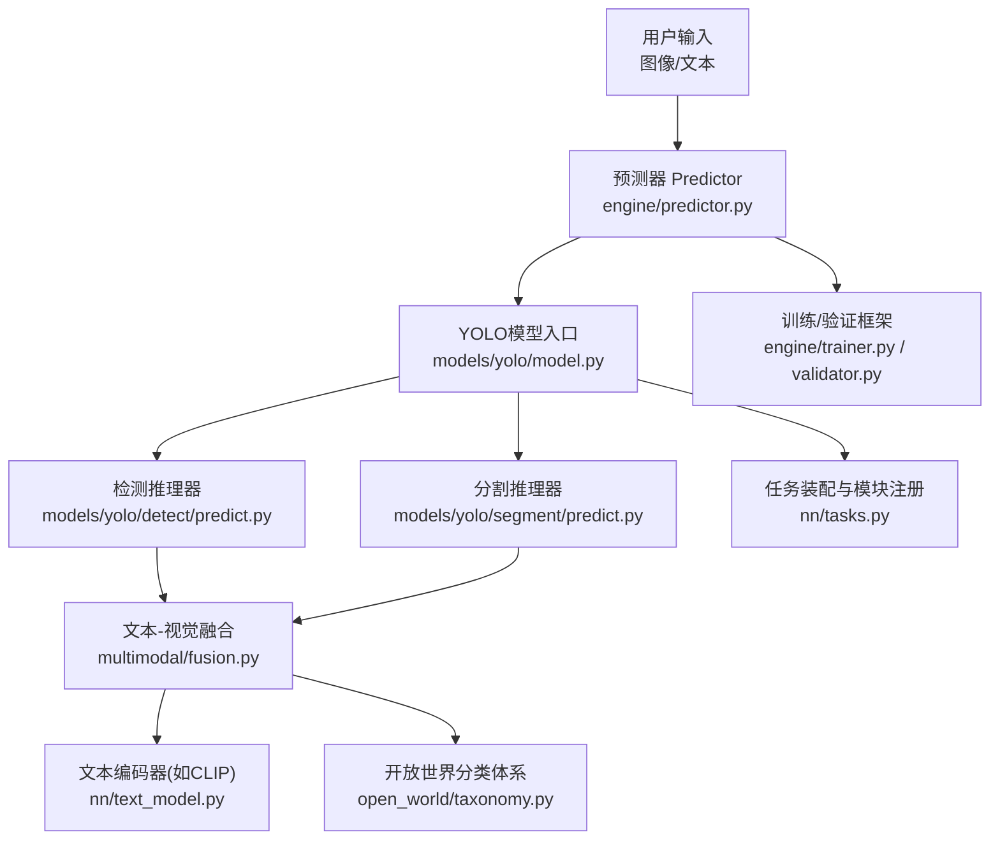
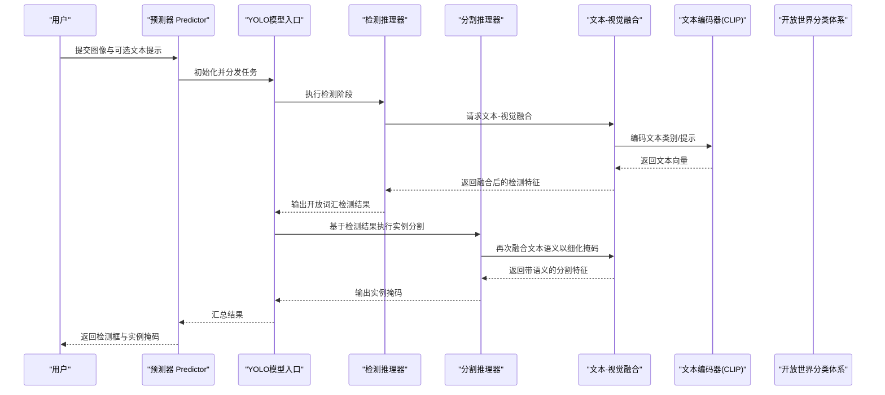
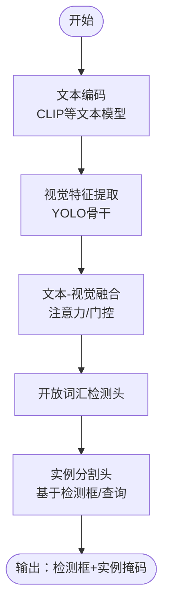
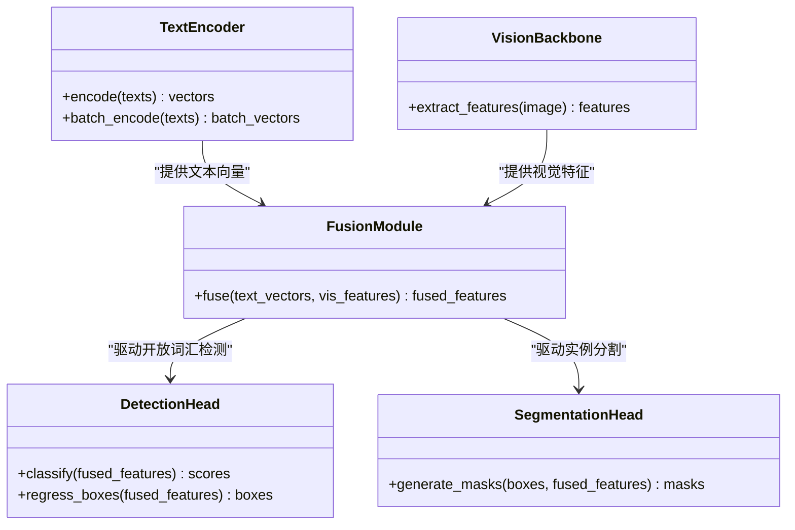
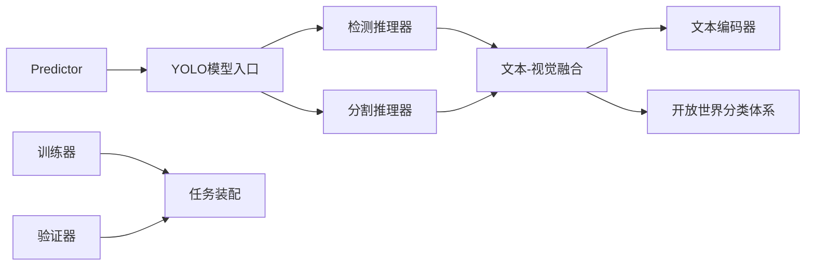

# YoloE零样本分割

<cite>
**本文引用的文件**
- [yoloe.md](file://docs/en/models/yoloe.md)
- [yolo.py](file://ultralytics/models/yolo/model.py)
- [detect.py](file://ultralytics/models/yolo/detect/predict.py)
- [segment.py](file://ultralytics/models/yolo/segment/predict.py)
- [model.py](file://ultralytics/engine/model.py)
- [predictor.py](file://ultralytics/engine/predictor.py)
- [trainer.py](file://ultralytics/engine/trainer.py)
- [validator.py](file://ultralytics/engine/validator.py)
- [tasks.py](file://ultralytics/nn/tasks.py)
- [text_model.py](file://ultralytics/nn/text_model.py)
- [fusion.py](file://agent/runtime/multimodal/fusion.py)
- [runtime.py](file://agent/runtime/multimodal/runtime.py)
- [multimodal_handlers.py](file://agent/runtime/cli/multimodal_handlers.py)
- [open_world_taxonomy.py](file://agent/runtime/open_world/taxonomy.py)
- [yoloworld_lora.yaml](file://examples/lora_examples/yoloworld_lora.yaml)
- [yoloe.yaml](file://ultralytics/cfg/models/yolo/yoloe.yaml)
</cite>

## 目录
1. [简介](#简介)
2. [项目结构](#项目结构)
3. [核心组件](#核心组件)
4. [架构总览](#架构总览)
5. [详细组件分析](#详细组件分析)
6. [依赖关系分析](#依赖关系分析)
7. [性能考量](#性能考量)
8. [故障排查指南](#故障排查指南)
9. [结论](#结论)
10. [附录](#附录)

## 简介
本文件面向YoloE系列的“零样本分割”能力，系统性阐述其如何将YOLO的高效检测与SAM的精细实例分割相结合，并通过文本引导实现开放词汇的目标检测与实例分割。文档覆盖以下要点：
- 文本引导的零样本分割机制：CLIP文本编码器与视觉特征的融合路径
- 开放词汇目标检测与实例分割的实现思路
- 自定义类别定义与训练配置示例
- 在未知类别上的分割效果与评估方法
- 微调策略与领域适应技术

## 项目结构
围绕YoloE零样本分割的关键代码与文档分布在如下位置：
- 模型说明与使用指引：docs/en/models/yoloe.md
- YOLO任务模型入口与推理流程：ultralytics/models/yolo/model.py、ultralytics/engine/model.py、ultralytics/engine/predictor.py
- 检测与分割推理器：ultralytics/models/yolo/detect/predict.py、ultralytics/models/yolo/segment/predict.py
- 多模态文本-视觉融合与运行时：agent/runtime/multimodal/fusion.py、agent/runtime/multimodal/runtime.py、agent/runtime/cli/multimodal_handlers.py
- 开放世界分类体系：agent/runtime/open_world/taxonomy.py
- 文本模型接口：ultralytics/nn/text_model.py
- 任务图与模块装配：ultralytics/nn/tasks.py
- 训练/验证框架：ultralytics/engine/trainer.py、ultralytics/engine/validator.py
- 示例LoRA配置（含YOLOWorld）：examples/lora_examples/yoloworld_lora.yaml
- YoloE模型配置（参考）：ultralytics/cfg/models/yolo/yoloe.yaml

图表来源
- [predictor.py](file://ultralytics/engine/predictor.py)
- [model.py](file://ultralytics/models/yolo/model.py)
- [detect.py](file://ultralytics/models/yolo/detect/predict.py)
- [segment.py](file://ultralytics/models/yolo/segment/predict.py)
- [fusion.py](file://agent/runtime/multimodal/fusion.py)
- [text_model.py](file://ultralytics/nn/text_model.py)
- [open_world_taxonomy.py](file://agent/runtime/open_world/taxonomy.py)
- [trainer.py](file://ultralytics/engine/trainer.py)
- [validator.py](file://ultralytics/engine/validator.py)
- [tasks.py](file://ultralytics/nn/tasks.py)

章节来源
- [yoloe.md](file://docs/en/models/yoloe.md)
- [model.py](file://ultralytics/models/yolo/model.py)
- [predictor.py](file://ultralytics/engine/predictor.py)
- [detect.py](file://ultralytics/models/yolo/detect/predict.py)
- [segment.py](file://ultralytics/models/yolo/segment/predict.py)
- [fusion.py](file://agent/runtime/multimodal/fusion.py)
- [text_model.py](file://ultralytics/nn/text_model.py)
- [open_world_taxonomy.py](file://agent/runtime/open_world/taxonomy.py)
- [trainer.py](file://ultralytics/engine/trainer.py)
- [validator.py](file://ultralytics/engine/validator.py)
- [tasks.py](file://ultralytics/nn/tasks.py)

## 核心组件
- 文本编码器与特征对齐
  - 通过文本模型接口加载预训练文本编码器（例如CLIP），将自然语言类别描述编码为文本向量。
  - 文本向量与视觉特征进行跨模态对齐，形成开放词汇的语义空间。
- 文本-视觉融合模块
  - 在检测分支中，将文本嵌入与视觉特征融合，驱动开放词汇的检测头输出类别置信度。
  - 在分割分支中，基于检测框或查询生成掩码，结合文本语义指导实例级分割。
- 开放世界分类体系
  - 提供类别词表与别名映射，支持动态扩展与领域定制。
- 推理流水线
  - 预测器协调检测与分割子流程，调用融合模块完成文本引导的推理。
- 训练与验证框架
  - 训练器负责参数更新与损失计算；验证器负责指标统计与报告。

章节来源
- [text_model.py](file://ultralytics/nn/text_model.py)
- [fusion.py](file://agent/runtime/multimodal/fusion.py)
- [open_world_taxonomy.py](file://agent/runtime/open_world/taxonomy.py)
- [predictor.py](file://ultralytics/engine/predictor.py)
- [detect.py](file://ultralytics/models/yolo/detect/predict.py)
- [segment.py](file://ultralytics/models/yolo/segment/predict.py)
- [trainer.py](file://ultralytics/engine/trainer.py)
- [validator.py](file://ultralytics/engine/validator.py)

## 架构总览
下图展示了从输入到输出的端到端流程，包括文本引导的融合与检测-分割协同。

图表来源
- [predictor.py](file://ultralytics/engine/predictor.py)
- [model.py](file://ultralytics/models/yolo/model.py)
- [detect.py](file://ultralytics/models/yolo/detect/predict.py)
- [segment.py](file://ultralytics/models/yolo/segment/predict.py)
- [fusion.py](file://agent/runtime/multimodal/fusion.py)
- [text_model.py](file://ultralytics/nn/text_model.py)
- [open_world_taxonomy.py](file://agent/runtime/open_world/taxonomy.py)

## 详细组件分析

### 文本引导的零样本分割机制
- 文本编码
  - 使用文本模型接口加载预训练编码器，将类别名或自由文本提示转换为固定维度的文本向量。
  - 支持批量编码与缓存，以提升推理效率。
- 视觉特征提取
  - YOLO骨干网络提取多层视觉特征，保留空间分辨率与语义信息。
- 跨模态融合
  - 在检测分支中，将文本向量与视觉特征进行注意力或门控融合，使检测头具备开放词汇判别能力。
  - 在分割分支中，利用检测框作为ROI，将文本语义注入掩码解码器，提升对未见类别的分割质量。
- 开放词汇匹配
  - 通过相似度度量（如余弦相似度）将文本向量与视觉特征对齐，实现无需重新训练的类别泛化。

图表来源
- [text_model.py](file://ultralytics/nn/text_model.py)
- [fusion.py](file://agent/runtime/multimodal/fusion.py)
- [detect.py](file://ultralytics/models/yolo/detect/predict.py)
- [segment.py](file://ultralytics/models/yolo/segment/predict.py)

章节来源
- [text_model.py](file://ultralytics/nn/text_model.py)
- [fusion.py](file://agent/runtime/multimodal/fusion.py)
- [detect.py](file://ultralytics/models/yolo/detect/predict.py)
- [segment.py](file://ultralytics/models/yolo/segment/predict.py)

### 开放词汇目标检测与实例分割
- 检测阶段
  - 文本嵌入参与检测头的类别评分，实现对任意文本描述的物体定位。
  - 非极大值抑制（NMS）用于去重与阈值筛选。
- 分割阶段
  - 基于检测框或可学习查询，生成实例级掩码。
  - 文本语义进一步约束掩码形状与边界，提高细粒度分割精度。
- 结果后处理
  - 合并重复预测、过滤低置信度结果、可视化渲染。

图表来源
- [text_model.py](file://ultralytics/nn/text_model.py)
- [fusion.py](file://agent/runtime/multimodal/fusion.py)
- [detect.py](file://ultralytics/models/yolo/detect/predict.py)
- [segment.py](file://ultralytics/models/yolo/segment/predict.py)

章节来源
- [detect.py](file://ultralytics/models/yolo/detect/predict.py)
- [segment.py](file://ultralytics/models/yolo/segment/predict.py)
- [fusion.py](file://agent/runtime/multimodal/fusion.py)
- [text_model.py](file://ultralytics/nn/text_model.py)

### 自定义类别定义与训练配置
- 自定义类别
  - 通过开放世界分类体系维护类别词表与别名映射，支持新增领域术语。
  - 可在推理时传入自定义文本提示，实现即插即用的开放词汇检测与分割。
- 训练配置
  - 使用示例LoRA配置文件（包含YOLOWorld相关设置）作为参考，调整rank、target_modules、learning_rate等超参。
  - 针对YoloE，可参考模型配置文件（yoloe.yaml）中的任务与模块装配选项。
- 数据准备
  - 标注格式遵循YOLO标准；对于开放词汇场景，建议提供多样化文本描述以增强鲁棒性。

章节来源
- [open_world_taxonomy.py](file://agent/runtime/open_world/taxonomy.py)
- [yoloworld_lora.yaml](file://examples/lora_examples/yoloworld_lora.yaml)
- [yoloe.yaml](file://ultralytics/cfg/models/yolo/yoloe.yaml)

### 在未知类别上的分割效果与性能评估
- 评估指标
  - 检测：mAP@IoU=0.50:0.95、Precision、Recall
  - 分割：mAP@Mask、mIoU、Instance mAP
- 评估流程
  - 验证器加载数据集与模型，执行推理并统计指标。
  - 支持按类别分组统计，便于观察未知类别表现。
- 结果解读
  - 关注开放词汇类别的mAP下降幅度与误检率。
  - 结合混淆矩阵与可视化结果，定位困难样本。

章节来源
- [validator.py](file://ultralytics/engine/validator.py)
- [yoloe.md](file://docs/en/models/yoloe.md)

### 微调策略与领域适应技术
- LoRA微调
  - 选择关键模块（如文本-视觉融合层、检测/分割头）插入低秩适配器，降低显存占用与训练成本。
  - 通过rank与target_modules控制适配范围与表达能力。
- 渐进式训练
  - 先冻结主干网络，仅训练融合与头部；再逐步解冻部分层级进行联合优化。
- 领域适应
  - 引入领域特定文本描述与数据增强，提升域内泛化。
  - 使用对比学习或一致性正则，稳定跨模态对齐。

章节来源
- [yoloworld_lora.yaml](file://examples/lora_examples/yoloworld_lora.yaml)
- [trainer.py](file://ultralytics/engine/trainer.py)
- [fusion.py](file://agent/runtime/multimodal/fusion.py)

## 依赖关系分析
- 模块耦合
  - 预测器依赖模型入口与任务装配；检测与分割推理器共享文本-视觉融合模块。
  - 文本编码器与开放世界分类体系为融合模块提供外部知识源。
- 直接依赖
  - 检测/分割推理器直接调用融合模块与文本编码器。
  - 训练/验证框架依赖任务图与模型装配。
- 潜在循环依赖
  - 通过分层设计避免循环：预测器不直接依赖训练器，任务装配集中管理模块注册。

图表来源
- [predictor.py](file://ultralytics/engine/predictor.py)
- [model.py](file://ultralytics/models/yolo/model.py)
- [detect.py](file://ultralytics/models/yolo/detect/predict.py)
- [segment.py](file://ultralytics/models/yolo/segment/predict.py)
- [fusion.py](file://agent/runtime/multimodal/fusion.py)
- [text_model.py](file://ultralytics/nn/text_model.py)
- [open_world_taxonomy.py](file://agent/runtime/open_world/taxonomy.py)
- [trainer.py](file://ultralytics/engine/trainer.py)
- [validator.py](file://ultralytics/engine/validator.py)
- [tasks.py](file://ultralytics/nn/tasks.py)

章节来源
- [predictor.py](file://ultralytics/engine/predictor.py)
- [model.py](file://ultralytics/models/yolo/model.py)
- [detect.py](file://ultralytics/models/yolo/detect/predict.py)
- [segment.py](file://ultralytics/models/yolo/segment/predict.py)
- [fusion.py](file://agent/runtime/multimodal/fusion.py)
- [text_model.py](file://ultralytics/nn/text_model.py)
- [open_world_taxonomy.py](file://agent/runtime/open_world/taxonomy.py)
- [trainer.py](file://ultralytics/engine/trainer.py)
- [validator.py](file://ultralytics/engine/validator.py)
- [tasks.py](file://ultralytics/nn/tasks.py)

## 性能考量
- 推理加速
  - 文本编码批量化与缓存；视觉特征复用；NMS与后处理优化。
- 内存与显存
  - 采用LoRA减少可训练参数；混合精度训练与推理；按需加载文本编码器。
- 吞吐与时延
  - 分块推理（SAHI等）与大图切片；流水线并行与异步I/O。
- 稳定性
  - 数值稳定性检查；梯度裁剪；早停与回滚策略。

[本节为通用指导，不涉及具体文件分析]

## 故障排查指南
- 常见问题
  - 文本编码失败：检查文本预处理与编码器权重加载。
  - 融合模块维度不匹配：核对文本向量与视觉特征通道数。
  - 检测框过密或漏检：调整NMS阈值与置信度阈值。
  - 分割掩码质量差：检查ROI对齐与掩码解码器输入。
- 调试工具
  - 启用中间特征可视化；记录文本-视觉相似度分布；导出中间结果进行分析。
- 日志与事件
  - 使用事件记录器收集训练/验证关键指标；定位异常点。

章节来源
- [multimodal_handlers.py](file://agent/runtime/cli/multimodal_handlers.py)
- [runtime.py](file://agent/runtime/multimodal/runtime.py)
- [trainer.py](file://ultralytics/engine/trainer.py)
- [validator.py](file://ultralytics/engine/validator.py)

## 结论
YoloE通过将YOLO的高效检测与SAM的精细分割能力结合，并以CLIP等文本编码器为桥梁，实现了强大的零样本分割与开放词汇目标检测。借助文本-视觉融合、开放世界分类体系与LoRA微调策略，系统能够在未知类别上保持良好性能，同时具备良好的可扩展性与领域适应能力。实际部署中，应重点关注文本编码与融合模块的稳定性、推理加速与内存优化，以及评估指标的全面性与可解释性。

[本节为总结性内容，不涉及具体文件分析]

## 附录
- 快速上手
  - 参考模型文档与示例配置，准备数据与文本提示，启动训练与推理。
- 扩展开发
  - 在开放世界分类体系中新增类别；在融合模块中尝试新的跨模态对齐策略；在训练器中集成新的损失函数。

[本节为补充信息，不涉及具体文件分析]