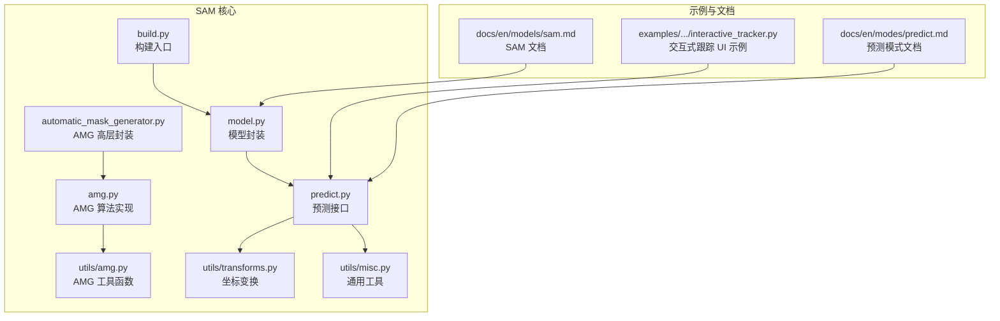
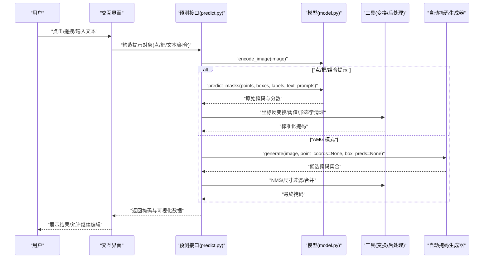
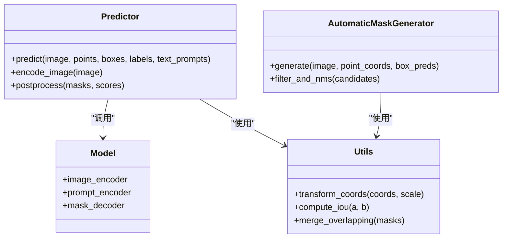

# 提示工程与交互

<cite>
**本文引用的文件**
- [ultralytics/models/sam/__init__.py](file://ultralytics/models/sam/__init__.py)
- [ultralytics/models/sam/model.py](file://ultralytics/models/sam/model.py)
- [ultralytics/models/sam/predict.py](file://ultralytics/models/sam/predict.py)
- [ultralytics/models/sam/build.py](file://ultralytics/models/sam/build.py)
- [ultralytics/models/sam/automatic_mask_generator.py](file://ultralytics/models/sam/automatic_mask_generator.py)
- [ultralytics/models/sam/amg.py](file://ultralytics/models/sam/amg.py)
- [ultralytics/models/sam/utils/amg.py](file://ultralytics/models/sam/utils/amg.py)
- [ultralytics/models/sam/utils/transforms.py](file://ultralytics/models/sam/utils/transforms.py)
- [ultralytics/models/sam/utils/misc.py](file://ultralytics/models/sam/utils/misc.py)
- [examples/YOLO-Interactive-Tracking-UI/interactive_tracker.py](file://examples/YOLO-Interactive-Tracking-UI/interactive_tracker.py)
- [docs/en/models/sam.md](file://docs/en/models/sam.md)
- [docs/en/modes/predict.md](file://docs/en/modes/predict.md)
</cite>

## 目录
1. [简介](#简介)
2. [项目结构](#项目结构)
3. [核心组件](#核心组件)
4. [架构总览](#架构总览)
5. [详细组件分析](#详细组件分析)
6. [依赖关系分析](#依赖关系分析)
7. [性能考量](#性能考量)
8. [故障排查指南](#故障排查指南)
9. [结论](#结论)
10. [附录](#附录)

## 简介
本文件面向使用 Segment Anything Model（SAM）进行提示工程与交互式分割的开发者，系统梳理点、框、文本与组合提示的使用方法，解释自动掩码生成器（AMG）的工作原理与适用场景，并给出在 Web 与移动端集成中的实践建议。同时提供提示质量对结果的影响分析与优化技巧，以及错误处理与边界情况的处理方法，帮助在实际项目中构建用户友好的分割交互体验。

## 项目结构
与 SAM 提示工程和交互相关的关键代码集中在 ultralytics/models/sam 目录下，包含模型封装、预测接口、自动掩码生成器及其工具模块；示例位于 examples/YOLO-Interactive-Tracking-UI；文档参考位于 docs/en/models/sam.md 与 docs/en/modes/predict.md。

图表来源
- [ultralytics/models/sam/model.py](file://ultralytics/models/sam/model.py)
- [ultralytics/models/sam/predict.py](file://ultralytics/models/sam/predict.py)
- [ultralytics/models/sam/build.py](file://ultralytics/models/sam/build.py)
- [ultralytics/models/sam/automatic_mask_generator.py](file://ultralytics/models/sam/automatic_mask_generator.py)
- [ultralytics/models/sam/amg.py](file://ultralytics/models/sam/amg.py)
- [ultralytics/models/sam/utils/amg.py](file://ultralytics/models/sam/utils/amg.py)
- [ultralytics/models/sam/utils/transforms.py](file://ultralytics/models/sam/utils/transforms.py)
- [ultralytics/models/sam/utils/misc.py](file://ultralytics/models/sam/utils/misc.py)
- [examples/YOLO-Interactive-Tracking-UI/interactive_tracker.py](file://examples/YOLO-Interactive-Tracking-UI/interactive_tracker.py)
- [docs/en/models/sam.md](file://docs/en/models/sam.md)
- [docs/en/modes/predict.md](file://docs/en/modes/predict.md)

章节来源
- [ultralytics/models/sam/__init__.py](file://ultralytics/models/sam/__init__.py)
- [docs/en/models/sam.md](file://docs/en/models/sam.md)
- [docs/en/modes/predict.md](file://docs/en/modes/predict.md)

## 核心组件
- 模型封装与预测接口：负责加载预训练权重、图像预处理、提示编码、解码器推理与后处理。
- 自动掩码生成器（AMG）：基于图像特征自动生成候选掩码，支持去重、尺寸过滤与 NMS 等策略，适用于批量无提示或弱提示场景。
- 工具模块：坐标变换、掩码合并、IOU/NMS 计算、形状解析等。

章节来源
- [ultralytics/models/sam/model.py](file://ultralytics/models/sam/model.py)
- [ultralytics/models/sam/predict.py](file://ultralytics/models/sam/predict.py)
- [ultralytics/models/sam/automatic_mask_generator.py](file://ultralytics/models/sam/automatic_mask_generator.py)
- [ultralytics/models/sam/amg.py](file://ultralytics/models/sam/amg.py)
- [ultralytics/models/sam/utils/amg.py](file://ultralytics/models/sam/utils/amg.py)
- [ultralytics/models/sam/utils/transforms.py](file://ultralytics/models/sam/utils/transforms.py)
- [ultralytics/models/sam/utils/misc.py](file://ultralytics/models/sam/utils/misc.py)

## 架构总览
下图展示了从“用户输入提示”到“输出分割掩码”的整体流程，包括点、框、文本与组合提示的处理路径，以及 AMG 的并行分支。

图表来源
- [ultralytics/models/sam/predict.py](file://ultralytics/models/sam/predict.py)
- [ultralytics/models/sam/model.py](file://ultralytics/models/sam/model.py)
- [ultralytics/models/sam/automatic_mask_generator.py](file://ultralytics/models/sam/automatic_mask_generator.py)
- [ultralytics/models/sam/utils/transforms.py](file://ultralytics/models/sam/utils/transforms.py)
- [ultralytics/models/sam/utils/amg.py](file://ultralytics/models/sam/utils/amg.py)

## 详细组件分析

### 提示类型与使用方法
- 点提示
  - 单点：用于快速定位目标中心或关键区域，适合清晰可辨的对象。
  - 多点：通过多个正负点表达前景/背景约束，提升复杂背景下的稳定性。
- 框提示
  - 矩形框：最常用且鲁棒性较好，适合粗略定位后再细化。
  - 任意形状：以多边形或轮廓点序列表示，适合不规则目标或精细控制。
- 文本提示
  - 自然语言描述类别或属性，结合视觉编码器进行跨模态对齐，适合开放词汇场景。
- 组合提示
  - 将点、框与文本混合输入，利用互补信息提高分割精度与稳定性。

使用要点
- 坐标归一化：确保所有提示坐标与模型内部分辨率一致，避免缩放误差。
- 标签一致性：点提示的正负标签需与任务语义匹配；框提示顺序与宽高定义需稳定。
- 文本简洁明确：尽量使用名词短语与限定词，减少歧义。
- 迭代式交互：先粗后精，先用框/少量点定位，再用多点/文本微调。

章节来源
- [docs/en/models/sam.md](file://docs/en/models/sam.md)
- [docs/en/modes/predict.md](file://docs/en/modes/predict.md)
- [ultralytics/models/sam/predict.py](file://ultralytics/models/sam/predict.py)
- [ultralytics/models/sam/utils/transforms.py](file://ultralytics/models/sam/utils/transforms.py)

### 自动掩码生成器（AMG）工作原理与使用场景
工作原理
- 特征提取：对输入图像进行编码，得到高分辨率特征图。
- 候选生成：在特征空间采样或基于网格生成大量候选掩码。
- 评分与筛选：依据掩码质量、面积、重叠度等进行打分与过滤。
- 后处理：执行非极大值抑制（NMS）、小目标剔除、空洞填充与边界平滑。

适用场景
- 批量无提示分割：如数据集预处理、弱监督标注。
- 弱提示增强：在仅有稀疏点或模糊框时，用 AMG 生成初始候选再精炼。
- 探索性分析：快速发现潜在实例，辅助人工复核。

参数调优建议
- 数量与密度：根据图像复杂度调整候选数量，平衡召回与速度。
- 阈值与 IoU：提高 IoU 阈值可减少重复，但可能漏检；适当降低阈值以提升召回。
- 尺寸过滤：针对目标尺度分布设置最小/最大面积阈值，抑制噪声。

章节来源
- [ultralytics/models/sam/automatic_mask_generator.py](file://ultralytics/models/sam/automatic_mask_generator.py)
- [ultralytics/models/sam/amg.py](file://ultralytics/models/sam/amg.py)
- [ultralytics/models/sam/utils/amg.py](file://ultralytics/models/sam/utils/amg.py)

### 交互式分割应用示例
Web 界面集成
- 事件驱动：捕获鼠标点击、拖拽、滚轮缩放，实时构造点/框提示。
- 异步推理：前端发送请求，后端返回掩码与可视化叠加层，避免阻塞 UI。
- 状态管理：维护历史提示与撤销/重做能力，支持增量更新。

移动端应用
- 触控手势：单指点击为点提示，双指拖拽为框提示，长按可切换正负点。
- 性能优化：限制并发请求、缓存图像特征、按需重新编码。
- 用户体验：提供即时反馈与容错提示，如“请提供更清晰的框”。

章节来源
- [examples/YOLO-Interactive-Tracking-UI/interactive_tracker.py](file://examples/YOLO-Interactive-Tracking-UI/interactive_tracker.py)
- [docs/en/modes/predict.md](file://docs/en/modes/predict.md)

### 提示质量对分割结果的影响与优化技巧
影响维度
- 准确性：更精确的点/框能显著提升边界贴合度。
- 稳定性：多点与文本提示可降低随机性与误分割。
- 效率：合理数量的提示可减少后续修正次数。

优化技巧
- 先框后点：先用框快速定位，再用关键点细化边缘。
- 正负点搭配：在易混淆区域添加负点抑制误分割。
- 文本限定：加入颜色、材质、相对位置等限定词，缩小搜索空间。
- 自适应阈值：根据置信度动态调整显示阈值，兼顾可见性与精度。

章节来源
- [docs/en/models/sam.md](file://docs/en/models/sam.md)
- [ultralytics/models/sam/predict.py](file://ultralytics/models/sam/predict.py)

### 错误处理与边界情况
常见问题
- 空提示：未提供任何点/框/文本时应回退至默认行为或提示用户补充。
- 越界坐标：超出图像范围的提示应裁剪或拒绝并提示。
- 无效形状：多边形自交或退化线段需校验并修复。
- 文本为空或过长：截断或提示重写。
- 设备内存不足：分批处理或降级分辨率。

处理策略
- 输入校验：统一在预测前进行格式与范围检查。
- 异常捕获：对网络 IO、解码失败、数值溢出进行兜底。
- 降级方案：当 GPU 不可用时回退 CPU 或启用轻量模式。
- 日志记录：记录失败原因与上下文，便于复现与诊断。

章节来源
- [ultralytics/models/sam/predict.py](file://ultralytics/models/sam/predict.py)
- [ultralytics/models/sam/utils/misc.py](file://ultralytics/models/sam/utils/misc.py)

### 实际项目中的用户友好交互设计
- 渐进式引导：首次使用时提供模板提示与示例，逐步引入高级功能。
- 即时预览：低延迟渲染半透明掩码，允许拖动调整。
- 撤销/重做：保留操作历史，支持一键恢复。
- 批量批注：在列表视图中复用上一张图的提示，加速标注。
- 导出与协作：支持导出标准格式（如 JSON/GeoJSON），便于团队协作。

章节来源
- [examples/YOLO-Interactive-Tracking-UI/interactive_tracker.py](file://examples/YOLO-Interactive-Tracking-UI/interactive_tracker.py)
- [docs/en/modes/predict.md](file://docs/en/modes/predict.md)

## 依赖关系分析

图表来源
- [ultralytics/models/sam/predict.py](file://ultralytics/models/sam/predict.py)
- [ultralytics/models/sam/model.py](file://ultralytics/models/sam/model.py)
- [ultralytics/models/sam/automatic_mask_generator.py](file://ultralytics/models/sam/automatic_mask_generator.py)
- [ultralytics/models/sam/utils/transforms.py](file://ultralytics/models/sam/utils/transforms.py)
- [ultralytics/models/sam/utils/amg.py](file://ultralytics/models/sam/utils/amg.py)

章节来源
- [ultralytics/models/sam/build.py](file://ultralytics/models/sam/build.py)
- [ultralytics/models/sam/__init__.py](file://ultralytics/models/sam/__init__.py)

## 性能考量
- 图像编码缓存：对同一图像多次提示推理时复用编码结果。
- 批处理：在服务器端对多张图像并行编码与解码。
- 分辨率选择：在移动端或低算力设备上降低输入分辨率。
- 掩码后处理优化：向量化计算 IoU/NMS，减少 Python 循环。
- 流式交互：仅对变化区域增量更新掩码，降低渲染开销。

[本节为通用指导，不直接分析具体文件]

## 故障排查指南
- 症状：掩码大面积缺失
  - 排查：检查提示是否过少或过于靠近背景；尝试增加正点或扩大框。
  - 参考：[ultralytics/models/sam/predict.py](file://ultralytics/models/sam/predict.py)
- 症状：频繁误分割
  - 排查：添加负点或使用文本限定；调整 IoU 阈值与小目标过滤。
  - 参考：[ultralytics/models/sam/amg.py](file://ultralytics/models/sam/amg.py)
- 症状：运行缓慢
  - 排查：确认是否重复编码图像；启用缓存；降低分辨率或关闭不必要的后处理。
  - 参考：[ultralytics/models/sam/utils/misc.py](file://ultralytics/models/sam/utils/misc.py)
- 症状：坐标错位
  - 排查：核对坐标变换与缩放比例；确保提示坐标与模型输入一致。
  - 参考：[ultralytics/models/sam/utils/transforms.py](file://ultralytics/models/sam/utils/transforms.py)

章节来源
- [ultralytics/models/sam/predict.py](file://ultralytics/models/sam/predict.py)
- [ultralytics/models/sam/amg.py](file://ultralytics/models/sam/amg.py)
- [ultralytics/models/sam/utils/transforms.py](file://ultralytics/models/sam/utils/transforms.py)
- [ultralytics/models/sam/utils/misc.py](file://ultralytics/models/sam/utils/misc.py)

## 结论
通过合理的提示设计与迭代式交互，可以显著提升 SAM 的分割效果与用户体验。AMG 在无提示或弱提示场景下具备强大潜力，配合严格的输入校验与稳健的错误处理，可在 Web 与移动端构建高效、稳定的分割交互系统。建议在工程中建立提示模板库与参数调优指南，持续收集用户反馈以优化交互流程。

[本节为总结性内容，不直接分析具体文件]

## 附录
- 快速上手
  - 阅读文档：[docs/en/models/sam.md](file://docs/en/models/sam.md)、[docs/en/modes/predict.md](file://docs/en/modes/predict.md)
  - 参考示例：[examples/YOLO-Interactive-Tracking-UI/interactive_tracker.py](file://examples/YOLO-Interactive-Tracking-UI/interactive_tracker.py)
- 关键实现路径
  - 模型封装与构建：[ultralytics/models/sam/model.py](file://ultralytics/models/sam/model.py)、[ultralytics/models/sam/build.py](file://ultralytics/models/sam/build.py)
  - 预测接口与后处理：[ultralytics/models/sam/predict.py](file://ultralytics/models/sam/predict.py)
  - 自动掩码生成器：[ultralytics/models/sam/automatic_mask_generator.py](file://ultralytics/models/sam/automatic_mask_generator.py)、[ultralytics/models/sam/amg.py](file://ultralytics/models/sam/amg.py)
  - 工具函数：[ultralytics/models/sam/utils/amg.py](file://ultralytics/models/sam/utils/amg.py)、[ultralytics/models/sam/utils/transforms.py](file://ultralytics/models/sam/utils/transforms.py)、[ultralytics/models/sam/utils/misc.py](file://ultralytics/models/sam/utils/misc.py)