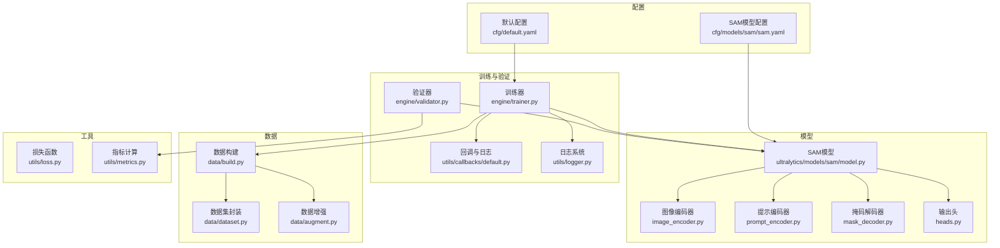
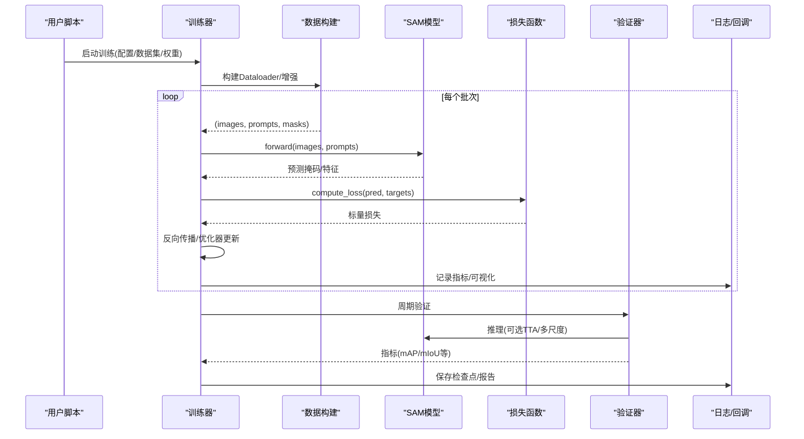
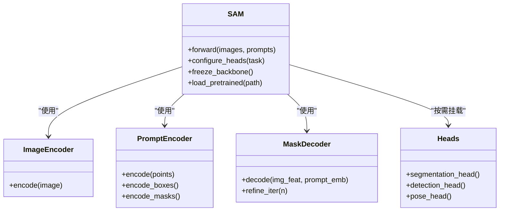
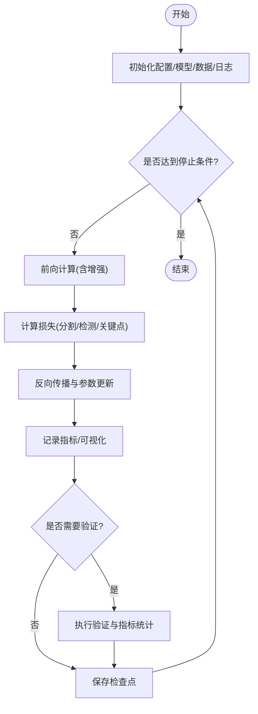
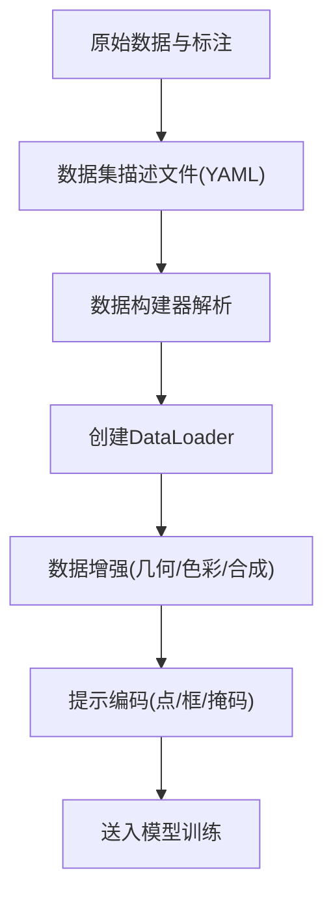
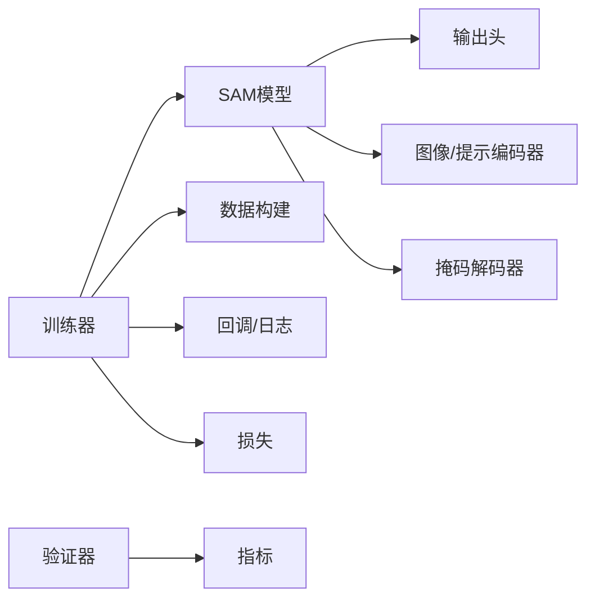

# 训练与微调

<cite>
**本文引用的文件**
- [ultralytics/models/sam/__init__.py](file://ultralytics/models/sam/__init__.py)
- [ultralytics/models/sam/model.py](file://ultralytics/models/sam/model.py)
- [ultralytics/models/sam/heads.py](file://ultralytics/models/sam/heads.py)
- [ultralytics/models/sam/prompt_encoder.py](file://ultralytics/models/sam/prompt_encoder.py)
- [ultralytics/models/sam/image_encoder.py](file://ultralytics/models/sam/image_encoder.py)
- [ultralytics/models/sam/mask_decoder.py](file://ultralytics/models/sam/mask_decoder.py)
- [ultralytics/engine/trainer.py](file://ultralytics/engine/trainer.py)
- [ultralytics/engine/validator.py](file://ultralytics/engine/validator.py)
- [ultralytics/utils/callbacks/default.py](file://ultralytics/utils/callbacks/default.py)
- [ultralytics/utils/logger.py](file://ultralytics/utils/logger.py)
- [ultralytics/cfg/default.yaml](file://ultralytics/cfg/default.yaml)
- [ultralytics/cfg/models/sam/sam.yaml](file://ultralytics/cfg/models/sam/sam.yaml)
- [ultralytics/data/build.py](file://ultralytics/data/build.py)
- [ultralytics/data/dataset.py](file://ultralytics/data/dataset.py)
- [ultralytics/data/augment.py](file://ultralytics/data/augment.py)
- [ultralytics/utils/loss.py](file://ultralytics/utils/loss.py)
- [ultralytics/utils/metrics.py](file://ultralytics/utils/metrics.py)
- [examples/lora_examples/yolo_master_lora_README.md](file://examples/lora_examples/yolo_master_lora_README.md)
- [examples/lora_examples/yolo12_lora.yaml](file://examples/lora_examples/yolo12_lora.yaml)
- [scripts/quick_train_verify.py](file://scripts/quick_train_verify.py)
</cite>

## 目录
1. [简介](#简介)
2. [项目结构](#项目结构)
3. [核心组件](#核心组件)
4. [架构总览](#架构总览)
5. [详细组件分析](#详细组件分析)
6. [依赖关系分析](#依赖关系分析)
7. [性能考虑](#性能考虑)
8. [故障排查指南](#故障排查指南)
9. [结论](#结论)
10. [附录](#附录)

## 简介
本指南面向希望在YOLO-Master框架中从零开始训练并微调SAM（Segment Anything Model）的工程师与研究者。内容涵盖：
- 数据准备、模型配置与训练参数设置
- 在特定数据集上的微调策略，以提升分割精度
- 不同任务（检测、分割、关键点）的训练策略差异
- 迁移学习与增量学习的最佳实践
- 训练监控、日志记录与结果评估方法
- 常见问题与性能瓶颈的解决方案
- 配置文件示例与命令行参数说明

## 项目结构
本项目将SAM相关实现集中在models/sam模块下，训练与验证流程由engine层统一编排，数据加载与增强位于data子包，损失与指标定义于utils，默认配置与模型定义位于cfg目录。

图表来源
- [ultralytics/models/sam/model.py](file://ultralytics/models/sam/model.py)
- [ultralytics/models/sam/image_encoder.py](file://ultralytics/models/sam/image_encoder.py)
- [ultralytics/models/sam/prompt_encoder.py](file://ultralytics/models/sam/prompt_encoder.py)
- [ultralytics/models/sam/mask_decoder.py](file://ultralytics/models/sam/mask_decoder.py)
- [ultralytics/models/sam/heads.py](file://ultralytics/models/sam/heads.py)
- [ultralytics/engine/trainer.py](file://ultralytics/engine/trainer.py)
- [ultralytics/engine/validator.py](file://ultralytics/engine/validator.py)
- [ultralytics/utils/callbacks/default.py](file://ultralytics/utils/callbacks/default.py)
- [ultralytics/utils/logger.py](file://ultralytics/utils/logger.py)
- [ultralytics/data/build.py](file://ultralytics/data/build.py)
- [ultralytics/data/dataset.py](file://ultralytics/data/dataset.py)
- [ultralytics/data/augment.py](file://ultralytics/data/augment.py)
- [ultralytics/cfg/default.yaml](file://ultralytics/cfg/default.yaml)
- [ultralytics/cfg/models/sam/sam.yaml](file://ultralytics/cfg/models/sam/sam.yaml)
- [ultralytics/utils/loss.py](file://ultralytics/utils/loss.py)
- [ultralytics/utils/metrics.py](file://ultralytics/utils/metrics.py)

章节来源
- [ultralytics/models/sam/__init__.py](file://ultralytics/models/sam/__init__.py)
- [ultralytics/models/sam/model.py](file://ultralytics/models/sam/model.py)
- [ultralytics/engine/trainer.py](file://ultralytics/engine/trainer.py)
- [ultralytics/engine/validator.py](file://ultralytics/engine/validator.py)
- [ultralytics/cfg/default.yaml](file://ultralytics/cfg/default.yaml)
- [ultralytics/cfg/models/sam/sam.yaml](file://ultralytics/cfg/models/sam/sam.yaml)

## 核心组件
- SAM模型入口与装配：负责组合图像编码器、提示编码器、掩码解码器与输出头，提供统一的forward接口与任务适配。
- 训练器：管理优化器、学习率调度、AMP、EMA、分布式、断点续训、回调与日志。
- 验证器：执行推理与指标统计，支持多尺度、TTA等策略。
- 数据管线：构建DataLoader、处理标注格式、应用增强与批处理。
- 配置系统：默认训练参数与模型超参分离，便于快速切换与复用。
- 损失与指标：针对分割任务的损失组合与mAP/mIoU等指标计算。

章节来源
- [ultralytics/models/sam/model.py](file://ultralytics/models/sam/model.py)
- [ultralytics/engine/trainer.py](file://ultralytics/engine/trainer.py)
- [ultralytics/engine/validator.py](file://ultralytics/engine/validator.py)
- [ultralytics/data/build.py](file://ultralytics/data/build.py)
- [ultralytics/cfg/default.yaml](file://ultralytics/cfg/default.yaml)
- [ultralytics/utils/loss.py](file://ultralytics/utils/loss.py)
- [ultralytics/utils/metrics.py](file://ultralytics/utils/metrics.py)

## 架构总览
下图展示从数据到模型前向、损失计算、反向传播与验证评估的端到端流程。

图表来源
- [ultralytics/engine/trainer.py](file://ultralytics/engine/trainer.py)
- [ultralytics/models/sam/model.py](file://ultralytics/models/sam/model.py)
- [ultralytics/utils/loss.py](file://ultralytics/utils/loss.py)
- [ultralytics/engine/validator.py](file://ultralytics/engine/validator.py)
- [ultralytics/utils/callbacks/default.py](file://ultralytics/utils/callbacks/default.py)
- [ultralytics/utils/logger.py](file://ultralytics/utils/logger.py)

## 详细组件分析

### SAM模型组件
- 图像编码器：提取高分辨率视觉特征，作为后续提示融合的基础。
- 提示编码器：处理点、框、文本或掩码等提示信号，生成条件嵌入。
- 掩码解码器：基于图像特征与提示嵌入，迭代细化得到高质量掩码。
- 输出头：根据任务需求输出分类、边界框、关键点或掩码等。

图表来源
- [ultralytics/models/sam/model.py](file://ultralytics/models/sam/model.py)
- [ultralytics/models/sam/image_encoder.py](file://ultralytics/models/sam/image_encoder.py)
- [ultralytics/models/sam/prompt_encoder.py](file://ultralytics/models/sam/prompt_encoder.py)
- [ultralytics/models/sam/mask_decoder.py](file://ultralytics/models/sam/mask_decoder.py)
- [ultralytics/models/sam/heads.py](file://ultralytics/models/sam/heads.py)

章节来源
- [ultralytics/models/sam/model.py](file://ultralytics/models/sam/model.py)
- [ultralytics/models/sam/image_encoder.py](file://ultralytics/models/sam/image_encoder.py)
- [ultralytics/models/sam/prompt_encoder.py](file://ultralytics/models/sam/prompt_encoder.py)
- [ultralytics/models/sam/mask_decoder.py](file://ultralytics/models/sam/mask_decoder.py)
- [ultralytics/models/sam/heads.py](file://ultralytics/models/sam/heads.py)

### 训练流程与控制流
训练器负责组装优化器、学习率策略、混合精度、EMA、分布式通信、断点恢复与回调。关键步骤包括：
- 初始化：加载配置、模型权重、数据管道、日志与回调
- 训练循环：按batch前向、计算损失、反向传播、更新参数、记录指标
- 验证与保存：周期性验证、保存最佳与最新权重、导出中间产物
- 异常与恢复：捕获异常、回滚状态、继续训练

图表来源
- [ultralytics/engine/trainer.py](file://ultralytics/engine/trainer.py)
- [ultralytics/utils/callbacks/default.py](file://ultralytics/utils/callbacks/default.py)
- [ultralytics/utils/logger.py](file://ultralytics/utils/logger.py)

章节来源
- [ultralytics/engine/trainer.py](file://ultralytics/engine/trainer.py)
- [ultralytics/utils/callbacks/default.py](file://ultralytics/utils/callbacks/default.py)
- [ultralytics/utils/logger.py](file://ultralytics/utils/logger.py)

### 数据准备与增强
- 数据格式：支持常见标注格式（如COCO/YOLO），需确保类别映射与路径正确。
- 构建流程：通过数据构建器解析数据集描述、划分训练/验证集、创建DataLoader。
- 增强策略：几何变换、颜色抖动、MixUp/CutMix、随机裁剪/缩放等，对分割任务建议保留像素级一致性。
- 提示工程：为SAM提供点/框/掩码提示时，需保证坐标归一化与有效性校验。

图表来源
- [ultralytics/data/build.py](file://ultralytics/data/build.py)
- [ultralytics/data/dataset.py](file://ultralytics/data/dataset.py)
- [ultralytics/data/augment.py](file://ultralytics/data/augment.py)

章节来源
- [ultralytics/data/build.py](file://ultralytics/data/build.py)
- [ultralytics/data/dataset.py](file://ultralytics/data/dataset.py)
- [ultralytics/data/augment.py](file://ultralytics/data/augment.py)

### 损失与指标
- 损失函数：针对分割任务通常包含交叉熵/Dice/边界对齐等组合；检测与关键点任务有各自损失项。
- 指标计算：mAP、mIoU、Precision/Recall、F1等，支持逐类统计与汇总。
- 动态权重：可根据任务难度或样本数量调整损失权重，提升稳定性。

章节来源
- [ultralytics/utils/loss.py](file://ultralytics/utils/loss.py)
- [ultralytics/utils/metrics.py](file://ultralytics/utils/metrics.py)

### 配置系统与命令行
- 默认配置：包含通用训练超参（学习率、批量大小、优化器、调度器等）。
- 模型配置：定义SAM各子模块尺寸、深度、注意力头数等。
- 命令行参数：可通过CLI覆盖配置项，指定数据集、权重、设备、日志路径等。

章节来源
- [ultralytics/cfg/default.yaml](file://ultralytics/cfg/default.yaml)
- [ultralytics/cfg/models/sam/sam.yaml](file://ultralytics/cfg/models/sam/sam.yaml)
- [scripts/quick_train_verify.py](file://scripts/quick_train_verify.py)

## 依赖关系分析
- 低耦合高内聚：模型、训练、数据、配置分层清晰，便于替换与扩展。
- 外部依赖：PyTorch生态、可视化工具（TensorBoard/W&B）、分布式后端（DDP）。
- 潜在环依赖：避免在模型中直接引用训练器，保持单向依赖。

图表来源
- [ultralytics/engine/trainer.py](file://ultralytics/engine/trainer.py)
- [ultralytics/models/sam/model.py](file://ultralytics/models/sam/model.py)
- [ultralytics/utils/loss.py](file://ultralytics/utils/loss.py)
- [ultralytics/utils/metrics.py](file://ultralytics/utils/metrics.py)

章节来源
- [ultralytics/engine/trainer.py](file://ultralytics/engine/trainer.py)
- [ultralytics/models/sam/model.py](file://ultralytics/models/sam/model.py)
- [ultralytics/utils/loss.py](file://ultralytics/utils/loss.py)
- [ultralytics/utils/metrics.py](file://ultralytics/utils/metrics.py)

## 性能考虑
- 混合精度训练：启用AMP减少显存占用并加速训练，注意数值稳定性。
- 梯度累积：在小显存设备上模拟大batch，提高收敛稳定性。
- 数据I/O优化：使用多线程/内存映射、预取与缓存，减少GPU等待。
- 模型并行：DDP或多卡训练，合理设置world_size与NCCL后端。
- 早停与EMA：结合验证指标早停，EMA平滑权重提升泛化。
- 提示采样策略：在微调阶段动态选择难样本提示，提升收敛效率。

[本节为通用指导，无需具体文件引用]

## 故障排查指南
- 训练不收敛/损失震荡
  - 检查学习率与warmup策略，适当降低初始学习率或增加warmup步数
  - 确认数据增强强度，过强可能破坏像素级标注一致性
  - 启用AMP后若出现NaN，可关闭或降低精度
- 显存不足
  - 减小输入分辨率或batch size，启用梯度累积
  - 冻结部分编码器层，仅微调解码器与提示分支
- 验证指标停滞
  - 检查类别不平衡，调整损失权重或采用重采样
  - 引入更多难样本提示或进行课程学习
- 分布式问题
  - 确认端口与NCCL环境，检查节点间通信
  - 打印rank信息定位死锁或广播不一致

章节来源
- [ultralytics/engine/trainer.py](file://ultralytics/engine/trainer.py)
- [ultralytics/utils/logger.py](file://ultralytics/utils/logger.py)
- [ultralytics/utils/callbacks/default.py](file://ultralytics/utils/callbacks/default.py)

## 结论
通过在YOLO-Master框架中集成SAM，可实现灵活的提示驱动分割训练与微调。遵循本指南的数据准备、配置管理与训练策略，可在特定数据集上显著提升分割精度。结合迁移学习与增量学习实践，以及完善的监控与评估体系，能够高效推进从原型到落地的全流程。

[本节为总结性内容，无需具体文件引用]

## 附录

### 从零开始训练SAM的完整流程
- 数据准备
  - 整理图像与标注，确保类别映射一致
  - 编写数据集YAML，指定train/val路径与类别列表
- 模型配置
  - 选择SAM基础配置，必要时调整编码器/解码器深度与通道
  - 如需LoRA/PEFT，参考示例配置
- 训练参数
  - 设置学习率、批量大小、优化器与调度器
  - 开启AMP、EMA、早停与日志
- 启动训练
  - 使用CLI或Python API传入数据集与配置
  - 监控训练曲线与验证指标，适时调整超参

章节来源
- [ultralytics/cfg/default.yaml](file://ultralytics/cfg/default.yaml)
- [ultralytics/cfg/models/sam/sam.yaml](file://ultralytics/cfg/models/sam/sam.yaml)
- [scripts/quick_train_verify.py](file://scripts/quick_train_verify.py)

### 在特定数据集上微调以提高分割精度
- 冻结主干，仅微调提示编码器与掩码解码器
- 使用难样本提示采样与课程学习
- 引入领域特定的数据增强（如透视校正、光照变化）
- 调整损失权重以平衡前景/背景与边界区域

章节来源
- [ultralytics/models/sam/model.py](file://ultralytics/models/sam/model.py)
- [ultralytics/data/augment.py](file://ultralytics/data/augment.py)
- [ultralytics/utils/loss.py](file://ultralytics/utils/loss.py)

### 不同任务的训练策略差异
- 检测：侧重边界框回归与分类，配合NMS与正负样本均衡
- 分割：强调像素级准确性，使用Dice/CE组合损失与边界对齐
- 关键点：关注关键点定位误差与可见性标签，采用加权损失

章节来源
- [ultralytics/models/sam/heads.py](file://ultralytics/models/sam/heads.py)
- [ultralytics/utils/loss.py](file://ultralytics/utils/loss.py)
- [ultralytics/utils/metrics.py](file://ultralytics/utils/metrics.py)

### 迁移学习与增量学习最佳实践
- 迁移学习
  - 加载预训练权重，冻结高层，微调浅层与任务头
  - 小学习率+长warmup，逐步解冻层级
- 增量学习
  - 灾难性遗忘缓解：回放旧数据、正则化（EWC/LwF）
  - 适配器/LoRA：新增轻量模块，合并权重时保持兼容性

章节来源
- [examples/lora_examples/yolo_master_lora_README.md](file://examples/lora_examples/yolo_master_lora_README.md)
- [examples/lora_examples/yolo12_lora.yaml](file://examples/lora_examples/yolo12_lora.yaml)

### 训练监控、日志记录与结果评估
- 监控
  - 实时绘制损失与指标曲线，观察收敛趋势
- 日志
  - 结构化记录超参与运行环境，便于复现
- 评估
  - 多尺度验证、TTA提升鲁棒性
  - 输出混淆矩阵与错误样例，辅助改进

章节来源
- [ultralytics/utils/callbacks/default.py](file://ultralytics/utils/callbacks/default.py)
- [ultralytics/utils/logger.py](file://ultralytics/utils/logger.py)
- [ultralytics/engine/validator.py](file://ultralytics/engine/validator.py)

### 配置文件示例与命令行参数说明
- 配置文件
  - 默认训练参数位于默认配置文件中
  - SAM模型超参位于模型配置文件中
- 命令行参数
  - 常用参数包括数据集路径、模型权重、设备、批量大小、学习率、日志目录等
  - 可通过CLI覆盖配置项，快速实验不同策略

章节来源
- [ultralytics/cfg/default.yaml](file://ultralytics/cfg/default.yaml)
- [ultralytics/cfg/models/sam/sam.yaml](file://ultralytics/cfg/models/sam/sam.yaml)
- [scripts/quick_train_verify.py](file://scripts/quick_train_verify.py)