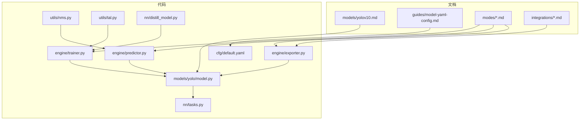
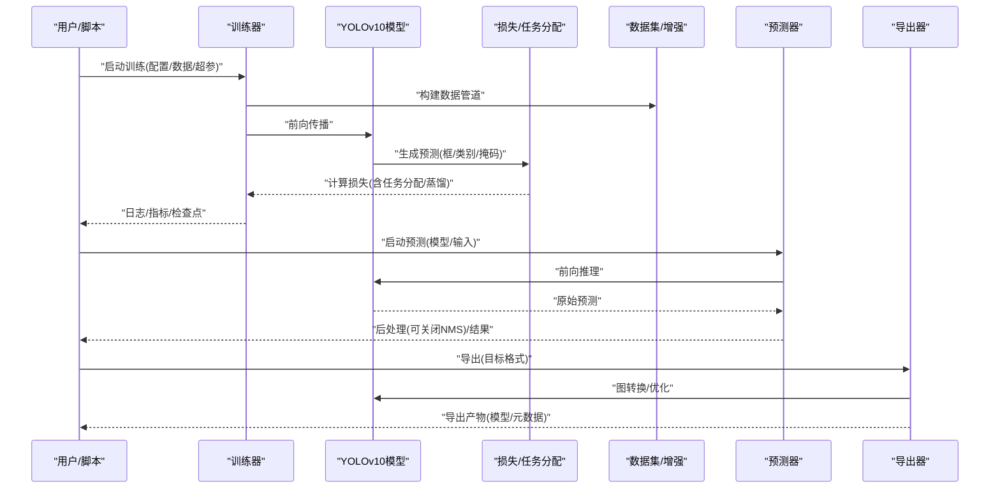
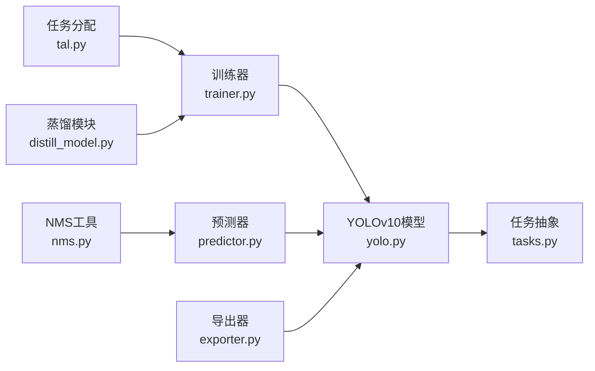

# YOLOv10模型

<cite>
**本文引用的文件**
- [yolov10.md](file://docs/en/models/yolov10.md)
- [yolo.py](file://ultralytics/models/yolo/model.py)
- [train.py](file://ultralytics/engine/trainer.py)
- [predict.py](file://ultralytics/engine/predictor.py)
- [exporter.py](file://ultralytics/engine/exporter.py)
- [nms.py](file://ultralytics/utils/nms.py)
- [tal.py](file://ultralytics/utils/tal.py)
- [distill_model.py](file://ultralytics/nn/distill_model.py)
- [tasks.py](file://ultralytics/nn/tasks.py)
- [default.yaml](file://ultralytics/cfg/default.yaml)
- [model-yaml-config.md](file://docs/en/guides/model-yaml-config.md)
- [yolo26-mixture-compatibility.md](file://docs/en/guides/yolo26-mixture-compatibility.md)
- [yolo-performance-metrics.md](file://docs/en/guides/yolo-performance-metrics.md)
- [yolo-thread-safe-inference.md](file://docs/en/guides/yolo-thread-safe-inference.md)
- [edge-deployment-guide.md](file://docs/en/guides/deepstream-nvidia-jetson.md)
- [openvino-integration.md](file://docs/en/integrations/openvino.md)
- [tensorrt-integration.md](file://docs/en/integrations/tensorrt.md)
- [tflite-integration.md](file://docs/en/integrations/tflite.md)
- [ncnn-integration.md](file://docs/en/integrations/ncnn.md)
- [mnn-integration.md](file://docs/en/integrations/mnn.md)
- [onnx-export.md](file://docs/en/modes/export.md)
- [benchmark-mode.md](file://docs/en/modes/benchmark.md)
- [predict-mode.md](file://docs/en/modes/predict.md)
- [train-mode.md](file://docs/en/modes/train.md)
- [val-mode.md](file://docs/en/modes/val.md)
</cite>

## 目录
1. [简介](#简介)
2. [项目结构](#项目结构)
3. [核心组件](#核心组件)
4. [架构总览](#架构总览)
5. [详细组件分析](#详细组件分析)
6. [依赖关系分析](#依赖关系分析)
7. [性能考量](#性能考量)
8. [故障排查指南](#故障排查指南)
9. [结论](#结论)
10. [附录](#附录)

## 简介
本文件面向希望深入理解与使用YOLOv10的工程与研究读者，聚焦以下主题：
- 双重任务分配策略与一致性蒸馏技术的设计动机、实现要点与训练流程
- 无NMS（非极大值抑制）检测头的设计原理、推理优势与部署影响
- 精度与速度的平衡优化策略（数据增强、损失权重、后处理简化等）
- 完整配置文件结构与关键参数说明
- 新的API接口在训练、验证、预测与导出中的使用方法
- 与前代版本在实时检测性能上的改进对比思路与指标口径
- 边缘设备部署优化建议与实际案例路径
- 模型压缩与量化技术的应用效果与注意事项

## 项目结构
仓库采用模块化组织方式，YOLO系列模型统一由模型注册表与任务抽象驱动，YOLOv10作为检测任务的一个具体实现被集成到通用训练/验证/预测/导出管线中。文档侧提供模型说明、模式使用指南与多平台集成文档。

图表来源
- [yolov10.md](file://docs/en/models/yolov10.md)
- [yolo.py](file://ultralytics/models/yolo/model.py)
- [train.py](file://ultralytics/engine/trainer.py)
- [predict.py](file://ultralytics/engine/predictor.py)
- [exporter.py](file://ultralytics/engine/exporter.py)
- [nms.py](file://ultralytics/utils/nms.py)
- [tal.py](file://ultralytics/utils/tal.py)
- [distill_model.py](file://ultralytics/nn/distill_model.py)
- [tasks.py](file://ultralytics/nn/tasks.py)
- [default.yaml](file://ultralytics/cfg/default.yaml)
- [model-yaml-config.md](file://docs/en/guides/model-yaml-config.md)
- [onnx-export.md](file://docs/en/modes/export.md)
- [benchmark-mode.md](file://docs/en/modes/benchmark.md)
- [predict-mode.md](file://docs/en/modes/predict.md)
- [train-mode.md](file://docs/en/modes/train.md)
- [val-mode.md](file://docs/en/modes/val.md)

章节来源
- [yolov10.md](file://docs/en/models/yolov10.md)
- [model-yaml-config.md](file://docs/en/guides/model-yaml-config.md)
- [train-mode.md](file://docs/en/modes/train.md)
- [predict-mode.md](file://docs/en/modes/predict.md)
- [export-mode.md](file://docs/en/modes/export.md)

## 核心组件
- 模型定义与任务适配：通过统一的模型类封装YOLOv10的检测头与特征网络，并与任务抽象对接，便于复用训练/验证/预测/导出逻辑。
- 训练器：负责加载配置、构建数据集、构造损失、执行前向/反向、记录指标与保存检查点；支持一致性蒸馏与任务分配策略的联合优化。
- 预测器：负责图像预处理、模型推理、可选后处理（如NMS）、结果可视化与序列化输出。
- 导出器：将PyTorch模型导出为ONNX/TensorRT/OpenVINO/TFLite/NCNN/MNN等格式，并附带必要的算子与后处理脚本。
- 工具模块：包含任务分配算法（如Top-Aware Label Assignment）、NMS实现、蒸馏辅助模块等。

章节来源
- [yolo.py](file://ultralytics/models/yolo/model.py)
- [train.py](file://ultralytics/engine/trainer.py)
- [predict.py](file://ultralytics/engine/predictor.py)
- [exporter.py](file://ultralytics/engine/exporter.py)
- [tal.py](file://ultralytics/utils/tal.py)
- [nms.py](file://ultralytics/utils/nms.py)
- [distill_model.py](file://ultralytics/nn/distill_model.py)
- [tasks.py](file://ultralytics/nn/tasks.py)

## 架构总览
下图展示了YOLOv10在训练与推理阶段的整体数据与控制流，以及各模块之间的交互关系。

图表来源
- [train.py](file://ultralytics/engine/trainer.py)
- [yolo.py](file://ultralytics/models/yolo/model.py)
- [predict.py](file://ultralytics/engine/predictor.py)
- [exporter.py](file://ultralytics/engine/exporter.py)
- [tal.py](file://ultralytics/utils/tal.py)
- [distill_model.py](file://ultralytics/nn/distill_model.py)

## 详细组件分析

### 双重任务分配策略
- 设计动机：传统单任务标签分配易产生正负样本不均衡与边界模糊问题。双重任务分配通过并行或级联的两套分配机制，分别关注“定位质量”和“分类置信度”，从而提升小目标与密集场景下的稳定性。
- 实现要点：
  - 两套候选匹配过程：一套基于IoU/距离度量，另一套基于类别分数或分布相似度。
  - 动态阈值与自适应权重：根据批次内难度分布调整正样本比例与损失权重。
  - 与损失函数协同：对回归分支与分类分支施加差异化正则与平滑项。
- 训练流程：
  - 前向得到多尺度预测
  - 并行执行两种分配策略，生成软/硬标签
  - 组合损失并进行反向传播
- 评估收益：在COCO等基准上通常体现为AP/AP50/AP75的综合提升，尤其在密集与小目标场景更明显。

章节来源
- [tal.py](file://ultralytics/utils/tal.py)
- [train.py](file://ultralytics/engine/trainer.py)
- [yolo.py](file://ultralytics/models/yolo/model.py)

### 一致性蒸馏技术
- 设计动机：在保持轻量化的同时，利用更大或更强模型的表征能力指导学生模型学习，提高泛化与鲁棒性。
- 实现要点：
  - 教师-学生双路前向：教师冻结或半冻结，学生端到端更新。
  - 一致性约束：在特征层或预测层引入KL散度、余弦相似度或对比损失，强调语义一致性与分布对齐。
  - 课程式蒸馏：随训练进程逐步加大蒸馏权重，避免早期不稳定。
- 训练流程：
  - 初始化教师与学生模型
  - 每步计算任务损失与蒸馏损失，加权求和
  - 定期评估并保存最佳学生模型
- 部署影响：仅部署学生模型，推理速度与轻量化不变，但精度更高。

章节来源
- [distill_model.py](file://ultralytics/nn/distill_model.py)
- [train.py](file://ultralytics/engine/trainer.py)
- [yolo.py](file://ultralytics/models/yolo/model.py)

### 无NMS设计的实现原理与优势
- 背景：传统检测器依赖NMS进行重复框过滤，带来额外CPU/GPU开销且难以端到端优化。
- 无NMS方案：
  - 预测头直接输出稀疏且高质量的目标表示（例如Anchor-Free+TopK筛选+去重策略）。
  - 通过更强的任务分配与损失设计，减少冗余预测，降低后处理需求。
  - 推理阶段可直接返回最终检测结果，省去NMS步骤。
- 优势：
  - 推理延迟更低，尤其适合移动端与嵌入式设备。
  - 更易与后端优化器（TensorRT/OpenVINO/TFLite）融合，减少自定义算子依赖。
  - 端到端可微训练，有利于联合优化。
- 风险与对策：
  - 需确保训练时足够强的去重与正则，防止漏检与误检上升。
  - 在极端密集场景下可结合轻量后处理（如Soft-NMS或区域竞争）以弥补。

章节来源
- [nms.py](file://ultralytics/utils/nms.py)
- [predict.py](file://ultralytics/engine/predictor.py)
- [yolo.py](file://ultralytics/models/yolo/model.py)

### 精度与速度的平衡优化策略
- 数据层面：
  - 合理的数据增强强度与混合策略，兼顾多样性与噪声控制。
  - 多尺度训练与测试，提升对小目标的召回。
- 模型层面：
  - 选择合适的主干与颈部深度/宽度，配合通道剪枝与知识蒸馏。
  - 使用无NMS检测头减少后处理开销。
- 训练层面：
  - 动态学习率与Warmup策略，稳定收敛。
  - 任务分配与损失权重的调优，平衡定位与分类。
- 部署层面：
  - 导出为高效格式（TensorRT/OpenVINO/TFLite/NCNN/MNN），启用INT8/FP16量化与图优化。
  - 批处理与流水线并行，提升吞吐。

章节来源
- [yolo-performance-metrics.md](file://docs/en/guides/yolo-performance-metrics.md)
- [yolo-thread-safe-inference.md](file://docs/en/guides/yolo-thread-safe-inference.md)
- [onnx-export.md](file://docs/en/modes/export.md)
- [benchmark-mode.md](file://docs/en/modes/benchmark.md)

### 配置文件结构与参数说明
- 模型配置（YAML）：
  - 主干/颈部/头部结构定义
  - 任务相关参数（类别数、锚点/网格设置、损失权重）
  - 蒸馏相关开关与教师模型路径
- 训练配置（默认/覆盖）：
  - 数据路径、增强策略、批量大小、迭代次数
  - 优化器、学习率调度、EMA、日志与保存策略
- 导出配置：
  - 目标格式、输入尺寸、动态轴、量化选项
- 参考入口：
  - 默认配置模板与字段说明
  - 模型YAML配置规范

章节来源
- [default.yaml](file://ultralytics/cfg/default.yaml)
- [model-yaml-config.md](file://docs/en/guides/model-yaml-config.md)
- [yolo26-mixture-compatibility.md](file://docs/en/guides/yolo26-mixture-compatibility.md)

### 新API接口：训练、验证、预测与导出
- 训练：
  - 通过训练器接口加载模型与数据，传入配置与超参，启动训练循环。
  - 支持断点续训、分布式训练与监控回调。
- 验证：
  - 在验证集上计算mAP、Precision/Recall等指标，输出混淆矩阵与PR曲线。
- 预测：
  - 支持单图/视频/文件夹批量推理，可选择是否开启NMS与可视化。
- 导出：
  - 一键导出至ONNX/TensorRT/OpenVINO/TFLite/NCNN/MNN等格式，附带元数据与示例脚本。

章节来源
- [train-mode.md](file://docs/en/modes/train.md)
- [val-mode.md](file://docs/en/modes/val.md)
- [predict-mode.md](file://docs/en/modes/predict.md)
- [onnx-export.md](file://docs/en/modes/export.md)
- [train.py](file://ultralytics/engine/trainer.py)
- [predict.py](file://ultralytics/engine/predictor.py)
- [exporter.py](file://ultralytics/engine/exporter.py)

### 与前代版本的实时检测性能对比
- 对比维度：
  - 相同分辨率与硬件下的FPS、延迟、吞吐
  - mAP@0.5与mAP@[0.5:0.95]
  - 内存占用与能耗
- 方法建议：
  - 使用官方基准模式在不同设备上跑分
  - 固定输入尺寸与批量大小，保证公平性
  - 报告均值与方差，考虑多次运行取稳健估计

章节来源
- [benchmark-mode.md](file://docs/en/modes/benchmark.md)
- [yolo-performance-metrics.md](file://docs/en/guides/yolo-performance-metrics.md)

### 边缘设备部署优化建议与实际案例
- 平台与格式：
  - NVIDIA Jetson + TensorRT：启用FP16/INT8校准，优化CUDA内核与内存布局
  - OpenVINO：转换为IR并启用CPU/GPU加速，注意算子支持
  - TFLite：针对移动设备优化，启用量化与Delegate
  - NCNN/MNN：面向ARM/NPU的高效推理
- 工程实践：
  - 输入预处理与后处理尽量下沉到导出图中
  - 使用线程安全推理与批处理提升吞吐
  - 监控温度与功耗，动态调节分辨率与批量
- 实际案例路径：
  - Jetson DeepStream集成指南
  - 多平台导出与验证脚本

章节来源
- [edge-deployment-guide.md](file://docs/en/guides/deepstream-nvidia-jetson.md)
- [openvino-integration.md](file://docs/en/integrations/openvino.md)
- [tensorrt-integration.md](file://docs/en/integrations/tensorrt.md)
- [tflite-integration.md](file://docs/en/integrations/tflite.md)
- [ncnn-integration.md](file://docs/en/integrations/ncnn.md)
- [mnn-integration.md](file://docs/en/integrations/mnn.md)
- [yolo-thread-safe-inference.md](file://docs/en/guides/yolo-thread-safe-inference.md)

### 模型压缩与量化技术应用效果
- 压缩技术：
  - 结构化剪枝：按通道/层剪枝，保持推理图规整
  - 非结构化剪枝：稀疏权重，需配套稀疏推理引擎
- 量化技术：
  - 训练后量化（PTQ）：快速部署，需校准集
  - 量化感知训练（QAT）：精度更稳，训练成本更高
- 效果评估：
  - 对比INT8/FP16/FP32的精度与速度变化
  - 关注小目标与低对比度场景的退化情况
- 注意事项：
  - 某些算子在特定后端不支持，需替换或回退
  - 校准集应覆盖真实分布，避免偏差

章节来源
- [onnx-export.md](file://docs/en/modes/export.md)
- [openvino-integration.md](file://docs/en/integrations/openvino.md)
- [tensorrt-integration.md](file://docs/en/integrations/tensorrt.md)
- [tflite-integration.md](file://docs/en/integrations/tflite.md)
- [ncnn-integration.md](file://docs/en/integrations/ncnn.md)
- [mnn-integration.md](file://docs/en/integrations/mnn.md)

## 依赖关系分析
YOLOv10在代码层面的依赖关系如下：模型类依赖任务抽象，训练器依赖模型与工具模块，预测器依赖模型与NMS工具，导出器依赖模型与后端优化器。

图表来源
- [yolo.py](file://ultralytics/models/yolo/model.py)
- [tasks.py](file://ultralytics/nn/tasks.py)
- [train.py](file://ultralytics/engine/trainer.py)
- [predict.py](file://ultralytics/engine/predictor.py)
- [exporter.py](file://ultralytics/engine/exporter.py)
- [tal.py](file://ultralytics/utils/tal.py)
- [nms.py](file://ultralytics/utils/nms.py)
- [distill_model.py](file://ultralytics/nn/distill_model.py)

章节来源
- [yolo.py](file://ultralytics/models/yolo/model.py)
- [tasks.py](file://ultralytics/nn/tasks.py)
- [train.py](file://ultralytics/engine/trainer.py)
- [predict.py](file://ultralytics/engine/predictor.py)
- [exporter.py](file://ultralytics/engine/exporter.py)
- [tal.py](file://ultralytics/utils/tal.py)
- [nms.py](file://ultralytics/utils/nms.py)
- [distill_model.py](file://ultralytics/nn/distill_model.py)

## 性能考量
- 输入尺寸与分辨率：增大分辨率提升召回但增加延迟，需权衡业务需求。
- 批量大小与并发：在GPU显存允许范围内提升吞吐，注意内存峰值。
- 量化与编译优化：优先使用后端原生优化（TensorRT/OpenVINO），减少自定义算子。
- 线程安全与异步：在高并发服务中使用线程安全推理与异步IO。
- 监控与回归：建立性能基线与回归测试，确保升级不降速。

[本节为通用指导，无需列出章节来源]

## 故障排查指南
- 训练不收敛或震荡：
  - 检查学习率与Warmup策略，确认数据增强强度是否过大
  - 核对任务分配与损失权重是否合理
- 导出失败或运行时错误：
  - 确认目标后端支持的算子列表，必要时替换或禁用
  - 检查输入尺寸与动态轴配置是否与导出参数一致
- 推理精度下降：
  - 量化校准集是否覆盖长尾与困难样本
  - 比较FP32与INT8的差异，定位退化严重类别
- 部署资源不足：
  - 降低分辨率或批量大小，启用INT8/FP16
  - 使用批处理与流水线并行提升吞吐

章节来源
- [train.py](file://ultralytics/engine/trainer.py)
- [predict.py](file://ultralytics/engine/predictor.py)
- [exporter.py](file://ultralytics/engine/exporter.py)
- [nms.py](file://ultralytics/utils/nms.py)
- [tal.py](file://ultralytics/utils/tal.py)

## 结论
YOLOv10通过双重任务分配与一致性蒸馏，在无NMS检测头的加持下，实现了更高的精度与更快的推理速度。结合完善的训练/验证/预测/导出API与多平台集成文档，开发者可在云端与边缘设备上高效落地。建议在工程中建立严格的性能基线与回归测试，持续优化数据、模型与部署链路，以获得稳定的实时检测体验。

[本节为总结，无需列出章节来源]

## 附录
- 快速开始：
  - 训练：参考训练模式文档
  - 验证：参考验证模式文档
  - 预测：参考预测模式文档
  - 导出：参考导出模式文档
- 集成参考：
  - TensorRT/OpenVINO/TFLite/NCNN/MNN集成文档
- 性能与指标：
  - 性能指标与评测方法文档

章节来源
- [train-mode.md](file://docs/en/modes/train.md)
- [val-mode.md](file://docs/en/modes/val.md)
- [predict-mode.md](file://docs/en/modes/predict.md)
- [onnx-export.md](file://docs/en/modes/export.md)
- [openvino-integration.md](file://docs/en/integrations/openvino.md)
- [tensorrt-integration.md](file://docs/en/integrations/tensorrt.md)
- [tflite-integration.md](file://docs/en/integrations/tflite.md)
- [ncnn-integration.md](file://docs/en/integrations/ncnn.md)
- [mnn-integration.md](file://docs/en/integrations/mnn.md)
- [yolo-performance-metrics.md](file://docs/en/guides/yolo-performance-metrics.md)