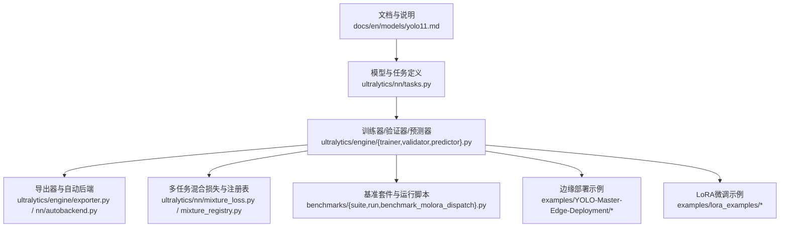
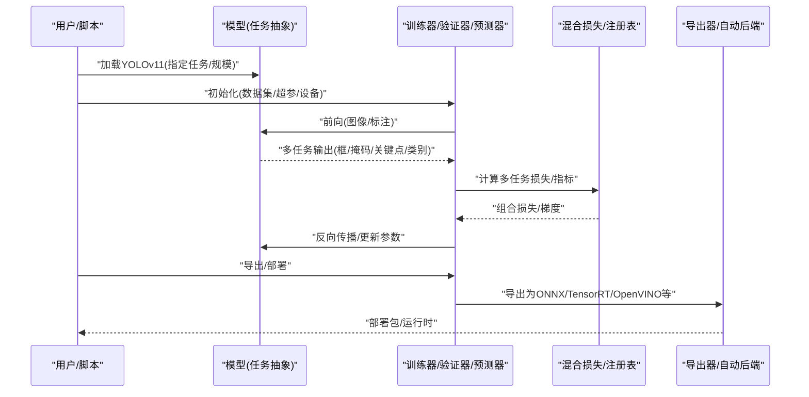
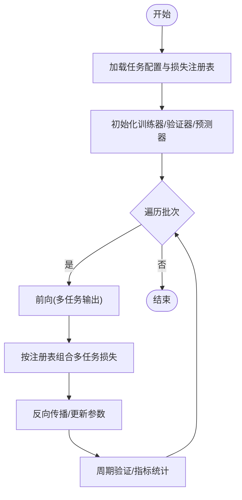
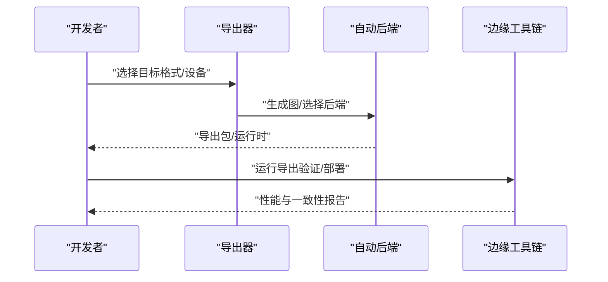
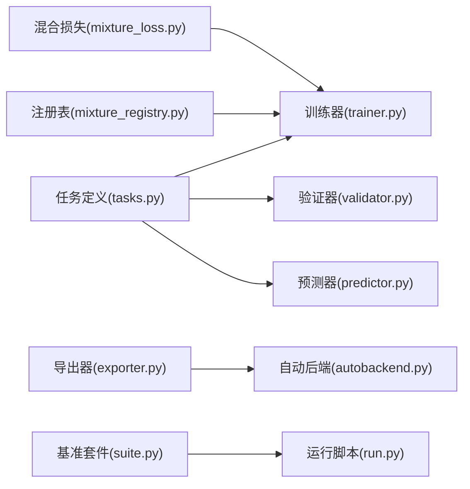

# YOLOv11模型

<cite>
**本文引用的文件**
- [README.md](file://README.md)
- [yolo11.md](file://docs/en/models/yolo11.md)
- [yolo-architecture.md](file://docs/en/guides/yolo-architecture.md)
- [yolo26-mixture-compatibility.md](file://docs/en/guides/yolo26-mixture-compatibility.md)
- [mixture_loss.py](file://ultralytics/nn/mixture_loss.py)
- [mixture_registry.py](file://ultralytics/nn/mixture_registry.py)
- [tasks.py](file://ultralytics/nn/tasks.py)
- [model.py](file://ultralytics/engine/model.py)
- [trainer.py](file://ultralytics/engine/trainer.py)
- [validator.py](file://ultralytics/engine/validator.py)
- [predictor.py](file://ultralytics/engine/predictor.py)
- [exporter.py](file://ultralytics/engine/exporter.py)
- [autobackend.py](file://ultralytics/nn/autobackend.py)
- [benchmark_molora_dispatch.py](file://benchmarks/benchmark_molora_dispatch.py)
- [suite.py](file://benchmarks/suite.py)
- [run.py](file://benchmarks/run.py)
- [yolo11_lora.yaml](file://examples/lora_examples/yolo11_lora.yaml)
- [yolo_master_lora_README.md](file://examples/lora_examples/yolo_master_lora_README.md)
- [export_edge_models.py](file://examples/YOLO-Master-Edge-Deployment/export_edge_models.py)
- [edge_utils.py](file://examples/YOLO-Master-Edge-Deployment/edge_utils.py)
- [validate_edge_outputs.py](file://examples/YOLO-Master-Edge-Deployment/validate_edge_outputs.py)
</cite>

## 目录
1. [简介](#简介)
2. [项目结构](#项目结构)
3. [核心组件](#核心组件)
4. [架构总览](#架构总览)
5. [详细组件分析](#详细组件分析)
6. [依赖关系分析](#依赖关系分析)
7. [性能与效率](#性能与效率)
8. [故障排查指南](#故障排查指南)
9. [结论](#结论)
10. [附录](#附录)

## 简介
本文件面向希望系统掌握YOLOv11多任务统一架构、注意力机制改进、跨任务配置与迁移学习、联合训练策略、基准对比、轻量化与加速部署的工程师与研究者。文档基于仓库中的官方说明、参考实现与示例工程，提供从高层设计到落地实践的全链路解读，并辅以可视化图示帮助理解关键流程与模块关系。

## 项目结构
围绕YOLOv11的多任务能力，仓库采用“模型定义—训练/验证/预测引擎—导出与部署—基准评测—示例与教程”的分层组织方式：
- 模型与任务：在模型与神经网络模块中集中定义YOLOv11及其多任务头（检测、分割、姿态、旋转目标检测、分类），并通过统一接口暴露给上层引擎。
- 训练与推理：engine层封装训练器、验证器、预测器与导出器，屏蔽底层细节，提供一致API。
- 多任务混合与路由：通过混合损失与注册表机制，支撑多任务联合训练与动态路由。
- 基准与评测：提供基准套件与调度脚本，便于在不同任务与规模上复现实验。
- 边缘部署：提供导出与验证工具链，覆盖ONNX/TensorRT/OpenVINO等后端。
- 示例与教程：包含LoRA微调、边缘部署、Triton/C++推理等端到端示例。

**图表来源**
- [yolo11.md](file://docs/en/models/yolo11.md)
- [tasks.py](file://ultralytics/nn/tasks.py)
- [trainer.py](file://ultralytics/engine/trainer.py)
- [validator.py](file://ultralytics/engine/validator.py)
- [predictor.py](file://ultralytics/engine/predictor.py)
- [exporter.py](file://ultralytics/engine/exporter.py)
- [autobackend.py](file://ultralytics/nn/autobackend.py)
- [mixture_loss.py](file://ultralytics/nn/mixture_loss.py)
- [mixture_registry.py](file://ultralytics/nn/mixture_registry.py)
- [suite.py](file://benchmarks/suite.py)
- [run.py](file://benchmarks/run.py)
- [benchmark_molora_dispatch.py](file://benchmarks/benchmark_molora_dispatch.py)
- [export_edge_models.py](file://examples/YOLO-Master-Edge-Deployment/export_edge_models.py)
- [edge_utils.py](file://examples/YOLO-Master-Edge-Deployment/edge_utils.py)
- [validate_edge_outputs.py](file://examples/YOLO-Master-Edge-Deployment/validate_edge_outputs.py)
- [yolo11_lora.yaml](file://examples/lora_examples/yolo11_lora.yaml)
- [yolo_master_lora_README.md](file://examples/lora_examples/yolo_master_lora_README.md)

**章节来源**
- [README.md](file://README.md)
- [yolo11.md](file://docs/en/models/yolo11.md)

## 核心组件
- 统一任务接口与多任务头：通过任务抽象将检测、分割、姿态、旋转目标检测、分类等任务统一到同一模型框架下，共享主干特征提取与部分中间表示，降低重复计算。
- 多任务混合损失与路由：利用混合损失与注册表机制，支持多任务联合训练时的损失组合、权重调度与可选路由策略，提升多任务协同效果。
- 训练/验证/预测/导出流水线：engine层提供一致的API，贯穿数据加载、前向传播、损失计算、指标统计、结果后处理与格式导出。
- 自动后端适配：根据目标平台与格式选择最优执行后端，结合算子优化与图级融合，提高推理吞吐与延迟表现。
- 基准评测套件：提供可复用的基准脚本与任务矩阵，便于横向对比不同任务与模型规模的精度/速度权衡。
- 轻量与部署工具链：涵盖导出、量化、剪枝、编译与运行时适配，配合边缘部署示例完成端到端落地。

**章节来源**
- [tasks.py](file://ultralytics/nn/tasks.py)
- [mixture_loss.py](file://ultralytics/nn/mixture_loss.py)
- [mixture_registry.py](file://ultralytics/nn/mixture_registry.py)
- [model.py](file://ultralytics/engine/model.py)
- [trainer.py](file://ultralytics/engine/trainer.py)
- [validator.py](file://ultralytics/engine/validator.py)
- [predictor.py](file://ultralytics/engine/predictor.py)
- [exporter.py](file://ultralytics/engine/exporter.py)
- [autobackend.py](file://ultralytics/nn/autobackend.py)
- [suite.py](file://benchmarks/suite.py)
- [run.py](file://benchmarks/run.py)

## 架构总览
YOLOv11在多任务场景下的整体架构由“统一主干+多任务头+混合训练+自动后端”构成。下图展示了从输入到输出的端到端流程，以及各组件之间的交互关系。

**图表来源**
- [model.py](file://ultralytics/engine/model.py)
- [trainer.py](file://ultralytics/engine/trainer.py)
- [validator.py](file://ultralytics/engine/validator.py)
- [predictor.py](file://ultralytics/engine/predictor.py)
- [mixture_loss.py](file://ultralytics/nn/mixture_loss.py)
- [mixture_registry.py](file://ultralytics/nn/mixture_registry.py)
- [exporter.py](file://ultralytics/engine/exporter.py)
- [autobackend.py](file://ultralytics/nn/autobackend.py)

## 详细组件分析

### 多任务统一架构与注意力机制改进
- 统一架构要点
  - 共享主干与多尺度特征：在检测、分割、姿态、旋转目标检测与分类任务间复用骨干网络与颈部结构，减少冗余计算。
  - 任务特定头：针对不同任务的输出形式（边界框、掩码、关键点、角度、类别概率）设计专用头，保持任务语义清晰。
  - 统一接口：通过任务抽象类对外暴露一致的forward/loss/inference接口，简化上层调用。
- 注意力机制改进
  - 在骨干或颈部引入更高效的注意力模块，增强小目标与遮挡目标的表征能力，同时控制计算开销。
  - 结合多尺度融合，使注意力在不同分辨率特征图上自适应聚焦关键区域。
- 参考与扩展
  - 官方文档对YOLOv11的整体设计与改进点进行了说明，可作为进一步阅读的基础。

**章节来源**
- [yolo11.md](file://docs/en/models/yolo11.md)
- [yolo-architecture.md](file://docs/en/guides/yolo-architecture.md)
- [tasks.py](file://ultralytics/nn/tasks.py)

### 多任务联合训练与损失组合
- 混合损失与注册表
  - 通过注册表机制管理不同任务的损失函数与权重策略，支持按任务类型动态组合。
  - 在训练阶段，将多任务损失加权求和或按策略调度，以平衡各任务收敛速度与最终性能。
- 训练流程
  - 训练器负责数据迭代、前向/反向、指标统计与日志记录；验证器负责周期性评估；预测器负责推理与后处理。
- 注意事项
  - 任务权重需随训练阶段调整，避免主导任务压制其他任务。
  - 对于长尾或难样本较多的任务，可采用难度感知或重采样策略。

**图表来源**
- [trainer.py](file://ultralytics/engine/trainer.py)
- [validator.py](file://ultralytics/engine/validator.py)
- [mixture_loss.py](file://ultralytics/nn/mixture_loss.py)
- [mixture_registry.py](file://ultralytics/nn/mixture_registry.py)

**章节来源**
- [mixture_loss.py](file://ultralytics/nn/mixture_loss.py)
- [mixture_registry.py](file://ultralytics/nn/mixture_registry.py)
- [trainer.py](file://ultralytics/engine/trainer.py)
- [validator.py](file://ultralytics/engine/validator.py)

### 模型规模扩展与计算效率优化
- 规模扩展
  - 通过缩放深度/宽度/分辨率等维度，生成不同规模的YOLOv11变体，满足从移动端到服务器的多样化需求。
- 计算效率优化
  - 使用高效注意力与卷积组合，减少冗余计算。
  - 在导出阶段启用图级融合、算子替换与内核优化，结合自动后端选择，最大化硬件利用率。
- 基准评测
  - 借助基准套件对不同规模与任务进行横向对比，定位瓶颈与收益点。

**章节来源**
- [yolo11.md](file://docs/en/models/yolo11.md)
- [suite.py](file://benchmarks/suite.py)
- [run.py](file://benchmarks/run.py)
- [benchmark_molora_dispatch.py](file://benchmarks/benchmark_molora_dispatch.py)

### 跨任务配置模板与迁移学习指南
- 配置模板
  - 提供针对YOLOv11的LoRA微调配置文件，便于快速启动跨任务微调。
- 迁移学习步骤
  - 加载预训练权重 → 冻结主干或部分模块 → 替换任务头与类别数 → 设置LoRA秩与学习率 → 小规模数据预热 → 全量微调。
- 最佳实践
  - 先冻结再解冻，逐步扩大可训练范围。
  - 使用较小的初始学习率与warmup，稳定收敛。
  - 监控各任务指标，必要时调整损失权重或数据配比。

**章节来源**
- [yolo11_lora.yaml](file://examples/lora_examples/yolo11_lora.yaml)
- [yolo_master_lora_README.md](file://examples/lora_examples/yolo_master_lora_README.md)

### 自定义任务适配方案与实践
- 任务注册
  - 在任务抽象与注册表中新增自定义任务类型，定义其输出格式与损失函数。
- 数据与标注
  - 适配数据加载器与标注解析器，确保与现有管线兼容。
- 训练与验证
  - 在训练器中集成新任务的损失与指标，在验证器中实现相应的评估逻辑。
- 导出与部署
  - 确保导出器能正确序列化新任务的输出，并在自动后端中可用。

**章节来源**
- [tasks.py](file://ultralytics/nn/tasks.py)
- [mixture_registry.py](file://ultralytics/nn/mixture_registry.py)
- [trainer.py](file://ultralytics/engine/trainer.py)
- [validator.py](file://ultralytics/engine/validator.py)
- [exporter.py](file://ultralytics/engine/exporter.py)

### 轻量化与加速部署实现
- 导出与后端
  - 使用导出器生成目标格式（如ONNX/TensorRT/OpenVINO），并由自动后端选择最优执行路径。
- 边缘部署示例
  - 提供导出脚本、边缘工具与输出校验脚本，形成完整的部署闭环。
- 性能调优
  - 结合量化、剪枝与编译优化，在延迟与吞吐之间取得平衡。

**图表来源**
- [exporter.py](file://ultralytics/engine/exporter.py)
- [autobackend.py](file://ultralytics/nn/autobackend.py)
- [export_edge_models.py](file://examples/YOLO-Master-Edge-Deployment/export_edge_models.py)
- [edge_utils.py](file://examples/YOLO-Master-Edge-Deployment/edge_utils.py)
- [validate_edge_outputs.py](file://examples/YOLO-Master-Edge-Deployment/validate_edge_outputs.py)

**章节来源**
- [exporter.py](file://ultralytics/engine/exporter.py)
- [autobackend.py](file://ultralytics/nn/autobackend.py)
- [export_edge_models.py](file://examples/YOLO-Master-Edge-Deployment/export_edge_models.py)
- [edge_utils.py](file://examples/YOLO-Master-Edge-Deployment/edge_utils.py)
- [validate_edge_outputs.py](file://examples/YOLO-Master-Edge-Deployment/validate_edge_outputs.py)

## 依赖关系分析
YOLOv11的核心依赖关系如下：
- 模型与任务定义被训练器、验证器、预测器共同依赖。
- 混合损失与注册表为训练阶段提供损失组合与策略管理。
- 导出器与自动后端为部署阶段提供格式转换与后端选择。
- 基准套件用于横向评测与回归测试。

**图表来源**
- [tasks.py](file://ultralytics/nn/tasks.py)
- [trainer.py](file://ultralytics/engine/trainer.py)
- [validator.py](file://ultralytics/engine/validator.py)
- [predictor.py](file://ultralytics/engine/predictor.py)
- [mixture_loss.py](file://ultralytics/nn/mixture_loss.py)
- [mixture_registry.py](file://ultralytics/nn/mixture_registry.py)
- [exporter.py](file://ultralytics/engine/exporter.py)
- [autobackend.py](file://ultralytics/nn/autobackend.py)
- [suite.py](file://benchmarks/suite.py)
- [run.py](file://benchmarks/run.py)

**章节来源**
- [tasks.py](file://ultralytics/nn/tasks.py)
- [trainer.py](file://ultralytics/engine/trainer.py)
- [validator.py](file://ultralytics/engine/validator.py)
- [predictor.py](file://ultralytics/engine/predictor.py)
- [mixture_loss.py](file://ultralytics/nn/mixture_loss.py)
- [mixture_registry.py](file://ultralytics/nn/mixture_registry.py)
- [exporter.py](file://ultralytics/engine/exporter.py)
- [autobackend.py](file://ultralytics/nn/autobackend.py)
- [suite.py](file://benchmarks/suite.py)
- [run.py](file://benchmarks/run.py)

## 性能与效率
- 多任务性能权衡
  - 联合训练时，建议对各任务分别统计精度与速度，关注主导任务对其他任务的影响。
- 规模与效率
  - 不同规模模型在精度与延迟之间存在折衷，应结合实际部署环境选择合适版本。
- 基准与回归
  - 使用基准套件定期回归测试，确保改动不破坏既有性能基线。
- 参考文档
  - 官方文档中包含YOLO系列性能指标与对比，可作为参考基线。

**章节来源**
- [suite.py](file://benchmarks/suite.py)
- [run.py](file://benchmarks/run.py)
- [benchmark_molora_dispatch.py](file://benchmarks/benchmark_molora_dispatch.py)
- [yolo11.md](file://docs/en/models/yolo11.md)

## 故障排查指南
- 训练不稳定
  - 检查损失权重是否合理，是否存在某任务主导导致梯度爆炸或消失。
  - 确认数据预处理与标注格式是否与任务头匹配。
- 导出失败或推理异常
  - 核对导出格式与后端兼容性，查看自动后端选择日志。
  - 使用边缘部署示例中的校验脚本验证导出结果的一致性。
- 性能不达预期
  - 检查是否启用了合适的优化选项（图融合、算子替换、量化）。
  - 对比基准套件结果，定位瓶颈层或算子。

**章节来源**
- [exporter.py](file://ultralytics/engine/exporter.py)
- [autobackend.py](file://ultralytics/nn/autobackend.py)
- [validate_edge_outputs.py](file://examples/YOLO-Master-Edge-Deployment/validate_edge_outputs.py)

## 结论
YOLOv11在多任务统一架构下，通过共享主干与任务特定头的设计，有效提升了多任务协同训练的效率与效果。结合混合损失与注册表机制，实现了灵活的任务组合与权重调度。在部署侧，导出器与自动后端提供了良好的跨平台适配能力，配合边缘部署示例与基准套件，形成了从训练到落地的完整闭环。建议在具体项目中依据任务特性与部署约束，选择合适的模型规模与优化策略，并通过基准回归保障稳定性。

## 附录
- 官方文档与架构说明
  - 参考YOLOv11与YOLO架构文档，了解整体设计与改进点。
- 多任务兼容性
  - 参考多任务混合兼容性说明，理解不同任务间的兼容性与差异。

**章节来源**
- [yolo11.md](file://docs/en/models/yolo11.md)
- [yolo-architecture.md](file://docs/en/guides/yolo-architecture.md)
- [yolo26-mixture-compatibility.md](file://docs/en/guides/yolo26-mixture-compatibility.md)