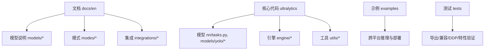
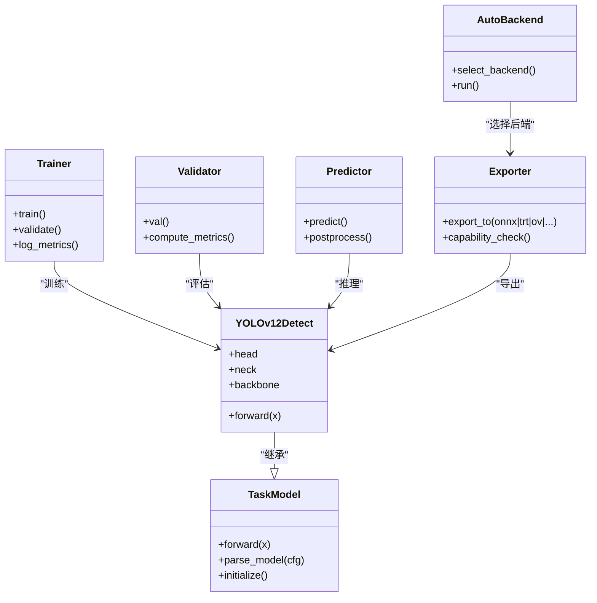
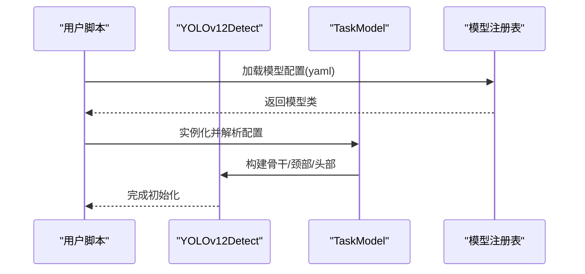
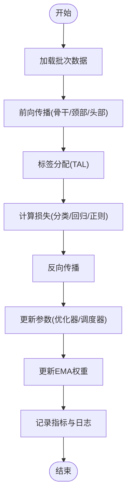
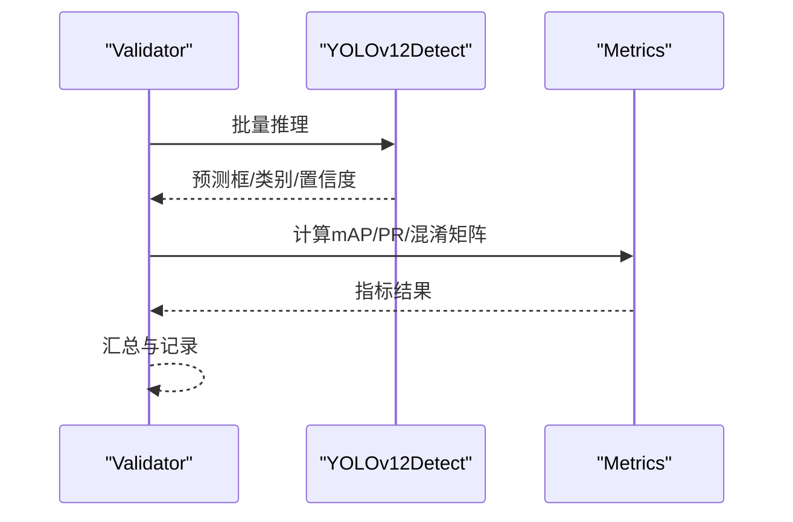
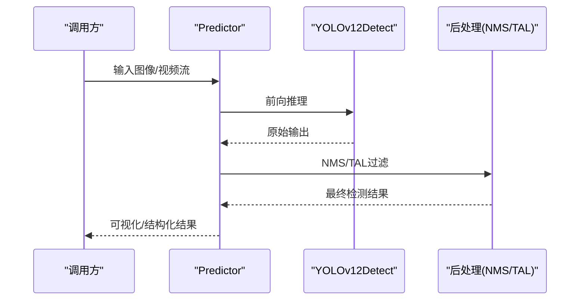
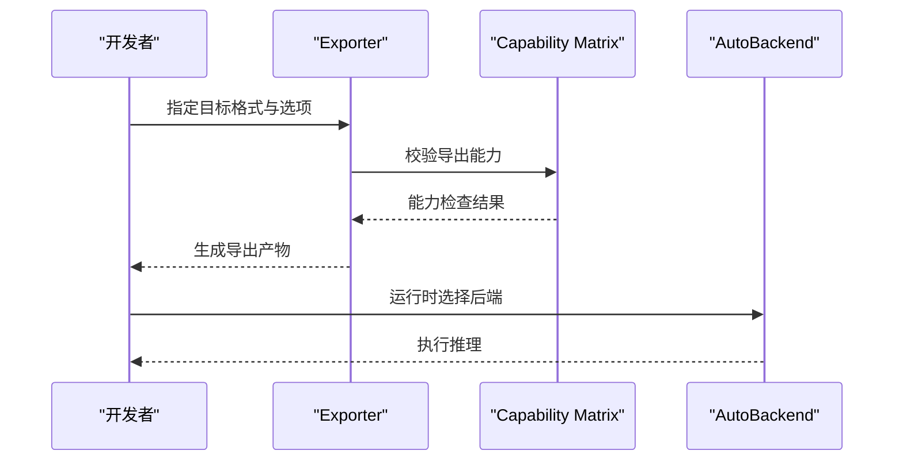
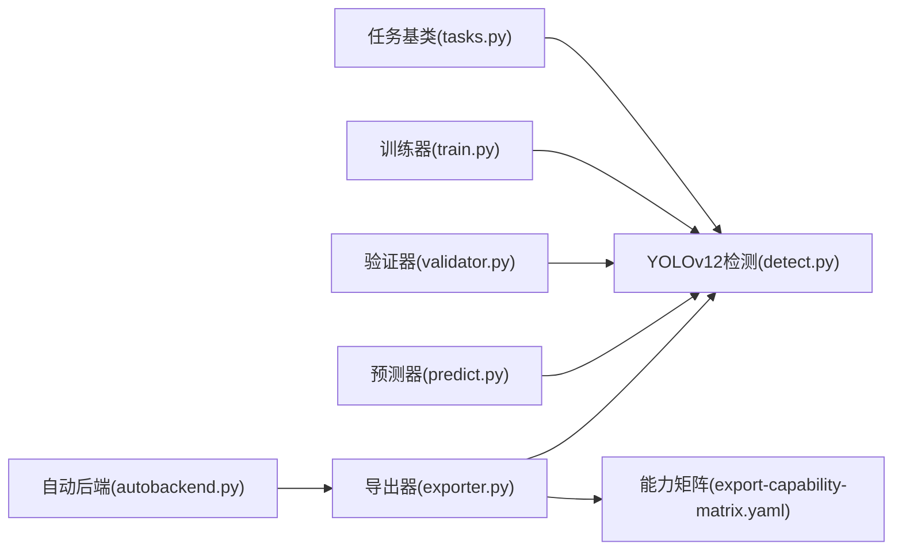

# YOLOv12模型

<cite>
**本文引用的文件**
- [README.md](file://README.md)
- [yolo12.md](file://docs/en/models/yolo12.md)
- [yolo11.md](file://docs/en/models/yolo11.md)
- [yolo-architecture.md](file://docs/en/guides/yolo-architecture.md)
- [model-yaml-config.md](file://docs/en/guides/model-yaml-config.md)
- [yolo-performance-metrics.md](file://docs/en/guides/yolo-performance-metrics.md)
- [model-deployment-practices.md](file://docs/en/guides/model-deployment-practices.md)
- [triton-inference-server.md](file://docs/en/integrations/triton-inference-server.md)
- [openvino.md](file://docs/en/integrations/openvino.md)
- [tensorrt.md](file://docs/en/integrations/tensorrt.md)
- [export-capability-matrix.yaml](file://ultralytics/cfg/export-capability-matrix.yaml)
- [default.yaml](file://ultralytics/cfg/default.yaml)
- [yolo.py](file://ultralytics/models/yolo/model.py)
- [detect.py](file://ultralytics/models/yolo/detect/model.py)
- [train.py](file://ultralytics/engine/trainer.py)
- [predict.py](file://ultralytics/engine/predictor.py)
- [validator.py](file://ultralytics/engine/validator.py)
- [exporter.py](file://ultralytics/engine/exporter.py)
- [tasks.py](file://ultralytics/nn/tasks.py)
- [autobackend.py](file://ultralytics/nn/autobackend.py)
- [benchmarks.py](file://ultralytics/utils/benchmarks.py)
- [tal.py](file://ultralytics/utils/tal.py)
- [loss.py](file://ultralytics/utils/loss.py)
- [metrics.py](file://ultralytics/utils/metrics.py)
</cite>

## 目录
1. [简介](#简介)
2. [项目结构](#项目结构)
3. [核心组件](#核心组件)
4. [架构总览](#架构总览)
5. [详细组件分析](#详细组件分析)
6. [依赖关系分析](#依赖关系分析)
7. [性能与基准](#性能与基准)
8. [训练技巧与调参](#训练技巧与调参)
9. [部署与生产实践](#部署与生产实践)
10. [故障排除指南](#故障排除指南)
11. [结论](#结论)
12. [附录](#附录)

## 简介
本文件面向希望深入理解并高效使用YOLOv12的工程师与研究者，系统梳理其最新架构改进、多尺度特征融合与动态路由机制的创新点，给出针对不同硬件平台的优化策略、模型选择与性能基准对比方法、高级配置与自定义扩展路径，以及生产环境部署最佳实践与常见问题排查。同时，结合仓库中的文档与源码组织，提供从训练到推理、从导出到集成的端到端参考。

## 项目结构
该仓库采用“文档+代码+示例+测试”的分层组织方式：
- 文档层：docs/en 下按任务、模式、平台、集成等维度组织，包含YOLO系列模型说明、训练/验证/预测/导出模式、部署与集成指南等。
- 代码层：ultralytics 为核心实现，包含模型定义、训练/验证/预测引擎、导出工具、后端适配、指标与损失计算等。
- 示例层：examples 提供跨平台推理、边缘部署、ONNX/TensorRT/OpenVINO等集成样例。
- 测试层：tests 覆盖导出能力矩阵、兼容性、DDP稳定性、MoE/MoA相关特性等。

图表来源
- [yolo12.md](file://docs/en/models/yolo12.md)
- [yolo-architecture.md](file://docs/en/guides/yolo-architecture.md)
- [yolo.py](file://ultralytics/models/yolo/model.py)
- [tasks.py](file://ultralytics/nn/tasks.py)

章节来源
- [README.md](file://README.md)
- [yolo12.md](file://docs/en/models/yolo12.md)
- [yolo-architecture.md](file://docs/en/guides/yolo-architecture.md)

## 核心组件
- 模型定义与任务封装
  - 统一任务接口与检测头封装在任务模块中，负责将通用骨干与颈部组合为具体任务（如检测）。
  - YOLOv12的检测模型通过专用模型类注册与加载，支持不同规模变体与配置。
- 训练/验证/预测引擎
  - 训练器负责数据加载、优化器调度、损失计算、EMA与日志记录。
  - 验证器负责指标统计、混淆矩阵、PR曲线与mAP评估。
  - 预测器负责推理流程、后处理（NMS/TAL）与可视化结果。
- 导出与后端适配
  - 导出器支持多种目标格式（ONNX、TensorRT、OpenVINO、TFLite等），并提供能力矩阵校验。
  - 自动后端选择根据运行环境与导出产物选择合适的执行后端。
- 工具与指标
  - TAL（标签分配）、损失函数、指标计算、基准测试等工具贯穿训练与评估全流程。

章节来源
- [tasks.py](file://ultralytics/nn/tasks.py)
- [yolo.py](file://ultralytics/models/yolo/model.py)
- [detect.py](file://ultralytics/models/yolo/detect/model.py)
- [train.py](file://ultralytics/engine/trainer.py)
- [validator.py](file://ultralytics/engine/validator.py)
- [predict.py](file://ultralytics/engine/predictor.py)
- [exporter.py](file://ultralytics/engine/exporter.py)
- [autobackend.py](file://ultralytics/nn/autobackend.py)
- [tal.py](file://ultralytics/utils/tal.py)
- [loss.py](file://ultralytics/utils/loss.py)
- [metrics.py](file://ultralytics/utils/metrics.py)

## 架构总览
YOLOv12在整体设计上延续“骨干-颈部-头部”的经典范式，并在以下方面进行增强：
- 多尺度特征融合：颈部网络引入更灵活的特征金字塔与跨层连接，提升小目标与复杂场景下的表征能力。
- 动态路由机制：在关键模块中引入可学习的门控或稀疏路由，使模型在不同输入样本上自适应地激活子路径，兼顾精度与效率。
- 任务解耦与统一接口：检测、分割、姿态等任务共享统一的模型注册与加载机制，便于扩展与迁移。

图表来源
- [tasks.py](file://ultralytics/nn/tasks.py)
- [yolo.py](file://ultralytics/models/yolo/model.py)
- [detect.py](file://ultralytics/models/yolo/detect/model.py)
- [train.py](file://ultralytics/engine/trainer.py)
- [validator.py](file://ultralytics/engine/validator.py)
- [predict.py](file://ultralytics/engine/predictor.py)
- [exporter.py](file://ultralytics/engine/exporter.py)
- [autobackend.py](file://ultralytics/nn/autobackend.py)

## 详细组件分析

### 模型定义与注册
- 统一任务基类提供模型构建、权重初始化与配置解析的统一入口。
- YOLOv12检测模型在检测子模块中实现，包含骨干、颈部与检测头的组装逻辑，并通过注册表对外暴露。
- 模型配置文件（YAML）描述网络拓扑、通道数、深度缩放因子等超参，便于快速切换不同规模变体。

图表来源
- [tasks.py](file://ultralytics/nn/tasks.py)
- [yolo.py](file://ultralytics/models/yolo/model.py)
- [detect.py](file://ultralytics/models/yolo/detect/model.py)

章节来源
- [tasks.py](file://ultralytics/nn/tasks.py)
- [yolo.py](file://ultralytics/models/yolo/model.py)
- [detect.py](file://ultralytics/models/yolo/detect/model.py)
- [model-yaml-config.md](file://docs/en/guides/model-yaml-config.md)

### 训练流程与损失/分配
- 训练器负责数据迭代、前向传播、损失计算、反向传播与参数更新。
- 标签分配策略（TAL）与损失函数共同决定定位与分类优化的方向与强度。
- EMA（指数移动平均）用于稳定训练后期权重，提升泛化能力。

图表来源
- [train.py](file://ultralytics/engine/trainer.py)
- [tal.py](file://ultralytics/utils/tal.py)
- [loss.py](file://ultralytics/utils/loss.py)

章节来源
- [train.py](file://ultralytics/engine/trainer.py)
- [tal.py](file://ultralytics/utils/tal.py)
- [loss.py](file://ultralytics/utils/loss.py)

### 验证与指标
- 验证器对验证集进行推理与后处理，计算mAP、召回率、精确率等指标，并生成PR曲线与混淆矩阵。
- 指标计算模块提供数值稳定的评估逻辑，支持不同IoU阈值与类别聚合。

图表来源
- [validator.py](file://ultralytics/engine/validator.py)
- [metrics.py](file://ultralytics/utils/metrics.py)

章节来源
- [validator.py](file://ultralytics/engine/validator.py)
- [metrics.py](file://ultralytics/utils/metrics.py)
- [yolo-performance-metrics.md](file://docs/en/guides/yolo-performance-metrics.md)

### 推理与后处理
- 预测器负责图像预处理、模型推理、NMS/TAL后处理与结果可视化。
- 支持多线程/批处理与设备自动选择，提高吞吐与延迟表现。

图表来源
- [predict.py](file://ultralytics/engine/predictor.py)
- [tal.py](file://ultralytics/utils/tal.py)

章节来源
- [predict.py](file://ultralytics/engine/predictor.py)
- [tal.py](file://ultralytics/utils/tal.py)

### 导出与后端适配
- 导出器支持多种目标格式，并提供能力矩阵检查以确保导出产物满足预期。
- 自动后端根据运行环境与导出格式选择最优执行后端（如TensorRT、OpenVINO、ONNXRuntime等）。

图表来源
- [exporter.py](file://ultralytics/engine/exporter.py)
- [export-capability-matrix.yaml](file://ultralytics/cfg/export-capability-matrix.yaml)
- [autobackend.py](file://ultralytics/nn/autobackend.py)

章节来源
- [exporter.py](file://ultralytics/engine/exporter.py)
- [export-capability-matrix.yaml](file://ultralytics/cfg/export-capability-matrix.yaml)
- [autobackend.py](file://ultralytics/nn/autobackend.py)

## 依赖关系分析
- 模型与任务：YOLOv12检测模型依赖任务基类进行统一构建与注册。
- 训练/验证/预测：三者均依赖模型与工具模块（损失、指标、TAL等）。
- 导出与后端：导出器依赖能力矩阵与自动后端以适配不同运行环境。

图表来源
- [tasks.py](file://ultralytics/nn/tasks.py)
- [detect.py](file://ultralytics/models/yolo/detect/model.py)
- [train.py](file://ultralytics/engine/trainer.py)
- [validator.py](file://ultralytics/engine/validator.py)
- [predict.py](file://ultralytics/engine/predictor.py)
- [exporter.py](file://ultralytics/engine/exporter.py)
- [export-capability-matrix.yaml](file://ultralytics/cfg/export-capability-matrix.yaml)
- [autobackend.py](file://ultralytics/nn/autobackend.py)

章节来源
- [tasks.py](file://ultralytics/nn/tasks.py)
- [detect.py](file://ultralytics/models/yolo/detect/model.py)
- [train.py](file://ultralytics/engine/trainer.py)
- [validator.py](file://ultralytics/engine/validator.py)
- [predict.py](file://ultralytics/engine/predictor.py)
- [exporter.py](file://ultralytics/engine/exporter.py)
- [export-capability-matrix.yaml](file://ultralytics/cfg/export-capability-matrix.yaml)
- [autobackend.py](file://ultralytics/nn/autobackend.py)

## 性能与基准
- 基准测试工具提供端到端延迟与吞吐测量，支持不同输入尺寸、批量大小与后端。
- 建议在不同硬件（CPU/GPU/边缘设备）与不同导出格式下进行对比，以获得真实部署环境的性能画像。
- 结合指标文档了解mAP、召回率、精确率等评估维度的含义与计算方法。

章节来源
- [benchmarks.py](file://ultralytics/utils/benchmarks.py)
- [yolo-performance-metrics.md](file://docs/en/guides/yolo-performance-metrics.md)

## 训练技巧与调参
- 学习率与调度：采用余弦退火或多阶段学习率策略，配合Warmup提升稳定性。
- 数据增强：混合随机裁剪、Mosaic、MixUp等增强策略有助于提升鲁棒性。
- 标签分配与损失：合理设置TAL阈值与损失权重，平衡定位与分类优化。
- 早停与EMA：启用EMA与早停策略，避免过拟合并提升泛化。
- 超参搜索：利用内置调参工具进行网格/贝叶斯搜索，针对数据集特点定制。

章节来源
- [train.py](file://ultralytics/engine/trainer.py)
- [tal.py](file://ultralytics/utils/tal.py)
- [loss.py](file://ultralytics/utils/loss.py)
- [model-yaml-config.md](file://docs/en/guides/model-yaml-config.md)

## 部署与生产实践
- 导出格式选择：
  - ONNX：通用性强，适合跨平台推理。
  - TensorRT：GPU高吞吐低延迟，适合数据中心与高性能服务器。
  - OpenVINO：Intel CPU/加速器优化，适合边缘与桌面部署。
  - TFLite：移动端与嵌入式设备友好。
- 后端选择：使用自动后端根据运行环境选择最优执行器，减少适配成本。
- 服务化部署：结合Triton Inference Server实现并发请求、动态批处理与版本管理。
- 监控与维护：建立性能监控、错误追踪与回滚机制，确保线上稳定性。

章节来源
- [openvino.md](file://docs/en/integrations/openvino.md)
- [tensorrt.md](file://docs/en/integrations/tensorrt.md)
- [triton-inference-server.md](file://docs/en/integrations/triton-inference-server.md)
- [model-deployment-practices.md](file://docs/en/guides/model-deployment-practices.md)
- [autobackend.py](file://ultralytics/nn/autobackend.py)

## 故障排除指南
- 导出失败或能力不匹配：检查导出能力矩阵与目标格式支持情况，确认依赖库版本与环境。
- 推理精度下降：核对导出前后算子一致性，检查NMS/TAL参数与阈值设置。
- 训练不稳定或NaN：检查数据质量、学习率与梯度裁剪，启用AMP时注意数值稳定性。
- 资源不足或OOM：降低输入分辨率或批量大小，启用梯度累积与半精度训练。
- 跨平台差异：对不同后端进行回归测试，确保行为一致。

章节来源
- [export-capability-matrix.yaml](file://ultralytics/cfg/export-capability-matrix.yaml)
- [exporter.py](file://ultralytics/engine/exporter.py)
- [train.py](file://ultralytics/engine/trainer.py)
- [predict.py](file://ultralytics/engine/predictor.py)

## 结论
YOLOv12在多尺度特征融合与动态路由机制上的改进，使其在复杂场景与小目标检测中具备更强的表征能力与自适应效率。结合完善的训练/验证/预测/导出工具链与丰富的集成方案，YOLOv12能够覆盖从研发到生产的完整链路。建议在真实业务数据上进行端到端验证，并根据硬件与部署约束选择合适的模型规模与后端，以实现精度与性能的平衡。

## 附录

### 模型选择指南
- 小规模变体：适用于边缘设备与实时性要求高的场景，优先关注延迟与内存占用。
- 中等规模变体：在精度与效率之间取得较好平衡，适合多数工业应用。
- 大规模变体：追求更高精度，适合离线分析与高精度需求场景。
- 选择依据：数据集复杂度、目标尺度分布、硬件算力与延迟预算。

章节来源
- [yolo12.md](file://docs/en/models/yolo12.md)
- [model-yaml-config.md](file://docs/en/guides/model-yaml-config.md)

### 与YOLOv11的主要改进与升级路径
- 架构层面：颈部融合与动态路由增强，提升多尺度与自适应能力。
- 训练层面：标签分配与损失策略优化，提升收敛稳定性与泛化。
- 工程层面：导出能力矩阵与自动后端选择，简化部署适配。
- 升级建议：从v11配置平滑迁移至v12，逐步替换颈部与路由模块，重新校准超参与阈值。

章节来源
- [yolo12.md](file://docs/en/models/yolo12.md)
- [yolo11.md](file://docs/en/models/yolo11.md)
- [yolo-architecture.md](file://docs/en/guides/yolo-architecture.md)

### 高级配置与自定义扩展
- YAML配置：通过模型配置文件调整骨干/颈部/头部结构、通道数与深度缩放因子。
- 自定义模块：在任务基类基础上扩展新模块，保持注册与加载机制一致。
- 训练回调：插入自定义回调以记录中间状态、动态调整超参或触发额外评估。
- 导出扩展：基于能力矩阵与导出器接口，新增目标格式或优化选项。

章节来源
- [model-yaml-config.md](file://docs/en/guides/model-yaml-config.md)
- [tasks.py](file://ultralytics/nn/tasks.py)
- [train.py](file://ultralytics/engine/trainer.py)
- [exporter.py](file://ultralytics/engine/exporter.py)
- [export-capability-matrix.yaml](file://ultralytics/cfg/export-capability-matrix.yaml)