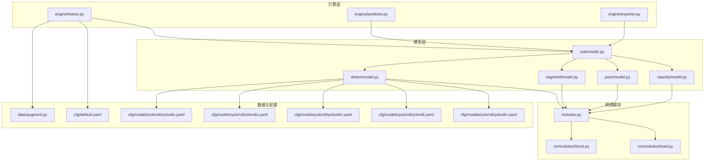
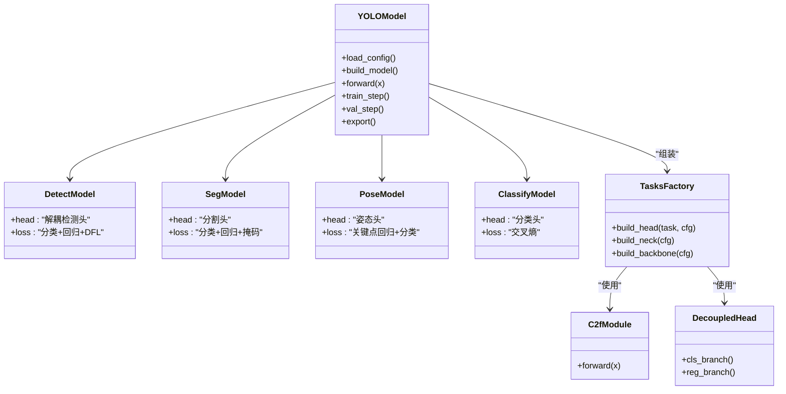
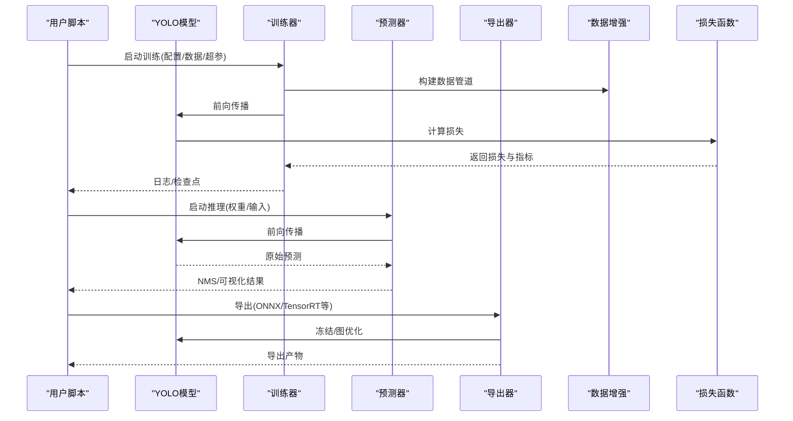
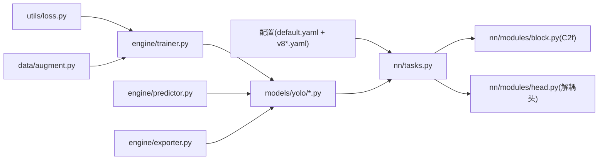

# YOLOv8模型

<cite>
**本文引用的文件**
- [ultralytics/cfg/models/yolo/v8/README.md](file://ultralytics/cfg/models/yolo/v8/README.md)
- [ultralytics/cfg/models/yolo/v8/yolov8.yaml](file://ultralytics/cfg/models/yolo/v8/yolov8.yaml)
- [ultralytics/cfg/models/yolo/v8/yolov8n.yaml](file://ultralytics/cfg/models/yolo/v8/yolov8n.yaml)
- [ultralytics/cfg/models/yolo/v8/yolov8s.yaml](file://ultralytics/cfg/models/yolo/v8/yolov8s.yaml)
- [ultralytics/cfg/models/yolo/v8/yolov8m.yaml](file://ultralytics/cfg/models/yolo/v8/yolov8m.yaml)
- [ultralytics/cfg/models/yolo/v8/yolov8l.yaml](file://ultralytics/cfg/models/yolo/v8/yolov8l.yaml)
- [ultralytics/cfg/models/yolo/v8/yolov8x.yaml](file://ultralytics/cfg/models/yolo/v8/yolov8x.yaml)
- [ultralytics/models/yolo/model.py](file://ultralytics/models/yolo/model.py)
- [ultralytics/models/yolo/detect/model.py](file://ultralytics/models/yolo/detect/model.py)
- [ultralytics/models/yolo/segment/model.py](file://ultralytics/models/yolo/segment/model.py)
- [ultralytics/models/yolo/pose/model.py](file://ultralytics/models/yolo/pose/model.py)
- [ultralytics/models/yolo/classify/model.py](file://ultralytics/models/yolo/classify/model.py)
- [ultralytics/nn/tasks.py](file://ultralytics/nn/tasks.py)
- [ultralytics/nn/modules/block.py](file://ultralytics/nn/modules/block.py)
- [ultralytics/nn/modules/head.py](file://ultralytics/nn/modules/head.py)
- [ultralytics/utils/loss.py](file://ultralytics/utils/loss.py)
- [ultralytics/engine/trainer.py](file://ultralytics/engine/trainer.py)
- [ultralytics/engine/predictor.py](file://ultralytics/engine/predictor.py)
- [ultralytics/engine/exporter.py](file://ultralytics/engine/exporter.py)
- [ultralytics/data/augment.py](file://ultralytics/data/augment.py)
- [ultralytics/cfg/default.yaml](file://ultralytics/cfg/default.yaml)
- [examples/YOLOv8-ONNXRuntime-Python/main.py](file://examples/YOLOv8-ONNXRuntime-Python/main.py)
- [examples/tutorial.ipynb](file://examples/tutorial.ipynb)
</cite>

## 目录
1. [简介](#简介)
2. [项目结构](#项目结构)
3. [核心组件](#核心组件)
4. [架构总览](#架构总览)
5. [详细组件分析](#详细组件分析)
6. [依赖关系分析](#依赖关系分析)
7. [性能与规模特性](#性能与规模特性)
8. [配置语法说明](#配置语法说明)
9. [Python API使用指南](#python-api使用指南)
10. [损失函数与训练策略](#损失函数与训练策略)
11. [故障排查](#故障排查)
12. [结论](#结论)

## 简介
本文件面向希望深入理解并高效使用YOLOv8的工程师与研究者，系统阐述其架构设计、任务支持、配置体系、训练与推理流程、导出能力以及最佳实践。重点覆盖：
- C2f模块、解耦头、Anchor-Free检测头等关键改进
- n/s/m/l/x多尺度模型的参数与性能权衡
- 目标检测、实例分割、姿态估计、分类等任务统一建模方式
- 配置文件语法与超参体系
- Python API的训练、推理与导出路径
- 损失函数设计与训练优化策略

## 项目结构
仓库采用“模块化+任务化”的组织方式：
- 模型定义位于 ultralytics/models/yolo 下，按任务（detect/segment/pose/classify）拆分
- 通用网络模块集中于 ultralytics/nn/modules，包含C2f、Head等基础构件
- 任务级任务工厂与动态构建逻辑在 ultralytics/nn/tasks.py
- 训练/验证/预测/导出引擎在 ultralytics/engine 下
- 数据增强与数据集加载在 ultralytics/data 下
- 默认配置与任务级配置在 ultralytics/cfg 下
- 示例与教程在 examples 下

图表来源
- [ultralytics/models/yolo/model.py](file://ultralytics/models/yolo/model.py)
- [ultralytics/models/yolo/detect/model.py](file://ultralytics/models/yolo/detect/model.py)
- [ultralytics/models/yolo/segment/model.py](file://ultralytics/models/yolo/segment/model.py)
- [ultralytics/models/yolo/pose/model.py](file://ultralytics/models/yolo/pose/model.py)
- [ultralytics/models/yolo/classify/model.py](file://ultralytics/models/yolo/classify/model.py)
- [ultralytics/nn/tasks.py](file://ultralytics/nn/tasks.py)
- [ultralytics/nn/modules/block.py](file://ultralytics/nn/modules/block.py)
- [ultralytics/nn/modules/head.py](file://ultralytics/nn/modules/head.py)
- [ultralytics/engine/trainer.py](file://ultralytics/engine/trainer.py)
- [ultralytics/engine/predictor.py](file://ultralytics/engine/predictor.py)
- [ultralytics/engine/exporter.py](file://ultralytics/engine/exporter.py)
- [ultralytics/data/augment.py](file://ultralytics/data/augment.py)
- [ultralytics/cfg/default.yaml](file://ultralytics/cfg/default.yaml)
- [ultralytics/cfg/models/yolo/v8/yolov8n.yaml](file://ultralytics/cfg/models/yolo/v8/yolov8n.yaml)
- [ultralytics/cfg/models/yolo/v8/yolov8s.yaml](file://ultralytics/cfg/models/yolo/v8/yolov8s.yaml)
- [ultralytics/cfg/models/yolo/v8/yolov8m.yaml](file://ultralytics/cfg/models/yolo/v8/yolov8m.yaml)
- [ultralytics/cfg/models/yolo/v8/yolov8l.yaml](file://ultralytics/cfg/models/yolo/v8/yolov8l.yaml)
- [ultralytics/cfg/models/yolo/v8/yolov8x.yaml](file://ultralytics/cfg/models/yolo/v8/yolov8x.yaml)

章节来源
- [ultralytics/models/yolo/model.py](file://ultralytics/models/yolo/model.py)
- [ultralytics/nn/tasks.py](file://ultralytics/nn/tasks.py)
- [ultralytics/nn/modules/block.py](file://ultralytics/nn/modules/block.py)
- [ultralytics/nn/modules/head.py](file://ultralytics/nn/modules/head.py)
- [ultralytics/engine/trainer.py](file://ultralytics/engine/trainer.py)
- [ultralytics/engine/predictor.py](file://ultralytics/engine/predictor.py)
- [ultralytics/engine/exporter.py](file://ultralytics/engine/exporter.py)
- [ultralytics/data/augment.py](file://ultralytics/data/augment.py)
- [ultralytics/cfg/default.yaml](file://ultralytics/cfg/default.yaml)
- [ultralytics/cfg/models/yolo/v8/yolov8n.yaml](file://ultralytics/cfg/models/yolo/v8/yolov8n.yaml)
- [ultralytics/cfg/models/yolo/v8/yolov8s.yaml](file://ultralytics/cfg/models/yolo/v8/yolov8s.yaml)
- [ultralytics/cfg/models/yolo/v8/yolov8m.yaml](file://ultralytics/cfg/models/yolo/v8/yolov8m.yaml)
- [ultralytics/cfg/models/yolo/v8/yolov8l.yaml](file://ultralytics/cfg/models/yolo/v8/yolov8l.yaml)
- [ultralytics/cfg/models/yolo/v8/yolov8x.yaml](file://ultralytics/cfg/models/yolo/v8/yolov8x.yaml)

## 核心组件
- C2f模块：引入更丰富的特征融合路径与残差连接，提升小目标与密集场景下的表征能力，同时保持计算效率。
- 解耦头：将分类与回归分支分离，减少任务间干扰，提高定位精度与类别判别力。
- Anchor-Free检测头：直接预测对象中心与宽高偏移，简化后处理，提升端到端优化稳定性。
- 任务统一建模：通过任务工厂动态装配Backbone、Neck与Head，实现检测、分割、姿态、分类的统一接口。

章节来源
- [ultralytics/nn/modules/block.py](file://ultralytics/nn/modules/block.py)
- [ultralytics/nn/modules/head.py](file://ultralytics/nn/modules/head.py)
- [ultralytics/nn/tasks.py](file://ultralytics/nn/tasks.py)

## 架构总览
YOLOv8采用“Backbone + Neck + Head”的三阶段结构，结合C2f与解耦头，形成高吞吐、高精度的单阶段检测范式。不同任务共享同一套构建机制，仅替换Head与损失函数。

图表来源
- [ultralytics/models/yolo/model.py](file://ultralytics/models/yolo/model.py)
- [ultralytics/models/yolo/detect/model.py](file://ultralytics/models/yolo/detect/model.py)
- [ultralytics/models/yolo/segment/model.py](file://ultralytics/models/yolo/segment/model.py)
- [ultralytics/models/yolo/pose/model.py](file://ultralytics/models/yolo/pose/model.py)
- [ultralytics/models/yolo/classify/model.py](file://ultralytics/models/yolo/classify/model.py)
- [ultralytics/nn/tasks.py](file://ultralytics/nn/tasks.py)
- [ultralytics/nn/modules/block.py](file://ultralytics/nn/modules/block.py)
- [ultralytics/nn/modules/head.py](file://ultralytics/nn/modules/head.py)

## 详细组件分析

### C2f模块
- 设计要点：
  - 多层并行卷积与跨层连接，增强特征多样性
  - 残差式聚合，缓解梯度消失，利于深层堆叠
  - 在颈部中广泛使用，提升多尺度融合效果
- 复杂度与收益：
  - 相比传统瓶颈块，增加少量FLOPs，显著改善小目标召回
- 适用场景：
  - 密集小目标、遮挡严重、复杂背景的检测与分割

章节来源
- [ultralytics/nn/modules/block.py](file://ultralytics/nn/modules/block.py)

### 解耦头与Anchor-Free检测头
- 解耦头：
  - 分类分支专注类别判别，回归分支专注边界框或掩码/关键点预测
  - 降低任务耦合，提升收敛稳定性
- Anchor-Free：
  - 以对象为中心点预测，避免锚框先验带来的搜索空间冗余
  - 配合动态正样本分配策略，提升训练效率与精度
- 输出格式：
  - 检测：类别概率与边界框偏移
  - 分割：类别+掩码系数
  - 姿态：类别+关键点坐标
  - 分类：类别概率

章节来源
- [ultralytics/nn/modules/head.py](file://ultralytics/nn/modules/head.py)
- [ultralytics/nn/tasks.py](file://ultralytics/nn/tasks.py)

### 任务工厂与动态装配
- 根据任务类型与配置文件动态构建Backbone、Neck与Head
- 统一前向接口，便于训练/验证/导出复用
- 支持扩展新任务时仅需注册Head与Loss

章节来源
- [ultralytics/nn/tasks.py](file://ultralytics/nn/tasks.py)

### 训练/推理/导出流水线

图表来源
- [ultralytics/engine/trainer.py](file://ultralytics/engine/trainer.py)
- [ultralytics/engine/predictor.py](file://ultralytics/engine/predictor.py)
- [ultralytics/engine/exporter.py](file://ultralytics/engine/exporter.py)
- [ultralytics/data/augment.py](file://ultralytics/data/augment.py)
- [ultralytics/utils/loss.py](file://ultralytics/utils/loss.py)
- [ultralytics/models/yolo/model.py](file://ultralytics/models/yolo/model.py)

## 依赖关系分析
- 模型层依赖任务工厂进行动态构建
- 任务工厂依赖基础模块（C2f、Head）
- 引擎层依赖模型与损失函数
- 数据层为训练提供增强与批处理
- 配置层提供默认值与任务级覆盖

图表来源
- [ultralytics/cfg/default.yaml](file://ultralytics/cfg/default.yaml)
- [ultralytics/cfg/models/yolo/v8/yolov8n.yaml](file://ultralytics/cfg/models/yolo/v8/yolov8n.yaml)
- [ultralytics/nn/tasks.py](file://ultralytics/nn/tasks.py)
- [ultralytics/nn/modules/block.py](file://ultralytics/nn/modules/block.py)
- [ultralytics/nn/modules/head.py](file://ultralytics/nn/modules/head.py)
- [ultralytics/models/yolo/model.py](file://ultralytics/models/yolo/model.py)
- [ultralytics/engine/trainer.py](file://ultralytics/engine/trainer.py)
- [ultralytics/engine/predictor.py](file://ultralytics/engine/predictor.py)
- [ultralytics/engine/exporter.py](file://ultralytics/engine/exporter.py)
- [ultralytics/utils/loss.py](file://ultralytics/utils/loss.py)
- [ultralytics/data/augment.py](file://ultralytics/data/augment.py)

## 性能与规模特性
- 模型规模：n/s/m/l/x，随深度与宽度递增，精度提升但推理延迟与显存占用增加
- 典型特点：
  - n/s：轻量快速，适合边缘设备与实时应用
  - m/l：平衡精度与速度，适合服务器端部署
  - x：追求极致精度，适合离线高精度场景
- 选择建议：
  - 资源受限优先n/s；生产环境常用m/l；研究对比用x

章节来源
- [ultralytics/cfg/models/yolo/v8/README.md](file://ultralytics/cfg/models/yolo/v8/README.md)
- [ultralytics/cfg/models/yolo/v8/yolov8n.yaml](file://ultralytics/cfg/models/yolo/v8/yolov8n.yaml)
- [ultralytics/cfg/models/yolo/v8/yolov8s.yaml](file://ultralytics/cfg/models/yolo/v8/yolov8s.yaml)
- [ultralytics/cfg/models/yolo/v8/yolov8m.yaml](file://ultralytics/cfg/models/yolo/v8/yolov8m.yaml)
- [ultralytics/cfg/models/yolo/v8/yolov8l.yaml](file://ultralytics/cfg/models/yolo/v8/yolov8l.yaml)
- [ultralytics/cfg/models/yolo/v8/yolov8x.yaml](file://ultralytics/cfg/models/yolo/v8/yolov8x.yaml)

## 配置语法说明
- 默认配置：
  - 学习率、优化器、批次大小、图像尺寸、数据路径、增强策略等
- 任务级配置：
  - 各规模模型（n/s/m/l/x）的网络深度、宽度、通道数、层数等
- 关键字段（示例性说明，具体以实际配置为准）：
  - model：指定模型配置文件路径
  - data：数据集配置文件路径
  - epochs：训练轮数
  - batch：批次大小
  - imgsz：输入图像尺寸
  - lr0：初始学习率
  - optimizer：优化器名称
  - augment：数据增强开关与强度
  - task：任务类型（detect/segment/pose/classify）
  - weights：预训练权重路径
  - device：运行设备（cpu/cuda）
- 覆盖策略：
  - 命令行参数可覆盖default.yaml与任务级配置中的同名字段

章节来源
- [ultralytics/cfg/default.yaml](file://ultralytics/cfg/default.yaml)
- [ultralytics/cfg/models/yolo/v8/yolov8n.yaml](file://ultralytics/cfg/models/yolo/v8/yolov8n.yaml)
- [ultralytics/cfg/models/yolo/v8/yolov8s.yaml](file://ultralytics/cfg/models/yolo/v8/yolov8s.yaml)
- [ultralytics/cfg/models/yolo/v8/yolov8m.yaml](file://ultralytics/cfg/models/yolo/v8/yolov8m.yaml)
- [ultralytics/cfg/models/yolo/v8/yolov8l.yaml](file://ultralytics/cfg/models/yolo/v8/yolov8l.yaml)
- [ultralytics/cfg/models/yolo/v8/yolov8x.yaml](file://ultralytics/cfg/models/yolo/v8/yolov8x.yaml)

## Python API使用指南
- 训练
  - 通过模型类加载任务配置与权重，调用训练方法传入数据路径与超参
  - 参考路径：[ultralytics/models/yolo/model.py](file://ultralytics/models/yolo/model.py)、[ultralytics/engine/trainer.py](file://ultralytics/engine/trainer.py)
- 推理
  - 加载权重后对图像或视频流进行预测，获取检测结果并进行可视化
  - 参考路径：[ultralytics/engine/predictor.py](file://ultralytics/engine/predictor.py)、[examples/YOLOv8-ONNXRuntime-Python/main.py](file://examples/YOLOv8-ONNXRuntime-Python/main.py)
- 导出
  - 支持导出为ONNX、TensorRT、OpenVINO等格式，便于部署
  - 参考路径：[ultralytics/engine/exporter.py](file://ultralytics/engine/exporter.py)
- 教程与示例
  - 交互式教程与常见用例可在notebook中查看
  - 参考路径：[examples/tutorial.ipynb](file://examples/tutorial.ipynb)

章节来源
- [ultralytics/models/yolo/model.py](file://ultralytics/models/yolo/model.py)
- [ultralytics/engine/trainer.py](file://ultralytics/engine/trainer.py)
- [ultralytics/engine/predictor.py](file://ultralytics/engine/predictor.py)
- [ultralytics/engine/exporter.py](file://ultralytics/engine/exporter.py)
- [examples/YOLOv8-ONNXRuntime-Python/main.py](file://examples/YOLOv8-ONNXRuntime-Python/main.py)
- [examples/tutorial.ipynb](file://examples/tutorial.ipynb)

## 损失函数与训练策略
- 损失组成：
  - 分类损失：类别判别误差
  - 回归损失：边界框/掩码/关键点定位误差
  - DFL（Distribution Focal Loss）：细化边界框分布，提升定位精度
- 正负样本分配：
  - 基于IoU与类别置信度的动态匹配策略，自适应选择正样本
- 训练策略：
  - 学习率调度（余弦退火）、EMA平滑、混合精度训练
  - 数据增强（Mosaic、MixUp、随机裁剪、色彩抖动等）
- 评估指标：
  - mAP@0.5:0.95、Precision、Recall、F1等

章节来源
- [ultralytics/utils/loss.py](file://ultralytics/utils/loss.py)
- [ultralytics/data/augment.py](file://ultralytics/data/augment.py)
- [ultralytics/engine/trainer.py](file://ultralytics/engine/trainer.py)

## 故障排查
- 常见问题
  - 显存不足：减小batch或imgsz，启用混合精度
  - 训练不收敛：调整lr0、optimizer、数据质量与标注一致性
  - 导出失败：检查后端版本与算子支持，必要时降级导出格式
- 调试建议
  - 打印中间张量形状与数值范围，定位NaN/Inf
  - 逐步关闭增强与正则项，验证数据与标签正确性
  - 使用最小复现脚本与固定随机种子保证可重复性

章节来源
- [ultralytics/engine/trainer.py](file://ultralytics/engine/trainer.py)
- [ultralytics/engine/exporter.py](file://ultralytics/engine/exporter.py)
- [ultralytics/utils/loss.py](file://ultralytics/utils/loss.py)

## 结论
YOLOv8通过C2f、解耦头与Anchor-Free检测头等创新，在保持高效率的同时显著提升精度与鲁棒性。统一的模型构建与任务接口使得检测、分割、姿态、分类等多任务得以在同一框架内高效实现。借助完善的配置体系与Python API，用户可以快速完成从训练到部署的全流程。推荐根据业务需求选择合适的模型规模，并结合数据增强与损失策略进行调优，以获得最佳性能与成本平衡。