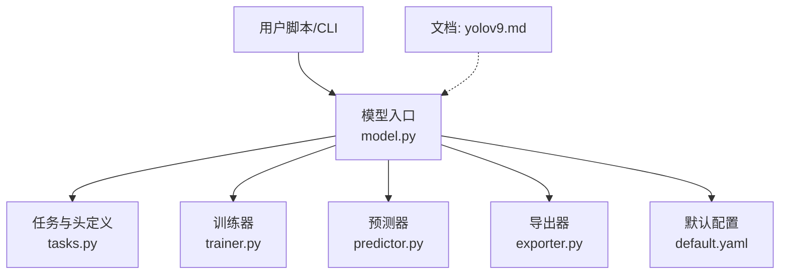
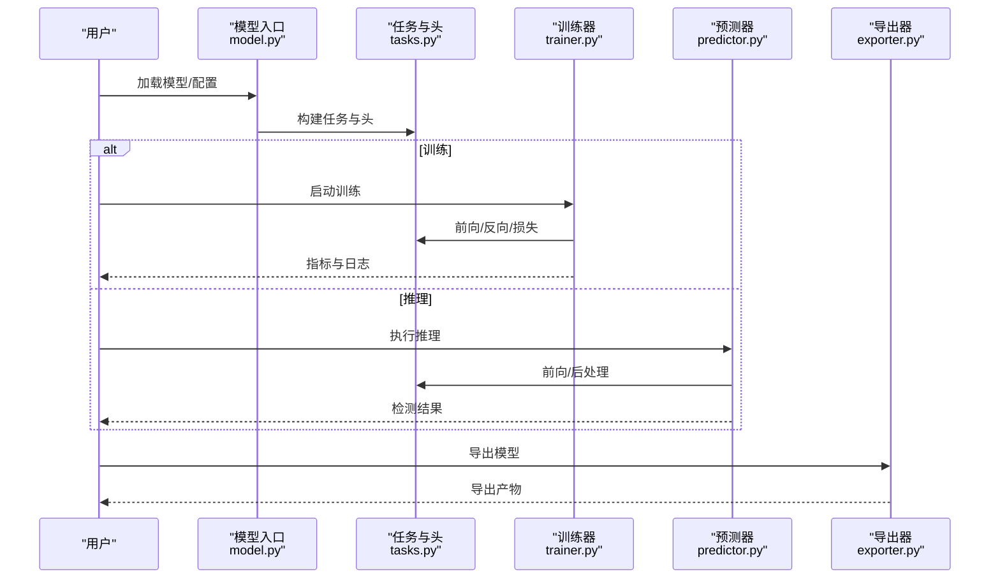
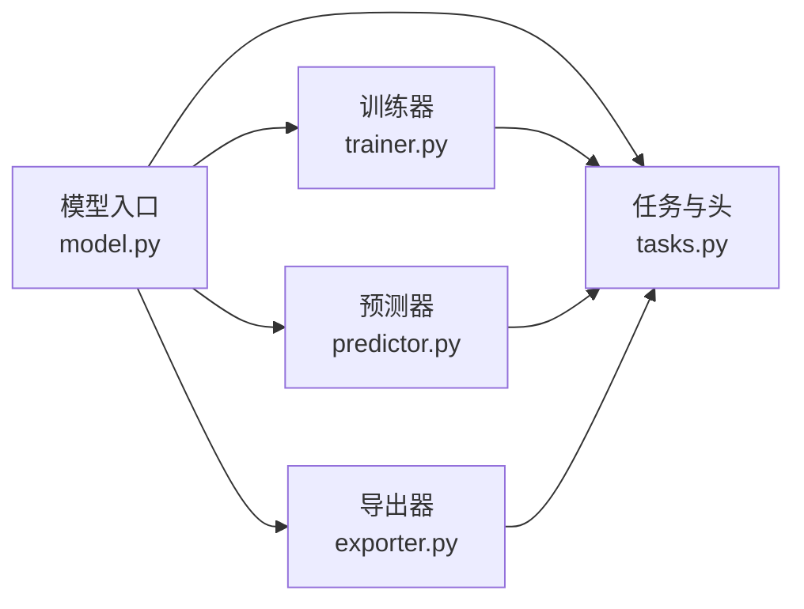

# YOLOv9模型

<cite>
**本文引用的文件**
- [yolov9.md](file://docs/en/models/yolov9.md)
- [yolo.py](file://ultralytics/models/yolo/model.py)
- [train.py](file://ultralytics/engine/trainer.py)
- [predict.py](file://ultralytics/engine/predictor.py)
- [exporter.py](file://ultralytics/engine/exporter.py)
- [tasks.py](file://ultralytics/nn/tasks.py)
- [default.yaml](file://ultralytics/cfg/default.yaml)
- [yolo26.md](file://docs/en/models/yolo26.md)
</cite>

## 目录
1. [简介](#简介)
2. [项目结构](#项目结构)
3. [核心组件](#核心组件)
4. [架构总览](#架构总览)
5. [详细组件分析](#详细组件分析)
6. [依赖关系分析](#依赖关系分析)
7. [性能考量](#性能考量)
8. [故障排查指南](#故障排查指南)
9. [结论](#结论)
10. [附录](#附录)

## 简介
本文件面向希望系统掌握YOLOv9的工程师与研究者，聚焦以下目标：
- 深入解读YOLOv9的核心创新点（可编程梯度信息PGI、广义高效层聚合网络GELAN等）及其在检测任务中的作用。
- 梳理不同规模变体（s/m/g/e）的架构差异与适用场景。
- 阐述“在保持精度的同时降低计算复杂度”的设计思路。
- 提供完整的模型配置文件说明与参数调优指南。
- 给出训练、推理与模型导出的具体实现路径与最佳实践。
- 对比YOLOv8的性能提升与效率改进方向。

## 项目结构
本项目采用模块化组织方式，YOLO系列模型统一由高层接口加载与调度，配置与文档分离，便于扩展与维护。与YOLOv9相关的核心位置如下：
- 模型文档与使用说明：docs/en/models/yolov9.md
- 高层模型入口与注册：ultralytics/models/yolo/model.py
- 训练流程：ultralytics/engine/trainer.py
- 推理流程：ultralytics/engine/predictor.py
- 导出流程：ultralytics/engine/exporter.py
- 任务与头定义：ultralytics/nn/tasks.py
- 默认配置项：ultralytics/cfg/default.yaml
- 同系列参考（如YOLO26）：docs/en/models/yolo26.md

图表来源
- [yolo.py](file://ultralytics/models/yolo/model.py)
- [tasks.py](file://ultralytics/nn/tasks.py)
- [train.py](file://ultralytics/engine/trainer.py)
- [predict.py](file://ultralytics/engine/predictor.py)
- [exporter.py](file://ultralytics/engine/exporter.py)
- [default.yaml](file://ultralytics/cfg/default.yaml)
- [yolov9.md](file://docs/en/models/yolov9.md)

章节来源
- [yolov9.md](file://docs/en/models/yolov9.md)
- [yolo.py](file://ultralytics/models/yolo/model.py)
- [train.py](file://ultralytics/engine/trainer.py)
- [predict.py](file://ultralytics/engine/predictor.py)
- [exporter.py](file://ultralytics/engine/exporter.py)
- [tasks.py](file://ultralytics/nn/tasks.py)
- [default.yaml](file://ultralytics/cfg/default.yaml)

## 核心组件
- 模型入口与注册
  - 通过高层API统一加载YOLOv9系列权重与配置，内部根据任务类型选择对应头与损失函数。
- 任务与头
  - 将通用骨干与颈部与检测头解耦，支持多任务复用与灵活组合。
- 训练器
  - 封装数据加载、优化器、学习率调度、EMA、日志与验证循环。
- 预测器
  - 封装预处理、前向推理、后处理（NMS等）、可视化与结果输出。
- 导出器
  - 支持多种后端格式导出，包含导出前检查与能力矩阵校验。
- 默认配置
  - 提供常用超参与IOU/NMS阈值、类别数、输入尺寸等默认值。

章节来源
- [yolo.py](file://ultralytics/models/yolo/model.py)
- [tasks.py](file://ultralytics/nn/tasks.py)
- [train.py](file://ultralytics/engine/trainer.py)
- [predict.py](file://ultralytics/engine/predictor.py)
- [exporter.py](file://ultralytics/engine/exporter.py)
- [default.yaml](file://ultralytics/cfg/default.yaml)

## 架构总览
YOLOv9在整体架构上延续“骨干+颈部+检测头”的经典范式，并通过可插拔模块与配置化设计实现不同规模的变体。下图展示了从用户调用到各子系统的交互关系。

图表来源
- [yolo.py](file://ultralytics/models/yolo/model.py)
- [tasks.py](file://ultralytics/nn/tasks.py)
- [train.py](file://ultralytics/engine/trainer.py)
- [predict.py](file://ultralytics/engine/predictor.py)
- [exporter.py](file://ultralytics/engine/exporter.py)

## 详细组件分析

### 可编程梯度信息（PGI）
- 设计动机
  - 在深层网络中缓解梯度衰减与信息丢失，使浅层特征能更稳定地参与优化。
- 作用机制
  - 通过引入可学习的梯度路径或辅助信号，增强关键特征的传播与保留，从而在不显著增加推理成本的前提下提升收敛稳定性与精度。
- 工程落地
  - 通常以轻量分支或旁路形式接入主干/颈部，训练时参与反向传播，推理时可被剪枝或融合以降低开销。
- 评估建议
  - 关注小目标召回、低光照/遮挡场景下的鲁棒性；结合消融实验验证对mAP与FLOPs的影响。

章节来源
- [yolov9.md](file://docs/en/models/yolov9.md)

### 广义高效层聚合网络（GELAN）
- 设计动机
  - 在保持强表征能力的同时，减少冗余计算与内存占用，提高吞吐与能效。
- 结构要点
  - 采用分层聚合策略，将多尺度特征进行选择性融合；配合轻量化卷积与通道重排，平衡精度与速度。
- 变体差异
  - s/m/g/e等不同规模通过堆叠深度、通道宽度与聚合粒度控制，形成从移动端到服务器的全谱系覆盖。
- 部署建议
  - 优先选择g/e用于云端高精度需求；s/m用于边缘设备与实时视频流。

章节来源
- [yolov9.md](file://docs/en/models/yolov9.md)

### 变体对比与适用场景（s/m/g/e）
- 规模与复杂度
  - s：最小体积与最低延迟，适合端侧与低功耗设备。
  - m：精度与速度的折中，适合多数工业现场与移动应用。
  - g：更高精度，适合服务器端与离线批处理。
  - e：最大容量，追求极致精度，算力充裕场景。
- 选择建议
  - 依据目标对象尺度分布、帧率要求、硬件预算与功耗约束综合权衡。
- 迁移与微调
  - 从小模型开始快速验证，再逐步放大至更大变体；注意输入分辨率与NMS阈值的联动调整。

章节来源
- [yolov9.md](file://docs/en/models/yolov9.md)

### 配置与参数调优指南
- 关键配置项
  - 类别数、输入尺寸、锚框/Anchor-Free设置、NMS阈值、置信度阈值、数据增强强度、学习率与权重衰减等。
- 推荐流程
  - 先固定骨干与颈部，调优检测头与损失权重；再逐步放宽数据增强与正则化；最后针对部署格式做导出优化。
- 常见陷阱
  - 过大的输入尺寸导致显存溢出；过高的学习率造成不稳定；NMS阈值不当影响小目标召回。

章节来源
- [default.yaml](file://ultralytics/cfg/default.yaml)
- [yolov9.md](file://docs/en/models/yolov9.md)

### 训练流程
- 主要步骤
  - 数据准备与加载、模型初始化、优化器与调度器配置、训练循环、验证与保存、日志记录。
- 关键技巧
  - 使用EMA平滑权重、混合精度加速、分布式训练、早停与学习率预热。
- 监控指标
  - 训练/验证损失、mAP、PR曲线、混淆矩阵与错误样本分析。

章节来源
- [train.py](file://ultralytics/engine/trainer.py)
- [yolo.py](file://ultralytics/models/yolo/model.py)

### 推理流程
- 主要步骤
  - 图像预处理、前向推理、后处理（NMS、置信度过滤）、结果可视化与导出。
- 性能优化
  - 批量推理、动态形状裁剪、算子融合、后端特定优化（如TensorRT/OpenVINO）。
- 质量保障
  - 一致性校验、边界框坐标归一化、类别映射与标签对齐。

章节来源
- [predict.py](file://ultralytics/engine/predictor.py)
- [tasks.py](file://ultralytics/nn/tasks.py)

### 模型导出
- 支持格式
  - ONNX、TensorRT、OpenVINO、CoreML、TFLite等（以实际能力矩阵为准）。
- 导出前检查
  - 图结构合法性、算子兼容性、动态维度与常量折叠。
- 部署建议
  - 针对目标平台选择最优后端；必要时进行量化与稀疏化。

章节来源
- [exporter.py](file://ultralytics/engine/exporter.py)
- [yolo.py](file://ultralytics/models/yolo/model.py)

### 与YOLOv8的对比要点
- 精度与效率
  - 在同等算力下，YOLOv9通过PGI与GELAN提升特征传播与聚合效率，通常带来更高的mAP与更低的延迟。
- 工程体验
  - 统一的API与配置体系，简化从v8到v9的迁移与对比实验。
- 参考文档
  - 可对照官方文档中的基准与案例，结合自有数据集进行复现实验。

章节来源
- [yolo.py](file://ultralytics/models/yolo/model.py)
- [yolov9.md](file://docs/en/models/yolov9.md)
- [yolo26.md](file://docs/en/models/yolo26.md)

## 依赖关系分析
- 模块耦合
  - 模型入口负责解析配置并实例化任务与头；训练器与预测器分别消费任务模块完成各自流程；导出器独立于运行时，专注格式转换。
- 外部依赖
  - PyTorch生态、第三方推理后端（ONNXRuntime/TensorRT/OpenVINO等）、可视化工具与日志框架。
- 潜在风险
  - 版本不兼容导致的算子缺失；导出链路的平台差异；分布式环境下的通信与同步问题。

图表来源
- [yolo.py](file://ultralytics/models/yolo/model.py)
- [tasks.py](file://ultralytics/nn/tasks.py)
- [train.py](file://ultralytics/engine/trainer.py)
- [predict.py](file://ultralytics/engine/predictor.py)
- [exporter.py](file://ultralytics/engine/exporter.py)

章节来源
- [yolo.py](file://ultralytics/models/yolo/model.py)
- [tasks.py](file://ultralytics/nn/tasks.py)
- [train.py](file://ultralytics/engine/trainer.py)
- [predict.py](file://ultralytics/engine/predictor.py)
- [exporter.py](file://ultralytics/engine/exporter.py)

## 性能考量
- 数据流水线
  - 合理设置批次大小、线程数与缓存策略，避免I/O瓶颈。
- 计算图优化
  - 启用混合精度、算子融合与静态形状编译，减少内存峰值与重复计算。
- 部署后端
  - 根据硬件特性选择最优后端，并进行端到端延迟与吞吐评测。
- 监控与回归
  - 建立基线指标与自动化回归测试，确保升级与变更不影响线上性能。

## 故障排查指南
- 常见问题
  - 显存不足：减小输入尺寸或批次大小；关闭不必要的调试输出。
  - 导出失败：检查算子支持与动态维度；使用导出前检查工具定位问题。
  - 精度下降：核对数据增强与NMS阈值；确认权重与配置一致。
- 诊断手段
  - 分阶段验证（数据、模型、训练、推理、导出）；打印中间张量形状与数值范围；对比不同后端输出一致性。

章节来源
- [exporter.py](file://ultralytics/engine/exporter.py)
- [predict.py](file://ultralytics/engine/predictor.py)
- [train.py](file://ultralytics/engine/trainer.py)

## 结论
YOLOv9通过PGI与GELAN两项关键技术，在特征传播与聚合层面实现了“更强、更快、更稳”的目标。其模块化与配置化的设计使得从移动端到云端的广泛部署成为可能。建议在工程中以s/m为起点快速迭代，逐步过渡到g/e以满足更高精度需求，并结合目标平台选择合适的导出后端与优化策略。

## 附录
- 术语表
  - PGI：可编程梯度信息
  - GELAN：广义高效层聚合网络
  - NMS：非极大值抑制
  - EMA：指数移动平均
- 参考链接
  - 模型文档：docs/en/models/yolov9.md
  - 同系列参考：docs/en/models/yolo26.md