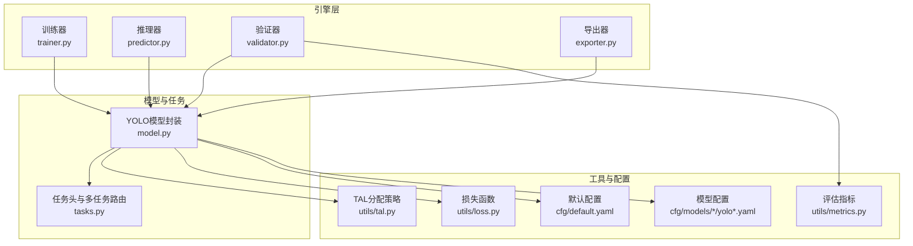
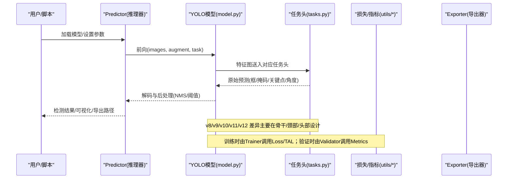
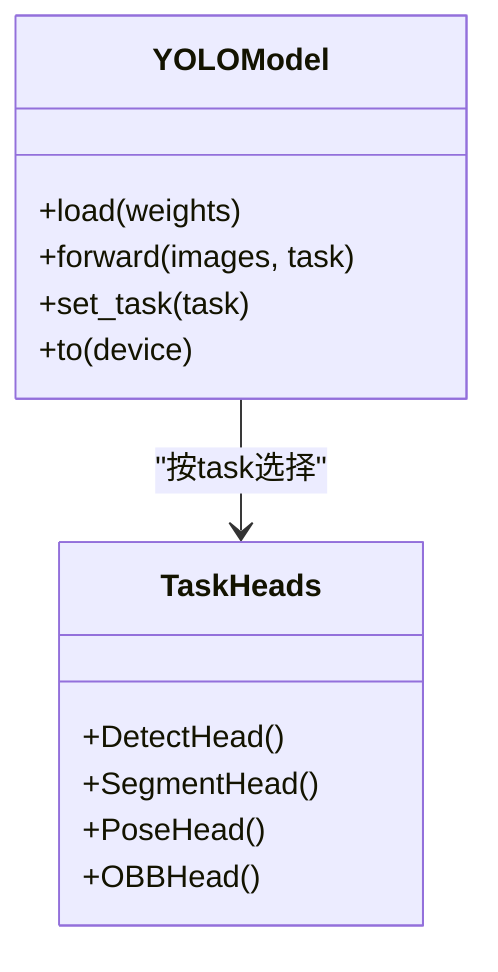
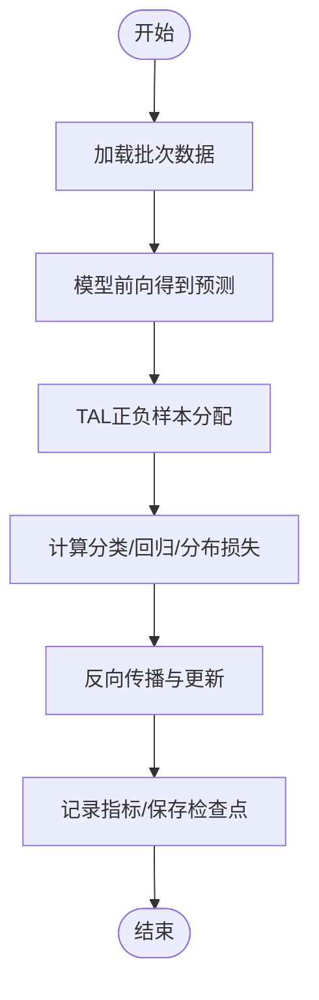
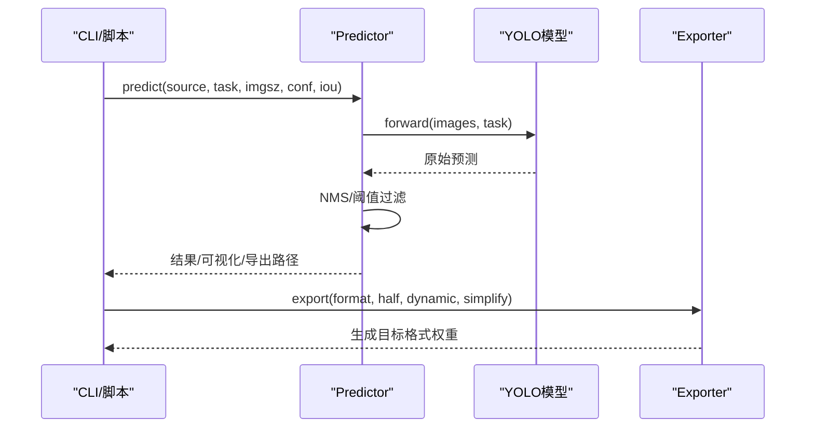
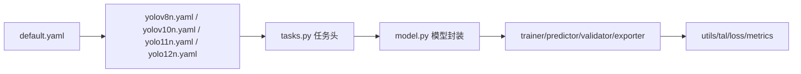

# YOLO系列模型

<cite>
**本文引用的文件**
- [README.md](file://README.md)
- [ultralytics/models/yolo/__init__.py](file://ultralytics/models/yolo/__init__.py)
- [ultralytics/models/yolo/model.py](file://ultralytics/models/yolo/model.py)
- [ultralytics/nn/tasks.py](file://ultralytics/nn/tasks.py)
- [ultralytics/engine/trainer.py](file://ultralytics/engine/trainer.py)
- [ultralytics/engine/predictor.py](file://ultralytics/engine/predictor.py)
- [ultralytics/engine/validator.py](file://ultralytics/engine/validator.py)
- [ultralytics/engine/exporter.py](file://ultralytics/engine/exporter.py)
- [ultralytics/utils/tal.py](file://ultralytics/utils/tal.py)
- [ultralytics/utils/loss.py](file://ultralytics/utils/loss.py)
- [ultralytics/utils/metrics.py](file://ultralytics/utils/metrics.py)
- [ultralytics/cfg/default.yaml](file://ultralytics/cfg/default.yaml)
- [ultralytics/cfg/models/detect/yolov8n.yaml](file://ultralytics/cfg/models/detect/yolov8n.yaml)
- [ultralytics/cfg/models/detect/yolov10n.yaml](file://ultralytics/cfg/models/detect/yolov10n.yaml)
- [ultralytics/cfg/models/detect/yolo11n.yaml](file://ultralytics/cfg/models/detect/yolo11n.yaml)
- [ultralytics/cfg/models/detect/yolo12n.yaml](file://ultralytics/cfg/models/detect/yolo12n.yaml)
- [ultralytics/cfg/models/segment/yolov8n-seg.yaml](file://ultralytics/cfg/models/segment/yolov8n-seg.yaml)
- [ultralytics/cfg/models/pose/yolov8n-pose.yaml](file://ultralytics/cfg/models/pose/yolov8n-pose.yaml)
- [ultralytics/cfg/models/obb/yolov8n-obb.yaml](file://ultralytics/cfg/models/obb/yolov8n-obb.yaml)
- [examples/tutorial.ipynb](file://examples/tutorial.ipynb)
- [docs/en/quickstart.md](file://docs/en/quickstart.md)
- [docs/en/guides/yolo-architecture.md](file://docs/en/guides/yolo-architecture.md)
- [docs/en/modes/train.md](file://docs/en/modes/train.md)
- [docs/en/modes/predict.md](file://docs/en/modes/predict.md)
- [docs/en/modes/export.md](file://docs/en/modes/export.md)
- [docs/en/modes/val.md](file://docs/en/modes/val.md)
- [docs/en/models/yolov8.md](file://docs/en/models/yolov8.md)
- [docs/en/models/yolov9.md](file://docs/en/models/yolov9.md)
- [docs/en/models/yolov10.md](file://docs/en/models/yolov10.md)
- [docs/en/models/yolo11.md](file://docs/en/models/yolo11.md)
- [docs/en/models/yolo12.md](file://docs/en/models/yolo12.md)
</cite>

## 目录
1. [简介](#简介)
2. [项目结构](#项目结构)
3. [核心组件](#核心组件)
4. [架构总览](#架构总览)
5. [详细组件分析](#详细组件分析)
6. [依赖关系分析](#依赖关系分析)
7. [性能与规模对比](#性能与规模对比)
8. [任务类型与配置语法](#任务类型与配置语法)
9. [训练、推理与导出指南](#训练推理与导出指南)
10. [故障排查](#故障排查)
11. [结论](#结论)
12. [附录](#附录)

## 简介
本文件面向希望系统掌握YOLO系列（v8、v9、v10、v11、v12）的读者，从架构演进、技术要点、配置语法到训练/推理/导出的完整工作流进行说明。内容基于仓库中的实现与文档，力求兼顾工程落地与学术理解。

## 项目结构
该仓库采用“模块化+任务化”的组织方式：
- 模型定义与任务头位于 ultralytics/models/yolo 与 ultralytics/nn/tasks.py
- 训练/验证/预测/导出引擎位于 ultralytics/engine
- 通用工具（损失、指标、TAL等）位于 ultralytics/utils
- 预置配置与数据集位于 ultralytics/cfg
- 示例与教程位于 examples 与 docs

图表来源
- [ultralytics/models/yolo/model.py](file://ultralytics/models/yolo/model.py)
- [ultralytics/nn/tasks.py](file://ultralytics/nn/tasks.py)
- [ultralytics/engine/trainer.py](file://ultralytics/engine/trainer.py)
- [ultralytics/engine/predictor.py](file://ultralytics/engine/predictor.py)
- [ultralytics/engine/validator.py](file://ultralytics/engine/validator.py)
- [ultralytics/engine/exporter.py](file://ultralytics/engine/exporter.py)
- [ultralytics/utils/tal.py](file://ultralytics/utils/tal.py)
- [ultralytics/utils/loss.py](file://ultralytics/utils/loss.py)
- [ultralytics/utils/metrics.py](file://ultralytics/utils/metrics.py)
- [ultralytics/cfg/default.yaml](file://ultralytics/cfg/default.yaml)
- [ultralytics/cfg/models/detect/yolov8n.yaml](file://ultralytics/cfg/models/detect/yolov8n.yaml)
- [ultralytics/cfg/models/detect/yolov10n.yaml](file://ultralytics/cfg/models/detect/yolov10n.yaml)
- [ultralytics/cfg/models/detect/yolo11n.yaml](file://ultralytics/cfg/models/detect/yolo11n.yaml)
- [ultralytics/cfg/models/detect/yolo12n.yaml](file://ultralytics/cfg/models/detect/yolo12n.yaml)

章节来源
- [README.md](file://README.md)
- [docs/en/quickstart.md](file://docs/en/quickstart.md)

## 核心组件
- 模型封装与注册：提供统一的模型加载、初始化、前向接口，并支持按任务选择不同头部。
- 任务头与多任务路由：检测、分割、姿态、旋转目标检测等任务共用主干，通过任务头输出不同结果。
- 训练/验证/推理/导出引擎：分别负责优化循环、指标统计、NMS后处理与格式转换。
- 工具库：TAL正负样本分配、损失函数族、mAP等指标计算。
- 配置系统：默认参数与模型级配置分离，便于扩展新规模与新任务。

章节来源
- [ultralytics/models/yolo/__init__.py](file://ultralytics/models/yolo/__init__.py)
- [ultralytics/models/yolo/model.py](file://ultralytics/models/yolo/model.py)
- [ultralytics/nn/tasks.py](file://ultralytics/nn/tasks.py)
- [ultralytics/engine/trainer.py](file://ultralytics/engine/trainer.py)
- [ultralytics/engine/predictor.py](file://ultralytics/engine/predictor.py)
- [ultralytics/engine/validator.py](file://ultralytics/engine/validator.py)
- [ultralytics/engine/exporter.py](file://ultralytics/engine/exporter.py)
- [ultralytics/utils/tal.py](file://ultralytics/utils/tal.py)
- [ultralytics/utils/loss.py](file://ultralytics/utils/loss.py)
- [ultralytics/utils/metrics.py](file://ultralytics/utils/metrics.py)
- [ultralytics/cfg/default.yaml](file://ultralytics/cfg/default.yaml)

## 架构总览
下图展示了从输入图像到最终输出的端到端流程，以及各版本在关键模块上的差异点。

图表来源
- [ultralytics/engine/predictor.py](file://ultralytics/engine/predictor.py)
- [ultralytics/models/yolo/model.py](file://ultralytics/models/yolo/model.py)
- [ultralytics/nn/tasks.py](file://ultralytics/nn/tasks.py)
- [ultralytics/utils/loss.py](file://ultralytics/utils/loss.py)
- [ultralytics/utils/metrics.py](file://ultralytics/utils/metrics.py)
- [ultralytics/engine/exporter.py](file://ultralytics/engine/exporter.py)

## 详细组件分析

### 模型封装与任务路由
- 统一入口：通过模型类完成权重加载、设备放置、任务选择与动态头实例化。
- 任务路由：根据任务类型（detect/segment/pose/obb）选择相应头部，共享主干与颈部以复用特征。
- 可扩展性：新增任务只需注册新头并在路由中声明。

图表来源
- [ultralytics/models/yolo/model.py](file://ultralytics/models/yolo/model.py)
- [ultralytics/nn/tasks.py](file://ultralytics/nn/tasks.py)

章节来源
- [ultralytics/models/yolo/model.py](file://ultralytics/models/yolo/model.py)
- [ultralytics/nn/tasks.py](file://ultralytics/nn/tasks.py)

### 训练流程与损失/分配
- 训练器：构建数据管道、优化器、学习率调度、EMA与日志记录。
- 正负样本分配：使用TAL策略为每个GT匹配多个候选框，提升收敛稳定性。
- 损失组合：分类、回归、分布焦点等损失加权融合，适配不同任务。

图表来源
- [ultralytics/engine/trainer.py](file://ultralytics/engine/trainer.py)
- [ultralytics/utils/tal.py](file://ultralytics/utils/tal.py)
- [ultralytics/utils/loss.py](file://ultralytics/utils/loss.py)

章节来源
- [ultralytics/engine/trainer.py](file://ultralytics/engine/trainer.py)
- [ultralytics/utils/tal.py](file://ultralytics/utils/tal.py)
- [ultralytics/utils/loss.py](file://ultralytics/utils/loss.py)

### 推理与导出
- 推理器：预处理、增强、前向、解码、NMS、可视化与结果序列化。
- 导出器：将PyTorch模型转换为ONNX/TensorRT/OpenVINO等后端格式，并进行导出能力校验。

图表来源
- [ultralytics/engine/predictor.py](file://ultralytics/engine/predictor.py)
- [ultralytics/engine/exporter.py](file://ultralytics/engine/exporter.py)
- [ultralytics/models/yolo/model.py](file://ultralytics/models/yolo/model.py)

章节来源
- [ultralytics/engine/predictor.py](file://ultralytics/engine/predictor.py)
- [ultralytics/engine/exporter.py](file://ultralytics/engine/exporter.py)

## 依赖关系分析
- 低耦合高内聚：模型与任务头解耦，训练/推理/导出各自独立，便于替换与扩展。
- 配置驱动：默认配置与模型配置分层，避免硬编码，利于超参搜索与迁移。
- 外部依赖：主要依赖PyTorch生态，导出阶段按需引入ONNX/TensorRT/OpenVINO等。

图表来源
- [ultralytics/cfg/default.yaml](file://ultralytics/cfg/default.yaml)
- [ultralytics/cfg/models/detect/yolov8n.yaml](file://ultralytics/cfg/models/detect/yolov8n.yaml)
- [ultralytics/cfg/models/detect/yolov10n.yaml](file://ultralytics/cfg/models/detect/yolov10n.yaml)
- [ultralytics/cfg/models/detect/yolo11n.yaml](file://ultralytics/cfg/models/detect/yolo11n.yaml)
- [ultralytics/cfg/models/detect/yolo12n.yaml](file://ultralytics/cfg/models/detect/yolo12n.yaml)
- [ultralytics/nn/tasks.py](file://ultralytics/nn/tasks.py)
- [ultralytics/models/yolo/model.py](file://ultralytics/models/yolo/model.py)
- [ultralytics/engine/trainer.py](file://ultralytics/engine/trainer.py)
- [ultralytics/engine/predictor.py](file://ultralytics/engine/predictor.py)
- [ultralytics/engine/validator.py](file://ultralytics/engine/validator.py)
- [ultralytics/engine/exporter.py](file://ultralytics/engine/exporter.py)
- [ultralytics/utils/tal.py](file://ultralytics/utils/tal.py)
- [ultralytics/utils/loss.py](file://ultralytics/utils/loss.py)
- [ultralytics/utils/metrics.py](file://ultralytics/utils/metrics.py)

章节来源
- [ultralytics/cfg/default.yaml](file://ultralytics/cfg/default.yaml)
- [ultralytics/cfg/models/detect/yolov8n.yaml](file://ultralytics/cfg/models/detect/yolov8n.yaml)
- [ultralytics/cfg/models/detect/yolov10n.yaml](file://ultralytics/cfg/models/detect/yolov10n.yaml)
- [ultralytics/cfg/models/detect/yolo11n.yaml](file://ultralytics/cfg/models/detect/yolo11n.yaml)
- [ultralytics/cfg/models/detect/yolo12n.yaml](file://ultralytics/cfg/models/detect/yolo12n.yaml)

## 性能与规模对比
- 规模家族：n/s/m/l/x 五档规模，参数与FLOPs递增，精度与速度权衡。
- 版本演进要点（概述）：
  - v8：稳定高效的CSP/Darknet风格主干与PANet颈部，广泛部署。
  - v9：引入新的网络结构与注意力机制，强调精度与效率平衡。
  - v10：去NMS的检测头设计与更优的正负样本分配，简化推理链路。
  - v11：进一步轻量化与特征融合改进，提升小目标与密集场景表现。
  - v12：在v11基础上继续优化骨干/颈部/头部，强化跨尺度表征与鲁棒性。
- 基准参考：详见文档中的性能表与实验报告，结合具体硬件与导出格式评估。

章节来源
- [docs/en/models/yolov8.md](file://docs/en/models/yolov8.md)
- [docs/en/models/yolov9.md](file://docs/en/models/yolov9.md)
- [docs/en/models/yolov10.md](file://docs/en/models/yolov10.md)
- [docs/en/models/yolo11.md](file://docs/en/models/yolo11.md)
- [docs/en/models/yolo12.md](file://docs/en/models/yolo12.md)

## 任务类型与配置语法
- 支持任务：
  - 目标检测（detect）
  - 实例分割（segment）
  - 姿态估计（pose）
  - 旋转目标检测（obb）
- 配置文件层次：
  - 全局默认配置：包含训练/验证/导出等通用超参。
  - 模型配置：定义网络深度/宽度、通道数、任务头参数、锚点/网格等。
- 常用键位（示例）：
  - 模型：depth_multiple、width_multiple、channels、anchors、head参数
  - 训练：epochs、batch、imgsz、lr0、weight_decay、optimizer、scheduler
  - 数据：nc、names、train/val路径、增强策略
  - 导出：format、half、dynamic、simplify、opset
- 建议：优先修改模型配置中的缩放因子与通道数，保持任务头一致性；训练超参可参考默认值并结合数据集规模调整。

章节来源
- [ultralytics/cfg/default.yaml](file://ultralytics/cfg/default.yaml)
- [ultralytics/cfg/models/detect/yolov8n.yaml](file://ultralytics/cfg/models/detect/yolov8n.yaml)
- [ultralytics/cfg/models/detect/yolov10n.yaml](file://ultralytics/cfg/models/detect/yolov10n.yaml)
- [ultralytics/cfg/models/detect/yolo11n.yaml](file://ultralytics/cfg/models/detect/yolo11n.yaml)
- [ultralytics/cfg/models/detect/yolo12n.yaml](file://ultralytics/cfg/models/detect/yolo12n.yaml)
- [ultralytics/cfg/models/segment/yolov8n-seg.yaml](file://ultralytics/cfg/models/segment/yolov8n-seg.yaml)
- [ultralytics/cfg/models/pose/yolov8n-pose.yaml](file://ultralytics/cfg/models/pose/yolov8n-pose.yaml)
- [ultralytics/cfg/models/obb/yolov8n-obb.yaml](file://ultralytics/cfg/models/obb/yolov8n-obb.yaml)

## 训练、推理与导出指南
- Python API
  - 训练：创建模型对象，指定数据配置与训练超参，调用训练方法。
  - 推理：加载权重，设置任务、置信度与IoU阈值，对图像或视频进行预测。
  - 导出：指定目标格式与优化选项，生成可部署模型。
- CLI工具
  - 训练：通过命令行传入数据路径、模型规模与训练参数。
  - 推理：指定源图像/视频、模型权重与后处理参数。
  - 导出：选择格式（如ONNX/TensorRT/OpenVINO），开启半精度与动态轴。
- 参考教程与模式文档：
  - 快速开始与基础用法
  - 训练/验证/推理/导出模式详解

章节来源
- [examples/tutorial.ipynb](file://examples/tutorial.ipynb)
- [docs/en/quickstart.md](file://docs/en/quickstart.md)
- [docs/en/modes/train.md](file://docs/en/modes/train.md)
- [docs/en/modes/predict.md](file://docs/en/modes/predict.md)
- [docs/en/modes/export.md](file://docs/en/modes/export.md)
- [docs/en/modes/val.md](file://docs/en/modes/val.md)

## 故障排查
- 常见错误定位
  - 维度不匹配：检查imgsz、anchor/网格与任务头配置是否一致。
  - 显存不足：降低batch、imgsz或使用半精度导出/推理。
  - 导出失败：确认目标后端已安装且opset兼容，必要时关闭动态轴。
- 诊断建议
  - 启用日志与回调，观察损失曲线与指标变化。
  - 使用小规模数据集（如coco128）复现问题，逐步扩大范围。
  - 对比默认配置与自定义配置的差异，逐项排除。

章节来源
- [ultralytics/engine/trainer.py](file://ultralytics/engine/trainer.py)
- [ultralytics/engine/predictor.py](file://ultralytics/engine/predictor.py)
- [ultralytics/engine/exporter.py](file://ultralytics/engine/exporter.py)

## 结论
YOLO系列在多版本迭代中持续优化主干、颈部与头部设计，配合TAL分配与多任务头，形成高效、灵活、易部署的统一框架。通过配置驱动与模块化引擎，用户可在检测、分割、姿态、旋转目标检测等任务间快速切换，并以一致的API完成训练、推理与导出。

## 附录
- 架构概览文档：了解整体设计理念与历史演进脉络。
- 模型文档：各版本的特性、性能与适用场景。
- 模式文档：训练/验证/推理/导出的参数与最佳实践。

章节来源
- [docs/en/guides/yolo-architecture.md](file://docs/en/guides/yolo-architecture.md)
- [docs/en/models/yolov8.md](file://docs/en/models/yolov8.md)
- [docs/en/models/yolov9.md](file://docs/en/models/yolov9.md)
- [docs/en/models/yolov10.md](file://docs/en/models/yolov10.md)
- [docs/en/models/yolo11.md](file://docs/en/models/yolo11.md)
- [docs/en/models/yolo12.md](file://docs/en/models/yolo12.md)