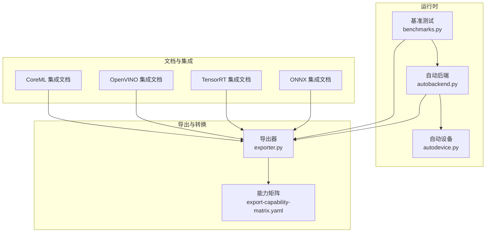
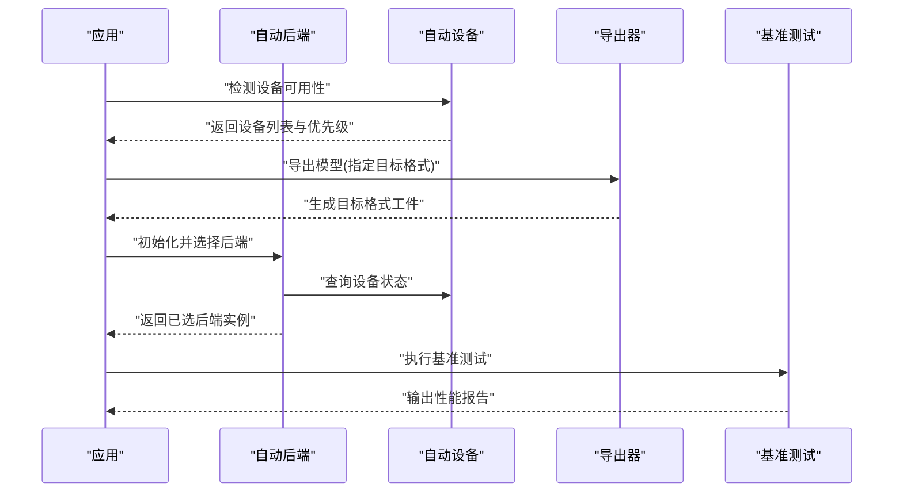
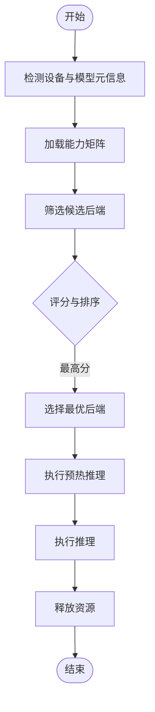
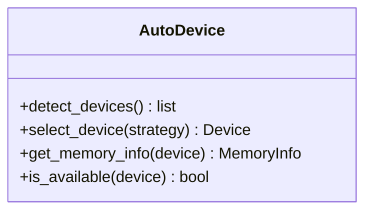
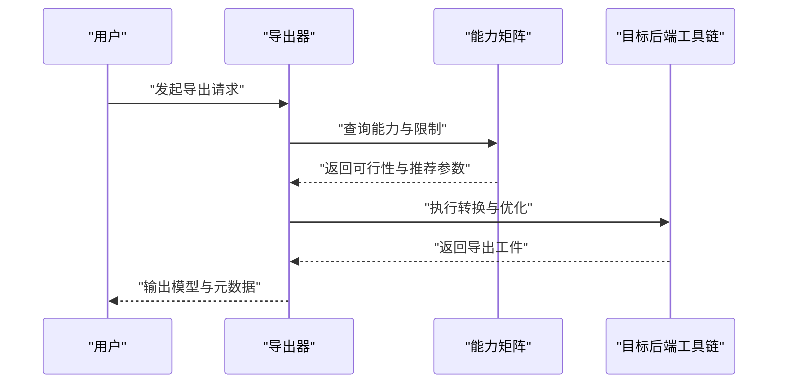
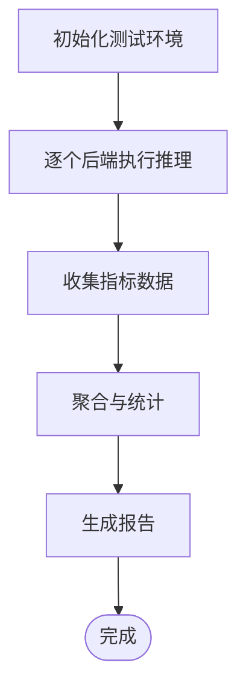
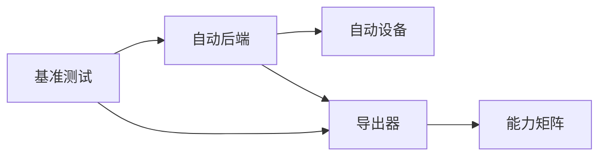

# 后端适配器

<cite>
**本文引用的文件**
- [autobackend.py](file://ultralytics/nn/autobackend.py)
- [exporter.py](file://ultralytics/engine/exporter.py)
- [autodevice.py](file://ultralytics/utils/autodevice.py)
- [benchmarks.py](file://ultralytics/utils/benchmarks.py)
- [test_autobackend_warmup.py](file://tests/test_autobackend_warmup.py)
- [test_adapter_backend_contract.py](file://tests/test_adapter_backend_contract.py)
- [export-capability-matrix.yaml](file://ultralytics/cfg/export-capability-matrix.yaml)
- [tensorrt.md](file://docs/en/integrations/tensorrt.md)
- [openvino.md](file://docs/en/integrations/openvino.md)
- [coreml.md](file://docs/en/integrations/coreml.md)
- [onnx.md](file://docs/en/integrations/onnx.md)
</cite>

## 目录
1. [简介](#简介)
2. [项目结构](#项目结构)
3. [核心组件](#核心组件)
4. [架构总览](#架构总览)
5. [详细组件分析](#详细组件分析)
6. [依赖关系分析](#依赖关系分析)
7. [性能考量](#性能考量)
8. [故障排查指南](#故障排查指南)
9. [结论](#结论)
10. [附录](#附录)

## 简介
本技术文档围绕“后端适配器系统”展开，聚焦多后端支持架构的设计模式与接口规范，深入解析推理后端的集成方式（ONNX Runtime、TensorRT、OpenVINO、CoreML等），说明自动后端选择算法的工作原理与性能优化策略，阐述模型格式转换与优化的流程，解释内存管理与设备适配的实现机制，并提供新后端集成的开发指南与测试方法。同时汇总各后端的性能基准测试结果与适用场景分析，帮助读者在不同硬件与部署环境下做出最优选择。

## 项目结构
后端适配器相关代码主要分布在以下模块：
- 自动后端与设备选择：位于 nn 层与 utils 层，负责运行时设备探测、后端选择与预热。
- 导出与格式转换：位于 engine 与 utils/export，负责将训练好的模型导出为多种目标格式并执行预检查与能力矩阵校验。
- 基准测试与评估：位于 utils/benchmarks，提供跨后端统一的性能评测入口。
- 测试用例：位于 tests，覆盖自动后端预热、后端契约一致性等关键路径。
- 文档与能力矩阵：位于 docs 与 cfg，提供集成说明与导出能力矩阵配置。

图表来源
- [autobackend.py](file://ultralytics/nn/autobackend.py)
- [autodevice.py](file://ultralytics/utils/autodevice.py)
- [exporter.py](file://ultralytics/engine/exporter.py)
- [benchmarks.py](file://ultralytics/utils/benchmarks.py)
- [export-capability-matrix.yaml](file://ultralytics/cfg/export-capability-matrix.yaml)
- [onnx.md](file://docs/en/integrations/onnx.md)
- [tensorrt.md](file://docs/en/integrations/tensorrt.md)
- [openvino.md](file://docs/en/integrations/openvino.md)
- [coreml.md](file://docs/en/integrations/coreml.md)

章节来源
- [autobackend.py](file://ultralytics/nn/autobackend.py)
- [autodevice.py](file://ultralytics/utils/autodevice.py)
- [exporter.py](file://ultralytics/engine/exporter.py)
- [benchmarks.py](file://ultralytics/utils/benchmarks.py)
- [export-capability-matrix.yaml](file://ultralytics/cfg/export-capability-matrix.yaml)

## 核心组件
- 自动后端（AutoBackend）
  - 职责：根据可用环境与模型格式，选择最优推理后端；封装统一推理接口；管理后端生命周期（加载、预热、释放）。
  - 关键点：设备探测、后端优先级、热启动缓存、错误降级。
- 自动设备（AutoDevice）
  - 职责：检测 CPU/GPU/NPU 等设备可用性；按策略选择运行设备；处理显存/内存约束。
- 导出器（Exporter）
  - 职责：将 PyTorch 模型转换为 ONNX/TensorRT/OpenVINO/CoreML 等格式；执行导出前检查与能力矩阵验证；生成可部署工件。
- 基准测试（Benchmarks）
  - 职责：对多后端进行延迟、吞吐、内存占用等指标的统一评测；输出对比报告。
- 能力矩阵（Export Capability Matrix）
  - 职责：声明不同任务/模型/后端的能力组合；用于导出前可行性判断与回退策略。

章节来源
- [autobackend.py](file://ultralytics/nn/autobackend.py)
- [autodevice.py](file://ultralytics/utils/autodevice.py)
- [exporter.py](file://ultralytics/engine/exporter.py)
- [benchmarks.py](file://ultralytics/utils/benchmarks.py)
- [export-capability-matrix.yaml](file://ultralytics/cfg/export-capability-matrix.yaml)

## 架构总览
后端适配器采用“统一接口 + 多实现 + 自动选择”的架构模式：
- 统一接口：对外暴露一致的推理 API，屏蔽后端差异。
- 多实现：针对 ONNX Runtime、TensorRT、OpenVINO、CoreML 等后端提供具体实现。
- 自动选择：基于设备能力、模型格式、任务类型与性能特征，动态选择最佳后端。
- 导出链路：训练完成后通过导出器生成目标格式，并进行能力矩阵校验与优化。

图表来源
- [autobackend.py](file://ultralytics/nn/autobackend.py)
- [autodevice.py](file://ultralytics/utils/autodevice.py)
- [exporter.py](file://ultralytics/engine/exporter.py)
- [benchmarks.py](file://ultralytics/utils/benchmarks.py)

## 详细组件分析

### 自动后端（AutoBackend）
- 设计要点
  - 后端注册与发现：维护后端实现清单，支持按需加载。
  - 选择策略：结合设备能力、模型格式、任务类型与历史性能数据，计算得分并选择最优后端。
  - 生命周期管理：加载权重、构建会话/引擎、预热、推理、清理资源。
  - 错误处理：当某后端不可用或失败时，自动回退到次优后端。
- 关键流程
  - 初始化阶段：探测设备、读取模型元信息、加载能力矩阵。
  - 选择阶段：遍历候选后端，评估兼容性、性能预估与资源占用。
  - 预热阶段：执行最小批次的推理以稳定性能。
  - 推理阶段：统一输入预处理、调用后端推理、结果后处理。
  - 清理阶段：释放会话/引擎句柄与内存。

图表来源
- [autobackend.py](file://ultralytics/nn/autobackend.py)
- [export-capability-matrix.yaml](file://ultralytics/cfg/export-capability-matrix.yaml)

章节来源
- [autobackend.py](file://ultralytics/nn/autobackend.py)
- [export-capability-matrix.yaml](file://ultralytics/cfg/export-capability-matrix.yaml)

### 自动设备（AutoDevice）
- 功能概述
  - 枚举可用设备（CPU、GPU、NPU 等），返回设备属性（如显存大小、驱动版本）。
  - 依据策略选择运行设备（优先 GPU，其次 NPU，最后 CPU）。
  - 处理设备切换与资源隔离，避免跨设备数据拷贝开销。
- 典型行为
  - 在 Windows/Linux/macOS 上分别处理 CUDA/MPS/NPU 的检测逻辑。
  - 当显存不足时，自动降级至 CPU 或较小批处理。

图表来源
- [autodevice.py](file://ultralytics/utils/autodevice.py)

章节来源
- [autodevice.py](file://ultralytics/utils/autodevice.py)

### 导出器（Exporter）
- 功能概述
  - 将 PyTorch 模型导出为 ONNX、TensorRT、OpenVINO、CoreML 等格式。
  - 执行导出前检查（算子支持、输入形状、精度设置）。
  - 使用能力矩阵验证导出可行性，必要时提示回退方案。
- 导出流程
  - 准备阶段：解析模型与配置，确定目标格式与优化选项。
  - 转换阶段：调用对应后端工具链完成格式转换。
  - 验证阶段：执行能力矩阵校验与简单推理验证。
  - 输出阶段：保存模型工件与元数据。

图表来源
- [exporter.py](file://ultralytics/engine/exporter.py)
- [export-capability-matrix.yaml](file://ultralytics/cfg/export-capability-matrix.yaml)

章节来源
- [exporter.py](file://ultralytics/engine/exporter.py)
- [export-capability-matrix.yaml](file://ultralytics/cfg/export-capability-matrix.yaml)

### 基准测试（Benchmarks）
- 功能概述
  - 对多后端进行统一评测，包括延迟、吞吐、内存占用、功耗等指标。
  - 支持批量测试与回归对比，生成可视化报告。
- 测试流程
  - 配置阶段：选择模型、数据集、后端与指标。
  - 执行阶段：对每个后端执行多次推理，收集统计信息。
  - 报告阶段：汇总结果并输出对比图表。

图表来源
- [benchmarks.py](file://ultralytics/utils/benchmarks.py)

章节来源
- [benchmarks.py](file://ultralytics/utils/benchmarks.py)

### 集成文档与能力矩阵
- 集成文档
  - ONNX：通用中间格式，跨平台兼容性好，适合多后端统一入口。
  - TensorRT：NVIDIA GPU 高性能推理，需特定驱动与库支持。
  - OpenVINO：Intel CPU/NPU 优化，适合边缘与服务器部署。
  - CoreML：Apple 生态优化，适合 iOS/macOS 设备。
- 能力矩阵
  - 定义不同任务（检测、分割、姿态等）在各后端的导出与推理能力。
  - 用于导出前可行性判断与回退策略。

章节来源
- [onnx.md](file://docs/en/integrations/onnx.md)
- [tensorrt.md](file://docs/en/integrations/tensorrt.md)
- [openvino.md](file://docs/en/integrations/openvino.md)
- [coreml.md](file://docs/en/integrations/coreml.md)
- [export-capability-matrix.yaml](file://ultralytics/cfg/export-capability-matrix.yaml)

## 依赖关系分析
- 组件耦合
  - 自动后端依赖自动设备与导出器，用于设备探测与模型工件获取。
  - 导出器依赖能力矩阵，用于导出可行性与参数建议。
  - 基准测试依赖自动后端与导出器，用于端到端评测。
- 外部依赖
  - ONNX Runtime、TensorRT、OpenVINO、CoreML 等第三方库。
  - 操作系统与硬件驱动（CUDA、MPS、NPU SDK 等）。

图表来源
- [autobackend.py](file://ultralytics/nn/autobackend.py)
- [autodevice.py](file://ultralytics/utils/autodevice.py)
- [exporter.py](file://ultralytics/engine/exporter.py)
- [benchmarks.py](file://ultralytics/utils/benchmarks.py)
- [export-capability-matrix.yaml](file://ultralytics/cfg/export-capability-matrix.yaml)

章节来源
- [autobackend.py](file://ultralytics/nn/autobackend.py)
- [autodevice.py](file://ultralytics/utils/autodevice.py)
- [exporter.py](file://ultralytics/engine/exporter.py)
- [benchmarks.py](file://ultralytics/utils/benchmarks.py)
- [export-capability-matrix.yaml](file://ultralytics/cfg/export-capability-matrix.yaml)

## 性能考量
- 后端选择策略
  - 基于设备能力（显存、算力）、模型复杂度与任务类型，综合评分选择最优后端。
  - 引入历史性能数据与预热结果，提升选择准确性。
- 内存管理
  - 控制批次大小与张量精度，避免显存溢出。
  - 及时释放会话/引擎句柄，减少内存碎片。
- 优化技巧
  - 启用图级优化（如 TensorRT 的 FP16/INT8 量化）。
  - 使用内核融合与算子替换，降低运行时开销。
  - 合理设置线程数与并行度，平衡延迟与吞吐。

[本节为通用指导，不直接分析具体文件]

## 故障排查指南
- 常见问题
  - 后端不可用：检查驱动与库安装，确认设备可用性。
  - 导出失败：核对能力矩阵与模型算子支持，调整导出参数。
  - 性能异常：检查预热是否执行，确认批大小与精度设置。
- 调试建议
  - 启用日志与诊断输出，定位错误堆栈。
  - 使用最小复现用例，逐步缩小问题范围。
  - 对比不同后端的基准测试结果，识别瓶颈点。

章节来源
- [test_autobackend_warmup.py](file://tests/test_autobackend_warmup.py)
- [test_adapter_backend_contract.py](file://tests/test_adapter_backend_contract.py)

## 结论
后端适配器系统通过统一接口与自动选择机制，有效屏蔽了多后端差异，提升了部署灵活性与性能表现。结合导出器与能力矩阵，实现了从训练到部署的完整链路自动化。建议在工程实践中结合业务场景与硬件条件，选择合适的后端与优化策略，并通过基准测试持续验证与调优。

[本节为总结性内容，不直接分析具体文件]

## 附录
- 新后端集成开发指南
  - 定义后端接口：实现统一的推理 API（加载、预热、推理、清理）。
  - 注册后端：在后端清单中登记新后端，提供元信息与依赖说明。
  - 更新能力矩阵：为新后端添加任务与模型的支持情况。
  - 编写测试用例：覆盖基本推理、错误处理与性能回归。
- 测试方法
  - 单元测试：验证后端接口的正确性与边界条件。
  - 集成测试：端到端导出与推理流程验证。
  - 基准测试：跨后端性能对比与回归检测。

[本节为通用指导，不直接分析具体文件]