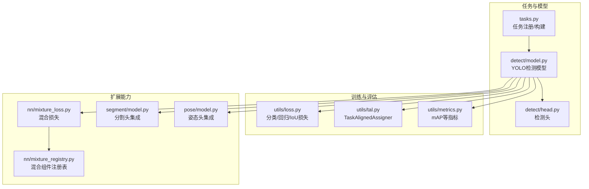
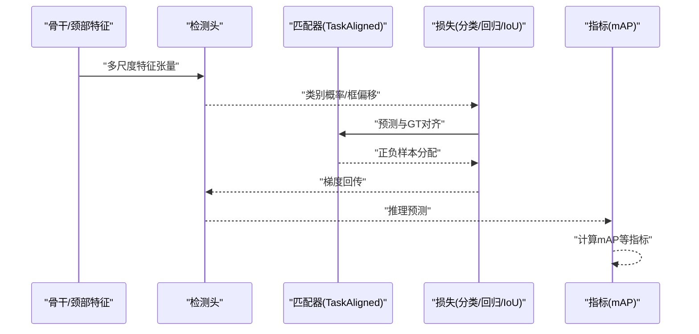
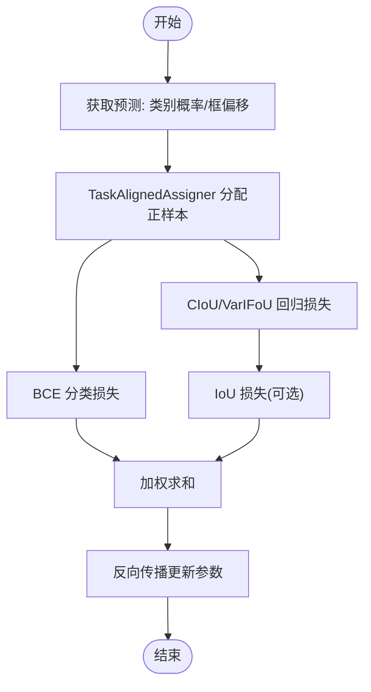
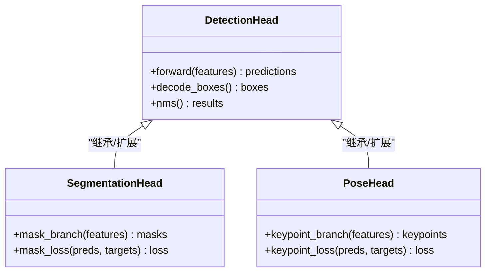
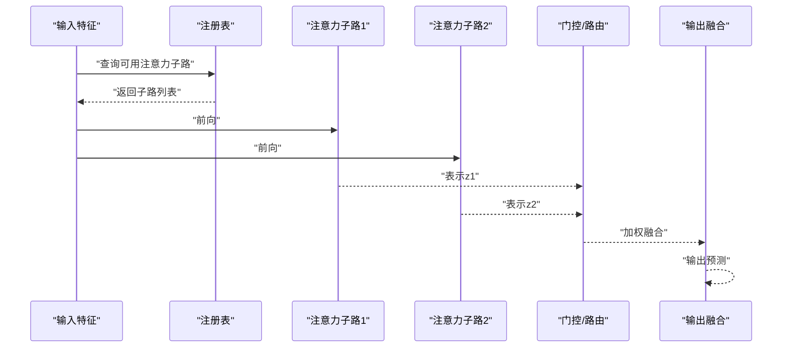
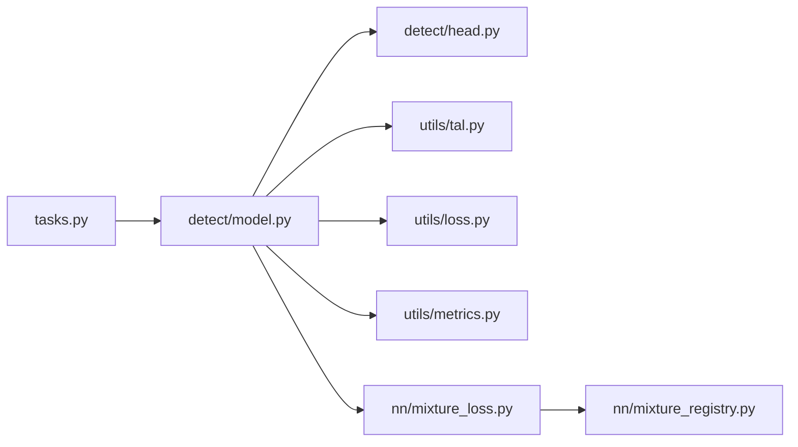

# 检测头模块

<cite>
**本文引用的文件**
- [ultralytics/nn/tasks.py](file://ultralytics/nn/tasks.py)
- [ultralytics/models/yolo/detect/model.py](file://ultralytics/models/yolo/detect/model.py)
- [ultralytics/models/yolo/detect/head.py](file://ultralytics/models/yolo/detect/head.py)
- [ultralytics/utils/loss.py](file://ultralytics/utils/loss.py)
- [ultralytics/utils/tal.py](file://ultralytics/utils/tal.py)
- [ultralytics/utils/metrics.py](file://ultralytics/utils/metrics.py)
- [ultralytics/nn/mixture_loss.py](file://ultralytics/nn/mixture_loss.py)
- [ultralytics/nn/mixture_registry.py](file://ultralytics/nn/mixture_registry.py)
- [ultralytics/models/yolo/segment/model.py](file://ultralytics/models/yolo/segment/model.py)
- [ultralytics/models/yolo/pose/model.py](file://ultralytics/models/yolo/pose/model.py)
- [tests/test_moa.py](file://tests/test_moa.py)
- [tests/test_moa_mot_ddp_math.py](file://tests/test_moa_mot_ddp_math.py)
</cite>

## 目录
1. [简介](#简介)
2. [项目结构](#项目结构)
3. [核心组件](#核心组件)
4. [架构总览](#架构总览)
5. [详细组件分析](#详细组件分析)
6. [依赖关系分析](#依赖关系分析)
7. [性能考量](#性能考量)
8. [故障排查指南](#故障排查指南)
9. [结论](#结论)
10. [附录](#附录)

## 简介
本技术文档聚焦于检测头（Detection Head）模块，系统梳理 Anchor-based 与 Anchor-free 两种范式在实现上的差异、优缺点与适用场景；深入解析 YOLO 系列检测头的损失函数设计（分类损失、回归损失、IoU 损失）及其数学动机；阐述任务特定头部（如分割头、姿态估计头）的设计模式；介绍 MoA（Mixture of Attention）检测头的混合注意力机制；并提供配置参数详解、性能优化策略、精度分析与错误诊断方法。

## 项目结构
检测相关代码主要分布在以下位置：
- 任务与模型装配：ultralytics/nn/tasks.py
- YOLO 检测模型与检测头：ultralytics/models/yolo/detect/model.py, ultralytics/models/yolo/detect/head.py
- 损失与匹配策略：ultralytics/utils/loss.py, ultralytics/utils/tal.py
- 指标计算：ultralytics/utils/metrics.py
- 混合注意力与混合损失：ultralytics/nn/mixture_loss.py, ultralytics/nn/mixture_registry.py
- 任务特定头部示例（分割、姿态）：ultralytics/models/yolo/segment/model.py, ultralytics/models/yolo/pose/model.py
- MoA 测试用例：tests/test_moa.py, tests/test_moa_mot_ddp_math.py

图表来源
- [ultralytics/nn/tasks.py](file://ultralytics/nn/tasks.py)
- [ultralytics/models/yolo/detect/model.py](file://ultralytics/models/yolo/detect/model.py)
- [ultralytics/models/yolo/detect/head.py](file://ultralytics/models/yolo/detect/head.py)
- [ultralytics/utils/loss.py](file://ultralytics/utils/loss.py)
- [ultralytics/utils/tal.py](file://ultralytics/utils/tal.py)
- [ultralytics/utils/metrics.py](file://ultralytics/utils/metrics.py)
- [ultralytics/nn/mixture_loss.py](file://ultralytics/nn/mixture_loss.py)
- [ultralytics/nn/mixture_registry.py](file://ultralytics/nn/mixture_registry.py)
- [ultralytics/models/yolo/segment/model.py](file://ultralytics/models/yolo/segment/model.py)
- [ultralytics/models/yolo/pose/model.py](file://ultralytics/models/yolo/pose/model.py)

章节来源
- [ultralytics/nn/tasks.py](file://ultralytics/nn/tasks.py)
- [ultralytics/models/yolo/detect/model.py](file://ultralytics/models/yolo/detect/model.py)
- [ultralytics/models/yolo/detect/head.py](file://ultralytics/models/yolo/detect/head.py)
- [ultralytics/utils/loss.py](file://ultralytics/utils/loss.py)
- [ultralytics/utils/tal.py](file://ultralytics/utils/tal.py)
- [ultralytics/utils/metrics.py](file://ultralytics/utils/metrics.py)
- [ultralytics/nn/mixture_loss.py](file://ultralytics/nn/mixture_loss.py)
- [ultralytics/nn/mixture_registry.py](file://ultralytics/nn/mixture_registry.py)
- [ultralytics/models/yolo/segment/model.py](file://ultralytics/models/yolo/segment/model.py)
- [ultralytics/models/yolo/pose/model.py](file://ultralytics/models/yolo/pose/model.py)

## 核心组件
- 检测头（Anchor-free）：基于特征图逐点预测类别概率与边界框偏移，结合动态正样本分配策略进行训练。
- 任务特定头部：在通用检测头基础上扩展分支，输出实例掩码或关键点坐标等任务专属结果。
- 损失与匹配：分类损失、回归损失、IoU 损失组合，配合 TaskAlignedAssigner 完成高质量正负样本选择。
- 混合注意力（MoA）：通过多注意力子路径的加权融合提升表征能力，并可通过注册表灵活接入。

章节来源
- [ultralytics/models/yolo/detect/head.py](file://ultralytics/models/yolo/detect/head.py)
- [ultralytics/utils/tal.py](file://ultralytics/utils/tal.py)
- [ultralytics/utils/loss.py](file://ultralytics/utils/loss.py)
- [ultralytics/nn/mixture_loss.py](file://ultralytics/nn/mixture_loss.py)
- [ultralytics/nn/mixture_registry.py](file://ultralytics/nn/mixture_registry.py)

## 架构总览
YOLO 检测流程中，检测头负责将骨干网络输出的多尺度特征映射为最终预测：类别置信度与边界框参数。训练阶段由损失模块与匹配器共同驱动学习；推理阶段则通过后处理（NMS/TopK）得到最终检测结果。

图表来源
- [ultralytics/models/yolo/detect/head.py](file://ultralytics/models/yolo/detect/head.py)
- [ultralytics/utils/tal.py](file://ultralytics/utils/tal.py)
- [ultralytics/utils/loss.py](file://ultralytics/utils/loss.py)
- [ultralytics/utils/metrics.py](file://ultralytics/utils/metrics.py)

## 详细组件分析

### Anchor-based 与 Anchor-free 检测头对比
- Anchor-based
  - 优点：先验丰富，对小目标与常见形状有较好初始化；易于与经典后处理衔接。
  - 缺点：锚点数量大导致冗余计算；对超参敏感；跨域泛化需重新设计锚点集。
- Anchor-free
  - 优点：无需预设锚点，减少超参与计算开销；与动态分配策略结合更稳定；端到端简洁。
  - 缺点：对小目标与密集场景的正样本选择更依赖匹配策略；需要更强的分类与回归头设计。

在本仓库中，YOLO 检测头采用 Anchor-free 范式，并通过 TaskAlignedAssigner 实现高质量的正样本分配，从而兼顾精度与效率。

章节来源
- [ultralytics/models/yolo/detect/head.py](file://ultralytics/models/yolo/detect/head.py)
- [ultralytics/utils/tal.py](file://ultralytics/utils/tal.py)

### YOLO 检测头损失函数设计与数学原理
- 分类损失
  - 通常采用 BCEWithLogitsLoss，直接对每类概率进行二值交叉熵，避免 Softmax 带来的数值不稳定与额外计算。
  - 标签平滑与焦点因子可缓解类别不平衡与易分样本主导问题。
- 回归损失
  - 常用 CIoU/VarIFoU/DIoU 等 IoU 族损失，强调重叠面积、中心距离与长宽比一致性，加速收敛并提高定位精度。
  - 部分实现使用 GIoU 作为兜底，确保非重叠情况下的梯度信号。
- IoU 损失
  - 作为回归损失的补充或替代，直接优化预测框与 GT 的重叠度量，增强几何一致性。
- 正样本分配
  - TaskAlignedAssigner 根据类别置信度与 IoU 的联合评分动态选择 Top-K 正样本，平衡分类与回归信号，降低误检与漏检。

图表来源
- [ultralytics/utils/tal.py](file://ultralytics/utils/tal.py)
- [ultralytics/utils/loss.py](file://ultralytics/utils/loss.py)

章节来源
- [ultralytics/utils/loss.py](file://ultralytics/utils/loss.py)
- [ultralytics/utils/tal.py](file://ultralytics/utils/tal.py)

### 任务特定头部（Segmentation/Pose）设计模式
- 分割头
  - 在检测头基础上增加掩码分支，输出与类别相关的实例掩码权重或直接像素级掩码。
  - 掩码损失常采用 Dice/BCE 组合，强化边界细节与前景一致性。
- 姿态估计头
  - 在检测头基础上增加关键点分支，输出关键点坐标与可见性。
  - 关键点损失常用 MSE/SmoothL1，并结合可见性权重抑制不可见点的干扰。

图表来源
- [ultralytics/models/yolo/segment/model.py](file://ultralytics/models/yolo/segment/model.py)
- [ultralytics/models/yolo/pose/model.py](file://ultralytics/models/yolo/pose/model.py)
- [ultralytics/models/yolo/detect/head.py](file://ultralytics/models/yolo/detect/head.py)

章节来源
- [ultralytics/models/yolo/segment/model.py](file://ultralytics/models/yolo/segment/model.py)
- [ultralytics/models/yolo/pose/model.py](file://ultralytics/models/yolo/pose/model.py)
- [ultralytics/models/yolo/detect/head.py](file://ultralytics/models/yolo/detect/head.py)

### MoA（Mixture of Attention）检测头与混合注意力机制
- 设计思想
  - 通过多个注意力子路径并行提取不同感受野与语义层次的表征，并以可学习的门控或路由进行加权融合，增强模型表达能力。
- 注册与组合
  - 利用混合组件注册表统一管理与加载注意力子模块，支持训练时动态组合与推理时按需激活。
- 训练稳定性
  - 通过损失解耦与正则项控制各子路径贡献，避免某一路径主导导致退化。

图表来源
- [ultralytics/nn/mixture_loss.py](file://ultralytics/nn/mixture_loss.py)
- [ultralytics/nn/mixture_registry.py](file://ultralytics/nn/mixture_registry.py)
- [tests/test_moa.py](file://tests/test_moa.py)
- [tests/test_moa_mot_ddp_math.py](file://tests/test_moa_mot_ddP_math.py)

章节来源
- [ultralytics/nn/mixture_loss.py](file://ultralytics/nn/mixture_loss.py)
- [ultralytics/nn/mixture_registry.py](file://ultralytics/nn/mixture_registry.py)
- [tests/test_moa.py](file://tests/test_moa.py)
- [tests/test_moa_mot_ddP_math.py](file://tests/test_moa_mot_ddP_math.py)

## 依赖关系分析
- 检测头依赖任务装配接口以正确注册与构建。
- 训练阶段强依赖匹配器与损失模块，二者共同决定正样本质量与优化方向。
- 指标模块用于验证与监控 mAP、召回率等关键性能。
- 混合注意力通过注册表与损失模块协同工作，保证可扩展性与稳定性。

图表来源
- [ultralytics/nn/tasks.py](file://ultralytics/nn/tasks.py)
- [ultralytics/models/yolo/detect/model.py](file://ultralytics/models/yolo/detect/model.py)
- [ultralytics/models/yolo/detect/head.py](file://ultralytics/models/yolo/detect/head.py)
- [ultralytics/utils/tal.py](file://ultralytics/utils/tal.py)
- [ultralytics/utils/loss.py](file://ultralytics/utils/loss.py)
- [ultralytics/utils/metrics.py](file://ultralytics/utils/metrics.py)
- [ultralytics/nn/mixture_loss.py](file://ultralytics/nn/mixture_loss.py)
- [ultralytics/nn/mixture_registry.py](file://ultralytics/nn/mixture_registry.py)

章节来源
- [ultralytics/nn/tasks.py](file://ultralytics/nn/tasks.py)
- [ultralytics/models/yolo/detect/model.py](file://ultralytics/models/yolo/detect/model.py)
- [ultralytics/models/yolo/detect/head.py](file://ultralytics/models/yolo/detect/head.py)
- [ultralytics/utils/tal.py](file://ultralytics/utils/tal.py)
- [ultralytics/utils/loss.py](file://ultralytics/utils/loss.py)
- [ultralytics/utils/metrics.py](file://ultralytics/utils/metrics.py)
- [ultralytics/nn/mixture_loss.py](file://ultralytics/nn/mixture_loss.py)
- [ultralytics/nn/mixture_registry.py](file://ultralytics/nn/mixture_registry.py)

## 性能考量
- 匹配策略调优
  - 调整 Top-K 与阈值以平衡正样本数量与质量，避免过多噪声或过少信号。
- 损失权重配比
  - 分类、回归与 IoU 损失的权重需随数据集难度与目标尺度分布进行微调。
- 数据增强与归一化
  - 合理的数据增强（缩放、裁剪、MixUp/Copy-Paste）有助于提升小目标与遮挡场景鲁棒性。
- 混合注意力（MoA）
  - 控制子路数量与门控复杂度，防止过度拟合；在推理时可按场景选择性激活以降低延迟。
- 部署优化
  - 导出为 ONNX/TensorRT 并进行算子融合与量化，显著降低推理时延与内存占用。

[本节提供一般性指导，不直接分析具体文件]

## 故障排查指南
- 训练发散或 NaN
  - 检查学习率与损失权重是否过大；确认 BCE 与 IoU 实现的数值稳定性。
  - 查看匹配器分配的负样本比例是否异常偏高。
- mAP 停滞或下降
  - 调整 Top-K 与阈值；检查类别不平衡与数据标注质量。
  - 验证后处理 NMS 阈值设置是否合理。
- MoA 不稳定
  - 检查门控权重是否出现极端值；引入正则项或限制子路深度。
  - 核对注册表加载顺序与参数初始化。

章节来源
- [ultralytics/utils/loss.py](file://ultralytics/utils/loss.py)
- [ultralytics/utils/tal.py](file://ultralytics/utils/tal.py)
- [ultralytics/nn/mixture_loss.py](file://ultralytics/nn/mixture_loss.py)
- [ultralytics/nn/mixture_registry.py](file://ultralytics/nn/mixture_registry.py)

## 结论
本仓库中的检测头采用 Anchor-free 范式，结合 TaskAlignedAssigner 与分类/回归/IoU 损失，实现了高效且稳定的目标检测。任务特定头部通过模块化扩展满足分割与姿态等多任务需求。MoA 混合注意力机制提供了更强的表征能力与灵活性。通过合理的配置与优化策略，可在精度与效率之间取得良好平衡。

[本节为总结性内容，不直接分析具体文件]

## 附录
- 配置参数建议
  - 分类损失：BCEWithLogitsLoss，可启用标签平滑。
  - 回归损失：优先 CIoU/VarIFoU，必要时回退 GIoU。
  - 匹配器：Top-K 与阈值根据数据集规模与目标密度调节。
  - MoA：子路数量与门控强度需结合算力与精度目标权衡。
- 参考实现路径
  - 检测头与模型装配：[ultralytics/models/yolo/detect/head.py](file://ultralytics/models/yolo/detect/head.py), [ultralytics/models/yolo/detect/model.py](file://ultralytics/models/yolo/detect/model.py)
  - 匹配与损失：[ultralytics/utils/tal.py](file://ultralytics/utils/tal.py), [ultralytics/utils/loss.py](file://ultralytics/utils/loss.py)
  - 指标与评估：[ultralytics/utils/metrics.py](file://ultralytics/utils/metrics.py)
  - 混合注意力与注册表：[ultralytics/nn/mixture_loss.py](file://ultralytics/nn/mixture_loss.py), [ultralytics/nn/mixture_registry.py](file://ultralytics/nn/mixture_registry.py)
  - 任务特定头部：[ultralytics/models/yolo/segment/model.py](file://ultralytics/models/yolo/segment/model.py), [ultralytics/models/yolo/pose/model.py](file://ultralytics/models/yolo/pose/model.py)
  - MoA 测试：[tests/test_moa.py](file://tests/test_moa.py), [tests/test_moa_mot_ddP_math.py](file://tests/test_moa_mot_ddP_math.py)