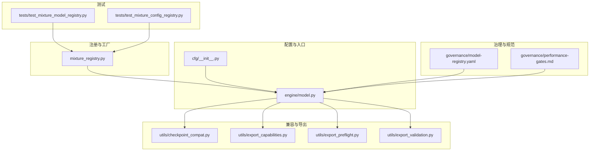
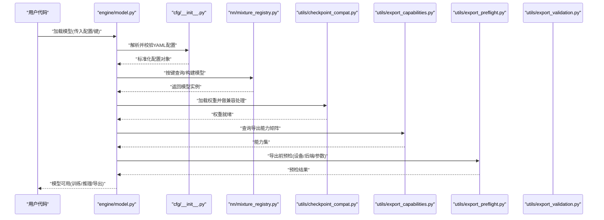
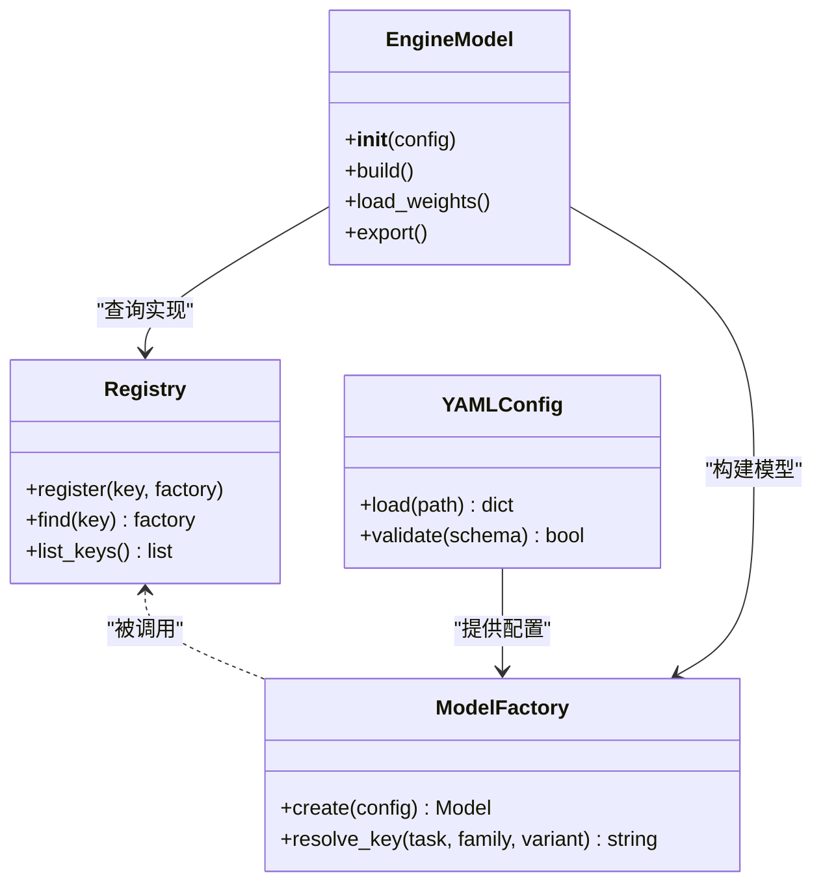
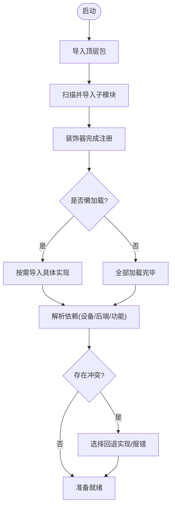
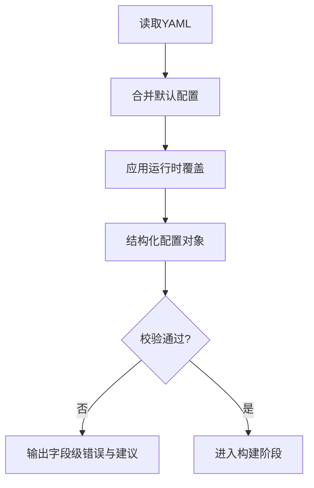
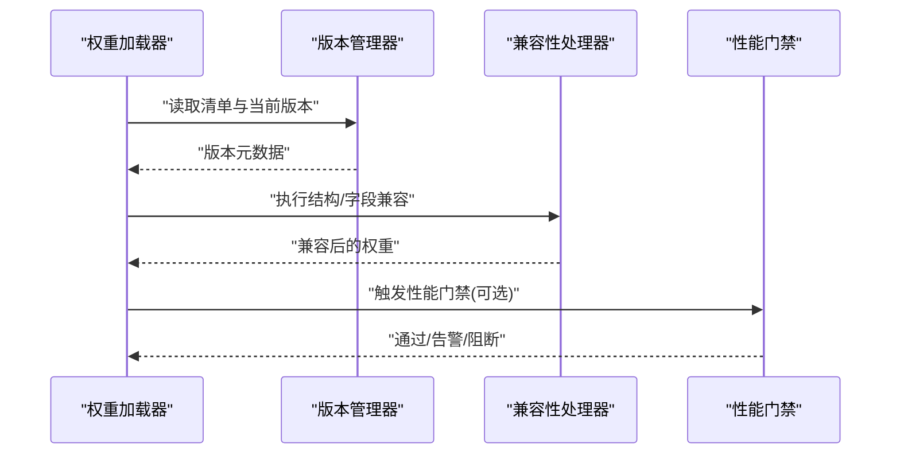
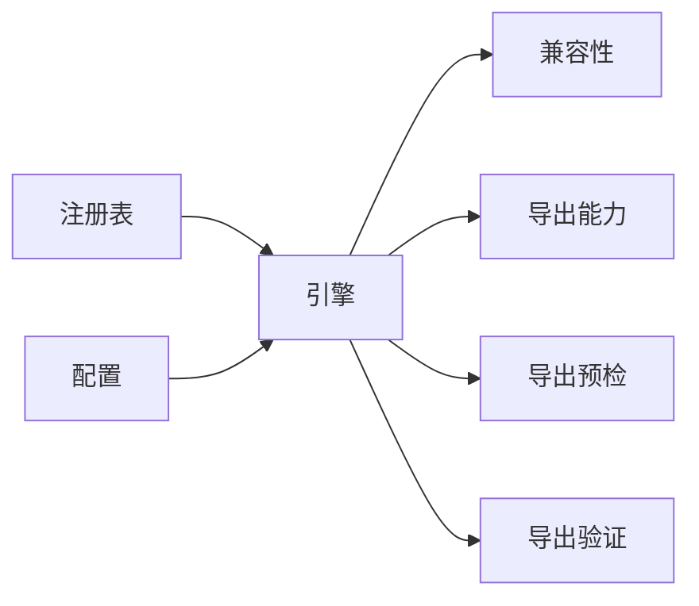

# 模块注册系统

<cite>
**本文引用的文件**
- [ultralytics/nn/mixture_registry.py](file://ultralytics/nn/mixture_registry.py)
- [tests/test_mixture_model_registry.py](file://tests/test_mixture_model_registry.py)
- [tests/test_mixture_config_registry.py](file://tests/test_mixture_config_registry.py)
- [ultralytics/cfg/__init__.py](file://ultralytics/cfg/__init__.py)
- [ultralytics/engine/model.py](file://ultralytics/engine/model.py)
- [ultralytics/utils/checkpoint_compat.py](file://ultralytics/utils/checkpoint_compat.py)
- [ultralytics/utils/export_capabilities.py](file://ultralytics/utils/export_capabilities.py)
- [ultralytics/utils/export_preflight.py](file://ultralytics/utils/export_preflight.py)
- [ultralytics/utils/export_validation.py](file://ultralytics/utils/export_validation.py)
- [ultralytics/utils/routing_interpreter.py](file://ultralytics/utils/routing_interpreter.py)
- [ultralytics/utils/benchmarks.py](file://ultralytics/utils/benchmarks.py)
- [ultralytics/utils/logger.py](file://ultralytics/utils/logger.py)
- [ultralytics/utils/errors.py](file://ultralytics/utils/errors.py)
- [governance/model-registry.yaml](file://governance/model-registry.yaml)
- [governance/performance-gates.md](file://governance/performance-gates.md)
</cite>

## 目录
1. [简介](#简介)
2. [项目结构](#项目结构)
3. [核心组件](#核心组件)
4. [架构总览](#架构总览)
5. [详细组件分析](#详细组件分析)
6. [依赖关系分析](#依赖关系分析)
7. [性能考量](#性能考量)
8. [故障排查指南](#故障排查指南)
9. [结论](#结论)
10. [附录](#附录)

## 简介
本技术文档围绕“模块注册系统”展开，聚焦模型注册机制的设计与实现。该系统以装饰器模式与工厂模式为核心，结合配置驱动（YAML）的模型构建流程，提供动态模块加载、依赖解析、版本管理与兼容性检查、调试与性能监控能力，并定义模块间通信协议与数据传递机制。文档面向不同层次读者，既提供高层架构概览，也深入到关键源码路径与调用序列，帮助开发者快速理解并扩展系统。

## 项目结构
从仓库视角看，模块注册相关能力主要分布在以下位置：
- 注册表与工厂：位于 nn 层，负责模型与配置的注册、查找与构建
- 配置入口：cfg 包提供统一配置加载与默认值管理
- 引擎集成：engine.model 将注册系统与模型生命周期绑定
- 兼容性与导出：utils 下提供权重兼容、导出能力矩阵、预检与验证等
- 治理与规范：governance 下维护模型注册清单与性能门禁
- 测试用例：tests 覆盖注册表、配置解析、兼容性等关键路径

图表来源
- [ultralytics/nn/mixture_registry.py](file://ultralytics/nn/mixture_registry.py)
- [ultralytics/cfg/__init__.py](file://ultralytics/cfg/__init__.py)
- [ultralytics/engine/model.py](file://ultralytics/engine/model.py)
- [ultralytics/utils/checkpoint_compat.py](file://ultralytics/utils/checkpoint_compat.py)
- [ultralytics/utils/export_capabilities.py](file://ultralytics/utils/export_capabilities.py)
- [ultralytics/utils/export_preflight.py](file://ultralytics/utils/export_preflight.py)
- [ultralytics/utils/export_validation.py](file://ultralytics/utils/export_validation.py)
- [governance/model-registry.yaml](file://governance/model-registry.yaml)
- [governance/performance-gates.md](file://governance/performance-gates.md)
- [tests/test_mixture_model_registry.py](file://tests/test_mixture_model_registry.py)
- [tests/test_mixture_config_registry.py](file://tests/test_mixture_config_registry.py)

章节来源
- [ultralytics/nn/mixture_registry.py](file://ultralytics/nn/mixture_registry.py)
- [ultralytics/cfg/__init__.py](file://ultralytics/cfg/__init__.py)
- [ultralytics/engine/model.py](file://ultralytics/engine/model.py)
- [ultralytics/utils/checkpoint_compat.py](file://ultralytics/utils/checkpoint_compat.py)
- [ultralytics/utils/export_capabilities.py](file://ultralytics/utils/export_capabilities.py)
- [ultralytics/utils/export_preflight.py](file://ultralytics/utils/export_preflight.py)
- [ultralytics/utils/export_validation.py](file://ultralytics/utils/export_validation.py)
- [governance/model-registry.yaml](file://governance/model-registry.yaml)
- [governance/performance-gates.md](file://governance/performance-gates.md)
- [tests/test_mixture_model_registry.py](file://tests/test_mixture_model_registry.py)
- [tests/test_mixture_config_registry.py](file://tests/test_mixture_config_registry.py)

## 核心组件
- 模型注册表与工厂
  - 职责：集中维护模型类型到构造函数的映射；提供按名称或键查找与实例化能力；支持装饰器式自动注册与显式注册；在构建阶段根据配置选择具体实现。
  - 设计要点：
    - 装饰器模式：通过装饰器将类或函数注册到全局映射，降低耦合，便于插件化扩展。
    - 工厂模式：对外暴露统一的创建接口，内部依据键名解析并返回对应实例，屏蔽具体实现差异。
    - 配置驱动：读取 YAML 中的任务、模型族、变体等字段，组合出最终键，再查表构建。
- 配置加载与校验
  - 职责：加载 YAML 配置，合并默认值，进行必要校验（必填项、取值范围、互斥约束），为后续构建提供稳定输入。
  - 设计要点：分层合并（默认→用户→运行时）、严格校验与友好错误信息、可插拔校验规则。
- 引擎集成
  - 职责：在模型生命周期中调用注册表完成构建、加载权重、初始化导出能力与兼容性检查。
  - 设计要点：与训练/推理/导出管线解耦，通过注册表抽象替换具体实现。
- 兼容性与导出能力
  - 职责：处理权重格式兼容、导出目标能力矩阵、导出前预检与导出后验证。
  - 设计要点：能力矩阵驱动、预检失败快速失败、验证闭环保障一致性。
- 治理与规范
  - 职责：维护模型注册清单、版本策略、性能门禁与回归基线。
  - 设计要点：清单即契约、门禁即质量门、变更需评审。

章节来源
- [ultralytics/nn/mixture_registry.py](file://ultralytics/nn/mixture_registry.py)
- [ultralytics/cfg/__init__.py](file://ultralytics/cfg/__init__.py)
- [ultralytics/engine/model.py](file://ultralytics/engine/model.py)
- [ultralytics/utils/checkpoint_compat.py](file://ultralytics/utils/checkpoint_compat.py)
- [ultralytics/utils/export_capabilities.py](file://ultralytics/utils/export_capabilities.py)
- [ultralytics/utils/export_preflight.py](file://ultralytics/utils/export_preflight.py)
- [ultralytics/utils/export_validation.py](file://ultralytics/utils/export_validation.py)
- [governance/model-registry.yaml](file://governance/model-registry.yaml)
- [governance/performance-gates.md](file://governance/performance-gates.md)

## 架构总览
下图展示从配置到模型实例化的端到端流程，以及注册表、工厂、配置、引擎与导出/兼容模块之间的交互。

图表来源
- [ultralytics/engine/model.py](file://ultralytics/engine/model.py)
- [ultralytics/cfg/__init__.py](file://ultralytics/cfg/__init__.py)
- [ultralytics/nn/mixture_registry.py](file://ultralytics/nn/mixture_registry.py)
- [ultralytics/utils/checkpoint_compat.py](file://ultralytics/utils/checkpoint_compat.py)
- [ultralytics/utils/export_capabilities.py](file://ultralytics/utils/export_capabilities.py)
- [ultralytics/utils/export_preflight.py](file://ultralytics/utils/export_preflight.py)
- [ultralytics/utils/export_validation.py](file://ultralytics/utils/export_validation.py)

## 详细组件分析

### 模型注册表与工厂（装饰器+工厂）
- 设计原理
  - 装饰器：在模块导入时自动将目标类/函数注册到全局映射，避免手动维护注册表。
  - 工厂：对外提供 create/find 接口，内部根据键名解析具体实现，屏蔽多态细节。
  - 配置驱动：YAML 中的任务、模型族、变体等字段组合成键，再由工厂定位实现。
- 关键流程
  - 启动期：扫描并导入各子模块，触发装饰器完成注册。
  - 运行期：根据配置生成键，查表获取构造函数，执行构建。
  - 扩展点：新增模型只需添加装饰器与最小配置即可接入。
- 复杂度与性能
  - 注册表查找为 O(1)，构建成本取决于具体模型。
  - 建议对热路径使用缓存（如已构建实例或轻量级原型）。
- 错误处理
  - 未找到键：抛出明确异常，附带可用键列表。
  - 重复注册：记录警告或拒绝覆盖，保证单例语义。
- 最佳实践
  - 装饰器仅用于注册，不承载业务逻辑。
  - 工厂方法保持幂等与线程安全。
  - 配置键命名遵循“任务.模型族.变体”的分层约定。

图表来源
- [ultralytics/nn/mixture_registry.py](file://ultralytics/nn/mixture_registry.py)
- [ultralytics/cfg/__init__.py](file://ultralytics/cfg/__init__.py)
- [ultralytics/engine/model.py](file://ultralytics/engine/model.py)

章节来源
- [ultralytics/nn/mixture_registry.py](file://ultralytics/nn/mixture_registry.py)
- [ultralytics/cfg/__init__.py](file://ultralytics/cfg/__init__.py)
- [ultralytics/engine/model.py](file://ultralytics/engine/model.py)

### 动态模块加载与依赖解析
- 启动流程
  - 引导程序导入顶层包，触发子模块加载。
  - 子模块在导入时执行装饰器注册逻辑，完成自发现。
  - 可选：按需懒加载（仅在首次使用时导入具体实现）。
- 依赖解析
  - 基于配置声明依赖（如后端、算子、数据集格式）。
  - 解析顺序：先基础依赖（设备、后端），再功能依赖（导出目标、跟踪器等）。
  - 冲突检测：同一依赖的多版本或互斥实现给出明确提示。
- 容错与回退
  - 缺失依赖：降级到通用实现或抛出清晰错误。
  - 版本不兼容：根据兼容性矩阵选择适配层或拒绝运行。

章节来源
- [ultralytics/nn/mixture_registry.py](file://ultralytics/nn/mixture_registry.py)
- [ultralytics/engine/model.py](file://ultralytics/engine/model.py)

### 配置驱动的模型构建（YAML 解析与校验）
- 解析流程
  - 读取 YAML → 合并默认配置 → 应用运行时覆盖 → 结构化对象。
- 校验规则
  - 必填字段、枚举取值、数值范围、互斥/依赖关系。
  - 自定义校验钩子：允许扩展特定任务的校验逻辑。
- 错误反馈
  - 精确到字段路径的错误消息，附带修复建议。
- 示例参考
  - 参见测试中对配置注册与解析的用例，了解典型用法与边界条件。

章节来源
- [ultralytics/cfg/__init__.py](file://ultralytics/cfg/__init__.py)
- [tests/test_mixture_config_registry.py](file://tests/test_mixture_config_registry.py)

### 模块版本管理与兼容性检查
- 版本策略
  - 模型清单（model-registry.yaml）维护版本、别名、弃用状态与迁移指引。
  - 权重格式与模型结构版本分离，分别进行兼容处理。
- 兼容性检查
  - 加载权重时进行结构对齐、字段映射与缺失补齐。
  - 导出前检查能力矩阵，确保目标后端支持所需特性。
- 门禁与回归
  - performance-gates.md 定义性能阈值与回归判定，CI 中强制执行。

图表来源
- [governance/model-registry.yaml](file://governance/model-registry.yaml)
- [ultralytics/utils/checkpoint_compat.py](file://ultralytics/utils/checkpoint_compat.py)
- [governance/performance-gates.md](file://governance/performance-gates.md)

章节来源
- [governance/model-registry.yaml](file://governance/model-registry.yaml)
- [ultralytics/utils/checkpoint_compat.py](file://ultralytics/utils/checkpoint_compat.py)
- [governance/performance-gates.md](file://governance/performance-gates.md)

### 自定义模块注册开发指南与最佳实践
- 步骤
  - 在目标模块中定义类/函数，并使用注册装饰器将其注册到注册表。
  - 在 YAML 配置中声明对应的键（任务.模型族.变体）。
  - 编写单元测试覆盖注册、构建与基本行为。
- 最佳实践
  - 单一职责：注册装饰器只负责注册，不包含业务逻辑。
  - 幂等性：重复注册应给出明确提示而非静默覆盖。
  - 可观测性：在构建与关键路径埋点日志，便于追踪。
  - 向后兼容：新增字段需有默认值与迁移策略。
- 参考用例
  - 查看注册表相关测试，学习常见用法与异常场景。

章节来源
- [ultralytics/nn/mixture_registry.py](file://ultralytics/nn/mixture_registry.py)
- [tests/test_mixture_model_registry.py](file://tests/test_mixture_model_registry.py)

### 模块调试工具与性能监控
- 路由解释器
  - 用于可视化/诊断路由决策与激活分布，辅助定位热点与瓶颈。
- 基准与计时
  - 提供轻量基准工具，统计关键路径耗时与吞吐。
- 日志与事件
  - 统一日志与事件上报，便于聚合分析与告警。
- 导出能力与预检
  - 导出能力矩阵与预检工具可在早期发现不兼容问题。

章节来源
- [ultralytics/utils/routing_interpreter.py](file://ultralytics/utils/routing_interpreter.py)
- [ultralytics/utils/benchmarks.py](file://ultralytics/utils/benchmarks.py)
- [ultralytics/utils/logger.py](file://ultralytics/utils/logger.py)
- [ultralytics/utils/export_capabilities.py](file://ultralytics/utils/export_capabilities.py)
- [ultralytics/utils/export_preflight.py](file://ultralytics/utils/export_preflight.py)

### 模块间通信协议与数据传递机制
- 协议要点
  - 输入/输出采用结构化对象（如张量、检测结果、元数据字典），避免裸字符串。
  - 事件总线：通过统一事件通道传递训练/推理/导出过程中的关键事件。
  - 错误传播：异常携带上下文（模块名、阶段、输入摘要），便于定位。
- 数据流
  - 配置 → 构建 → 权重加载 → 推理/训练 → 导出/评估，每步产出可审计的中间产物。
- 可观测性
  - 关键指标（延迟、吞吐、内存、GPU利用率）通过日志/回调上报。

章节来源
- [ultralytics/engine/model.py](file://ultralytics/engine/model.py)
- [ultralytics/utils/logger.py](file://ultralytics/utils/logger.py)
- [ultralytics/utils/events.py](file://ultralytics/utils/events.py)

## 依赖关系分析
- 内聚与耦合
  - 注册表与工厂高度内聚，对外暴露稳定接口；与引擎通过配置与键名松耦合。
  - 兼容与导出模块作为横切关注点，被引擎按需调用。
- 外部依赖
  - YAML 解析、设备/后端抽象、日志与事件框架。
- 循环依赖
  - 通过延迟导入与接口抽象避免循环引用。
- 风险点
  - 全局注册表的并发访问需加锁或无锁设计。
  - 配置键命名不一致会导致运行时查找失败。

图表来源
- [ultralytics/nn/mixture_registry.py](file://ultralytics/nn/mixture_registry.py)
- [ultralytics/engine/model.py](file://ultralytics/engine/model.py)
- [ultralytics/utils/checkpoint_compat.py](file://ultralytics/utils/checkpoint_compat.py)
- [ultralytics/utils/export_capabilities.py](file://ultralytics/utils/export_capabilities.py)
- [ultralytics/utils/export_preflight.py](file://ultralytics/utils/export_preflight.py)
- [ultralytics/utils/export_validation.py](file://ultralytics/utils/export_validation.py)

章节来源
- [ultralytics/nn/mixture_registry.py](file://ultralytics/nn/mixture_registry.py)
- [ultralytics/engine/model.py](file://ultralytics/engine/model.py)
- [ultralytics/utils/checkpoint_compat.py](file://ultralytics/utils/checkpoint_compat.py)
- [ultralytics/utils/export_capabilities.py](file://ultralytics/utils/export_capabilities.py)
- [ultralytics/utils/export_preflight.py](file://ultralytics/utils/export_preflight.py)
- [ultralytics/utils/export_validation.py](file://ultralytics/utils/export_validation.py)

## 性能考量
- 注册与查找
  - 注册表查找为 O(1)，建议在进程启动时完成全量注册，避免运行时反射开销。
- 构建与缓存
  - 对频繁使用的模型实例或原型进行缓存，减少重复构建。
- I/O 与权重加载
  - 使用异步/并行 I/O 提升大权重加载效率；必要时分块加载。
- 导出与验证
  - 导出能力矩阵预计算，避免重复判断；预检失败尽早返回。
- 监控与优化
  - 利用基准工具与日志采集关键指标，识别热点路径并进行针对性优化。

[本节为通用指导，无需列出具体文件来源]

## 故障排查指南
- 常见问题
  - 找不到模型键：检查 YAML 键名与注册表是否一致，确认模块已导入。
  - 权重不兼容：查看兼容性处理日志，确认权重版本与模型结构匹配。
  - 导出失败：核对导出能力矩阵与预检结果，确认后端与设备支持。
- 定位手段
  - 启用详细日志与事件追踪，定位失败阶段与输入摘要。
  - 使用路由解释器与基准工具分析异常路径。
- 恢复策略
  - 回退到已知稳定版本或默认配置。
  - 使用兼容性处理器进行字段映射与补齐。

章节来源
- [ultralytics/utils/errors.py](file://ultralytics/utils/errors.py)
- [ultralytics/utils/logger.py](file://ultralytics/utils/logger.py)
- [ultralytics/utils/checkpoint_compat.py](file://ultralytics/utils/checkpoint_compat.py)
- [ultralytics/utils/export_preflight.py](file://ultralytics/utils/export_preflight.py)

## 结论
本模块注册系统以装饰器与工厂模式为基础，结合配置驱动与治理规范，实现了可扩展、可观测、可演进的模型构建与生命周期管理。通过清晰的键空间、严格的校验与兼容性处理、完善的调试与性能工具链，系统在工程实践中具备高可用性与高可维护性。建议在新模块开发中遵循既定规范，持续完善清单与门禁，保障整体质量与稳定性。

[本节为总结性内容，无需列出具体文件来源]

## 附录
- 术语
  - 注册表：维护键到实现的映射的全局表
  - 工厂：根据键创建对象的统一接口
  - 配置驱动：以 YAML 配置为中心控制构建流程
  - 兼容性：权重与模型结构的版本适配
  - 性能门禁：基于阈值的回归检测
- 参考用例
  - 注册表与配置解析的测试用例可作为扩展时的样板。

章节来源
- [tests/test_mixture_model_registry.py](file://tests/test_mixture_model_registry.py)
- [tests/test_mixture_config_registry.py](file://tests/test_mixture_config_registry.py)