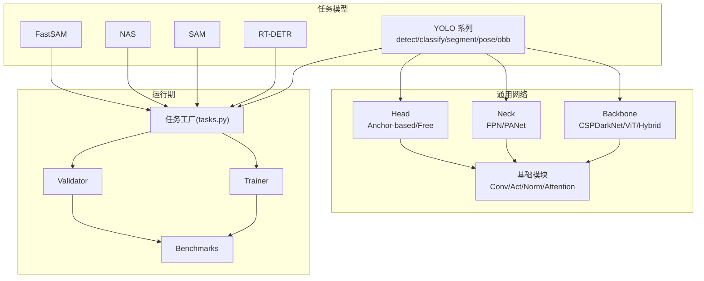
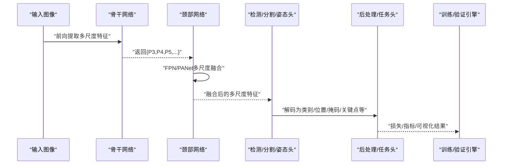
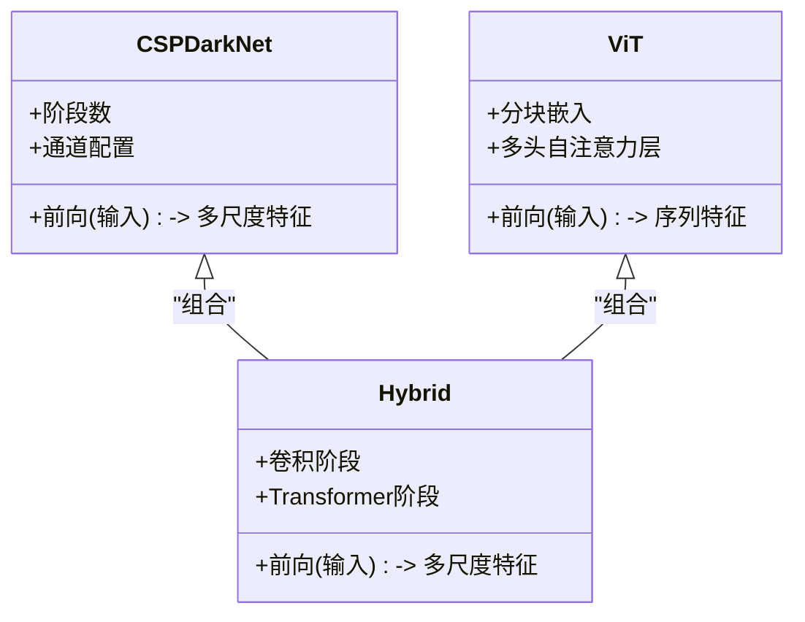
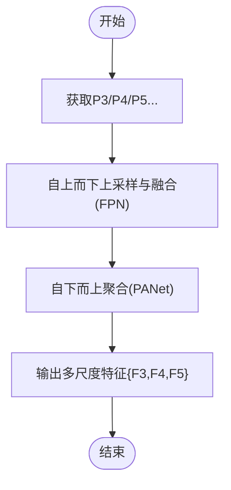
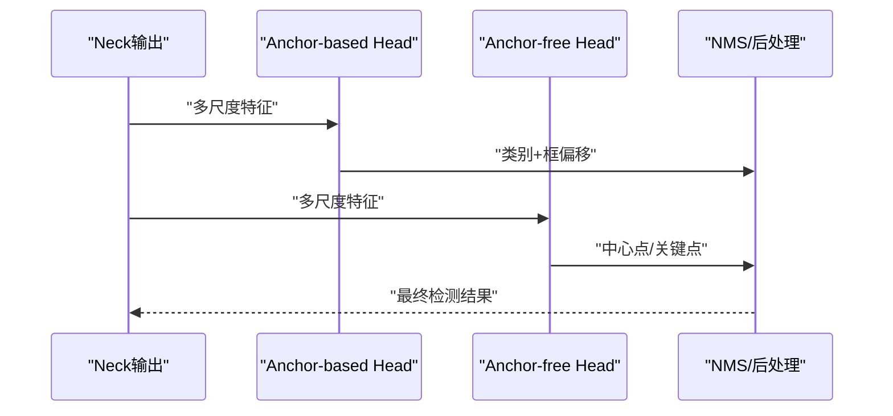
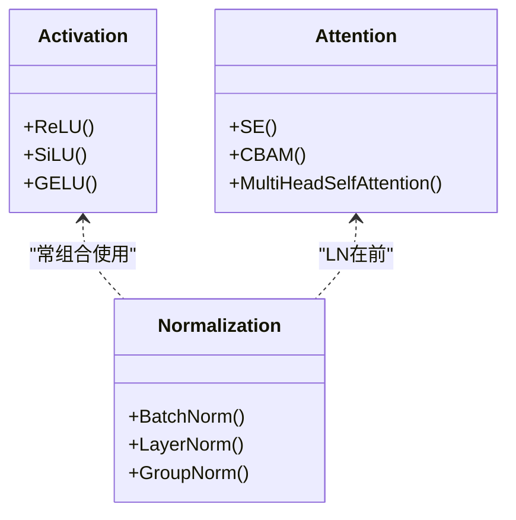
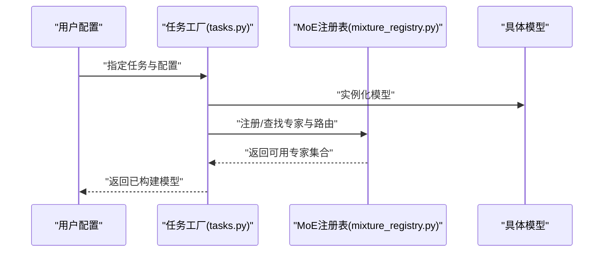

# 模型架构组件

<cite>
**本文引用的文件**
- [ultralytics/nn/tasks.py](file://ultralytics/nn/tasks.py)
- [ultralytics/models/yolo/model.py](file://ultralytics/models/yolo/model.py)
- [ultralytics/models/yolo/detect/train.py](file://ultralytics/models/yolo/detect/train.py)
- [ultralytics/models/yolo/detect/val.py](file://ultralytics/models/yolo/detect/val.py)
- [ultralytics/models/yolo/classify/model.py](file://ultralytics/models/yolo/classify/model.py)
- [ultralytics/models/yolo/segment/model.py](file://ultralytics/models/yolo/segment/model.py)
- [ultralytics/models/yolo/pose/model.py](file://ultralytics/models/yolo/pose/model.py)
- [ultralytics/models/yolo/obb/model.py](file://ultralytics/models/yolo/obb/model.py)
- [ultralytics/models/rtdetr/model.py](file://ultralytics/models/rtdetr/model.py)
- [ultralytics/models/sam/model.py](file://ultralytics/models/sam/model.py)
- [ultralytics/models/nas/model.py](file://ultralytics/models/nas/model.py)
- [ultralytics/models/fastsam/model.py](file://ultralytics/models/fastsam/model.py)
- [ultralytics/nn/mixture_registry.py](file://ultralytics/nn/mixture_registry.py)
- [ultralytics/nn/mixture_loss.py](file://ultralytics/nn/mixture_loss.py)
- [ultralytics/nn/modules/core.py](file://ultralytics/nn/modules/core.py)
- [ultralytics/nn/modules/head.py](file://ultralytics/nn/modules/head.py)
- [ultralytics/nn/modules/block.py](file://ultralytics/nn/modules/block.py)
- [ultralytics/nn/modules/transformer.py](file://ultralytics/nn/modules/transformer.py)
- [ultralytics/nn/modules/attention.py](file://ultralytics/nn/modules/attention.py)
- [ultralytics/nn/modules/conv.py](file://ultralytics/nn/modules/conv.py)
- [ultralytics/nn/modules/normalize.py](file://ultralytics/nn/modules/normalize.py)
- [ultralytics/nn/modules/activation.py](file://ultralytics/nn/modules/activation.py)
- [ultralytics/nn/modules/neck.py](file://ultralytics/nn/modules/neck.py)
- [ultralytics/nn/backbones/cspdarknet.py](file://ultralytics/nn/backbones/cspdarknet.py)
- [ultralytics/nn/backbones/vit.py](file://ultralytics/nn/backbones/vit.py)
- [ultralytics/nn/backbones/hybrid.py](file://ultralytics/nn/backbones/hybrid.py)
- [ultralytics/engine/trainer.py](file://ultralytics/engine/trainer.py)
- [ultralytics/engine/validator.py](file://ultralytics/engine/validator.py)
- [ultralytics/utils/benchmarks.py](file://ultralytics/utils/benchmarks.py)
- [ultralytics/utils/torch_utils.py](file://ultralytics/utils/torch_utils.py)
</cite>

## 目录
1. [简介](#简介)
2. [项目结构](#项目结构)
3. [核心组件](#核心组件)
4. [架构总览](#架构总览)
5. [详细组件分析](#详细组件分析)
6. [依赖关系分析](#依赖关系分析)
7. [性能考量](#性能考量)
8. [故障排查指南](#故障排查指南)
9. [结论](#结论)
10. [附录](#附录)

## 简介
本技术文档聚焦于YOLO-Master中“模型架构”的核心组件，系统性梳理骨干网络(backbone)、颈部网络(neck)、检测头(head)的设计模式与实现原理，覆盖卷积、Transformer与混合架构；阐述多尺度特征融合机制（如FPN、PANet）；对比Anchor-based与Anchor-free的检测头设计；详解激活函数、归一化层与注意力模块的实现要点；说明模型注册机制与动态加载系统的工作原理；并提供自定义模块开发指南、最佳实践以及复杂度分析与性能评估方法。

## 项目结构
本项目采用任务导向的模块化组织方式：
- 通用神经网络模块集中于 nn 子包，包含backbone、neck、head、基础算子与注意力等
- 各任务模型位于 models 下对应目录，统一通过 tasks.py 的任务工厂进行实例化
- 训练与验证流程由 engine 提供，utils 提供工具与基准评测能力

图表来源
- [ultralytics/nn/tasks.py](file://ultralytics/nn/tasks.py)
- [ultralytics/models/yolo/model.py](file://ultralytics/models/yolo/model.py)
- [ultralytics/nn/backbones/cspdarknet.py](file://ultralytics/nn/backbones/cspdarknet.py)
- [ultralytics/nn/backbones/vit.py](file://ultralytics/nn/backbones/vit.py)
- [ultralytics/nn/backbones/hybrid.py](file://ultralytics/nn/backbones/hybrid.py)
- [ultralytics/nn/modules/neck.py](file://ultralytics/nn/modules/neck.py)
- [ultralytics/nn/modules/head.py](file://ultralytics/nn/modules/head.py)
- [ultralytics/engine/trainer.py](file://ultralytics/engine/trainer.py)
- [ultralytics/engine/validator.py](file://ultralytics/engine/validator.py)
- [ultralytics/utils/benchmarks.py](file://ultralytics/utils/benchmarks.py)

章节来源
- [ultralytics/nn/tasks.py](file://ultralytics/nn/tasks.py)
- [ultralytics/models/yolo/model.py](file://ultralytics/models/yolo/model.py)

## 核心组件
- 骨干网络(backbone)
  - 卷积型：以CSPDarkNet为代表，强调跨阶段残差与通道重排，兼顾速度与精度
  - Transformer型：ViT类主干，利用自注意力建模全局上下文
  - 混合型：将CNN局部归纳偏置与Transformer全局建模结合，提升多尺度表征能力
- 颈部网络(neck)
  - FPN：自上而下路径增强高层语义
  - PANet：自下而上路径强化低层定位信息
  - 多分支融合：在关键层级进行拼接或加权融合，形成稳定多尺度输出
- 检测头(head)
  - Anchor-based：基于预设锚框回归类别与边界框偏移
  - Anchor-free：直接预测关键点或中心点，减少超参并简化后处理
- 基础模块
  - 激活函数：ReLU/SiLU/GELU等，不同任务对非线性强度有不同偏好
  - 归一化层：BN/LN/GroupNorm等，适配不同批大小与部署环境
  - 注意力模块：SE/CBAM/多头自注意力等，用于通道/空间/跨模态增强
- 模型注册与动态加载
  - 通过任务工厂与配置驱动，按名称解析并构建具体模型
  - 支持Mixture-of-Experts等动态路由与专家选择

章节来源
- [ultralytics/nn/backbones/cspdarknet.py](file://ultralytics/nn/backbones/cspdarknet.py)
- [ultralytics/nn/backbones/vit.py](file://ultralytics/nn/backbones/vit.py)
- [ultralytics/nn/backbones/hybrid.py](file://ultralytics/nn/backbones/hybrid.py)
- [ultralytics/nn/modules/neck.py](file://ultralytics/nn/modules/neck.py)
- [ultralytics/nn/modules/head.py](file://ultralytics/nn/modules/head.py)
- [ultralytics/nn/modules/activation.py](file://ultralytics/nn/modules/activation.py)
- [ultralytics/nn/modules/normalize.py](file://ultralytics/nn/modules/normalize.py)
- [ultralytics/nn/modules/attention.py](file://ultralytics/nn/modules/attention.py)
- [ultralytics/nn/tasks.py](file://ultralytics/nn/tasks.py)

## 架构总览
下图展示从输入图像到任务输出的端到端数据流，包括骨干提取、颈部融合、头部解码与任务特定后处理。

图表来源
- [ultralytics/nn/backbones/cspdarknet.py](file://ultralytics/nn/backbones/cspdarknet.py)
- [ultralytics/nn/backbones/vit.py](file://ultralytics/nn/backbones/vit.py)
- [ultralytics/nn/backbones/hybrid.py](file://ultralytics/nn/backbones/hybrid.py)
- [ultralytics/nn/modules/neck.py](file://ultralytics/nn/modules/neck.py)
- [ultralytics/nn/modules/head.py](file://ultralytics/nn/modules/head.py)
- [ultralytics/engine/trainer.py](file://ultralytics/engine/trainer.py)
- [ultralytics/engine/validator.py](file://ultralytics/engine/validator.py)

## 详细组件分析

### 骨干网络(backbone)
- CSPDarkNet（卷积主干）
  - 特点：跨阶段残差连接、瓶颈块、通道重排，降低计算冗余，提高梯度流动
  - 适用：实时检测、移动端部署
- ViT（Transformer主干）
  - 特点：分块嵌入+多层自注意力，强全局建模能力
  - 适用：需要长程依赖的场景，配合高分辨率输入时计算开销较大
- Hybrid（混合主干）
  - 特点：早期使用卷积捕获局部特征，后期引入Transformer增强全局交互
  - 适用：平衡效率与精度的通用场景

图表来源
- [ultralytics/nn/backbones/cspdarknet.py](file://ultralytics/nn/backbones/cspdarknet.py)
- [ultralytics/nn/backbones/vit.py](file://ultralytics/nn/backbones/vit.py)
- [ultralytics/nn/backbones/hybrid.py](file://ultralytics/nn/backbones/hybrid.py)

章节来源
- [ultralytics/nn/backbones/cspdarknet.py](file://ultralytics/nn/backbones/cspdarknet.py)
- [ultralytics/nn/backbones/vit.py](file://ultralytics/nn/backbones/vit.py)
- [ultralytics/nn/backbones/hybrid.py](file://ultralytics/nn/backbones/hybrid.py)

### 颈部网络(neck)
- FPN（Feature Pyramid Network）
  - 自上而下的路径增强高层语义，并通过上采样与侧路连接融合浅层细节
- PANet（Path Aggregation Network）
  - 在FPN基础上增加自下而上的聚合路径，强化低层定位信息
- 多尺度融合策略
  - 常见操作：逐元素相加、拼接(concat)、可学习权重融合
  - 输出：通常生成3~4个尺度的特征图，供后续头使用

图表来源
- [ultralytics/nn/modules/neck.py](file://ultralytics/nn/modules/neck.py)

章节来源
- [ultralytics/nn/modules/neck.py](file://ultralytics/nn/modules/neck.py)

### 检测头(head)
- Anchor-based
  - 基于预设锚框，预测类别概率与边界框相对偏移
  - 优点：成熟稳定，易于与NMS集成
  - 缺点：锚框超参敏感，需针对数据集调优
- Anchor-free
  - 直接预测目标中心点或关键点，无需锚框
  - 优点：减少超参，简化后处理
  - 缺点：对小目标与密集场景鲁棒性需加强

图表来源
- [ultralytics/nn/modules/head.py](file://ultralytics/nn/modules/head.py)
- [ultralytics/models/yolo/detect/train.py](file://ultralytics/models/yolo/detect/train.py)
- [ultralytics/models/yolo/detect/val.py](file://ultralytics/models/yolo/detect/val.py)

章节来源
- [ultralytics/nn/modules/head.py](file://ultralytics/nn/modules/head.py)
- [ultralytics/models/yolo/detect/train.py](file://ultralytics/models/yolo/detect/train.py)
- [ultralytics/models/yolo/detect/val.py](file://ultralytics/models/yolo/detect/val.py)

### 激活函数、归一化层与注意力模块
- 激活函数
  - ReLU/SiLU/GELU等，SiLU常用于轻量级主干，GELU在Transformer中更常见
- 归一化层
  - BN适合大batch，LN/GroupNorm在小batch或推理时更稳健
- 注意力模块
  - SE/CBAM用于通道/空间注意力；多头自注意力用于全局建模
  - 可与卷积或Transformer阶段组合，提升表征能力

图表来源
- [ultralytics/nn/modules/activation.py](file://ultralytics/nn/modules/activation.py)
- [ultralytics/nn/modules/normalize.py](file://ultralytics/nn/modules/normalize.py)
- [ultralytics/nn/modules/attention.py](file://ultralytics/nn/modules/attention.py)

章节来源
- [ultralytics/nn/modules/activation.py](file://ultralytics/nn/modules/activation.py)
- [ultralytics/nn/modules/normalize.py](file://ultralytics/nn/modules/normalize.py)
- [ultralytics/nn/modules/attention.py](file://ultralytics/nn/modules/attention.py)

### 模型注册机制与动态加载系统
- 任务工厂
  - 通过统一接口根据任务类型与配置创建具体模型实例
  - 支持YOLO、RT-DETR、SAM、NAS、FastSAM等多任务
- Mixture-of-Experts(MoE)注册
  - 通过mixture_registry管理专家与路由策略，支持动态加载与选择
- 动态加载
  - 运行时根据配置解析模块名称，按需实例化与挂载

图表来源
- [ultralytics/nn/tasks.py](file://ultralytics/nn/tasks.py)
- [ultralytics/nn/mixture_registry.py](file://ultralytics/nn/mixture_registry.py)
- [ultralytics/models/yolo/model.py](file://ultralytics/models/yolo/model.py)
- [ultralytics/models/rtdetr/model.py](file://ultralytics/models/rtdetr/model.py)
- [ultralytics/models/sam/model.py](file://ultralytics/models/sam/model.py)
- [ultralytics/models/nas/model.py](file://ultralytics/models/nas/model.py)
- [ultralytics/models/fastsam/model.py](file://ultralytics/models/fastsam/model.py)

章节来源
- [ultralytics/nn/tasks.py](file://ultralytics/nn/tasks.py)
- [ultralytics/nn/mixture_registry.py](file://ultralytics/nn/mixture_registry.py)
- [ultralytics/models/yolo/model.py](file://ultralytics/models/yolo/model.py)
- [ultralytics/models/rtdetr/model.py](file://ultralytics/models/rtdetr/model.py)
- [ultralytics/models/sam/model.py](file://ultralytics/models/sam/model.py)
- [ultralytics/models/nas/model.py](file://ultralytics/models/nas/model.py)
- [ultralytics/models/fastsam/model.py](file://ultralytics/models/fastsam/model.py)

### 自定义网络模块开发指南与最佳实践
- 设计原则
  - 保持模块内聚与接口清晰，遵循现有Conv/Act/Norm/Attention的组合范式
  - 避免隐式状态，确保可复现与可导出
- 注册与发现
  - 若需加入任务工厂或MoE注册表，需在相应注册处声明模块名称与构造参数
- 兼容性
  - 保证与训练/验证引擎的输入输出契约一致
  - 考虑导出格式（ONNX/TensorRT等）的算子支持
- 测试与基准
  - 提供单元测试与数值稳定性检查
  - 使用基准脚本评估延迟与吞吐

章节来源
- [ultralytics/nn/modules/core.py](file://ultralytics/nn/modules/core.py)
- [ultralytics/nn/modules/conv.py](file://ultralytics/nn/modules/conv.py)
- [ultralytics/nn/modules/block.py](file://ultralytics/nn/modules/block.py)
- [ultralytics/nn/mixture_registry.py](file://ultralytics/nn/mixture_registry.py)
- [ultralytics/nn/tasks.py](file://ultralytics/nn/tasks.py)

### 任务相关模型概览
- YOLO系列
  - detect/classify/segment/pose/obb分别对应不同任务头与后处理逻辑
- RT-DETR
  - 基于Transformer的检测器，端到端预测，无需NMS
- SAM/FastSAM
  - 分割模型，面向开放世界与快速推理场景
- NAS
  - 神经架构搜索相关模型与流程

章节来源
- [ultralytics/models/yolo/detect/train.py](file://ultralytics/models/yolo/detect/train.py)
- [ultralytics/models/yolo/detect/val.py](file://ultralytics/models/yolo/detect/val.py)
- [ultralytics/models/yolo/classify/model.py](file://ultralytics/models/yolo/classify/model.py)
- [ultralytics/models/yolo/segment/model.py](file://ultralytics/models/yolo/segment/model.py)
- [ultralytics/models/yolo/pose/model.py](file://ultralytics/models/yolo/pose/model.py)
- [ultralytics/models/yolo/obb/model.py](file://ultralytics/models/yolo/obb/model.py)
- [ultralytics/models/rtdetr/model.py](file://ultralytics/models/rtdetr/model.py)
- [ultralytics/models/sam/model.py](file://ultralytics/models/sam/model.py)
- [ultralytics/models/nas/model.py](file://ultralytics/models/nas/model.py)
- [ultralytics/models/fastsam/model.py](file://ultralytics/models/fastsam/model.py)

## 依赖关系分析
- 组件耦合
  - backbone/neck/head之间通过明确的多尺度特征接口解耦
  - 任务模型通过任务工厂统一接入，降低耦合度
- 外部依赖
  - 训练/验证引擎与基准工具提供标准接口，便于替换与扩展
- 潜在循环依赖
  - 通过注册表与工厂模式避免直接导入造成的循环

图表来源
- [ultralytics/nn/tasks.py](file://ultralytics/nn/tasks.py)
- [ultralytics/engine/trainer.py](file://ultralytics/engine/trainer.py)
- [ultralytics/engine/validator.py](file://ultralytics/engine/validator.py)
- [ultralytics/utils/benchmarks.py](file://ultralytics/utils/benchmarks.py)

章节来源
- [ultralytics/nn/tasks.py](file://ultralytics/nn/tasks.py)
- [ultralytics/engine/trainer.py](file://ultralytics/engine/trainer.py)
- [ultralytics/engine/validator.py](file://ultralytics/engine/validator.py)
- [ultralytics/utils/benchmarks.py](file://ultralytics/utils/benchmarks.py)

## 性能考量
- 复杂度分析
  - 关注FLOPs与参数量，优先选择轻量化主干与高效融合策略
  - 小目标场景可适当增加浅层特征通道或引入注意力
- 训练与推理优化
  - 合理设置批大小与学习率调度，避免梯度爆炸/消失
  - 使用混合精度与编译加速（如适用）
- 基准评估
  - 使用统一基准脚本评估延迟、吞吐与精度，确保可比性

章节来源
- [ultralytics/utils/benchmarks.py](file://ultralytics/utils/benchmarks.py)
- [ultralytics/utils/torch_utils.py](file://ultralytics/utils/torch_utils.py)

## 故障排查指南
- 常见问题
  - 维度不匹配：检查backbone/neck/head之间的通道与尺寸对齐
  - 数值不稳定：调整归一化与学习率，必要时启用梯度裁剪
  - 导出失败：确认使用的算子在目标后端有支持
- 诊断建议
  - 打印中间特征分布与统计量
  - 逐步替换模块定位问题来源
  - 使用最小可复现实例验证

章节来源
- [ultralytics/nn/mixture_loss.py](file://ultralytics/nn/mixture_loss.py)
- [ultralytics/utils/torch_utils.py](file://ultralytics/utils/torch_utils.py)

## 结论
YOLO-Master的模型架构以清晰的模块化设计与统一的注册机制为核心，支持多种骨干、颈部与头的灵活组合。通过CSPDarkNet、ViT与混合主干，以及FPN/PANet等融合策略，能够覆盖广泛的视觉任务需求。结合任务工厂与MoE注册表，系统在可扩展性与动态加载方面具备良好工程实践。建议在自定义模块开发时遵循接口契约与导出兼容性要求，并使用基准工具进行系统化评估。

## 附录
- 术语
  - Backbone：负责从输入中提取多尺度特征
  - Neck：负责多尺度特征融合
  - Head：负责解码为任务特定的输出
- 参考实现路径
  - 骨干：[cspdarknet.py](file://ultralytics/nn/backbones/cspdarknet.py), [vit.py](file://ultralytics/nn/backbones/vit.py), [hybrid.py](file://ultralytics/nn/backbones/hybrid.py)
  - 颈部：[neck.py](file://ultralytics/nn/modules/neck.py)
  - 头部：[head.py](file://ultralytics/nn/modules/head.py)
  - 基础模块：[core.py](file://ultralytics/nn/modules/core.py), [conv.py](file://ultralytics/nn/modules/conv.py), [block.py](file://ultralytics/nn/modules/block.py), [activation.py](file://ultralytics/nn/modules/activation.py), [normalize.py](file://ultralytics/nn/modules/normalize.py), [attention.py](file://ultralytics/nn/modules/attention.py)
  - 任务与注册：[tasks.py](file://ultralytics/nn/tasks.py), [mixture_registry.py](file://ultralytics/nn/mixture_registry.py)
  - 任务模型：[yolo/model.py](file://ultralytics/models/yolo/model.py), [rtdetr/model.py](file://ultralytics/models/rtdetr/model.py), [sam/model.py](file://ultralytics/models/sam/model.py), [nas/model.py](file://ultralytics/models/nas/model.py), [fastsam/model.py](file://ultralytics/models/fastsam/model.py)
  - 运行期：[trainer.py](file://ultralytics/engine/trainer.py), [validator.py](file://ultralytics/engine/validator.py), [benchmarks.py](file://ultralytics/utils/benchmarks.py), [torch_utils.py](file://ultralytics/utils/torch_utils.py)