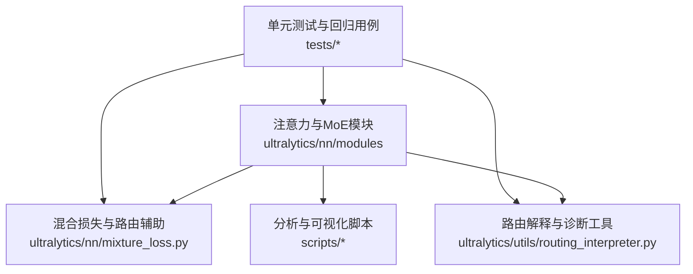
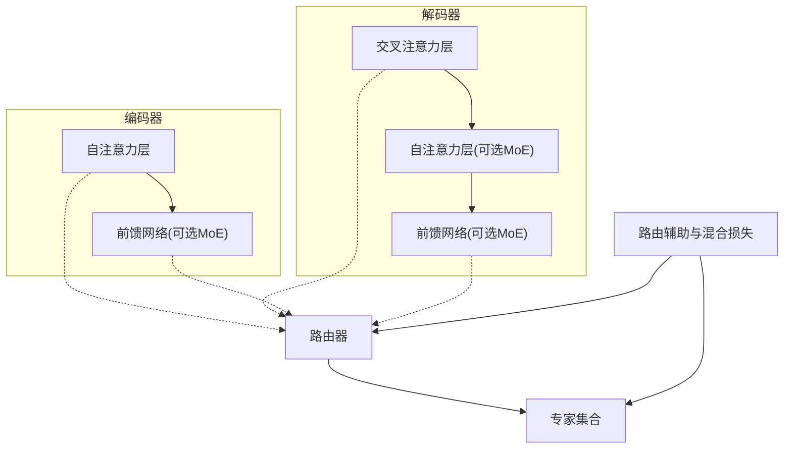
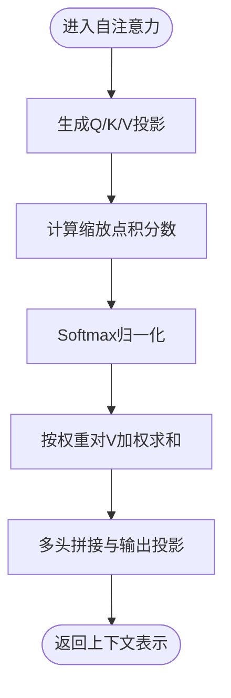
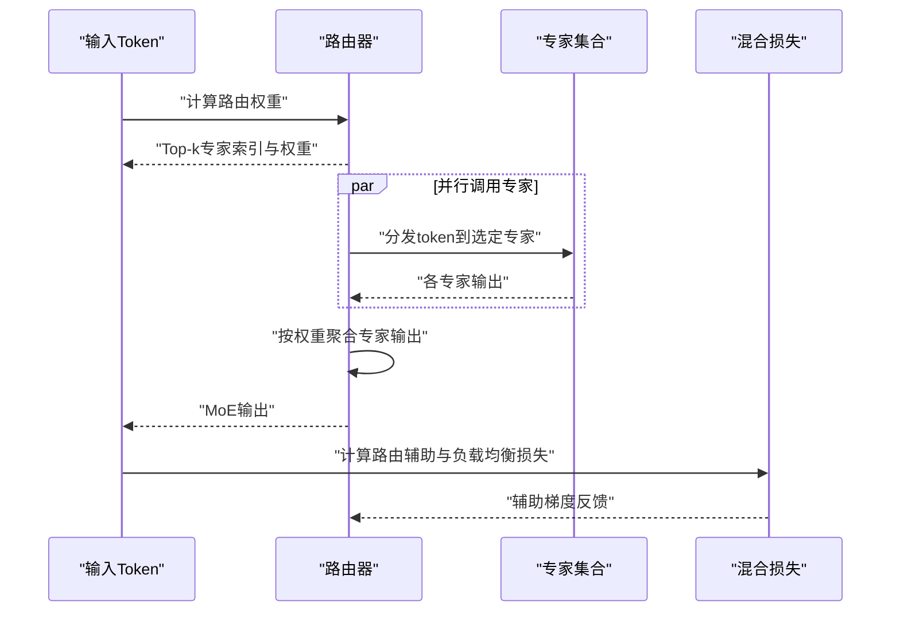
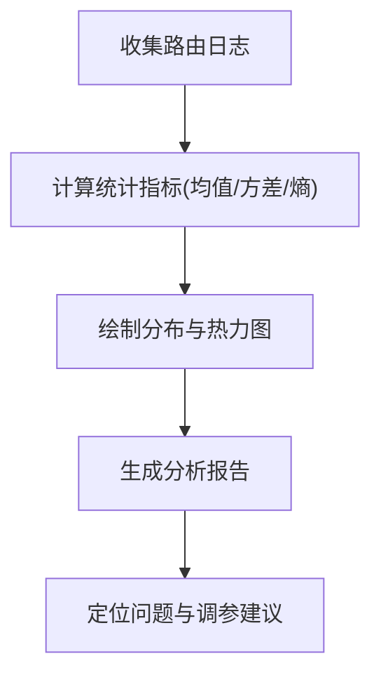
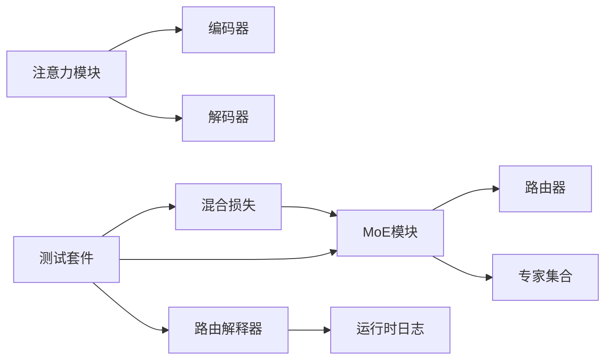

# 注意力模块

<cite>
**本文引用的文件**
- [ultralytics/nn/modules/attention.py](file://ultralytics/nn/modules/attention.py)
- [ultralytics/nn/modules/moe.py](file://ultralytics/nn/modules/moe.py)
- [ultralytics/nn/mixture_loss.py](file://ultralytics/nn/mixture_loss.py)
- [ultralytics/utils/routing_interpreter.py](file://ultralytics/utils/routing_interpreter.py)
- [scripts/analyze_mot_routing.py](file://scripts/analyze_mot_routing.py)
- [scripts/diagnose_mot_routing.py](file://scripts/diagnose_mot_routing.py)
- [tests/test_moe.py](file://tests/test_moe.py)
- [tests/test_moe_router_boundaries.py](file://tests/test_moe_router_boundaries.py)
- [tests/test_moe_dynamic_scheduler.py](file://tests/test_moe_dynamic_scheduler.py)
- [tests/test_moe_usage_audit.py](file://tests/test_moe_usage_audit.py)
- [tests/test_moe_validation_collectives.py](file://tests/test_moe_validation_collectives.py)
- [tests/test_molora_sparse_dispatch.py](file://tests/test_molora_sparse_dispatch.py)
- [tests/test_molora_routing_aware_merge.py](file://tests/test_molora_routing_aware_merge.py)
- [tests/test_mixture_config_registry.py](file://tests/test_mixture_config_registry.py)
- [tests/test_mixture_export.py](file://tests/test_mixture_export.py)
- [tests/test_mixture_numeric.py](file://tests/test_mixture_numeric.py)
- [tests/test_mixture_aux_loss.py](file://tests/test_mixture_aux_loss.py)
- [tests/test_mixture_compile.py](file://tests/test_mixture_compile.py)
- [tests/test_mixture_model_registry.py](file://tests/test_mixture_model_registry.py)
- [tests/test_mixture_loss_composition.py](file://tests/test_mixture_loss_composition.py)
- [tests/test_moa.py](file://tests/test_moa.py)
- [tests/test_moa_mot_ddp_math.py](file://tests/test_moa_mot_ddp_math.py)
- [tests/test_moa_mot_ssot.py](file://tests/test_moa_mot_ssot.py)
- [tests/test_routing_aux_contract.py](file://tests/test_routing_aux_contract.py)
- [tests/test_routing_interpreter.py](file://tests/test_routing_interpreter.py)
- [tests/test_routed_module_protocol.py](file://tests/test_routed_module_protocol.py)
- [tests/test_moe_amp_index_add.py](file://tests/test_moe_amp_index_add.py)
- [tests/test_moe_ddp_fixes.py](file://tests/test_moe_ddp_fixes.py)
- [tests/test_moe_variant_contract.py](file://tests/test_moe_variant_contract.py)
- [tests/test_moe_ssot.py](file://tests/test_moe_ssot.py)
- [tests/test_moe_aware_peft.py](file://tests/test_moe_aware_peft.py)
- [tests/test_molora.py](file://tests/test_molora.py)
- [tests/test_molora_dtype.py](file://tests/test_molora_dtype.py)
- [tests/test_molora_merge_semantics.py](file://tests/test_molora_merge_semantics.py)
- [tests/test_molora_supplementary.py](file://tests/test_molora_supplementary.py)
- [tests/test_mot.py](file://tests/test_mot.py)
- [tests/test_mot_routing_diagnostics.py](file://tests/test_mot_routing_diagnostics.py)
- [tests/test_mot_scene_aware_router.py](file://tests/test_mot_scene_aware_router.py)
- [tests/test_mot_sparse_parity.py](file://tests/test_mot_sparse_parity.py)
</cite>

## 目录
1. [简介](#简介)
2. [项目结构](#项目结构)
3. [核心组件](#核心组件)
4. [架构总览](#架构总览)
5. [详细组件分析](#详细组件分析)
6. [依赖关系分析](#依赖关系分析)
7. [性能考量](#性能考量)
8. [故障排查指南](#故障排查指南)
9. [结论](#结论)
10. [附录](#附录)

## 简介
本技术文档聚焦于注意力模块，覆盖自注意力(Self-Attention)、交叉注意力(Cross-Attention)、多头注意力(Multi-Head Attention)的数学原理与PyTorch实现要点；深入解析Transformer编码器-解码器架构中的设计模式与优化技巧；阐述路由机制(Routing)在注意力分配中的作用与实现；解释Mixture-of-Experts(MoE)中专家路由与负载均衡策略；并提供注意力模块的配置方法与性能调优指南，以及注意力权重可视化与分析工具的使用说明。

## 项目结构
本项目将注意力相关能力集中在神经网络模块层与工具层：
- 注意力与MoE核心实现位于 nn/modules 下，包含注意力、门控、路由与专家等关键类。
- 混合损失与路由辅助项位于 nn/mixture_loss.py。
- 路由解释与诊断工具位于 utils/routing_interpreter.py 与 scripts 下的分析脚本。
- 大量测试覆盖路由边界、动态调度、稀疏分发、数值稳定性、导出兼容性与DDP一致性等。

图表来源
- [ultralytics/nn/modules/attention.py](file://ultralytics/nn/modules/attention.py)
- [ultralytics/nn/modules/moe.py](file://ultralytics/nn/modules/moe.py)
- [ultralytics/nn/mixture_loss.py](file://ultralytics/nn/mixture_loss.py)
- [ultralytics/utils/routing_interpreter.py](file://ultralytics/utils/routing_interpreter.py)
- [scripts/analyze_mot_routing.py](file://scripts/analyze_mot_routing.py)
- [scripts/diagnose_mot_routing.py](file://scripts/diagnose_mot_routing.py)

章节来源
- [ultralytics/nn/modules/attention.py](file://ultralytics/nn/modules/attention.py)
- [ultralytics/nn/modules/moe.py](file://ultralytics/nn/modules/moe.py)
- [ultralytics/nn/mixture_loss.py](file://ultralytics/nn/mixture_loss.py)
- [ultralytics/utils/routing_interpreter.py](file://ultralytics/utils/routing_interpreter.py)
- [scripts/analyze_mot_routing.py](file://scripts/analyze_mot_routing.py)
- [scripts/diagnose_mot_routing.py](file://scripts/diagnose_mot_routing.py)

## 核心组件
- 自注意力与交叉注意力：通过查询(Q)、键(K)、值(V)的缩放点积计算注意力权重，并加权求和得到上下文表示。多头注意力并行多个子空间以增强表达能力。
- 路由机制：根据输入特征或场景信息选择专家或注意力头，控制稀疏激活与负载分布。
- MoE（混合专家）：将前馈或注意力块替换为“路由器+多专家”的结构，结合负载均衡辅助损失提升训练稳定性与吞吐。
- 混合损失与路由辅助：包括路由熵正则、容量因子惩罚、专家使用均衡等辅助项，用于稳定MoE训练。
- 路由解释与可视化：提供注意力权重与路由权重的统计、热力图与分布分析，便于调试与解释。

章节来源
- [ultralytics/nn/modules/attention.py](file://ultralytics/nn/modules/attention.py)
- [ultralytics/nn/modules/moe.py](file://ultralytics/nn/modules/moe.py)
- [ultralytics/nn/mixture_loss.py](file://ultralytics/nn/mixture_loss.py)
- [ultralytics/utils/routing_interpreter.py](file://ultralytics/utils/routing_interpreter.py)

## 架构总览
下图展示了注意力与MoE在模型中的典型位置与交互关系：编码器-解码器结构中，编码器内部使用自注意力，解码器引入交叉注意力；MoE可嵌入到注意力或FFN中以获得稀疏计算优势；路由辅助与混合损失参与训练阶段。

图表来源
- [ultralytics/nn/modules/attention.py](file://ultralytics/nn/modules/attention.py)
- [ultralytics/nn/modules/moe.py](file://ultralytics/nn/modules/moe.py)
- [ultralytics/nn/mixture_loss.py](file://ultralytics/nn/mixture_loss.py)

## 详细组件分析

### 自注意力与交叉注意力
- 数学要点
  - 自注意力：对同一序列的Q、K、V进行缩放点积与Softmax，再对V加权求和。
  - 交叉注意力：解码器的Q与编码器的K、V进行注意力计算，实现跨模态/跨阶段的条件建模。
  - 多头注意力：将Q、K、V投影至多个子空间并行计算注意力，再拼接并线性变换，提高表征多样性。
- PyTorch实现要点
  - 维度对齐与形状广播：确保[B, T, d]或[B, H, W, d]等维度的正确性。
  - 数值稳定性：缩放因子与Softmax前的数值裁剪，避免溢出与NaN。
  - 内存优化：分块计算、梯度检查点、避免中间张量重复创建。
- 配置方法
  - 头数、隐藏维度、dropout、是否使用偏置、是否启用残差与层归一化顺序等。
- 性能调优
  - 使用高效算子与内核融合；合理设置batch与序列长度；在推理时缓存KV以提升速度。

章节来源
- [ultralytics/nn/modules/attention.py](file://ultralytics/nn/modules/attention.py)

#### 自注意力计算流程

图表来源
- [ultralytics/nn/modules/attention.py](file://ultralytics/nn/modules/attention.py)

### 路由机制与MoE
- 路由目标
  - 将输入样本或token分配到少数专家，降低计算成本并提升容量。
  - 平衡专家负载，避免“热点专家”导致瓶颈。
- 路由策略
  - Top-k选择：每个token选择k个专家，支持软路由或硬路由。
  - 容量因子：限制每批内每个专家的最大token数，防止过载。
  - 负载均衡辅助：基于专家使用率的熵或方差正则，鼓励均匀利用。
- 实现要点
  - 路由权重与专家输出的聚合方式（如加权求和）。
  - 与DDP/AMP的兼容性：索引累加与梯度同步的正确性。
  - 稀疏分发与合并：减少不必要的通信与计算。
- 配置方法
  - 专家数量、Top-k、容量因子、路由温度、辅助损失权重、动态调度开关等。
- 性能调优
  - 动态调度：根据历史负载调整路由偏好；批内重排以减少碎片；在推理阶段固定路由路径以降低开销。

章节来源
- [ultralytics/nn/modules/moe.py](file://ultralytics/nn/modules/moe.py)
- [ultralytics/nn/mixture_loss.py](file://ultralytics/nn/mixture_loss.py)

#### MoE路由与专家执行时序

图表来源
- [ultralytics/nn/modules/moe.py](file://ultralytics/nn/modules/moe.py)
- [ultralytics/nn/mixture_loss.py](file://ultralytics/nn/mixture_loss.py)

### 路由解释与可视化
- 功能
  - 统计注意力权重与路由权重的分布、熵、峰值与尾部行为。
  - 生成热力图与时间序列曲线，帮助定位异常路由与过拟合。
- 使用方法
  - 在训练回调或验证阶段收集路由日志，调用解释器接口进行汇总与绘图。
  - 针对多任务跟踪(MOT)场景，可按场景类型分组分析路由差异。
- 工具入口
  - 路由解释器API与脚本化分析工具，支持批量导出报告。

章节来源
- [ultralytics/utils/routing_interpreter.py](file://ultralytics/utils/routing_interpreter.py)
- [scripts/analyze_mot_routing.py](file://scripts/analyze_mot_routing.py)
- [scripts/diagnose_mot_routing.py](file://scripts/diagnose_mot_routing.py)

#### 路由权重分析流程

图表来源
- [ultralytics/utils/routing_interpreter.py](file://ultralytics/utils/routing_interpreter.py)
- [scripts/analyze_mot_routing.py](file://scripts/analyze_mot_routing.py)

## 依赖关系分析
注意力与MoE模块之间的耦合关系如下：
- 注意力模块作为基础构建块，被编码器/解码器复用。
- MoE模块依赖路由器与专家集合，并通过混合损失提供辅助信号。
- 路由解释器依赖运行时日志，不反向依赖模型模块，保持解耦。
- 测试套件覆盖路由边界、动态调度、稀疏分发、数值稳定性、导出与DDP一致性等，保障鲁棒性。

图表来源
- [ultralytics/nn/modules/attention.py](file://ultralytics/nn/modules/attention.py)
- [ultralytics/nn/modules/moe.py](file://ultralytics/nn/modules/moe.py)
- [ultralytics/nn/mixture_loss.py](file://ultralytics/nn/mixture_loss.py)
- [ultralytics/utils/routing_interpreter.py](file://ultralytics/utils/routing_interpreter.py)
- [tests/test_moe.py](file://tests/test_moe.py)
- [tests/test_moe_router_boundaries.py](file://tests/test_moe_router_boundaries.py)
- [tests/test_moe_dynamic_scheduler.py](file://tests/test_moe_dynamic_scheduler.py)
- [tests/test_moe_usage_audit.py](file://tests/test_moe_usage_audit.py)
- [tests/test_moe_validation_collectives.py](file://tests/test_moe_validation_collectives.py)
- [tests/test_molora_sparse_dispatch.py](file://tests/test_molora_sparse_dispatch.py)
- [tests/test_molora_routing_aware_merge.py](file://tests/test_molora_routing_aware_merge.py)
- [tests/test_mixture_config_registry.py](file://tests/test_mixture_config_registry.py)
- [tests/test_mixture_export.py](file://tests/test_mixture_export.py)
- [tests/test_mixture_numeric.py](file://tests/test_mixture_numeric.py)
- [tests/test_mixture_aux_loss.py](file://tests/test_mixture_aux_loss.py)
- [tests/test_mixture_compile.py](file://tests/test_mixture_compile.py)
- [tests/test_mixture_model_registry.py](file://tests/test_mixture_model_registry.py)
- [tests/test_mixture_loss_composition.py](file://tests/test_mixture_loss_composition.py)
- [tests/test_moa.py](file://tests/test_moa.py)
- [tests/test_moa_mot_ddp_math.py](file://tests/test_moa_mot_ddp_math.py)
- [tests/test_moa_mot_ssot.py](file://tests/test_moa_mot_ssot.py)
- [tests/test_routing_aux_contract.py](file://tests/test_routing_aux_contract.py)
- [tests/test_routing_interpreter.py](file://tests/test_routing_interpreter.py)
- [tests/test_routed_module_protocol.py](file://tests/test_routed_module_protocol.py)
- [tests/test_moe_amp_index_add.py](file://tests/test_moe_amp_index_add.py)
- [tests/test_moe_ddp_fixes.py](file://tests/test_moe_ddp_fixes.py)
- [tests/test_moe_variant_contract.py](file://tests/test_moe_variant_contract.py)
- [tests/test_moe_ssot.py](file://tests/test_moe_ssot.py)
- [tests/test_moe_aware_peft.py](file://tests/test_moe_aware_peft.py)
- [tests/test_molora.py](file://tests/test_molora.py)
- [tests/test_molora_dtype.py](file://tests/test_molora_dtype.py)
- [tests/test_molora_merge_semantics.py](file://tests/test_molora_merge_semantics.py)
- [tests/test_molora_supplementary.py](file://tests/test_molora_supplementary.py)
- [tests/test_mot.py](file://tests/test_mot.py)
- [tests/test_mot_routing_diagnostics.py](file://tests/test_mot_routing_diagnostics.py)
- [tests/test_mot_scene_aware_router.py](file://tests/test_mot_scene_aware_router.py)
- [tests/test_mot_sparse_parity.py](file://tests/test_mot_sparse_parity.py)

## 性能考量
- 注意力
  - 使用高效的矩阵乘法与Softmax内核；在长序列场景采用分块或近似注意力。
  - 推理时缓存KV，减少重复计算；合理设置头数与维度以平衡精度与速度。
- MoE
  - 动态调度与容量因子调节可降低热点专家风险；Top-k越小越稀疏但需保证表达力。
  - 路由辅助损失权重需随训练阶段调整，避免过度平滑导致路由退化。
  - 在DDP环境下注意索引累加的数值稳定性与通信开销。
- 混合损失
  - 辅助损失的组合与权重需要与主任务损失协同调参，避免主导或失效。
- 编译与导出
  - 关注路由路径的可导出性与静态图约束；必要时使用路由感知合并策略。

[本节为通用指导，无需具体文件引用]

## 故障排查指南
- 路由不稳定或NaN
  - 检查Softmax前的数值裁剪与缩放因子；确认路由温度与Top-k设置。
  - 查看路由辅助损失是否过大导致梯度爆炸。
- 专家负载不均
  - 增加容量因子或调整辅助损失权重；启用动态调度以缓解热点。
  - 使用路由解释器分析分布与熵，定位异常场景。
- DDP/AMP相关问题
  - 验证索引累加与梯度同步逻辑；检查不同设备上的数值一致性与收敛性。
- 导出与部署
  - 确认路由路径在导出后仍保持一致；必要时使用路由感知合并与静态路径固化。

章节来源
- [tests/test_moe.py](file://tests/test_moe.py)
- [tests/test_moe_router_boundaries.py](file://tests/test_moe_router_boundaries.py)
- [tests/test_moe_dynamic_scheduler.py](file://tests/test_moe_dynamic_scheduler.py)
- [tests/test_moe_usage_audit.py](file://tests/test_moe_usage_audit.py)
- [tests/test_moe_validation_collectives.py](file://tests/test_moe_validation_collectives.py)
- [tests/test_molora_sparse_dispatch.py](file://tests/test_molora_sparse_dispatch.py)
- [tests/test_molora_routing_aware_merge.py](file://tests/test_molora_routing_aware_merge.py)
- [tests/test_mixture_config_registry.py](file://tests/test_mixture_config_registry.py)
- [tests/test_mixture_export.py](file://tests/test_mixture_export.py)
- [tests/test_mixture_numeric.py](file://tests/test_mixture_numeric.py)
- [tests/test_mixture_aux_loss.py](file://tests/test_mixture_aux_loss.py)
- [tests/test_mixture_compile.py](file://tests/test_mixture_compile.py)
- [tests/test_mixture_model_registry.py](file://tests/test_mixture_model_registry.py)
- [tests/test_mixture_loss_composition.py](file://tests/test_mixture_loss_composition.py)
- [tests/test_moa.py](file://tests/test_moa.py)
- [tests/test_moa_mot_ddp_math.py](file://tests/test_moa_mot_ddp_math.py)
- [tests/test_moa_mot_ssot.py](file://tests/test_moa_mot_ssot.py)
- [tests/test_routing_aux_contract.py](file://tests/test_routing_aux_contract.py)
- [tests/test_routing_interpreter.py](file://tests/test_routing_interpreter.py)
- [tests/test_routed_module_protocol.py](file://tests/test_routed_module_protocol.py)
- [tests/test_moe_amp_index_add.py](file://tests/test_moe_amp_index_add.py)
- [tests/test_moe_ddp_fixes.py](file://tests/test_moe_ddp_fixes.py)
- [tests/test_moe_variant_contract.py](file://tests/test_moe_variant_contract.py)
- [tests/test_moe_ssot.py](file://tests/test_moe_ssot.py)
- [tests/test_moe_aware_peft.py](file://tests/test_moe_aware_peft.py)
- [tests/test_molora.py](file://tests/test_molora.py)
- [tests/test_molora_dtype.py](file://tests/test_molora_dtype.py)
- [tests/test_molora_merge_semantics.py](file://tests/test_molora_merge_semantics.py)
- [tests/test_molora_supplementary.py](file://tests/test_molora_supplementary.py)
- [tests/test_mot.py](file://tests/test_mot.py)
- [tests/test_mot_routing_diagnostics.py](file://tests/test_mot_routing_diagnostics.py)
- [tests/test_mot_scene_aware_router.py](file://tests/test_mot_scene_aware_router.py)
- [tests/test_mot_sparse_parity.py](file://tests/test_mot_sparse_parity.py)

## 结论
注意力模块在本项目中提供了自注意力与交叉注意力的基础能力，并通过多头并行增强表征；MoE与路由机制进一步提升了模型的容量与效率。配合混合损失与路由解释工具，可在训练与推理阶段实现稳定的稀疏计算与可解释的路由行为。通过合理的配置与调优，能够在精度、速度与资源占用之间取得良好平衡。

[本节为总结性内容，无需具体文件引用]

## 附录
- 配置清单（示例字段）
  - 注意力：头数、隐藏维度、dropout、残差连接、层归一化顺序、KV缓存开关。
  - MoE：专家数量、Top-k、容量因子、路由温度、辅助损失权重、动态调度开关。
- 可视化与分析
  - 使用路由解释器生成注意力与路由权重分布图；按场景分组对比路由差异。
- 参考测试用例
  - 路由边界与动态调度：验证极端条件下的稳定性。
  - 稀疏分发与路由感知合并：确保导出与部署的一致性。
  - 数值稳定性与DDP一致性：保障多卡训练的可靠性。

[本节为补充信息，无需具体文件引用]