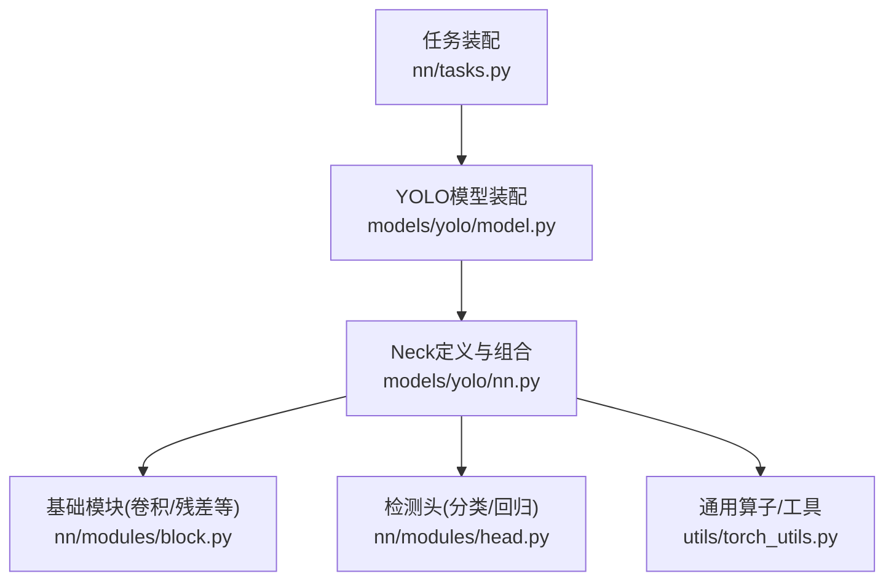
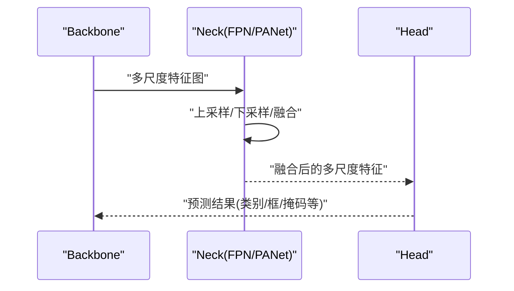
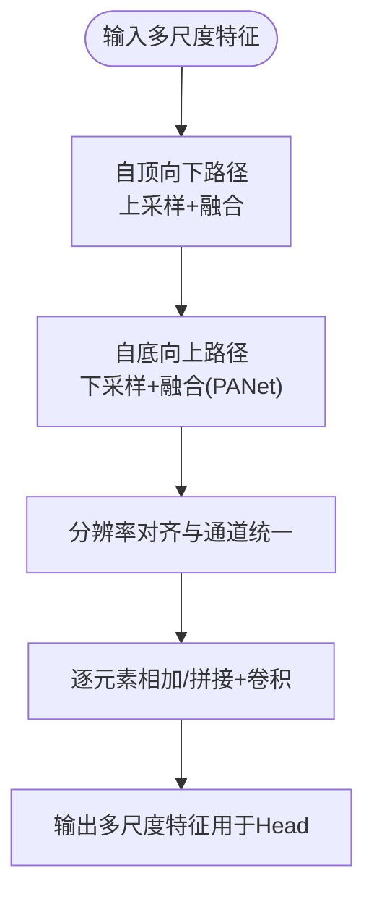
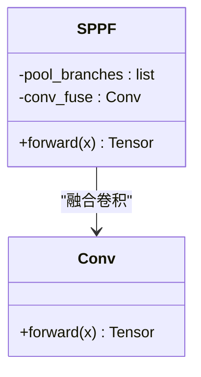
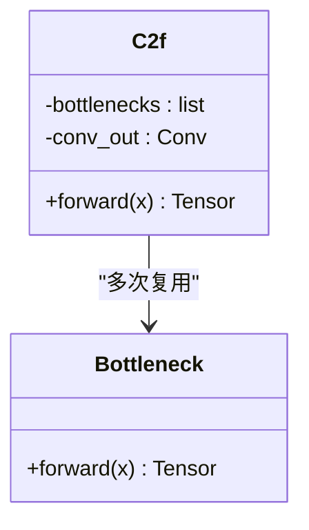
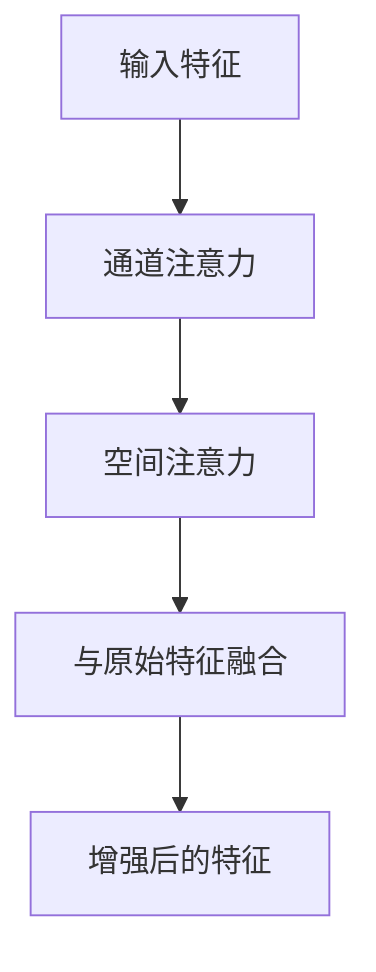
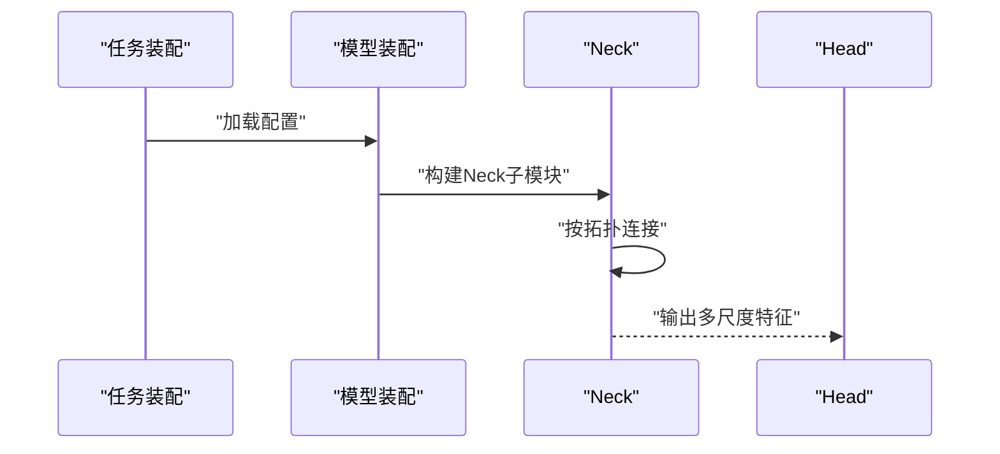
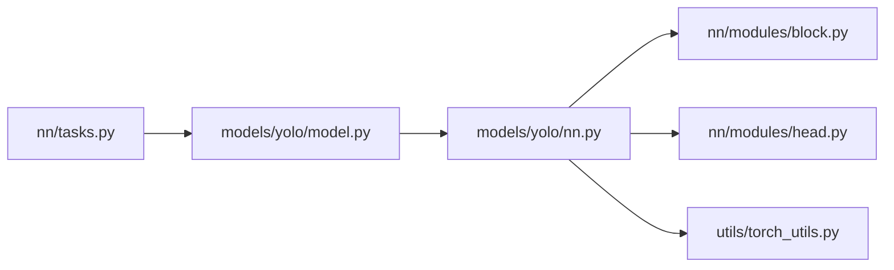

# 颈部网络模块

<cite>
**本文引用的文件**
- [models/yolo/nn.py](file://ultralytics/models/yolo/nn.py)
- [models/yolo/model.py](file://ultralytics/models/yolo/model.py)
- [nn/modules/block.py](file://ultralytics/nn/modules/block.py)
- [nn/modules/head.py](file://ultralytics/nn/modules/head.py)
- [nn/tasks.py](file://ultralytics/nn/tasks.py)
- [utils/torch_utils.py](file://ultralytics/utils/torch_utils.py)
</cite>

## 目录
1. [简介](#简介)
2. [项目结构](#项目结构)
3. [核心组件](#核心组件)
4. [架构总览](#架构总览)
5. [详细组件分析](#详细组件分析)
6. [依赖关系分析](#依赖关系分析)
7. [性能考量](#性能考量)
8. [故障排查指南](#故障排查指南)
9. [结论](#结论)
10. [附录](#附录)

## 简介
本文件聚焦于YOLO系列中的“颈部网络（Neck）”模块，系统阐述多尺度特征融合机制与实现细节，涵盖FPN、PANet的结构设计；深入解析SPPF的并行池化策略；说明C2f模块的特征融合算法与梯度流优化；介绍注意力机制在特征融合中的应用；并提供配置选项、性能调优建议、特征图可视化方法与调试技巧。文档力求兼顾工程落地与理论理解，帮助读者快速定位关键代码路径并进行有效优化。

## 项目结构
本项目中，颈部网络相关实现主要分布在以下位置：
- 模型构建与任务装配：[nn/tasks.py](file://ultralytics/nn/tasks.py)、[models/yolo/model.py](file://ultralytics/models/yolo/model.py)
- Neck与基础模块定义：[models/yolo/nn.py](file://ultralytics/models/yolo/nn.py)、[nn/modules/block.py](file://ultralytics/nn/modules/block.py)
- 检测头与输出：[nn/modules/head.py](file://ultralytics/nn/modules/head.py)
- 通用算子与工具：[utils/torch_utils.py](file://ultralytics/utils/torch_utils.py)

图表来源
- [nn/tasks.py](file://ultralytics/nn/tasks.py)
- [models/yolo/model.py](file://ultralytics/models/yolo/model.py)
- [models/yolo/nn.py](file://ultralytics/models/yolo/nn.py)
- [nn/modules/block.py](file://ultralytics/nn/modules/block.py)
- [nn/modules/head.py](file://ultralytics/nn/modules/head.py)
- [utils/torch_utils.py](file://ultralytics/utils/torch_utils.py)

章节来源
- [nn/tasks.py](file://ultralytics/nn/tasks.py)
- [models/yolo/model.py](file://ultralytics/models/yolo/model.py)
- [models/yolo/nn.py](file://ultralytics/models/yolo/nn.py)
- [nn/modules/block.py](file://ultralytics/nn/modules/block.py)
- [nn/modules/head.py](file://ultralytics/nn/modules/head.py)
- [utils/torch_utils.py](file://ultralytics/utils/torch_utils.py)

## 核心组件
本节概述Neck的核心构件及其职责：
- 多尺度特征融合主干：负责将Backbone输出的不同层级特征进行上采样、下采样与拼接/相加，形成具备强语义与细粒度信息的统一表示。
- SPPF（Spatial Pyramid Pooling Fast）：通过并行的多尺度池化分支聚合上下文信息，增强大目标与复杂场景下的表征能力。
- C2f模块：基于密集连接与多次融合的轻量级瓶颈块，提升特征表达能力并优化梯度流。
- 注意力机制：在融合前后引入通道/空间注意力，动态重标定特征响应，抑制背景噪声。
- PANet/FPN融合路径：自顶向下（Top-down）与自底向上（Bottom-up）双向融合，强化跨尺度交互。

章节来源
- [models/yolo/nn.py](file://ultralytics/models/yolo/nn.py)
- [nn/modules/block.py](file://ultralytics/nn/modules/block.py)
- [nn/modules/head.py](file://ultralytics/nn/modules/head.py)

## 架构总览
下图展示了Neck在整体检测流程中的位置与数据流向：Backbone提供多层特征，Neck执行FPN/PANet式融合，最终送入Head生成预测。

图表来源
- [models/yolo/model.py](file://ultralytics/models/yolo/model.py)
- [models/yolo/nn.py](file://ultralytics/models/yolo/nn.py)
- [nn/modules/head.py](file://ultralytics/nn/modules/head.py)

## 详细组件分析

### FPN与PANet的多尺度特征融合
- 设计要点
  - FPN采用自顶向下的路径，将高层语义特征上采样并与浅层细节特征对齐融合，增强小目标检测。
  - PANet在FPN基础上增加自底向上的路径，使浅层信息能再次影响高层表示，进一步改善跨尺度交互。
- 实现思路
  - 使用可学习的上采样或双线性插值对齐分辨率。
  - 融合方式包括逐元素相加与通道拼接后卷积，具体取决于配置与任务需求。
  - 各层融合后通常经过若干卷积层以统一通道数与感受野。
- 复杂度与收益
  - 时间复杂度随层数线性增长，但显著提升了mAP尤其是小目标指标。
  - 计算开销可通过减少融合层数或降低通道数进行权衡。

图表来源
- [models/yolo/nn.py](file://ultralytics/models/yolo/nn.py)
- [nn/modules/block.py](file://ultralytics/nn/modules/block.py)

章节来源
- [models/yolo/nn.py](file://ultralytics/models/yolo/nn.py)
- [nn/modules/block.py](file://ultralytics/nn/modules/block.py)

### SPPF（Spatial Pyramid Pooling Fast）并行池化策略
- 设计动机
  - 传统SPP使用多个不同尺度的最大/平均池化分支，计算冗余较大。
  - SPPF通过串行堆叠相同核大小的池化操作近似多尺度效果，减少参数与计算量。
- 并行策略
  - 多个池化分支并行执行，随后在通道维度拼接，再经卷积融合。
  - 若采用“Fast”变体，则通过重复池化与跳跃连接近似多尺度感受野，提高吞吐。
- 适用场景
  - 对大目标与复杂背景鲁棒性要求较高的检测任务。
  - 资源受限环境下需要平衡精度与速度的部署场景。

图表来源
- [models/yolo/nn.py](file://ultralytics/models/yolo/nn.py)
- [nn/modules/block.py](file://ultralytics/nn/modules/block.py)

章节来源
- [models/yolo/nn.py](file://ultralytics/models/yolo/nn.py)
- [nn/modules/block.py](file://ultralytics/nn/modules/block.py)

### C2f模块的特征融合与梯度流优化
- 结构特点
  - 基于密集连接的瓶颈结构，内部包含多次残差式融合与卷积变换。
  - 通过短路与长路结合，缓解深层网络的梯度消失问题，加速收敛。
- 融合算法
  - 在每层内对特征进行切分、卷积变换后再拼接，最后经卷积整合。
  - 支持多种融合策略（相加/拼接），根据任务与算力选择。
- 梯度流优化
  - 密集连接与残差路径为梯度提供直达通路，稳定训练。
  - 归一化与激活函数顺序对稳定性有重要影响。

图表来源
- [models/yolo/nn.py](file://ultralytics/models/yolo/nn.py)
- [nn/modules/block.py](file://ultralytics/nn/modules/block.py)

章节来源
- [models/yolo/nn.py](file://ultralytics/models/yolo/nn.py)
- [nn/modules/block.py](file://ultralytics/nn/modules/block.py)

### 注意力机制在特征融合中的应用
- 通道注意力
  - 对通道维度进行全局统计与门控，自适应重标定通道权重，突出判别性特征。
- 空间注意力
  - 在空间维度生成注意力图，抑制无关区域，增强目标区域响应。
- 融合位置
  - 可在FPN/PANet的融合前后插入注意力模块，提升跨尺度交互质量。
  - 也可置于SPPF之后，进一步聚合上下文。

图表来源
- [models/yolo/nn.py](file://ultralytics/models/yolo/nn.py)
- [nn/modules/block.py](file://ultralytics/nn/modules/block.py)

章节来源
- [models/yolo/nn.py](file://ultralytics/models/yolo/nn.py)
- [nn/modules/block.py](file://ultralytics/nn/modules/block.py)

### Neck配置与组装
- 配置项
  - 融合路径：是否启用PANet的自底向上路径。
  - 融合方式：相加或拼接，以及后续卷积通道数。
  - SPPF分支数量与核大小，控制感受野与计算开销。
  - C2f深度与宽度，调节模型容量与速度。
  - 注意力类型与插入位置，平衡精度与延迟。
- 组装流程
  - 由任务装配器读取配置，实例化Neck各子模块，并按拓扑连接。
  - Head接收Neck输出，完成分类与回归分支。

图表来源
- [nn/tasks.py](file://ultralytics/nn/tasks.py)
- [models/yolo/model.py](file://ultralytics/models/yolo/model.py)
- [models/yolo/nn.py](file://ultralytics/models/yolo/nn.py)
- [nn/modules/head.py](file://ultralytics/nn/modules/head.py)

章节来源
- [nn/tasks.py](file://ultralytics/nn/tasks.py)
- [models/yolo/model.py](file://ultralytics/models/yolo/model.py)
- [models/yolo/nn.py](file://ultralytics/models/yolo/nn.py)
- [nn/modules/head.py](file://ultralytics/nn/modules/head.py)

## 依赖关系分析
Neck模块与周边组件的依赖关系如下：
- 任务装配与模型装配负责从配置到实例化的映射。
- Neck依赖基础模块（卷积、归一化、激活等）与工具函数（如张量操作）。
- Head依赖Neck输出的多尺度特征进行预测。

图表来源
- [nn/tasks.py](file://ultralytics/nn/tasks.py)
- [models/yolo/model.py](file://ultralytics/models/yolo/model.py)
- [models/yolo/nn.py](file://ultralytics/models/yolo/nn.py)
- [nn/modules/block.py](file://ultralytics/nn/modules/block.py)
- [nn/modules/head.py](file://ultralytics/nn/modules/head.py)
- [utils/torch_utils.py](file://ultralytics/utils/torch_utils.py)

章节来源
- [nn/tasks.py](file://ultralytics/nn/tasks.py)
- [models/yolo/model.py](file://ultralytics/models/yolo/model.py)
- [models/yolo/nn.py](file://ultralytics/models/yolo/nn.py)
- [nn/modules/block.py](file://ultralytics/nn/modules/block.py)
- [nn/modules/head.py](file://ultralytics/nn/modules/head.py)
- [utils/torch_utils.py](file://ultralytics/utils/torch_utils.py)

## 性能考量
- 计算与内存
  - 减少融合层数与通道数以降低FLOPs与显存占用。
  - 优先使用相加融合而非拼接，以减少通道膨胀带来的计算压力。
- 并行与吞吐
  - SPPF并行分支可利用GPU并发特性，注意避免过度分支导致调度开销。
  - 合理设置批大小与图像尺寸，匹配硬件峰值带宽。
- 数值稳定性
  - 归一化与激活的顺序对训练稳定性至关重要，建议遵循标准顺序。
  - 混合精度训练时关注梯度缩放与溢出风险。
- 部署优化
  - 导出前进行算子融合与常量折叠，减少运行时开销。
  - 针对边缘设备裁剪Neck深度与宽度，保持精度-速度平衡。

## 故障排查指南
- 常见问题
  - 形状不匹配：上采样/下采样后分辨率不一致，检查对齐策略与步幅。
  - 通道不一致：拼接后未进行通道统一卷积，导致后续模块报错。
  - 梯度异常：深层网络出现NaN/Inf，检查归一化与学习率设置。
- 诊断方法
  - 打印中间特征图的形状与统计量，确认融合路径正确。
  - 逐步禁用注意力或SPPF分支，定位性能退化来源。
  - 使用可视化工具观察特征图响应，验证注意力是否聚焦目标区域。
- 参考工具
  - 通用张量操作与调试工具位于工具库中，便于快速定位问题。

章节来源
- [utils/torch_utils.py](file://ultralytics/utils/torch_utils.py)

## 结论
Neck作为多尺度特征融合的关键环节，通过FPN/PANet的双向融合、SPPF的并行池化与C2f的高效融合，显著提升了检测性能。合理配置与调优可在精度与速度之间取得良好平衡。借助可视化与调试技巧，能够快速定位问题并持续优化。

## 附录
- 特征图可视化方法
  - 提取Neck各层输出，进行通道维度的最大响应可视化。
  - 对比加入注意力前后的特征图差异，评估注意力有效性。
- 调试技巧
  - 使用最小复现脚本隔离问题，逐步添加模块定位根因。
  - 记录关键超参与性能指标，建立实验追踪表。