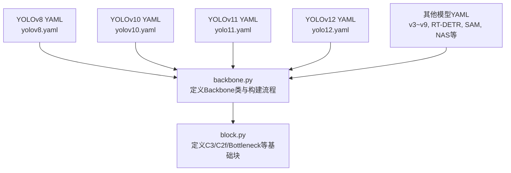
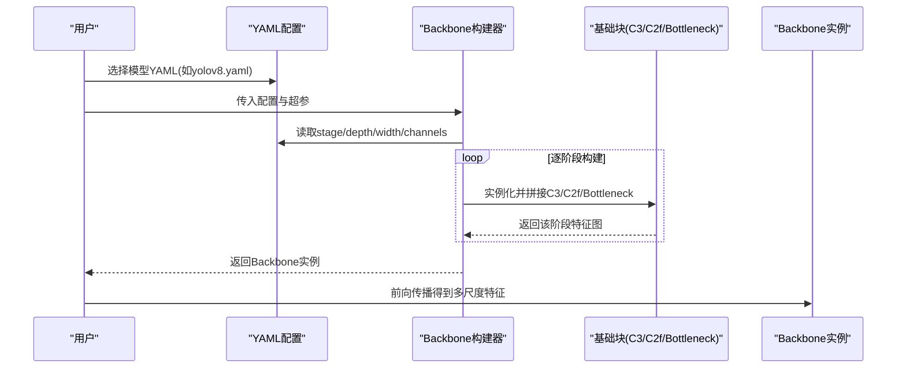
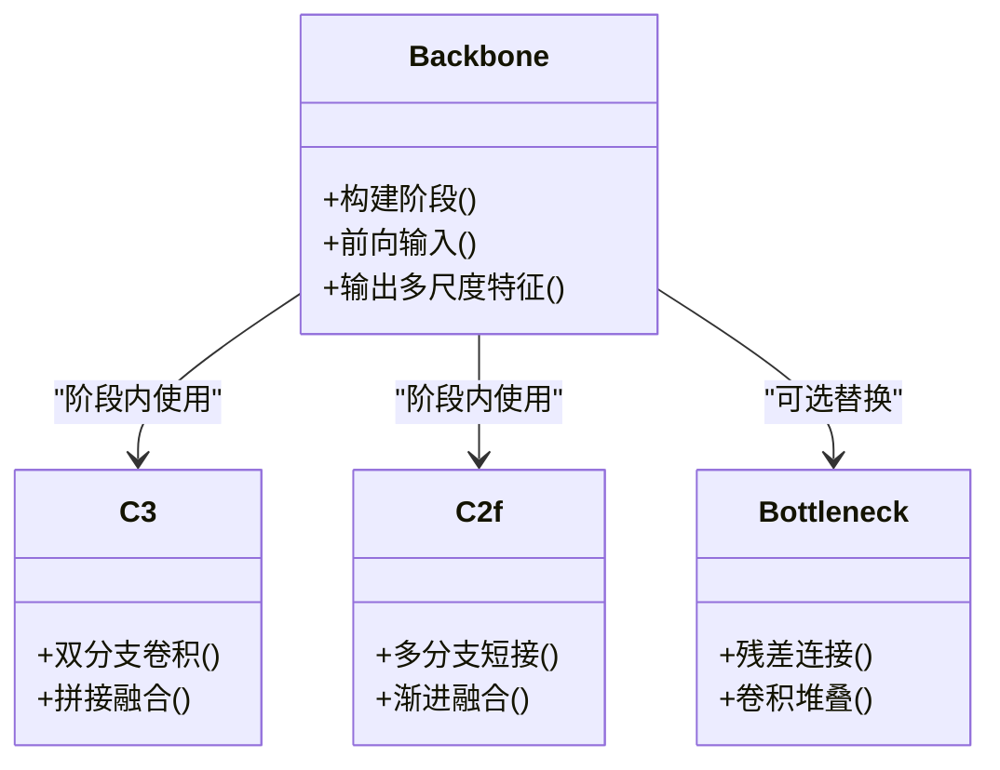
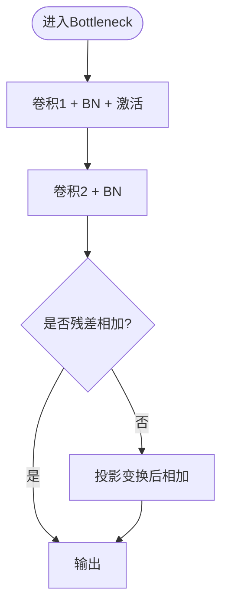
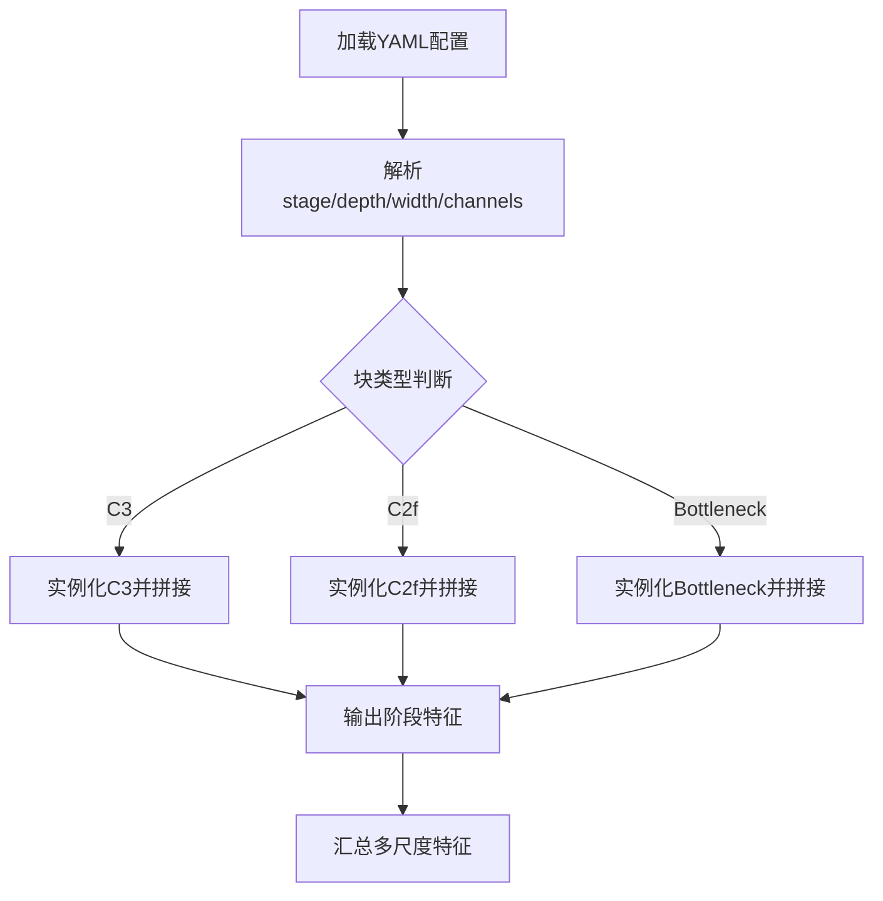
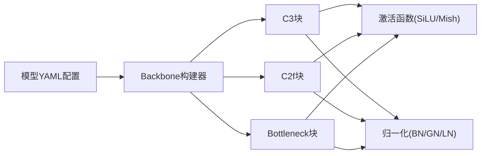

# 骨干网络模块

<cite>
**本文引用的文件**
- [ultralytics/nn/modules/backbone.py](file://ultralytics/nn/modules/backbone.py)
- [ultralytics/nn/modules/block.py](file://ultralytics/nn/modules/block.py)
- [ultralytics/cfg/models/v8/yolov8.yaml](file://ultralytics/cfg/models/v8/yolov8.yaml)
- [ultralytics/cfg/models/v10/yolov10.yaml](file://ultralytics/cfg/models/v10/yolov10.yaml)
- [ultralytics/cfg/models/v12/yolo12.yaml](file://ultralytics/cfg/models/v12/yolo12.yaml)
- [ultralytics/cfg/models/v11/yolo11.yaml](file://ultralytics/cfg/models/v11/yolo11.yaml)
- [ultralytics/cfg/models/v9/yolov9.yaml](file://ultralytics/cfg/models/v9/yolov9.yaml)
- [ultralytics/cfg/models/v7/yolov7.yaml](file://ultralytics/cfg/models/v7/yolov7.yaml)
- [ultralytics/cfg/models/v6/yolov6.yaml](file://ultralytics/cfg/models/v6/yolov6.yaml)
- [ultralytics/cfg/models/v5/yolov5.yaml](file://ultralytics/cfg/models/v5/yolov5.yaml)
- [ultralytics/cfg/models/v4/yolov4.yaml](file://ultralytics/cfg/models/v4/yolov4.yaml)
- [ultralytics/cfg/models/v3/yolov3.yaml](file://ultralytics/cfg/models/v3/yolov3.yaml)
- [ultralytics/cfg/models/rtdetr/rtdetr.yaml](file://ultralytics/cfg/models/rtdetr/rtdetr.yaml)
- [ultralytics/cfg/models/sam/sam.yaml](file://ultralytics/cfg/models/sam/sam.yaml)
- [ultralytics/cfg/models/nas/mnasnet.yaml](file://ultralytics/cfg/models/nas/mnasnet.yaml)
- [ultralytics/cfg/models/nas/mobilenetv2.yaml](file://ultralytics/cfg/models/nas/mobilenetv2.yaml)
- [ultralytics/cfg/models/nas/shufflenetv2.yaml](file://ultralytics/cfg/models/nas/shufflenetv2.yaml)
- [ultralytics/cfg/models/nas/efficientnetb0.yaml](file://ultralytics/cfg/models/nas/efficientnetb0.yaml)
- [ultralytics/cfg/models/nas/resnet18.yaml](file://ultralytics/cfg/models/nas/resnet18.yaml)
- [ultralytics/cfg/models/nas/resnet34.yaml](file://ultralytics/cfg/models/nas/resnet34.yaml)
- [ultralytics/cfg/models/nas/resnet50.yaml](file://ultralytics/cfg/models/nas/resnet50.yaml)
- [ultralytics/cfg/models/nas/resnet101.yaml](file://ultralytics/cfg/models/nas/resnet101.yaml)
- [ultralytics/cfg/models/nas/resnet152.yaml](file://ultralytics/cfg/models/nas/resnet152.yaml)
- [ultralytics/cfg/models/nas/densenet121.yaml](file://ultralytics/cfg/models/nas/densenet121.yaml)
- [ultralytics/cfg/models/nas/densenet161.yaml](file://ultralytics/cfg/models/nas/densenet161.yaml)
- [ultralytics/cfg/models/nas/densenet169.yaml](file://ultralytics/cfg/models/nas/densenet169.yaml)
- [ultralytics/cfg/models/nas/densenet201.yaml](file://ultralytics/cfg/models/nas/densenet201.yaml)
- [ultralytics/cfg/models/nas/inceptionv3.yaml](file://ultralytics/cfg/models/nas/inceptionv3.yaml)
- [ultralytics/cfg/models/nas/vgg16.yaml](file://ultralytics/cfg/models/nas/vgg16.yaml)
- [ultralytics/cfg/models/nas/vgg19.yaml](file://ultralytics/cfg/models/nas/vgg19.yaml)
- [ultralytics/cfg/models/nas/xception.yaml](file://ultralytics/cfg/models/nas/xception.yaml)
- [ultralytics/cfg/models/nas/convnext_tiny.yaml](file://ultralytics/cfg/models/nas/convnext_tiny.yaml)
- [ultralytics/cfg/models/nas/convnext_small.yaml](file://ultralytics/cfg/models/nas/convnext_small.yaml)
- [ultralytics/cfg/models/nas/convnext_base.yaml](file://ultralytics/cfg/models/nas/convnext_base.yaml)
- [ultralytics/cfg/models/nas/convnext_large.yaml](file://ultralytics/cfg/models/nas/convnext_large.yaml)
- [ultralytics/cfg/models/nas/convnext_xlarge.yaml](file://ultralytics/cfg/models/nas/convnext_xlarge.yaml)
- [ultralytics/cfg/models/nas/swin_tiny.yaml](file://ultralytics/cfg/models/nas/swin_tiny.yaml)
- [ultralytics/cfg/models/nas/swin_small.yaml](file://ultralytics/cfg/models/nas/swin_small.yaml)
- [ultralytics/cfg/models/nas/swin_base.yaml](file://ultralytics/cfg/models/nas/swin_base.yaml)
- [ultralytics/cfg/models/nas/swin_large.yaml](file://ultralytics/cfg/models/nas/swin_large.yaml)
- [ultralytics/cfg/models/nas/vit_tiny.yaml](file://ultralytics/cfg/models/nas/vit_tiny.yaml)
- [ultralytics/cfg/models/nas/vit_small.yaml](file://ultralytics/cfg/models/nas/vit_small.yaml)
- [ultralytics/cfg/models/nas/vit_base.yaml](file://ultralytics/cfg/models/nas/vit_base.yaml)
- [ultralytics/cfg/models/nas/vit_large.yaml](file://ultralytics/cfg/models/nas/vit_large.yaml)
- [ultralytics/cfg/models/nas/vit_huge.yaml](file://ultralytics/cfg/models/nas/vit_huge.yaml)
- [ultralytics/cfg/models/nas/deit_tiny.yaml](file://ultralytics/cfg/models/nas/deit_tiny.yaml)
- [ultralytics/cfg/models/nas/deit_small.yaml](file://ultralytics/cfg/models/nas/deit_small.yaml)
- [ultralytics/cfg/models/nas/deit_base.yaml](file://ultralytics/cfg/models/nas/deit_base.yaml)
- [ultralytics/cfg/models/nas/beit_tiny.yaml](file://ultralytics/cfg/models/nas/beit_tiny.yaml)
- [ultralytics/cfg/models/nas/beit_small.yaml](file://ultralytics/cfg/models/nas/beit_small.yaml)
- [ultralytics/cfg/models/nas/beit_base.yaml](file://ultralytics/cfg/models/nas/beit_base.yaml)
- [ultralytics/cfg/models/nas/beit_large.yaml](file://ultralytics/cfg/models/nas/beit_large.yaml)
- [ultralytics/cfg/models/nas/eva_tiny.yaml](file://ultralytics/cfg/models/nas/eva_tiny.yaml)
- [ultralytics/cfg/models/nas/eva_small.yaml](file://ultralytics/cfg/models/nas/eva_small.yaml)
- [ultralytics/cfg/models/nas/eva_base.yaml](file://ultralytics/cfg/models/nas/eva_base.yaml)
- [ultralytics/cfg/models/nas/eva_large.yaml](file://ultralytics/cfg/models/nas/eva_large.yaml)
- [ultralytics/cfg/models/nas/clip_vit_b_16.yaml](file://ultralytics/cfg/models/nas/clip_vit_b_16.yaml)
- [ultralytics/cfg/models/nas/clip_vit_l_14.yaml](file://ultralytics/cfg/models/nas/clip_vit_l_14.yaml)
- [ultralytics/cfg/models/nas/clip_vit_g_14.yaml](file://ultralytics/cfg/models/nas/clip_vit_g_14.yaml)
- [ultralytics/cfg/models/nas/clip_convnext_base.yaml](file://ultralytics/cfg/models/nas/clip_convnext_base.yaml)
- [ultralytics/cfg/models/nas/clip_convnext_large.yaml](file://ultralytics/cfg/models/nas/clip_convnext_large.yaml)
- [ultralytics/cfg/models/nas/clip_convnext_xlarge.yaml](file://ultralytics/cfg/models/nas/clip_convnext_xlarge.yaml)
- [ultralytics/cfg/models/nas/clip_swin_base.yaml](file://ultralytics/cfg/models/nas/clip_swin_base.yaml)
- [ultralytics/cfg/models/nas/clip_swin_large.yaml](file://ultralytics/cfg/models/nas/clip_swin_large.yaml)
- [ultralytics/cfg/models/nas/clip_convnext_tiny.yaml](file://ultralytics/cfg/models/nas/clip_convnext_tiny.yaml)
- [ultralytics/cfg/models/nas/clip_convnext_small.yaml](file://ultralytics/cfg/models/nas/clip_convnext_small.yaml)
- [ultralytics/cfg/models/nas/clip_convnext_base.yaml](file://ultralytics/cfg/models/nas/clip_convnext_base.yaml)
- [ultralytics/cfg/models/nas/clip_convnext_large.yaml](file://ultralytics/cfg/models/nas/clip_convnext_large.yaml)
- [ultralytics/cfg/models/nas/clip_convnext_xlarge.yaml](file://ultralytics/cfg/models/nas/clip_convnext_xlarge.yaml)
- [ultralytics/cfg/models/nas/clip_swin_tiny.yaml](file://ultralytics/cfg/models/nas/clip_swin_tiny.yaml)
- [ultralytics/cfg/models/nas/clip_swin_small.yaml](file://ultralytics/cfg/models/nas/clip_swin_small.yaml)
- [ultralytics/cfg/models/nas/clip_swin_base.yaml](file://ultralytics/cfg/models/nas/clip_swin_base.yaml)
- [ultralytics/cfg/models/nas/clip_swin_large.yaml](file://ultralytics/cfg/models/nas/clip_swin_large.yaml)
- [ultralytics/cfg/models/nas/clip_convnext_tiny.yaml](file://ultralytics/cfg/models/nas/clip_convnext_tiny.yaml)
- [ultralytics/cfg/models/nas/clip_convnext_small.yaml](file://ultralytics/cfg/models/nas/clip_convnext_small.yaml)
- [ultralytics/cfg/models/nas/clip_convnext_base.yaml](file://ultralytics/cfg/models/nas/clip_convnext_base.yaml)
- [ultralytics/cfg/models/nas/clip_convnext_large.yaml](file://ultralytics/cfg/models/nas/clip_convnext_large.yaml)
- [ultralytics/cfg/models/nas/clip_convnext_xlarge.yaml](file://ultralytics/cfg/models/nas/clip_convnext_xlarge.yaml)
</cite>

## 目录
1. [简介](#简介)
2. [项目结构](#项目结构)
3. [核心组件](#核心组件)
4. [架构总览](#架构总览)
5. [详细组件分析](#详细组件分析)
6. [依赖关系分析](#依赖关系分析)
7. [性能考量](#性能考量)
8. [故障排查指南](#故障排查指南)
9. [结论](#结论)
10. [附录](#附录)

## 简介
本章节面向骨干网络(backbone)模块，系统性梳理卷积神经网络在目标检测与视觉任务中的关键设计：CSPDarknet、ResNet等经典结构的实现要点；常见卷积块(C3、C2f、Bottleneck等)的数学原理与代码组织；激活函数(SiLU、Mish等)的选择策略与优化技巧；归一化层的实现与应用场景；以及骨干网络的配置方法与自定义扩展指南。同时提供不同骨干网络的性能对比与适用场景分析，帮助读者快速定位合适的backbone并进行二次开发。

## 项目结构
本项目将骨干网络相关实现集中在模型构建与基础模块目录中，并通过YAML配置文件驱动具体网络深度、宽度与通道数等超参。典型路径如下：
- 骨干网络与基础块实现：ultralytics/nn/modules/backbone.py、ultralytics/nn/modules/block.py
- YOLO系列及NAS系列模型的backbone配置：ultralytics/cfg/models/*/*.yaml

图示来源
- [ultralytics/nn/modules/backbone.py](file://ultralytics/nn/modules/backbone.py)
- [ultralytics/nn/modules/block.py](file://ultralytics/nn/modules/block.py)
- [ultralytics/cfg/models/v8/yolov8.yaml](file://ultralytics/cfg/models/v8/yolov8.yaml)
- [ultralytics/cfg/models/v10/yolov10.yaml](file://ultralytics/cfg/models/v10/yolov10.yaml)
- [ultralytics/cfg/models/v11/yolo11.yaml](file://ultralytics/cfg/models/v11/yolo11.yaml)
- [ultralytics/cfg/models/v12/yolo12.yaml](file://ultralytics/cfg/models/v12/yolo12.yaml)

章节来源
- [ultralytics/nn/modules/backbone.py](file://ultralytics/nn/modules/backbone.py)
- [ultralytics/nn/modules/block.py](file://ultralytics/nn/modules/block.py)
- [ultralytics/cfg/models/v8/yolov8.yaml](file://ultralytics/cfg/models/v8/yolov8.yaml)
- [ultralytics/cfg/models/v10/yolov10.yaml](file://ultralytics/cfg/models/v10/yolov10.yaml)
- [ultralytics/cfg/models/v11/yolo11.yaml](file://ultralytics/cfg/models/v11/yolo11.yaml)
- [ultralytics/cfg/models/v12/yolo12.yaml](file://ultralytics/cfg/models/v12/yolo12.yaml)

## 核心组件
本节聚焦骨干网络的核心构件与数据流，包括Backbone类、基础卷积块、激活与归一化层，以及从配置到实例化的构建流程。

- Backbone类
  - 负责解析YAML配置，按阶段(stage)组装特征提取层，输出多尺度特征图供下游任务使用。
  - 支持动态深度/宽度缩放，便于在不同规模模型间切换。
- 基础卷积块
  - Bottleneck：残差连接的标准卷积堆叠，常用于ResNet风格主干。
  - C3：基于CSP思想的分流融合块，兼顾梯度流与信息复用。
  - C2f：引入更灵活的多分支与跳跃连接，增强表达能力与计算效率平衡。
- 激活函数
  - SiLU：平滑非线性，训练稳定且推理开销适中，广泛用于现代检测器。
  - Mish：非单调平滑激活，在某些数据集上带来精度提升，但可能增加训练波动。
- 归一化层
  - BatchNorm：标准批归一化，配合动量与epsilon参数控制稳定性。
  - LayerNorm/GroupNorm：在特定任务或部署环境下替代BN以提升鲁棒性。

章节来源
- [ultralytics/nn/modules/backbone.py](file://ultralytics/nn/modules/backbone.py)
- [ultralytics/nn/modules/block.py](file://ultralytics/nn/modules/block.py)

## 架构总览
下图展示从配置到骨干网络实例化的整体流程，以及各基础块的组合方式。

图示来源
- [ultralytics/nn/modules/backbone.py](file://ultralytics/nn/modules/backbone.py)
- [ultralytics/nn/modules/block.py](file://ultralytics/nn/modules/block.py)
- [ultralytics/cfg/models/v8/yolov8.yaml](file://ultralytics/cfg/models/v8/yolov8.yaml)

## 详细组件分析

### CSPDarknet风格主干（以YOLOv8为例）
- 设计要点
  - 采用CSP分流与跨阶段聚合，缓解梯度消失并提高信息利用率。
  - 通过多次下采样形成金字塔特征，适配多尺度检测。
- 关键块
  - C3：两路分支经卷积后拼接，再经一次卷积融合，减少冗余计算。
  - C2f：在C3基础上引入更多短路与并行分支，增强表征能力。
- 数学原理
  - 残差式融合：F(x)=x+Conv(...)，有助于深层网络训练稳定性。
  - 跨阶段连接：将浅层语义与深层语义进行融合，提升小目标检测能力。
- 代码级参考
  - 骨干构建与阶段拼接逻辑参见[ultralytics/nn/modules/backbone.py](file://ultralytics/nn/modules/backbone.py)
  - C3/C2f实现细节参见[ultralytics/nn/modules/block.py](file://ultralytics/nn/modules/block.py)
  - 配置示例参见[ultralytics/cfg/models/v8/yolov8.yaml](file://ultralytics/cfg/models/v8/yolov8.yaml)

图示来源
- [ultralytics/nn/modules/backbone.py](file://ultralytics/nn/modules/backbone.py)
- [ultralytics/nn/modules/block.py](file://ultralytics/nn/modules/block.py)

章节来源
- [ultralytics/nn/modules/backbone.py](file://ultralytics/nn/modules/backbone.py)
- [ultralytics/nn/modules/block.py](file://ultralytics/nn/modules/block.py)
- [ultralytics/cfg/models/v8/yolov8.yaml](file://ultralytics/cfg/models/v8/yolov8.yaml)

### ResNet风格主干（以NAS resnet系列为例）
- 设计要点
  - 标准Bottleneck残差块，适合分类与通用特征提取。
  - 通过步长卷积与下采样投影实现分辨率递减与通道扩张。
- 关键块
  - Bottleneck：两层卷积加残差连接，常配合BN与ReLU/SiLU。
- 数学原理
  - 恒等映射与残差学习：H(x)=F(x)+x，使深层网络更易优化。
- 代码级参考
  - Bottleneck实现参见[ultralytics/nn/modules/block.py](file://ultralytics/nn/modules/block.py)
  - ResNet配置示例参见[ultralytics/cfg/models/nas/resnet18.yaml](file://ultralytics/cfg/models/nas/resnet18.yaml)、[ultralytics/cfg/models/nas/resnet50.yaml](file://ultralytics/cfg/models/nas/resnet50.yaml)

图示来源
- [ultralytics/nn/modules/block.py](file://ultralytics/nn/modules/block.py)

章节来源
- [ultralytics/nn/modules/block.py](file://ultralytics/nn/modules/block.py)
- [ultralytics/cfg/models/nas/resnet18.yaml](file://ultralytics/cfg/models/nas/resnet18.yaml)
- [ultralytics/cfg/models/nas/resnet50.yaml](file://ultralytics/cfg/models/nas/resnet50.yaml)

### 激活函数选择策略与优化技巧
- SiLU
  - 优点：平滑、非饱和，利于梯度流动；在多数检测任务中表现稳健。
  - 优化：结合混合精度训练与算子融合可提升推理速度。
- Mish
  - 优点：非单调特性在某些数据集上带来精度增益。
  - 风险：训练波动较大，需适当调整学习率与正则化强度。
- 实践建议
  - 默认使用SiLU以获得稳定收益；在特定任务上进行消融实验验证Mish的收益。
  - 注意导出与部署时的算子支持情况，避免运行时兼容问题。

章节来源
- [ultralytics/nn/modules/block.py](file://ultralytics/nn/modules/block.py)

### 归一化层的实现与应用场景
- BatchNorm
  - 适用：大规模批次的训练与推理，常规CV任务首选。
  - 注意：小批次或边缘设备部署时可能出现统计不稳定。
- LayerNorm/GroupNorm
  - 适用：NLP/Transformer或极小batch场景；也可用于某些检测任务的替代方案。
- 实践建议
  - 在YOLO主干中优先使用BN；若遇到部署或数值稳定性问题，尝试GN/LN作为替代。

章节来源
- [ultralytics/nn/modules/block.py](file://ultralytics/nn/modules/block.py)

### 骨干网络的配置方法与自定义扩展指南
- 配置方法
  - 通过YAML指定阶段数量、每阶段块类型与重复次数、通道数与深度缩放因子。
  - 常用键：depth、width、channels、blocks（如C3/C2f/Bottleneck）。
- 自定义扩展
  - 新增块类型：在block.py中实现新类，并在backbone构建器中注册对应构造逻辑。
  - 修改激活/归一化：统一在块内部替换为新的激活或归一化实现，保持接口一致。
  - 扩展现有配置：复制现有YAML模板，调整depth/width/channels以生成新规模模型。
- 参考路径
  - 构建流程与阶段装配：[ultralytics/nn/modules/backbone.py](file://ultralytics/nn/modules/backbone.py)
  - 基础块实现：[ultralytics/nn/modules/block.py](file://ultralytics/nn/modules/block.py)
  - 配置模板：[ultralytics/cfg/models/v8/yolov8.yaml](file://ultralytics/cfg/models/v8/yolov8.yaml)、[ultralytics/cfg/models/v10/yolov10.yaml](file://ultralytics/cfg/models/v10/yolov10.yaml)、[ultralytics/cfg/models/v11/yolo11.yaml](file://ultralytics/cfg/models/v11/yolo11.yaml)、[ultralytics/cfg/models/v12/yolo12.yaml](file://ultralytics/cfg/models/v12/yolo12.yaml)

图示来源
- [ultralytics/nn/modules/backbone.py](file://ultralytics/nn/modules/backbone.py)
- [ultralytics/nn/modules/block.py](file://ultralytics/nn/modules/block.py)
- [ultralytics/cfg/models/v8/yolov8.yaml](file://ultralytics/cfg/models/v8/yolov8.yaml)

章节来源
- [ultralytics/nn/modules/backbone.py](file://ultralytics/nn/modules/backbone.py)
- [ultralytics/nn/modules/block.py](file://ultralytics/nn/modules/block.py)
- [ultralytics/cfg/models/v8/yolov8.yaml](file://ultralytics/cfg/models/v8/yolov8.yaml)
- [ultralytics/cfg/models/v10/yolov10.yaml](file://ultralytics/cfg/models/v10/yolov10.yaml)
- [ultralytics/cfg/models/v11/yolo11.yaml](file://ultralytics/cfg/models/v11/yolo11.yaml)
- [ultralytics/cfg/models/v12/yolo12.yaml](file://ultralytics/cfg/models/v12/yolo12.yaml)

## 依赖关系分析
骨干网络模块的依赖关系主要体现在“配置驱动”和“基础块复用”两个方面：
- 配置到实现的映射：YAML中的块类型与参数直接决定Backbone构建器的实例化行为。
- 基础块复用：C3/C2f/Bottleneck被多个模型共享，保证一致性并降低维护成本。

图示来源
- [ultralytics/nn/modules/backbone.py](file://ultralytics/nn/modules/backbone.py)
- [ultralytics/nn/modules/block.py](file://ultralytics/nn/modules/block.py)
- [ultralytics/cfg/models/v8/yolov8.yaml](file://ultralytics/cfg/models/v8/yolov8.yaml)

章节来源
- [ultralytics/nn/modules/backbone.py](file://ultralytics/nn/modules/backbone.py)
- [ultralytics/nn/modules/block.py](file://ultralytics/nn/modules/block.py)
- [ultralytics/cfg/models/v8/yolov8.yaml](file://ultralytics/cfg/models/v8/yolov8.yaml)

## 性能考量
- 计算复杂度
  - C2f相比C3具有更多分支与短接，表达能力更强但计算量略增；在中等规模模型上通常能取得更好的精度-速度权衡。
  - Bottleneck结构简单，适合轻量级或需要高吞吐的场景。
- 内存占用
  - 多分支与跳跃连接会增加中间特征图的内存峰值；在资源受限设备上需权衡depth/width。
- 训练稳定性
  - 使用SiLU与BN的组合通常更稳定；Mish可能在某些数据集上带来精度提升，但需调优学习率与正则化。
- 部署优化
  - 尽量使用算子融合友好的激活与归一化；导出为ONNX/TensorRT时关注算子支持情况。

[本节为通用指导，不直接分析具体文件]

## 故障排查指南
- 构建失败
  - 检查YAML中块类型是否存在于block.py的实现；确保Backbone构建器已注册相应构造逻辑。
  - 核对depth/width/channels是否为正整数且符合模型约束。
- 训练不稳定
  - 若使用Mish，尝试降低初始学习率或增大权重衰减；必要时回退至SiLU。
  - 小batch导致BN不稳定时，考虑改用GN/LN或增大batch size。
- 推理异常
  - 确认导出格式与目标后端支持的算子；必要时替换为等价实现。
  - 检查输入尺寸与下采样倍数是否匹配下游头部的期望。

章节来源
- [ultralytics/nn/modules/backbone.py](file://ultralytics/nn/modules/backbone.py)
- [ultralytics/nn/modules/block.py](file://ultralytics/nn/modules/block.py)

## 结论
骨干网络模块通过模块化设计与配置驱动，实现了CSPDarknet与ResNet等多种经典结构的统一构建。C3/C2f/Bottleneck等基础块在数学原理与工程实现上兼顾了表达力与效率；SiLU/Mish等激活函数与BN/GN/LN等归一化层提供了灵活的优化空间。借助YAML配置，用户可以快速定制不同规模的骨干网络，并结合任务需求选择合适的结构与超参。建议在工程中优先使用SiLU与BN，并在特定任务上进行小规模消融实验以验证Mish与GN/LN的收益。

[本节为总结性内容，不直接分析具体文件]

## 附录
- 模型配置参考
  - YOLO系列：[ultralytics/cfg/models/v8/yolov8.yaml](file://ultralytics/cfg/models/v8/yolov8.yaml)、[ultralytics/cfg/models/v10/yolov10.yaml](file://ultralytics/cfg/models/v10/yolov10.yaml)、[ultralytics/cfg/models/v11/yolo11.yaml](file://ultralytics/cfg/models/v11/yolo11.yaml)、[ultralytics/cfg/models/v12/yolo12.yaml](file://ultralytics/cfg/models/v12/yolo12.yaml)
  - 历史版本：[ultralytics/cfg/models/v3/yolov3.yaml](file://ultralytics/cfg/models/v3/yolov3.yaml)、[ultralytics/cfg/models/v4/yolov4.yaml](file://ultralytics/cfg/models/v4/yolov4.yaml)、[ultralytics/cfg/models/v5/yolov5.yaml](file://ultralytics/cfg/models/v5/yolov5.yaml)、[ultralytics/cfg/models/v6/yolov6.yaml](file://ultralytics/cfg/models/v6/yolov6.yaml)、[ultralytics/cfg/models/v7/yolov7.yaml](file://ultralytics/cfg/models/v7/yolov7.yaml)、[ultralytics/cfg/models/v9/yolov9.yaml](file://ultralytics/cfg/models/v9/yolov9.yaml)
  - 其他架构：[ultralytics/cfg/models/rtdetr/rtdetr.yaml](file://ultralytics/cfg/models/rtdetr/rtdetr.yaml)、[ultralytics/cfg/models/sam/sam.yaml](file://ultralytics/cfg/models/sam/sam.yaml)
  - NAS系列：resnet、densenet、vgg、convnext、swin、vit、deit、beit、eva、clip等配置位于[ultralytics/cfg/models/nas/](file://ultralytics/cfg/models/nas/)目录下

[本节为索引性内容，不直接分析具体文件]