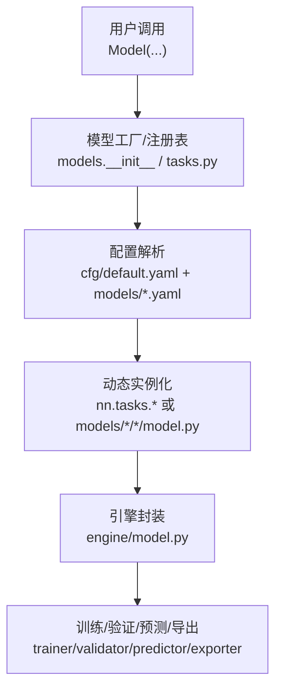
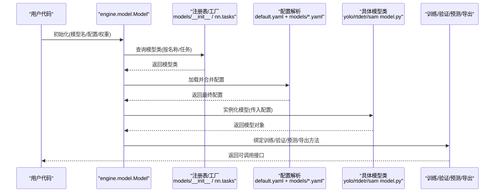
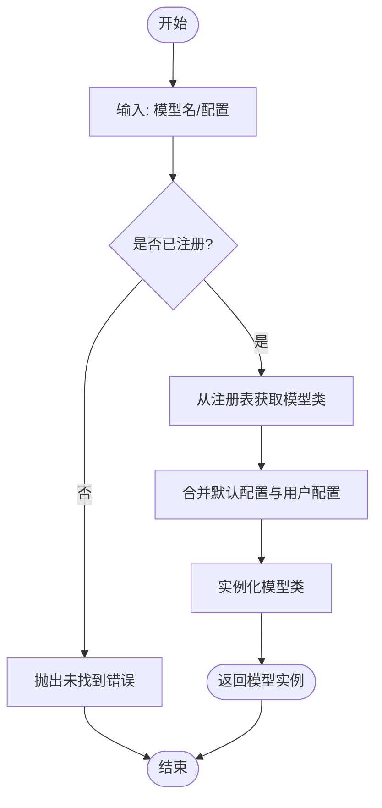
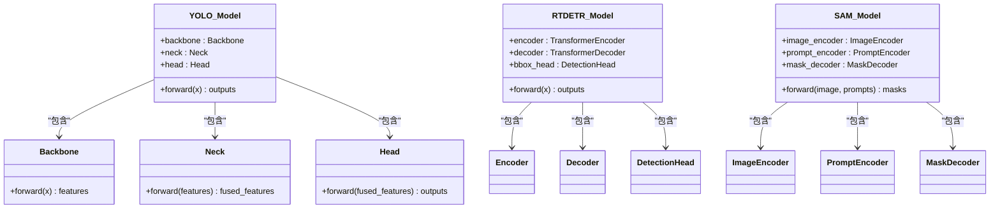
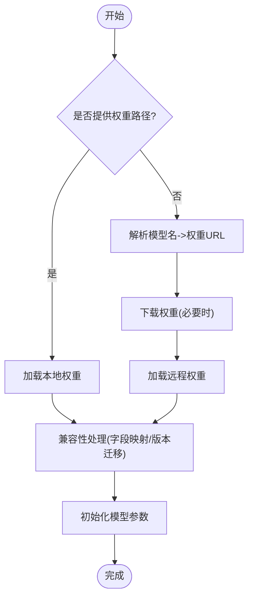
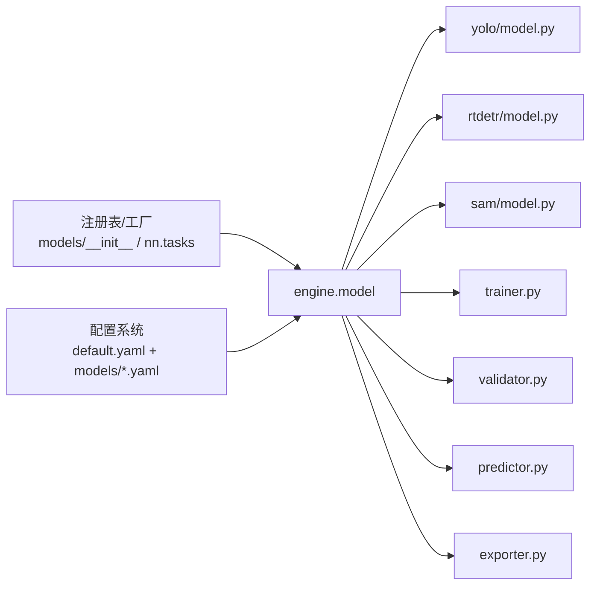

# 模型系统

<cite>
**本文引用的文件**
- [ultralytics/models/__init__.py](file://ultralytics/models/__init__.py)
- [ultralytics/nn/tasks.py](file://ultralytics/nn/tasks.py)
- [ultralytics/nn/mixture_registry.py](file://ultralytics/nn/mixture_registry.py)
- [ultralytics/engine/model.py](file://ultralytics/engine/model.py)
- [ultralytics/engine/trainer.py](file://ultralytics/engine/trainer.py)
- [ultralytics/engine/validator.py](file://ultralytics/engine/validator.py)
- [ultralytics/engine/predictor.py](file://ultralytics/engine/predictor.py)
- [ultralytics/engine/exporter.py](file://ultralytics/engine/exporter.py)
- [ultralytics/utils/checkpoint_compat.py](file://ultralytics/utils/checkpoint_compat.py)
- [ultralytics/utils/downloads.py](file://ultralytics/utils/downloads.py)
- [ultralytics/cfg/default.yaml](file://ultralytics/cfg/default.yaml)
- [ultralytics/cfg/models/yolo/v8.yaml](file://ultralytics/cfg/models/yolo/v8.yaml)
- [ultralytics/cfg/models/yolo/v10.yaml](file://ultralytics/cfg/models/yolo/v10.yaml)
- [ultralytics/cfg/models/yolo/v11.yaml](file://ultralytics/cfg/models/yolo/v11.yaml)
- [ultralytics/cfg/models/yolo/v12.yaml](file://ultralytics/cfg/models/yolo/v12.yaml)
- [ultralytics/cfg/models/rtdetr/rtdetr.yaml](file://ultralytics/cfg/models/rtdetr/rtdetr.yaml)
- [ultralytics/cfg/models/sam/sam.yaml](file://ultralytics/cfg/models/sam/sam.yaml)
- [ultralytics/models/yolo/model.py](file://ultralytics/models/yolo/model.py)
- [ultralytics/models/rtdetr/model.py](file://ultralytics/models/rtdetr/model.py)
- [ultralytics/models/sam/model.py](file://ultralytics/models/sam/model.py)
- [tests/test_model_registry.py](file://tests/test_model_registry.py)
- [tests/test_mixture_config_registry.py](file://tests/test_mixture_config_registry.py)
</cite>

## 目录
1. [简介](#简介)
2. [项目结构](#项目结构)
3. [核心组件](#核心组件)
4. [架构总览](#架构总览)
5. [详细组件分析](#详细组件分析)
6. [依赖关系分析](#依赖关系分析)
7. [性能考量](#性能考量)
8. [故障排查指南](#故障排查指南)
9. [结论](#结论)
10. [附录](#附录)

## 简介
本文件面向YOLO-Master模型的“模型系统”，系统性阐述：
- 支持的模型家族与任务类型（检测、分割、姿态估计、分类、RT-DETR、SAM等）
- 模型注册机制与动态加载原理
- 配置文件结构与语法规范
- 核心架构组件（骨干网络、颈部网络、检测头）
- 权重管理与预训练权重加载机制
- 自定义模型开发指南与最佳实践
- 模型选择建议与性能对比分析方法

## 项目结构
模型系统围绕“配置驱动 + 工厂注册 + 运行时动态实例化”的架构展开，关键路径包括：
- 模型注册表与任务映射：负责将模型名称/任务类型映射到具体实现类
- 配置解析与默认值合并：从YAML配置中解析模型定义并合并默认参数
- 模型工厂与动态加载：根据配置或名称动态构建模型实例
- 引擎集成：训练、验证、预测、导出统一通过Engine接口访问模型

图示来源
- [ultralytics/models/__init__.py](file://ultralytics/models/__init__.py)
- [ultralytics/nn/tasks.py](file://ultralytics/nn/tasks.py)
- [ultralytics/cfg/default.yaml](file://ultralytics/cfg/default.yaml)
- [ultralytics/engine/model.py](file://ultralytics/engine/model.py)

章节来源
- [ultralytics/models/__init__.py](file://ultralytics/models/__init__.py)
- [ultralytics/nn/tasks.py](file://ultralytics/nn/tasks.py)
- [ultralytics/cfg/default.yaml](file://ultralytics/cfg/default.yaml)
- [ultralytics/engine/model.py](file://ultralytics/engine/model.py)

## 核心组件
- 模型注册表与任务映射
  - 提供统一的模型/任务注册入口，支持按名称或任务类型动态获取模型类
  - 维护模型家族（YOLOv8/v10/v11/v12、RT-DETR、SAM等）与其任务能力矩阵
- 配置系统与默认值
  - 以YAML为配置载体，分层合并：全局默认配置 + 模型族配置 + 用户覆盖
  - 提供校验与缺省补全，确保训练/推理/导出流程一致性
- 动态加载与工厂模式
  - 基于注册表在运行时按需导入并实例化具体模型类
  - 支持多后端与多任务变体（检测、分割、姿态、分类等）
- 引擎封装
  - 对外暴露一致的API：train/val/predict/export
  - 内部协调数据流、设备管理、混合精度、分布式等

章节来源
- [ultralytics/nn/tasks.py](file://ultralytics/nn/tasks.py)
- [ultralytics/cfg/default.yaml](file://ultralytics/cfg/default.yaml)
- [ultralytics/engine/model.py](file://ultralytics/engine/model.py)

## 架构总览
下图展示从用户调用到模型实例化的端到端流程，以及各模块的职责边界。

图示来源
- [ultralytics/engine/model.py](file://ultralytics/engine/model.py)
- [ultralytics/models/__init__.py](file://ultralytics/models/__init__.py)
- [ultralytics/nn/tasks.py](file://ultralytics/nn/tasks.py)
- [ultralytics/cfg/default.yaml](file://ultralytics/cfg/default.yaml)
- [ultralytics/models/yolo/model.py](file://ultralytics/models/yolo/model.py)
- [ultralytics/models/rtdetr/model.py](file://ultralytics/models/rtdetr/model.py)
- [ultralytics/models/sam/model.py](file://ultralytics/models/sam/model.py)

## 详细组件分析

### 模型家族与任务支持
- YOLO系列（v8、v10、v11、v12）
  - 任务：检测、分割、姿态估计、分类、旋转框（视具体变体）
  - 典型配置：对应 models/yolo/v8.yaml、v10.yaml、v11.yaml、v12.yaml
- RT-DETR
  - 任务：目标检测（端到端Transformer架构）
  - 配置：rtdetr/rtdetr.yaml
- SAM分割系列
  - 任务：图像分割（提示式/自动标注）
  - 配置：sam/sam.yaml

说明
- 不同版本/尺寸（n/s/m/l/x）通过同一配置模板中的规模参数控制
- 任务能力由模型类与输出头决定，配置中通常包含任务相关超参（如类别数、锚点策略、解码器等）

章节来源
- [ultralytics/cfg/models/yolo/v8.yaml](file://ultralytics/cfg/models/yolo/v8.yaml)
- [ultralytics/cfg/models/yolo/v10.yaml](file://ultralytics/cfg/models/yolo/v10.yaml)
- [ultralytics/cfg/models/yolo/v11.yaml](file://ultralytics/cfg/models/yolo/v11.yaml)
- [ultralytics/cfg/models/yolo/v12.yaml](file://ultralytics/cfg/models/yolo/v12.yaml)
- [ultralytics/cfg/models/rtdetr/rtdetr.yaml](file://ultralytics/cfg/models/rtdetr/rtdetr.yaml)
- [ultralytics/cfg/models/sam/sam.yaml](file://ultralytics/cfg/models/sam/sam.yaml)

### 模型注册机制与动态加载
- 注册表职责
  - 维护“模型名称/任务类型 -> 模型类”的映射
  - 提供按名称或任务查找模型类的API
- 动态加载流程
  - 用户传入模型名或配置后，工厂根据注册表定位具体模型类
  - 结合配置实例化模型，完成前向图构建与参数初始化
- 测试保障
  - 单元测试覆盖注册表可用性、配置解析与实例化正确性

图示来源
- [ultralytics/models/__init__.py](file://ultralytics/models/__init__.py)
- [ultralytics/nn/tasks.py](file://ultralytics/nn/tasks.py)
- [tests/test_model_registry.py](file://tests/test_model_registry.py)

章节来源
- [ultralytics/models/__init__.py](file://ultralytics/models/__init__.py)
- [ultralytics/nn/tasks.py](file://ultralytics/nn/tasks.py)
- [tests/test_model_registry.py](file://tests/test_model_registry.py)

### 配置系统与语法规范
- 配置层级
  - 全局默认：default.yaml
  - 模型族：models/yolo/*.yaml、models/rtdetr/*.yaml、models/sam/*.yaml
  - 用户覆盖：命令行参数或外部YAML
- 关键字段（示例维度，具体以实际YAML为准）
  - 模型规模与通道数（影响骨干/颈部宽度）
  - 任务相关参数（类别数、损失权重、解码器设置）
  - 训练/验证/导出通用参数（学习率、批次大小、优化器、导出格式）
- 合并与校验
  - 先加载默认，再叠加模型族配置，最后应用用户覆盖
  - 缺失字段使用默认值；非法值触发校验错误

章节来源
- [ultralytics/cfg/default.yaml](file://ultralytics/cfg/default.yaml)
- [ultralytics/cfg/models/yolo/v8.yaml](file://ultralytics/cfg/models/yolo/v8.yaml)
- [ultralytics/cfg/models/yolo/v10.yaml](file://ultralytics/cfg/models/yolo/v10.yaml)
- [ultralytics/cfg/models/yolo/v11.yaml](file://ultralytics/cfg/models/yolo/v11.yaml)
- [ultralytics/cfg/models/yolo/v12.yaml](file://ultralytics/cfg/models/yolo/v12.yaml)
- [ultralytics/cfg/models/rtdetr/rtdetr.yaml](file://ultralytics/cfg/models/rtdetr/rtdetr.yaml)
- [ultralytics/cfg/models/sam/sam.yaml](file://ultralytics/cfg/models/sam/sam.yaml)

### 核心架构组件（骨干/颈部/检测头）
- 骨干网络（Backbone）
  - 负责特征提取，常见为卷积/Transformer主干
  - 多尺度特征输出供颈部融合
- 颈部网络（Neck）
  - 进行跨层特征融合（如FPN/PAN），提升小目标与上下文建模
- 检测头（Head）
  - 针对不同任务的输出头：检测框回归+分类、分割掩码、关键点坐标、类别概率等
- 模型类组织
  - yolo/rtdetr/sam各自提供model.py作为入口，组合上述模块并按任务输出

图示来源
- [ultralytics/models/yolo/model.py](file://ultralytics/models/yolo/model.py)
- [ultralytics/models/rtdetr/model.py](file://ultralytics/models/rtdetr/model.py)
- [ultralytics/models/sam/model.py](file://ultralytics/models/sam/model.py)

章节来源
- [ultralytics/models/yolo/model.py](file://ultralytics/models/yolo/model.py)
- [ultralytics/models/rtdetr/model.py](file://ultralytics/models/rtdetr/model.py)
- [ultralytics/models/sam/model.py](file://ultralytics/models/sam/model.py)

### 权重管理与预训练权重加载
- 权重来源
  - 本地路径或远程URL（支持自动下载）
- 加载流程
  - 若指定权重路径则直接加载；否则尝试按模型名匹配官方权重并下载
  - 兼容旧版权重格式（检查点迁移/字段重映射）
- 断点续训与导出
  - 训练保存checkpoint，恢复时仅加载必要字段
  - 导出前校验权重完整性与设备一致性

图示来源
- [ultralytics/engine/model.py](file://ultralytics/engine/model.py)
- [ultralytics/utils/downloads.py](file://ultralytics/utils/downloads.py)
- [ultralytics/utils/checkpoint_compat.py](file://ultralytics/utils/checkpoint_compat.py)

章节来源
- [ultralytics/engine/model.py](file://ultralytics/engine/model.py)
- [ultralytics/utils/downloads.py](file://ultralytics/utils/downloads.py)
- [ultralytics/utils/checkpoint_compat.py](file://ultralytics/utils/checkpoint_compat.py)

### 自定义模型开发指南
- 步骤概览
  1) 新建模型类：继承基础模型基类，实现forward与必要的属性（如任务类型、输出形状）
  2) 注册模型：在注册表中添加“名称 -> 模型类”的映射
  3) 编写配置：在models目录下新增YAML，描述骨干/颈部/头部及任务参数
  4) 集成引擎：确保训练/验证/预测/导出流程能识别新模型
  5) 编写测试：覆盖注册、配置解析、实例化与基本推理
- 最佳实践
  - 保持配置键名稳定，避免破坏向后兼容
  - 对权重字段命名保持一致，便于迁移工具处理
  - 明确任务能力矩阵，避免在不支持的任务上误用
  - 提供最小可用示例与基准脚本

章节来源
- [ultralytics/models/__init__.py](file://ultralytics/models/__init__.py)
- [ultralytics/nn/tasks.py](file://ultralytics/nn/tasks.py)
- [ultralytics/cfg/default.yaml](file://ultralytics/cfg/default.yaml)
- [tests/test_model_registry.py](file://tests/test_model_registry.py)

### 模型选择建议与性能对比
- 选择建议
  - 实时性与精度权衡：小尺寸（n/s）适合边缘部署，大尺寸（l/x）追求更高精度
  - 任务适配：检测优先YOLO/RT-DETR；分割优先SAM；姿态估计选YOLO Pose变体
  - 部署生态：考虑ONNX/TensorRT/OpenVINO等导出链路的成熟度
- 对比方法
  - 使用统一数据集与评测协议，记录mAP/速度/显存占用
  - 关注不同分辨率下的吞吐与延迟
  - 结合业务场景（小目标、遮挡、密集场景）做专项评估

[本节为通用指导，不直接分析具体文件]

## 依赖关系分析
- 组件耦合
  - engine.model依赖注册表与配置解析，解耦了具体模型实现
  - 各模型族（yolo/rtdetr/sam）通过统一接口接入引擎
- 外部依赖
  - 权重下载、检查点兼容、导出链路等由utils与engine.exporter提供

图示来源
- [ultralytics/models/__init__.py](file://ultralytics/models/__init__.py)
- [ultralytics/nn/tasks.py](file://ultralytics/nn/tasks.py)
- [ultralytics/engine/model.py](file://ultralytics/engine/model.py)
- [ultralytics/engine/trainer.py](file://ultralytics/engine/trainer.py)
- [ultralytics/engine/validator.py](file://ultralytics/engine/validator.py)
- [ultralytics/engine/predictor.py](file://ultralytics/engine/predictor.py)
- [ultralytics/engine/exporter.py](file://ultralytics/engine/exporter.py)
- [ultralytics/models/yolo/model.py](file://ultralytics/models/yolo/model.py)
- [ultralytics/models/rtdetr/model.py](file://ultralytics/models/rtdetr/model.py)
- [ultralytics/models/sam/model.py](file://ultralytics/models/sam/model.py)

章节来源
- [ultralytics/engine/model.py](file://ultralytics/engine/model.py)
- [ultralytics/engine/trainer.py](file://ultralytics/engine/trainer.py)
- [ultralytics/engine/validator.py](file://ultralytics/engine/validator.py)
- [ultralytics/engine/predictor.py](file://ultralytics/engine/predictor.py)
- [ultralytics/engine/exporter.py](file://ultralytics/engine/exporter.py)

## 性能考量
- 计算与内存
  - 增大模型规模会线性增加FLOPs与显存；合理选择尺寸与输入分辨率
  - 使用混合精度与算子优化（如TensorRT/OpenVINO）降低延迟
- 数据与批处理
  - 自适应批大小与数据管道并行度，避免I/O瓶颈
- 导出与部署
  - 针对目标平台选择最优导出格式，并进行端到端压测
- 监控与诊断
  - 记录训练曲线、梯度范数、激活分布，定位不稳定因素

[本节为通用指导，不直接分析具体文件]

## 故障排查指南
- 常见问题
  - 模型名未注册：检查注册表映射是否正确
  - 配置缺失字段：确认默认配置与模型族配置是否完整
  - 权重加载失败：核对路径/URL、网络连通性与权重格式兼容性
- 定位手段
  - 启用详细日志，观察实例化与加载阶段报错堆栈
  - 使用最小复现脚本隔离问题（单卡、小batch、简化配置）
  - 借助单元测试用例对照行为差异

章节来源
- [tests/test_model_registry.py](file://tests/test_model_registry.py)
- [tests/test_mixture_config_registry.py](file://tests/test_mixture_config_registry.py)

## 结论
YOLO-Master的模型系统以“配置驱动 + 注册表 + 动态加载”为核心，实现了多模型家族与多任务的统一接入。通过清晰的层次化配置、稳定的注册契约与完善的权重管理，既保证了易用性，也为扩展新模型提供了良好基础。建议在引入新模型时遵循既定规范，完善测试与文档，确保与现有训练/推理/导出链路的无缝集成。

## 附录
- 术语
  - 注册表：维护模型名称/任务到实现类的映射
  - 工厂：根据名称/配置动态创建模型实例
  - 引擎：封装训练/验证/预测/导出的统一接口
- 参考路径
  - 模型入口：ultralytics/models/{yolo,rtdetr,sam}/model.py
  - 注册与任务：ultralytics/models/__init__.py、ultralytics/nn/tasks.py
  - 配置：ultralytics/cfg/default.yaml 与 ultralytics/cfg/models/*
  - 引擎：ultralytics/engine/{model,trainer,validator,predictor,exporter}.py
  - 权重与下载：ultralytics/utils/{downloads,checkpoint_compat}.py