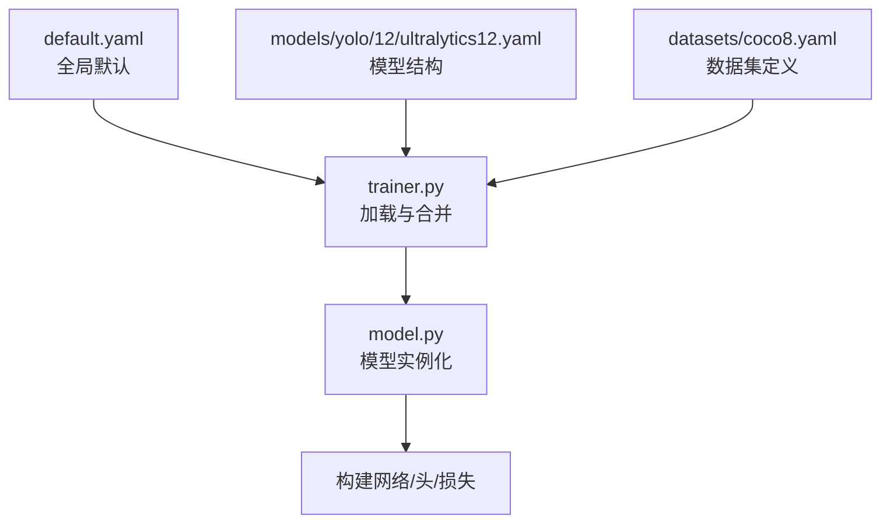
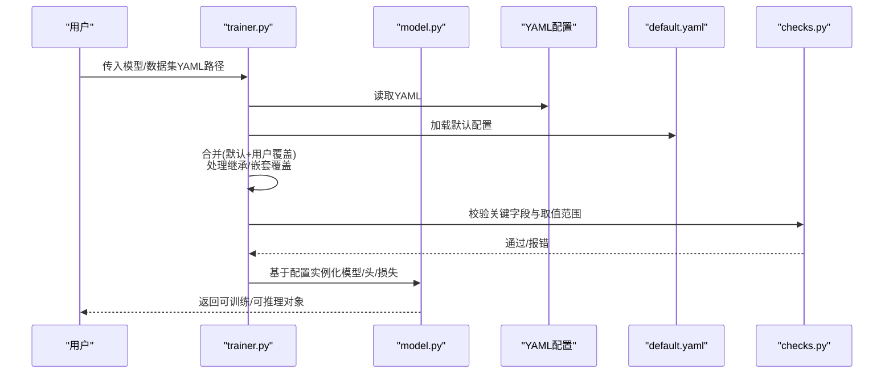
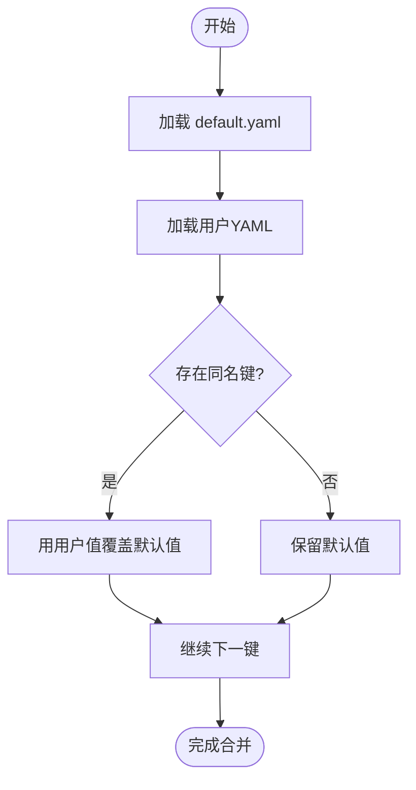
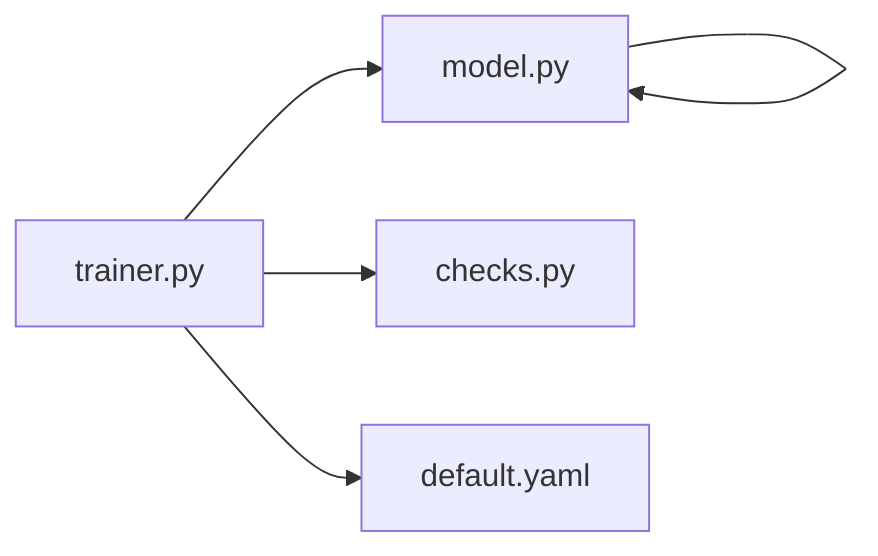

# 模型配置系统

<cite>
**本文引用的文件**
- [ultralytics/cfg/default.yaml](file://ultralytics/cfg/default.yaml)
- [ultralytics/cfg/__init__.py](file://ultralytics/cfg/__init__.py)
- [ultralytics/cfg/models/yolo/12/ultralytics12.yaml](file://ultralytics/cfg/models/yolo/12/ultralytics12.yaml)
- [ultralytics/cfg/datasets/coco8.yaml](file://ultralytics/cfg/datasets/coco8.yaml)
- [ultralytics/engine/trainer.py](file://ultralytics/engine/trainer.py)
- [ultralytics/engine/model.py](file://ultralytics/engine/model.py)
- [ultralytics/utils/checks.py](file://ultralytics/utils/checks.py)
- [examples/lora_examples/yolo_master_lora.yaml](file://examples/lora_examples/yolo_master_lora.yaml)
- [scripts/coco2017.yaml](file://scripts/coco2017.yaml)
</cite>

## 目录
1. [简介](#简介)
2. [项目结构](#项目结构)
3. [核心组件](#核心组件)
4. [架构总览](#架构总览)
5. [详细组件分析](#详细组件分析)
6. [依赖分析](#依赖分析)
7. [性能考虑](#性能考虑)
8. [故障排查指南](#故障排查指南)
9. [结论](#结论)
10. [附录](#附录)

## 简介
本文件面向“模型配置系统”，聚焦于YAML配置文件的语法与层次结构、参数语义（模型结构、训练超参、数据增强等）、继承与覆盖机制、验证与默认值管理、自定义模板与扩展、调试方法与常见问题，以及不同任务类型的标准配置示例与调优建议。文档以仓库中实际存在的配置文件与加载逻辑为依据，帮助读者快速上手并安全地定制训练与推理流程。

## 项目结构
配置系统围绕以下关键位置组织：
- 全局默认配置：位于 ultralytics/cfg/default.yaml，提供通用默认值与常用开关。
- 模型配置：位于 ultralytics/cfg/models/<task>/<name>.yaml，描述网络结构与任务相关参数。
- 数据集配置：位于 ultralytics/cfg/datasets/*.yaml，定义路径、类别数、标签格式等。
- 运行时加载入口：由引擎层在启动时读取并解析配置，合并默认值与用户覆盖。

图表来源
- [ultralytics/cfg/default.yaml](file://ultralytics/cfg/default.yaml)
- [ultralytics/cfg/models/yolo/12/ultralytics12.yaml](file://ultralytics/cfg/models/yolo/12/ultralytics12.yaml)
- [ultralytics/cfg/datasets/coco8.yaml](file://ultralytics/cfg/datasets/coco8.yaml)
- [ultralytics/engine/trainer.py](file://ultralytics/engine/trainer.py)
- [ultralytics/engine/model.py](file://ultralytics/engine/model.py)

章节来源
- [ultralytics/cfg/default.yaml](file://ultralytics/cfg/default.yaml)
- [ultralytics/cfg/models/yolo/12/ultralytics12.yaml](file://ultralytics/cfg/models/yolo/12/ultralytics12.yaml)
- [ultralytics/cfg/datasets/coco8.yaml](file://ultralytics/cfg/datasets/coco8.yaml)
- [ultralytics/engine/trainer.py](file://ultralytics/engine/trainer.py)
- [ultralytics/engine/model.py](file://ultralytics/engine/model.py)

## 核心组件
- 全局默认配置（default.yaml）
  - 作用：为训练、导出、可视化、日志等提供统一默认值；作为所有配置的基线。
  - 典型字段类别：训练循环、优化器、学习率调度、EMA、混合精度、保存策略、可视化、导出选项等。
  - 参考路径：[ultralytics/cfg/default.yaml](file://ultralytics/cfg/default.yaml)

- 模型配置（models/yolo/.../*.yaml）
  - 作用：声明网络深度/宽度、通道数、模块组合、任务头数量与类别数等。
  - 典型字段类别：输入尺寸、类别数、骨干/颈部/头部结构、锚点或无锚设置、损失权重等。
  - 参考路径：[ultralytics/cfg/models/yolo/12/ultralytics12.yaml](file://ultralytics/cfg/models/yolo/12/ultralytics12.yaml)

- 数据集配置（datasets/*.yaml）
  - 作用：指定训练/验证/测试集路径、类别映射、标注格式、数据增强参数等。
  - 典型字段类别：train/val/test路径、nc类别数、names类别名列表、augment增强开关与强度等。
  - 参考路径：[ultralytics/cfg/datasets/coco8.yaml](file://ultralytics/cfg/datasets/coco8.yaml)

- 运行时加载与合并（trainer.py / model.py）
  - 作用：从YAML加载配置，应用默认值，处理继承与覆盖，校验关键字段，构造模型与训练器。
  - 参考路径：
    - [ultralytics/engine/trainer.py](file://ultralytics/engine/trainer.py)
    - [ultralytics/engine/model.py](file://ultralytics/engine/model.py)

章节来源
- [ultralytics/cfg/default.yaml](file://ultralytics/cfg/default.yaml)
- [ultralytics/cfg/models/yolo/12/ultralytics12.yaml](file://ultralytics/cfg/models/yolo/12/ultralytics12.yaml)
- [ultralytics/cfg/datasets/coco8.yaml](file://ultralytics/cfg/datasets/coco8.yaml)
- [ultralytics/engine/trainer.py](file://ultralytics/engine/trainer.py)
- [ultralytics/engine/model.py](file://ultralytics/engine/model.py)

## 架构总览
下图展示了从YAML到可运行模型的端到端流程，包括默认值注入、继承覆盖、校验与实例化。

图表来源
- [ultralytics/engine/trainer.py](file://ultralytics/engine/trainer.py)
- [ultralytics/engine/model.py](file://ultralytics/engine/model.py)
- [ultralytics/cfg/default.yaml](file://ultralytics/cfg/default.yaml)
- [ultralytics/utils/checks.py](file://ultralytics/utils/checks.py)

## 详细组件分析

### YAML 语法与层次结构规范
- 基本语法
  - 使用键值对表示参数，支持字符串、数字、布尔、列表、字典等类型。
  - 缩进表示层级关系，建议使用空格而非制表符。
- 常见层次
  - 顶层：任务级开关（如模式、设备、输出目录）。
  - 模型层：网络结构、通道/深度/宽度、头配置。
  - 训练层：优化器、学习率、批次大小、轮次、EMA、混合精度、保存策略。
  - 数据层：数据集路径、类别信息、增强开关与强度。
  - 导出/可视化层：导出格式、可视化开关、日志后端。
- 参考示例
  - 模型结构示例：[ultralytics/cfg/models/yolo/12/ultralytics12.yaml](file://ultralytics/cfg/models/yolo/12/ultralytics12.yaml)
  - 数据集示例：[ultralytics/cfg/datasets/coco8.yaml](file://ultralytics/cfg/datasets/coco8.yaml)
  - 全局默认示例：[ultralytics/cfg/default.yaml](file://ultralytics/cfg/default.yaml)

章节来源
- [ultralytics/cfg/models/yolo/12/ultralytics12.yaml](file://ultralytics/cfg/models/yolo/12/ultralytics12.yaml)
- [ultralytics/cfg/datasets/coco8.yaml](file://ultralytics/cfg/datasets/coco8.yaml)
- [ultralytics/cfg/default.yaml](file://ultralytics/cfg/default.yaml)

### 配置参数的含义与作用
- 模型结构参数
  - 输入尺寸、类别数、骨干/颈部/头部模块、通道与深度缩放系数、是否使用特定头（检测/分割/姿态等）。
  - 参考：[ultralytics/cfg/models/yolo/12/ultralytics12.yaml](file://ultralytics/cfg/models/yolo/12/ultralytics12.yaml)
- 训练超参数
  - 优化器类型与权重衰减、学习率及调度策略、批次大小、训练轮次、EMA、混合精度、早停、保存间隔等。
  - 参考：[ultralytics/cfg/default.yaml](file://ultralytics/cfg/default.yaml)
- 数据增强配置
  - 随机翻转、仿射变换、MixUp/CutMix、马赛克、色彩抖动、尺度变化等开关与强度。
  - 参考：[ultralytics/cfg/datasets/coco8.yaml](file://ultralytics/cfg/datasets/coco8.yaml)
- 导出与可视化
  - 导出目标格式（ONNX/TensorRT等）、可视化开关、日志记录器选择。
  - 参考：[ultralytics/cfg/default.yaml](file://ultralytics/cfg/default.yaml)

章节来源
- [ultralytics/cfg/models/yolo/12/ultralytics12.yaml](file://ultralytics/cfg/models/yolo/12/ultralytics12.yaml)
- [ultralytics/cfg/default.yaml](file://ultralytics/cfg/default.yaml)
- [ultralytics/cfg/datasets/coco8.yaml](file://ultralytics/cfg/datasets/coco8.yaml)

### 继承与覆盖机制
- 默认值优先注入
  - 系统先加载 default.yaml 的默认配置，再合并用户提供的YAML。
- 覆盖规则
  - 同名键会被用户配置覆盖；嵌套字典按层级合并，未指定的子键保留默认值。
- 多源合并
  - 可同时引入多个YAML（例如模型配置+数据集配置），最终合并为一个完整配置供训练器使用。
- 参考实现
  - 加载与合并逻辑位于 trainer.py；校验逻辑位于 checks.py。
  - 参考路径：
    - [ultralytics/engine/trainer.py](file://ultralytics/engine/trainer.py)
    - [ultralytics/utils/checks.py](file://ultralytics/utils/checks.py)

图表来源
- [ultralytics/engine/trainer.py](file://ultralytics/engine/trainer.py)
- [ultralytics/cfg/default.yaml](file://ultralytics/cfg/default.yaml)

章节来源
- [ultralytics/engine/trainer.py](file://ultralytics/engine/trainer.py)
- [ultralytics/cfg/default.yaml](file://ultralytics/cfg/default.yaml)

### 配置验证系统与默认值管理
- 验证要点
  - 必填字段检查（如数据集路径、类别数、输入尺寸等）。
  - 取值范围与类型校验（如学习率正数、批大小整型且大于0等）。
  - 一致性检查（如类别数与类别名列表长度一致）。
- 默认值管理
  - 未显式设置的字段自动回退至 default.yaml 中的默认值。
  - 某些字段存在条件默认（根据任务类型或硬件环境动态调整）。
- 参考路径
  - [ultralytics/utils/checks.py](file://ultralytics/utils/checks.py)
  - [ultralytics/cfg/default.yaml](file://ultralytics/cfg/default.yaml)

章节来源
- [ultralytics/utils/checks.py](file://ultralytics/utils/checks.py)
- [ultralytics/cfg/default.yaml](file://ultralytics/cfg/default.yaml)

### 编写指南与最佳实践
- 最小可用配置
  - 至少包含：模型YAML（或引用）、数据集YAML（或引用）、必要训练参数（如epochs、batch size）。
  - 参考：
    - [ultralytics/cfg/models/yolo/12/ultralytics12.yaml](file://ultralytics/cfg/models/yolo/12/ultralytics12.yaml)
    - [ultralytics/cfg/datasets/coco8.yaml](file://ultralytics/cfg/datasets/coco8.yaml)
- 命名与可读性
  - 使用清晰的分层键名；将相关参数分组（如optimizer、lr_scheduler、augment）。
- 版本与可复现
  - 固定随机种子、记录配置哈希；避免硬编码绝对路径，尽量使用相对路径或环境变量。
- 渐进式变更
  - 先使用默认配置，再逐步覆盖少量关键参数，便于定位问题。
- 参考示例
  - LoRA微调配置示例：[examples/lora_examples/yolo_master_lora.yaml](file://examples/lora_examples/yolo_master_lora.yaml)
  - COCO2017数据集配置示例：[scripts/coco2017.yaml](file://scripts/coco2017.yaml)

章节来源
- [ultralytics/cfg/models/yolo/12/ultralytics12.yaml](file://ultralytics/cfg/models/yolo/12/ultralytics12.yaml)
- [ultralytics/cfg/datasets/coco8.yaml](file://ultralytics/cfg/datasets/coco8.yaml)
- [examples/lora_examples/yolo_master_lora.yaml](file://examples/lora_examples/yolo_master_lora.yaml)
- [scripts/coco2017.yaml](file://scripts/coco2017.yaml)

### 创建自定义配置模板与扩展配置选项
- 模板设计
  - 基于现有模型/数据集YAML复制为新模板，仅修改差异部分。
  - 将通用参数下沉到default.yaml，减少重复。
- 扩展选项
  - 新增键需同步更新校验逻辑（checks.py）与默认值（default.yaml）。
  - 若影响模型构建，需在model.py中增加对应分支处理。
- 参考路径
  - [ultralytics/cfg/default.yaml](file://ultralytics/cfg/default.yaml)
  - [ultralytics/utils/checks.py](file://ultralytics/utils/checks.py)
  - [ultralytics/engine/model.py](file://ultralytics/engine/model.py)

章节来源
- [ultralytics/cfg/default.yaml](file://ultralytics/cfg/default.yaml)
- [ultralytics/utils/checks.py](file://ultralytics/utils/checks.py)
- [ultralytics/engine/model.py](file://ultralytics/engine/model.py)

### 调试方法与常见问题
- 打印最终配置
  - 在训练前输出合并后的配置，确认覆盖是否符合预期。
- 分段验证
  - 先跑最小数据集（如coco8.yaml）验证配置正确性，再迁移到大数据集。
- 常见错误
  - 类别数与类别名不一致：检查数据集YAML的nc与names。
  - 路径不存在：确保train/val路径有效且权限正确。
  - 数值越界：学习率、权重衰减、批大小等需为正数且合理。
- 参考路径
  - [ultralytics/utils/checks.py](file://ultralytics/utils/checks.py)
  - [ultralytics/cfg/datasets/coco8.yaml](file://ultralytics/cfg/datasets/coco8.yaml)

章节来源
- [ultralytics/utils/checks.py](file://ultralytics/utils/checks.py)
- [ultralytics/cfg/datasets/coco8.yaml](file://ultralytics/cfg/datasets/coco8.yaml)

### 不同任务类型的标准配置示例与调优建议
- 目标检测（YOLO）
  - 使用 models/yolo/* 下的标准配置；结合 datasets/coco*.yaml 进行训练。
  - 调优建议：先调学习率与批次大小，再调增强强度与损失权重。
  - 参考：
    - [ultralytics/cfg/models/yolo/12/ultralytics12.yaml](file://ultralytics/cfg/models/yolo/12/ultralytics12.yaml)
    - [scripts/coco2017.yaml](file://scripts/coco2017.yaml)
- 实例分割/姿态估计/旋转框
  - 选择对应任务的模型YAML，调整头与损失相关参数。
  - 参考：同目录下其他任务YAML（结构与检测类似，头与损失不同）。
- 微调与PEFT（LoRA）
  - 使用 examples/lora_examples/*.yaml 作为起点，冻结主干，仅训练适配器。
  - 参考：[examples/lora_examples/yolo_master_lora.yaml](file://examples/lora_examples/yolo_master_lora.yaml)

章节来源
- [ultralytics/cfg/models/yolo/12/ultralytics12.yaml](file://ultralytics/cfg/models/yolo/12/ultralytics12.yaml)
- [scripts/coco2017.yaml](file://scripts/coco2017.yaml)
- [examples/lora_examples/yolo_master_lora.yaml](file://examples/lora_examples/yolo_master_lora.yaml)

## 依赖分析
- 组件耦合
  - trainer.py 负责加载与合并配置，并驱动 model.py 构建模型。
  - checks.py 提供校验能力，default.yaml 提供默认值。
- 外部依赖
  - YAML解析库（标准库或第三方）；路径与IO操作；可选的分布式/设备探测工具。
- 潜在风险
  - 循环依赖：应避免在配置加载阶段触发模型构建。
  - 配置漂移：新增字段需同步更新校验与默认值，防止隐式行为。

图表来源
- [ultralytics/engine/trainer.py](file://ultralytics/engine/trainer.py)
- [ultralytics/engine/model.py](file://ultralytics/engine/model.py)
- [ultralytics/utils/checks.py](file://ultralytics/utils/checks.py)
- [ultralytics/cfg/default.yaml](file://ultralytics/cfg/default.yaml)

章节来源
- [ultralytics/engine/trainer.py](file://ultralytics/engine/trainer.py)
- [ultralytics/engine/model.py](file://ultralytics/engine/model.py)
- [ultralytics/utils/checks.py](file://ultralytics/utils/checks.py)
- [ultralytics/cfg/default.yaml](file://ultralytics/cfg/default.yaml)

## 性能考虑
- 批大小与内存
  - 增大批大小可提升吞吐但占用更多显存；结合梯度累积与混合精度平衡。
- 数据增强
  - 强增强可能降低收敛速度，可在预热后启用或采用渐进增强。
- 学习率与调度
  - 使用余弦退火或线性warmup；根据批大小按比例缩放学习率。
- 保存与日志
  - 合理设置保存间隔与最大保留数，避免磁盘压力。

## 故障排查指南
- 无法加载YAML
  - 检查路径与权限；确认YAML语法无误（缩进、引号、特殊字符）。
- 校验失败
  - 查看报错提示，核对必填字段与取值范围；必要时在checks.py中补充更明确的错误信息。
- 训练崩溃
  - 缩小数据集与模型规模复现；逐步关闭增强与高级特性定位问题。
- 参考路径
  - [ultralytics/utils/checks.py](file://ultralytics/utils/checks.py)
  - [ultralytics/cfg/datasets/coco8.yaml](file://ultralytics/cfg/datasets/coco8.yaml)

章节来源
- [ultralytics/utils/checks.py](file://ultralytics/utils/checks.py)
- [ultralytics/cfg/datasets/coco8.yaml](file://ultralytics/cfg/datasets/coco8.yaml)

## 结论
本配置系统以default.yaml为基线，通过分层合并与严格校验，实现了灵活而稳健的配置管理。遵循本文档的编写指南与最佳实践，可以快速搭建稳定可复现的训练流程，并在需要时安全地扩展新选项与模板。

## 附录
- 常用参考配置
  - 模型结构：[ultralytics/cfg/models/yolo/12/ultralytics12.yaml](file://ultralytics/cfg/models/yolo/12/ultralytics12.yaml)
  - 数据集：[ultralytics/cfg/datasets/coco8.yaml](file://ultralytics/cfg/datasets/coco8.yaml)、[scripts/coco2017.yaml](file://scripts/coco2017.yaml)
  - 全局默认：[ultralytics/cfg/default.yaml](file://ultralytics/cfg/default.yaml)
  - LoRA示例：[examples/lora_examples/yolo_master_lora.yaml](file://examples/lora_examples/yolo_master_lora.yaml)