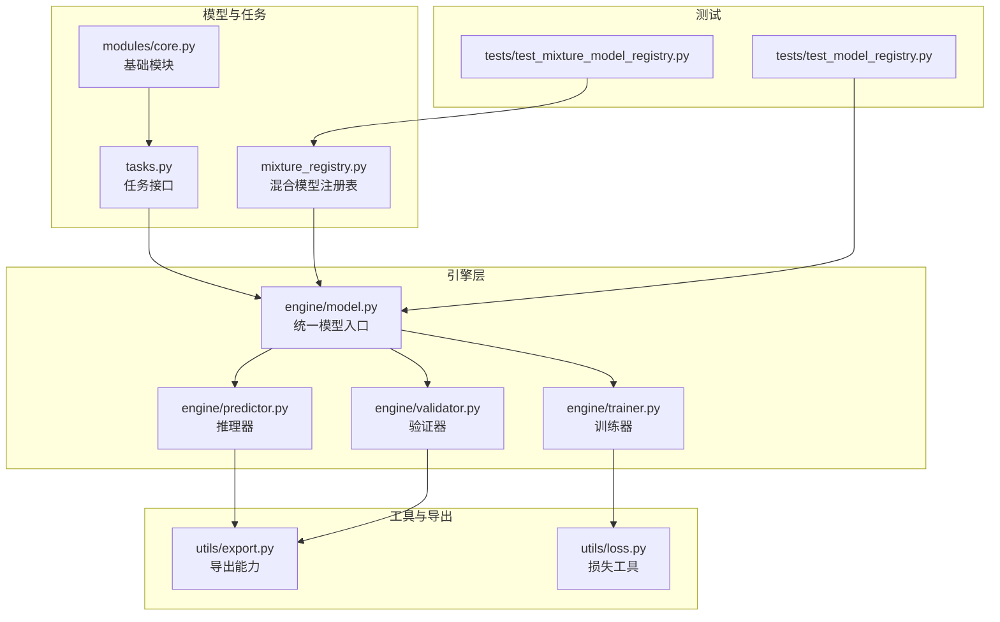
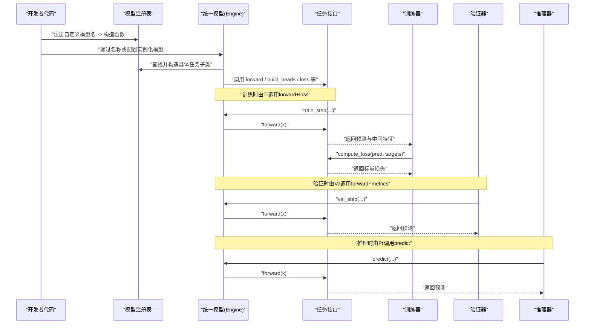
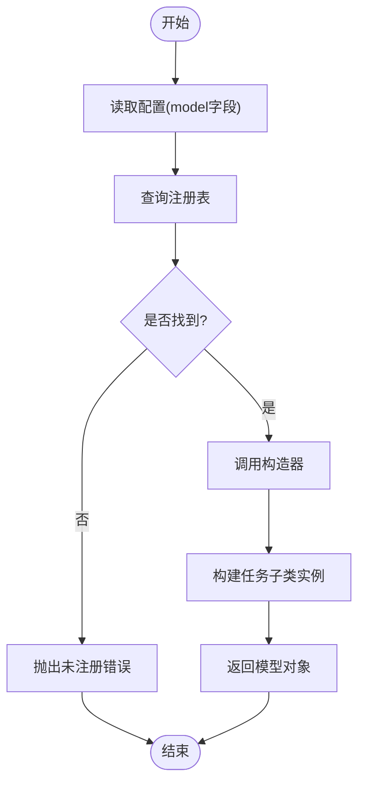
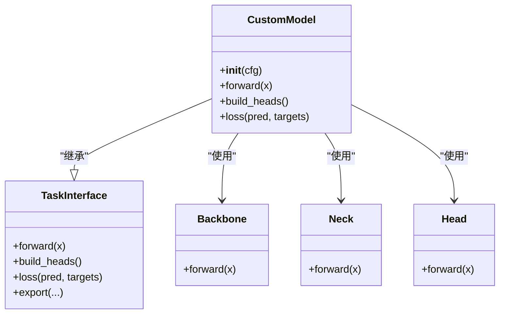
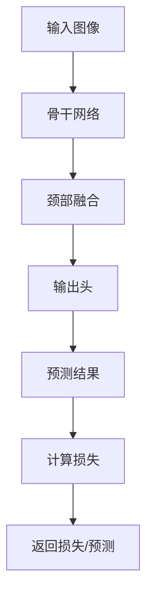
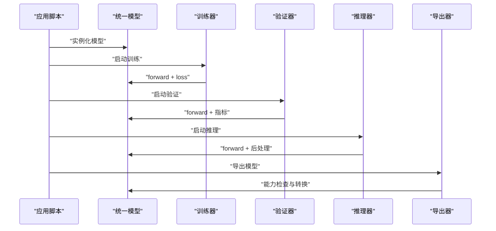
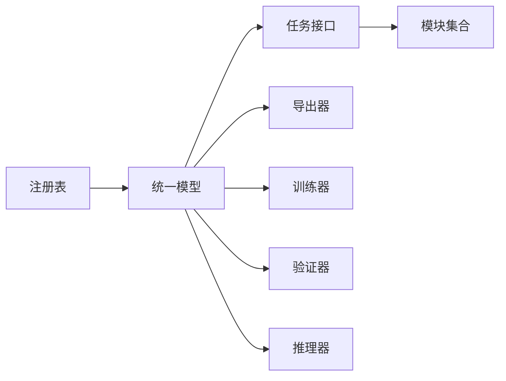

# 自定义模型开发

<cite>
**本文引用的文件**
- [README.md](file://README.md)
- [ultralytics/models/__init__.py](file://ultralytics/models/__init__.py)
- [ultralytics/nn/mixture_registry.py](file://ultralytics/nn/mixture_registry.py)
- [ultralytics/nn/tasks.py](file://ultralytics/nn/tasks.py)
- [ultralytics/engine/model.py](file://ultralytics/engine/model.py)
- [ultralytics/engine/trainer.py](file://ultralytics/engine/trainer.py)
- [ultralytics/engine/predictor.py](file://ultralytics/engine/predictor.py)
- [ultralytics/engine/validator.py](file://ultralytics/engine/validator.py)
- [ultralytics/nn/modules/core.py](file://ultralytics/nn/modules/core.py)
- [ultralytics/utils/export.py](file://ultralytics/utils/export.py)
- [ultralytics/utils/loss.py](file://ultralytics/utils/loss.py)
- [tests/test_model_registry.py](file://tests/test_model_registry.py)
- [tests/test_mixture_model_registry.py](file://tests/test_mixture_model_registry.py)
</cite>

## 目录
1. [简介](#简介)
2. [项目结构](#项目结构)
3. [核心组件](#核心组件)
4. [架构总览](#架构总览)
5. [详细组件分析](#详细组件分析)
6. [依赖关系分析](#依赖关系分析)
7. [性能考虑](#性能考虑)
8. [故障排查指南](#故障排查指南)
9. [结论](#结论)
10. [附录](#附录)

## 简介
本指南面向希望从零开始实现并集成“自定义模型类型”的开发者。内容覆盖：
- 模型类定义、前向传播与损失函数实现要点
- 模型注册机制与动态加载原理
- 新网络模块与自定义层的集成方式
- 从原型到生产的完整工作流
- 测试与验证最佳实践
- 与现有训练/推理框架的集成方法
- 性能优化与内存管理策略
- 可复用的模板与示例路径

## 项目结构
本项目采用分层组织：
- 模型与任务抽象位于 ultralytics/nn 下，包含任务接口、混合模型注册表等
- 引擎层（训练/验证/预测）位于 ultralytics/engine 下，负责生命周期编排
- 工具与导出能力位于 ultralytics/utils 下
- 配置与默认模型在 ultralytics/cfg 下
- 测试用例位于 tests 下，覆盖注册、兼容性、数值稳定性等

图表来源
- [ultralytics/nn/tasks.py](file://ultralytics/nn/tasks.py)
- [ultralytics/nn/mixture_registry.py](file://ultralytics/nn/mixture_registry.py)
- [ultralytics/nn/modules/core.py](file://ultralytics/nn/modules/core.py)
- [ultralytics/engine/model.py](file://ultralytics/engine/model.py)
- [ultralytics/engine/trainer.py](file://ultralytics/engine/trainer.py)
- [ultralytics/engine/predictor.py](file://ultralytics/engine/predictor.py)
- [ultralytics/engine/validator.py](file://ultralytics/engine/validator.py)
- [ultralytics/utils/export.py](file://ultralytics/utils/export.py)
- [ultralytics/utils/loss.py](file://ultralytics/utils/loss.py)
- [tests/test_model_registry.py](file://tests/test_model_registry.py)
- [tests/test_mixture_model_registry.py](file://tests/test_mixture_model_registry.py)

章节来源
- [README.md](file://README.md)

## 核心组件
- 任务接口与基类：提供统一的 forward、头构建、损失组装、导出钩子等契约，确保不同任务（检测、分割、姿态等）一致接入引擎。
- 模型注册表：集中维护模型名称到构造函数的映射，支持按名称动态实例化，便于 YAML 配置驱动创建。
- 引擎模型封装：统一处理权重加载、设备放置、导出开关、训练/验证/推理流程调度。
- 训练/验证/推理器：分别负责参数更新、指标统计、结果后处理与可视化。
- 导出与损失工具：为 ONNX/TorchScript 等目标提供能力矩阵与兼容检查；提供常用损失组合与辅助函数。

章节来源
- [ultralytics/nn/tasks.py](file://ultralytics/nn/tasks.py)
- [ultralytics/nn/mixture_registry.py](file://ultralytics/nn/mixture_registry.py)
- [ultralytics/engine/model.py](file://ultralytics/engine/model.py)
- [ultralytics/engine/trainer.py](file://ultralytics/engine/trainer.py)
- [ultralytics/engine/predictor.py](file://ultralytics/engine/predictor.py)
- [ultralytics/engine/validator.py](file://ultralytics/engine/validator.py)
- [ultralytics/utils/export.py](file://ultralytics/utils/export.py)
- [ultralytics/utils/loss.py](file://ultralytics/utils/loss.py)

## 架构总览
下图展示了“自定义模型”从注册到被引擎调用的端到端路径。

图表来源
- [ultralytics/nn/mixture_registry.py](file://ultralytics/nn/mixture_registry.py)
- [ultralytics/nn/tasks.py](file://ultralytics/nn/tasks.py)
- [ultralytics/engine/model.py](file://ultralytics/engine/model.py)
- [ultralytics/engine/trainer.py](file://ultralytics/engine/trainer.py)
- [ultralytics/engine/validator.py](file://ultralytics/engine/validator.py)
- [ultralytics/engine/predictor.py](file://ultralytics/engine/predictor.py)

## 详细组件分析

### 模型注册与动态加载
- 注册表职责：维护“模型名 -> 构造器”的映射，供统一模型入口按名称解析并实例化。
- 典型流程：
  - 在模块初始化时完成注册
  - 统一模型根据配置中的 model 字段查找对应构造器
  - 构造器内部再实例化具体任务子类（如检测/分割/姿态等）
- 扩展点：新增模型只需在注册表中登记，并在任务接口中实现相应逻辑。

图表来源
- [ultralytics/nn/mixture_registry.py](file://ultralytics/nn/mixture_registry.py)
- [ultralytics/engine/model.py](file://ultralytics/engine/model.py)

章节来源
- [ultralytics/nn/mixture_registry.py](file://ultralytics/nn/mixture_registry.py)
- [ultralytics/engine/model.py](file://ultralytics/engine/model.py)
- [tests/test_mixture_model_registry.py](file://tests/test_mixture_model_registry.py)

### 任务接口与模型类定义
- 任务接口约定：
  - forward：接收输入张量，返回预测结果与可选中间表示
  - build_heads：根据任务类型构建输出头（分类/回归/掩码等）
  - loss：将预测与标签组合成损失项，支持多任务加权
  - export：声明支持的导出后端与约束
- 自定义模型类建议：
  - 继承任务接口基类
  - 在 __init__ 中声明骨干、颈部、头部及可学习参数
  - 在 forward 中串联骨干/颈部/头部，必要时保留中间特征用于损失或调试
  - 在 loss 中实现任务相关损失（如分类交叉熵、边界框回归、掩码 Dice 等）

图表来源
- [ultralytics/nn/tasks.py](file://ultralytics/nn/tasks.py)
- [ultralytics/nn/modules/core.py](file://ultralytics/nn/modules/core.py)

章节来源
- [ultralytics/nn/tasks.py](file://ultralytics/nn/tasks.py)
- [ultralytics/nn/modules/core.py](file://ultralytics/nn/modules/core.py)

### 前向传播与损失函数实现
- 前向传播：
  - 数据流：输入 -> 骨干提取特征 -> 颈部融合 -> 头部解码 -> 预测
  - 注意形状与通道对齐，避免广播陷阱
  - 对大尺寸图像可采用分块或多尺度策略
- 损失函数：
  - 分类：交叉熵/焦点损失
  - 定位：GIoU/CIoU/DIoU
  - 分割：Dice/BCE 组合
  - 多任务：加权求和，注意梯度尺度平衡
  - 可利用 utils/loss 提供的通用组件进行组合

图表来源
- [ultralytics/nn/tasks.py](file://ultralytics/nn/tasks.py)
- [ultralytics/utils/loss.py](file://ultralytics/utils/loss.py)

章节来源
- [ultralytics/nn/tasks.py](file://ultralytics/nn/tasks.py)
- [ultralytics/utils/loss.py](file://ultralytics/utils/loss.py)

### 集成新的网络模块与自定义层
- 模块设计原则：
  - 单一职责，输入输出形状明确
  - 可配置化（通道数、扩张率、注意力头数等）
  - 与 torch.nn.Module 生态兼容
- 集成步骤：
  - 在 modules 目录下实现自定义层
  - 在任务或模型中按需引用
  - 若涉及导出，需在 export 能力矩阵中声明支持情况
- 注意事项：
  - 避免不可导操作
  - 控制显存峰值（复用中间变量、及时释放）
  - 保证算子在目标后端可用（ONNX/TensorRT/OpenVINO 等）

章节来源
- [ultralytics/nn/modules/core.py](file://ultralytics/nn/modules/core.py)
- [ultralytics/utils/export.py](file://ultralytics/utils/export.py)

### 与训练/推理框架的集成
- 训练：
  - 通过统一模型入口实例化后交由 Trainer 管理
  - 训练循环自动调用 forward 与 loss，并进行反向传播与优化器更新
- 验证：
  - Validator 调用 forward 并累积指标（如 mAP、精度、召回等）
- 推理：
  - Predictor 负责预处理、前向、后处理（NMS、阈值过滤、可视化）
- 导出：
  - Exporter 根据能力矩阵生成目标格式，失败时回退或报错

图表来源
- [ultralytics/engine/model.py](file://ultralytics/engine/model.py)
- [ultralytics/engine/trainer.py](file://ultralytics/engine/trainer.py)
- [ultralytics/engine/validator.py](file://ultralytics/engine/validator.py)
- [ultralytics/engine/predictor.py](file://ultralytics/engine/predictor.py)
- [ultralytics/utils/export.py](file://ultralytics/utils/export.py)

章节来源
- [ultralytics/engine/model.py](file://ultralytics/engine/model.py)
- [ultralytics/engine/trainer.py](file://ultralytics/engine/trainer.py)
- [ultralytics/engine/validator.py](file://ultralytics/engine/validator.py)
- [ultralytics/engine/predictor.py](file://ultralytics/engine/predictor.py)
- [ultralytics/utils/export.py](file://ultralytics/utils/export.py)

### 模型测试与验证最佳实践
- 单元测试：
  - 注册表：校验名称唯一性、构造成功、默认参数正确
  - 任务接口：校验 forward 形状、loss 可导、导出能力声明
  - 数值稳定性：小批量、极端输入、NaN/Inf 检测
- 集成测试：
  - 端到端训练/验证/推理链路
  - 跨后端导出一致性（PyTorch vs ONNX/TorchScript）
- 基准与回归：
  - 固定随机种子，记录关键指标与耗时
  - 变更前后对比，设置门限告警

章节来源
- [tests/test_model_registry.py](file://tests/test_model_registry.py)
- [tests/test_mixture_model_registry.py](file://tests/test_mixture_model_registry.py)

## 依赖关系分析
- 松耦合：
  - 注册表与任务解耦，新增模型无需改动引擎
  - 任务接口屏蔽具体实现差异，引擎仅依赖契约
- 内聚性：
  - 任务类内部聚合骨干/颈部/头部，减少外部拼装复杂度
- 潜在风险：
  - 注册表命名冲突
  - 导出能力不一致导致运行时异常
  - 自定义层在后端不支持

图表来源
- [ultralytics/nn/mixture_registry.py](file://ultralytics/nn/mixture_registry.py)
- [ultralytics/nn/tasks.py](file://ultralytics/nn/tasks.py)
- [ultralytics/engine/model.py](file://ultralytics/engine/model.py)
- [ultralytics/utils/export.py](file://ultralytics/utils/export.py)

章节来源
- [ultralytics/nn/mixture_registry.py](file://ultralytics/nn/mixture_registry.py)
- [ultralytics/nn/tasks.py](file://ultralytics/nn/tasks.py)
- [ultralytics/engine/model.py](file://ultralytics/engine/model.py)
- [ultralytics/utils/export.py](file://ultralytics/utils/export.py)

## 性能考虑
- 计算图与算子：
  - 优先使用内核友好的算子，避免频繁 Python 分支
  - 合并冗余操作（批归一化融合、激活重排）
- 内存管理：
  - 及时释放中间张量，避免不必要的副本
  - 使用梯度检查点（在极深网络场景）
- 并行与分布式：
  - 合理设置 batch size 与梯度累积步数
  - DDP 下关注通信开销与同步点
- 导出优化：
  - 选择合适后端（TensorRT/OpenVINO/TFLite），遵循能力矩阵
  - 量化与剪枝需配合校准集与验证集评估

[本节为通用指导，不直接分析具体文件]

## 故障排查指南
- 常见问题：
  - 模型未注册：检查注册表键名与导入时机
  - 形状不匹配：打印各阶段张量形状，核对卷积/全连接维度
  - 导出失败：对照能力矩阵，替换不支持的算子
  - NaN/Inf：检查学习率、损失数值范围、梯度裁剪
- 定位手段：
  - 启用最小复现脚本与固定随机种子
  - 逐步注释法缩小问题范围
  - 使用导出器预检功能提前发现兼容性问题

章节来源
- [ultralytics/utils/export.py](file://ultralytics/utils/export.py)
- [tests/test_model_registry.py](file://tests/test_model_registry.py)
- [tests/test_mixture_model_registry.py](file://tests/test_mixture_model_registry.py)

## 结论
通过遵循任务接口契约、利用注册表进行动态加载、在引擎层统一编排训练/验证/推理/导出流程，开发者可以高效地实现并集成自定义模型。结合完善的测试与性能优化策略，可将自定义模型从原型快速推进至生产部署。

[本节为总结性内容，不直接分析具体文件]

## 附录

### 从零到一的开发清单
- 设计任务接口实现
  - 定义骨干/颈部/头部结构
  - 实现 forward、build_heads、loss、export
- 注册模型
  - 在注册表中登记模型名与构造器
- 编写测试
  - 注册表、任务接口、导出能力、数值稳定性
- 训练与验证
  - 使用 Trainer/Validator 进行端到端验证
- 推理与导出
  - 使用 Predictor 进行推理
  - 使用 Exporter 生成目标格式
- 性能优化
  - 算子替换、内存优化、量化/剪枝

[本节为流程性说明，不直接分析具体文件]