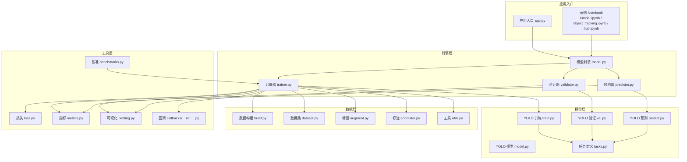
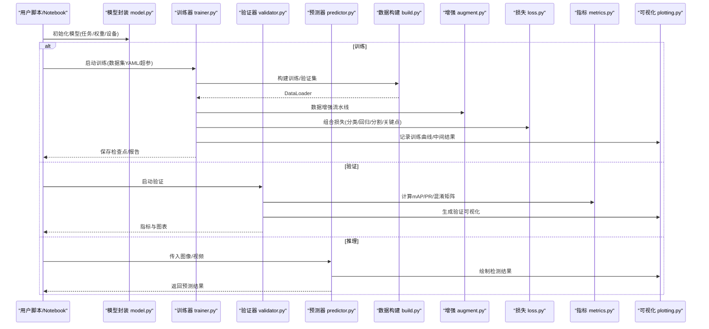
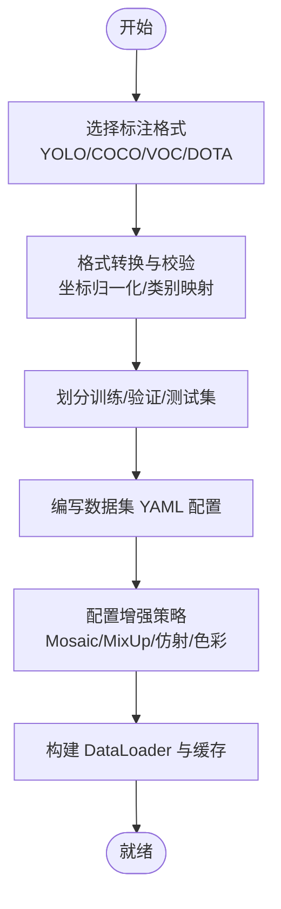
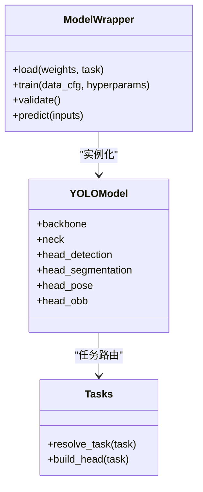
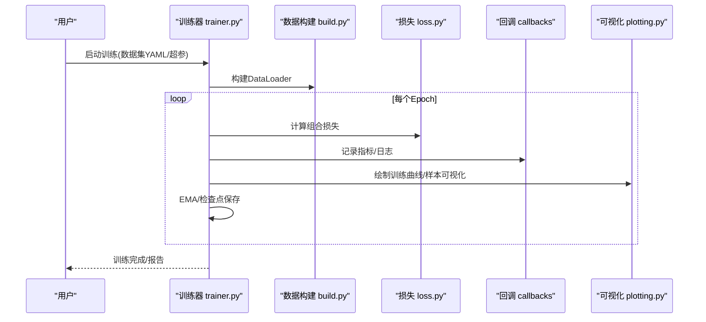
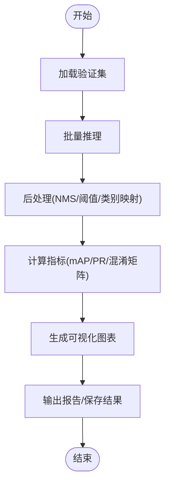
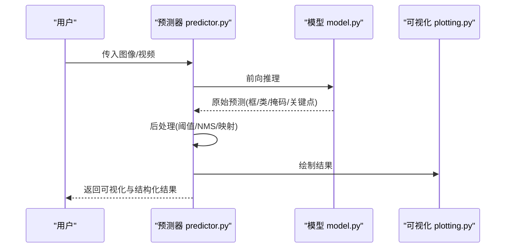
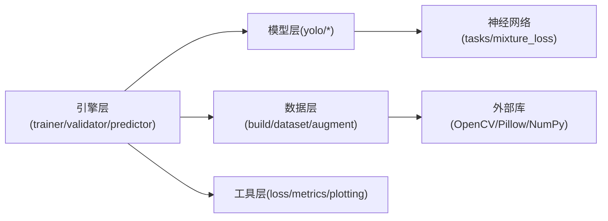

# 基础教程

<cite>
**本文引用的文件**
- [README.md](file://README.md)
- [app.py](file://app.py)
- [ultralytics/__init__.py](file://ultralytics/__init__.py)
- [ultralytics/engine/trainer.py](file://ultralytics/engine/trainer.py)
- [ultralytics/engine/validator.py](file://ultralytics/engine/validator.py)
- [ultralytics/engine/predictor.py](file://ultralytics/engine/predictor.py)
- [ultralytics/engine/model.py](file://ultralytics/engine/model.py)
- [ultralytics/data/build.py](file://ultralytics/data/build.py)
- [ultralytics/data/dataset.py](file://ultralytics/data/dataset.py)
- [ultralytics/data/augment.py](file://ultralytics/data/augment.py)
- [ultralytics/data/annotator.py](file://ultralytics/data/annotator.py)
- [ultralytics/data/utils.py](file://ultralytics/data/utils.py)
- [ultralytics/models/yolo/model.py](file://ultralytics/models/yolo/model.py)
- [ultralytics/models/yolo/train.py](file://ultralytics/models/yolo/train.py)
- [ultralytics/models/yolo/val.py](file://ultralytics/models/yolo/val.py)
- [ultralytics/models/yolo/predict.py](file://ultralytics/models/yolo/predict.py)
- [ultralytics/nn/tasks.py](file://ultralytics/nn/tasks.py)
- [ultralytics/nn/mixture_loss.py](file://ultralytics/nn/mixture_loss.py)
- [ultralytics/utils/loss.py](file://ultralytics/utils/loss.py)
- [ultralytics/utils/metrics.py](file://ultralytics/utils/metrics.py)
- [ultralytics/utils/plotting.py](file://ultralytics/utils/plotting.py)
- [ultralytics/utils/callbacks/__init__.py](file://ultralytics/utils/callbacks/__init__.py)
- [ultralytics/utils/benchmarks.py](file://ultralytics/utils/benchmarks.py)
- [ultralytics/cfg/default.yaml](file://ultralytics/cfg/default.yaml)
- [examples/tutorial.ipynb](file://examples/tutorial.ipynb)
- [examples/object_tracking.ipynb](file://examples/object_tracking.ipynb)
- [examples/hub.ipynb](file://examples/hub.ipynb)
- [scripts/smoke_test_coco2017.py](file://scripts/smoke_test_coco2017.py)
- [scripts/quick_train_verify.py](file://scripts/quick_train_verify.py)
</cite>

## 目录
1. [简介](#简介)
2. [项目结构](#项目结构)
3. [核心组件](#核心组件)
4. [架构总览](#架构总览)
5. [详细组件分析](#详细组件分析)
6. [依赖关系分析](#依赖关系分析)
7. [性能与训练监控](#性能与训练监控)
8. [常见问题排查](#常见问题排查)
9. [结论](#结论)
10. [附录：任务与数据格式速查](#附录任务与数据格式速查)

## 简介
本教程面向初学者与工程实践者，系统讲解在 YOLO-Master 中完成目标检测、实例分割、姿态估计、旋转目标检测等任务的端到端流程。内容覆盖数据准备、模型选择、训练配置、结果评估、可视化与调试、性能监控与训练过程分析、以及超参数调优策略与最佳实践。读者可据此快速上手并构建稳定可靠的视觉任务流水线。

## 项目结构
YOLO-Master 采用“引擎 + 模型 + 数据 + 工具”的分层组织方式：
- 引擎层：训练器、验证器、预测器统一封装推理与优化流程
- 模型层：按任务（检测、分割、姿态、旋转）提供专用实现
- 数据层：数据集加载、增强、标注解析与转换
- 工具层：指标计算、可视化、基准测试、回调与日志

图表来源
- [app.py:1-200](file://app.py#L1-L200)
- [ultralytics/engine/trainer.py:1-200](file://ultralytics/engine/trainer.py#L1-L200)
- [ultralytics/engine/validator.py:1-200](file://ultralytics/engine/validator.py#L1-L200)
- [ultralytics/engine/predictor.py:1-200](file://ultralytics/engine/predictor.py#L1-L200)
- [ultralytics/engine/model.py:1-200](file://ultralytics/engine/model.py#L1-L200)
- [ultralytics/models/yolo/model.py:1-200](file://ultralytics/models/yolo/model.py#L1-L200)
- [ultralytics/models/yolo/train.py:1-200](file://ultralytics/models/yolo/train.py#L1-L200)
- [ultralytics/models/yolo/val.py:1-200](file://ultralytics/models/yolo/val.py#L1-L200)
- [ultralytics/models/yolo/predict.py:1-200](file://ultralytics/models/yolo/predict.py#L1-L200)
- [ultralytics/nn/tasks.py:1-200](file://ultralytics/nn/tasks.py#L1-L200)
- [ultralytics/data/build.py:1-200](file://ultralytics/data/build.py#L1-L200)
- [ultralytics/data/dataset.py:1-200](file://ultralytics/data/dataset.py#L1-L200)
- [ultralytics/data/augment.py:1-200](file://ultralytics/data/augment.py#L1-L200)
- [ultralytics/data/annotator.py:1-200](file://ultralytics/data/annotator.py#L1-L200)
- [ultralytics/data/utils.py:1-200](file://ultralytics/data/utils.py#L1-L200)
- [ultralytics/utils/loss.py:1-200](file://ultralytics/utils/loss.py#L1-L200)
- [ultralytics/utils/metrics.py:1-200](file://ultralytics/utils/metrics.py#L1-L200)
- [ultralytics/utils/plotting.py:1-200](file://ultralytics/utils/plotting.py#L1-L200)
- [ultralytics/utils/callbacks/__init__.py:1-200](file://ultralytics/utils/callbacks/__init__.py#L1-L200)
- [ultralytics/utils/benchmarks.py:1-200](file://ultralytics/utils/benchmarks.py#L1-L200)

章节来源
- [README.md:1-200](file://README.md#L1-L200)
- [app.py:1-200](file://app.py#L1-L200)
- [ultralytics/__init__.py:1-200](file://ultralytics/__init__.py#L1-L200)

## 核心组件
- 模型封装与任务路由
  - 通过高层 API 自动识别任务类型（检测、分割、姿态、旋转），并加载对应模型与头结构
  - 支持多后端与导出能力，便于部署
- 训练器与验证器
  - 训练器负责数据构建、优化器与学习率调度、损失组合、EMA、检查点与回调
  - 验证器负责指标统计、混淆矩阵、PR 曲线与可视化输出
- 预测器
  - 统一的推理接口，支持图像、视频、批量输入与后处理（NMS、置信度阈值、类别映射）
- 数据管线
  - 支持多种标注格式与数据集 YAML 配置；内置常用增强（Mosaic、MixUp、随机仿射、色彩抖动等）
- 指标与可视化
  - 提供 mAP、精度、召回、F1、关键点对齐误差等指标；支持结果图、热力图与训练曲线导出

章节来源
- [ultralytics/engine/model.py:1-200](file://ultralytics/engine/model.py#L1-L200)
- [ultralytics/engine/trainer.py:1-200](file://ultralytics/engine/trainer.py#L1-L200)
- [ultralytics/engine/validator.py:1-200](file://ultralytics/engine/validator.py#L1-L200)
- [ultralytics/engine/predictor.py:1-200](file://ultralytics/engine/predictor.py#L1-L200)
- [ultralytics/data/build.py:1-200](file://ultralytics/data/build.py#L1-L200)
- [ultralytics/data/dataset.py:1-200](file://ultralytics/data/dataset.py#L1-L200)
- [ultralytics/data/augment.py:1-200](file://ultralytics/data/augment.py#L1-L200)
- [ultralytics/utils/metrics.py:1-200](file://ultralytics/utils/metrics.py#L1-L200)
- [ultralytics/utils/plotting.py:1-200](file://ultralytics/utils/plotting.py#L1-L200)

## 架构总览
下图展示从用户调用到训练/验证/推理的完整调用链与模块交互。

图表来源
- [ultralytics/engine/model.py:1-200](file://ultralytics/engine/model.py#L1-L200)
- [ultralytics/engine/trainer.py:1-200](file://ultralytics/engine/trainer.py#L1-L200)
- [ultralytics/engine/validator.py:1-200](file://ultralytics/engine/validator.py#L1-L200)
- [ultralytics/engine/predictor.py:1-200](file://ultralytics/engine/predictor.py#L1-L200)
- [ultralytics/data/build.py:1-200](file://ultralytics/data/build.py#L1-L200)
- [ultralytics/data/augment.py:1-200](file://ultralytics/data/augment.py#L1-L200)
- [ultralytics/utils/loss.py:1-200](file://ultralytics/utils/loss.py#L1-L200)
- [ultralytics/utils/metrics.py:1-200](file://ultralytics/utils/metrics.py#L1-L200)
- [ultralytics/utils/plotting.py:1-200](file://ultralytics/utils/plotting.py#L1-L200)

## 详细组件分析

### 数据准备与标注格式
- 支持的标注格式
  - YOLO 文本格式（每行：类别 x_center y_center width height）
  - COCO JSON（包含 images、annotations、categories）
  - VOC XML（含 bounding box 或 segmentation）
  - DOTA/ICDAR 等旋转目标格式（含角度或多边形）
- 数据集 YAML 配置
  - 指定路径、类别数、类别名列表、训练/验证/测试划分
  - 可选：数据增强参数、缓存、多尺度、混合精度开关
- 数据加载与增强
  - 构建阶段负责解析标注、归一化坐标、采样策略
  - 增强流水线包括几何变换、色彩空间变化、马赛克、MixUp、随机裁剪/缩放/翻转等
- 标注工具建议
  - Label Studio、CVAT、Roboflow、LabelImg、Doccano 等
  - 导出为 YOLO/COCO/VOC 后，使用数据转换脚本进行格式对齐

章节来源
- [ultralytics/data/build.py:1-200](file://ultralytics/data/build.py#L1-L200)
- [ultralytics/data/dataset.py:1-200](file://ultralytics/data/dataset.py#L1-L200)
- [ultralytics/data/augment.py:1-200](file://ultralytics/data/augment.py#L1-L200)
- [ultralytics/data/annotator.py:1-200](file://ultralytics/data/annotator.py#L1-L200)
- [ultralytics/data/utils.py:1-200](file://ultralytics/data/utils.py#L1-L200)

### 模型选择与任务适配
- 任务与模型头
  - 检测：边界框回归 + 分类头
  - 实例分割：掩码分支 + 边界框/分类
  - 姿态估计：关键点回归 + 可见性
  - 旋转目标检测：角度编码 + 边界框回归
- 模型注册与加载
  - 根据任务与权重自动选择网络结构与头
  - 支持预训练权重与迁移学习
- 混合损失与多任务
  - 针对多任务场景，损失可按任务加权组合
  - 支持自定义损失权重与正则项

图表来源
- [ultralytics/engine/model.py:1-200](file://ultralytics/engine/model.py#L1-L200)
- [ultralytics/models/yolo/model.py:1-200](file://ultralytics/models/yolo/model.py#L1-L200)
- [ultralytics/nn/tasks.py:1-200](file://ultralytics/nn/tasks.py#L1-L200)

章节来源
- [ultralytics/models/yolo/model.py:1-200](file://ultralytics/models/yolo/model.py#L1-L200)
- [ultralytics/nn/tasks.py:1-200](file://ultralytics/nn/tasks.py#L1-L200)
- [ultralytics/nn/mixture_loss.py:1-200](file://ultralytics/nn/mixture_loss.py#L1-L200)

### 训练流程与配置
- 训练器职责
  - 读取 YAML 配置，构建数据管道
  - 初始化优化器、学习率调度、混合精度、分布式训练
  - 执行前向/反向传播、EMA 更新、检查点保存
  - 触发回调（日志、可视化、早停、断点续训）
- 损失函数配置
  - 分类损失、边界框回归损失、分割掩码损失、关键点损失
  - 可通过配置文件调整权重与超参
- 训练监控
  - 记录损失、指标、学习率、显存占用、吞吐
  - 导出训练曲线与中间可视化

图表来源
- [ultralytics/engine/trainer.py:1-200](file://ultralytics/engine/trainer.py#L1-L200)
- [ultralytics/data/build.py:1-200](file://ultralytics/data/build.py#L1-L200)
- [ultralytics/utils/loss.py:1-200](file://ultralytics/utils/loss.py#L1-L200)
- [ultralytics/utils/callbacks/__init__.py:1-200](file://ultralytics/utils/callbacks/__init__.py#L1-L200)
- [ultralytics/utils/plotting.py:1-200](file://ultralytics/utils/plotting.py#L1-L200)

章节来源
- [ultralytics/engine/trainer.py:1-200](file://ultralytics/engine/trainer.py#L1-L200)
- [ultralytics/models/yolo/train.py:1-200](file://ultralytics/models/yolo/train.py#L1-L200)
- [ultralytics/utils/loss.py:1-200](file://ultralytics/utils/loss.py#L1-L200)
- [ultralytics/utils/callbacks/__init__.py:1-200](file://ultralytics/utils/callbacks/__init__.py#L1-L200)

### 验证与评估
- 验证器职责
  - 遍历验证集，计算 mAP、PR 曲线、混淆矩阵、IoU 分布
  - 针对不同任务输出相应指标（如关键点平均精度、掩码 IoU）
- 结果可视化
  - 生成验证集预测图、错误样例、类别分布
- 基准测试
  - 吞吐、延迟、显存占用、量化/导出前后对比

图表来源
- [ultralytics/engine/validator.py:1-200](file://ultralytics/engine/validator.py#L1-L200)
- [ultralytics/models/yolo/val.py:1-200](file://ultralytics/models/yolo/val.py#L1-L200)
- [ultralytics/utils/metrics.py:1-200](file://ultralytics/utils/metrics.py#L1-L200)
- [ultralytics/utils/plotting.py:1-200](file://ultralytics/utils/plotting.py#L1-L200)
- [ultralytics/utils/benchmarks.py:1-200](file://ultralytics/utils/benchmarks.py#L1-L200)

章节来源
- [ultralytics/engine/validator.py:1-200](file://ultralytics/engine/validator.py#L1-L200)
- [ultralytics/models/yolo/val.py:1-200](file://ultralytics/models/yolo/val.py#L1-L200)
- [ultralytics/utils/metrics.py:1-200](file://ultralytics/utils/metrics.py#L1-L200)
- [ultralytics/utils/benchmarks.py:1-200](file://ultralytics/utils/benchmarks.py#L1-L200)

### 推理与可视化
- 预测器职责
  - 接收图像/视频/批量输入，执行前向推理
  - 后处理：置信度过滤、NMS、类别映射、关键点/掩码渲染
- 可视化
  - 绘制边界框、掩码、关键点、轨迹（跟踪）
  - 导出图片/视频/JSON 结果

图表来源
- [ultralytics/engine/predictor.py:1-200](file://ultralytics/engine/predictor.py#L1-L200)
- [ultralytics/models/yolo/predict.py:1-200](file://ultralytics/models/yolo/predict.py#L1-L200)
- [ultralytics/utils/plotting.py:1-200](file://ultralytics/utils/plotting.py#L1-L200)

章节来源
- [ultralytics/engine/predictor.py:1-200](file://ultralytics/engine/predictor.py#L1-L200)
- [ultralytics/models/yolo/predict.py:1-200](file://ultralytics/models/yolo/predict.py#L1-L200)
- [ultralytics/utils/plotting.py:1-200](file://ultralytics/utils/plotting.py#L1-L200)

### 超参数调优与最佳实践
- 基本策略
  - 先固定数据与模型规模，再逐步调整学习率、批次大小、增强强度
  - 使用验证集指标作为主要判据，避免过拟合
- 推荐范围
  - 学习率：随批次大小线性缩放；Warmup 有助于稳定初期训练
  - 增强：小数据优先 Mosaic/MixUp；大数据适度增加几何与色彩扰动
  - 正则：权重衰减、Dropout、标签平滑
- 自动化搜索
  - 网格/随机/贝叶斯搜索；结合早停与资源限制
- 经验法则
  - 小目标密集场景：提高分辨率、降低 NMS 阈值、增加小目标增强
  - 遮挡严重：引入 MixUp/Mosaic、调整分类/回归损失权重
  - 姿态/分割：关注关键点可见性与掩码 IoU 阈值

章节来源
- [ultralytics/cfg/default.yaml:1-200](file://ultralytics/cfg/default.yaml#L1-L200)
- [ultralytics/utils/tuner.py:1-200](file://ultralytics/utils/tuner.py#L1-L200)

## 依赖关系分析
- 模块耦合
  - 模型封装对训练/验证/预测器解耦，便于独立扩展
  - 数据层与任务层通过统一接口连接，减少重复代码
- 外部依赖
  - PyTorch、NumPy、OpenCV、Pillow、Matplotlib、TensorBoard/Weights & Biases（可选）
- 潜在循环依赖
  - 通过任务路由与工厂模式化解，避免直接相互引用

图表来源
- [ultralytics/engine/trainer.py:1-200](file://ultralytics/engine/trainer.py#L1-L200)
- [ultralytics/engine/validator.py:1-200](file://ultralytics/engine/validator.py#L1-L200)
- [ultralytics/engine/predictor.py:1-200](file://ultralytics/engine/predictor.py#L1-L200)
- [ultralytics/models/yolo/train.py:1-200](file://ultralytics/models/yolo/train.py#L1-L200)
- [ultralytics/models/yolo/val.py:1-200](file://ultralytics/models/yolo/val.py#L1-L200)
- [ultralytics/models/yolo/predict.py:1-200](file://ultralytics/models/yolo/predict.py#L1-L200)
- [ultralytics/nn/tasks.py:1-200](file://ultralytics/nn/tasks.py#L1-L200)
- [ultralytics/nn/mixture_loss.py:1-200](file://ultralytics/nn/mixture_loss.py#L1-L200)
- [ultralytics/data/build.py:1-200](file://ultralytics/data/build.py#L1-L200)
- [ultralytics/data/dataset.py:1-200](file://ultralytics/data/dataset.py#L1-L200)
- [ultralytics/data/augment.py:1-200](file://ultralytics/data/augment.py#L1-L200)

## 性能与训练监控
- 训练过程监控
  - 记录损失、指标、学习率、显存、吞吐；支持 TensorBoard/W&B 集成
  - 使用回调机制插入自定义监控逻辑（如梯度范数、激活分布）
- 推理性能
  - 基准测试吞吐与延迟；对比不同后端（ONNX/TensorRT/OpenVINO）
- 诊断与可视化
  - 训练曲线、混淆矩阵、PR 曲线、错误样例可视化
  - 关键帧/关键点的可视化与导出

章节来源
- [ultralytics/utils/callbacks/__init__.py:1-200](file://ultralytics/utils/callbacks/__init__.py#L1-L200)
- [ultralytics/utils/plotting.py:1-200](file://ultralytics/utils/plotting.py#L1-L200)
- [ultralytics/utils/benchmarks.py:1-200](file://ultralytics/utils/benchmarks.py#L1-L200)

## 常见问题排查
- 数据问题
  - 标注缺失/越界：检查坐标归一化与类别映射；使用数据校验脚本
  - 类别不平衡：调整损失权重或采样策略
- 训练不稳定
  - 学习率过大导致发散：降低初始学习率、启用 Warmup
  - NaN/Inf：检查数值稳定性、梯度裁剪、混合精度设置
- 推理异常
  - 漏检/误检：调整置信度阈值、NMS IoU、增强强度
  - 内存不足：减小批次大小、分辨率或使用半精度

章节来源
- [ultralytics/data/utils.py:1-200](file://ultralytics/data/utils.py#L1-L200)
- [ultralytics/utils/loss.py:1-200](file://ultralytics/utils/loss.py#L1-L200)
- [ultralytics/utils/metrics.py:1-200](file://ultralytics/utils/metrics.py#L1-L200)

## 结论
通过本教程，读者可以掌握在 YOLO-Master 中完成目标检测、实例分割、姿态估计、旋转目标检测的标准化流程。从数据准备、模型选择、训练配置到结果评估与可视化，再到性能监控与超参数调优，均提供了清晰的步骤与实践建议。建议结合示例 Notebook 与脚本快速复现，并在真实业务场景中迭代优化。

## 附录：任务与数据格式速查
- 目标检测
  - 标注：YOLO/COCO/VOC
  - 指标：mAP@0.5、mAP@[0.5:0.95]、PR 曲线
- 实例分割
  - 标注：COCO polygon/mask
  - 指标：mAP_mask、IoU 分布
- 姿态估计
  - 标注：关键点(x,y,v)
  - 指标：AP_kp、OKS
- 旋转目标检测
  - 标注：DOTA/ICDAR（含角度）
  - 指标：mAP_rot、角度误差

章节来源
- [ultralytics/utils/metrics.py:1-200](file://ultralytics/utils/metrics.py#L1-L200)
- [ultralytics/data/annotator.py:1-200](file://ultralytics/data/annotator.py#L1-L200)
- [ultralytics/data/utils.py:1-200](file://ultralytics/data/utils.py#L1-L200)

## 快速上手参考
- 入门教程 Notebook
  - [examples/tutorial.ipynb](file://examples/tutorial.ipynb)
- 对象跟踪示例
  - [examples/object_tracking.ipynb](file://examples/object_tracking.ipynb)
- Hub 集成示例
  - [examples/hub.ipynb](file://examples/hub.ipynb)
- 快速验证脚本
  - [scripts/smoke_test_coco2017.py](file://scripts/smoke_test_coco2017.py)
  - [scripts/quick_train_verify.py](file://scripts/quick_train_verify.py)

章节来源
- [examples/tutorial.ipynb:1-200](file://examples/tutorial.ipynb#L1-L200)
- [examples/object_tracking.ipynb:1-200](file://examples/object_tracking.ipynb#L1-L200)
- [examples/hub.ipynb:1-200](file://examples/hub.ipynb#L1-L200)
- [scripts/smoke_test_coco2017.py:1-200](file://scripts/smoke_test_coco2017.py#L1-L200)
- [scripts/quick_train_verify.py:1-200](file://scripts/quick_train_verify.py#L1-L200)