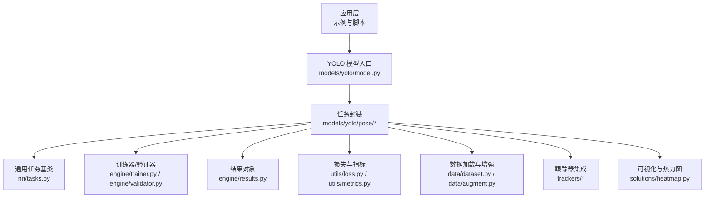
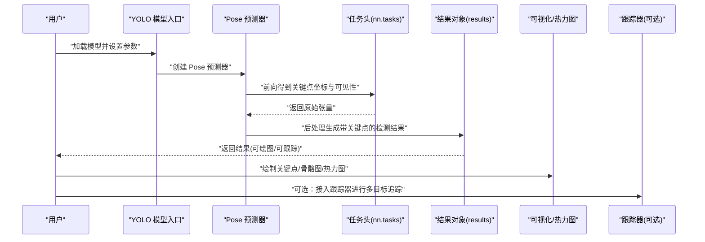
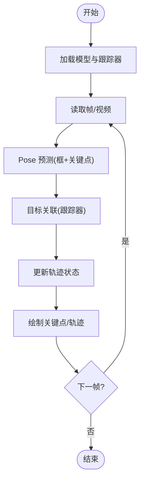
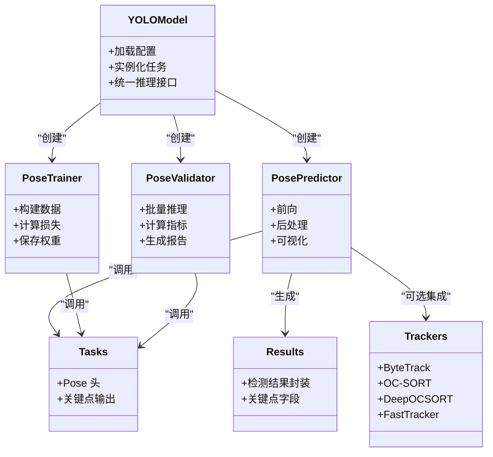

# 姿态估计教程

<cite>
**本文引用的文件**
- [README.md](file://README.md)
- [ultralytics/models/yolo/pose/__init__.py](file://ultralytics/models/yolo/pose/__init__.py)
- [ultralytics/models/yolo/pose/predict.py](file://ultralytics/models/yolo/pose/predict.py)
- [ultralytics/models/yolo/pose/train.py](file://ultralytics/models/yolo/pose/train.py)
- [ultralytics/models/yolo/pose/val.py](file://ultralytics/models/yolo/pose/val.py)
- [ultralytics/models/yolo/model.py](file://ultralytics/models/yolo/model.py)
- [ultralytics/nn/tasks.py](file://ultralytics/nn/tasks.py)
- [ultralytics/utils/loss.py](file://ultralytics/utils/loss.py)
- [ultralytics/utils/metrics.py](file://ultralytics/utils/metrics.py)
- [ultralytics/data/dataset.py](file://ultralytics/data/dataset.py)
- [ultralytics/data/augment.py](file://ultralytics/data/augment.py)
- [ultralytics/engine/trainer.py](file://ultralytics/engine/trainer.py)
- [ultralytics/engine/validator.py](file://ultralytics/engine/validator.py)
- [ultralytics/engine/results.py](file://ultralytics/engine/results.py)
- [ultralytics/solutions/heatmap.py](file://ultralytics/solutions/heatmap.py)
- [ultralytics/trackers/basetrack.py](file://ultralytics/trackers/basetrack.py)
- [ultralytics/trackers/byte_tracker.py](file://ultralytics/trackers/byte_tracker.py)
- [ultralytics/trackers/oc_sort.py](file://ultralytics/trackers/oc_sort.py)
- [ultralytics/trackers/deep_oc_sort.py](file://ultralytics/trackers/deep_oc_sort.py)
- [ultralytics/trackers/fast_tracker.py](file://ultralytics/trackers/fast_tracker.py)
- [ultralytics/trackers/track.py](file://ultralytics/trackers/track.py)
- [ultralytics/cfg/default.yaml](file://ultralytics/cfg/default.yaml)
- [examples/YOLO-Master-Cross-Platform-Edge-Deployment/TECHNICAL_REPORT.md](file://examples/YOLO-Master-Cross-Platform-Edge-Deployment/TECHNICAL_REPORT.md)
- [examples/YOLO-Master-Edge-Deployment/export_edge_models.py](file://examples/YOLO-Master-Edge-Deployment/export_edge_models.py)
- [examples/YOLOv8-TFLite-Python/main.py](file://examples/YOLOv8-TFLite-Python/main.py)
- [examples/YOLOv8-ONNXRuntime-Python/main.py](file://examples/YOLOv8-ONNXRuntime-Python/main.py)
- [examples/YOLOv8-OpenVINO-CPP-Inference/main.cc](file://examples/YOLOv8-OpenVINO-CPP-Inference/main.cc)
- [examples/YOLO11-Triton-CPP/inference.cpp](file://examples/YOLO11-Triton-CPP/inference.cpp)
- [examples/YOLOv8-Region-Counter/yolov8_region_counter.py](file://examples/YOLOv8-Region-Counter/yolov8_region_counter.py)
- [examples/object_tracking.ipynb](file://examples/object_tracking.ipynb)
- [examples/tutorial.ipynb](file://examples/tutorial.ipynb)
</cite>

## 目录
1. [简介](#简介)
2. [项目结构](#项目结构)
3. [核心组件](#核心组件)
4. [架构总览](#架构总览)
5. [详细组件分析](#详细组件分析)
6. [依赖关系分析](#依赖关系分析)
7. [性能与部署优化](#性能与部署优化)
8. [故障排查指南](#故障排查指南)
9. [结论](#结论)
10. [附录](#附录)

## 简介
本教程面向希望使用 YOLO-Master 完成人体关键点检测与动物姿态估计的工程师与研究者。内容覆盖：
- 人体关键点与动物姿态估计的原理与应用场景
- 关键点标注格式与数据集准备流程
- 模型架构特点、训练配置与输出格式
- 可视化与骨骼图绘制方法
- 多目标姿态跟踪方案
- 移动端与嵌入式设备部署优化策略

## 项目结构
YOLO-Master 将“任务”作为一等公民组织代码，姿态估计（Pose）位于 models/yolo/pose 下，配套的数据集、损失、指标、推理与导出均在对应子模块中。训练、验证、预测分别由独立的类实现，统一通过 YOLO 模型入口进行调度。

图表来源
- [ultralytics/models/yolo/model.py](file://ultralytics/models/yolo/model.py)
- [ultralytics/models/yolo/pose/__init__.py](file://ultralytics/models/yolo/pose/__init__.py)
- [ultralytics/nn/tasks.py](file://ultralytics/nn/tasks.py)
- [ultralytics/engine/trainer.py](file://ultralytics/engine/trainer.py)
- [ultralytics/engine/validator.py](file://ultralytics/engine/validator.py)
- [ultralytics/engine/results.py](file://ultralytics/engine/results.py)
- [ultralytics/utils/loss.py](file://ultralytics/utils/loss.py)
- [ultralytics/utils/metrics.py](file://ultralytics/utils/metrics.py)
- [ultralytics/data/dataset.py](file://ultralytics/data/dataset.py)
- [ultralytics/data/augment.py](file://ultralytics/data/augment.py)
- [ultralytics/solutions/heatmap.py](file://ultralytics/solutions/heatmap.py)
- [ultralytics/trackers/basetrack.py](file://ultralytics/trackers/basetrack.py)

章节来源
- [README.md](file://README.md)
- [ultralytics/models/yolo/pose/__init__.py](file://ultralytics/models/yolo/pose/__init__.py)
- [ultralytics/models/yolo/model.py](file://ultralytics/models/yolo/model.py)

## 核心组件
- 任务封装：Pose 任务在 models/yolo/pose 下提供 predict、train、val 三类接口，内部复用 nn.tasks 中的 Pose 头与相关逻辑。
- 训练与验证：继承自通用 Trainer/Validator，负责构建 DataLoader、计算损失、记录指标与保存权重。
- 结果对象：engine/results.py 统一封装检测结果，包含框、类别、置信度、关键点等字段，便于后续可视化与跟踪。
- 损失与指标：关键点回归通常采用坐标回归损失（如 BCE/L1/SmoothL1 组合），配合可见性分类或置信度；指标包括关键点精度、AP 等。
- 数据管道：支持标准 YOLO 标注格式，含关键点坐标与可见性标记；数据增强对关键点保持几何一致性。
- 跟踪集成：可与 ByteTrack、OC-SORT、DeepOCSORT、FastTracker 等结合，实现多目标姿态轨迹。

章节来源
- [ultralytics/models/yolo/pose/predict.py](file://ultralytics/models/yolo/pose/predict.py)
- [ultralytics/models/yolo/pose/train.py](file://ultralytics/models/yolo/pose/train.py)
- [ultralytics/models/yolo/pose/val.py](file://ultralytics/models/yolo/pose/val.py)
- [ultralytics/nn/tasks.py](file://ultralytics/nn/tasks.py)
- [ultralytics/engine/trainer.py](file://ultralytics/engine/trainer.py)
- [ultralytics/engine/validator.py](file://ultralytics/engine/validator.py)
- [ultralytics/engine/results.py](file://ultralytics/engine/results.py)
- [ultralytics/utils/loss.py](file://ultralytics/utils/loss.py)
- [ultralytics/utils/metrics.py](file://ultralytics/utils/metrics.py)
- [ultralytics/data/dataset.py](file://ultralytics/data/dataset.py)
- [ultralytics/data/augment.py](file://ultralytics/data/augment.py)

## 架构总览
下图展示了从输入图像到关键点输出的端到端流程，以及可选的跟踪与可视化分支。

图表来源
- [ultralytics/models/yolo/model.py](file://ultralytics/models/yolo/model.py)
- [ultralytics/models/yolo/pose/predict.py](file://ultralytics/models/yolo/pose/predict.py)
- [ultralytics/nn/tasks.py](file://ultralytics/nn/tasks.py)
- [ultralytics/engine/results.py](file://ultralytics/engine/results.py)
- [ultralytics/solutions/heatmap.py](file://ultralytics/solutions/heatmap.py)
- [ultralytics/trackers/track.py](file://ultralytics/trackers/track.py)

## 详细组件分析

### 人体关键点与动物姿态估计原理
- 人体关键点：通常定义若干关节点（如 COCO 17 点），每个点包含 x、y 坐标与可见性标志。
- 动物姿态估计：根据物种自定义骨架拓扑与关键点语义，例如犬/猫/马等常见部位。
- 检测+回归范式：先定位目标框，再回归关键点坐标；也可采用单阶段直接回归。

章节来源
- [ultralytics/models/yolo/pose/__init__.py](file://ultralytics/models/yolo/pose/__init__.py)
- [ultralytics/nn/tasks.py](file://ultralytics/nn/tasks.py)

### 关键点标注格式与数据集准备
- 标注格式：遵循 YOLO 关键点格式，每行一个关键点，包含归一化坐标与可见性标记；同时需要目标框与类别信息。
- 数据集配置：在 YAML 中声明路径、类别数、关键点数量及连接关系（骨架边）。
- 数据增强：旋转、仿射、缩放等操作需同步变换关键点坐标并保持可见性一致。

章节来源
- [ultralytics/data/dataset.py](file://ultralytics/data/dataset.py)
- [ultralytics/data/augment.py](file://ultralytics/data/augment.py)
- [ultralytics/cfg/default.yaml](file://ultralytics/cfg/default.yaml)

### 模型架构与输出格式
- 骨干网络：共享特征提取主干，适配不同尺度。
- 检测头：输出目标框、类别与置信度。
- 关键点头：输出每个目标的 N 个关键点坐标与可见性/置信度。
- 输出结构：engine/results.py 统一封装，便于后续可视化与跟踪。

章节来源
- [ultralytics/nn/tasks.py](file://ultralytics/nn/tasks.py)
- [ultralytics/engine/results.py](file://ultralytics/engine/results.py)

### 训练配置与损失函数
- 损失组成：
  - 关键点坐标回归损失：常用 BCE/L1/SmoothL1 等，针对可见关键点计算。
  - 可见性/置信度损失：区分是否可见或置信度阈值过滤。
  - 检测损失：框回归与分类损失与关键点损失联合优化。
- 超参建议：
  - 关键点损失权重：根据任务难度调整，避免主导整体损失。
  - 置信度阈值：在训练后可通过验证集搜索最优阈值。
  - 坐标回归优化：可使用平滑 L1 提升鲁棒性，或在后期微调阶段降低学习率。

章节来源
- [ultralytics/utils/loss.py](file://ultralytics/utils/loss.py)
- [ultralytics/models/yolo/pose/train.py](file://ultralytics/models/yolo/pose/train.py)
- [ultralytics/engine/trainer.py](file://ultralytics/engine/trainer.py)

### 评估指标与验证
- 指标：关键点精度、AP 等，依据可见性筛选参与统计的关键点。
- 验证流程：在验证集上批量推理、后处理、计算指标并汇总报告。

章节来源
- [ultralytics/utils/metrics.py](file://ultralytics/utils/metrics.py)
- [ultralytics/models/yolo/pose/val.py](file://ultralytics/models/yolo/pose/val.py)
- [ultralytics/engine/validator.py](file://ultralytics/engine/validator.py)

### 可视化与骨骼图绘制
- 关键点可视化：在检测结果上绘制关键点与连线（骨架）。
- 热力图：利用 solutions/heatmap.py 生成关键点密度热力图，辅助质量检查与展示。
- 交互演示：参考 examples 中的 notebook 快速上手。

章节来源
- [ultralytics/solutions/heatmap.py](file://ultralytics/solutions/heatmap.py)
- [examples/tutorial.ipynb](file://examples/tutorial.ipynb)

### 多目标姿态跟踪方案
- 跟踪器选择：ByteTrack、OC-SORT、DeepOCSORT、FastTracker 等均可与 Pose 任务结合。
- 流程：检测+关键点→目标关联→轨迹维护→可视化。
- 配置：在预测时传入跟踪器类型与参数，实现视频流的多目标姿态跟踪。

图表来源
- [ultralytics/models/yolo/pose/predict.py](file://ultralytics/models/yolo/pose/predict.py)
- [ultralytics/trackers/basetrack.py](file://ultralytics/trackers/basetrack.py)
- [ultralytics/trackers/byte_tracker.py](file://ultralytics/trackers/byte_tracker.py)
- [ultralytics/trackers/oc_sort.py](file://ultralytics/trackers/oc_sort.py)
- [ultralytics/trackers/deep_oc_sort.py](file://ultralytics/trackers/deep_oc_sort.py)
- [ultralytics/trackers/fast_tracker.py](file://ultralytics/trackers/fast_tracker.py)
- [ultralytics/trackers/track.py](file://ultralytics/trackers/track.py)
- [examples/object_tracking.ipynb](file://examples/object_tracking.ipynb)

章节来源
- [ultralytics/trackers/basetrack.py](file://ultralytics/trackers/basetrack.py)
- [ultralytics/trackers/byte_tracker.py](file://ultralytics/trackers/byte_tracker.py)
- [ultralytics/trackers/oc_sort.py](file://ultralytics/trackers/oc_sort.py)
- [ultralytics/trackers/deep_oc_sort.py](file://ultralytics/trackers/deep_oc_sort.py)
- [ultralytics/trackers/fast_tracker.py](file://ultralytics/trackers/fast_tracker.py)
- [ultralytics/trackers/track.py](file://ultralytics/trackers/track.py)
- [examples/object_tracking.ipynb](file://examples/object_tracking.ipynb)

## 依赖关系分析
- 任务耦合：Pose 任务依赖 nn.tasks 的任务头与工具；训练/验证依赖通用引擎；结果对象贯穿推理与可视化。
- 外部集成：跟踪器以插件形式接入，不影响主任务逻辑；可视化与热力图独立于训练链路。

图表来源
- [ultralytics/models/yolo/model.py](file://ultralytics/models/yolo/model.py)
- [ultralytics/models/yolo/pose/predict.py](file://ultralytics/models/yolo/pose/predict.py)
- [ultralytics/models/yolo/pose/train.py](file://ultralytics/models/yolo/pose/train.py)
- [ultralytics/models/yolo/pose/val.py](file://ultralytics/models/yolo/pose/val.py)
- [ultralytics/nn/tasks.py](file://ultralytics/nn/tasks.py)
- [ultralytics/engine/results.py](file://ultralytics/engine/results.py)
- [ultralytics/trackers/byte_tracker.py](file://ultralytics/trackers/byte_tracker.py)
- [ultralytics/trackers/oc_sort.py](file://ultralytics/trackers/oc_sort.py)
- [ultralytics/trackers/deep_oc_sort.py](file://ultralytics/trackers/deep_oc_sort.py)
- [ultralytics/trackers/fast_tracker.py](file://ultralytics/trackers/fast_tracker.py)

章节来源
- [ultralytics/models/yolo/model.py](file://ultralytics/models/yolo/model.py)
- [ultralytics/nn/tasks.py](file://ultralytics/nn/tasks.py)
- [ultralytics/engine/results.py](file://ultralytics/engine/results.py)

## 性能与部署优化
- 导出格式：
  - ONNX：跨平台推理，适合桌面与服务器。
  - TensorRT：GPU 加速，高吞吐低延迟。
  - OpenVINO：Intel CPU/GPU/NPU 优化。
  - TFLite：移动端与边缘设备。
- 量化与剪枝：
  - 动态/静态量化减少体积与延迟。
  - 结构化剪枝降低计算量。
- 批处理与流水线：
  - 合理 batch size 与预处理并行。
  - 视频流解码-推理-渲染流水线优化。
- 示例参考：
  - 边缘导出脚本与跨平台部署技术报告。
  - ONNXRuntime/TensorRT/OpenVINO/TFLite 示例工程。

章节来源
- [examples/YOLO-Master-Edge-Deployment/export_edge_models.py](file://examples/YOLO-Master-Edge-Deployment/export_edge_models.py)
- [examples/YOLO-Master-Cross-Platform-Edge-Deployment/TECHNICAL_REPORT.md](file://examples/YOLO-Master-Cross-Platform-Edge-Deployment/TECHNICAL_REPORT.md)
- [examples/YOLOv8-ONNXRuntime-Python/main.py](file://examples/YOLOv8-ONNXRuntime-Python/main.py)
- [examples/YOLOv8-TFLite-Python/main.py](file://examples/YOLOv8-TFLite-Python/main.py)
- [examples/YOLOv8-OpenVINO-CPP-Inference/main.cc](file://examples/YOLOv8-OpenVINO-CPP-Inference/main.cc)
- [examples/YOLO11-Triton-CPP/inference.cpp](file://examples/YOLO11-Triton-CPP/inference.cpp)

## 故障排查指南
- 关键点不可见或偏移：
  - 检查数据增强是否破坏关键点几何一致性。
  - 调整关键点损失权重与可见性阈值。
- 训练不稳定：
  - 降低学习率或使用更稳健的损失（如 SmoothL1）。
  - 检查梯度裁剪与混合精度设置。
- 推理速度慢：
  - 启用导出与量化；优化批大小与预处理。
  - 使用合适的后端（TensorRT/OpenVINO/TFLite）。
- 跟踪丢失：
  - 调整跟踪器阈值与运动模型参数。
  - 增加关键点约束或引入外观特征。

章节来源
- [ultralytics/data/augment.py](file://ultralytics/data/augment.py)
- [ultralytics/utils/loss.py](file://ultralytics/utils/loss.py)
- [ultralytics/engine/trainer.py](file://ultralytics/engine/trainer.py)
- [ultralytics/trackers/byte_tracker.py](file://ultralytics/trackers/byte_tracker.py)
- [ultralytics/trackers/oc_sort.py](file://ultralytics/trackers/oc_sort.py)
- [ultralytics/trackers/deep_oc_sort.py](file://ultralytics/trackers/deep_oc_sort.py)
- [ultralytics/trackers/fast_tracker.py](file://ultralytics/trackers/fast_tracker.py)

## 结论
YOLO-Master 为姿态估计提供了完整的一体化解决方案：从数据准备、模型训练、评估到可视化与多目标跟踪，再到多平台部署。通过合理的损失设计、阈值调优与导出优化，可在多种设备上实现高精度与高性能的姿态估计。

## 附录
- 快速入门：
  - 参考 examples 中的 notebook 与示例脚本，快速完成数据准备、训练与推理。
- 区域计数与统计：
  - 结合 region counter 示例，实现基于关键点的行为分析与统计。

章节来源
- [examples/tutorial.ipynb](file://examples/tutorial.ipynb)
- [examples/YOLOv8-Region-Counter/yolov8_region_counter.py](file://examples/YOLOv8-Region-Counter/yolov8_region_counter.py)