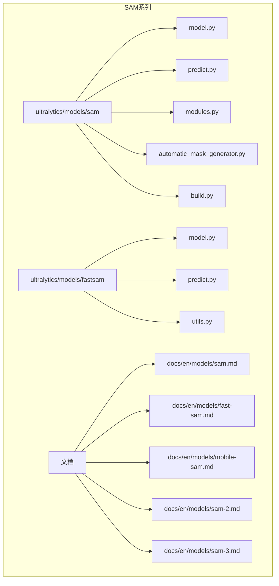
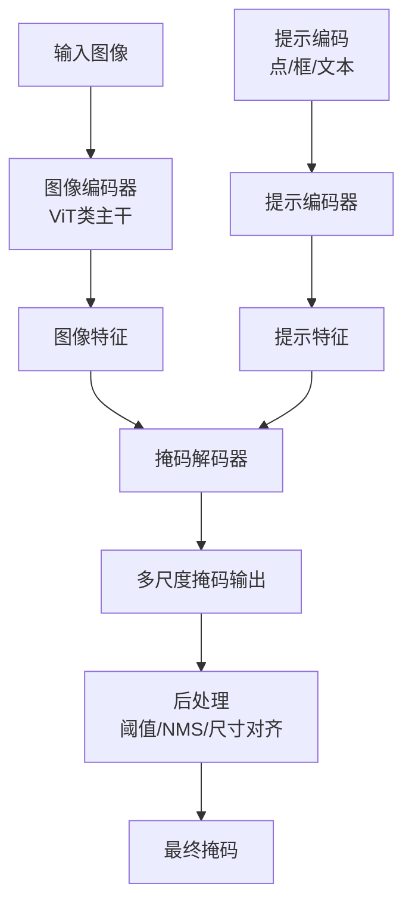
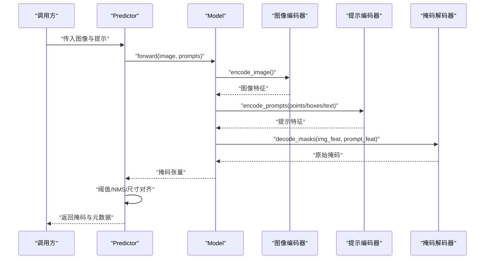
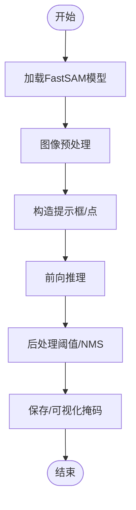
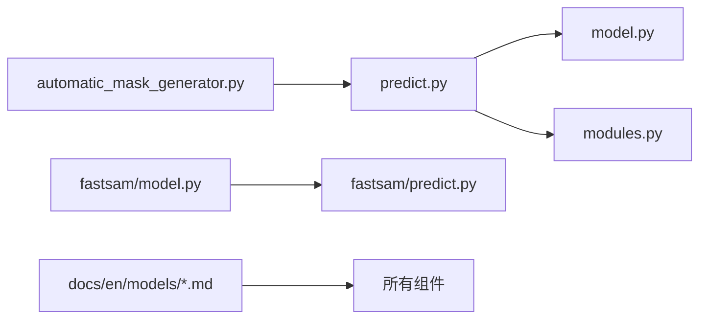

# SAM系列分割模型

<cite>
**本文引用的文件**
- [ultralytics/models/sam/__init__.py](file://ultralytics/models/sam/__init__.py)
- [ultralytics/models/sam/model.py](file://ultralytics/models/sam/model.py)
- [ultralytics/models/sam/predict.py](file://ultralytics/models/sam/predict.py)
- [ultralytics/models/sam/automatic_mask_generator.py](file://ultralytics/models/sam/automatic_mask_generator.py)
- [ultralytics/models/sam/build.py](file://ultralytics/models/sam/build.py)
- [ultralytics/models/sam/modules.py](file://ultralytics/models/sam/modules.py)
- [ultralytics/models/fastsam/__init__.py](file://ultralytics/models/fastsam/__init__.py)
- [ultralytics/models/fastsam/model.py](file://ultralytics/models/fastsam/model.py)
- [ultralytics/models/fastsam/predict.py](file://ultralytics/models/fastsam/predict.py)
- [ultralytics/models/fastsam/utils.py](file://ultralytics/models/fastsam/utils.py)
- [docs/en/models/sam.md](file://docs/en/models/sam.md)
- [docs/en/models/fast-sam.md](file://docs/en/models/fast-sam.md)
- [docs/en/models/mobile-sam.md](file://docs/en/models/mobile-sam.md)
- [docs/en/models/sam-2.md](file://docs/en/models/sam-2.md)
- [docs/en/models/sam-3.md](file://docs/en/models/sam-3.md)
- [examples/YOLOv8-Segmentation-ONNXRuntime-Python/main.py](file://examples/YOLOv8-Segmentation-ONNXRuntime-Python/main.py)
</cite>

## 目录
1. [简介](#简介)
2. [项目结构](#项目结构)
3. [核心组件](#核心组件)
4. [架构总览](#架构总览)
5. [详细组件分析](#详细组件分析)
6. [依赖关系分析](#依赖关系分析)
7. [性能与部署考量](#性能与部署考量)
8. [提示工程（Prompt Engineering）指南](#提示工程prompt-engineering指南)
9. [微调与领域适配](#微调与领域适配)
10. [故障排查](#故障排查)
11. [结论](#结论)
12. [附录：参考实现路径](#附录参考实现路径)

## 简介
本指南面向希望系统掌握并落地SAM系列分割模型的工程师与研究者，围绕以下目标展开：
- 深入解析Segment Anything Model（SAM）的架构设计与零样本分割能力
- 对比SAM、FastSAM、MobileSAM等变体的特点、性能差异与适用场景
- 说明点提示、框提示、文本提示等提示工程方法在SAM中的应用
- 提供可操作的微调策略与领域适配方案
- 给出实际应用场景的代码示例与最佳实践

## 项目结构
本项目在ultralytics框架内对SAM系列进行了集成，包含标准SAM、FastSAM以及文档中提及的MobileSAM、SAM-2、SAM-3等。核心代码位于ultralytics/models/sam与ultralytics/models/fastsam两个子包，配套文档位于docs/en/models下。

图表来源
- [ultralytics/models/sam/model.py](file://ultralytics/models/sam/model.py)
- [ultralytics/models/sam/predict.py](file://ultralytics/models/sam/predict.py)
- [ultralytics/models/sam/modules.py](file://ultralytics/models/sam/modules.py)
- [ultralytics/models/sam/automatic_mask_generator.py](file://ultralytics/models/sam/automatic_mask_generator.py)
- [ultralytics/models/sam/build.py](file://ultralytics/models/sam/build.py)
- [ultralytics/models/fastsam/model.py](file://ultralytics/models/fastsam/model.py)
- [ultralytics/models/fastsam/predict.py](file://ultralytics/models/fastsam/predict.py)
- [ultralytics/models/fastsam/utils.py](file://ultralytics/models/fastsam/utils.py)
- [docs/en/models/sam.md](file://docs/en/models/sam.md)
- [docs/en/models/fast-sam.md](file://docs/en/models/fast-sam.md)
- [docs/en/models/mobile-sam.md](file://docs/en/models/mobile-sam.md)
- [docs/en/models/sam-2.md](file://docs/en/models/sam-2.md)
- [docs/en/models/sam-3.md](file://docs/en/models/sam-3.md)

章节来源
- [ultralytics/models/sam/__init__.py](file://ultralytics/models/sam/__init__.py)
- [ultralytics/models/fastsam/__init__.py](file://ultralytics/models/fastsam/__init__.py)
- [docs/en/models/sam.md](file://docs/en/models/sam.md)
- [docs/en/models/fast-sam.md](file://docs/en/models/fast-sam.md)
- [docs/en/models/mobile-sam.md](file://docs/en/models/mobile-sam.md)
- [docs/en/models/sam-2.md](file://docs/en/models/sam-2.md)
- [docs/en/models/sam-3.md](file://docs/en/models/sam-3.md)

## 核心组件
- SAM主模型与预测器
  - model.py：定义SAM模型结构与加载逻辑
  - predict.py：封装推理流程，支持点/框/文本等多模态提示
  - modules.py：图像编码器、提示编码器、掩码解码器等关键模块
  - automatic_mask_generator.py：无提示自动掩码生成（如网格采样+NMS）
  - build.py：构建与注册模型入口
- FastSAM
  - model.py/predict.py：面向实时分割的高效实现
  - utils.py：工具函数与后处理
- 文档
  - docs/en/models/*.md：各变体特性、参数与使用指引

章节来源
- [ultralytics/models/sam/model.py](file://ultralytics/models/sam/model.py)
- [ultralytics/models/sam/predict.py](file://ultralytics/models/sam/predict.py)
- [ultralytics/models/sam/modules.py](file://ultralytics/models/sam/modules.py)
- [ultralytics/models/sam/automatic_mask_generator.py](file://ultralytics/models/sam/automatic_mask_generator.py)
- [ultralytics/models/sam/build.py](file://ultralytics/models/sam/build.py)
- [ultralytics/models/fastsam/model.py](file://ultralytics/models/fastsam/model.py)
- [ultralytics/models/fastsam/predict.py](file://ultralytics/models/fastsam/predict.py)
- [ultralytics/models/fastsam/utils.py](file://ultralytics/models/fastsam/utils.py)

## 架构总览
SAM采用“图像编码器 + 提示编码器 + 轻量掩码解码器”的三分支架构，具备强大的零样本泛化能力。FastSAM在保持交互能力的同时优化了速度；MobileSAM通过轻量化主干提升移动端效率；SAM-2/SAM-3为后续演进版本，文档中提供了进一步特性说明。

图表来源
- [ultralytics/models/sam/model.py](file://ultralytics/models/sam/model.py)
- [ultralytics/models/sam/modules.py](file://ultralytics/models/sam/modules.py)
- [ultralytics/models/sam/predict.py](file://ultralytics/models/sam/predict.py)

## 详细组件分析

### SAM主模型与预测器
- 模型结构
  - 图像编码器：基于视觉Transformer的主干，提取多尺度特征
  - 提示编码器：将点、框、文本等提示映射到统一空间
  - 掩码解码器：融合图像与提示特征，输出高质量掩码
- 推理流程
  - 预处理：图像归一化、尺寸调整
  - 提示构造：点坐标、边界框、文本描述
  - 前向传播：编码器→提示编码→解码器
  - 后处理：阈值过滤、非极大值抑制、掩码上采样
- 自动掩码生成
  - 网格采样提示点，批量推理后合并结果

图表来源
- [ultralytics/models/sam/predict.py](file://ultralytics/models/sam/predict.py)
- [ultralytics/models/sam/model.py](file://ultralytics/models/sam/model.py)
- [ultralytics/models/sam/modules.py](file://ultralytics/models/sam/modules.py)

章节来源
- [ultralytics/models/sam/model.py](file://ultralytics/models/sam/model.py)
- [ultralytics/models/sam/predict.py](file://ultralytics/models/sam/predict.py)
- [ultralytics/models/sam/modules.py](file://ultralytics/models/sam/modules.py)
- [ultralytics/models/sam/automatic_mask_generator.py](file://ultralytics/models/sam/automatic_mask_generator.py)

### FastSAM
- 设计要点
  - 针对实时场景优化的分割管线
  - 更轻量的提示处理与解码策略
- 典型用法
  - 以框或点提示进行快速实例分割
  - 适合视频流与边缘设备

图表来源
- [ultralytics/models/fastsam/model.py](file://ultralytics/models/fastsam/model.py)
- [ultralytics/models/fastsam/predict.py](file://ultralytics/models/fastsam/predict.py)
- [ultralytics/models/fastsam/utils.py](file://ultralytics/models/fastsam/utils.py)

章节来源
- [ultralytics/models/fastsam/model.py](file://ultralytics/models/fastsam/model.py)
- [ultralytics/models/fastsam/predict.py](file://ultralytics/models/fastsam/predict.py)
- [ultralytics/models/fastsam/utils.py](file://ultralytics/models/fastsam/utils.py)

### MobileSAM、SAM-2、SAM-3（概念性概览）
- MobileSAM：面向移动端的轻量化变体，强调低延迟与小体积
- SAM-2/SAM-3：在文档中作为后续版本介绍，通常包含更强的提示建模、时序扩展或更高效的结构
- 选择建议
  - 资源受限/移动端：优先MobileSAM
  - 通用零样本分割：SAM
  - 实时需求：FastSAM

章节来源
- [docs/en/models/mobile-sam.md](file://docs/en/models/mobile-sam.md)
- [docs/en/models/sam-2.md](file://docs/en/models/sam-2.md)
- [docs/en/models/sam-3.md](file://docs/en/models/sam-3.md)

## 依赖关系分析
- 模块耦合
  - predict.py依赖model.py与modules.py完成端到端推理
  - automatic_mask_generator.py复用predict接口进行批量提示生成
  - fastsam子包独立于sam，但遵循相似的提示-解码范式
- 外部依赖
  - 图像处理与张量操作由底层框架提供
  - 导出与部署可通过ONNX/TensorRT等后端（见示例）

图表来源
- [ultralytics/models/sam/predict.py](file://ultralytics/models/sam/predict.py)
- [ultralytics/models/sam/model.py](file://ultralytics/models/sam/model.py)
- [ultralytics/models/sam/modules.py](file://ultralytics/models/sam/modules.py)
- [ultralytics/models/sam/automatic_mask_generator.py](file://ultralytics/models/sam/automatic_mask_generator.py)
- [ultralytics/models/fastsam/model.py](file://ultralytics/models/fastsam/model.py)
- [ultralytics/models/fastsam/predict.py](file://ultralytics/models/fastsam/predict.py)
- [docs/en/models/sam.md](file://docs/en/models/sam.md)
- [docs/en/models/fast-sam.md](file://docs/en/models/fast-sam.md)

章节来源
- [ultralytics/models/sam/build.py](file://ultralytics/models/sam/build.py)
- [ultralytics/models/fastsam/__init__.py](file://ultralytics/models/fastsam/__init__.py)

## 性能与部署考量
- 推理加速
  - 使用ONNX导出与运行时（示例见YOLOv8 Segmentation ONNXRuntime）
  - 批处理与内存池减少重复分配
- 精度-速度权衡
  - SAM：高精度、较高算力
  - FastSAM：更快、略降精度
  - MobileSAM：移动端友好
- 部署建议
  - 服务端：TensorRT/ONNX Runtime
  - 边缘端：量化与算子融合
  - 视频流：滑动窗口与提示复用

章节来源
- [examples/YOLOv8-Segmentation-ONNXRuntime-Python/main.py](file://examples/YOLOv8-Segmentation-ONNXRuntime-Python/main.py)
- [docs/en/models/sam.md](file://docs/en/models/sam.md)
- [docs/en/models/fast-sam.md](file://docs/en/models/fast-sam.md)
- [docs/en/models/mobile-sam.md](file://docs/en/models/mobile-sam.md)

## 提示工程（Prompt Engineering）指南
- 点提示
  - 单点定位前景/背景
  - 多点组合细化复杂对象
- 框提示
  - 矩形框快速圈定目标区域
  - 结合点提示提高边界贴合度
- 文本提示
  - 自然语言描述目标属性（颜色、材质、类别）
  - 适用于开放词汇场景
- 最佳实践
  - 先粗后精：先用框定位，再用点修正
  - 多提示融合：叠加多个点/框提升鲁棒性
  - 文本提示简洁明确，避免歧义

章节来源
- [docs/en/models/sam.md](file://docs/en/models/sam.md)
- [docs/en/models/fast-sam.md](file://docs/en/models/fast-sam.md)
- [ultralytics/models/sam/predict.py](file://ultralytics/models/sam/predict.py)

## 微调与领域适配
- 全量微调
  - 适用于大规模领域数据，注意过拟合与计算成本
- 部分微调
  - 冻结主干，仅训练提示编码器或解码器
- 参数高效微调（PEFT）
  - LoRA/Adapter等方法降低显存占用与训练时长
- 数据准备
  - 标注格式统一（掩码/边界框/点）
  - 数据增强（裁剪、翻转、色彩抖动）
- 评估与迭代
  - 划分验证集，监控IoU/AP等指标
  - 错误分析驱动提示策略与数据改进

章节来源
- [docs/en/models/sam.md](file://docs/en/models/sam.md)
- [docs/en/models/fast-sam.md](file://docs/en/models/fast-sam.md)

## 故障排查
- 常见问题
  - 提示越界或尺寸不匹配：检查坐标范围与图像尺寸
  - 掩码空洞或碎片：调整阈值与NMS参数
  - 文本提示无效：确认文本编码是否启用且模型支持
- 调试建议
  - 逐步打印中间特征维度
  - 可视化提示与中间掩码定位问题
  - 使用自动掩码生成器辅助定位困难样本

章节来源
- [ultralytics/models/sam/automatic_mask_generator.py](file://ultralytics/models/sam/automatic_mask_generator.py)
- [ultralytics/models/sam/predict.py](file://ultralytics/models/sam/predict.py)

## 结论
SAM系列为开放词汇与零样本分割提供了强大基座。根据任务需求选择合适的变体（SAM/FastSAM/MobileSAM），配合合理的提示工程与微调策略，可在多种场景中取得良好效果。结合导出与部署优化，可实现从云端到边缘的全链路落地。

## 附录：参考实现路径
- SAM主模型与预测器
  - [ultralytics/models/sam/model.py](file://ultralytics/models/sam/model.py)
  - [ultralytics/models/sam/predict.py](file://ultralytics/models/sam/predict.py)
  - [ultralytics/models/sam/modules.py](file://ultralytics/models/sam/modules.py)
  - [ultralytics/models/sam/automatic_mask_generator.py](file://ultralytics/models/sam/automatic_mask_generator.py)
  - [ultralytics/models/sam/build.py](file://ultralytics/models/sam/build.py)
- FastSAM
  - [ultralytics/models/fastsam/model.py](file://ultralytics/models/fastsam/model.py)
  - [ultralytics/models/fastsam/predict.py](file://ultralytics/models/fastsam/predict.py)
  - [ultralytics/models/fastsam/utils.py](file://ultralytics/models/fastsam/utils.py)
- 文档与变体说明
  - [docs/en/models/sam.md](file://docs/en/models/sam.md)
  - [docs/en/models/fast-sam.md](file://docs/en/models/fast-sam.md)
  - [docs/en/models/mobile-sam.md](file://docs/en/models/mobile-sam.md)
  - [docs/en/models/sam-2.md](file://docs/en/models/sam-2.md)
  - [docs/en/models/sam-3.md](file://docs/en/models/sam-3.md)
- 部署示例（ONNXRuntime）
  - [examples/YOLOv8-Segmentation-ONNXRuntime-Python/main.py](file://examples/YOLOv8-Segmentation-ONNXRuntime-Python/main.py)