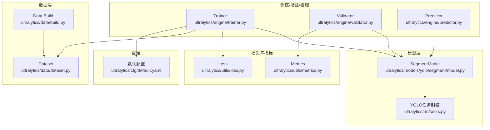
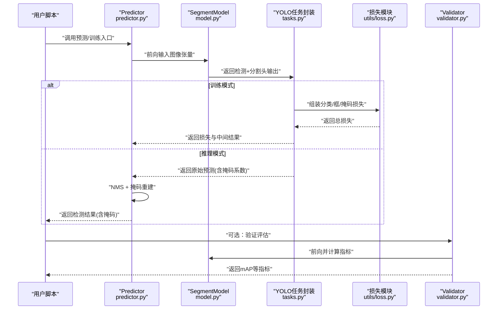
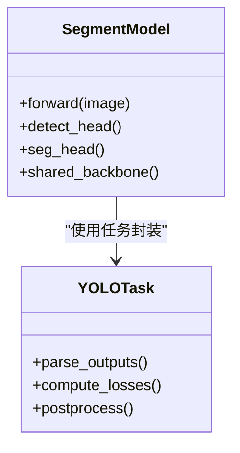
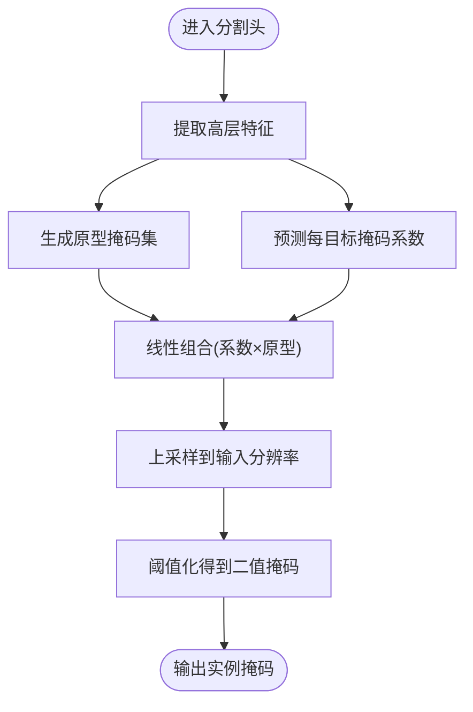
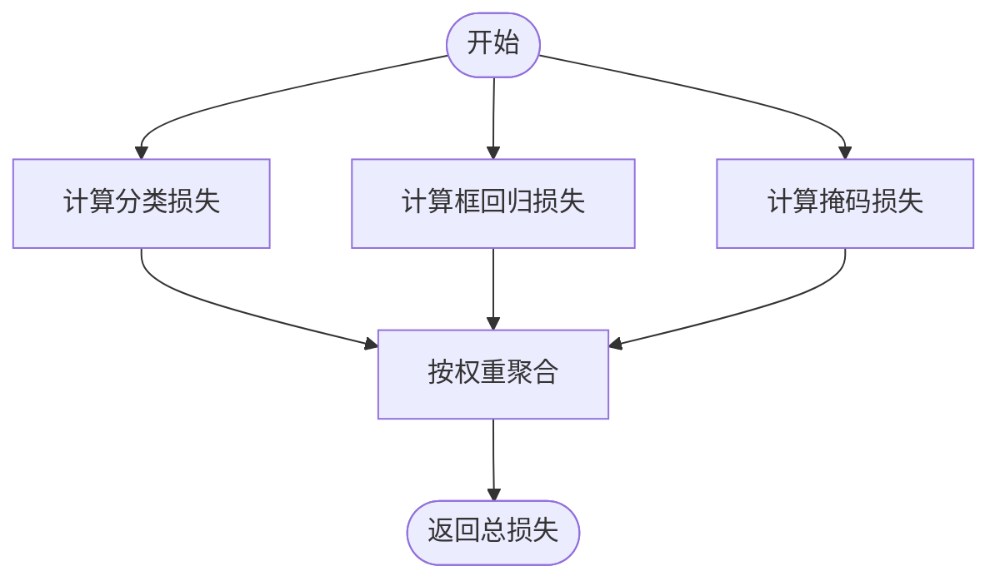
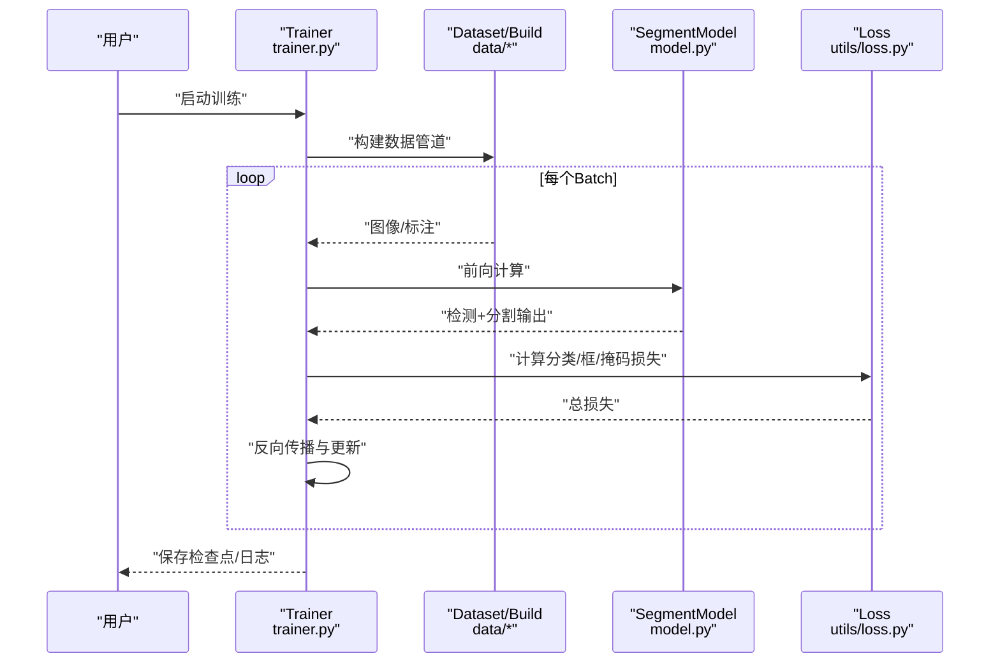
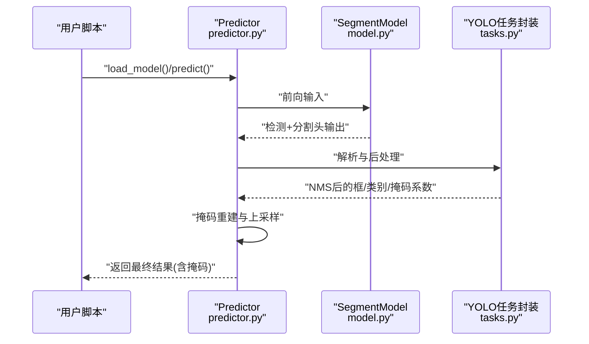
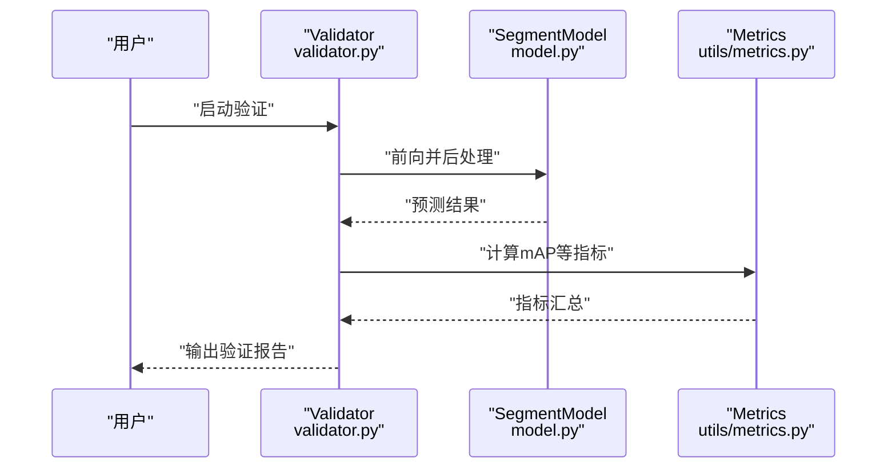
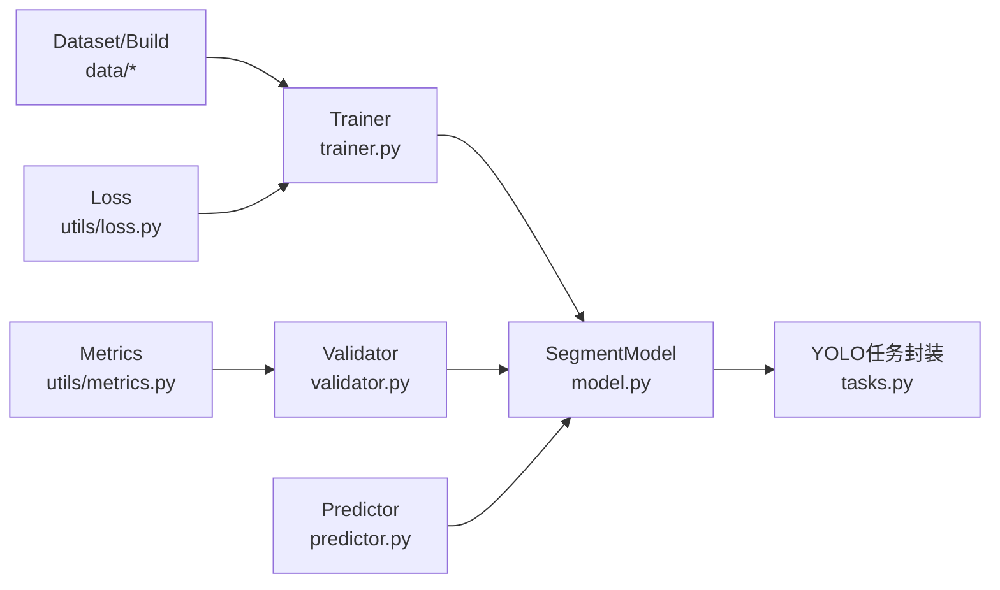

# YOLO分割模型基础

<cite>
**本文引用的文件**
- [ultralytics/models/yolo/segment/model.py](file://ultralytics/models/yolo/segment/model.py)
- [ultralytics/models/yolo/segment/train.py](file://ultralytics/models/yolo/segment/train.py)
- [ultralytics/models/yolo/segment/predict.py](file://ultralytics/models/yolo/segment/predict.py)
- [ultralytics/models/yolo/segment/val.py](file://ultralytics/models/yolo/segment/val.py)
- [ultralytics/nn/tasks.py](file://ultralytics/nn/tasks.py)
- [ultralytics/utils/loss.py](file://ultralytics/utils/loss.py)
- [ultralytics/utils/metrics.py](file://ultralytics/utils/metrics.py)
- [ultralytics/engine/trainer.py](file://ultralytics/engine/trainer.py)
- [ultralytics/engine/validator.py](file://ultralytics/engine/validator.py)
- [ultralytics/engine/predictor.py](file://ultralytics/engine/predictor.py)
- [ultralytics/data/dataset.py](file://ultralytics/data/dataset.py)
- [ultralytics/data/build.py](file://ultralytics/data/build.py)
- [ultralytics/cfg/default.yaml](file://ultralytics/cfg/default.yaml)
- [examples/YOLOv8-Segmentation-ONNXRuntime-Python/main.py](file://examples/YOLOv8-Segmentation-ONNXRuntime-Python/main.py)
- [examples/YOLO11-Triton-CPP/inference.cpp](file://examples/YOLO11-Triton-CPP/inference.cpp)
- [docs/en/guides/instance-segmentation-and-tracking.md](file://docs/en/guides/instance-segmentation-and-tracking.md)
- [docs/en/guides/yolo-architecture.md](file://docs/en/guides/yolo-architecture.md)
- [docs/en/modes/predict.md](file://docs/en/modes/predict.md)
- [docs/en/modes/train.md](file://docs/en/modes/train.md)
- [docs/en/modes/val.md](file://docs/en/modes/val.md)
</cite>

## 目录
1. [简介](#简介)
2. [项目结构](#项目结构)
3. [核心组件](#核心组件)
4. [架构总览](#架构总览)
5. [详细组件分析](#详细组件分析)
6. [依赖关系分析](#依赖关系分析)
7. [性能考量](#性能考量)
8. [故障排查指南](#故障排查指南)
9. [结论](#结论)
10. [附录](#附录)

## 简介
本教程面向希望系统掌握YOLO实例分割的工程师与研究者，围绕以下目标展开：
- 解释实例分割的基本概念、技术原理与应用场景
- 详解YOLO分割架构：特征提取器、分割头设计、掩码生成机制
- 说明分割任务的损失函数设计：分类损失、边界框回归损失、掩码损失
- 提供完整的训练配置示例：数据集格式要求、超参数调优建议
- 展示如何使用Python API进行分割推理：结果解析与后处理步骤

## 项目结构
仓库采用模块化分层组织，与YOLO分割相关的核心代码主要分布在以下路径：
- 模型定义与任务封装：ultralytics/models/yolo/segment、ultralytics/nn/tasks.py
- 训练/验证/推理引擎：ultralytics/engine/{trainer,validator,predictor}.py
- 数据加载与构建：ultralytics/data/{dataset,build}.py
- 损失与指标：ultralytics/utils/{loss,metrics}.py
- 默认配置：ultralytics/cfg/default.yaml
- 文档与示例：docs/en/...、examples/...

图表来源
- [ultralytics/models/yolo/segment/model.py](file://ultralytics/models/yolo/segment/model.py)
- [ultralytics/nn/tasks.py](file://ultralytics/nn/tasks.py)
- [ultralytics/engine/trainer.py](file://ultralytics/engine/trainer.py)
- [ultralytics/engine/validator.py](file://ultralytics/engine/validator.py)
- [ultralytics/engine/predictor.py](file://ultralytics/engine/predictor.py)
- [ultralytics/data/dataset.py](file://ultralytics/data/dataset.py)
- [ultralytics/data/build.py](file://ultralytics/data/build.py)
- [ultralytics/utils/loss.py](file://ultralytics/utils/loss.py)
- [ultralytics/utils/metrics.py](file://ultralytics/utils/metrics.py)
- [ultralytics/cfg/default.yaml](file://ultralytics/cfg/default.yaml)

章节来源
- [ultralytics/models/yolo/segment/model.py](file://ultralytics/models/yolo/segment/model.py)
- [ultralytics/nn/tasks.py](file://ultralytics/nn/tasks.py)
- [ultralytics/engine/trainer.py](file://ultralytics/engine/trainer.py)
- [ultralytics/engine/validator.py](file://ultralytics/engine/validator.py)
- [ultralytics/engine/predictor.py](file://ultralytics/engine/predictor.py)
- [ultralytics/data/dataset.py](file://ultralytics/data/dataset.py)
- [ultralytics/data/build.py](file://ultralytics/data/build.py)
- [ultralytics/utils/loss.py](file://ultralytics/utils/loss.py)
- [ultralytics/utils/metrics.py](file://ultralytics/utils/metrics.py)
- [ultralytics/cfg/default.yaml](file://ultralytics/cfg/default.yaml)

## 核心组件
- SegmentModel：封装YOLO分割模型的构建与前向逻辑，包含检测分支与分割分支。
- YOLO任务封装：统一多任务（检测、分割、姿态等）接口，负责输出对齐与损失组装。
- Trainer/Validator/Predictor：分别负责训练循环、验证评估与推理流程编排。
- Dataset/Build：负责YOLO格式数据的读取、增强与批构建。
- Loss/Metrics：实现分类、边界框回归、掩码损失以及mAP等指标计算。
- 默认配置：提供训练、推理、导出等常用超参与路径约定。

章节来源
- [ultralytics/models/yolo/segment/model.py](file://ultralytics/models/yolo/segment/model.py)
- [ultralytics/nn/tasks.py](file://ultralytics/nn/tasks.py)
- [ultralytics/engine/trainer.py](file://ultralytics/engine/trainer.py)
- [ultralytics/engine/validator.py](file://ultralytics/engine/validator.py)
- [ultralytics/engine/predictor.py](file://ultralytics/engine/predictor.py)
- [ultralytics/data/dataset.py](file://ultralytics/data/dataset.py)
- [ultralytics/data/build.py](file://ultralytics/data/build.py)
- [ultralytics/utils/loss.py](file://ultralytics/utils/loss.py)
- [ultralytics/utils/metrics.py](file://ultralytics/utils/metrics.py)
- [ultralytics/cfg/default.yaml](file://ultralytics/cfg/default.yaml)

## 架构总览
YOLO分割在通用YOLO检测架构基础上增加“分割头”，共享主干特征，并行输出类别置信度、边界框与每目标的掩码系数。典型流程如下：

图表来源
- [ultralytics/engine/predictor.py](file://ultralytics/engine/predictor.py)
- [ultralytics/models/yolo/segment/model.py](file://ultralytics/models/yolo/segment/model.py)
- [ultralytics/nn/tasks.py](file://ultralytics/nn/tasks.py)
- [ultralytics/utils/loss.py](file://ultralytics/utils/loss.py)
- [ultralytics/engine/validator.py](file://ultralytics/engine/validator.py)

## 详细组件分析

### 实例分割基本概念与技术原理
- 实例分割目标：对图像中每个目标实例给出类别、位置与像素级掩码。
- 主流范式：两阶段（如Mask R-CNN）与单阶段（如YOLO系列）。YOLO分割通过共享主干与多任务头实现端到端高效推理。
- 掩码生成策略：常见为“掩码系数”方案，即对每个目标预测一组系数，与可学习的掩码原型线性组合得到实例掩码。

章节来源
- [docs/en/guides/instance-segmentation-and-tracking.md](file://docs/en/guides/instance-segmentation-and-tracking.md)
- [docs/en/guides/yolo-architecture.md](file://docs/en/guides/yolo-architecture.md)

### YOLO分割架构详解
- 特征提取器：共享主干网络（如CSP/Darknet或现代变体），输出多尺度特征图。
- 检测头：输出类别概率与边界框回归量。
- 分割头：对每个正样本输出掩码系数，结合可学习原型生成高分辨率实例掩码。
- 输出对齐：任务封装将不同头的输出按网格/锚点/DETR式匹配进行归一化，便于损失计算与后处理。

图表来源
- [ultralytics/models/yolo/segment/model.py](file://ultralytics/models/yolo/segment/model.py)
- [ultralytics/nn/tasks.py](file://ultralytics/nn/tasks.py)

章节来源
- [ultralytics/models/yolo/segment/model.py](file://ultralytics/models/yolo/segment/model.py)
- [ultralytics/nn/tasks.py](file://ultralytics/nn/tasks.py)

### 掩码生成机制
- 掩码系数：每个目标预测一组权重，用于线性组合可学习原型。
- 原型掩码：由分割头从高层特征中提取，尺寸通常小于输入分辨率，需上采样至原图。
- 合成掩码：将掩码系数与原型掩码相乘求和，再经阈值化得到二值掩码。

图表来源
- [ultralytics/models/yolo/segment/model.py](file://ultralytics/models/yolo/segment/model.py)
- [ultralytics/nn/tasks.py](file://ultralytics/nn/tasks.py)

章节来源
- [ultralytics/models/yolo/segment/model.py](file://ultralytics/models/yolo/segment/model.py)
- [ultralytics/nn/tasks.py](file://ultralytics/nn/tasks.py)

### 损失函数设计
- 分类损失：针对类别预测的交叉熵类损失，常配合标签平滑或Focal思想以缓解类别不平衡。
- 边界框回归损失：常用GIoU/CIoU/DIoU或其变体，优化框定位质量。
- 掩码损失：对每目标掩码与GT掩码计算逐像素损失（如BCE或Dice类），并结合分类置信度加权。
- 总损失：三者加权求和，权重可通过配置调整。

图表来源
- [ultralytics/utils/loss.py](file://ultralytics/utils/loss.py)
- [ultralytics/nn/tasks.py](file://ultralytics/nn/tasks.py)

章节来源
- [ultralytics/utils/loss.py](file://ultralytics/utils/loss.py)
- [ultralytics/nn/tasks.py](file://ultralytics/nn/tasks.py)

### 训练流程与配置
- 训练入口：Trainer负责数据加载、优化器调度、损失回传与日志记录。
- 数据格式：遵循YOLO标注格式（类别索引、相对坐标或掩码路径），由Dataset/Build完成解析与增强。
- 关键超参：学习率、批次大小、轮次、数据增强强度、损失权重、NMS阈值等，均可在配置中设置。

图表来源
- [ultralytics/engine/trainer.py](file://ultralytics/engine/trainer.py)
- [ultralytics/data/dataset.py](file://ultralytics/data/dataset.py)
- [ultralytics/data/build.py](file://ultralytics/data/build.py)
- [ultralytics/models/yolo/segment/model.py](file://ultralytics/models/yolo/segment/model.py)
- [ultralytics/utils/loss.py](file://ultralytics/utils/loss.py)

章节来源
- [ultralytics/engine/trainer.py](file://ultralytics/engine/trainer.py)
- [ultralytics/data/dataset.py](file://ultralytics/data/dataset.py)
- [ultralytics/data/build.py](file://ultralytics/data/build.py)
- [ultralytics/models/yolo/segment/model.py](file://ultralytics/models/yolo/segment/model.py)
- [ultralytics/utils/loss.py](file://ultralytics/utils/loss.py)
- [ultralytics/cfg/default.yaml](file://ultralytics/cfg/default.yaml)

### 推理流程与Python API
- 推理入口：Predictor编排预处理、前向、NMS与掩码重建。
- 结果解析：类别、置信度、边界框与掩码系数；掩码通过系数与原型合成并上采样。
- 后处理：阈值过滤、NMS去重、掩码二值化与可视化。

图表来源
- [ultralytics/engine/predictor.py](file://ultralytics/engine/predictor.py)
- [ultralytics/models/yolo/segment/model.py](file://ultralytics/models/yolo/segment/model.py)
- [ultralytics/nn/tasks.py](file://ultralytics/nn/tasks.py)

章节来源
- [ultralytics/engine/predictor.py](file://ultralytics/engine/predictor.py)
- [ultralytics/models/yolo/segment/model.py](file://ultralytics/models/yolo/segment/model.py)
- [ultralytics/nn/tasks.py](file://ultralytics/nn/tasks.py)

### 验证与指标
- 验证入口：Validator负责批量前向、预测后处理与指标统计。
- 指标体系：mAP@0.5:0.95、mAP@0.5、掩码相关指标等，依据任务封装与指标模块计算。

图表来源
- [ultralytics/engine/validator.py](file://ultralytics/engine/validator.py)
- [ultralytics/models/yolo/segment/model.py](file://ultralytics/models/yolo/segment/model.py)
- [ultralytics/utils/metrics.py](file://ultralytics/utils/metrics.py)

章节来源
- [ultralytics/engine/validator.py](file://ultralytics/engine/validator.py)
- [ultralytics/utils/metrics.py](file://ultralytics/utils/metrics.py)

## 依赖关系分析
- 低耦合高内聚：模型定义与任务封装解耦，训练/验证/推理各自专注职责。
- 外部依赖：PyTorch生态、数据IO与可视化库；导出与部署示例覆盖ONNX/TensorRT等。
- 潜在环依赖：通过任务封装与接口抽象避免直接循环引用。

图表来源
- [ultralytics/models/yolo/segment/model.py](file://ultralytics/models/yolo/segment/model.py)
- [ultralytics/nn/tasks.py](file://ultralytics/nn/tasks.py)
- [ultralytics/engine/trainer.py](file://ultralytics/engine/trainer.py)
- [ultralytics/engine/validator.py](file://ultralytics/engine/validator.py)
- [ultralytics/engine/predictor.py](file://ultralytics/engine/predictor.py)
- [ultralytics/data/dataset.py](file://ultralytics/data/dataset.py)
- [ultralytics/data/build.py](file://ultralytics/data/build.py)
- [ultralytics/utils/loss.py](file://ultralytics/utils/loss.py)
- [ultralytics/utils/metrics.py](file://ultralytics/utils/metrics.py)

章节来源
- [ultralytics/models/yolo/segment/model.py](file://ultralytics/models/yolo/segment/model.py)
- [ultralytics/nn/tasks.py](file://ultralytics/nn/tasks.py)
- [ultralytics/engine/trainer.py](file://ultralytics/engine/trainer.py)
- [ultralytics/engine/validator.py](file://ultralytics/engine/validator.py)
- [ultralytics/engine/predictor.py](file://ultralytics/engine/predictor.py)
- [ultralytics/data/dataset.py](file://ultralytics/data/dataset.py)
- [ultralytics/data/build.py](file://ultralytics/data/build.py)
- [ultralytics/utils/loss.py](file://ultralytics/utils/loss.py)
- [ultralytics/utils/metrics.py](file://ultralytics/utils/metrics.py)

## 性能考量
- 数据侧：合理选择数据增强强度与缓存策略，避免I/O瓶颈。
- 模型侧：主干深度与通道数权衡；分割头原型数量与上采样步长影响精度与速度。
- 训练侧：学习率预热与余弦退火、梯度累积、混合精度；损失权重随任务难度动态调整。
- 推理侧：NMS阈值与置信度阈值调优；掩码上采样与阈值化策略；导出为ONNX/TensorRT加速。

[本节为通用指导，不直接分析具体文件]

## 故障排查指南
- 训练不收敛：检查学习率与批次大小比例、损失权重是否失衡、数据标注是否正确。
- 掩码质量差：确认掩码系数与原型数量、上采样分辨率、阈值策略是否合适。
- 推理速度慢：尝试导出为ONNX/TensorRT，减少后处理开销，调整NMS与阈值。
- 指标异常：核对类别映射、GT掩码路径与格式、验证集划分一致性。

章节来源
- [ultralytics/utils/loss.py](file://ultralytics/utils/loss.py)
- [ultralytics/utils/metrics.py](file://ultralytics/utils/metrics.py)
- [ultralytics/engine/trainer.py](file://ultralytics/engine/trainer.py)
- [ultralytics/engine/validator.py](file://ultralytics/engine/validator.py)
- [ultralytics/engine/predictor.py](file://ultralytics/engine/predictor.py)

## 结论
YOLO分割通过共享主干与多任务头实现高效的实例分割。理解其架构、损失设计与训练/推理流程是提升效果的关键。结合合理的超参调优与导出部署策略，可在精度与速度间取得良好平衡。

[本节为总结性内容，不直接分析具体文件]

## 附录

### 训练配置示例与超参建议
- 数据集格式：遵循YOLO标注规范（类别索引、相对坐标或掩码路径），参考数据构建与数据集模块。
- 关键超参：学习率、批次大小、轮次、数据增强强度、损失权重、NMS阈值等，可在默认配置中调整。
- 参考文档：训练模式与宏定义，帮助快速上手。

章节来源
- [ultralytics/data/dataset.py](file://ultralytics/data/dataset.py)
- [ultralytics/data/build.py](file://ultralytics/data/build.py)
- [ultralytics/cfg/default.yaml](file://ultralytics/cfg/default.yaml)
- [docs/en/modes/train.md](file://docs/en/modes/train.md)

### Python API推理与后处理
- 推理入口：使用Predictor进行加载与预测，获取类别、置信度、框与掩码系数。
- 结果解析：掩码系数与原型合成，上采样至输入分辨率，阈值化得到二值掩码。
- 示例参考：ONNX Runtime推理示例可作为参考模板。

章节来源
- [ultralytics/engine/predictor.py](file://ultralytics/engine/predictor.py)
- [examples/YOLOv8-Segmentation-ONNXRuntime-Python/main.py](file://examples/YOLOv8-Segmentation-ONNXRuntime-Python/main.py)
- [docs/en/modes/predict.md](file://docs/en/modes/predict.md)

### 部署与导出
- 导出格式：支持ONNX、TensorRT等，便于跨平台部署。
- 示例参考：C++/Triton推理示例可用于服务端部署。

章节来源
- [examples/YOLO11-Triton-CPP/inference.cpp](file://examples/YOLO11-Triton-CPP/inference.cpp)
- [docs/en/modes/export.md](file://docs/en/modes/export.md)