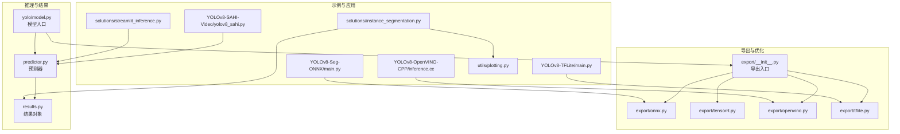
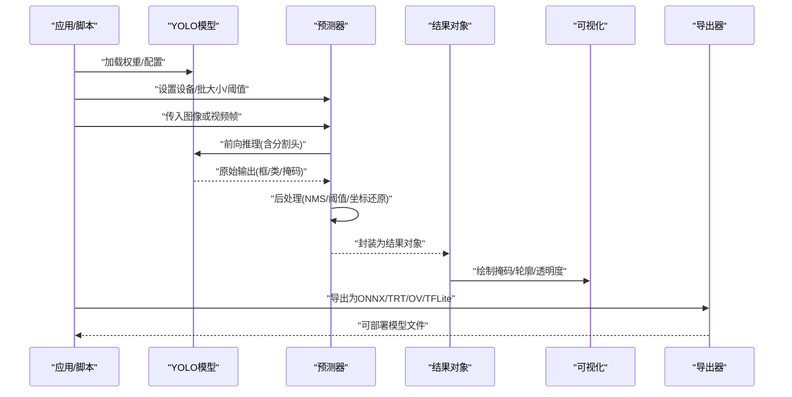
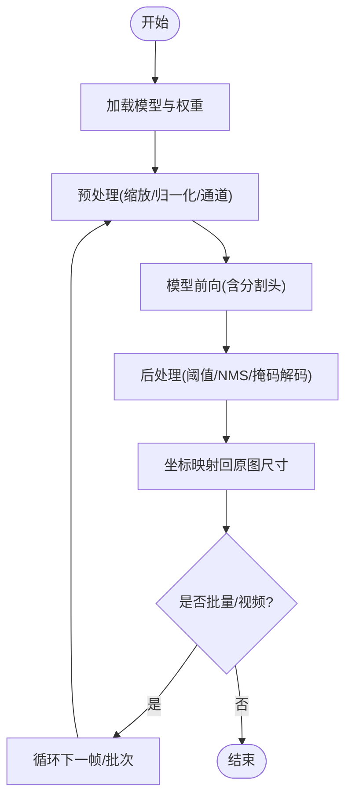
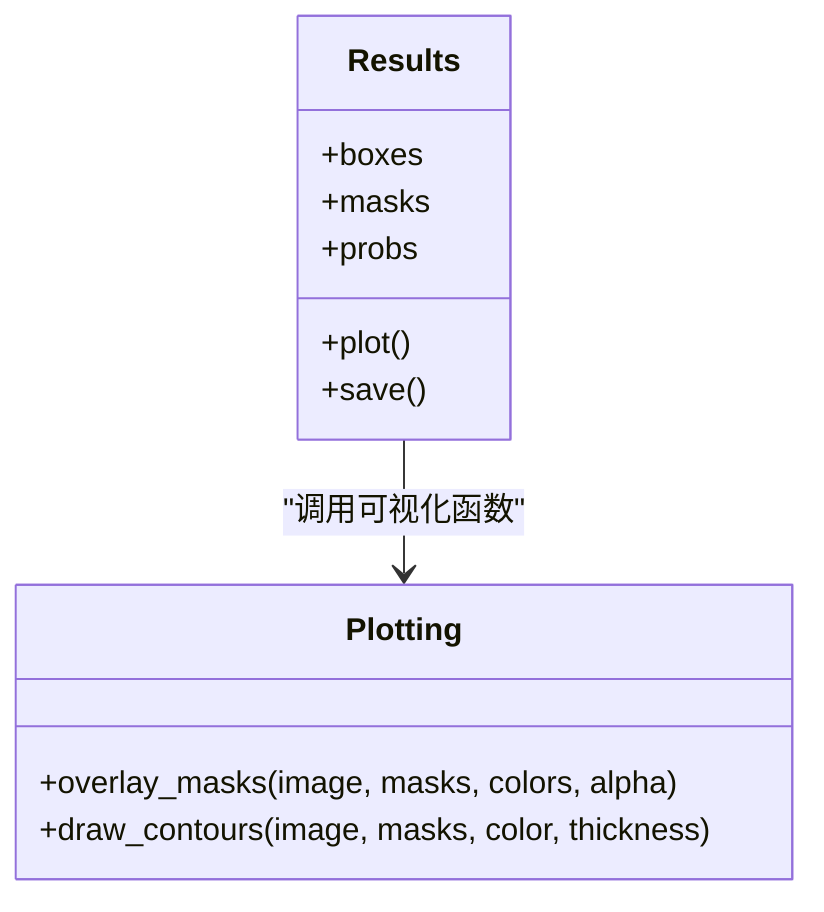
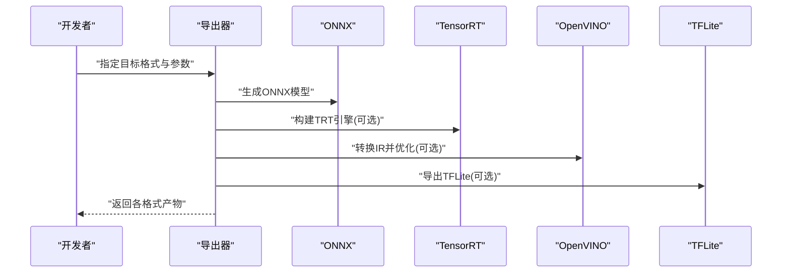
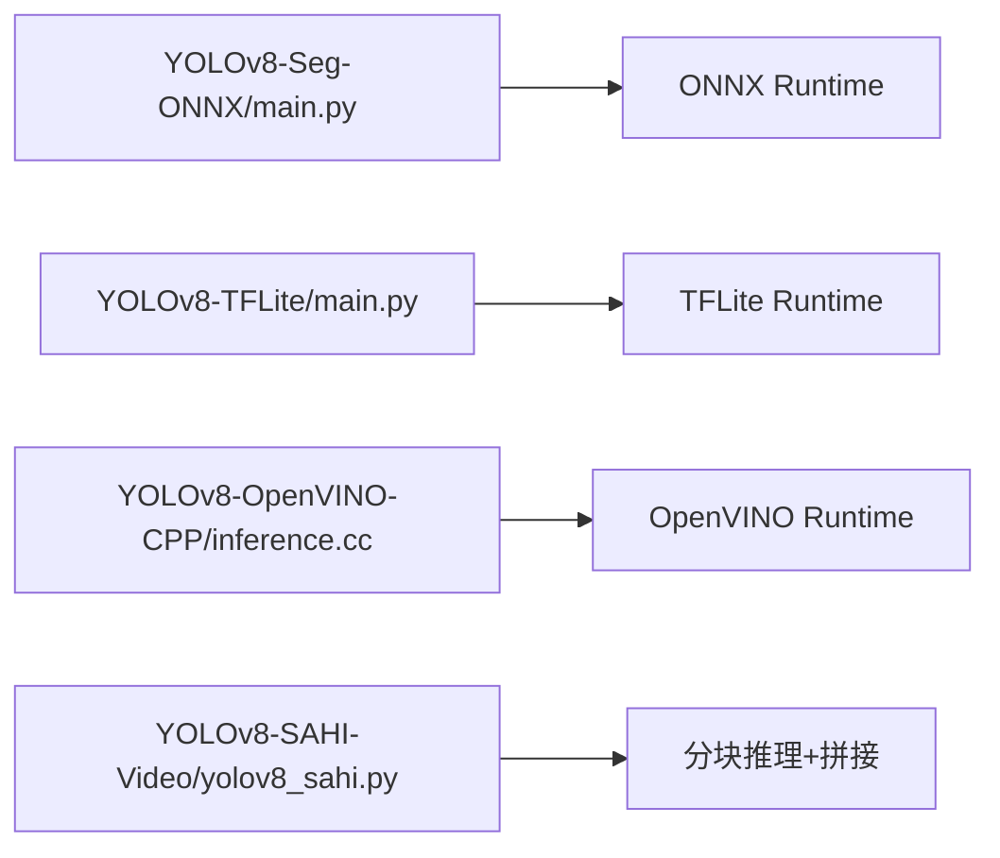
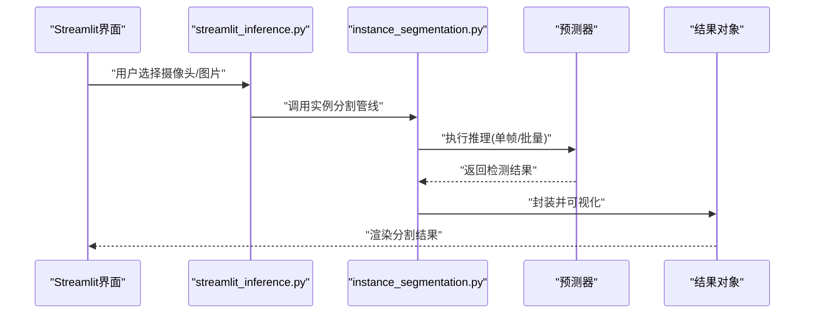
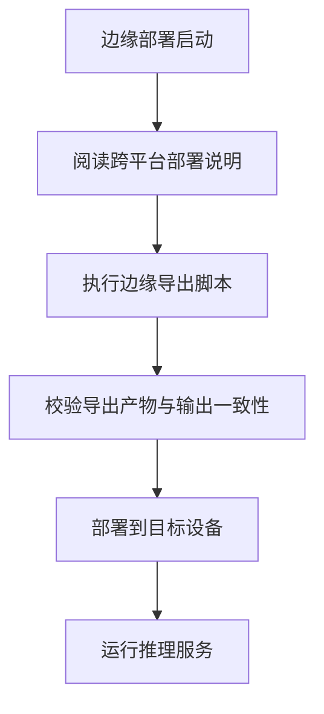
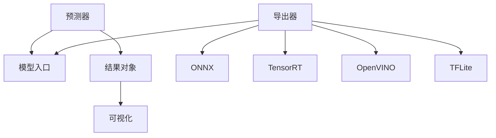

# 分割推理与部署

<cite>
**本文引用的文件**
- [ultralytics/engine/predictor.py](file://ultralytics/engine/predictor.py)
- [ultralytics/engine/results.py](file://ultralytics/engine/results.py)
- [ultralytics/models/yolo/model.py](file://ultralytics/models/yolo/model.py)
- [ultralytics/utils/export/__init__.py](file://ultralytics/utils/export/__init__.py)
- [ultralytics/utils/export/onnx.py](file://ultralytics/utils/export/onnx.py)
- [ultralytics/utils/export/tensorrt.py](file://ultralytics/utils/export/tensorrt.py)
- [ultralytics/utils/export/openvino.py](file://ultralytics/utils/export/openvino.py)
- [ultralytics/utils/export/tflite.py](file://ultralytics/utils/export/tflite.py)
- [examples/YOLOv8-Segmentation-ONNXRuntime-Python/main.py](file://examples/YOLOv8-Segmentation-ONNXRuntime-Python/main.py)
- [examples/YOLOv8-TFLite-Python/main.py](file://examples/YOLOv8-TFLite-Python/main.py)
- [examples/YOLOv8-OpenVINO-CPP-Inference/inference.cc](file://examples/YOLOv8-OpenVINO-CPP-Inference/inference.cc)
- [examples/YOLO-Master-Cross-Platform-Edge-Deployment/README.md](file://examples/YOLO-Master-Cross-Platform-Edge-Deployment/README.md)
- [examples/YOLO-Master-Edge-Deployment/export_edge_models.py](file://examples/YOLO-Master-Edge-Deployment/export_edge_models.py)
- [examples/YOLOv8-SAHI-Inference-Video/yolov8_sahi.py](file://examples/YOLOv8-SAHI-Inference-Video/yolov8_sahi.py)
- [ultralytics/solutions/streamlit_inference.py](file://ultralytics/solutions/streamlit_inference.py)
- [ultralytics/solutions/instance_segmentation.py](file://ultralytics/solutions/instance_segmentation.py)
- [ultralytics/utils/plotting.py](file://ultralytics/utils/plotting.py)
</cite>

## 目录
1. [简介](#简介)
2. [项目结构](#项目结构)
3. [核心组件](#核心组件)
4. [架构总览](#架构总览)
5. [详细组件分析](#详细组件分析)
6. [依赖关系分析](#依赖关系分析)
7. [性能考虑](#性能考虑)
8. [故障排查指南](#故障排查指南)
9. [结论](#结论)
10. [附录](#附录)

## 简介
本指南面向需要在生产环境中落地“实例分割”的工程师与研究者，围绕以下目标展开：
- 分割推理实现：单图、批量、视频流处理与优化策略
- 结果可视化：掩码叠加、轮廓绘制、透明度控制
- 多格式导出与优化：ONNX、TensorRT、OpenVINO、TFLite
- 边缘设备部署：移动端、嵌入式设备的性能优化
- 实时分割应用案例：端到端工作流与最佳实践

## 项目结构
仓库采用模块化组织方式，与分割推理和部署相关的关键位置如下：
- 推理引擎与结果对象：engine 模块提供预测器与结果封装
- 模型入口：models/yolo 提供统一模型接口
- 导出工具：utils/export 提供多后端导出能力
- 示例与方案：examples 与 solutions 提供多种运行形态（ONNX/TFLite/OpenVINO/C++/Python）
- 可视化：utils/plotting 提供绘图与可视化辅助

图表来源
- [ultralytics/engine/predictor.py](file://ultralytics/engine/predictor.py)
- [ultralytics/engine/results.py](file://ultralytics/engine/results.py)
- [ultralytics/models/yolo/model.py](file://ultralytics/models/yolo/model.py)
- [ultralytics/utils/export/__init__.py](file://ultralytics/utils/export/__init__.py)
- [ultralytics/utils/export/onnx.py](file://ultralytics/utils/export/onnx.py)
- [ultralytics/utils/export/tensorrt.py](file://ultralytics/utils/export/tensorrt.py)
- [ultralytics/utils/export/openvino.py](file://ultralytics/utils/export/openvino.py)
- [ultralytics/utils/export/tflite.py](file://ultralytics/utils/export/tflite.py)
- [examples/YOLOv8-Segmentation-ONNXRuntime-Python/main.py](file://examples/YOLOv8-Segmentation-ONNXRuntime-Python/main.py)
- [examples/YOLOv8-TFLite-Python/main.py](file://examples/YOLOv8-TFLite-Python/main.py)
- [examples/YOLOv8-OpenVINO-CPP-Inference/inference.cc](file://examples/YOLOv8-OpenVINO-CPP-Inference/inference.cc)
- [examples/YOLOv8-SAHI-Inference-Video/yolov8_sahi.py](file://examples/YOLOv8-SAHI-Inference-Video/yolov8_sahi.py)
- [ultralytics/solutions/streamlit_inference.py](file://ultralytics/solutions/streamlit_inference.py)
- [ultralytics/solutions/instance_segmentation.py](file://ultralytics/solutions/instance_segmentation.py)
- [ultralytics/utils/plotting.py](file://ultralytics/utils/plotting.py)

章节来源
- [ultralytics/engine/predictor.py](file://ultralytics/engine/predictor.py)
- [ultralytics/engine/results.py](file://ultralytics/engine/results.py)
- [ultralytics/models/yolo/model.py](file://ultralytics/models/yolo/model.py)
- [ultralytics/utils/export/__init__.py](file://ultralytics/utils/export/__init__.py)
- [ultralytics/utils/export/onnx.py](file://ultralytics/utils/export/onnx.py)
- [ultralytics/utils/export/tensorrt.py](file://ultralytics/utils/export/tensorrt.py)
- [ultralytics/utils/export/openvino.py](file://ultralytics/utils/export/openvino.py)
- [ultralytics/utils/export/tflite.py](file://ultralytics/utils/export/tflite.py)
- [examples/YOLOv8-Segmentation-ONNXRuntime-Python/main.py](file://examples/YOLOv8-Segmentation-ONNXRuntime-Python/main.py)
- [examples/YOLOv8-TFLite-Python/main.py](file://examples/YOLOv8-TFLite-Python/main.py)
- [examples/YOLOv8-OpenVINO-CPP-Inference/inference.cc](file://examples/YOLOv8-OpenVINO-CPP-Inference/inference.cc)
- [examples/YOLOv8-SAHI-Inference-Video/yolov8_sahi.py](file://examples/YOLOv8-SAHI-Inference-Video/yolov8_sahi.py)
- [ultralytics/solutions/streamlit_inference.py](file://ultralytics/solutions/streamlit_inference.py)
- [ultralytics/solutions/instance_segmentation.py](file://ultralytics/solutions/instance_segmentation.py)
- [ultralytics/utils/plotting.py](file://ultralytics/utils/plotting.py)

## 核心组件
- 预测器（Predictor）
  - 负责输入预处理、模型前向、后处理与结果组装。支持单张图像、批次图像与视频帧迭代。
  - 关键职责：设备选择、批大小管理、NMS/阈值过滤、掩码生成与坐标还原。
- 结果对象（Results）
  - 封装检测框、类别、置信度、掩码等输出；提供可视化与序列化方法。
- 模型入口（YOLO Model）
  - 统一加载权重、构建任务头（含分割头）、导出与推理的统一接口。
- 导出子系统（Export）
  - 将训练好的 PyTorch 模型转换为 ONNX、TensorRT、OpenVINO、TFLite 等运行时格式，并执行导出前检查与验证。

章节来源
- [ultralytics/engine/predictor.py](file://ultralytics/engine/predictor.py)
- [ultralytics/engine/results.py](file://ultralytics/engine/results.py)
- [ultralytics/models/yolo/model.py](file://ultralytics/models/yolo/model.py)
- [ultralytics/utils/export/__init__.py](file://ultralytics/utils/export/__init__.py)

## 架构总览
下图展示从模型到推理再到可视化的整体流程，以及多后端导出的路径。

图表来源
- [ultralytics/models/yolo/model.py](file://ultralytics/models/yolo/model.py)
- [ultralytics/engine/predictor.py](file://ultralytics/engine/predictor.py)
- [ultralytics/engine/results.py](file://ultralytics/engine/results.py)
- [ultralytics/utils/export/__init__.py](file://ultralytics/utils/export/__init__.py)

## 详细组件分析

### 组件A：分割推理流水线（单图/批量/视频）
- 单图推理
  - 输入预处理：缩放、归一化、通道顺序调整
  - 模型前向：获取分类、回归与分割分支输出
  - 后处理：置信度阈值、NMS、掩码解码、坐标映射回原图
- 批量推理
  - 动态批大小与内存复用，减少重复初始化开销
  - 注意显存峰值与吞吐权衡
- 视频流处理
  - 帧级循环读取、可选滑动窗口/分块（SAHI）提升小目标召回
  - 线程安全与队列缓冲避免丢帧

图表来源
- [ultralytics/engine/predictor.py](file://ultralytics/engine/predictor.py)
- [ultralytics/engine/results.py](file://ultralytics/engine/results.py)

章节来源
- [ultralytics/engine/predictor.py](file://ultralytics/engine/predictor.py)
- [ultralytics/engine/results.py](file://ultralytics/engine/results.py)

### 组件B：结果可视化（掩码叠加/轮廓/透明度）
- 掩码叠加：将每类的二值掩码按颜色混合到原图上，支持透明度参数控制可见性
- 轮廓绘制：基于掩码提取边界，绘制轮廓线以增强边缘感知
- 交互与保存：在 Notebook/Web 中渲染，或写入磁盘用于离线分析

图表来源
- [ultralytics/engine/results.py](file://ultralytics/engine/results.py)
- [ultralytics/utils/plotting.py](file://ultralytics/utils/plotting.py)

章节来源
- [ultralytics/engine/results.py](file://ultralytics/engine/results.py)
- [ultralytics/utils/plotting.py](file://ultralytics/utils/plotting.py)

### 组件C：多格式导出与优化（ONNX/TensorRT/OpenVINO/TFLite）
- ONNX
  - 导出静态/动态形状，支持算子兼容性与版本约束
  - 适合跨平台推理与二次优化
- TensorRT
  - 针对 NVIDIA GPU 的极致优化，需校准数据与精度选择（FP16/INT8）
- OpenVINO
  - 面向 CPU/Intel NPU 的优化，支持 IR 中间表示与模型优化器
- TFLite
  - 面向移动端/嵌入式，量化与算子子图优化

图表来源
- [ultralytics/utils/export/__init__.py](file://ultralytics/utils/export/__init__.py)
- [ultralytics/utils/export/onnx.py](file://ultralytics/utils/export/onnx.py)
- [ultralytics/utils/export/tensorrt.py](file://ultralytics/utils/export/tensorrt.py)
- [ultralytics/utils/export/openvino.py](file://ultralytics/utils/export/openvino.py)
- [ultralytics/utils/export/tflite.py](file://ultralytics/utils/export/tflite.py)

章节来源
- [ultralytics/utils/export/__init__.py](file://ultralytics/utils/export/__init__.py)
- [ultralytics/utils/export/onnx.py](file://ultralytics/utils/export/onnx.py)
- [ultralytics/utils/export/tensorrt.py](file://ultralytics/utils/export/tensorrt.py)
- [ultralytics/utils/export/openvino.py](file://ultralytics/utils/export/openvino.py)
- [ultralytics/utils/export/tflite.py](file://ultralytics/utils/export/tflite.py)

### 组件D：示例与实战（ONNX/TFLite/OpenVINO/C++/Python）
- ONNX Runtime（Python）
  - 使用示例脚本加载 ONNX 模型进行推理，演示输入准备与结果解析
- TFLite（Python）
  - 使用示例脚本加载 TFLite 模型，适合移动端快速验证
- OpenVINO（C++）
  - 使用 C++ 示例加载 OpenVINO IR 模型，适合服务端/嵌入式部署
- 视频分块推理（SAHI）
  - 对大图/高分辨率视频进行切片推理，再拼接结果，提升小目标召回

图表来源
- [examples/YOLOv8-Segmentation-ONNXRuntime-Python/main.py](file://examples/YOLOv8-Segmentation-ONNXRuntime-Python/main.py)
- [examples/YOLOv8-TFLite-Python/main.py](file://examples/YOLOv8-TFLite-Python/main.py)
- [examples/YOLOv8-OpenVINO-CPP-Inference/inference.cc](file://examples/YOLOv8-OpenVINO-CPP-Inference/inference.cc)
- [examples/YOLOv8-SAHI-Inference-Video/yolov8_sahi.py](file://examples/YOLOv8-SAHI-Inference-Video/yolov8_sahi.py)

章节来源
- [examples/YOLOv8-Segmentation-ONNXRuntime-Python/main.py](file://examples/YOLOv8-Segmentation-ONNXRuntime-Python/main.py)
- [examples/YOLOv8-TFLite-Python/main.py](file://examples/YOLOv8-TFLite-Python/main.py)
- [examples/YOLOv8-OpenVINO-CPP-Inference/inference.cc](file://examples/YOLOv8-OpenVINO-CPP-Inference/inference.cc)
- [examples/YOLOv8-SAHI-Inference-Video/yolov8_sahi.py](file://examples/YOLOv8-SAHI-Inference-Video/yolov8_sahi.py)

### 组件E：实时分割应用（Streamlit + 实例分割）
- Streamlit 推理页面
  - 提供摄像头/文件上传输入，实时显示分割结果
- 实例分割解决方案
  - 封装了常见后处理与可视化逻辑，便于快速搭建 Demo

图表来源
- [ultralytics/solutions/streamlit_inference.py](file://ultralytics/solutions/streamlit_inference.py)
- [ultralytics/solutions/instance_segmentation.py](file://ultralytics/solutions/instance_segmentation.py)
- [ultralytics/engine/predictor.py](file://ultralytics/engine/predictor.py)
- [ultralytics/engine/results.py](file://ultralytics/engine/results.py)

章节来源
- [ultralytics/solutions/streamlit_inference.py](file://ultralytics/solutions/streamlit_inference.py)
- [ultralytics/solutions/instance_segmentation.py](file://ultralytics/solutions/instance_segmentation.py)
- [ultralytics/engine/predictor.py](file://ultralytics/engine/predictor.py)
- [ultralytics/engine/results.py](file://ultralytics/engine/results.py)

### 组件F：边缘设备部署（跨平台与嵌入式）
- 跨平台部署说明
  - 文档介绍在不同平台（如 Jetson、macOS、ARM）上的部署要点与注意事项
- 边缘模型导出脚本
  - 提供自动化导出与校验流程，适配移动端/嵌入式环境

图表来源
- [examples/YOLO-Master-Cross-Platform-Edge-Deployment/README.md](file://examples/YOLO-Master-Cross-Platform-Edge-Deployment/README.md)
- [examples/YOLO-Master-Edge-Deployment/export_edge_models.py](file://examples/YOLO-Master-Edge-Deployment/export_edge_models.py)

章节来源
- [examples/YOLO-Master-Cross-Platform-Edge-Deployment/README.md](file://examples/YOLO-Master-Cross-Platform-Edge-Deployment/README.md)
- [examples/YOLO-Master-Edge-Deployment/export_edge_models.py](file://examples/YOLO-Master-Edge-Deployment/export_edge_models.py)

## 依赖关系分析
- 组件耦合
  - 预测器依赖模型入口与结果对象；结果对象依赖可视化模块
  - 导出器独立于推理链路，但共享模型结构与权重
- 外部依赖
  - ONNX Runtime、TensorRT、OpenVINO、TFLite 运行时库
  - 图像处理与可视化库（如 OpenCV、Matplotlib）
- 潜在循环依赖
  - 导出与推理解耦良好，未见明显循环依赖

图表来源
- [ultralytics/engine/predictor.py](file://ultralytics/engine/predictor.py)
- [ultralytics/engine/results.py](file://ultralytics/engine/results.py)
- [ultralytics/models/yolo/model.py](file://ultralytics/models/yolo/model.py)
- [ultralytics/utils/export/__init__.py](file://ultralytics/utils/export/__init__.py)

章节来源
- [ultralytics/engine/predictor.py](file://ultralytics/engine/predictor.py)
- [ultralytics/engine/results.py](file://ultralytics/engine/results.py)
- [ultralytics/models/yolo/model.py](file://ultralytics/models/yolo/model.py)
- [ultralytics/utils/export/__init__.py](file://ultralytics/utils/export/__init__.py)

## 性能考虑
- 推理阶段
  - 合理设置 batch size，平衡吞吐与延迟
  - 使用半精度（FP16）或 INT8 量化（在支持的运行时上）
  - 预分配缓冲区与复用对象，减少 GC/内存抖动
- 视频流
  - 使用多线程/异步 I/O 读取帧，避免阻塞推理
  - 对高分辨率场景采用分块推理（SAHI），降低单次计算压力
- 导出优化
  - ONNX：固定输入形状或使用动态形状时谨慎评估兼容性
  - TensorRT：启用 FP16/INT8，必要时进行校准
  - OpenVINO：使用模型优化器与 IR 缓存
  - TFLite：启用量化与算子融合

[本节为通用指导，不直接分析具体文件]

## 故障排查指南
- 导出失败
  - 检查算子支持与版本约束（ONNX opset）
  - 确认输入形状与动态维度是否符合目标运行时要求
- 推理异常
  - 核对预处理步骤（尺寸、归一化、通道顺序）
  - 检查阈值与 NMS 参数是否导致漏检/误检
- 可视化问题
  - 掩码尺寸与原图不一致会导致叠加错位
  - 透明度参数过大可能使结果不可见

章节来源
- [ultralytics/utils/export/__init__.py](file://ultralytics/utils/export/__init__.py)
- [ultralytics/engine/predictor.py](file://ultralytics/engine/predictor.py)
- [ultralytics/engine/results.py](file://ultralytics/engine/results.py)
- [ultralytics/utils/plotting.py](file://ultralytics/utils/plotting.py)

## 结论
通过统一的模型入口与预测器，结合多格式导出与丰富的示例，本项目提供了从开发到部署的完整分割推理链路。建议在生产环境中：
- 优先完成 ONNX 导出与验证，再根据目标平台选择 TensorRT/OpenVINO/TFLite
- 在视频场景中引入分块推理与线程化 I/O，确保稳定实时
- 利用可视化与结果对象简化调试与交付

[本节为总结，不直接分析具体文件]

## 附录
- 参考示例路径
  - ONNX Runtime（Python）：[examples/YOLOv8-Segmentation-ONNXRuntime-Python/main.py](file://examples/YOLOv8-Segmentation-ONNXRuntime-Python/main.py)
  - TFLite（Python）：[examples/YOLOv8-TFLite-Python/main.py](file://examples/YOLOv8-TFLite-Python/main.py)
  - OpenVINO（C++）：[examples/YOLOv8-OpenVINO-CPP-Inference/inference.cc](file://examples/YOLOv8-OpenVINO-CPP-Inference/inference.cc)
  - 视频分块推理（SAHI）：[examples/YOLOv8-SAHI-Inference-Video/yolov8_sahi.py](file://examples/YOLOv8-SAHI-Inference-Video/yolov8_sahi.py)
  - 实时分割（Streamlit）：[ultralytics/solutions/streamlit_inference.py](file://ultralytics/solutions/streamlit_inference.py)
  - 实例分割解决方案：[ultralytics/solutions/instance_segmentation.py](file://ultralytics/solutions/instance_segmentation.py)
  - 边缘部署说明与脚本：[examples/YOLO-Master-Cross-Platform-Edge-Deployment/README.md](file://examples/YOLO-Master-Cross-Platform-Edge-Deployment/README.md)、[examples/YOLO-Master-Edge-Deployment/export_edge_models.py](file://examples/YOLO-Master-Edge-Deployment/export_edge_models.py)