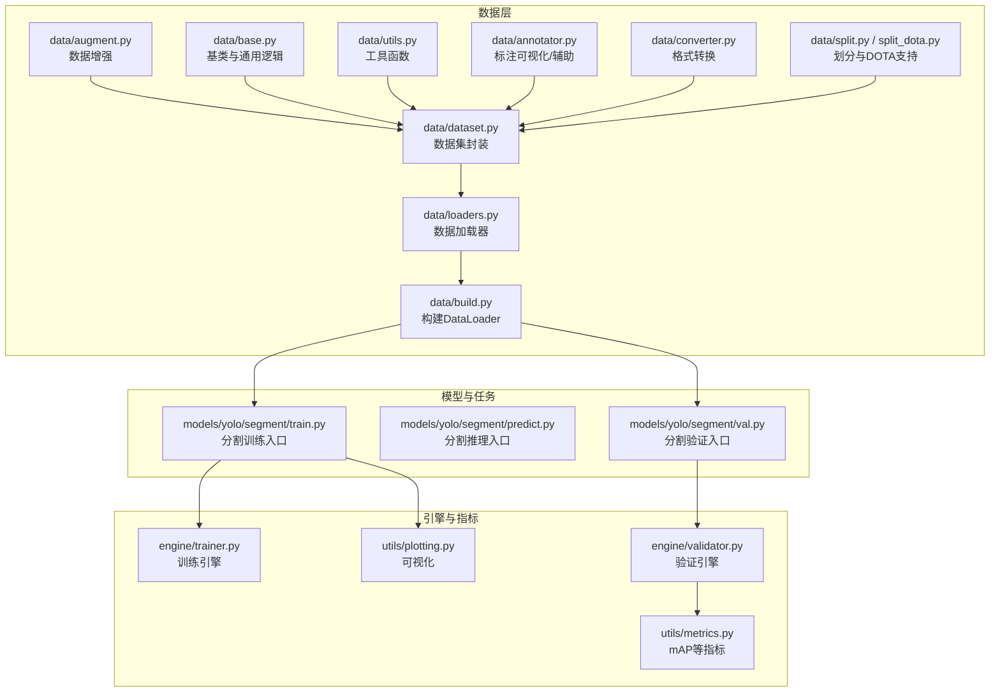
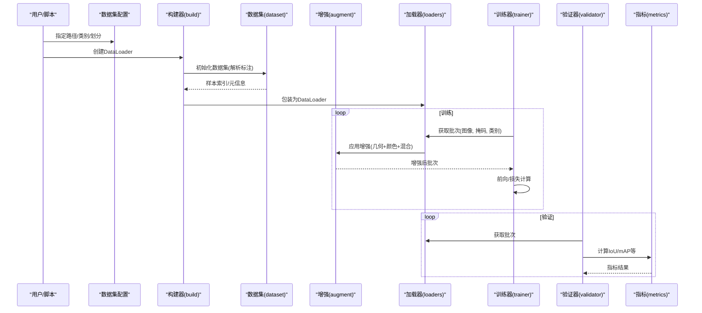
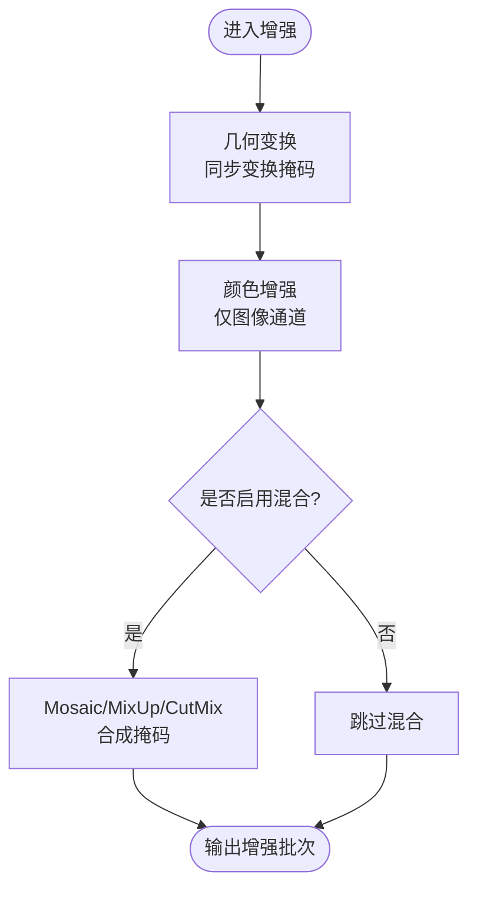
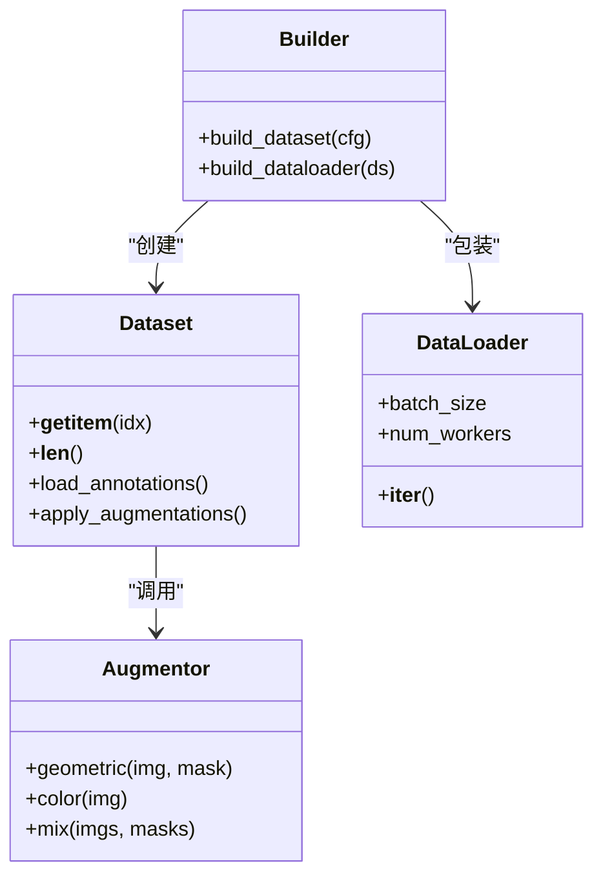
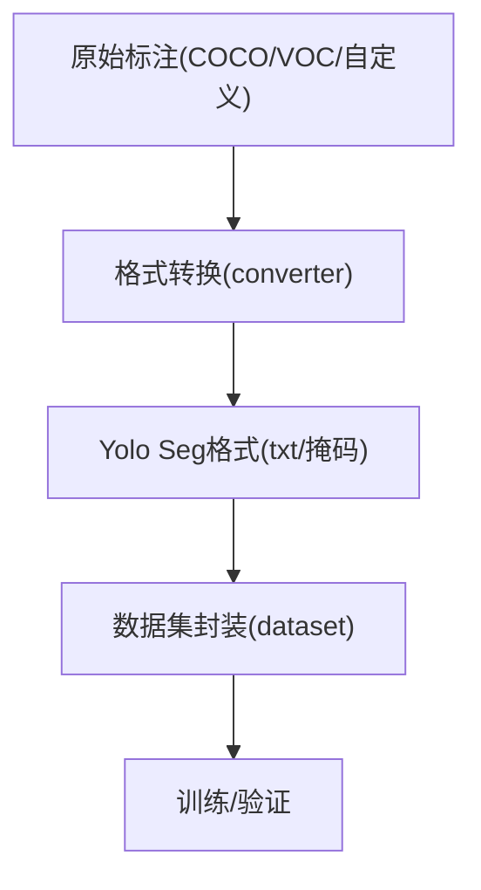
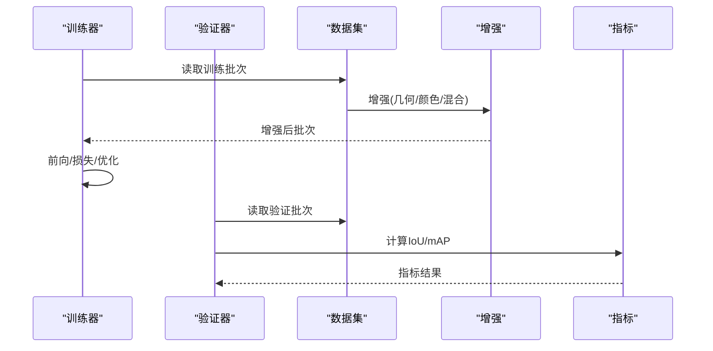
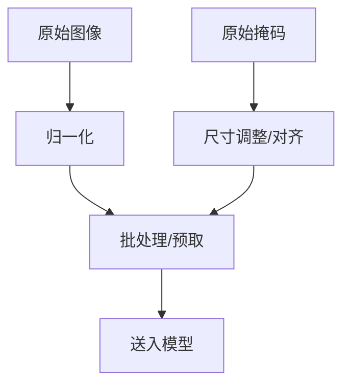
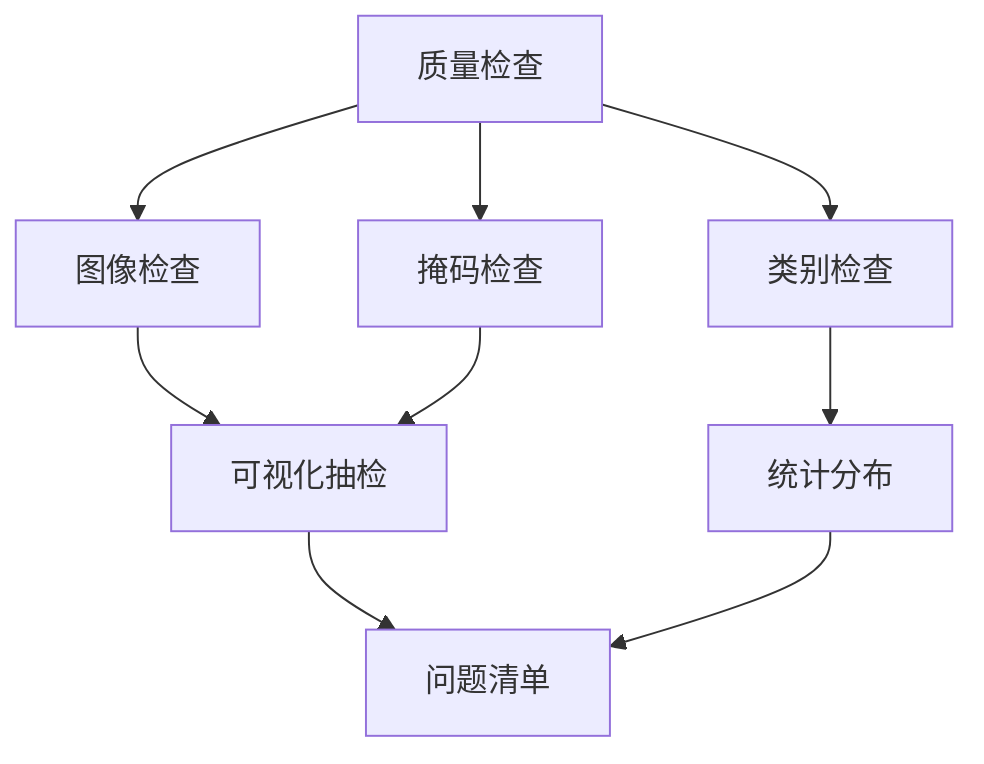
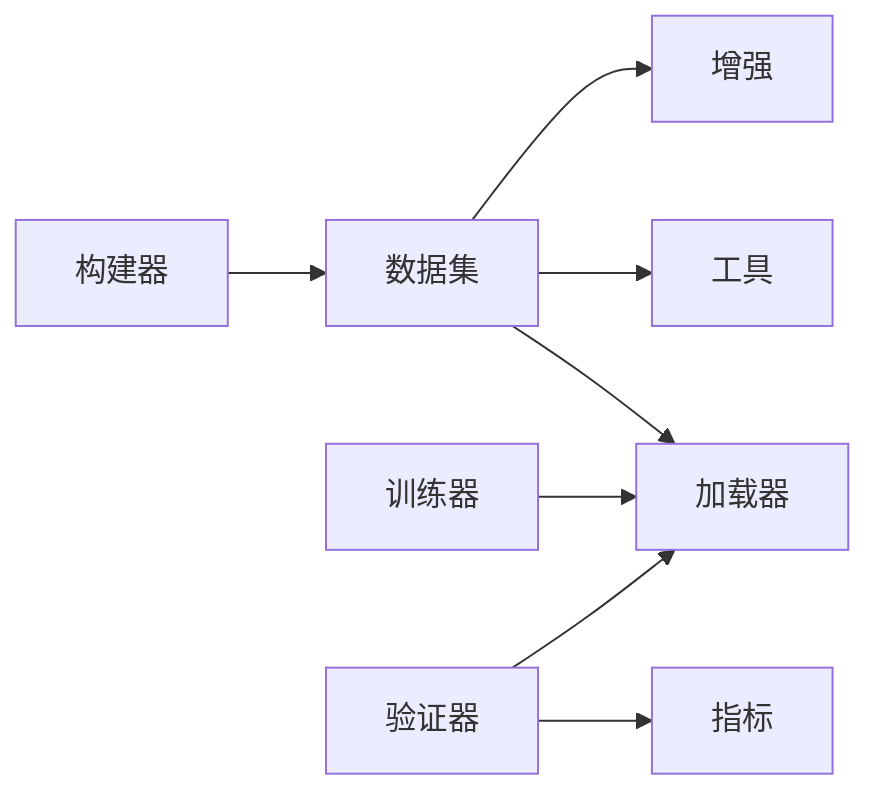

# 分割数据准备与标注

<cite>
**本文引用的文件**
- [ultralytics/data/augment.py](file://ultralytics/data/augment.py)
- [ultralytics/data/dataset.py](file://ultralytics/data/dataset.py)
- [ultralytics/data/loaders.py](file://ultralytics/data/loaders.py)
- [ultralytics/data/base.py](file://ultralytics/data/base.py)
- [ultralytics/data/utils.py](file://ultralytics/data/utils.py)
- [ultralytics/data/annotator.py](file://ultralytics/data/annotator.py)
- [ultralytics/data/build.py](file://ultralytics/data/build.py)
- [ultralytics/data/converter.py](file://ultralytics/data/converter.py)
- [ultralytics/data/split.py](file://ultralytics/data/split.py)
- [ultralytics/data/split_dota.py](file://ultralytics/data/split_dota.py)
- [ultralytics/models/yolo/segment/train.py](file://ultralytics/models/yolo/segment/train.py)
- [ultralytics/models/yolo/segment/predict.py](file://ultralytics/models/yolo/segment/predict.py)
- [ultralytics/models/yolo/segment/val.py](file://ultralytics/models/yolo/segment/val.py)
- [ultralytics/engine/trainer.py](file://ultralytics/engine/trainer.py)
- [ultralytics/engine/validator.py](file://ultralytics/engine/validator.py)
- [ultralytics/utils/plotting.py](file://ultralytics/utils/plotting.py)
- [ultralytics/utils/metrics.py](file://ultralytics/utils/metrics.py)
- [scripts/convert_voc.py](file://scripts/convert_voc.py)
- [scripts/VOC_sub.yaml](file://scripts/VOC_sub.yaml)
- [scripts/_voc_local.yaml](file://scripts/_voc_local.yaml)
- [scripts/_voc_local_v0_13_15.yaml](file://scripts/_voc_local_v0_13_15.yaml)
- [docs/en/guides/coco-to-yolo.md](file://docs/en/guides/coco-to-yolo.md)
- [docs/en/guides/preprocessing-annotated-data.md](file://docs/en/guides/preprocessing-annotated-data.md)
- [docs/en/guides/yolo-data-augmentation.md](file://docs/en/guides/yolo-data-augmentation.md)
- [docs/en/guides/data-collection-and-annotation.md](file://docs/en/guides/data-collection-and-annotation.md)
- [docs/en/datasets/segment/index.md](file://docs/en/datasets/segment/index.md)
- [docs/en/datasets/segment/coco8-seg.md](file://docs/en/datasets/segment/coco8-seg.md)
- [docs/en/datasets/segment/voc-seg.md](file://docs/en/datasets/segment/voc-seg.md)
- [docs/en/datasets/segment/custom-seg.md](file://docs/en/datasets/segment/custom-seg.md)
</cite>

## 目录
1. [简介](#简介)
2. [项目结构](#项目结构)
3. [核心组件](#核心组件)
4. [架构总览](#架构总览)
5. [详细组件分析](#详细组件分析)
6. [依赖关系分析](#依赖关系分析)
7. [性能考虑](#性能考虑)
8. [故障排查指南](#故障排查指南)
9. [结论](#结论)
10. [附录](#附录)

## 简介
本指南聚焦于实例分割任务的数据准备与标注，覆盖以下主题：
- 常见分割数据集格式规范（COCO Segmentation、PASCAL VOC、自定义数据集）
- 图像分割标注工具使用建议与标注标准
- 数据增强在分割任务中的应用（几何变换、颜色增强、混合策略）
- 数据预处理流程（归一化、尺寸调整、批量处理优化）
- 数据质量检查与验证方法

本指南同时结合代码仓库中的数据处理管线、增强实现、训练/验证入口以及文档说明，提供从“标注到训练”的端到端实践路径。

## 项目结构
与分割数据准备相关的核心模块主要位于 ultralytics/data 与 ultralytics/models/yolo/segment，配套脚本与文档分别位于 scripts 与 docs。

图表来源
- [ultralytics/data/augment.py](file://ultralytics/data/augment.py)
- [ultralytics/data/dataset.py](file://ultralytics/data/dataset.py)
- [ultralytics/data/loaders.py](file://ultralytics/data/loaders.py)
- [ultralytics/data/base.py](file://ultralytics/data/base.py)
- [ultralytics/data/utils.py](file://ultralytics/data/utils.py)
- [ultralytics/data/annotator.py](file://ultralytics/data/annotator.py)
- [ultralytics/data/build.py](file://ultralytics/data/build.py)
- [ultralytics/data/converter.py](file://ultralytics/data/converter.py)
- [ultralytics/data/split.py](file://ultralytics/data/split.py)
- [ultralytics/data/split_dota.py](file://ultralytics/data/split_dota.py)
- [ultralytics/models/yolo/segment/train.py](file://ultralytics/models/yolo/segment/train.py)
- [ultralytics/models/yolo/segment/predict.py](file://ultralytics/models/yolo/segment/predict.py)
- [ultralytics/models/yolo/segment/val.py](file://ultralytics/models/yolo/segment/val.py)
- [ultralytics/engine/trainer.py](file://ultralytics/engine/trainer.py)
- [ultralytics/engine/validator.py](file://ultralytics/engine/validator.py)
- [ultralytics/utils/metrics.py](file://ultralytics/utils/metrics.py)
- [ultralytics/utils/plotting.py](file://ultralytics/utils/plotting.py)

章节来源
- [ultralytics/data/augment.py](file://ultralytics/data/augment.py)
- [ultralytics/data/dataset.py](file://ultralytics/data/dataset.py)
- [ultralytics/data/build.py](file://ultralytics/data/build.py)
- [ultralytics/models/yolo/segment/train.py](file://ultralytics/models/yolo/segment/train.py)
- [ultralytics/models/yolo/segment/val.py](file://ultralytics/models/yolo/segment/val.py)

## 核心组件
- 数据增强：统一封装几何与颜色增强、Mosaic/MixUp等混合策略，并保证掩码同步变换。
- 数据集封装：抽象读取、解析、缓存、索引与批处理，适配多种标注格式。
- 数据加载器：基于PyTorch DataLoader，提供多进程、预取与内存映射优化。
- 构建器：根据配置自动组装Dataset与DataLoader，管理类别映射与标签路径。
- 转换器：将外部格式（如VOC、COCO JSON）转换为内部Yolo格式或目标格式。
- 划分工具：按任务需求进行随机/分层划分，支持DOTA等旋转框场景。
- 训练/验证入口：分割任务的训练与验证流程，集成增强、损失计算与指标统计。

章节来源
- [ultralytics/data/augment.py](file://ultralytics/data/augment.py)
- [ultralytics/data/dataset.py](file://ultralytics/data/dataset.py)
- [ultralytics/data/loaders.py](file://ultralytics/data/loaders.py)
- [ultralytics/data/build.py](file://ultralytics/data/build.py)
- [ultralytics/data/converter.py](file://ultralytics/data/converter.py)
- [ultralytics/data/split.py](file://ultralytics/data/split.py)
- [ultralytics/models/yolo/segment/train.py](file://ultralytics/models/yolo/segment/train.py)
- [ultralytics/models/yolo/segment/val.py](file://ultralytics/models/yolo/segment/val.py)

## 架构总览
下图展示从“原始标注”到“训练/验证”的关键数据流与组件交互。

图表来源
- [ultralytics/data/build.py](file://ultralytics/data/build.py)
- [ultralytics/data/dataset.py](file://ultralytics/data/dataset.py)
- [ultralytics/data/augment.py](file://ultralytics/data/augment.py)
- [ultralytics/data/loaders.py](file://ultralytics/data/loaders.py)
- [ultralytics/engine/trainer.py](file://ultralytics/engine/trainer.py)
- [ultralytics/engine/validator.py](file://ultralytics/engine/validator.py)
- [ultralytics/utils/metrics.py](file://ultralytics/utils/metrics.py)

## 详细组件分析

### 数据增强（几何/颜色/混合）
- 几何变换：缩放、平移、仿射、翻转、裁剪等，需对掩码执行相同空间变换，保持像素级对齐。
- 颜色增强：亮度、对比度、饱和度、色调、噪声等，仅作用于图像通道，不改变掩码。
- 混合策略：Mosaic、MixUp/CutMix等，在拼接/融合时需要对掩码做对应合成，确保边界一致。
- 概率与强度：通过参数控制增强概率与强度范围，避免过度破坏小目标或细粒度边界。

图表来源
- [ultralytics/data/augment.py](file://ultralytics/data/augment.py)

章节来源
- [ultralytics/data/augment.py](file://ultralytics/data/augment.py)
- [docs/en/guides/yolo-data-augmentation.md](file://docs/en/guides/yolo-data-augmentation.md)

### 数据集封装与加载
- 数据集封装：负责解析不同格式的标注（COCO JSON、VOC XML/YAML、YOLO txt），建立图像-掩码-类别映射，并提供索引访问。
- 数据加载器：基于PyTorch DataLoader，支持多进程、预取、pin_memory等，提升吞吐。
- 构建器：根据配置文件自动选择数据集类型、类别映射、路径解析与批处理策略。

图表来源
- [ultralytics/data/dataset.py](file://ultralytics/data/dataset.py)
- [ultralytics/data/loaders.py](file://ultralytics/data/loaders.py)
- [ultralytics/data/build.py](file://ultralytics/data/build.py)
- [ultralytics/data/augment.py](file://ultralytics/data/augment.py)

章节来源
- [ultralytics/data/dataset.py](file://ultralytics/data/dataset.py)
- [ultralytics/data/loaders.py](file://ultralytics/data/loaders.py)
- [ultralytics/data/build.py](file://ultralytics/data/build.py)

### 格式转换与标注工具
- 转换器：提供将外部格式（如VOC、COCO JSON）转换为内部Yolo格式或目标格式的能力，便于统一训练管线。
- 标注工具建议：
  - 官方推荐工具：Roboflow、CVAT、Label Studio、MakeSense.ai等，导出为COCO JSON或VOC XML/YAML。
  - 标注标准：
    - COCO Segmentation：对象级多边形/轮廓点集，包含类别id、bbox、segmentation坐标等字段。
    - PASCAL VOC：XML中定义polygon/contour或rle编码；也可用YAML描述类别与路径。
    - 自定义数据集：建议遵循COCO或YOLO Seg格式，明确类别映射与坐标约定（归一化或像素）。
- 转换脚本：仓库提供VOC转Yolo示例脚本与相关配置，便于迁移历史数据。

图表来源
- [ultralytics/data/converter.py](file://ultralytics/data/converter.py)
- [scripts/convert_voc.py](file://scripts/convert_voc.py)
- [docs/en/guides/coco-to-yolo.md](file://docs/en/guides/coco-to-yolo.md)

章节来源
- [ultralytics/data/converter.py](file://ultralytics/data/converter.py)
- [scripts/convert_voc.py](file://scripts/convert_voc.py)
- [docs/en/guides/coco-to-yolo.md](file://docs/en/guides/coco-to-yolo.md)
- [docs/en/datasets/segment/coco8-seg.md](file://docs/en/datasets/segment/coco8-seg.md)
- [docs/en/datasets/segment/voc-seg.md](file://docs/en/datasets/segment/voc-seg.md)
- [docs/en/datasets/segment/custom-seg.md](file://docs/en/datasets/segment/custom-seg.md)

### 训练与验证流程（分割）
- 训练入口：加载数据集与增强，执行前向传播、损失计算与反向传播，记录日志与权重保存。
- 验证入口：在验证集上计算IoU、mAP等指标，生成可视化结果与报告。
- 指标与可视化：使用metrics计算精度与召回，plotting生成掩码叠加图与曲线。

图表来源
- [ultralytics/models/yolo/segment/train.py](file://ultralytics/models/yolo/segment/train.py)
- [ultralytics/models/yolo/segment/val.py](file://ultralytics/models/yolo/segment/val.py)
- [ultralytics/engine/trainer.py](file://ultralytics/engine/trainer.py)
- [ultralytics/engine/validator.py](file://ultralytics/engine/validator.py)
- [ultralytics/utils/metrics.py](file://ultralytics/utils/metrics.py)

章节来源
- [ultralytics/models/yolo/segment/train.py](file://ultralytics/models/yolo/segment/train.py)
- [ultralytics/models/yolo/segment/val.py](file://ultralytics/models/yolo/segment/val.py)
- [ultralytics/engine/trainer.py](file://ultralytics/engine/trainer.py)
- [ultralytics/engine/validator.py](file://ultralytics/engine/validator.py)
- [ultralytics/utils/metrics.py](file://ultralytics/utils/metrics.py)

### 数据预处理流程
- 图像归一化：按通道均值与方差标准化，稳定训练收敛。
- 尺寸调整：Resize/Pad/Letterbox等，保持纵横比的同时适配模型输入尺寸。
- 批量处理优化：多进程加载、预取、pin_memory、内存映射，减少IO瓶颈。
- 掩码处理：与图像同步缩放与裁剪，必要时二值化与形态学清理。

图表来源
- [ultralytics/data/augment.py](file://ultralytics/data/augment.py)
- [ultralytics/data/dataset.py](file://ultralytics/data/dataset.py)
- [ultralytics/data/loaders.py](file://ultralytics/data/loaders.py)

章节来源
- [ultralytics/data/augment.py](file://ultralytics/data/augment.py)
- [ultralytics/data/dataset.py](file://ultralytics/data/dataset.py)
- [ultralytics/data/loaders.py](file://ultralytics/data/loaders.py)
- [docs/en/guides/preprocessing-annotated-data.md](file://docs/en/guides/preprocessing-annotated-data.md)

### 数据质量检查与验证
- 基本检查：
  - 图像完整性：存在性、可读性、分辨率一致性。
  - 掩码有效性：非空区域比例、连通域数量、边界合理性。
  - 类别一致性：类别ID与类别表匹配，无越界。
- 统计与可视化：
  - 类别分布直方图、目标大小分布、长宽比分布。
  - 掩码叠加可视化，人工抽检异常样本。
- 自动化校验：
  - 利用annotator与plotting进行批量可视化与错误定位。
  - 使用metrics在验证集上进行快速评估，发现系统性偏差。

图表来源
- [ultralytics/data/annotator.py](file://ultralytics/data/annotator.py)
- [ultralytics/utils/plotting.py](file://ultralytics/utils/plotting.py)
- [ultralytics/utils/metrics.py](file://ultralytics/utils/metrics.py)

章节来源
- [ultralytics/data/annotator.py](file://ultralytics/data/annotator.py)
- [ultralytics/utils/plotting.py](file://ultralytics/utils/plotting.py)
- [ultralytics/utils/metrics.py](file://ultralytics/utils/metrics.py)
- [docs/en/guides/data-collection-and-annotation.md](file://docs/en/guides/data-collection-and-annotation.md)

## 依赖关系分析
- 组件耦合：
  - 构建器依赖数据集与加载器，数据集依赖增强与工具函数。
  - 训练/验证入口依赖数据集与指标，形成闭环。
- 外部依赖：
  - PyTorch DataLoader、NumPy/OpenCV用于图像处理。
  - 可选：多进程、GPU加速、内存映射。
- 潜在循环依赖：
  - 应避免在增强模块中直接导入训练/验证模块，保持单向依赖。

图表来源
- [ultralytics/data/build.py](file://ultralytics/data/build.py)
- [ultralytics/data/dataset.py](file://ultralytics/data/dataset.py)
- [ultralytics/data/augment.py](file://ultralytics/data/augment.py)
- [ultralytics/data/loaders.py](file://ultralytics/data/loaders.py)
- [ultralytics/engine/trainer.py](file://ultralytics/engine/trainer.py)
- [ultralytics/engine/validator.py](file://ultralytics/engine/validator.py)
- [ultralytics/utils/metrics.py](file://ultralytics/utils/metrics.py)

章节来源
- [ultralytics/data/build.py](file://ultralytics/data/build.py)
- [ultralytics/data/dataset.py](file://ultralytics/data/dataset.py)
- [ultralytics/data/augment.py](file://ultralytics/data/augment.py)
- [ultralytics/data/loaders.py](file://ultralytics/data/loaders.py)
- [ultralytics/engine/trainer.py](file://ultralytics/engine/trainer.py)
- [ultralytics/engine/validator.py](file://ultralytics/engine/validator.py)
- [ultralytics/utils/metrics.py](file://ultralytics/utils/metrics.py)

## 性能考虑
- IO优化：多进程加载、预取、pin_memory、磁盘缓存与内存映射。
- 增强开销：合理设置增强概率与强度，避免过强导致训练不稳定。
- 批大小与尺寸：根据显存与目标精度权衡，优先保证掩码与图像对齐。
- 数据管道监控：记录每步耗时，定位瓶颈（解码、增强、批组装）。

[本节为通用指导，无需特定文件引用]

## 故障排查指南
- 常见问题：
  - 掩码与图像尺寸不一致：检查增强与尺寸调整步骤是否同步。
  - 类别ID越界：核对类别映射与标注文件。
  - 多进程崩溃：降低num_workers或检查数据路径权限。
  - 指标异常：确认验证集划分与类别一致性。
- 调试手段：
  - 使用annotator与plotting可视化关键样本。
  - 打印批次形状与数据类型，确保张量维度正确。
  - 逐步禁用增强以定位问题来源。

章节来源
- [ultralytics/data/annotator.py](file://ultralytics/data/annotator.py)
- [ultralytics/utils/plotting.py](file://ultralytics/utils/plotting.py)
- [ultralytics/data/dataset.py](file://ultralytics/data/dataset.py)
- [ultralytics/data/augment.py](file://ultralytics/data/augment.py)

## 结论
通过统一的增强、数据集封装与加载器，配合严格的格式转换与质量检查，可高效完成分割任务的数据准备。建议在项目初期建立标准化的标注规范与自动化校验流程，并在训练中持续监控数据管道性能与指标稳定性。

[本节为总结，无需特定文件引用]

## 附录
- 参考文档：
  - 数据集格式与示例：coco8-seg、voc-seg、custom-seg
  - 数据增强与预处理指南
  - 数据收集与标注最佳实践
  - COCO到Yolo转换指南

章节来源
- [docs/en/datasets/segment/coco8-seg.md](file://docs/en/datasets/segment/coco8-seg.md)
- [docs/en/datasets/segment/voc-seg.md](file://docs/en/datasets/segment/voc-seg.md)
- [docs/en/datasets/segment/custom-seg.md](file://docs/en/datasets/segment/custom-seg.md)
- [docs/en/guides/yolo-data-augmentation.md](file://docs/en/guides/yolo-data-augmentation.md)
- [docs/en/guides/preprocessing-annotated-data.md](file://docs/en/guides/preprocessing-annotated-data.md)
- [docs/en/guides/data-collection-and-annotation.md](file://docs/en/guides/data-collection-and-annotation.md)
- [docs/en/guides/coco-to-yolo.md](file://docs/en/guides/coco-to-yolo.md)