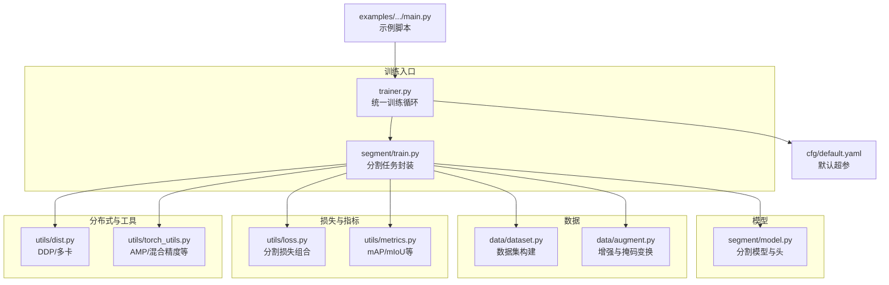
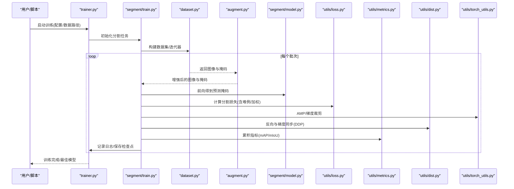
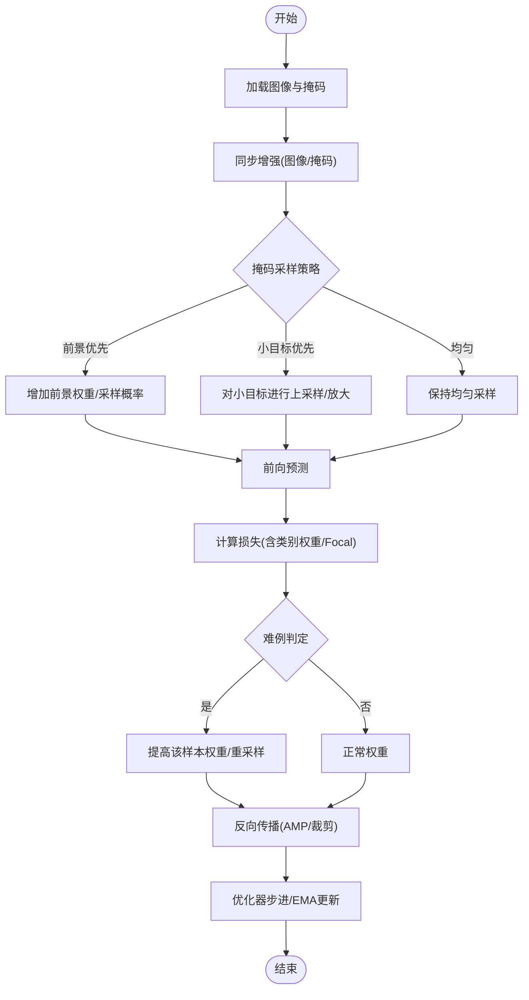
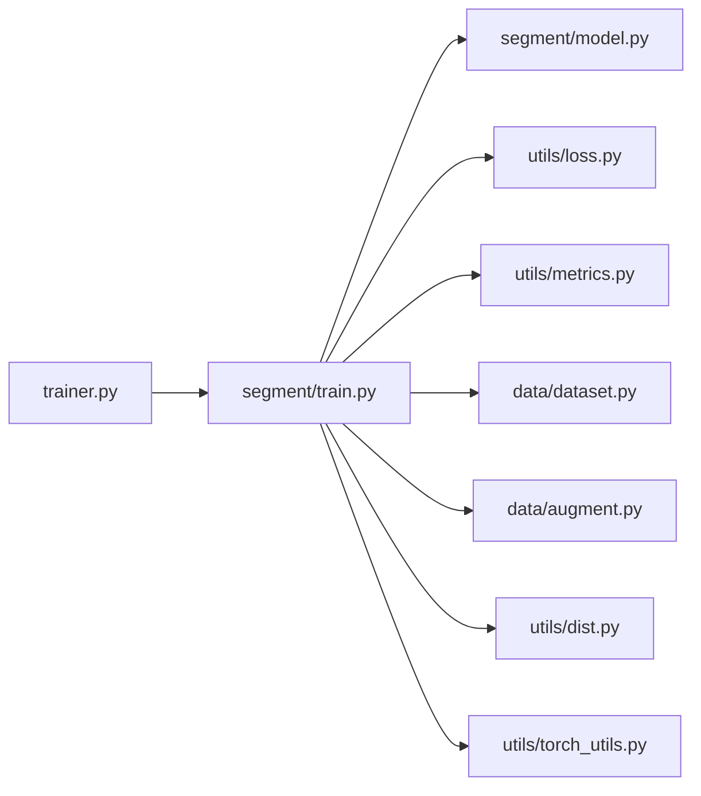

# 分割模型训练流程

<cite>
**本文引用的文件**
- [ultralytics/engine/trainer.py](file://ultralytics/engine/trainer.py)
- [ultralytics/models/yolo/segment/train.py](file://ultralytics/models/yolo/segment/train.py)
- [ultralytics/models/yolo/segment/model.py](file://ultralytics/models/yolo/segment/model.py)
- [ultralytics/data/dataset.py](file://ultralytics/data/dataset.py)
- [ultralytics/data/augment.py](file://ultralytics/data/augment.py)
- [ultralytics/utils/loss.py](file://ultralytics/utils/loss.py)
- [ultralytics/utils/metrics.py](file://ultralytics/utils/metrics.py)
- [ultralytics/utils/dist.py](file://ultralytics/utils/dist.py)
- [ultralytics/utils/torch_utils.py](file://ultralytics/utils/torch_utils.py)
- [ultralytics/cfg/default.yaml](file://ultralytics/cfg/default.yaml)
- [examples/YOLOv8-Segmentation-ONNXRuntime-Python/main.py](file://examples/YOLOv8-Segmentation-ONNXRuntime-Python/main.py)
</cite>

## 目录
1. [简介](#简介)
2. [项目结构](#项目结构)
3. [核心组件](#核心组件)
4. [架构总览](#架构总览)
5. [详细组件分析](#详细组件分析)
6. [依赖关系分析](#依赖关系分析)
7. [性能考虑](#性能考虑)
8. [故障排查指南](#故障排查指南)
9. [结论](#结论)
10. [附录](#附录)

## 简介
本文件面向在 YOLO-Master 框架下开展实例分割与语义分割训练的工程师与研究团队，系统化梳理从数据准备、训练配置、优化器与学习率调度、掩码采样与难例挖掘、类别不平衡处理，到分布式训练与监控指标的全链路实践。文档同时给出常见问题的诊断方法与优化建议，帮助快速定位并解决训练中的稳定性与效率问题。

## 项目结构
围绕分割训练的关键代码主要分布在以下模块：
- 训练引擎与任务封装：trainer 与 yolo/segment/train
- 模型定义与头：yolo/segment/model
- 数据加载与增强：data/dataset、data/augment
- 损失与指标：utils/loss、utils/metrics
- 分布式与工具：utils/dist、utils/torch_utils
- 默认配置：cfg/default.yaml
- 示例脚本：examples/YOLOv8-Segmentation-ONNXRuntime-Python/main.py（用于导出推理，辅助端到端验证）

图表来源
- [ultralytics/engine/trainer.py](file://ultralytics/engine/trainer.py)
- [ultralytics/models/yolo/segment/train.py](file://ultralytics/models/yolo/segment/train.py)
- [ultralytics/models/yolo/segment/model.py](file://ultralytics/models/yolo/segment/model.py)
- [ultralytics/data/dataset.py](file://ultralytics/data/dataset.py)
- [ultralytics/data/augment.py](file://ultralytics/data/augment.py)
- [ultralytics/utils/loss.py](file://ultralytics/utils/loss.py)
- [ultralytics/utils/metrics.py](file://ultralytics/utils/metrics.py)
- [ultralytics/utils/dist.py](file://ultralytics/utils/dist.py)
- [ultralytics/utils/torch_utils.py](file://ultralytics/utils/torch_utils.py)
- [ultralytics/cfg/default.yaml](file://ultralytics/cfg/default.yaml)
- [examples/YOLOv8-Segmentation-ONNXRuntime-Python/main.py](file://examples/YOLOv8-Segmentation-ONNXRuntime-Python/main.py)

章节来源
- [ultralytics/engine/trainer.py](file://ultralytics/engine/trainer.py)
- [ultralytics/models/yolo/segment/train.py](file://ultralytics/models/yolo/segment/train.py)
- [ultralytics/models/yolo/segment/model.py](file://ultralytics/models/yolo/segment/model.py)
- [ultralytics/data/dataset.py](file://ultralytics/data/dataset.py)
- [ultralytics/data/augment.py](file://ultralytics/data/augment.py)
- [ultralytics/utils/loss.py](file://ultralytics/utils/loss.py)
- [ultralytics/utils/metrics.py](file://ultralytics/utils/metrics.py)
- [ultralytics/utils/dist.py](file://ultralytics/utils/dist.py)
- [ultralytics/utils/torch_utils.py](file://ultralytics/utils/torch_utils.py)
- [ultralytics/cfg/default.yaml](file://ultralytics/cfg/default.yaml)
- [examples/YOLOv8-Segmentation-ONNXRuntime-Python/main.py](file://examples/YOLOv8-Segmentation-ONNXRuntime-Python/main.py)

## 核心组件
- 训练引擎 trainer：负责统一的训练生命周期管理，包括数据迭代、前向/反向、优化器步进、日志记录、检查点保存与验证调度。
- 分割任务封装 segment/train：在通用训练循环之上注入分割特有的损失计算、掩码后处理与评估逻辑。
- 分割模型 segment/model：包含骨干网络、颈部与分割头，输出像素级或实例级掩码预测。
- 数据管道 data/dataset + data/augment：提供图像与掩码的同步读取、几何与颜色增强、随机裁剪/缩放、MixUp/Mosaic（若启用）。
- 损失与指标 utils/loss + utils/metrics：实现分割相关损失（如 BCE/Dice/Focal 的组合），以及 mAP、IoU、mIoU 等指标统计。
- 分布式 utils/dist：封装 DDP 初始化、梯度同步、进程间通信与错误传播。
- 工具 utils/torch_utils：提供 AMP 混合精度、梯度裁剪、设备管理等常用训练工具。
- 默认配置 cfg/default.yaml：集中存放批次大小、学习率、权重衰减、EMA、早停等超参。

章节来源
- [ultralytics/engine/trainer.py](file://ultralytics/engine/trainer.py)
- [ultralytics/models/yolo/segment/train.py](file://ultralytics/models/yolo/segment/train.py)
- [ultralytics/models/yolo/segment/model.py](file://ultralytics/models/yolo/segment/model.py)
- [ultralytics/data/dataset.py](file://ultralytics/data/dataset.py)
- [ultralytics/data/augment.py](file://ultralytics/data/augment.py)
- [ultralytics/utils/loss.py](file://ultralytics/utils/loss.py)
- [ultralytics/utils/metrics.py](file://ultralytics/utils/metrics.py)
- [ultralytics/utils/dist.py](file://ultralytics/utils/dist.py)
- [ultralytics/utils/torch_utils.py](file://ultralytics/utils/torch_utils.py)
- [ultralytics/cfg/default.yaml](file://ultralytics/cfg/default.yaml)

## 架构总览
下图展示了分割训练的一次典型迭代流程，涵盖数据加载、增强、前向、损失计算、反向与优化器更新。

图表来源
- [ultralytics/engine/trainer.py](file://ultralytics/engine/trainer.py)
- [ultralytics/models/yolo/segment/train.py](file://ultralytics/models/yolo/segment/train.py)
- [ultralytics/data/dataset.py](file://ultralytics/data/dataset.py)
- [ultralytics/data/augment.py](file://ultralytics/data/augment.py)
- [ultralytics/models/yolo/segment/model.py](file://ultralytics/models/yolo/segment/model.py)
- [ultralytics/utils/loss.py](file://ultralytics/utils/loss.py)
- [ultralytics/utils/metrics.py](file://ultralytics/utils/metrics.py)
- [ultralytics/utils/dist.py](file://ultralytics/utils/dist.py)
- [ultralytics/utils/torch_utils.py](file://ultralytics/utils/torch_utils.py)

## 详细组件分析

### 训练配置与超参
- 学习率调度：通常采用余弦退火或多阶段衰减策略，结合 warmup 提升初期稳定性。建议在默认配置中调整初始学习率、warmup 步数与周期长度，以匹配批次大小与数据集规模。
- 批次大小：根据显存与 GPU 数量设置 per-device batch size，并通过梯度累积等效扩大有效批次；注意掩码分辨率与通道数对显存的占用。
- 优化器选择：AdamW 常用于分割任务以获得更好的泛化；也可尝试 SGD+Momentum 配合动量预热。权重衰减需与学习率协同调优。
- EMA：指数移动平均有助于稳定收敛与提升验证期指标。
- 其他：标签平滑、随机深度/宽度（若支持）、混合精度（AMP）等。

章节来源
- [ultralytics/cfg/default.yaml](file://ultralytics/cfg/default.yaml)
- [ultralytics/engine/trainer.py](file://ultralytics/engine/trainer.py)

### 数据管道与增强
- 数据集构建：按 YOLO 格式组织图像与掩码标注，确保类别索引一致与边界框/掩码对齐。
- 增强策略：几何变换（翻转、旋转、仿射）、颜色抖动、马赛克/混合增强（若启用）需对图像与掩码同步应用，避免空间错位。
- 掩码采样：可引入区域采样（前景/背景比例控制）、小目标优先采样、边缘细化采样以提升细节质量。
- 难例挖掘：基于当前损失的样本重加权或动态筛选，聚焦难以分割的区域（如细小物体、遮挡边界）。

章节来源
- [ultralytics/data/dataset.py](file://ultralytics/data/dataset.py)
- [ultralytics/data/augment.py](file://ultralytics/data/augment.py)

### 损失函数与类别不平衡
- 基础损失：BCE、Dice、Focal Loss 的组合常能兼顾边界与整体 IoU。
- 类别不平衡：通过类别权重、Focal 因子或 OHEM 策略缓解长尾分布影响。
- 难例挖掘：动态提高困难样本权重，或在训练后期逐步降低简单样本贡献。
- 正则项：可加入边界一致性、连通性约束等辅助损失（视具体实现而定）。

章节来源
- [ultralytics/utils/loss.py](file://ultralytics/utils/loss.py)

### 指标与监控
- 收敛性：关注训练/验证损失曲线是否平稳下降，验证集 mAP/mIoU 是否持续上升。
- 梯度分析：监控梯度范数与稀疏度，防止爆炸/消失；必要时使用梯度裁剪。
- 内存使用：跟踪显存峰值与碎片化，结合 AMP 与梯度检查点优化。
- 可视化：绘制预测掩码与真实掩码对比，观察边界贴合与漏检情况。

章节来源
- [ultralytics/utils/metrics.py](file://ultralytics/utils/metrics.py)
- [ultralytics/utils/torch_utils.py](file://ultralytics/utils/torch_utils.py)

### 分布式训练
- 多卡并行：使用 DDP 进行梯度同步，确保所有进程共享相同的数据划分与随机种子。
- 进程通信：合理设置 NCCL 后端与超时，避免节点间阻塞导致的死锁。
- 负载均衡：开启数据并行与线程池，避免 I/O 瓶颈；必要时使用预取与缓存。
- 容错与恢复：断点续训、异常捕获与自动重启策略。

章节来源
- [ultralytics/utils/dist.py](file://ultralytics/utils/dist.py)
- [ultralytics/engine/trainer.py](file://ultralytics/engine/trainer.py)

### 训练流程图（掩码采样与难例挖掘）

图表来源
- [ultralytics/data/augment.py](file://ultralytics/data/augment.py)
- [ultralytics/utils/loss.py](file://ultralytics/utils/loss.py)
- [ultralytics/engine/trainer.py](file://ultralytics/engine/trainer.py)

## 依赖关系分析
- 低耦合高内聚：trainer 作为编排层，不直接实现分割细节；segment/train 专注任务逻辑；loss/metrics 独立可替换。
- 关键依赖链：trainer → segment/train → model → loss/metrics；数据侧 dataset → augment；分布式由 dist 提供。
- 潜在环依赖：应避免在 loss/metrics 中反向引用 trainer；当前设计未见明显环路。

图表来源
- [ultralytics/engine/trainer.py](file://ultralytics/engine/trainer.py)
- [ultralytics/models/yolo/segment/train.py](file://ultralytics/models/yolo/segment/train.py)
- [ultralytics/models/yolo/segment/model.py](file://ultralytics/models/yolo/segment/model.py)
- [ultralytics/utils/loss.py](file://ultralytics/utils/loss.py)
- [ultralytics/utils/metrics.py](file://ultralytics/utils/metrics.py)
- [ultralytics/data/dataset.py](file://ultralytics/data/dataset.py)
- [ultralytics/data/augment.py](file://ultralytics/data/augment.py)
- [ultralytics/utils/dist.py](file://ultralytics/utils/dist.py)
- [ultralytics/utils/torch_utils.py](file://ultralytics/utils/torch_utils.py)

## 性能考虑
- 混合精度（AMP）：显著降低显存与提升吞吐，注意数值稳定性与损失缩放。
- 梯度累积：在小显存设备上模拟大批次，改善收敛稳定性。
- 数据 I/O：多线程/预取、磁盘缓存、减少重复解码；必要时使用内存映射。
- 模型层面：减小掩码分辨率或使用金字塔特征融合；合理设置通道数与卷积核尺寸。
- 分布式：NCCL 参数调优、拓扑感知、避免跨 NUMA 访问。

[本节为通用指导，无需特定文件来源]

## 故障排查指南
- 训练发散/NaN：检查学习率是否过大、是否存在未归一化的输入或过大的标签噪声；启用梯度裁剪与 AMP 安全模式。
- 指标不升反降：确认数据增强未破坏掩码空间一致性；检查类别权重是否过度偏向少数类；验证评估指标计算路径。
- 显存溢出：降低批次大小、掩码分辨率或启用梯度检查点；关闭不必要的日志与可视化。
- 分布式死锁：核对数据加载线程数、随机种子与进程屏障；检查 NCCL 超时与网络带宽。
- 收敛缓慢：增大 warmup 步数、调整余弦退火周期；引入难例挖掘与类别平衡策略。

章节来源
- [ultralytics/utils/torch_utils.py](file://ultralytics/utils/torch_utils.py)
- [ultralytics/utils/dist.py](file://ultralytics/utils/dist.py)
- [ultralytics/utils/metrics.py](file://ultralytics/utils/metrics.py)

## 结论
通过在 YOLO-Master 框架中系统配置学习率调度、批次大小与优化器，并结合掩码采样、难例挖掘与类别不平衡处理，可有效提升分割模型的收敛速度与最终性能。配合分布式训练与完善的监控指标，能够在大规模数据与复杂场景下获得稳定高效的训练体验。建议在实践中以默认配置为基线，逐步引入上述技巧并进行消融实验，以找到最适合自身数据的方案。

[本节为总结性内容，无需特定文件来源]

## 附录
- 参考示例：可参考示例脚本了解端到端流程与导出推理的衔接方式，便于验证训练结果的可部署性。

章节来源
- [examples/YOLOv8-Segmentation-ONNXRuntime-Python/main.py](file://examples/YOLOv8-Segmentation-ONNXRuntime-Python/main.py)