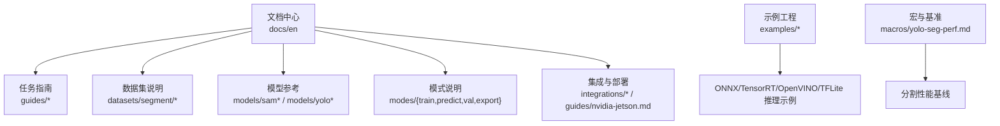
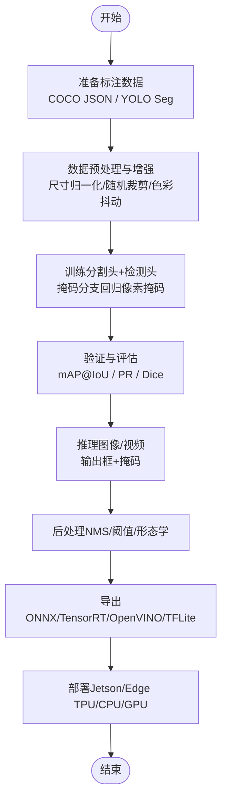
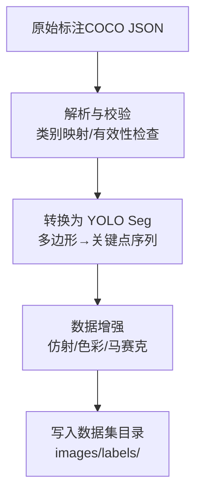
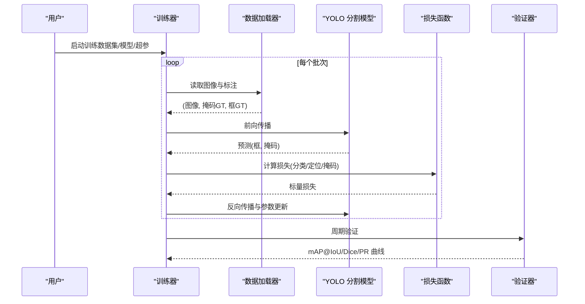
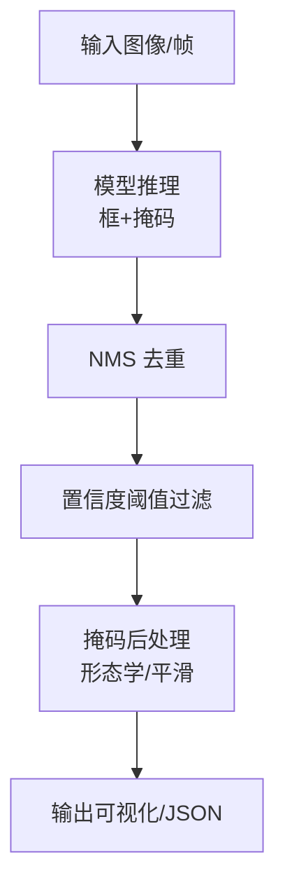
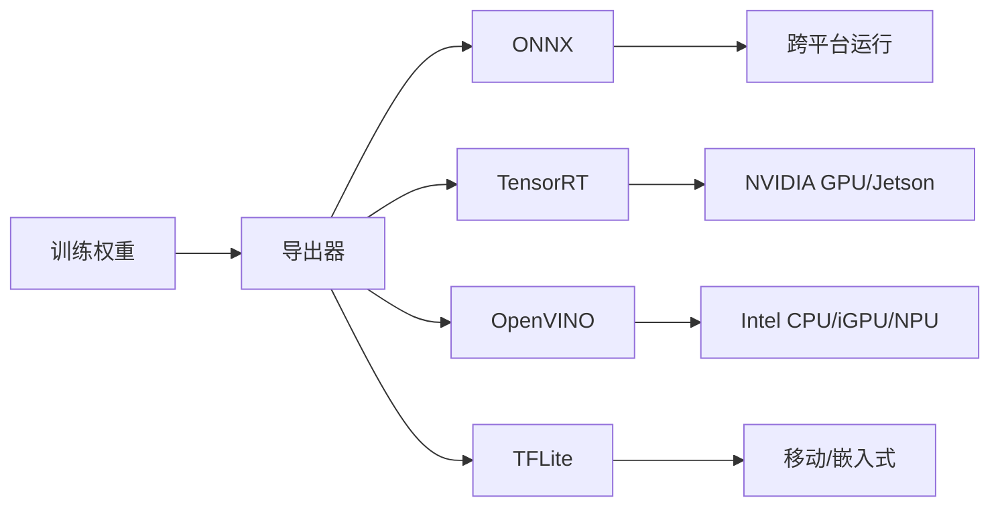
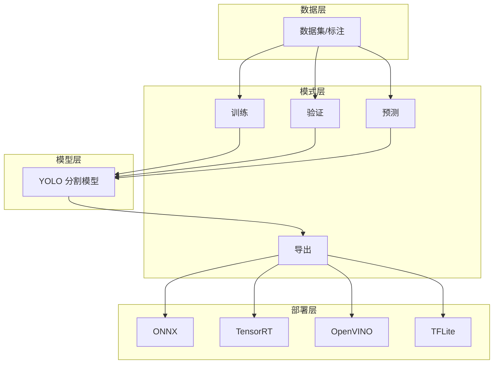

# 实例分割教程

<cite>
**本文引用的文件**
- [README.md](file://README.md)
- [yolo-seg-perf.md](file://docs/en/macros/yolo-seg-perf.md)
- [instance-segmentation-and-tracking.md](file://docs/en/guides/instance-segmentation-and-tracking.md)
- [sam.md](file://docs/en/models/sam.md)
- [fast-sam.md](file://docs/en/models/fast-sam.md)
- [mobile-sam.md](file://docs/en/models/mobile-sam.md)
- [sam-2.md](file://docs/en/models/sam-2.md)
- [segment/index.md](file://docs/en/datasets/segment/index.md)
- [coco-to-yolo.md](file://docs/en/guides/coco-to-yolo.md)
- [preprocessing_annotated_data.md](file://docs/en/guides/preprocessing_annotated_data.md)
- [train.md](file://docs/en/modes/train.md)
- [predict.md](file://docs/en/modes/predict.md)
- [val.md](file://docs/en/modes/val.md)
- [yolo-performance-metrics.md](file://docs/en/guides/yolo-performance-metrics.md)
- [yolo-data-augmentation.md](file://docs/en/guides/yolo-data-augmentation.md)
- [sahi-tiled-inference.md](file://docs/en/guides/sahi-tiled-inference.md)
- [model-deployment-options.md](file://docs/en/guides/model-deployment-options.md)
- [nvidia-jetson.md](file://docs/en/guides/nvidia-jetson.md)
- [edge-tpu.md](file://docs/en/integrations/edge-tpu.md)
- [openvino.md](file://docs/en/integrations/openvino.md)
- [tensorrt.md](file://docs/en/integrations/tensorrt.md)
- [tflite.md](file://docs/en/integrations/tflite.md)
- [onnx.md](file://docs/en/integrations/onnx.md)
- [export.md](file://docs/en/modes/export.md)
- [yolo-architecture.md](file://docs/en/guides/yolo-architecture.md)
- [yolo-common-issues.md](file://docs/en/guides/yolo-common-issues.md)
- [yolo26-training-recipe.md](file://docs/en/guides/yolo26-training-recipe.md)
- [yolo_master_risk_remediation_plan.md](file://YOLO-Master-v260721-MoA-MoE-MoT-PEFT-Planner-深度分析-v4.md)
</cite>

## 目录
1. [引言](#引言)
2. [项目结构](#项目结构)
3. [核心组件](#核心组件)
4. [架构总览](#架构总览)
5. [详细组件分析](#详细组件分析)
6. [依赖分析](#依赖分析)
7. [性能考虑](#性能考虑)
8. [故障排查指南](#故障排查指南)
9. [结论](#结论)
10. [附录](#附录)

## 引言
本教程面向希望使用 YOLO-Master 完成实例分割任务的工程师与研究者，系统讲解：
- 实例分割与语义分割的区别、典型应用场景
- 分割数据标注格式与预处理流程
- YOLO 分割模型与 SAM 系列模型的对比与选型建议
- 完整训练流程：分割头配置、掩码生成、边界框优化等关键技术细节
- 分割质量评估指标（mAP@IoU、Dice 系数等）
- 结果可视化与后处理方法
- 边缘设备推理优化方案（TensorRT、OpenVINO、Edge TPU、TFLite 等）

## 项目结构
仓库围绕“文档 + 示例 + 工具链”组织，与本教程相关的资料主要分布在 docs 与 examples 目录。下图给出与本教程直接相关的知识模块关系。

图表来源
- [yolo-seg-perf.md:1-200](file://docs/en/macros/yolo-seg-perf.md#L1-L200)
- [instance-segmentation-and-tracking.md:1-200](file://docs/en/guides/instance-segmentation-and-tracking.md#L1-L200)
- [segment/index.md:1-200](file://docs/en/datasets/segment/index.md#L1-L200)
- [train.md:1-200](file://docs/en/modes/train.md#L1-L200)
- [predict.md:1-200](file://docs/en/modes/predict.md#L1-L200)
- [val.md:1-200](file://docs/en/modes/val.md#L1-L200)
- [export.md:1-200](file://docs/en/modes/export.md#L1-L200)
- [nvidia-jetson.md:1-200](file://docs/en/guides/nvidia-jetson.md#L1-L200)
- [edge-tpu.md:1-200](file://docs/en/integrations/edge-tpu.md#L1-L200)
- [openvino.md:1-200](file://docs/en/integrations/openvino.md#L1-L200)
- [tensorrt.md:1-200](file://docs/en/integrations/tensorrt.md#L1-L200)
- [tflite.md:1-200](file://docs/en/integrations/tflite.md#L1-L200)
- [onnx.md:1-200](file://docs/en/integrations/onnx.md#L1-L200)

章节来源
- [README.md:1-200](file://README.md#L1-L200)
- [yolo-seg-perf.md:1-200](file://docs/en/macros/yolo-seg-perf.md#L1-L200)

## 核心组件
- 任务与模式
  - 训练：定义数据集路径、类别数、增强策略、损失权重、学习率调度等
  - 验证：计算 mAP@IoU、精度/召回、混淆矩阵等
  - 预测：单图/视频流推理，输出边界框与掩码
  - 导出：导出为 ONNX/TensorRT/OpenVINO/TFLite 等目标格式
- 数据与标注
  - 支持 COCO JSON 与 YOLO Seg 格式；提供转换脚本与预处理指南
- 模型与架构
  - YOLO 分割头与检测分支共享骨干网络，掩码分支在特征图上回归像素级掩码
  - SAM 系列（SAM、Fast-SAM、Mobile-SAM、SAM-2）强调提示式/零样本能力，适合开放词汇场景
- 评估与可视化
  - 指标：mAP@IoU、PR 曲线、混淆矩阵、Dice 系数等
  - 可视化：掩码叠加、轮廓绘制、热力图等
- 部署与优化
  - 多后端导出与运行时加速，适配 Jetson、Edge TPU、CPU/GPU 等多种平台

章节来源
- [train.md:1-200](file://docs/en/modes/train.md#L1-L200)
- [val.md:1-200](file://docs/en/modes/val.md#L1-L200)
- [predict.md:1-200](file://docs/en/modes/predict.md#L1-L200)
- [export.md:1-200](file://docs/en/modes/export.md#L1-L200)
- [segment/index.md:1-200](file://docs/en/datasets/segment/index.md#L1-L200)
- [coco-to-yolo.md:1-200](file://docs/en/guides/coco-to-yolo.md#L1-L200)
- [preprocessing_annotated_data.md:1-200](file://docs/en/guides/preprocessing_annotated_data.md#L1-L200)
- [yolo-performance-metrics.md:1-200](file://docs/en/guides/yolo-performance-metrics.md#L1-L200)
- [yolo-architecture.md:1-200](file://docs/en/guides/yolo-architecture.md#L1-L200)

## 架构总览
下图展示从数据到训练、验证、推理与导出的端到端流程，并标注关键文档入口。

图表来源
- [train.md:1-200](file://docs/en/modes/train.md#L1-L200)
- [val.md:1-200](file://docs/en/modes/val.md#L1-L200)
- [predict.md:1-200](file://docs/en/modes/predict.md#L1-L200)
- [export.md:1-200](file://docs/en/modes/export.md#L1-L200)
- [segment/index.md:1-200](file://docs/en/datasets/segment/index.md#L1-L200)
- [coco-to-yolo.md:1-200](file://docs/en/guides/coco-to-yolo.md#L1-L200)
- [preprocessing_annotated_data.md:1-200](file://docs/en/guides/preprocessing_annotated_data.md#L1-L200)
- [yolo-performance-metrics.md:1-200](file://docs/en/guides/yolo-performance-metrics.md#L1-L200)
- [nvidia-jetson.md:1-200](file://docs/en/guides/nvidia-jetson.md#L1-L200)
- [edge-tpu.md:1-200](file://docs/en/integrations/edge-tpu.md#L1-L200)
- [openvino.md:1-200](file://docs/en/integrations/openvino.md#L1-L200)
- [tensorrt.md:1-200](file://docs/en/integrations/tensorrt.md#L1-L200)
- [tflite.md:1-200](file://docs/en/integrations/tflite.md#L1-L200)
- [onnx.md:1-200](file://docs/en/integrations/onnx.md#L1-L200)

## 详细组件分析

### 概念与差异：实例分割 vs 语义分割
- 实例分割：对每个目标实例分别生成独立掩码，区分同类不同对象，适用于计数、跟踪、精细交互等
- 语义分割：将像素划分为若干语义类别，不区分同一类的不同实例，适用于场景理解、地图构建等
- 选择建议：需要“逐实例”的下游任务（如统计、跟踪、抠图）优先实例分割；仅需“像素级类别”则选语义分割

章节来源
- [instance-segmentation-and-tracking.md:1-200](file://docs/en/guides/instance-segmentation-and-tracking.md#L1-L200)

### 数据标注格式与预处理
- 标注格式
  - COCO JSON：包含图像信息、类别字典、目标列表（bbox、segmentation 多边形或 RLE）、图像尺寸等
  - YOLO Seg：每行一个目标，格式为 class x_center y_center width height 后接按顺时针顺序排列的归一化关键点坐标序列
- 数据转换
  - 提供 COCO JSON 转 YOLO Seg 的工具与说明
- 预处理与增强
  - 常见步骤：尺寸缩放/填充、随机翻转/旋转、色彩抖动、马赛克/混合增强、Mosaic 等
  - 注意：掩码需与几何变换同步更新，保持像素对齐

图表来源
- [segment/index.md:1-200](file://docs/en/datasets/segment/index.md#L1-L200)
- [coco-to-yolo.md:1-200](file://docs/en/guides/coco-to-yolo.md#L1-L200)
- [preprocessing_annotated_data.md:1-200](file://docs/en/guides/preprocessing_annotated_data.md#L1-L200)
- [yolo-data-augmentation.md:1-200](file://docs/en/guides/yolo-data-augmentation.md#L1-L200)

章节来源
- [segment/index.md:1-200](file://docs/en/datasets/segment/index.md#L1-L200)
- [coco-to-yolo.md:1-200](file://docs/en/guides/coco-to-yolo.md#L1-L200)
- [preprocessing_annotated_data.md:1-200](file://docs/en/guides/preprocessing_annotated_data.md#L1-L200)
- [yolo-data-augmentation.md:1-200](file://docs/en/guides/yolo-data-augmentation.md#L1-L200)

### 模型对比：YOLO 分割 vs SAM 系列
- YOLO 分割
  - 特点：端到端训练、速度快、易于部署，适合大规模工业落地
  - 适用：固定类别集、高吞吐实时场景、资源受限环境
- SAM 系列（SAM、Fast-SAM、Mobile-SAM、SAM-2）
  - 特点：提示式/零样本能力强，泛化性佳，适合开放词汇与少样本场景
  - 适用：交互式标注、跨域迁移、复杂背景下的通用分割
- 选型建议
  - 若类别稳定且追求极致速度：优先 YOLO 分割
  - 若需灵活提示/零样本/跨域迁移：优先 SAM 系列

章节来源
- [sam.md:1-200](file://docs/en/models/sam.md#L1-L200)
- [fast-sam.md:1-200](file://docs/en/models/fast-sam.md#L1-L200)
- [mobile-sam.md:1-200](file://docs/en/models/mobile-sam.md#L1-L200)
- [sam-2.md:1-200](file://docs/en/models/sam-2.md#L1-L200)
- [yolo-architecture.md:1-200](file://docs/en/guides/yolo-architecture.md#L1-L200)

### 训练流程与技术细节
- 训练入口与参数
  - 通过训练模式指定数据集 YAML、模型配置、批次大小、迭代次数、学习率策略等
- 分割头与掩码生成
  - 分割头在高层特征图上回归每目标的像素级掩码；掩码通常与检测分支共享骨干特征
  - 掩码标签由标注多边形经栅格化得到，需与图像增强同步变换
- 边界框优化
  - 检测分支同时优化 bbox，掩码与 bbox 联合优化有助于提升定位与分割一致性
- 损失与正则
  - 常用损失包括分类、定位、掩码交叉熵/二值交叉熵、Dice 类损失等；可结合正则与早停策略
- 超参调优
  - 参考训练配方与性能基线，进行网格搜索或贝叶斯优化

图表来源
- [train.md:1-200](file://docs/en/modes/train.md#L1-L200)
- [val.md:1-200](file://docs/en/modes/val.md#L1-L200)
- [yolo-performance-metrics.md:1-200](file://docs/en/guides/yolo-performance-metrics.md#L1-L200)
- [yolo26-training-recipe.md:1-200](file://docs/en/guides/yolo26-training-recipe.md#L1-L200)

章节来源
- [train.md:1-200](file://docs/en/modes/train.md#L1-L200)
- [val.md:1-200](file://docs/en/modes/val.md#L1-L200)
- [yolo-performance-metrics.md:1-200](file://docs/en/guides/yolo-performance-metrics.md#L1-L200)
- [yolo26-training-recipe.md:1-200](file://docs/en/guides/yolo26-training-recipe.md#L1-L200)

### 评估指标与可视化
- 指标
  - mAP@IoU：不同 IoU 阈值下的平均精度，衡量定位与分割综合质量
  - PR 曲线与 AUC：反映在不同置信度阈值下的精度-召回权衡
  - Dice 系数：衡量掩码与 GT 的重叠程度，常用于医学/细粒度场景
- 可视化
  - 掩码叠加、轮廓描边、热力图、类别颜色映射
  - 批量结果汇总与趋势图

章节来源
- [yolo-performance-metrics.md:1-200](file://docs/en/guides/yolo-performance-metrics.md#L1-L200)
- [predict.md:1-200](file://docs/en/modes/predict.md#L1-L200)

### 推理与后处理
- 推理模式
  - 支持图像/视频流推理，输出类别、置信度、边界框与掩码
- 后处理
  - NMS/软 NMS 抑制重复框
  - 置信度阈值过滤
  - 掩码形态学操作（开闭运算、孔洞填充）
  - 大图分块推理（SAHI）降低显存压力并提升小目标召回

图表来源
- [predict.md:1-200](file://docs/en/modes/predict.md#L1-L200)
- [sahi-tiled-inference.md:1-200](file://docs/en/guides/sahi-tiled-inference.md#L1-L200)

章节来源
- [predict.md:1-200](file://docs/en/modes/predict.md#L1-L200)
- [sahi-tiled-inference.md:1-200](file://docs/en/guides/sahi-tiled-inference.md#L1-L200)

### 导出与部署（边缘设备优化）
- 导出目标
  - ONNX：跨框架通用中间表示
  - TensorRT：NVIDIA GPU 高性能推理
  - OpenVINO：Intel CPU/iGPU/NPU 优化
  - TFLite：移动端/嵌入式部署
- 部署平台
  - NVIDIA Jetson：利用 TensorRT/DeepStream 优化
  - Edge TPU：低功耗边缘推理
  - 其他：CoreML、NCNN、MNN、RKNN 等（见集成文档）

图表来源
- [export.md:1-200](file://docs/en/modes/export.md#L1-L200)
- [onnx.md:1-200](file://docs/en/integrations/onnx.md#L1-L200)
- [tensorrt.md:1-200](file://docs/en/integrations/tensorrt.md#L1-L200)
- [openvino.md:1-200](file://docs/en/integrations/openvino.md#L1-L200)
- [tflite.md:1-200](file://docs/en/integrations/tflite.md#L1-L200)
- [nvidia-jetson.md:1-200](file://docs/en/guides/nvidia-jetson.md#L1-L200)
- [edge-tpu.md:1-200](file://docs/en/integrations/edge-tpu.md#L1-L200)
- [model-deployment-options.md:1-200](file://docs/en/guides/model-deployment-options.md#L1-L200)

章节来源
- [export.md:1-200](file://docs/en/modes/export.md#L1-L200)
- [onnx.md:1-200](file://docs/en/integrations/onnx.md#L1-L200)
- [tensorrt.md:1-200](file://docs/en/integrations/tensorrt.md#L1-L200)
- [openvino.md:1-200](file://docs/en/integrations/openvino.md#L1-L200)
- [tflite.md:1-200](file://docs/en/integrations/tflite.md#L1-L200)
- [nvidia-jetson.md:1-200](file://docs/en/guides/nvidia-jetson.md#L1-L200)
- [edge-tpu.md:1-200](file://docs/en/integrations/edge-tpu.md#L1-L200)
- [model-deployment-options.md:1-200](file://docs/en/guides/model-deployment-options.md#L1-L200)

## 依赖分析
- 文档内聚与耦合
  - 训练/验证/预测/导出四大模式相互解耦，通过统一的数据接口与模型接口协作
  - 数据集与标注格式在多个环节复用（训练、验证、推理）
- 外部依赖
  - 导出与部署依赖各后端 SDK（TensorRT、OpenVINO、TFLite 等）
  - 可视化与评测依赖绘图与指标库（见性能与指标文档）

图表来源
- [train.md:1-200](file://docs/en/modes/train.md#L1-L200)
- [val.md:1-200](file://docs/en/modes/val.md#L1-L200)
- [predict.md:1-200](file://docs/en/modes/predict.md#L1-L200)
- [export.md:1-200](file://docs/en/modes/export.md#L1-L200)
- [segment/index.md:1-200](file://docs/en/datasets/segment/index.md#L1-L200)
- [onnx.md:1-200](file://docs/en/integrations/onnx.md#L1-L200)
- [tensorrt.md:1-200](file://docs/en/integrations/tensorrt.md#L1-L200)
- [openvino.md:1-200](file://docs/en/integrations/openvino.md#L1-L200)
- [tflite.md:1-200](file://docs/en/integrations/tflite.md#L1-L200)

## 性能考虑
- 训练阶段
  - 合理设置批次大小、学习率与 warmup，避免梯度爆炸/消失
  - 使用数据并行/混合精度提升吞吐
  - 针对小目标增加高分辨率分支或切片推理（SAHI）
- 推理阶段
  - 选择合适后端（GPU 用 TensorRT，CPU/iGPU 用 OpenVINO，移动端用 TFLite）
  - 量化与算子融合（INT8/FP16），减少内存带宽瓶颈
  - 动态形状与批处理优化，结合流水线并行
- 部署阶段
  - 模型瘦身（剪枝/蒸馏），按需加载专家/路由（参见 MoE/LoRA 相关文档）
  - 监控与回滚机制，保障线上稳定性

章节来源
- [yolo-seg-perf.md:1-200](file://docs/en/macros/yolo-seg-perf.md#L1-L200)
- [yolo26-training-recipe.md:1-200](file://docs/en/guides/yolo26-training-recipe.md#L1-L200)
- [model-deployment-options.md:1-200](file://docs/en/guides/model-deployment-options.md#L1-L200)

## 故障排查指南
- 常见问题
  - 标注错误：类别越界、掩码为空、坐标越界
  - 训练不稳定：损失震荡、NaN、过拟合/欠拟合
  - 推理异常：低召回、误检、掩码破碎
- 排查要点
  - 数据侧：检查标注完整性与一致性，抽样可视化确认增强效果
  - 模型侧：调整学习率/正则/损失权重，观察 PR 曲线与混淆矩阵
  - 部署侧：核对导出选项与运行时版本，复现实验环境与依赖

章节来源
- [yolo-common-issues.md:1-200](file://docs/en/guides/yolo-common-issues.md#L1-L200)
- [yolo-performance-metrics.md:1-200](file://docs/en/guides/yolo-performance-metrics.md#L1-L200)

## 结论
- 对于固定类别、追求速度与部署便利性的场景，YOLO 分割是首选
- 对于开放词汇、提示式或跨域迁移需求，SAM 系列更具优势
- 以数据质量为核心，配合合理的增强、训练配方与后处理，可显著提升分割质量
- 借助多后端导出与量化优化，可在边缘设备上实现高效稳定的推理

## 附录
- 快速上手清单
  - 准备数据 → 转换标注 → 配置训练 → 训练与验证 → 推理与可视化 → 导出与部署
- 参考文档索引
  - 任务与模式：[train.md](file://docs/en/modes/train.md)、[val.md](file://docs/en/modes/val.md)、[predict.md](file://docs/en/modes/predict.md)、[export.md](file://docs/en/modes/export.md)
  - 数据与标注：[segment/index.md](file://docs/en/datasets/segment/index.md)、[coco-to-yolo.md](file://docs/en/guides/coco-to-yolo.md)、[preprocessing_annotated_data.md](file://docs/en/guides/preprocessing_annotated_data.md)
  - 模型与架构：[yolo-architecture.md](file://docs/en/guides/yolo-architecture.md)、[sam.md](file://docs/en/models/sam.md)、[fast-sam.md](file://docs/en/models/fast-sam.md)、[mobile-sam.md](file://docs/en/models/mobile-sam.md)、[sam-2.md](file://docs/en/models/sam-2.md)
  - 评估与可视化：[yolo-performance-metrics.md](file://docs/en/guides/yolo-performance-metrics.md)
  - 部署与集成：[nvidia-jetson.md](file://docs/en/guides/nvidia-jetson.md)、[edge-tpu.md](file://docs/en/integrations/edge-tpu.md)、[openvino.md](file://docs/en/integrations/openvino.md)、[tensorrt.md](file://docs/en/integrations/tensorrt.md)、[tflite.md](file://docs/en/integrations/tflite.md)、[onnx.md](file://docs/en/integrations/onnx.md)
  - 高级主题：[yolo26-training-recipe.md](file://docs/en/guides/yolo26-training-recipe.md)、[yolo_master_risk_remediation_plan.md](file://YOLO-Master-v260721-MoA-MoE-MoT-PEFT-Planner-深度分析-v4.md)