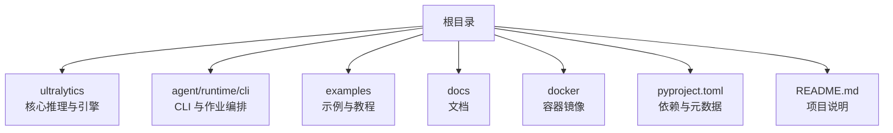
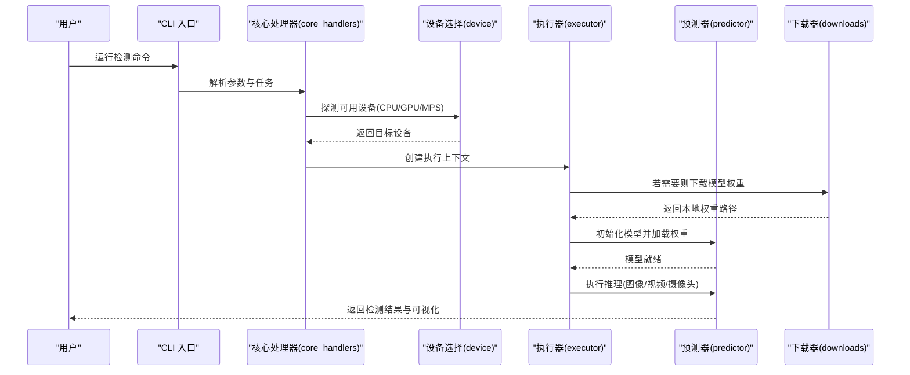
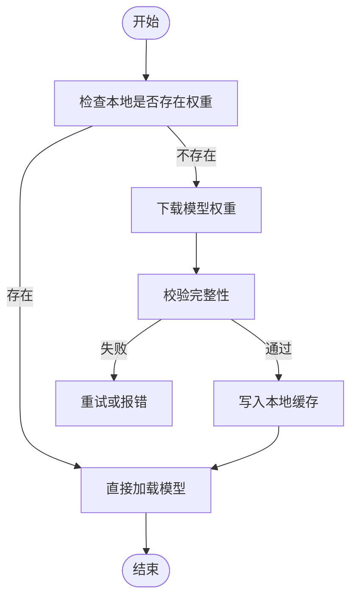
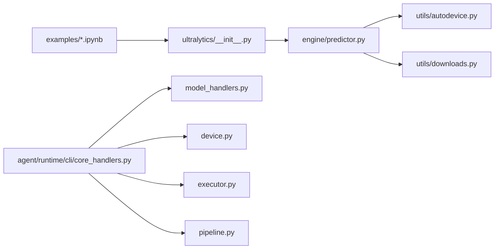

# 快速开始指南

<cite>
**本文引用的文件**
- [README.md](file://README.md)
- [pyproject.toml](file://pyproject.toml)
- [docker/Dockerfile](file://docker/Dockerfile)
- [ultralytics/__init__.py](file://ultralytics/__init__.py)
- [ultralytics/engine/predictor.py](file://ultralytics/engine/predictor.py)
- [ultralytics/utils/autodevice.py](file://ultralytics/utils/autodevice.py)
- [ultralytics/utils/downloads.py](file://ultralytics/utils/downloads.py)
- [examples/tutorial.ipynb](file://examples/tutorial.ipynb)
- [examples/object_tracking.ipynb](file://examples/object_tracking.ipynb)
- [examples/object_counting.ipynb](file://examples/object_counting.ipynb)
- [agent/runtime/cli/core_handlers.py](file://agent/runtime/cli/core_handlers.py)
- [agent/runtime/cli/model_handlers.py](file://agent/runtime/cli/model_handlers.py)
- [agent/runtime/cli/device.py](file://agent/runtime/cli/device.py)
- [agent/runtime/cli/executor.py](file://agent/runtime/cli/executor.py)
- [agent/runtime/cli/pipeline.py](file://agent/runtime/cli/pipeline.py)
- [agent/runtime/cli/job_handlers.py](file://agent/runtime/cli/job_handlers.py)
- [agent/runtime/cli/system_handlers.py](file://agent/runtime/cli/system_handlers.py)
- [agent/runtime/cli/progress.py](file://agent/runtime/cli/progress.py)
- [agent/runtime/cli/snapshot.py](file://agent/runtime/cli/snapshot.py)
- [agent/runtime/cli/validate.py](file://agent/runtime/cli/validate.py)
- [agent/runtime/cli/stability.py](file://agent/runtime/cli/stability.py)
- [agent/runtime/cli/multimodal_handlers.py](file://agent/runtime/cli/multimodal_handlers.py)
- [agent/runtime/cli/lora_tools.py](file://agent/runtime/cli/lora_tools.py)
- [agent/runtime/cli/moe_tools.py](file://agent/runtime/cli/moe_tools.py)
- [agent/runtime/cli/peft_compare.py](file://agent/runtime/cli/peft_compare.py)
- [agent/runtime/cli/sahi_compare.py](file://agent/runtime/cli/sahi_compare.py)
- [agent/runtime/cli/regenerate_open_world_report.py](file://agent/runtime/cli/regenerate_open_world_report.py)
- [agent/runtime/cli/compare_open_world_profiles.py](file://agent/runtime/cli/compare_open_world_profiles.py)
- [agent/runtime/cli/normalize.py](file://agent/runtime/cli/normalize.py)
- [agent/runtime/cli/dispatcher.py](file://agent/runtime/cli/dispatcher.py)
- [agent/runtime/cli/async_jobs.py](file://agent/runtime/cli/async_jobs.py)
- [agent/runtime/cli/dataset.py](file://agent/runtime/cli/dataset.py)
- [agent/runtime/cli/contract.py](file://agent/runtime/cli/contract.py)
</cite>

## 目录
1. [简介](#简介)
2. [项目结构](#项目结构)
3. [核心组件](#核心组件)
4. [架构总览](#架构总览)
5. [详细组件分析](#详细组件分析)
6. [依赖关系分析](#依赖关系分析)
7. [性能注意事项](#性能注意事项)
8. [故障排除指南](#故障排除指南)
9. [结论](#结论)
10. [附录](#附录)

## 简介
本指南面向首次接触 YOLO-Master 的用户，目标是在 30 分钟内完成环境搭建、预训练模型准备与第一个目标检测任务。内容涵盖：
- Python 环境与 GPU 驱动配置
- 依赖安装（pip 与 Docker）
- 预训练模型下载与使用
- 图像推理、视频处理、实时摄像头检测示例
- 命令行工具基本用法
- 常见问题与快速排障

## 项目结构
仓库采用模块化组织，核心推理与引擎位于 ultralytics 包内；CLI 入口与作业调度位于 agent/runtime/cli；示例与教程位于 examples；文档在 docs；Docker 镜像定义在 docker。

图表来源
- [pyproject.toml:1-200](file://pyproject.toml#L1-L200)
- [README.md:1-200](file://README.md#L1-L200)
- [docker/Dockerfile:1-200](file://docker/Dockerfile#L1-L200)

章节来源
- [README.md:1-200](file://README.md#L1-L200)
- [pyproject.toml:1-200](file://pyproject.toml#L1-L200)
- [docker/Dockerfile:1-200](file://docker/Dockerfile#L1-L200)

## 核心组件
- 推理引擎与预测器：负责加载模型、设备选择、前向推理与结果后处理。
- 自动设备选择：根据系统能力自动选择 CPU/GPU/MPS 等后端。
- 模型下载与缓存：支持从远程仓库拉取权重并本地缓存。
- CLI 命令集：提供模型管理、设备探测、推理执行、快照与验证等命令。
- 示例与教程：Jupyter Notebook 演示常见任务流程。

章节来源
- [ultralytics/engine/predictor.py:1-200](file://ultralytics/engine/predictor.py#L1-L200)
- [ultralytics/utils/autodevice.py:1-200](file://ultralytics/utils/autodevice.py#L1-L200)
- [ultralytics/utils/downloads.py:1-200](file://ultralytics/utils/downloads.py#L1-L200)
- [agent/runtime/cli/core_handlers.py:1-200](file://agent/runtime/cli/core_handlers.py#L1-L200)
- [agent/runtime/cli/model_handlers.py:1-200](file://agent/runtime/cli/model_handlers.py#L1-L200)
- [agent/runtime/cli/device.py:1-200](file://agent/runtime/cli/device.py#L1-L200)
- [agent/runtime/cli/executor.py:1-200](file://agent/runtime/cli/executor.py#L1-L200)
- [agent/runtime/cli/pipeline.py:1-200](file://agent/runtime/cli/pipeline.py#L1-L200)
- [examples/tutorial.ipynb:1-200](file://examples/tutorial.ipynb#L1-L200)

## 架构总览
下图展示了从用户调用到推理执行的典型路径，包括 CLI 层、作业调度、设备选择、模型加载与预测器执行。

图表来源
- [agent/runtime/cli/core_handlers.py:1-200](file://agent/runtime/cli/core_handlers.py#L1-L200)
- [agent/runtime/cli/device.py:1-200](file://agent/runtime/cli/device.py#L1-L200)
- [agent/runtime/cli/executor.py:1-200](file://agent/runtime/cli/executor.py#L1-L200)
- [ultralytics/engine/predictor.py:1-200](file://ultralytics/engine/predictor.py#L1-L200)
- [ultralytics/utils/downloads.py:1-200](file://ultralytics/utils/downloads.py#L1-L200)

## 详细组件分析

### 环境安装与配置
- Python 版本要求与依赖声明见 pyproject.toml。建议使用虚拟环境或 conda 隔离依赖。
- GPU 驱动与 CUDA 版本需与 PyTorch 构建匹配。可通过 autodevice 自动探测设备能力。
- 可选使用 Docker 镜像一键启动，避免本地环境差异。

步骤建议
- 创建并激活 Python 虚拟环境
- 安装项目依赖（参考 pyproject.toml）
- 验证 GPU 是否被正确识别（CPU/GPU/MPS）
- 如需离线部署，提前下载模型权重至本地缓存

章节来源
- [pyproject.toml:1-200](file://pyproject.toml#L1-L200)
- [ultralytics/utils/autodevice.py:1-200](file://ultralytics/utils/autodevice.py#L1-L200)
- [docker/Dockerfile:1-200](file://docker/Dockerfile#L1-L200)

### 预训练模型下载与使用
- 首次推理时会自动下载所需权重到本地缓存目录。
- 可手动指定模型路径或使用默认名称触发下载。
- 下载过程由 downloads 模块管理，支持断点续传与校验。

图表来源
- [ultralytics/utils/downloads.py:1-200](file://ultralytics/utils/downloads.py#L1-L200)
- [ultralytics/engine/predictor.py:1-200](file://ultralytics/engine/predictor.py#L1-L200)

章节来源
- [ultralytics/utils/downloads.py:1-200](file://ultralytics/utils/downloads.py#L1-L200)
- [ultralytics/engine/predictor.py:1-200](file://ultralytics/engine/predictor.py#L1-L200)

### 第一个目标检测示例（图像/视频/摄像头）
- 图像推理：读取单张图像，执行预测，保存或显示结果。
- 视频处理：逐帧读取视频流，批量推理并输出标注视频。
- 实时摄像头：打开摄像头设备，循环推理并展示实时画面。

推荐参考的示例位置
- 图像与通用流程：[examples/tutorial.ipynb](file://examples/tutorial.ipynb)
- 跟踪与计数扩展：[examples/object_tracking.ipynb](file://examples/object_tracking.ipynb)、[examples/object_counting.ipynb](file://examples/object_counting.ipynb)

章节来源
- [examples/tutorial.ipynb:1-200](file://examples/tutorial.ipynb#L1-L200)
- [examples/object_tracking.ipynb:1-200](file://examples/object_tracking.ipynb#L1-L200)
- [examples/object_counting.ipynb:1-200](file://examples/object_counting.ipynb#L1-L200)

### 命令行工具基本使用方法
常用命令类别
- 模型管理：查看、下载、导出、验证
- 设备信息：列出可用设备与能力
- 推理执行：对图像、视频、摄像头进行预测
- 作业与流水线：批处理、异步任务、进度监控
- 快照与诊断：保存中间状态、稳定性检查、报告生成

关键入口与职责
- 核心处理器：统一解析命令与参数
- 模型处理器：模型生命周期操作
- 设备处理器：设备探测与选择
- 执行器：任务编排与资源管理
- 流水线：多阶段任务组合
- 作业处理器：后台任务与队列
- 系统处理器：系统与平台信息
- 进度条：任务进度可视化
- 快照：运行时状态保存与恢复
- 验证：配置与输出一致性检查
- 稳定性：数值稳定性与异常检测
- 多模态：文本/视觉融合相关命令
- LoRA/PEFT：微调与对比工具
- MoE：混合专家相关工具
- SAHI/对比：切片推理与对比脚本
- 数据集：数据准备与转换
- 契约：接口与行为约定
- 分发器：命令路由与分派
- 异步作业：并发与任务调度

章节来源
- [agent/runtime/cli/core_handlers.py:1-200](file://agent/runtime/cli/core_handlers.py#L1-L200)
- [agent/runtime/cli/model_handlers.py:1-200](file://agent/runtime/cli/model_handlers.py#L1-L200)
- [agent/runtime/cli/device.py:1-200](file://agent/runtime/cli/device.py#L1-L200)
- [agent/runtime/cli/executor.py:1-200](file://agent/runtime/cli/executor.py#L1-L200)
- [agent/runtime/cli/pipeline.py:1-200](file://agent/runtime/cli/pipeline.py#L1-L200)
- [agent/runtime/cli/job_handlers.py:1-200](file://agent/runtime/cli/job_handlers.py#L1-L200)
- [agent/runtime/cli/system_handlers.py:1-200](file://agent/runtime/cli/system_handlers.py#L1-L200)
- [agent/runtime/cli/progress.py:1-200](file://agent/runtime/cli/progress.py#L1-L200)
- [agent/runtime/cli/snapshot.py:1-200](file://agent/runtime/cli/snapshot.py#L1-L200)
- [agent/runtime/cli/validate.py:1-200](file://agent/runtime/cli/validate.py#L1-L200)
- [agent/runtime/cli/stability.py:1-200](file://agent/runtime/cli/stability.py#L1-L200)
- [agent/runtime/cli/multimodal_handlers.py:1-200](file://agent/runtime/cli/multimodal_handlers.py#L1-L200)
- [agent/runtime/cli/lora_tools.py:1-200](file://agent/runtime/cli/lora_tools.py#L1-L200)
- [agent/runtime/cli/moe_tools.py:1-200](file://agent/runtime/cli/moe_tools.py#L1-L200)
- [agent/runtime/cli/peft_compare.py:1-200](file://agent/runtime/cli/peft_compare.py#L1-L200)
- [agent/runtime/cli/sahi_compare.py:1-200](file://agent/runtime/cli/sahi_compare.py#L1-L200)
- [agent/runtime/cli/regenerate_open_world_report.py:1-200](file://agent/runtime/cli/regenerate_open_world_report.py#L1-L200)
- [agent/runtime/cli/compare_open_world_profiles.py:1-200](file://agent/runtime/cli/compare_open_world_profiles.py#L1-L200)
- [agent/runtime/cli/normalize.py:1-200](file://agent/runtime/cli/normalize.py#L1-L200)
- [agent/runtime/cli/dispatcher.py:1-200](file://agent/runtime/cli/dispatcher.py#L1-L200)
- [agent/runtime/cli/async_jobs.py:1-200](file://agent/runtime/cli/async_jobs.py#L1-L200)
- [agent/runtime/cli/dataset.py:1-200](file://agent/runtime/cli/dataset.py#L1-L200)
- [agent/runtime/cli/contract.py:1-200](file://agent/runtime/cli/contract.py#L1-L200)

## 依赖关系分析
- 顶层入口与包初始化：ultralytics/__init__.py 暴露高层 API。
- 推理链路：predictor 依赖 autodevice 与 downloads。
- CLI 层：core_handlers 协调 model_handlers、device、executor、pipeline 等子模块。
- 示例与教程：基于 ultralytics 高层 API 编写，便于快速上手。

图表来源
- [ultralytics/__init__.py:1-200](file://ultralytics/__init__.py#L1-L200)
- [ultralytics/engine/predictor.py:1-200](file://ultralytics/engine/predictor.py#L1-L200)
- [ultralytics/utils/autodevice.py:1-200](file://ultralytics/utils/autodevice.py#L1-L200)
- [ultralytics/utils/downloads.py:1-200](file://ultralytics/utils/downloads.py#L1-L200)
- [agent/runtime/cli/core_handlers.py:1-200](file://agent/runtime/cli/core_handlers.py#L1-L200)
- [agent/runtime/cli/model_handlers.py:1-200](file://agent/runtime/cli/model_handlers.py#L1-L200)
- [agent/runtime/cli/device.py:1-200](file://agent/runtime/cli/device.py#L1-L200)
- [agent/runtime/cli/executor.py:1-200](file://agent/runtime/cli/executor.py#L1-L200)
- [agent/runtime/cli/pipeline.py:1-200](file://agent/runtime/cli/pipeline.py#L1-L200)
- [examples/tutorial.ipynb:1-200](file://examples/tutorial.ipynb#L1-L200)

章节来源
- [ultralytics/__init__.py:1-200](file://ultralytics/__init__.py#L1-L200)
- [ultralytics/engine/predictor.py:1-200](file://ultralytics/engine/predictor.py#L1-L200)
- [ultralytics/utils/autodevice.py:1-200](file://ultralytics/utils/autodevice.py#L1-L200)
- [ultralytics/utils/downloads.py:1-200](file://ultralytics/utils/downloads.py#L1-L200)
- [agent/runtime/cli/core_handlers.py:1-200](file://agent/runtime/cli/core_handlers.py#L1-L200)
- [agent/runtime/cli/model_handlers.py:1-200](file://agent/runtime/cli/model_handlers.py#L1-L200)
- [agent/runtime/cli/device.py:1-200](file://agent/runtime/cli/device.py#L1-L200)
- [agent/runtime/cli/executor.py:1-200](file://agent/runtime/cli/executor.py#L1-L200)
- [agent/runtime/cli/pipeline.py:1-200](file://agent/runtime/cli/pipeline.py#L1-L200)
- [examples/tutorial.ipynb:1-200](file://examples/tutorial.ipynb#L1-L200)

## 性能注意事项
- 设备选择：优先使用 GPU，若不可用回退到 CPU；MPS 在 macOS 上可获得较好加速。
- 批大小与分辨率：增大 batch 与输入尺寸会提升吞吐但增加显存占用，需权衡。
- 模型格式：导出为 ONNX/TensorRT/OpenVINO 等可显著降低延迟。
- I/O 优化：视频与摄像头读取建议使用高效解码器与线程池。
- 缓存策略：复用已下载的模型权重与预处理缓存，减少重复计算。

## 故障排除指南
- 无法识别 GPU
  - 检查 CUDA 驱动与 PyTorch 构建版本是否匹配
  - 使用设备命令查看可用设备列表
  - 参考 autodevice 的设备探测逻辑定位问题
- 模型下载失败
  - 检查网络连通性与代理设置
  - 确认磁盘空间与权限
  - 使用下载器的重试与校验功能
- 推理报错或结果异常
  - 核对输入图像尺寸与归一化方式
  - 检查置信度阈值与非极大值抑制参数
  - 使用快照与稳定性检查定位中间状态异常
- 实时摄像头卡顿
  - 降低分辨率或关闭不必要的后处理
  - 启用多线程读取与推理
  - 考虑导出轻量模型或开启硬件加速

章节来源
- [ultralytics/utils/autodevice.py:1-200](file://ultralytics/utils/autodevice.py#L1-L200)
- [ultralytics/utils/downloads.py:1-200](file://ultralytics/utils/downloads.py#L1-L200)
- [agent/runtime/cli/device.py:1-200](file://agent/runtime/cli/device.py#L1-L200)
- [agent/runtime/cli/snapshot.py:1-200](file://agent/runtime/cli/snapshot.py#L1-L200)
- [agent/runtime/cli/stability.py:1-200](file://agent/runtime/cli/stability.py#L1-L200)

## 结论
通过本指南，您应能在 30 分钟内完成环境搭建、模型准备与第一次目标检测。后续可根据需求探索视频处理、实时摄像头、导出部署与自定义数据集训练等进阶主题。

## 附录
- 官方文档与示例：docs 与 examples 目录包含更详细的教程与最佳实践。
- 社区与支持：遇到问题可参考 README 与帮助文档，或在社区提交 Issue。