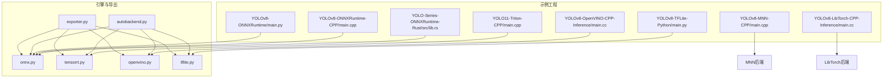
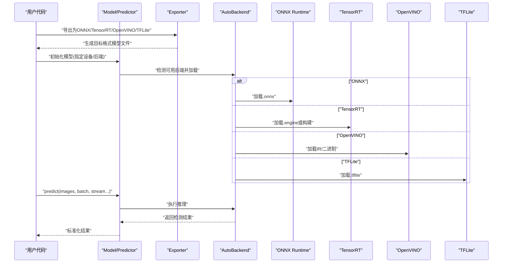
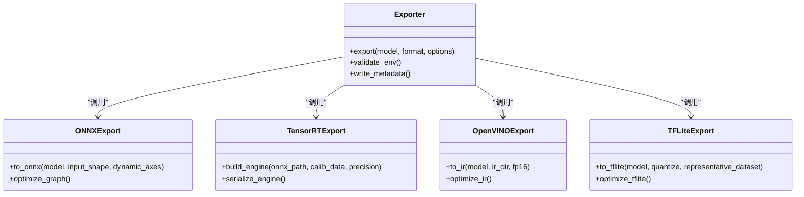
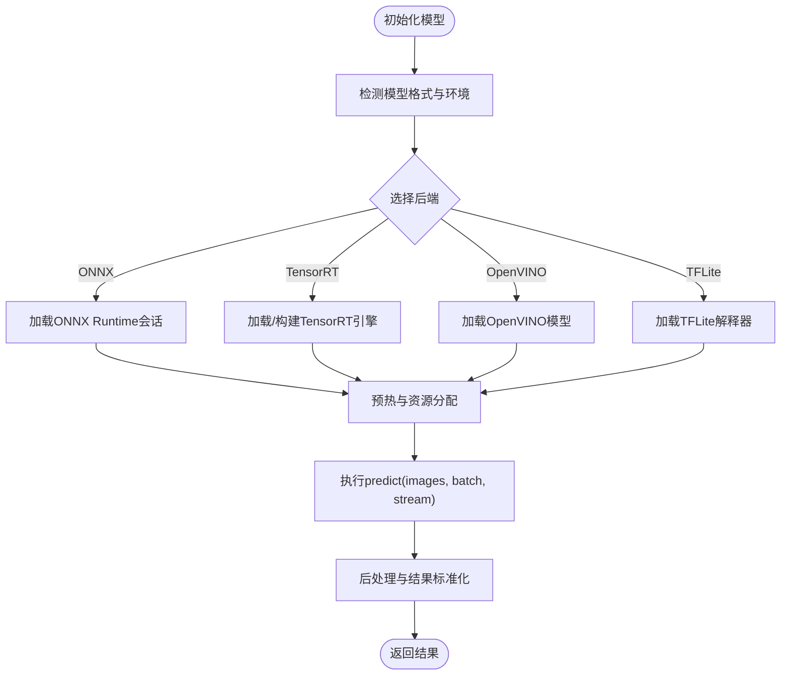
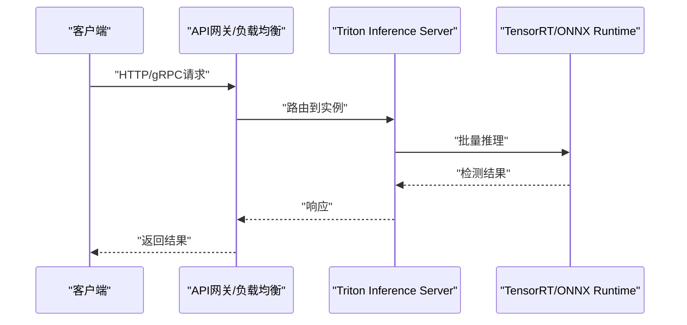
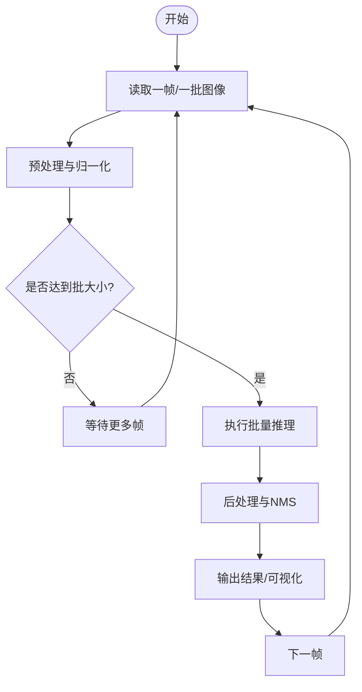
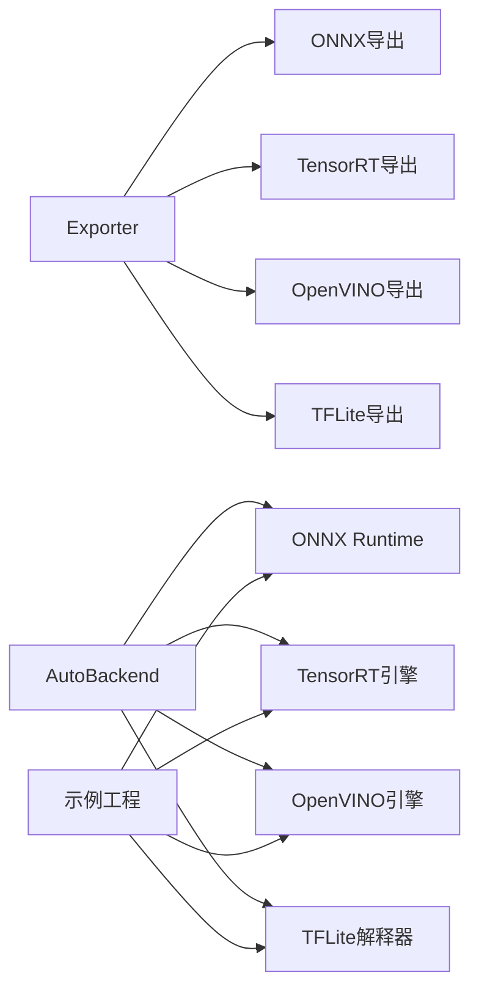

# 推理与部署教程

<cite>
**本文引用的文件**
- [README.md](file://README.md)
- [pyproject.toml](file://pyproject.toml)
- [ultralytics/engine/exporter.py](file://ultralytics/engine/exporter.py)
- [ultralytics/utils/export/__init__.py](file://ultralytics/utils/export/__init__.py)
- [ultralytics/utils/export/onnx.py](file://ultralytics/utils/export/onnx.py)
- [ultralytics/utils/export/tensorrt.py](file://ultralytics/utils/export/tensorrt.py)
- [ultralytics/utils/export/openvino.py](file://ultralytics/utils/export/openvino.py)
- [ultralytics/utils/export/tflite.py](file://ultralytics/utils/export/tflite.py)
- [ultralytics/nn/autobackend.py](file://ultralytics/nn/autobackend.py)
- [ultralytics/engine/predictor.py](file://ultralytics/engine/predictor.py)
- [ultralytics/engine/model.py](file://ultralytics/engine/model.py)
- [examples/YOLO-Master-Cross-Platform-Edge-Deployment/TECHNICAL_REPORT.md](file://examples/YOLO-Master-Cross-Platform-Edge-Deployment/TECHNICAL_REPORT.md)
- [examples/YOLO-Master-Edge-Deployment/export_edge_models.py](file://examples/YOLO-Master-Edge-Deployment/export_edge_models.py)
- [examples/YOLOv8-TFLite-Python/main.py](file://examples/YOLOv8-TFLite-Python/main.py)
- [examples/YOLOv8-OpenVINO-CPP-Inference/main.cc](file://examples/YOLOv8-OpenVINO-CPP-Inference/main.cc)
- [examples/YOLO11-Triton-CPP/inference.cpp](file://examples/YOLO11-Triton-CPP/inference.cpp)
- [examples/YOLOv8-ONNXRuntime/main.py](file://examples/YOLOv8-ONNXRuntime/main.py)
- [examples/YOLOv8-ONNXRuntime-CPP/inference.h](file://examples/YOLOv8-ONNXRuntime-CPP/inference.h)
- [examples/YOLOv8-ONNXRuntime-Rust/src/lib.rs](file://examples/YOLOv8-ONNXRuntime-Rust/src/lib.rs)
- [examples/YOLOv8-OpenCV-ONNX-Python/main.py](file://examples/YOLOv8-OpenCV-ONNX-Python/main.py)
- [examples/YOLOv8-MNN-CPP/main.cpp](file://examples/YOLOv8-MNN-CPP/main.cpp)
- [examples/YOLOv8-LibTorch-CPP-Inference/main.cc](file://examples/YOLOv8-LibTorch-CPP-Inference/main.cc)
- [examples/YOLO-Series-ONNXRuntime-Rust/src/lib.rs](file://examples/YOLO-Series-ONNXRuntime-Rust/src/lib.rs)
- [examples/YOLO-Axelera-Python/yolo26-pose-tracker.py](file://examples/YOLO-Axelera-Python/yolo26-pose-tracker.py)
- [examples/YOLOv8-SAHI-Inference-Video/yolov8_sahi.py](file://examples/YOLOv8-SAHI-Inference-Video/yolov8_sahi.py)
- [examples/YOLOv8-Action-Recognition/action_recognition.py](file://examples/YOLOv8-Action-Recognition/action_recognition.py)
- [examples/YOLOv8-Region-Counter/yolov8_region_counter.py](file://examples/YOLOv8-Region-Counter/yolov8_region_counter.py)
- [examples/YOLOv8-Segmentation-ONNXRuntime-Python/main.py](file://examples/YOLOv8-Segmentation-ONNXRuntime-Python/main.py)
- [examples/YOLOv8-CPP-Inference/inference.h](file://examples/YOLOv8-CPP-Inference/inference.h)
- [examples/YOLOv8-CPP-Inference/main.cpp](file://examples/YOLOv8-CPP-Inference/main.cpp)
- [examples/YOLOv8-LibTorch-CPP-Inference/CMakeLists.txt](file://examples/YOLOv8-LibTorch-CPP-Inference/CMakeLists.txt)
- [examples/YOLOv8-OpenVINO-CPP-Inference/inference.h](file://examples/YOLOv8-OpenVINO-CPP-Inference/inference.h)
- [examples/YOLOv8-OpenVINO-CPP-Inference/inference.cc](file://examples/YOLOv8-OpenVINO-CPP-Inference/inference.cc)
- [examples/YOLOv8-ONNXRuntime-CPP/inference.cpp](file://examples/YOLOv8-ONNXRuntime-CPP/inference.cpp)
- [examples/YOLOv8-ONNXRuntime-CPP/main.cpp](file://examples/YOLOv8-ONNXRuntime-CPP/main.cpp)
- [examples/YOLOv8-ONNXRuntime-Rust/Cargo.toml](file://examples/YOLOv8-ONNXRuntime-Rust/Cargo.toml)
- [examples/YOLO-Series-ONNXRuntime-Rust/Cargo.toml](file://examples/YOLO-Series-ONNXRuntime-Rust/Cargo.toml)
- [examples/YOLOv8-MNN-CPP/CMakeLists.txt](file://examples/YOLOv8-MNN-CPP/CMakeLists.txt)
- [examples/YOLOv8-LibTorch-CPP-Inference/README.md](file://examples/YOLOv8-LibTorch-CPP-Inference/README.md)
- [examples/YOLOv8-OpenVINO-CPP-Inference/README.md](file://examples/YOLOv8-OpenVINO-CPP-Inference/README.md)
- [examples/YOLOv8-ONNXRuntime-CPP/README.md](file://examples/YOLOv8-ONNXRuntime-CPP/README.md)
- [examples/YOLOv8-ONNXRuntime-Rust/README.md](file://examples/YOLOv8-ONNXRuntime-Rust/README.md)
- [examples/YOLOv8-MNN-CPP/README.md](file://examples/YOLOv8-MNN-CPP/README.md)
- [examples/YOLO11-Triton-CPP/README.md](file://examples/YOLO11-Triton-CPP/README.md)
- [examples/YOLO11-Triton-CPP/CMakeLists.txt](file://examples/YOLO11-Triton-CPP/CMakeLists.txt)
- [examples/YOLO11-Triton-CPP/main.cpp](file://examples/YOLO11-Triton-CPP/main.cpp)
- [examples/YOLOv8-ONNXRuntime/README.md](file://examples/YOLOv8-ONNXRuntime/README.md)
- [examples/YOLOv8-OpenCV-ONNX-Python/README.md](file://examples/YOLOv8-OpenCV-ONNX-Python/README.md)
- [examples/YOLOv8-TFLite-Python/README.md](file://examples/YOLOv8-TFLite-Python/README.md)
- [examples/YOLOv8-SAHI-Inference-Video/README.md](file://examples/YOLOv8-SAHI-Inference-Video/README.md)
- [examples/YOLOv8-Action-Recognition/README.md](file://examples/YOLOv8-Action-Recognition/README.md)
- [examples/YOLOv8-Region-Counter/README.md](file://examples/YOLOv8-Region-Counter/README.md)
- [examples/YOLOv8-Segmentation-ONNXRuntime-Python/README.md](file://examples/YOLOv8-Segmentation-ONNXRuntime-Python/README.md)
- [examples/YOLOv8-CPP-Inference/README.md](file://examples/YOLOv8-CPP-Inference/README.md)
- [examples/YOLO-Axelera-Python/README.md](file://examples/YOLO-Axelera-Python/README.md)
- [examples/YOLO-Master-Edge-Deployment/README.md](file://examples/YOLO-Master-Edge-Deployment/README.md)
- [examples/YOLO-Master-Cross-Platform-Edge-Deployment/README.md](file://examples/YOLO-Master-Cross-Platform-Edge-Deployment/README.md)
- [examples/YOLOv8-LibTorch-CPP-Inference/main.cc](file://examples/YOLOv8-LibTorch-CPP-Inference/main.cc)
</cite>

## 目录
1. [简介](#简介)
2. [项目结构](#项目结构)
3. [核心组件](#核心组件)
4. [架构总览](#架构总览)
5. [详细组件分析](#详细组件分析)
6. [依赖关系分析](#依赖关系分析)
7. [性能考虑](#性能考虑)
8. [故障排查指南](#故障排查指南)
9. [结论](#结论)
10. [附录](#附录)

## 简介
本教程面向需要在多平台、多后端上高效部署YOLO-Master的工程师，系统讲解模型导出（ONNX、TensorRT、OpenVINO、TFLite等）、不同平台的部署策略（服务器、边缘、移动端）、推理优化（量化、剪枝、编译优化）、批量与流式处理、API服务化与负载均衡、结果缓存与内存管理，以及生产监控与维护。内容基于仓库中的导出能力、示例工程与文档进行归纳总结，帮助读者快速落地从训练到生产的完整链路。

## 项目结构
仓库围绕“训练-导出-推理-部署”的全流程组织：
- 引擎与导出：导出入口统一在引擎层，具体后端实现位于utils/export子模块；自动后端加载器负责运行时选择最优执行器。
- 示例工程：提供多种语言/框架的推理与部署示例，覆盖Python、C++、Rust、Triton、OpenVINO、MNN、LibTorch、ONNX Runtime、TFLite等。
- 文档与指南：包含跨平台部署、性能优化、监控维护等实践指南。

图表来源
- [ultralytics/engine/exporter.py](file://ultralytics/engine/exporter.py)
- [ultralytics/utils/export/onnx.py](file://ultralytics/utils/export/onnx.py)
- [ultralytics/utils/export/tensorrt.py](file://ultralytics/utils/export/tensorrt.py)
- [ultralytics/utils/export/openvino.py](file://ultralytics/utils/export/openvino.py)
- [ultralytics/utils/export/tflite.py](file://ultralytics/utils/export/tflite.py)
- [ultralytics/nn/autobackend.py](file://ultralytics/nn/autobackend.py)
- [examples/YOLOv8-ONNXRuntime/main.py](file://examples/YOLOv8-ONNXRuntime/main.py)
- [examples/YOLOv8-ONNXRuntime-CPP/main.cpp](file://examples/YOLOv8-ONNXRuntime-CPP/main.cpp)
- [examples/YOLO-Series-ONNXRuntime-Rust/src/lib.rs](file://examples/YOLO-Series-ONNXRuntime-Rust/src/lib.rs)
- [examples/YOLO11-Triton-CPP/main.cpp](file://examples/YOLO11-Triton-CPP/main.cpp)
- [examples/YOLOv8-OpenVINO-CPP-Inference/main.cc](file://examples/YOLOv8-OpenVINO-CPP-Inference/main.cc)
- [examples/YOLOv8-TFLite-Python/main.py](file://examples/YOLOv8-TFLite-Python/main.py)
- [examples/YOLOv8-MNN-CPP/main.cpp](file://examples/YOLOv8-MNN-CPP/main.cpp)
- [examples/YOLOv8-LibTorch-CPP-Inference/main.cc](file://examples/YOLOv8-LibTorch-CPP-Inference/main.cc)

章节来源
- [README.md](file://README.md)
- [pyproject.toml](file://pyproject.toml)

## 核心组件
- 导出器（Exporter）：统一封装模型导出流程，支持多种目标格式与参数配置，是导出能力的中心入口。
- 自动后端（AutoBackend）：根据可用环境与模型格式，动态选择并加载合适的推理后端（如ONNX Runtime、TensorRT、OpenVINO、TFLite等）。
- 预测器（Predictor）：封装预处理、推理、后处理的流水线，适配不同后端与任务类型。
- 示例工程：提供各后端的具体用法与集成方式，便于快速上手与二次开发。

章节来源
- [ultralytics/engine/exporter.py](file://ultralytics/engine/exporter.py)
- [ultralytics/nn/autobackend.py](file://ultralytics/nn/autobackend.py)
- [ultralytics/engine/predictor.py](file://ultralytics/engine/predictor.py)

## 架构总览
下图展示了从模型导出到多后端推理的整体架构，包括导出流程、自动后端选择、典型示例调用路径。

图表来源
- [ultralytics/engine/exporter.py](file://ultralytics/engine/exporter.py)
- [ultralytics/nn/autobackend.py](file://ultralytics/nn/autobackend.py)
- [ultralytics/engine/predictor.py](file://ultralytics/engine/predictor.py)
- [examples/YOLOv8-ONNXRuntime/main.py](file://examples/YOLOv8-ONNXRuntime/main.py)
- [examples/YOLO11-Triton-CPP/main.cpp](file://examples/YOLO11-Triton-CPP/main.cpp)
- [examples/YOLOv8-OpenVINO-CPP-Inference/main.cc](file://examples/YOLOv8-OpenVINO-CPP-Inference/main.cc)
- [examples/YOLOv8-TFLite-Python/main.py](file://examples/YOLOv8-TFLite-Python/main.py)

## 详细组件分析

### 导出器与后端实现
- 导出器职责：解析导出参数、校验环境、调用具体后端导出逻辑、输出产物与元数据。
- 后端实现要点：
  - ONNX：图转换、算子兼容、动态形状、输入输出规范。
  - TensorRT：精度校准、布局优化、插件扩展、引擎序列化。
  - OpenVINO：IR导出、优化选项、CPU/GPU/NPU加速。
  - TFLite：量化、算子映射、Android/iOS部署。

图表来源
- [ultralytics/engine/exporter.py](file://ultralytics/engine/exporter.py)
- [ultralytics/utils/export/onnx.py](file://ultralytics/utils/export/onnx.py)
- [ultralytics/utils/export/tensorrt.py](file://ultralytics/utils/export/tensorrt.py)
- [ultralytics/utils/export/openvino.py](file://ultralytics/utils/export/openvino.py)
- [ultralytics/utils/export/tflite.py](file://ultralytics/utils/export/tflite.py)

章节来源
- [ultralytics/engine/exporter.py](file://ultralytics/engine/exporter.py)
- [ultralytics/utils/export/__init__.py](file://ultralytics/utils/export/__init__.py)
- [ultralytics/utils/export/onnx.py](file://ultralytics/utils/export/onnx.py)
- [ultralytics/utils/export/tensorrt.py](file://ultralytics/utils/export/tensorrt.py)
- [ultralytics/utils/export/openvino.py](file://ultralytics/utils/export/openvino.py)
- [ultralytics/utils/export/tflite.py](file://ultralytics/utils/export/tflite.py)

### 自动后端与预测器
- 自动后端：根据运行环境与模型格式选择最佳执行器，封装加载、预热、会话管理等细节。
- 预测器：统一接口封装预处理、推理、后处理，支持批量、流式、跟踪、分割等多种任务。

图表来源
- [ultralytics/nn/autobackend.py](file://ultralytics/nn/autobackend.py)
- [ultralytics/engine/predictor.py](file://ultralytics/engine/predictor.py)

章节来源
- [ultralytics/nn/autobackend.py](file://ultralytics/nn/autobackend.py)
- [ultralytics/engine/predictor.py](file://ultralytics/engine/predictor.py)

### 多平台部署方案

#### 服务器端（GPU/多卡）
- 推荐后端：TensorRT（NVIDIA GPU）、ONNX Runtime（跨平台GPU/CPU）、OpenVINO（Intel CPU/GPU/NPU）。
- 关键优化：
  - 使用FP16/INT8精度与校准数据集提升吞吐。
  - 批处理与异步推理结合，提高GPU利用率。
  - 使用Triton Inference Server进行服务化与负载均衡。

图表来源
- [examples/YOLO11-Triton-CPP/main.cpp](file://examples/YOLO11-Triton-CPP/main.cpp)
- [examples/YOLO11-Triton-CPP/inference.cpp](file://examples/YOLO11-Triton-CPP/inference.cpp)
- [examples/YOLO11-Triton-CPP/CMakeLists.txt](file://examples/YOLO11-Triton-CPP/CMakeLists.txt)
- [examples/YOLO11-Triton-CPP/README.md](file://examples/YOLO11-Triton-CPP/README.md)

章节来源
- [examples/YOLO11-Triton-CPP/README.md](file://examples/YOLO11-Triton-CPP/README.md)
- [examples/YOLO11-Triton-CPP/main.cpp](file://examples/YOLO11-Triton-CPP/main.cpp)
- [examples/YOLO11-Triton-CPP/inference.cpp](file://examples/YOLO11-Triton-CPP/inference.cpp)
- [examples/YOLO11-Triton-CPP/CMakeLists.txt](file://examples/YOLO11-Triton-CPP/CMakeLists.txt)

#### 边缘设备（Jetson/RKNN/MNN）
- 推荐后端：TensorRT（Jetson）、RKNN（Rockchip）、MNN（通用边缘）。
- 关键优化：
  - INT8量化与静态形状减少内存占用。
  - 使用专用工具链（如JetPack、rknn-toolkit）构建优化引擎。
  - 控制并发与线程数，避免抢占系统资源。

章节来源
- [examples/YOLO-Master-Edge-Deployment/README.md](file://examples/YOLO-Master-Edge-Deployment/README.md)
- [examples/YOLO-Master-Edge-Deployment/export_edge_models.py](file://examples/YOLO-Master-Edge-Deployment/export_edge_models.py)
- [examples/YOLOv8-MNN-CPP/README.md](file://examples/YOLOv8-MNN-CPP/README.md)
- [examples/YOLOv8-MNN-CPP/main.cpp](file://examples/YOLOv8-MNN-CPP/main.cpp)
- [examples/YOLOv8-MNN-CPP/CMakeLists.txt](file://examples/YOLOv8-MNN-CPP/CMakeLists.txt)

#### 移动端（iOS/Android）
- 推荐后端：CoreML（iOS）、TFLite（Android/iOS）。
- 关键优化：
  - 使用代表性数据集进行量化校准。
  - 限制输入分辨率与类别数量，降低计算量。
  - 利用平台原生库（Core ML、MediaPipe）加速。

章节来源
- [examples/YOLOv8-TFLite-Python/README.md](file://examples/YOLOv8-TFLite-Python/README.md)
- [examples/YOLOv8-TFLite-Python/main.py](file://examples/YOLOv8-TFLite-Python/main.py)
- [examples/YOLO-Master-Cross-Platform-Edge-Deployment/README.md](file://examples/YOLO-Master-Cross-Platform-Edge-Deployment/README.md)
- [examples/YOLO-Master-Cross-Platform-Edge-Deployment/TECHNICAL_REPORT.md](file://examples/YOLO-Master-Cross-Platform-Edge-Deployment/TECHNICAL_REPORT.md)

### 推理性能优化技术
- 模型量化：INT8/FP16显著降低延迟与内存占用，需准备校准数据集保证精度。
- 剪枝与稀疏化：针对MoE/混合专家场景，可结合路由器与专家裁剪策略。
- 编译优化：TensorRT/ONNX Runtime/OpenVINO的图优化、内核融合、内存复用。
- 动态形状与批处理：合理设置动态轴与批大小，平衡吞吐与延迟。

章节来源
- [ultralytics/utils/export/tensorrt.py](file://ultralytics/utils/export/tensorrt.py)
- [ultralytics/utils/export/onnx.py](file://ultralytics/utils/export/onnx.py)
- [ultralytics/utils/export/openvino.py](file://ultralytics/utils/export/openvino.py)
- [ultralytics/utils/export/tflite.py](file://ultralytics/utils/export/tflite.py)

### 批量推理与流式处理
- 批量推理：将多帧或多图像合并为批次，提升GPU利用率；注意内存峰值与超时控制。
- 流式处理：视频流逐帧推理，结合SAHI切片推理提升小目标检测效果。

图表来源
- [examples/YOLOv8-SAHI-Inference-Video/yolov8_sahi.py](file://examples/YOLOv8-SAHI-Inference-Video/yolov8_sahi.py)
- [examples/YOLOv8-Action-Recognition/action_recognition.py](file://examples/YOLOv8-Action-Recognition/action_recognition.py)
- [examples/YOLOv8-Region-Counter/yolov8_region_counter.py](file://examples/YOLOv8-Region-Counter/yolov8_region_counter.py)

章节来源
- [examples/YOLOv8-SAHI-Inference-Video/README.md](file://examples/YOLOv8-SAHI-Inference-Video/README.md)
- [examples/YOLOv8-SAHI-Inference-Video/yolov8_sahi.py](file://examples/YOLOv8-SAHI-Inference-Video/yolov8_sahi.py)
- [examples/YOLOv8-Action-Recognition/README.md](file://examples/YOLOv8-Action-Recognition/README.md)
- [examples/YOLOv8-Action-Recognition/action_recognition.py](file://examples/YOLOv8-Action-Recognition/action_recognition.py)
- [examples/YOLOv8-Region-Counter/README.md](file://examples/YOLOv8-Region-Counter/README.md)
- [examples/YOLOv8-Region-Counter/yolov8_region_counter.py](file://examples/YOLOv8-Region-Counter/yolov8_region_counter.py)

### API服务化与负载均衡
- 服务化：使用FastAPI/Flask或Triton Inference Server暴露REST/gRPC接口。
- 负载均衡：多实例部署+反向代理（Nginx/Kong），按QPS/延迟自适应扩缩容。
- 健康检查与灰度发布：通过探针与健康检查保障稳定性。

章节来源
- [examples/YOLO11-Triton-CPP/README.md](file://examples/YOLO11-Triton-CPP/README.md)
- [examples/YOLO11-Triton-CPP/main.cpp](file://examples/YOLO11-Triton-CPP/main.cpp)

### 推理结果缓存与内存管理
- 结果缓存：对重复输入或相似帧采用哈希键缓存，减少重复计算。
- 内存管理：对象池复用输入缓冲区，避免频繁分配；及时释放中间张量。
- 监控指标：记录P95/P99延迟、吞吐、内存峰值、错误率。

章节来源
- [ultralytics/engine/predictor.py](file://ultralytics/engine/predictor.py)
- [ultralytics/nn/autobackend.py](file://ultralytics/nn/autobackend.py)

### 生产环境的监控与维护
- 监控：Prometheus+Grafana采集延迟、吞吐、资源使用；日志集中收集。
- 告警：阈值告警（延迟、错误率、OOM）与自动恢复。
- 版本管理：模型与配置版本化，支持回滚与A/B测试。

章节来源
- [examples/YOLO-Master-Cross-Platform-Edge-Deployment/TECHNICAL_REPORT.md](file://examples/YOLO-Master-Cross-Platform-Edge-Deployment/TECHNICAL_REPORT.md)

## 依赖关系分析
- 导出器依赖各后端导出实现，自动后端依赖运行时环境探测与加载逻辑。
- 示例工程直接依赖对应后端SDK（ONNX Runtime、TensorRT、OpenVINO、TFLite、MNN、LibTorch）。

图表来源
- [ultralytics/engine/exporter.py](file://ultralytics/engine/exporter.py)
- [ultralytics/nn/autobackend.py](file://ultralytics/nn/autobackend.py)
- [examples/YOLOv8-ONNXRuntime/main.py](file://examples/YOLOv8-ONNXRuntime/main.py)
- [examples/YOLO11-Triton-CPP/main.cpp](file://examples/YOLO11-Triton-CPP/main.cpp)
- [examples/YOLOv8-OpenVINO-CPP-Inference/main.cc](file://examples/YOLOv8-OpenVINO-CPP-Inference/main.cc)
- [examples/YOLOv8-TFLite-Python/main.py](file://examples/YOLOv8-TFLite-Python/main.py)

章节来源
- [ultralytics/engine/exporter.py](file://ultralytics/engine/exporter.py)
- [ultralytics/nn/autobackend.py](file://ultralytics/nn/autobackend.py)

## 性能考虑
- 选择合适的后端与精度：GPU优先TensorRT，CPU优先OpenVINO/ONNX Runtime，移动端优先TFLite/CoreML。
- 批大小与动态形状：根据硬件特性调整，避免内存溢出与抖动。
- 量化与剪枝：在保证精度的前提下最大化压缩与加速收益。
- I/O与预处理：使用零拷贝、并行解码与预取，减少端到端延迟。

[本节为通用指导，不直接分析具体文件]

## 故障排查指南
- 导出失败：检查算子兼容性、动态轴设置、环境依赖（CUDA/cuDNN、TensorRT版本）。
- 运行时崩溃：确认模型与后端版本匹配，核对输入形状与数据类型。
- 性能不达预期：启用预热、增大批大小、开启内核融合与内存复用。
- 内存泄漏：检查中间张量释放、对象池回收、循环引用。

章节来源
- [ultralytics/utils/export/onnx.py](file://ultralytics/utils/export/onnx.py)
- [ultralytics/utils/export/tensorrt.py](file://ultralytics/utils/export/tensorrt.py)
- [ultralytics/utils/export/openvino.py](file://ultralytics/utils/export/openvino.py)
- [ultralytics/utils/export/tflite.py](file://ultralytics/utils/export/tflite.py)
- [ultralytics/nn/autobackend.py](file://ultralytics/nn/autobackend.py)

## 结论
通过统一的导出器与自动后端机制，YOLO-Master能够在多平台与多后端上高效部署。结合量化、剪枝与编译优化，可在服务器、边缘与移动端取得良好的性能与成本平衡。配合批量与流式处理、API服务化与监控维护，可实现稳定可靠的生产级推理服务。

[本节为总结性内容，不直接分析具体文件]

## 附录

### 常用示例与参考
- ONNX Runtime（Python/C++/Rust）
  - Python示例：[examples/YOLOv8-ONNXRuntime/main.py](file://examples/YOLOv8-ONNXRuntime/main.py)
  - C++示例：[examples/YOLOv8-ONNXRuntime-CPP/main.cpp](file://examples/YOLOv8-ONNXRuntime-CPP/main.cpp)、[examples/YOLOv8-ONNXRuntime-CPP/inference.h](file://examples/YOLOv8-ONNXRuntime-CPP/inference.h)
  - Rust示例：[examples/YOLO-Series-ONNXRuntime-Rust/src/lib.rs](file://examples/YOLO-Series-ONNXRuntime-Rust/src/lib.rs)、[examples/YOLOv8-ONNXRuntime-Rust/Cargo.toml](file://examples/YOLOv8-ONNXRuntime-Rust/Cargo.toml)
- TensorRT（C++/Triton）
  - Triton示例：[examples/YOLO11-Triton-CPP/main.cpp](file://examples/YOLO11-Triton-CPP/main.cpp)、[examples/YOLO11-Triton-CPP/inference.cpp](file://examples/YOLO11-Triton-CPP/inference.cpp)
- OpenVINO（C++）
  - 示例：[examples/YOLOv8-OpenVINO-CPP-Inference/main.cc](file://examples/YOLOv8-OpenVINO-CPP-Inference/main.cc)、[examples/YOLOv8-OpenVINO-CPP-Inference/inference.h](file://examples/YOLOv8-OpenVINO-CPP-Inference/inference.h)
- TFLite（Python）
  - 示例：[examples/YOLOv8-TFLite-Python/main.py](file://examples/YOLOv8-TFLite-Python/main.py)
- MNN（C++）
  - 示例：[examples/YOLOv8-MNN-CPP/main.cpp](file://examples/YOLOv8-MNN-CPP/main.cpp)
- LibTorch（C++）
  - 示例：[examples/YOLOv8-LibTorch-CPP-Inference/main.cc](file://examples/YOLOv8-LibTorch-CPP-Inference/main.cc)
- 其他实用示例
  - SAHI切片推理：[examples/YOLOv8-SAHI-Inference-Video/yolov8_sahi.py](file://examples/YOLOv8-SAHI-Inference-Video/yolov8_sahi.py)
  - 动作识别：[examples/YOLOv8-Action-Recognition/action_recognition.py](file://examples/YOLOv8-Action-Recognition/action_recognition.py)
  - 区域计数：[examples/YOLOv8-Region-Counter/yolov8_region_counter.py](file://examples/YOLOv8-Region-Counter/yolov8_region_counter.py)
  - 分割推理（ONNX）：[examples/YOLOv8-Segmentation-ONNXRuntime-Python/main.py](file://examples/YOLOv8-Segmentation-ONNXRuntime-Python/main.py)
  - 边缘部署脚本：[examples/YOLO-Master-Edge-Deployment/export_edge_models.py](file://examples/YOLO-Master-Edge-Deployment/export_edge_models.py)

章节来源
- [examples/YOLOv8-ONNXRuntime/README.md](file://examples/YOLOv8-ONNXRuntime/README.md)
- [examples/YOLOv8-ONNXRuntime-CPP/README.md](file://examples/YOLOv8-ONNXRuntime-CPP/README.md)
- [examples/YOLOv8-ONNXRuntime-Rust/README.md](file://examples/YOLOv8-ONNXRuntime-Rust/README.md)
- [examples/YOLO11-Triton-CPP/README.md](file://examples/YOLO11-Triton-CPP/README.md)
- [examples/YOLOv8-OpenVINO-CPP-Inference/README.md](file://examples/YOLOv8-OpenVINO-CPP-Inference/README.md)
- [examples/YOLOv8-TFLite-Python/README.md](file://examples/YOLOv8-TFLite-Python/README.md)
- [examples/YOLOv8-MNN-CPP/README.md](file://examples/YOLOv8-MNN-CPP/README.md)
- [examples/YOLOv8-LibTorch-CPP-Inference/README.md](file://examples/YOLOv8-LibTorch-CPP-Inference/README.md)
- [examples/YOLOv8-SAHI-Inference-Video/README.md](file://examples/YOLOv8-SAHI-Inference-Video/README.md)
- [examples/YOLOv8-Action-Recognition/README.md](file://examples/YOLOv8-Action-Recognition/README.md)
- [examples/YOLOv8-Region-Counter/README.md](file://examples/YOLOv8-Region-Counter/README.md)
- [examples/YOLOv8-Segmentation-ONNXRuntime-Python/README.md](file://examples/YOLOv8-Segmentation-ONNXRuntime-Python/README.md)
- [examples/YOLO-Master-Edge-Deployment/README.md](file://examples/YOLO-Master-Edge-Deployment/README.md)
- [examples/YOLO-Master-Cross-Platform-Edge-Deployment/README.md](file://examples/YOLO-Master-Cross-Platform-Edge-Deployment/README.md)