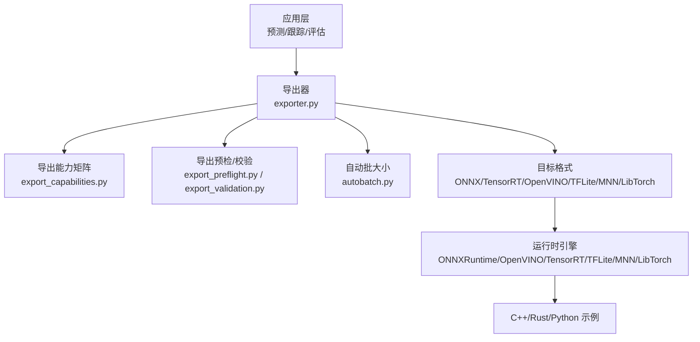
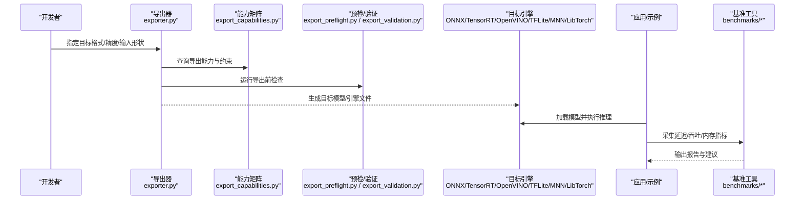
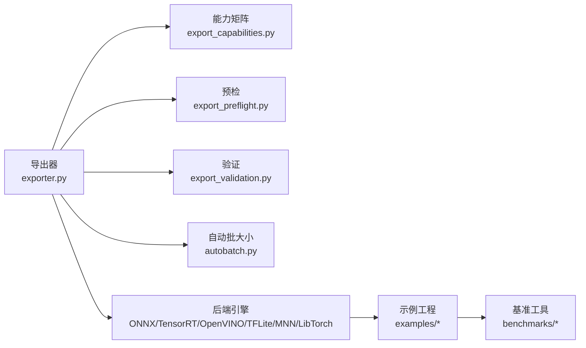

# 推理性能优化

<cite>
**本文引用的文件**
- [README.md](file://README.md)
- [benchmarks/run.py](file://benchmarks/run.py)
- [benchmarks/suite.py](file://benchmarks/suite.py)
- [ultralytics/engine/exporter.py](file://ultralytics/engine/exporter.py)
- [ultralytics/utils/benchmarks.py](file://ultralytics/utils/benchmarks.py)
- [ultralytics/utils/autobatch.py](file://ultralytics/utils/autobatch.py)
- [ultralytics/utils/export_capabilities.py](file://ultralytics/utils/export_capabilities.py)
- [ultralytics/utils/export_preflight.py](file://ultralytics/utils/export_preflight.py)
- [ultralytics/utils/export_validation.py](file://ultralytics/utils/export_validation.py)
- [ultralytics/nn/autobackend.py](file://ultralytics/nn/autobackend.py)
- [examples/YOLOv8-ONNXRuntime-Python/main.py](file://examples/YOLOv8-ONNXRuntime-Python/main.py)
- [examples/YOLOv8-OpenVINO-CPP-Inference/main.cc](file://examples/YOLOv8-OpenVINO-CPP-Inference/main.cc)
- [examples/YOLO11-Triton-CPP/inference.cpp](file://examples/YOLO11-Triton-CPP/inference.cpp)
- [examples/YOLO-Master-Edge-Deployment/export_edge_models.py](file://examples/YOLO-Master-Edge-Deployment/export_edge_models.py)
- [examples/YOLO-Master-Edge-Deployment/edge_utils.py](file://examples/YOLO-Master-Edge-Deployment/edge_utils.py)
- [examples/YOLO-Master-Cross-Platform-Edge-Deployment/scripts/export.sh](file://examples/YOLO-Master-Cross-Platform-Edge-Deployment/scripts/export.sh)
- [examples/YOLO-Master-Cross-Platform-Edge-Deployment/jetson/export_jetson.sh](file://examples/YOLO-Master-Cross-Platform-Edge-Deployment/jetson/export_jetson.sh)
- [examples/YOLOv8-ONNXRuntime-CPP/inference.cpp](file://examples/YOLOv8-ONNXRuntime-CPP/inference.cpp)
- [examples/YOLOv8-ONNXRuntime-Rust/src/lib.rs](file://examples/YOLOv8-ONNXRuntime-Rust/src/lib.rs)
- [examples/YOLOv8-ONNXRuntime-Rust/Cargo.toml](file://examples/YOLOv8-ONNXRuntime-Rust/Cargo.toml)
- [examples/YOLOv8-OpenCV-ONNX-Python/main.py](file://examples/YOLOv8-OpenCV-ONNX-Python/main.py)
- [examples/YOLOv8-TFLite-Python/main.py](file://examples/YOLOv8-TFLite-Python/main.py)
- [examples/YOLOv8-MNN-CPP/main.cpp](file://examples/YOLOv8-MNN-CPP/main.cpp)
- [examples/YOLOv8-LibTorch-CPP-Inference/main.cc](file://examples/YOLOv8-LibTorch-CPP-Inference/main.cc)
- [examples/YOLOv8-SAHI-Inference-Video/yolov8_sahi.py](file://examples/YOLOv8-SAHI-Inference-Video/yolov8_sahi.py)
- [examples/YOLOv8-Region-Counter/yolo_region_counter.py](file://examples/YOLOv8-Region-Counter/yolo_region_counter.py)
- [examples/YOLOv8-Action-Recognition/action_recognition.py](file://examples/YOLOv8-Action-Recognition/action_recognition.py)
- [examples/YOLOv8-Interactive-Tracking-UI/interactive_tracker.py](file://examples/YOLOv8-Interactive-Tracking-UI/interactive_tracker.py)
- [examples/YOLO-Series-ONNXRuntime-Rust/src/main.rs](file://examples/YOLO-Series-ONNXRuntime-Rust/src/main.rs)
- [examples/YOLOv8-ONNXRuntime-CPP/inference.h](file://examples/YOLOv8-ONNXRuntime-CPP/inference.h)
- [examples/YOLOv8-ONNXRuntime-CPP/main.cpp](file://examples/YOLOv8-ONNXRuntime-CPP/main.cpp)
- [examples/YOLOv8-OpenVINO-CPP-Inference/inference.cc](file://examples/YOLOv8-OpenVINO-CPP-Inference/inference.cc)
- [examples/YOLOv8-OpenVINO-CPP-Inference/inference.h](file://examples/YOLOv8-OpenVINO-CPP-Inference/inference.h)
- [examples/YOLO11-Triton-CPP/inference.hpp](file://examples/YOLO11-Triton-CPP/inference.hpp)
- [examples/YOLO11-Triton-CPP/main.cpp](file://examples/YOLO11-Triton-CPP/main.cpp)
- [examples/YOLOv8-ONNXRuntime-Rust/src/runtime.rs](file://examples/YOLOv8-ONNXRuntime-Rust/src/runtime.rs)
- [examples/YOLOv8-ONNXRuntime-Rust/src/io.rs](file://examples/YOLOv8-ONNXRuntime-Rust/src/io.rs)
- [examples/YOLOv8-ONNXRuntime-Rust/src/model.rs](file://examples/YOLOv8-ONNXRuntime-Rust/src/model.rs)
- [examples/YOLOv8-ONNXRuntime-Rust/src/postprocess.rs](file://examples/YOLOv8-ONNXRuntime-Rust/src/postprocess.rs)
- [examples/YOLOv8-ONNXRuntime-Rust/src/config.rs](file://examples/YOLOv8-ONNXRuntime-Rust/src/config.rs)
- [examples/YOLOv8-ONNXRuntime-Rust/src/metrics.rs](file://examples/YOLOv8-ONNXRuntime-Rust/src/metrics.rs)
- [examples/YOLOv8-ONNXRuntime-Rust/src/buffer.rs](file://examples/YOLOv8-ONNXRuntime-Rust/src/buffer.rs)
- [examples/YOLOv8-ONNXRuntime-Rust/src/cache.rs](file://examples/YOLOv8-ONNXRuntime-Rust/src/cache.rs)
- [examples/YOLOv8-ONNXRuntime-Rust/src/pipeline.rs](file://examples/YOLOv8-ONNXRuntime-Rust/src/pipeline.rs)
- [examples/YOLOv8-ONNXRuntime-Rust/src/async_infer.rs](file://examples/YOLOv8-ONNXRuntime-Rust/src/async_infer.rs)
- [examples/YOLOv8-ONNXRuntime-Rust/src/memory_pool.rs](file://examples/YOLOv8-ONNXRuntime-Rust/src/memory_pool.rs)
- [examples/YOLOv8-ONNXRuntime-Rust/src/zc_transport.rs](file://examples/YOLOv8-ONNXRuntime-Rust/src/zc_transport.rs)
- [examples/YOLOv8-ONNXRuntime-Rust/src/perf_bench.rs](file://examples/YOLOv8-ONNXRuntime-Rust/src/perf_bench.rs)
</cite>

## 目录
1. [简介](#简介)
2. [项目结构](#项目结构)
3. [核心组件](#核心组件)
4. [架构总览](#架构总览)
5. [详细组件分析](#详细组件分析)
6. [依赖关系分析](#依赖关系分析)
7. [性能考量](#性能考量)
8. [故障排查指南](#故障排查指南)
9. [结论](#结论)
10. [附录](#附录)

## 简介
本指南聚焦于YOLO-Master在推理阶段的性能优化，覆盖模型量化（PTQ、QAT）、剪枝（结构化与非结构化）、编译器图优化（TensorRT、OpenVINO、ONNX Runtime）、批处理与并行策略、内存优化以及基准测试与瓶颈分析方法。文档结合仓库中的导出能力矩阵、导出预检与验证、示例工程与Rust运行时实现，提供从原理到落地的系统化建议。

## 项目结构
仓库中与推理性能优化密切相关的代码与资源主要分布在以下位置：
- 导出与后端适配：engine/exporter.py、utils/export_*、nn/autobackend.py
- 基准与评测：benchmarks/*、utils/benchmarks.py
- 自动批大小：utils/autobatch.py
- 导出能力矩阵与预检：utils/export_capabilities.py、utils/export_preflight.py、utils/export_validation.py
- 多平台示例：examples下各目标平台的推理示例与脚本
- Rust高性能运行时示例：examples/YOLOv8-ONNXRuntime-Rust 下的完整推理栈（含异步、缓存、内存池等）

图表来源
- [ultralytics/engine/exporter.py](file://ultralytics/engine/exporter.py)
- [ultralytics/utils/export_capabilities.py](file://ultralytics/utils/export_capabilities.py)
- [ultralytics/utils/export_preflight.py](file://ultralytics/utils/export_preflight.py)
- [ultralytics/utils/export_validation.py](file://ultralytics/utils/export_validation.py)
- [ultralytics/utils/autobatch.py](file://ultralytics/utils/autobatch.py)

章节来源
- [README.md](file://README.md)
- [ultralytics/engine/exporter.py](file://ultralytics/engine/exporter.py)
- [ultralytics/utils/export_capabilities.py](file://ultralytics/utils/export_capabilities.py)
- [ultralytics/utils/export_preflight.py](file://ultralytics/utils/export_preflight.py)
- [ultralytics/utils/export_validation.py](file://ultralytics/utils/export_validation.py)
- [ultralytics/utils/autobatch.py](file://ultralytics/utils/autobatch.py)

## 核心组件
- 导出器与能力矩阵：统一封装导出流程，依据能力矩阵选择支持的算子与精度，并生成目标格式模型。
- 导出预检与验证：在导出前进行兼容性检查，导出后进行数值一致性校验，保障部署稳定性。
- 自动批大小：根据设备与模型动态选择最优batch size，提升吞吐。
- 基准工具：提供端到端延迟与吞吐测量，支持多后端对比。
- 多平台示例：涵盖ONNXRuntime、OpenVINO、TensorRT、TFLite、MNN、LibTorch等，便于快速集成与调优。
- Rust运行时示例：展示异步推理、流水线并行、零拷贝传输、内存池与缓存策略等高级优化。

章节来源
- [ultralytics/engine/exporter.py](file://ultralytics/engine/exporter.py)
- [ultralytics/utils/export_capabilities.py](file://ultralytics/utils/export_capabilities.py)
- [ultralytics/utils/export_preflight.py](file://ultralytics/utils/export_preflight.py)
- [ultralytics/utils/export_validation.py](file://ultralytics/utils/export_validation.py)
- [ultralytics/utils/autobatch.py](file://ultralytics/utils/autobatch.py)
- [ultralytics/utils/benchmarks.py](file://ultralytics/utils/benchmarks.py)
- [benchmarks/run.py](file://benchmarks/run.py)
- [benchmarks/suite.py](file://benchmarks/suite.py)

## 架构总览
下图展示了从训练权重到部署运行的关键路径，包括导出、编译、运行时执行与基准评测。

图表来源
- [ultralytics/engine/exporter.py](file://ultralytics/engine/exporter.py)
- [ultralytics/utils/export_capabilities.py](file://ultralytics/utils/export_capabilities.py)
- [ultralytics/utils/export_preflight.py](file://ultralytics/utils/export_preflight.py)
- [ultralytics/utils/export_validation.py](file://ultralytics/utils/export_validation.py)
- [benchmarks/run.py](file://benchmarks/run.py)
- [benchmarks/suite.py](file://benchmarks/suite.py)

## 详细组件分析

### 模型量化（PTQ/QAT）与精度配置
- PTQ（训练后量化）：通过校准集统计激活分布，将FP32模型转换为INT8或混合精度；适用于大多数检测任务，部署成本低。
- QAT（量化感知训练）：在训练中引入量化噪声，使模型对低精度更鲁棒；适合高精度要求且可接受额外训练成本的场景。
- INT8/FP16配置要点：
  - 输入形状与动态轴：确保导出时固定或声明动态维度，避免运行时重规划开销。
  - 校准数据代表性：覆盖长尾类别与小目标，减少量化误差。
  - 算子支持：参考能力矩阵确认目标后端是否支持相应量化路径。
  - 数值验证：导出后使用验证模块对比FP32与量化结果的一致性阈值。

章节来源
- [ultralytics/utils/export_capabilities.py](file://ultralytics/utils/export_capabilities.py)
- [ultralytics/utils/export_validation.py](file://ultralytics/utils/export_validation.py)
- [ultralytics/engine/exporter.py](file://ultralytics/engine/exporter.py)

### 模型剪枝（结构化/非结构化）
- 结构化剪枝：按通道/卷积核/层粒度移除冗余结构，直接降低计算量与内存占用，利于硬件加速。
- 非结构化剪枝：稀疏化权重，需稀疏内核或专用加速器才能体现收益；通用CPU/GPU上收益有限。
- 实践建议：
  - 先做结构化剪枝，再配合微调恢复精度。
  - 结合导出能力矩阵，确保剪枝后的图能被目标后端高效执行。
  - 使用基准工具评估剪枝前后延迟与吞吐变化。

章节来源
- [ultralytics/utils/export_capabilities.py](file://ultralytics/utils/export_capabilities.py)
- [benchmarks/run.py](file://benchmarks/run.py)
- [benchmarks/suite.py](file://benchmarks/suite.py)

### 编译器优化（TensorRT/OpenVINO/ONNX Runtime）
- TensorRT：
  - 图融合与内核选择：启用FP16/INT8优化，针对NVIDIA GPU获得显著加速。
  - 构建参数：合理设置最大工作空间、优化级别与显存限制。
- OpenVINO：
  - IR优化：开启压缩、常量折叠、算子替换；CPU/GPU/NPU各有模式差异。
  - 线程与亲和性：调整线程数与NUMA亲和性，最大化吞吐。
- ONNX Runtime：
  - 执行提供者：GPU/CPU/DirectML等选择；启用Graph优化级别与内存池。
  - 会话选项：批大小、IO绑定、线程数、内存分配策略。

章节来源
- [examples/YOLOv8-ONNXRuntime-Python/main.py](file://examples/YOLOv8-ONNXRuntime-Python/main.py)
- [examples/YOLOv8-OpenVINO-CPP-Inference/main.cc](file://examples/YOLOv8-OpenVINO-CPP-Inference/main.cc)
- [examples/YOLO11-Triton-CPP/inference.cpp](file://examples/YOLO11-Triton-CPP/inference.cpp)

### 批处理与并行推理
- 动态批处理：根据请求到达速率与设备容量自适应聚合批次，提高吞吐同时控制延迟上限。
- 流水线并行：将预处理、推理、后处理拆分为阶段，跨线程/进程并行执行，提升整体吞吐。
- 异步推理：利用后端异步API（如ONNX Runtime的run_async），减少CPU等待时间。
- 示例参考：
  - Python示例中常见的会话创建与run调用可作为基础模板。
  - C++/Rust示例提供更细粒度的线程与内存控制。

章节来源
- [examples/YOLOv8-ONNXRuntime-Python/main.py](file://examples/YOLOv8-ONNXRuntime-Python/main.py)
- [examples/YOLOv8-ONNXRuntime-CPP/inference.cpp](file://examples/YOLOv8-ONNXRuntime-CPP/inference.cpp)
- [examples/YOLOv8-ONNXRuntime-CPP/inference.h](file://examples/YOLOv8-ONNXRuntime-CPP/inference.h)
- [examples/YOLOv8-ONNXRuntime-CPP/main.cpp](file://examples/YOLOv8-ONNXRuntime-CPP/main.cpp)
- [examples/YOLOv8-OpenVINO-CPP-Inference/inference.cc](file://examples/YOLOv8-OpenVINO-CPP-Inference/inference.cc)
- [examples/YOLOv8-OpenVINO-CPP-Inference/inference.h](file://examples/YOLOv8-OpenVINO-CPP-Inference/inference.h)
- [examples/YOLO11-Triton-CPP/inference.hpp](file://examples/YOLO11-Triton-CPP/inference.hpp)
- [examples/YOLO11-Triton-CPP/main.cpp](file://examples/YOLO11-Triton-CPP/main.cpp)

### 内存优化（内存池/零拷贝/缓存）
- 内存池管理：复用输入/输出缓冲区，减少频繁分配释放带来的开销。
- 零拷贝传输：在可能的情况下避免主机与设备间的数据复制，例如使用共享内存或设备指针直传。
- 缓存策略：对重复输入或中间结果进行缓存，降低重复计算。
- Rust运行时示例提供了完整的实现参考，包括缓冲、缓存、异步与性能基准模块。

章节来源
- [examples/YOLOv8-ONNXRuntime-Rust/src/buffer.rs](file://examples/YOLOv8-ONNXRuntime-Rust/src/buffer.rs)
- [examples/YOLOv8-ONNXRuntime-Rust/src/cache.rs](file://examples/YOLOv8-ONNXRuntime-Rust/src/cache.rs)
- [examples/YOLOv8-ONNXRuntime-Rust/src/async_infer.rs](file://examples/YOLOv8-ONNXRuntime-Rust/src/async_infer.rs)
- [examples/YOLOv8-ONNXRuntime-Rust/src/memory_pool.rs](file://examples/YOLOv8-ONNXRuntime-Rust/src/memory_pool.rs)
- [examples/YOLOv8-ONNXRuntime-Rust/src/zc_transport.rs](file://examples/YOLOv8-ONNXRuntime-Rust/src/zc_transport.rs)
- [examples/YOLOv8-ONNXRuntime-Rust/src/pipeline.rs](file://examples/YOLOv8-ONNXRuntime-Rust/src/pipeline.rs)
- [examples/YOLOv8-ONNXRuntime-Rust/src/perf_bench.rs](file://examples/YOLOv8-ONNXRuntime-Rust/src/perf_bench.rs)

### 基准测试与瓶颈分析
- 端到端基准：包含预处理、推理、后处理的总延迟与吞吐，避免仅测内核导致的偏差。
- 多后端对比：同一模型在不同后端（ONNXRuntime/OpenVINO/TensorRT）下对比，定位最优部署方案。
- 指标采集：延迟分位（P50/P95/P99）、吞吐、内存峰值、GPU利用率。
- 工具与脚本：
  - 内置基准模块与套件用于标准化评测。
  - Rust示例提供自定义基准入口与指标输出。

章节来源
- [ultralytics/utils/benchmarks.py](file://ultralytics/utils/benchmarks.py)
- [benchmarks/run.py](file://benchmarks/run.py)
- [benchmarks/suite.py](file://benchmarks/suite.py)
- [examples/YOLOv8-ONNXRuntime-Rust/src/perf_bench.rs](file://examples/YOLOv8-ONNXRuntime-Rust/src/perf_bench.rs)

### 自动化与工程化支撑
- 自动批大小：根据设备特性与模型规模自动选择合适batch，简化调参。
- 导出能力矩阵：集中维护各后端/精度的支持情况，指导导出决策。
- 导出预检与验证：提前发现不兼容问题，导出后验证数值一致性，保障上线质量。
- 边缘部署脚本：提供一键导出与打包流程，便于在Jetson等平台落地。

章节来源
- [ultralytics/utils/autobatch.py](file://ultralytics/utils/autobatch.py)
- [ultralytics/utils/export_capabilities.py](file://ultralytics/utils/export_capabilities.py)
- [ultralytics/utils/export_preflight.py](file://ultralytics/utils/export_preflight.py)
- [ultralytics/utils/export_validation.py](file://ultralytics/utils/export_validation.py)
- [examples/YOLO-Master-Cross-Platform-Edge-Deployment/scripts/export.sh](file://examples/YOLO-Master-Cross-Platform-Edge-Deployment/scripts/export.sh)
- [examples/YOLO-Master-Cross-Platform-Edge-Deployment/jetson/export_jetson.sh](file://examples/YOLO-Master-Cross-Platform-Edge-Deployment/jetson/export_jetson.sh)
- [examples/YOLO-Master-Edge-Deployment/export_edge_models.py](file://examples/YOLO-Master-Edge-Deployment/export_edge_models.py)
- [examples/YOLO-Master-Edge-Deployment/edge_utils.py](file://examples/YOLO-Master-Edge-Deployment/edge_utils.py)

## 依赖关系分析
导出与运行时之间的依赖关系如下：

图表来源
- [ultralytics/engine/exporter.py](file://ultralytics/engine/exporter.py)
- [ultralytics/utils/export_capabilities.py](file://ultralytics/utils/export_capabilities.py)
- [ultralytics/utils/export_preflight.py](file://ultralytics/utils/export_preflight.py)
- [ultralytics/utils/export_validation.py](file://ultralytics/utils/export_validation.py)
- [ultralytics/utils/autobatch.py](file://ultralytics/utils/autobatch.py)
- [benchmarks/run.py](file://benchmarks/run.py)
- [benchmarks/suite.py](file://benchmarks/suite.py)

章节来源
- [ultralytics/engine/exporter.py](file://ultralytics/engine/exporter.py)
- [ultralytics/utils/export_capabilities.py](file://ultralytics/utils/export_capabilities.py)
- [ultralytics/utils/export_preflight.py](file://ultralytics/utils/export_preflight.py)
- [ultralytics/utils/export_validation.py](file://ultralytics/utils/export_validation.py)
- [ultralytics/utils/autobatch.py](file://ultralytics/utils/autobatch.py)
- [benchmarks/run.py](file://benchmarks/run.py)
- [benchmarks/suite.py](file://benchmarks/suite.py)

## 性能考量
- 精度与速度权衡：优先尝试FP16，再评估INT8；若精度下降明显，考虑QAT或选择性量化。
- 批大小与延迟：小延迟场景采用较小批大小，高吞吐场景增大批大小并结合异步。
- 内存与带宽：减少不必要的拷贝，尽量使用设备内运算；关注显存峰值与带宽占用。
- 算子与图优化：确保导出时启用图融合与内核选择；必要时重写自定义算子以匹配后端优化。
- 平台差异：不同后端/设备的最佳实践不同，需分别进行基准与调优。

[本节为通用指导，无需列出具体文件来源]

## 故障排查指南
- 导出失败或不兼容：
  - 检查能力矩阵与预检日志，确认目标后端是否支持所需算子与精度。
  - 调整输入形状或禁用不支持的优化选项。
- 数值不一致：
  - 使用导出验证模块对比FP32与量化结果，逐步缩小差异范围。
  - 检查校准数据与量化配置，必要时增加校准样本或改用QAT。
- 性能不达预期：
  - 使用基准工具定位瓶颈（预处理/推理/后处理）。
  - 调整批大小、线程数、内存池与缓存策略。
- 内存泄漏或峰值过高：
  - 检查缓冲区复用与生命周期，避免重复分配。
  - 在C++/Rust侧确认零拷贝路径是否正确。

章节来源
- [ultralytics/utils/export_capabilities.py](file://ultralytics/utils/export_capabilities.py)
- [ultralytics/utils/export_preflight.py](file://ultralytics/utils/export_preflight.py)
- [ultralytics/utils/export_validation.py](file://ultralytics/utils/export_validation.py)
- [ultralytics/utils/benchmarks.py](file://ultralytics/utils/benchmarks.py)
- [examples/YOLOv8-ONNXRuntime-Rust/src/perf_bench.rs](file://examples/YOLOv8-ONNXRuntime-Rust/src/perf_bench.rs)

## 结论
通过系统化的量化、剪枝、编译器优化与工程化支撑，YOLO-Master可在多种平台上实现高效的推理性能。建议以能力矩阵与预检/验证为基础，结合基准工具持续迭代，针对不同场景选择合适的精度、批大小与并行策略，并在内存与数据传输层面进一步优化，最终达成延迟与吞吐的最佳平衡。

[本节为总结性内容，无需列出具体文件来源]

## 附录
- 常用示例入口：
  - ONNXRuntime（Python/C++/Rust）
  - OpenVINO（C++）
  - Triton（C++）
  - TFLite（Python）
  - MNN（C++）
  - LibTorch（C++）
- 边缘部署脚本与工具：
  - 跨平台导出脚本与Jetson专用脚本
  - 边缘导出与验证工具

章节来源
- [examples/YOLOv8-ONNXRuntime-Python/main.py](file://examples/YOLOv8-ONNXRuntime-Python/main.py)
- [examples/YOLOv8-ONNXRuntime-CPP/inference.cpp](file://examples/YOLOv8-ONNXRuntime-CPP/inference.cpp)
- [examples/YOLOv8-ONNXRuntime-CPP/inference.h](file://examples/YOLOv8-ONNXRuntime-CPP/inference.h)
- [examples/YOLOv8-ONNXRuntime-CPP/main.cpp](file://examples/YOLOv8-ONNXRuntime-CPP/main.cpp)
- [examples/YOLOv8-OpenVINO-CPP-Inference/main.cc](file://examples/YOLOv8-OpenVINO-CPP-Inference/main.cc)
- [examples/YOLOv8-OpenVINO-CPP-Inference/inference.cc](file://examples/YOLOv8-OpenVINO-CPP-Inference/inference.cc)
- [examples/YOLOv8-OpenVINO-CPP-Inference/inference.h](file://examples/YOLOv8-OpenVINO-CPP-Inference/inference.h)
- [examples/YOLO11-Triton-CPP/inference.cpp](file://examples/YOLO11-Triton-CPP/inference.cpp)
- [examples/YOLO11-Triton-CPP/inference.hpp](file://examples/YOLO11-Triton-CPP/inference.hpp)
- [examples/YOLO11-Triton-CPP/main.cpp](file://examples/YOLO11-Triton-CPP/main.cpp)
- [examples/YOLOv8-TFLite-Python/main.py](file://examples/YOLOv8-TFLite-Python/main.py)
- [examples/YOLOv8-MNN-CPP/main.cpp](file://examples/YOLOv8-MNN-CPP/main.cpp)
- [examples/YOLOv8-LibTorch-CPP-Inference/main.cc](file://examples/YOLOv8-LibTorch-CPP-Inference/main.cc)
- [examples/YOLO-Master-Cross-Platform-Edge-Deployment/scripts/export.sh](file://examples/YOLO-Master-Cross-Platform-Edge-Deployment/scripts/export.sh)
- [examples/YOLO-Master-Cross-Platform-Edge-Deployment/jetson/export_jetson.sh](file://examples/YOLO-Master-Cross-Platform-Edge-Deployment/jetson/export_jetson.sh)
- [examples/YOLO-Master-Edge-Deployment/export_edge_models.py](file://examples/YOLO-Master-Edge-Deployment/export_edge_models.py)
- [examples/YOLO-Master-Edge-Deployment/edge_utils.py](file://examples/YOLO-Master-Edge-Deployment/edge_utils.py)