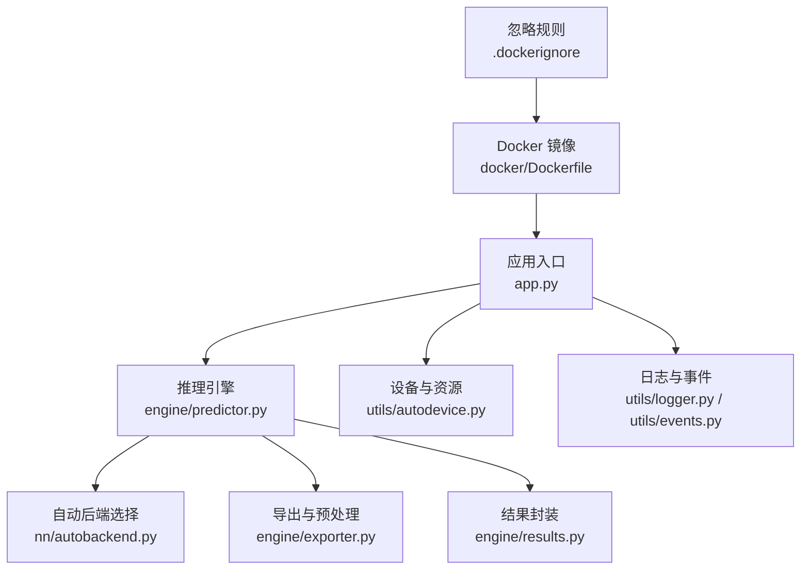
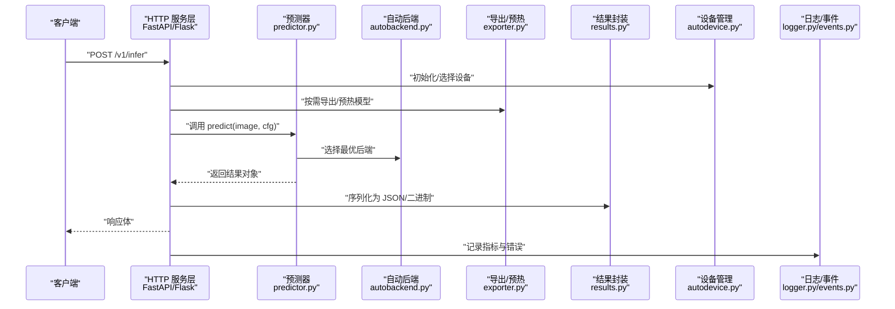
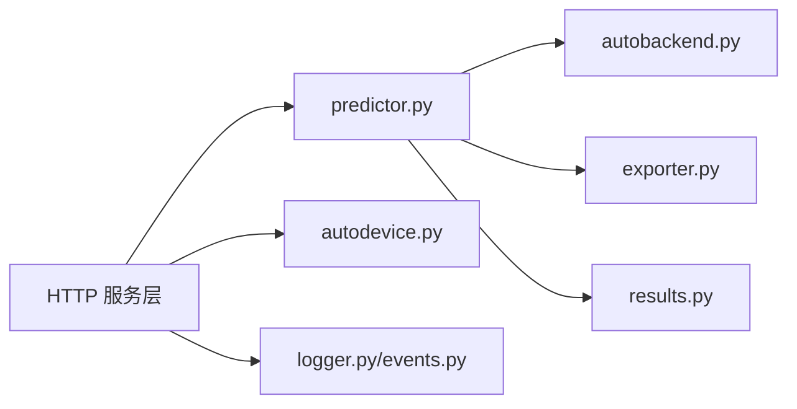

# 服务器端部署

<cite>
**本文引用的文件**
- [Dockerfile](file://docker/Dockerfile)
- [.dockerignore](file://.dockerignore)
- [app.py](file://app.py)
- [pyproject.toml](file://pyproject.toml)
- [README.md](file://README.md)
- [model-deployment-options.md](file://docs/en/guides/model-deployment-options.md)
- [triton-inference-server.md](file://docs/en/guides/triton-inference-server.md)
- [queue-management.md](file://docs/en/guides/queue-management.md)
- [yolo-thread-safe-inference.md](file://docs/en/guides/yolo-thread-safe-inference.md)
- [streamlit_inference.py](file://ultralytics/solutions/streamlit_inference.py)
- [solutions.py](file://ultralytics/solutions/solutions.py)
- [autobackend.py](file://ultralytics/nn/autobackend.py)
- [exporter.py](file://ultralytics/engine/exporter.py)
- [predictor.py](file://ultralytics/engine/predictor.py)
- [results.py](file://ultralytics/engine/results.py)
- [torch_utils.py](file://ultralytics/utils/torch_utils.py)
- [autodevice.py](file://ultralytics/utils/autodevice.py)
- [benchmarks.py](file://ultralytics/utils/benchmarks.py)
- [logger.py](file://ultralytics/utils/logger.py)
- [events.py](file://ultralytics/utils/events.py)
- [errors.py](file://ultralytics/utils/errors.py)
- [run_yolo_master_skill.py](file://agent/scripts/run_yolo_master_skill.py)
- [core_handlers.py](file://agent/runtime/cli/core_handlers.py)
- [executor.py](file://agent/runtime/cli/executor.py)
- [dispatcher.py](file://agent/runtime/cli/dispatcher.py)
- [pipeline.py](file://agent/runtime/cli/pipeline.py)
</cite>

## 目录
1. [简介](#简介)
2. [项目结构](#项目结构)
3. [核心组件](#核心组件)
4. [架构总览](#架构总览)
5. [详细组件分析](#详细组件分析)
6. [依赖关系分析](#依赖关系分析)
7. [性能与并发优化](#性能与并发优化)
8. [GPU资源管理与多实例部署](#gpu资源管理与多实例部署)
9. [监控、日志与健康检查](#监控日志与健康检查)
10. [生产环境部署模板与自动化脚本](#生产环境部署模板与自动化脚本)
11. [故障排查指南](#故障排查指南)
12. [结论](#结论)

## 简介
本指南面向在服务器端部署 YOLO-Master 的工程师与运维人员，聚焦以下目标：
- 基于 Docker 的容器化镜像构建与环境隔离
- 环境变量配置、资源限制与安全加固
- REST API 服务化（FastAPI/Flask）推理服务设计
- 批量推理与并发处理优化（连接池、请求队列、负载均衡）
- GPU 资源管理、模型热加载与多实例部署
- 监控、日志收集、健康检查与可观测性
- 生产环境部署模板与自动化脚本

## 项目结构
仓库包含推理引擎、导出工具、解决方案示例、文档与示例脚本等。与服务器端部署直接相关的顶层文件包括：
- docker/Dockerfile：容器镜像定义
- .dockerignore：构建上下文过滤
- app.py：应用入口（用于演示或集成）
- pyproject.toml：Python 包与依赖声明
- docs/en/guides/*：部署与推理相关指南
- ultralytics/*：推理引擎、后端自动选择、导出与结果处理
- agent/*：技能编排与执行器（可用于任务调度与流水线）

图表来源
- [app.py](file://app.py)
- [predictor.py](file://ultralytics/engine/predictor.py)
- [autobackend.py](file://ultralytics/nn/autobackend.py)
- [exporter.py](file://ultralytics/engine/exporter.py)
- [results.py](file://ultralytics/engine/results.py)
- [autodevice.py](file://ultralytics/utils/autodevice.py)
- [logger.py](file://ultralytics/utils/logger.py)
- [events.py](file://ultralytics/utils/events.py)
- [Dockerfile](file://docker/Dockerfile)
- [.dockerignore](file://.dockerignore)

章节来源
- [Dockerfile](file://docker/Dockerfile)
- [.dockerignore](file://.dockerignore)
- [app.py](file://app.py)
- [pyproject.toml](file://pyproject.toml)
- [README.md](file://README.md)

## 核心组件
- 推理引擎
  - predictor：统一预测接口，负责输入预处理、模型推理、后处理与结果组装
  - autobackend：根据环境与权重格式自动选择最优后端（如 Torch/TensorRT/OpenVINO/ONNXRuntime）
  - exporter：模型导出与预编译流程，为不同后端生成最佳运行时工件
  - results：标准化输出对象，便于序列化与可视化
- 运行期支撑
  - autodevice：设备探测与选择（CPU/GPU），结合 CUDA 可用性进行回退
  - logger/events：结构化日志与事件上报，便于监控与追踪
  - torch_utils：张量与计算图辅助工具，提升稳定性与性能
- 解决方案与示例
  - streamlit_inference：交互式推理演示，可作为 API 服务化的参考
  - solutions：通用视觉解决方案模块，提供复用能力

章节来源
- [predictor.py](file://ultralytics/engine/predictor.py)
- [autobackend.py](file://ultralytics/nn/autobackend.py)
- [exporter.py](file://ultralytics/engine/exporter.py)
- [results.py](file://ultralytics/engine/results.py)
- [autodevice.py](file://ultralytics/utils/autodevice.py)
- [logger.py](file://ultralytics/utils/logger.py)
- [events.py](file://ultralytics/utils/events.py)
- [torch_utils.py](file://ultralytics/utils/torch_utils.py)
- [streamlit_inference.py](file://ultralytics/solutions/streamlit_inference.py)
- [solutions.py](file://ultralytics/solutions/solutions.py)

## 架构总览
下图展示从 HTTP 请求到推理结果的端到端路径，以及关键组件间的依赖关系。

图表来源
- [predictor.py](file://ultralytics/engine/predictor.py)
- [autobackend.py](file://ultralytics/nn/autobackend.py)
- [exporter.py](file://ultralytics/engine/exporter.py)
- [results.py](file://ultralytics/engine/results.py)
- [autodevice.py](file://ultralytics/utils/autodevice.py)
- [logger.py](file://ultralytics/utils/logger.py)
- [events.py](file://ultralytics/utils/events.py)

## 详细组件分析

### 容器化与镜像构建
- 基础镜像选择
  - 建议使用官方 CUDA + Python 基础镜像以启用 GPU 加速；若仅 CPU 推理，可使用精简版基础镜像降低体积
- 依赖安装
  - 通过 pyproject.toml 声明依赖，使用 pip 或 uv 安装；确保 PyTorch 版本与 CUDA 驱动匹配
- 工作目录与权限
  - 设置非 root 用户运行，最小化暴露端口，挂载只读模型卷
- 构建上下文过滤
  - 使用 .dockerignore 排除测试、缓存与无关文件，缩短构建时间并减小镜像体积
- 环境变量
  - 典型变量：CUDA_VISIBLE_DEVICES、OMP_NUM_THREADS、PYTORCH_CUDA_ALLOC_CONF、YOLO_MODEL_PATH、LOG_LEVEL 等
- 健康检查
  - 在镜像内暴露 /healthz 或 /readyz 端点，返回服务就绪状态

章节来源
- [Dockerfile](file://docker/Dockerfile)
- [.dockerignore](file://.dockerignore)
- [pyproject.toml](file://pyproject.toml)

### REST API 服务化（FastAPI/Flask）
- 路由设计
  - POST /v1/infer：单图/多图推理，支持 base64 或 URL 输入
  - GET /v1/models：列出已加载模型与元信息
  - GET /healthz：存活探针
  - GET /readyz：就绪探针（含模型加载完成、后端可用）
- 请求校验与限流
  - 使用 Pydantic 模型校验输入字段；对大图/高频请求实施速率限制
- 异步与并发
  - FastAPI 推荐 async/await；Flask 可通过 gunicorn/uwsgi + 多进程/线程组合
- 结果序列化
  - 将 engine/results.py 的结果转换为轻量 JSON，必要时返回缩略图或标注图像的二进制附件
- 安全与鉴权
  - 前置网关鉴权、签名校验、IP 白名单、TLS 终止

章节来源
- [app.py](file://app.py)
- [results.py](file://ultralytics/engine/results.py)

### 批量推理与并发处理
- 批处理策略
  - 动态批：按时间窗口聚合请求，最大化 GPU 利用率
  - 固定批：按固定 batch_size 切分，保证延迟上限
- 队列与背压
  - 使用内存队列（如 asyncio.Queue）缓冲突发流量；当队列长度超过阈值时拒绝新请求或降级
- 连接池与后端复用
  - 复用模型实例与后端会话；避免重复加载与预热
- 负载均衡
  - 多副本部署，配合 Ingress/Service 或 Nginx 做轮询/最少连接分发
- 线程安全
  - 遵循 yolo-thread-safe-inference 实践，避免跨进程共享可变状态

章节来源
- [queue-management.md](file://docs/en/guides/queue-management.md)
- [yolo-thread-safe-inference.md](file://docs/en/guides/yolo-thread-safe-inference.md)

### GPU 资源管理与多实例部署
- 设备选择
  - 通过 autodevice 自动探测可用 GPU；也可通过环境变量指定设备
- 显存管理
  - 合理设置 batch_size 与图片尺寸；利用 autocast 与半精度减少显存占用
- 多实例
  - 每个容器绑定一个 GPU（nvidia-container-toolkit）；或使用 MIG（A100/H100）划分切片
- 模型热加载
  - 启动时预热常用模型；支持运行时切换模型权重（需考虑锁与一致性）

章节来源
- [autodevice.py](file://ultralytics/utils/autodevice.py)
- [torch_utils.py](file://ultralytics/utils/torch_utils.py)

### 监控、日志与健康检查
- 指标采集
  - 记录 QPS、P50/P95/P99 延迟、GPU 利用率、显存占用、错误率
- 日志规范
  - 结构化 JSON 日志，包含 trace_id、model、device、batch_size、latency_ms
- 健康检查
  - /healthz：进程存活；/readyz：模型加载完成、后端可用、队列水位正常
- 告警与追踪
  - 对接 Prometheus/Grafana、OpenTelemetry、ELK/Opensearch

章节来源
- [logger.py](file://ultralytics/utils/logger.py)
- [events.py](file://ultralytics/utils/events.py)
- [benchmarks.py](file://ultralytics/utils/benchmarks.py)

## 依赖关系分析
- 组件耦合
  - API 层依赖 predictor；predictor 依赖 autobackend 与 exporter；结果由 results 统一封装
- 外部依赖
  - PyTorch/CUDA、可选 TensorRT/OpenVINO/ONNXRuntime；容器运行时与 NVIDIA 驱动
- 潜在循环依赖
  - 保持分层清晰：API -> Engine -> Utils，避免反向导入

图表来源
- [predictor.py](file://ultralytics/engine/predictor.py)
- [autobackend.py](file://ultralytics/nn/autobackend.py)
- [exporter.py](file://ultralytics/engine/exporter.py)
- [results.py](file://ultralytics/engine/results.py)
- [autodevice.py](file://ultralytics/utils/autodevice.py)
- [logger.py](file://ultralytics/utils/logger.py)
- [events.py](file://ultralytics/utils/events.py)

## 性能与并发优化
- 模型导出与预热
  - 针对目标后端导出最佳格式（TensorRT/ONNX/OpenVINO），并在启动阶段预热
- 批大小与分辨率调优
  - 根据 GPU 容量与延迟 SLA 调整 batch_size 与输入尺寸
- 数据通路优化
  - 使用零拷贝、内存池、并行解码与预处理流水线
- 并发模型
  - 多模型场景下按类别或租户分流，避免热点模型争用
- 基准与压测
  - 使用 benchmarks 工具进行端到端压测，定位瓶颈

章节来源
- [exporter.py](file://ultralytics/engine/exporter.py)
- [benchmarks.py](file://ultralytics/utils/benchmarks.py)

## GPU资源管理与多实例部署
- 容器与驱动
  - 使用 nvidia-docker 或 containerd 的 NVIDIA 插件；确保宿主机驱动与容器内 CUDA 版本兼容
- 资源配额
  - 通过 --gpus 或 Kubernetes Device Plugin 分配 GPU；设置 CPU/内存/显存限制
- 多副本与弹性伸缩
  - 基于 QPS、延迟或队列长度触发 HPA；冷启动优化（模型缓存、镜像预热）
- 故障恢复
  - 失败重试、熔断与降级策略；模型加载失败快速回滚

章节来源
- [autodevice.py](file://ultralytics/utils/autodevice.py)
- [torch_utils.py](file://ultralytics/utils/torch_utils.py)

## 监控、日志与健康检查
- 指标面板
  - 服务层：QPS、错误率、延迟分布
  - 系统层：CPU、内存、磁盘 IO、网络
  - GPU 层：利用率、显存、温度、功耗
- 日志与追踪
  - 统一 trace_id 贯穿请求链路；异常堆栈与上下文信息完整保留
- 健康检查
  - liveness/readiness 探针；模型加载与后端就绪检测

章节来源
- [logger.py](file://ultralytics/utils/logger.py)
- [events.py](file://ultralytics/utils/events.py)
- [benchmarks.py](file://ultralytics/utils/benchmarks.py)

## 生产环境部署模板与自动化脚本
- Docker Compose 模板
  - 定义服务：api、worker（可选）、monitoring（Prometheus/Grafana）
  - 挂载模型卷、日志卷、配置文件卷
  - 设置环境变量与资源限制
- Kubernetes 清单
  - Deployment、Service、HPA、ConfigMap、Secret、Ingress
  - 使用 InitContainer 预热模型；Pod 反亲和分散负载
- 自动化脚本
  - 一键构建镜像、推送镜像仓库、滚动更新、回滚
  - 压测脚本与回归基线对比
- 灰度与蓝绿发布
  - 基于 Ingress 权重或金丝雀发布，逐步放量

章节来源
- [Dockerfile](file://docker/Dockerfile)
- [.dockerignore](file://.dockerignore)
- [pyproject.toml](file://pyproject.toml)

## 故障排查指南
- 常见问题
  - CUDA 不可用：检查驱动版本、容器 GPU 注入、CUDA_VISIBLE_DEVICES
  - 模型加载失败：确认路径、权限、格式与导出产物完整性
  - 显存溢出：降低 batch_size/分辨率，启用半精度，关闭不必要的可视化
  - 高延迟：检查队列积压、I/O 瓶颈、GIL 竞争与线程数
- 诊断步骤
  - 查看结构化日志与事件；抓取慢请求 trace
  - 使用 benchmarks 复现问题；对比不同后端性能
  - 检查健康检查端点与系统指标
- 错误分类与处理
  - 参数校验错误、后端不可用、资源不足、超时与重试策略

章节来源
- [errors.py](file://ultralytics/utils/errors.py)
- [logger.py](file://ultralytics/utils/logger.py)
- [events.py](file://ultralytics/utils/events.py)
- [benchmarks.py](file://ultralytics/utils/benchmarks.py)

## 结论
通过容器化、REST API 服务化、批处理与并发优化、GPU 资源管理与多实例部署，以及完善的监控与日志体系，可在生产环境中稳定高效地运行 YOLO-Master 推理服务。建议结合业务 SLA 持续压测与调优，建立自动化发布与回滚流程，保障服务的高可用与可扩展性。