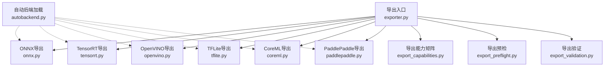
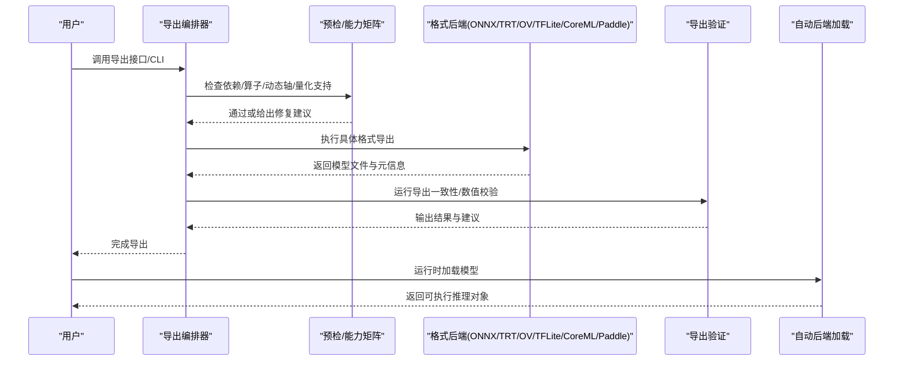
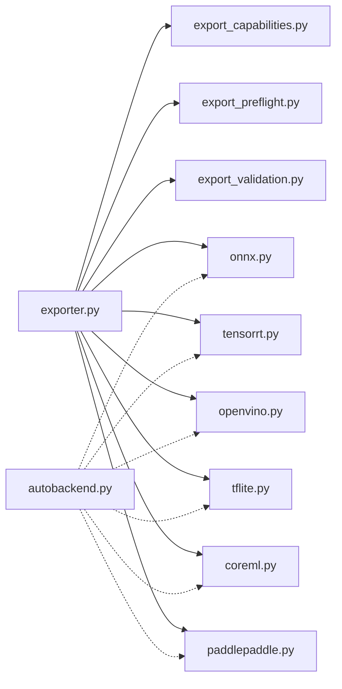

# 模型导出格式详解

<cite>
**本文引用的文件**
- [ultralytics/engine/exporter.py](file://ultralytics/engine/exporter.py)
- [ultralytics/utils/export/__init__.py](file://ultralytics/utils/export/__init__.py)
- [ultralytics/utils/export/onnx.py](file://ultralytics/utils/export/onnx.py)
- [ultralytics/utils/export/tensorrt.py](file://ultralytics/utils/export/tensorrt.py)
- [ultralytics/utils/export/openvino.py](file://ultralytics/utils/export/openvino.py)
- [ultralytics/utils/export/tflite.py](file://ultralytics/utils/export/tflite.py)
- [ultralytics/utils/export/coreml.py](file://ultralytics/utils/export/coreml.py)
- [ultralytics/utils/export/paddlepaddle.py](file://ultralytics/utils/export/paddlepaddle.py)
- [ultralytics/utils/export_capabilities.py](file://ultralytics/utils/export_capabilities.py)
- [ultralytics/utils/export_preflight.py](file://ultralytics/utils/export_preflight.py)
- [ultralytics/utils/export_validation.py](file://ultralytics/utils/export_validation.py)
- [ultralytics/nn/autobackend.py](file://ultralytics/nn/autobackend.py)
- [examples/YOLO-Master-Cross-Platform-Edge-Deployment/coreml_export/export_coreml.py](file://examples/YOLO-Master-Cross-Platform-Edge-Deployment/coreml_export/export_coreml.py)
- [examples/YOLO-Master-Edge-Deployment/export_edge_models.py](file://examples/YOLO-Master-Edge-Deployment/export_edge_models.py)
- [tests/test_exports.py](file://tests/test_exports.py)
- [tests/test_export_roundtrip.py](file://tests/test_export_roundtrip.py)
- [tests/test_export_preflight.py](file://tests/test_export_preflight.py)
- [benchmarks/suite.py](file://benchmarks/suite.py)
- [docs/en/guides/model-deployment-options.md](file://docs/en/guides/model-deployment-options.md)
- [docs/en/integrations/onnx.md](file://docs/en/integrations/onnx.md)
- [docs/en/integrations/tensorrt.md](file://docs/en/integrations/tensorrt.md)
- [docs/en/integrations/openvino.md](file://docs/en/integrations/openvino.md)
- [docs/en/integrations/tflite.md](file://docs/en/integrations/tflite.md)
- [docs/en/integrations/coreml.md](file://docs/en/integrations/coreml.md)
- [docs/en/integrations/paddlepaddle.md](file://docs/en/integrations/paddlepaddle.md)
</cite>

## 目录
1. [简介](#简介)
2. [项目结构](#项目结构)
3. [核心组件](#核心组件)
4. [架构总览](#架构总览)
5. [详细组件分析](#详细组件分析)
6. [依赖关系分析](#依赖关系分析)
7. [性能与基准](#性能与基准)
8. [故障排查指南](#故障排查指南)
9. [结论](#结论)
10. [附录：API与CLI使用示例](#附录api与cli使用示例)

## 简介
本文件面向YOLO-Master模型的部署与工程化，系统性梳理并对比支持的导出格式（ONNX、TensorRT、OpenVINO、TFLite、CoreML、PaddlePaddle等），涵盖各格式的特点、优势、适用场景、导出参数配置、优化选项（动态轴、量化、算子支持）、兼容性要求、推理速度与内存占用对比思路，以及常见问题诊断与解决方案。文档同时提供Python API与CLI的完整使用路径指引，帮助读者在不同平台快速落地部署。

## 项目结构
本项目将“导出”能力集中在引擎层与工具层：
- 引擎入口：统一导出编排与流程控制
- 后端实现：按目标格式拆分的具体导出逻辑
- 前置检查与能力矩阵：环境探测、算子支持、兼容性校验
- 自动加载器：运行时根据扩展名自动选择后端
- 示例与测试：跨平台导出示例与回归测试套件
- 文档：集成指南与部署实践

图表来源
- [ultralytics/engine/exporter.py](file://ultralytics/engine/exporter.py)
- [ultralytics/utils/export/onnx.py](file://ultralytics/utils/export/onnx.py)
- [ultralytics/utils/export/tensorrt.py](file://ultralytics/utils/export/tensorrt.py)
- [ultralytics/utils/export/openvino.py](file://ultralytics/utils/export/openvino.py)
- [ultralytics/utils/export/tflite.py](file://ultralytics/utils/export/tflite.py)
- [ultralytics/utils/export/coreml.py](file://ultralytics/utils/export/coreml.py)
- [ultralytics/utils/export/paddlepaddle.py](file://ultralytics/utils/export/paddlepaddle.py)
- [ultralytics/utils/export_capabilities.py](file://ultralytics/utils/export_capabilities.py)
- [ultralytics/utils/export_preflight.py](file://ultralytics/utils/export_preflight.py)
- [ultralytics/utils/export_validation.py](file://ultralytics/utils/export_validation.py)
- [ultralytics/nn/autobackend.py](file://ultralytics/nn/autobackend.py)

章节来源
- [ultralytics/engine/exporter.py](file://ultralytics/engine/exporter.py)
- [ultralytics/utils/export/__init__.py](file://ultralytics/utils/export/__init__.py)
- [ultralytics/utils/export_capabilities.py](file://ultralytics/utils/export_capabilities.py)
- [ultralytics/utils/export_preflight.py](file://ultralytics/utils/export_preflight.py)
- [ultralytics/utils/export_validation.py](file://ultralytics/utils/export_validation.py)
- [ultralytics/nn/autobackend.py](file://ultralytics/nn/autobackend.py)

## 核心组件
- 导出编排器（Engine Exporter）
  - 负责解析导出参数、调用具体后端、生成产物与元数据、执行导出后验证。
- 格式后端（Format Backends）
  - ONNX/TensorRT/OpenVINO/TFLite/CoreML/PaddlePaddle各自实现导出细节与优化开关。
- 能力矩阵与预检（Capabilities & Preflight）
  - 汇总各格式对任务类型、输入尺寸、动态轴、量化、算子的支持情况；在导出前进行环境与依赖检查。
- 自动后端加载（AutoBackend）
  - 运行时根据模型扩展名自动选择对应推理后端，屏蔽多格式差异。
- 导出验证（Export Validation）
  - 导出后一致性校验（精度/数值稳定性/形状匹配）。

章节来源
- [ultralytics/engine/exporter.py](file://ultralytics/engine/exporter.py)
- [ultralytics/utils/export/onnx.py](file://ultralytics/utils/export/onnx.py)
- [ultralytics/utils/export/tensorrt.py](file://ultralytics/utils/export/tensorrt.py)
- [ultralytics/utils/export/openvino.py](file://ultralytics/utils/export/openvino.py)
- [ultralytics/utils/export/tflite.py](file://ultralytics/utils/export/tflite.py)
- [ultralytics/utils/export/coreml.py](file://ultralytics/utils/export/coreml.py)
- [ultralytics/utils/export/paddlepaddle.py](file://ultralytics/utils/export/paddlepaddle.py)
- [ultralytics/utils/export_capabilities.py](file://ultralytics/utils/export_capabilities.py)
- [ultralytics/utils/export_preflight.py](file://ultralytics/utils/export_preflight.py)
- [ultralytics/utils/export_validation.py](file://ultralytics/utils/export_validation.py)
- [ultralytics/nn/autobackend.py](file://ultralytics/nn/autobackend.py)

## 架构总览
下图展示从用户调用到最终产物的端到端流程，包括预检、导出、验证与自动加载。

图表来源
- [ultralytics/engine/exporter.py](file://ultralytics/engine/exporter.py)
- [ultralytics/utils/export_capabilities.py](file://ultralytics/utils/export_capabilities.py)
- [ultralytics/utils/export_preflight.py](file://ultralytics/utils/export_preflight.py)
- [ultralytics/utils/export_validation.py](file://ultralytics/utils/export_validation.py)
- [ultralytics/nn/autobackend.py](file://ultralytics/nn/autobackend.py)

## 详细组件分析

### ONNX导出
- 特点与优势
  - 通用中间表示，生态完善，便于后续转换为其他格式。
  - 支持动态轴、混合精度、常见NMS/激活/卷积等算子。
- 适用场景
  - 跨框架/跨设备交换；作为TensorRT/OpenVINO/TFLite等的上游。
- 关键导出参数（概念性说明）
  - 输入形状与动态轴：固定或维度可变（如batch、width、height）。
  - 算子版本与优化：opset版本、常量折叠、图优化级别。
  - 精度与数据类型：FP32/FP16/BF16（取决于后端）。
  - NMS与后处理：是否内嵌NMS、类别数、置信度阈值、IOU阈值。
- 兼容性与限制
  - 需关注自定义算子映射与动态形状表达。
- 优化选项
  - 动态轴设置、算子融合、常量传播、图优化。
- 参考实现位置
  - [ultralytics/utils/export/onnx.py](file://ultralytics/utils/export/onnx.py)

章节来源
- [ultralytics/utils/export/onnx.py](file://ultralytics/utils/export/onnx.py)
- [docs/en/integrations/onnx.md](file://docs/en/integrations/onnx.md)

### TensorRT导出
- 特点与优势
  - NVIDIA GPU上极致推理加速，支持FP16/INT8量化、内核融合、插件扩展。
- 适用场景
  - 数据中心/边缘GPU（Jetson/RTX系列）高性能部署。
- 关键导出参数（概念性说明）
  - 精度模式：FP32/FP16/INT8（需校准集）。
  - 最大工作空间、构建时间、优化级别。
  - 动态输入：最小/典型/最大形状范围。
  - 插件与算子：自定义算子注册、NMS插件。
- 兼容性与限制
  - 需要匹配的CUDA/cuDNN/TensorRT版本；部分算子需插件或回退。
- 优化选项
  - INT8量化、层融合、内核自动选择、线程/流并行。
- 参考实现位置
  - [ultralytics/utils/export/tensorrt.py](file://ultralytics/utils/export/tensorrt.py)

章节来源
- [ultralytics/utils/export/tensorrt.py](file://ultralytics/utils/export/tensorrt.py)
- [docs/en/integrations/tensorrt.md](file://docs/en/integrations/tensorrt.md)

### OpenVINO导出
- 特点与优势
  - Intel CPU/GPU/VPU/NPU等多硬件后端，IR中间表示，支持I/O优化与多线程。
- 适用场景
  - Intel平台CPU/核显/UPX/NPU部署，低延迟高吞吐。
- 关键导出参数（概念性说明）
  - 精度：FP32/FP16（含压缩）。
  - 输入形状：静态或动态（批/宽高）。
  - 优化：压缩、图优化、缓存。
- 兼容性与限制
  - 依赖OpenVINO运行时与驱动；某些算子需转换适配。
- 优化选项
  - FP16压缩、多线程推理、异步I/O、模型缓存。
- 参考实现位置
  - [ultralytics/utils/export/openvino.py](file://ultralytics/utils/export/openvino.py)

章节来源
- [ultralytics/utils/export/openvino.py](file://ultralytics/utils/export/openvino.py)
- [docs/en/integrations/openvino.md](file://docs/en/integrations/openvino.md)

### TFLite导出
- 特点与优势
  - 移动端/嵌入式友好，支持CPU/GPU/NPU/Hexagon/DSP等加速器。
- 适用场景
  - Android/iOS/微控制器等低功耗设备。
- 关键导出参数（概念性说明）
  - 量化：INT8/Float16/动态范围量化。
  - 输入形状：静态或动态（受平台限制）。
  - 算子白名单与降级策略。
- 兼容性与限制
  - 不同设备/协处理器支持差异较大，需验证算子覆盖。
- 优化选项
  - 量化、算子替换、图优化、资源裁剪。
- 参考实现位置
  - [ultralytics/utils/export/tflite.py](file://ultralytics/utils/export/tflite.py)

章节来源
- [ultralytics/utils/export/tflite.py](file://ultralytics/utils/export/tflite.py)
- [docs/en/integrations/tflite.md](file://docs/en/integrations/tflite.md)

### CoreML导出
- 特点与优势
  - Apple生态原生优化，iOS/macOS/watchOS高效推理。
- 适用场景
  - Apple设备端部署，结合Metal/ANE加速。
- 关键导出参数（概念性说明）
  - 精度：FP32/FP16。
  - 输入形状：静态或受限动态。
  - MLProgram/旧版描述符选择。
- 兼容性与限制
  - 依赖macOS与Xcode工具链；部分算子需Apple支持。
- 优化选项
  - 量化、图优化、模型压缩。
- 参考实现位置
  - [ultralytics/utils/export/coreml.py](file://ultralytics/utils/export/coreml.py)

章节来源
- [ultralytics/utils/export/coreml.py](file://ultralytics/utils/export/coreml.py)
- [docs/en/integrations/coreml.md](file://docs/en/integrations/coreml.md)

### PaddlePaddle导出
- 特点与优势
  - 百度飞桨生态，服务端/端侧均有良好支持，算子丰富。
- 适用场景
  - 国内生态部署、PaddleInference/PaddleLite。
- 关键导出参数（概念性说明）
  - 精度：FP32/FP16。
  - 输入形状：静态为主，部分动态支持。
  - 算子映射与优化。
- 兼容性与限制
  - 依赖PaddlePaddle版本与平台；部分算子需适配。
- 优化选项
  - 图优化、算子融合、量化（视版本）。
- 参考实现位置
  - [ultralytics/utils/export/paddlepaddle.py](file://ultralytics/utils/export/paddlepaddle.py)

章节来源
- [ultralytics/utils/export/paddlepaddle.py](file://ultralytics/utils/export/paddlepaddle.py)
- [docs/en/integrations/paddlepaddle.md](file://docs/en/integrations/paddlepaddle.md)

### 导出能力矩阵与预检
- 能力矩阵
  - 汇总各格式对任务类型（检测/分割/姿态/跟踪等）、输入尺寸、动态轴、量化、算子支持情况。
- 预检流程
  - 检查依赖库版本、可用硬件、算子支持、动态形状合法性、量化可行性。
- 参考实现位置
  - [ultralytics/utils/export_capabilities.py](file://ultralytics/utils/export_capabilities.py)
  - [ultralytics/utils/export_preflight.py](file://ultralytics/utils/export_preflight.py)

章节来源
- [ultralytics/utils/export_capabilities.py](file://ultralytics/utils/export_capabilities.py)
- [ultralytics/utils/export_preflight.py](file://ultralytics/utils/export_preflight.py)

### 导出验证与一致性检查
- 目标
  - 确保导出前后推理结果一致（数值误差范围内），形状/类型正确。
- 方法
  - 随机/代表性样本比对、边界条件测试、异常路径覆盖。
- 参考实现位置
  - [ultralytics/utils/export_validation.py](file://ultralytics/utils/export_validation.py)

章节来源
- [ultralytics/utils/export_validation.py](file://ultralytics/utils/export_validation.py)

### 自动后端加载（运行时）
- 功能
  - 根据模型扩展名自动选择对应后端，屏蔽多格式差异，简化部署代码。
- 参考实现位置
  - [ultralytics/nn/autobackend.py](file://ultralytics/nn/autobackend.py)

章节来源
- [ultralytics/nn/autobackend.py](file://ultralytics/nn/autobackend.py)

## 依赖关系分析
- 耦合与内聚
  - 导出编排器集中管理流程，各后端模块职责单一，内聚度高。
  - 能力矩阵与预检为所有后端提供统一支撑，降低重复检查成本。
- 外部依赖
  - ONNXRuntime、TensorRT、OpenVINO、TFLite、CoreML、PaddlePaddle等运行时与工具链。
- 潜在循环依赖
  - 采用分层设计避免循环；后端不反向依赖编排器。
- 接口契约
  - 统一的导出函数签名与返回值约定，便于扩展新格式。

图表来源
- [ultralytics/engine/exporter.py](file://ultralytics/engine/exporter.py)
- [ultralytics/utils/export_capabilities.py](file://ultralytics/utils/export_capabilities.py)
- [ultralytics/utils/export_preflight.py](file://ultralytics/utils/export_preflight.py)
- [ultralytics/utils/export_validation.py](file://ultralytics/utils/export_validation.py)
- [ultralytics/utils/export/onnx.py](file://ultralytics/utils/export/onnx.py)
- [ultralytics/utils/export/tensorrt.py](file://ultralytics/utils/export/tensorrt.py)
- [ultralytics/utils/export/openvino.py](file://ultralytics/utils/export/openvino.py)
- [ultralytics/utils/export/tflite.py](file://ultralytics/utils/export/tflite.py)
- [ultralytics/utils/export/coreml.py](file://ultralytics/utils/export/coreml.py)
- [ultralytics/utils/export/paddlepaddle.py](file://ultralytics/utils/export/paddlepaddle.py)
- [ultralytics/nn/autobackend.py](file://ultralytics/nn/autobackend.py)

章节来源
- [ultralytics/engine/exporter.py](file://ultralytics/engine/exporter.py)
- [ultralytics/nn/autobackend.py](file://ultralytics/nn/autobackend.py)

## 性能与基准
- 对比维度
  - 推理速度（单帧时延/吞吐）、内存占用、精度保持、部署复杂度。
- 推荐做法
  - 使用内置基准套件或第三方工具在目标设备上测量。
  - 固定输入形状与批量大小，预热后统计稳定指标。
- 参考位置
  - 基准套件入口与用例组织
    - [benchmarks/suite.py](file://benchmarks/suite.py)
  - 导出相关测试（可用于复现实验）
    - [tests/test_exports.py](file://tests/test_exports.py)
    - [tests/test_export_roundtrip.py](file://tests/test_export_roundtrip.py)

章节来源
- [benchmarks/suite.py](file://benchmarks/suite.py)
- [tests/test_exports.py](file://tests/test_exports.py)
- [tests/test_export_roundtrip.py](file://tests/test_export_roundtrip.py)

## 故障排查指南
- 常见错误与定位
  - 依赖缺失或版本不匹配：查看预检输出与日志，安装/升级对应运行时。
  - 算子不支持：对照能力矩阵，启用回退或替换算子。
  - 动态形状失败：调整动态轴范围或改为静态形状。
  - 量化失败：检查校准集质量与数据分布，降低量化强度。
  - 导出后精度下降：关闭部分优化或回退到更高精度。
- 调试建议
  - 开启导出验证，逐步缩小问题范围。
  - 使用最小可复现样例与固定随机种子。
- 参考位置
  - 预检与能力矩阵
    - [ultralytics/utils/export_preflight.py](file://ultralytics/utils/export_preflight.py)
    - [ultralytics/utils/export_capabilities.py](file://ultralytics/utils/export_capabilities.py)
  - 导出验证
    - [ultralytics/utils/export_validation.py](file://ultralytics/utils/export_validation.py)
  - 相关测试用例
    - [tests/test_export_preflight.py](file://tests/test_export_preflight.py)
    - [tests/test_export_roundtrip.py](file://tests/test_export_roundtrip.py)

章节来源
- [ultralytics/utils/export_preflight.py](file://ultralytics/utils/export_preflight.py)
- [ultralytics/utils/export_capabilities.py](file://ultralytics/utils/export_capabilities.py)
- [ultralytics/utils/export_validation.py](file://ultralytics/utils/export_validation.py)
- [tests/test_export_preflight.py](file://tests/test_export_preflight.py)
- [tests/test_export_roundtrip.py](file://tests/test_export_roundtrip.py)

## 结论
YOLO-Master在多格式导出方面提供了统一编排、完备预检与验证机制，覆盖主流推理后端。通过合理选择导出格式与优化选项，可在不同平台上取得良好的性能与精度平衡。建议在目标设备上以基准套件进行实测，并结合能力矩阵与预检结果进行调优。

## 附录：API与CLI使用示例
- Python API（概念步骤）
  - 加载已训练模型
  - 调用导出接口，指定目标格式与参数（如动态轴、精度、NMS等）
  - 读取导出产物并进行推理
  - 参考实现位置
    - [ultralytics/engine/exporter.py](file://ultralytics/engine/exporter.py)
    - [ultralytics/nn/autobackend.py](file://ultralytics/nn/autobackend.py)
- CLI（概念步骤）
  - 使用命令行工具执行导出，指定模型路径、目标格式与参数
  - 参考文档
    - [docs/en/modes/export.md](file://docs/en/modes/export.md)
- 跨平台示例
  - CoreML导出示例脚本
    - [examples/YOLO-Master-Cross-Platform-Edge-Deployment/coreml_export/export_coreml.py](file://examples/YOLO-Master-Cross-Platform-Edge-Deployment/coreml_export/export_coreml.py)
  - 边缘设备批量导出示例
    - [examples/YOLO-Master-Edge-Deployment/export_edge_models.py](file://examples/YOLO-Master-Edge-Deployment/export_edge_models.py)
- 集成文档
  - ONNX/TensorRT/OpenVINO/TFLite/CoreML/PaddlePaddle集成指南
    - [docs/en/integrations/onnx.md](file://docs/en/integrations/onnx.md)
    - [docs/en/integrations/tensorrt.md](file://docs/en/integrations/tensorrt.md)
    - [docs/en/integrations/openvino.md](file://docs/en/integrations/openvino.md)
    - [docs/en/integrations/tflite.md](file://docs/en/integrations/tflite.md)
    - [docs/en/integrations/coreml.md](file://docs/en/integrations/coreml.md)
    - [docs/en/integrations/paddlepaddle.md](file://docs/en/integrations/paddlepaddle.md)
- 部署实践
  - 部署选项与实践建议
    - [docs/en/guides/model-deployment-options.md](file://docs/en/guides/model-deployment-options.md)

章节来源
- [ultralytics/engine/exporter.py](file://ultralytics/engine/exporter.py)
- [ultralytics/nn/autobackend.py](file://ultralytics/nn/autobackend.py)
- [docs/en/modes/export.md](file://docs/en/modes/export.md)
- [examples/YOLO-Master-Cross-Platform-Edge-Deployment/coreml_export/export_coreml.py](file://examples/YOLO-Master-Cross-Platform-Edge-Deployment/coreml_export/export_coreml.py)
- [examples/YOLO-Master-Edge-Deployment/export_edge_models.py](file://examples/YOLO-Master-Edge-Deployment/export_edge_models.py)
- [docs/en/integrations/onnx.md](file://docs/en/integrations/onnx.md)
- [docs/en/integrations/tensorrt.md](file://docs/en/integrations/tensorrt.md)
- [docs/en/integrations/openvino.md](file://docs/en/integrations/openvino.md)
- [docs/en/integrations/tflite.md](file://docs/en/integrations/tflite.md)
- [docs/en/integrations/coreml.md](file://docs/en/integrations/coreml.md)
- [docs/en/integrations/paddlepaddle.md](file://docs/en/integrations/paddlepaddle.md)
- [docs/en/guides/model-deployment-options.md](file://docs/en/guides/model-deployment-options.md)