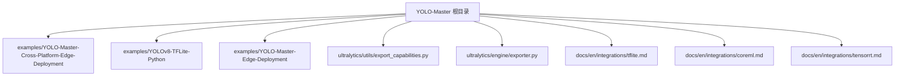
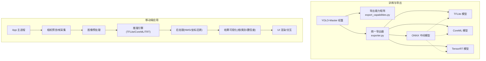
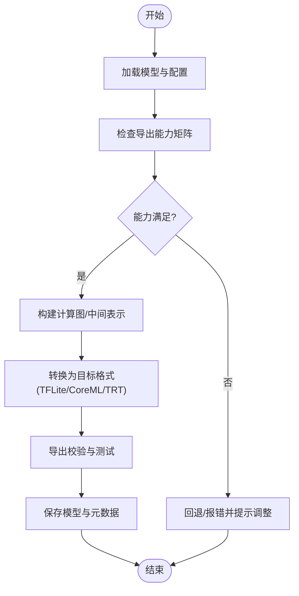
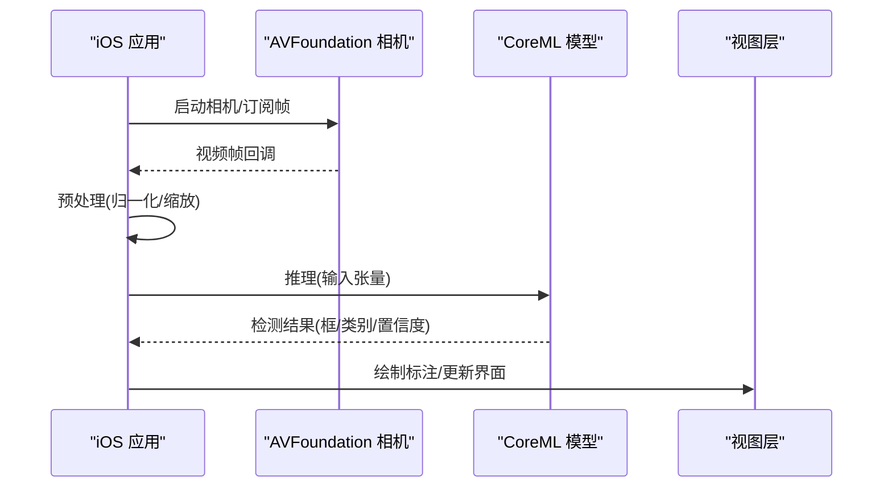
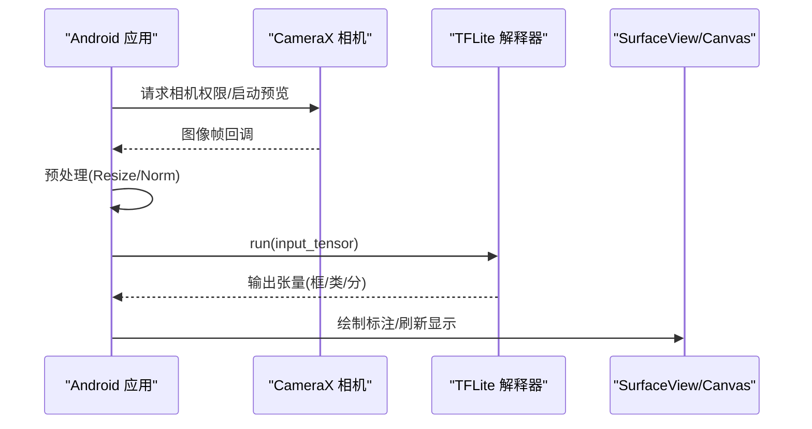
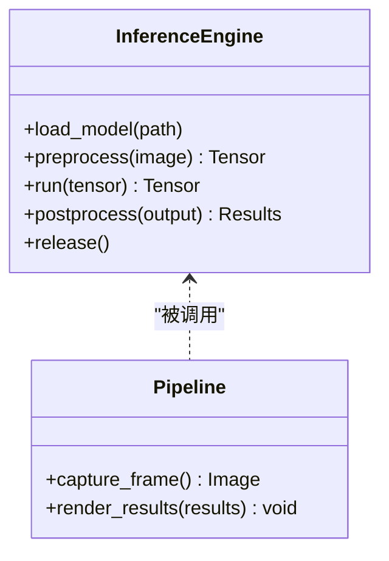
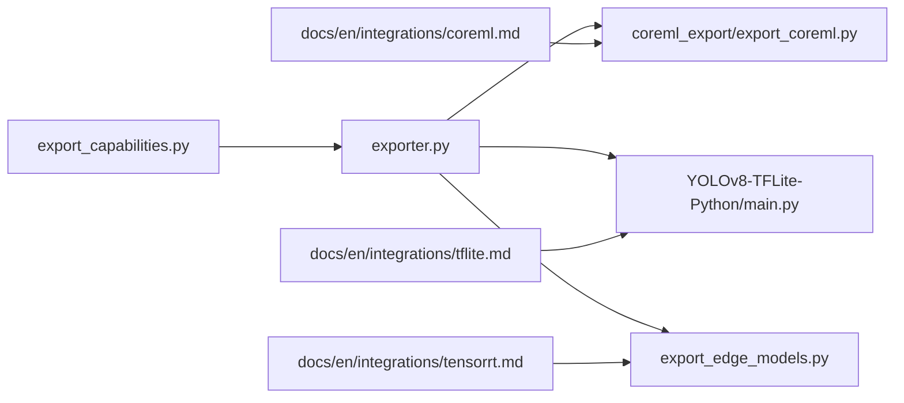

# 移动端部署

<cite>
**本文引用的文件**
- [README.md](file://README.md)
- [examples/YOLO-Master-Cross-Platform-Edge-Deployment/README.md](file://examples/YOLO-Master-Cross-Platform-Edge-Deployment/README.md)
- [examples/YOLO-Master-Cross-Platform-Edge-Deployment/TECHNICAL_REPORT.md](file://examples/YOLO-Master-Cross-Platform-Edge-Deployment/TECHNICAL_REPORT.md)
- [examples/YOLO-Master-Cross-Platform-Edge-Deployment/coreml_export/export_coreml.py](file://examples/YOLO-Master-Cross-Platform-Edge-Deployment/coreml_export/export_coreml.py)
- [examples/YOLO-Master-Cross-Platform-Edge-Deployment/cpp/main.cpp](file://examples/YOLO-Master-Cross-Platform-Edge-Deployment/cpp/main.cpp)
- [examples/YOLO-Master-Cross-Platform-Edge-Deployment/cpp/inference.h](file://examples/YOLO-Master-Cross-Platform-Edge-Deployment/cpp/inference.h)
- [examples/YOLOv8-TFLite-Python/README.md](file://examples/YOLOv8-TFLite-Python/README.md)
- [examples/YOLOv8-TFLite-Python/main.py](file://examples/YOLOv8-TFLite-Python/main.py)
- [examples/YOLO-Master-Edge-Deployment/README.md](file://examples/YOLO-Master-Edge-Deployment/README.md)
- [examples/YOLO-Master-Edge-Deployment/export_edge_models.py](file://examples/YOLO-Master-Edge-Deployment/export_edge_models.py)
- [ultralytics/utils/export_capabilities.py](file://ultralytics/utils/export_capabilities.py)
- [ultralytics/engine/exporter.py](file://ultralytics/engine/exporter.py)
- [docs/en/integrations/tflite.md](file://docs/en/integrations/tflite.md)
- [docs/en/integrations/coreml.md](file://docs/en/integrations/coreml.md)
- [docs/en/integrations/tensorrt.md](file://docs/en/integrations/tensorrt.md)
</cite>

## 目录
1. [简介](#简介)
2. [项目结构](#项目结构)
3. [核心组件](#核心组件)
4. [架构总览](#架构总览)
5. [详细组件分析](#详细组件分析)
6. [依赖关系分析](#依赖关系分析)
7. [性能与优化](#性能与优化)
8. [故障排查指南](#故障排查指南)
9. [结论](#结论)
10. [附录](#附录)

## 简介
本指南聚焦于将 YOLO-Master 模型部署到移动端的完整流程，覆盖 iOS 与 Android 平台，包括 CoreML、TFLite、TensorRT Mobile 等格式的使用。文档提供从导出、集成到运行时推理的端到端说明，并给出相机预览、实时检测、结果可视化等典型功能的实现思路。同时总结移动端特有的优化技术（模型压缩、内存管理、电池续航优化）、调试与性能分析工具，以及跨平台框架（Flutter、React Native）的集成方案与用户体验优化最佳实践。

## 项目结构
仓库中与移动端部署相关的资源主要分布在以下位置：
- 示例工程：跨平台边缘部署示例、TFLite Python 示例、通用边缘部署脚本
- 导出能力与引擎：导出能力矩阵、统一导出器
- 官方文档：TFLite、CoreML、TensorRT 集成文档

图表来源
- [examples/YOLO-Master-Cross-Platform-Edge-Deployment/README.md](file://examples/YOLO-Master-Cross-Platform-Edge-Deployment/README.md)
- [examples/YOLOv8-TFLite-Python/README.md](file://examples/YOLOv8-TFLite-Python/README.md)
- [examples/YOLO-Master-Edge-Deployment/README.md](file://examples/YOLO-Master-Edge-Deployment/README.md)
- [ultralytics/utils/export_capabilities.py](file://ultralytics/utils/export_capabilities.py)
- [ultralytics/engine/exporter.py](file://ultralytics/engine/exporter.py)
- [docs/en/integrations/tflite.md](file://docs/en/integrations/tflite.md)
- [docs/en/integrations/coreml.md](file://docs/en/integrations/coreml.md)
- [docs/en/integrations/tensorrt.md](file://docs/en/integrations/tensorrt.md)

章节来源
- [README.md](file://README.md)
- [examples/YOLO-Master-Cross-Platform-Edge-Deployment/README.md](file://examples/YOLO-Master-Cross-Platform-Edge-Deployment/README.md)
- [examples/YOLO-Master-Cross-Platform-Edge-Deployment/TECHNICAL_REPORT.md](file://examples/YOLO-Master-Cross-Platform-Edge-Deployment/TECHNICAL_REPORT.md)
- [examples/YOLO-Master-Edge-Deployment/README.md](file://examples/YOLO-Master-Edge-Deployment/README.md)
- [examples/YOLOv8-TFLite-Python/README.md](file://examples/YOLOv8-TFLite-Python/README.md)
- [ultralytics/utils/export_capabilities.py](file://ultralytics/utils/export_capabilities.py)
- [ultralytics/engine/exporter.py](file://ultralytics/engine/exporter.py)
- [docs/en/integrations/tflite.md](file://docs/en/integrations/tflite.md)
- [docs/en/integrations/coreml.md](file://docs/en/integrations/coreml.md)
- [docs/en/integrations/tensorrt.md](file://docs/en/integrations/tensorrt.md)

## 核心组件
- 导出能力矩阵与统一导出器
  - export_capabilities.py：维护各后端/格式的导出能力矩阵，用于判断目标平台是否支持某格式导出。
  - exporter.py：统一的导出入口，封装 ONNX/TFLite/CoreML/TensorRT 等导出流程，供上层调用。
- 跨平台边缘部署示例
  - coreml_export/export_coreml.py：演示如何导出为 CoreML 模型，便于在 iOS/macOS 使用 Core ML 运行。
  - cpp/main.cpp、cpp/inference.h：C++ 推理示例，展示加载模型、预处理、推理、后处理的典型流程，可作为移动端原生集成的参考。
- TFLite 示例
  - examples/YOLOv8-TFLite-Python：包含 README 与 main.py，演示 TFLite 模型的加载与推理流程，可迁移至 Android/iOS 的 TFLite 运行时。
- 通用边缘部署脚本
  - examples/YOLO-Master-Edge-Deployment/export_edge_models.py：批量导出边缘友好格式（如 TFLite、ONNX），并提供验证脚本。
- 官方集成文档
  - docs/en/integrations/tflite.md、coreml.md、tensorrt.md：分别介绍对应格式的导出、部署与注意事项。

章节来源
- [ultralytics/utils/export_capabilities.py](file://ultralytics/utils/export_capabilities.py)
- [ultralytics/engine/exporter.py](file://ultralytics/engine/exporter.py)
- [examples/YOLO-Master-Cross-Platform-Edge-Deployment/coreml_export/export_coreml.py](file://examples/YOLO-Master-Cross-Platform-Edge-Deployment/coreml_export/export_coreml.py)
- [examples/YOLO-Master-Cross-Platform-Edge-Deployment/cpp/main.cpp](file://examples/YOLO-Master-Cross-Platform-Edge-Deployment/cpp/main.cpp)
- [examples/YOLO-Master-Cross-Platform-Edge-Deployment/cpp/inference.h](file://examples/YOLO-Master-Cross-Platform-Edge-Deployment/cpp/inference.h)
- [examples/YOLOv8-TFLite-Python/README.md](file://examples/YOLOv8-TFLite-Python/README.md)
- [examples/YOLOv8-TFLite-Python/main.py](file://examples/YOLOv8-TFLite-Python/main.py)
- [examples/YOLO-Master-Edge-Deployment/export_edge_models.py](file://examples/YOLO-Master-Edge-Deployment/export_edge_models.py)
- [docs/en/integrations/tflite.md](file://docs/en/integrations/tflite.md)
- [docs/en/integrations/coreml.md](file://docs/en/integrations/coreml.md)
- [docs/en/integrations/tensorrt.md](file://docs/en/integrations/tensorrt.md)

## 架构总览
下图展示了从训练好的 YOLO-Master 模型到移动端推理的整体流程，包括导出、打包、集成与运行阶段。

图表来源
- [ultralytics/utils/export_capabilities.py](file://ultralytics/utils/export_capabilities.py)
- [ultralytics/engine/exporter.py](file://ultralytics/engine/exporter.py)
- [examples/YOLO-Master-Cross-Platform-Edge-Deployment/coreml_export/export_coreml.py](file://examples/YOLO-Master-Cross-Platform-Edge-Deployment/coreml_export/export_coreml.py)
- [examples/YOLO-Master-Cross-Platform-Edge-Deployment/cpp/main.cpp](file://examples/YOLO-Master-Cross-Platform-Edge-Deployment/cpp/main.cpp)
- [examples/YOLOv8-TFLite-Python/main.py](file://examples/YOLOv8-TFLite-Python/main.py)
- [docs/en/integrations/tflite.md](file://docs/en/integrations/tflite.md)
- [docs/en/integrations/coreml.md](file://docs/en/integrations/coreml.md)
- [docs/en/integrations/tensorrt.md](file://docs/en/integrations/tensorrt.md)

## 详细组件分析

### 组件A：导出管线（统一导出器与能力矩阵）
- 职责
  - export_capabilities.py：定义各后端/格式的能力矩阵，辅助选择目标平台支持的导出格式。
  - exporter.py：封装多后端导出逻辑，统一输入输出规范，支持 ONNX/TFLite/CoreML/TensorRT 等。
- 关键流程
  - 读取模型与配置 → 校验导出能力 → 生成中间表示（如 ONNX）→ 转换为目标格式 → 保存与校验。
- 复杂度与优化
  - 导出过程通常受图规模、算子支持与量化策略影响；建议优先导出轻量模型（s/n 系列）并结合 INT8/FP16 量化。
- 错误处理
  - 对不支持的算子或平台进行预检，失败时回退到兼容路径或提示调整配置。

图表来源
- [ultralytics/utils/export_capabilities.py](file://ultralytics/utils/export_capabilities.py)
- [ultralytics/engine/exporter.py](file://ultralytics/engine/exporter.py)

章节来源
- [ultralytics/utils/export_capabilities.py](file://ultralytics/utils/export_capabilities.py)
- [ultralytics/engine/exporter.py](file://ultralytics/engine/exporter.py)

### 组件B：iOS 集成（CoreML）
- 导出
  - 通过 coreml_export/export_coreml.py 将模型导出为 .mlmodel，便于在 Xcode 中直接集成。
- 运行时
  - 使用 Core ML 框架加载模型，结合 AVFoundation 完成相机预览与逐帧推理。
- 可视化
  - 在 UIView/CALayer 上绘制边界框与类别标签，注意坐标系变换与缩放。
- 优化要点
  - 启用 FP16/INT8 量化（若可用），减少内存占用与功耗；合理设置分辨率与批大小。

图表来源
- [examples/YOLO-Master-Cross-Platform-Edge-Deployment/coreml_export/export_coreml.py](file://examples/YOLO-Master-Cross-Platform-Edge-Deployment/coreml_export/export_coreml.py)
- [docs/en/integrations/coreml.md](file://docs/en/integrations/coreml.md)

章节来源
- [examples/YOLO-Master-Cross-Platform-Edge-Deployment/coreml_export/export_coreml.py](file://examples/YOLO-Master-Cross-Platform-Edge-Deployment/coreml_export/export_coreml.py)
- [docs/en/integrations/coreml.md](file://docs/en/integrations/coreml.md)

### 组件C：Android 集成（TFLite）
- 导出
  - 使用 exporter.py 或 edge 脚本导出为 .tflite，必要时开启量化以减小体积。
- 运行时
  - 在 Android 上使用 TensorFlow Lite Java/Kotlin API 加载模型，配合 CameraX 获取预览帧。
- 可视化
  - 在自定义 SurfaceView/TextureView 上叠加检测结果，注意屏幕与图像坐标映射。
- 优化要点
  - 使用 NNAPI/GPU Delegate 加速；控制输入尺寸与帧率；避免频繁对象分配。

图表来源
- [examples/YOLOv8-TFLite-Python/main.py](file://examples/YOLOv8-TFLite-Python/main.py)
- [examples/YOLOv8-TFLite-Python/README.md](file://examples/YOLOv8-TFLite-Python/README.md)
- [docs/en/integrations/tflite.md](file://docs/en/integrations/tflite.md)

章节来源
- [examples/YOLOv8-TFLite-Python/main.py](file://examples/YOLOv8-TFLite-Python/main.py)
- [examples/YOLOv8-TFLite-Python/README.md](file://examples/YOLOv8-TFLite-Python/README.md)
- [docs/en/integrations/tflite.md](file://docs/en/integrations/tflite.md)

### 组件D：跨平台原生示例（C++）
- 作用
  - 提供通用的推理流程参考，适用于 iOS/Android 原生层集成，也可作为 Flutter/RN 的桥接基础。
- 关键点
  - 模型加载、预处理、推理、后处理与可视化的解耦设计，便于移植到不同平台。
- 适用场景
  - 需要极致性能或深度定制的场景，例如自定义 NMS、多线程流水线、GPU 加速。

图表来源
- [examples/YOLO-Master-Cross-Platform-Edge-Deployment/cpp/main.cpp](file://examples/YOLO-Master-Cross-Platform-Edge-Deployment/cpp/main.cpp)
- [examples/YOLO-Master-Cross-Platform-Edge-Deployment/cpp/inference.h](file://examples/YOLO-Master-Cross-Platform-Edge-Deployment/cpp/inference.h)

章节来源
- [examples/YOLO-Master-Cross-Platform-Edge-Deployment/cpp/main.cpp](file://examples/YOLO-Master-Cross-Platform-Edge-Deployment/cpp/main.cpp)
- [examples/YOLO-Master-Cross-Platform-Edge-Deployment/cpp/inference.h](file://examples/YOLO-Master-Cross-Platform-Edge-Deployment/cpp/inference.h)

### 组件E：TensorRT Mobile（Jetson/Android GPU）
- 说明
  - TensorRT 主要用于 NVIDIA Jetson 等平台；Android 侧可通过第三方库或厂商 SDK 尝试 GPU 加速。
- 导出与部署
  - 使用 exporter.py 导出 TensorRT 引擎，或在目标设备上离线构建；注意精度校准与算子支持。
- 性能权衡
  - 高吞吐低延迟，但需考虑设备发热与功耗；建议按需启用与动态切换。

章节来源
- [docs/en/integrations/tensorrt.md](file://docs/en/integrations/tensorrt.md)
- [ultralytics/engine/exporter.py](file://ultralytics/engine/exporter.py)

### 组件F：跨平台框架集成（Flutter / React Native）
- 总体思路
  - 在原生层实现推理（TFLite/CoreML），通过平台通道暴露给 Flutter/RN 调用。
- Flutter
  - 使用 platform channels 调用 Android/iOS 原生方法；在原生侧执行相机采集与推理，返回结构化结果并在 UI 层绘制。
- React Native
  - 通过原生模块桥接，复用相同推理流程；注意线程与内存管理，避免阻塞 JS 线程。
- 最佳实践
  - 将重任务放在后台线程；限制帧率与分辨率；结果增量更新 UI。

[本节为概念性内容，不直接分析具体源码文件]

## 依赖关系分析
- 导出能力矩阵与导出器之间的耦合
  - exporter.py 依赖 export_capabilities.py 提供的能力信息，决定可用的导出路径。
- 示例与文档的引用关系
  - 跨平台示例与官方文档相互印证，确保导出与部署步骤一致。

图表来源
- [ultralytics/utils/export_capabilities.py](file://ultralytics/utils/export_capabilities.py)
- [ultralytics/engine/exporter.py](file://ultralytics/engine/exporter.py)
- [examples/YOLO-Master-Cross-Platform-Edge-Deployment/coreml_export/export_coreml.py](file://examples/YOLO-Master-Cross-Platform-Edge-Deployment/coreml_export/export_coreml.py)
- [examples/YOLOv8-TFLite-Python/main.py](file://examples/YOLOv8-TFLite-Python/main.py)
- [examples/YOLO-Master-Edge-Deployment/export_edge_models.py](file://examples/YOLO-Master-Edge-Deployment/export_edge_models.py)
- [docs/en/integrations/tflite.md](file://docs/en/integrations/tflite.md)
- [docs/en/integrations/coreml.md](file://docs/en/integrations/coreml.md)
- [docs/en/integrations/tensorrt.md](file://docs/en/integrations/tensorrt.md)

章节来源
- [ultralytics/utils/export_capabilities.py](file://ultralytics/utils/export_capabilities.py)
- [ultralytics/engine/exporter.py](file://ultralytics/engine/exporter.py)
- [examples/YOLO-Master-Cross-Platform-Edge-Deployment/coreml_export/export_coreml.py](file://examples/YOLO-Master-Cross-Platform-Edge-Deployment/coreml_export/export_coreml.py)
- [examples/YOLOv8-TFLite-Python/main.py](file://examples/YOLOv8-TFLite-Python/main.py)
- [examples/YOLO-Master-Edge-Deployment/export_edge_models.py](file://examples/YOLO-Master-Edge-Deployment/export_edge_models.py)
- [docs/en/integrations/tflite.md](file://docs/en/integrations/tflite.md)
- [docs/en/integrations/coreml.md](file://docs/en/integrations/coreml.md)
- [docs/en/integrations/tensorrt.md](file://docs/en/integrations/tensorrt.md)

## 性能与优化
- 模型压缩
  - 量化（INT8/FP16）：显著降低内存与功耗，提升速度；需评估精度损失。
  - 剪枝/蒸馏：在保持精度的前提下减小模型规模。
- 内存管理
  - 复用张量与缓冲区，避免每帧分配；控制输入分辨率与批大小。
- 电池续航
  - 降低帧率与分辨率；仅在必要时启用高精度模式；利用硬件加速（NNAPI/Core ML）。
- 推理流水线
  - 异步处理：相机采集、预处理、推理、后处理并行；采用双缓冲/环形队列。
- 平台特性
  - iOS：Core ML 优化选项与 Metal 加速；Android：TFLite GPU/NNAPI Delegate。

[本节为通用指导，不直接分析具体源码文件]

## 故障排查指南
- 导出失败
  - 检查导出能力矩阵与目标平台支持；确认算子兼容性；查看导出日志定位问题。
- 运行时崩溃
  - 核对输入形状与数据类型；确保预处理与导出一致；检查内存不足与线程安全。
- 性能不达预期
  - 对比不同量化与分辨率组合；启用硬件加速；分析热点函数与瓶颈。
- 可视化错位
  - 校正坐标映射与缩放比例；确认图像方向与裁剪区域。

章节来源
- [examples/YOLO-Master-Cross-Platform-Edge-Deployment/TECHNICAL_REPORT.md](file://examples/YOLO-Master-Cross-Platform-Edge-Deployment/TECHNICAL_REPORT.md)
- [examples/YOLO-Master-Edge-Deployment/README.md](file://examples/YOLO-Master-Edge-Deployment/README.md)

## 结论
通过将 YOLO-Master 模型导出为移动端友好的格式（TFLite/CoreML/TensorRT），并结合原生或跨平台框架进行集成，可在 iOS 与 Android 上实现高效的实时检测。合理的模型压缩、内存管理与硬件加速策略，能显著提升性能与续航表现。借助示例工程与官方文档，开发者可以快速搭建从导出到部署的完整链路，并通过持续的性能分析与调优获得稳定可靠的移动端体验。

## 附录
- 快速上手清单
  - 选择目标平台与格式（TFLite/CoreML/TensorRT）
  - 使用 exporter.py 与能力矩阵进行导出
  - 在原生层实现相机采集、预处理、推理与可视化
  - 针对设备进行量化与加速优化
  - 进行端到端测试与性能分析

[本节为概览性内容，不直接分析具体源码文件]