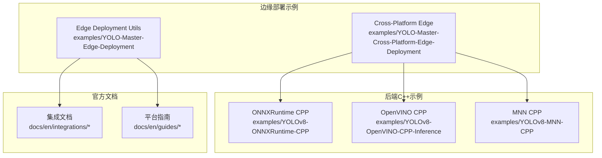
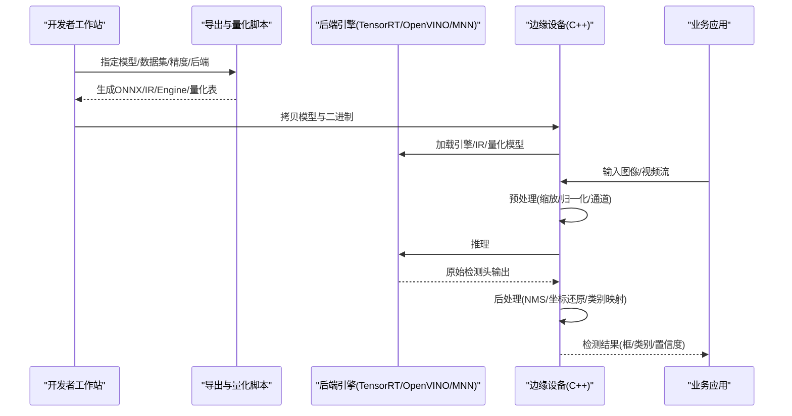
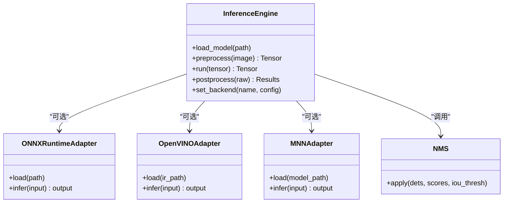
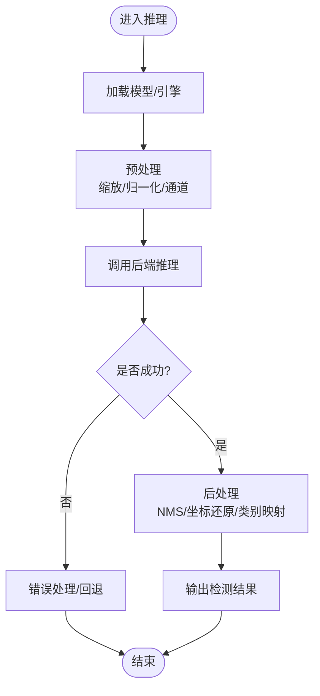
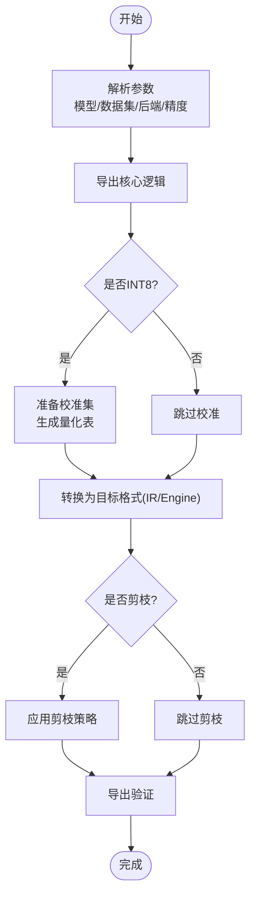
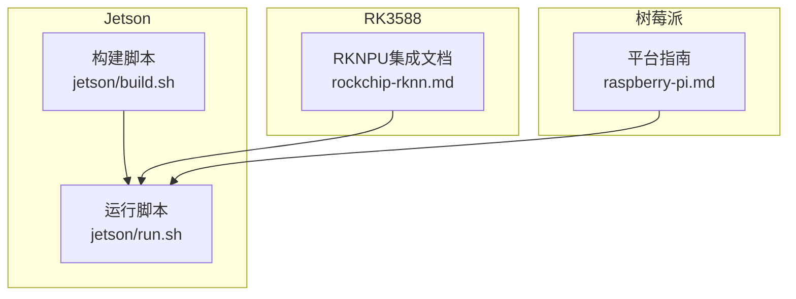
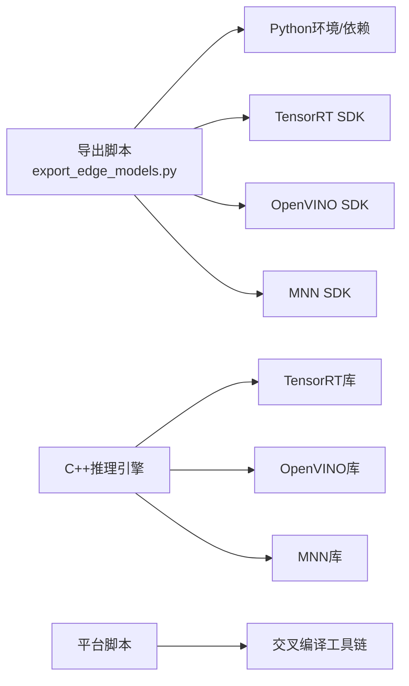

# 边缘设备部署

<cite>
**本文引用的文件**
- [README.md](file://examples/YOLO-Master-Cross-Platform-Edge-Deployment/README.md)
- [TECHNICAL_REPORT.md](file://examples/YOLO-Master-Cross-Platform-Edge-Deployment/TECHNICAL_REPORT.md)
- [CMakeLists.txt](file://examples/YOLO-Master-Cross-Platform-Edge-Deployment/cpp/CMakeLists.txt)
- [inference.cpp](file://examples/YOLO-Master-Cross-Platform-Edge-Deployment/cpp/inference.cpp)
- [inference.h](file://examples/YOLO-Master-Cross-Platform-Edge-Deployment/cpp/inference.h)
- [main.cpp](file://examples/YOLO-Master-Cross-Platform-Edge-Deployment/cpp/main.cpp)
- [jetson_build.sh](file://examples/YOLO-Master-Cross-Platform-Edge-Deployment/jetson/build.sh)
- [jetson_run.sh](file://examples/YOLO-Master-Cross-Platform-Edge-Deployment/jetson/run.sh)
- [export_edge_models.py](file://examples/YOLO-Master-Edge-Deployment/export_edge_models.py)
- [edge_utils.py](file://examples/YOLO-Master-Edge-Deployment/edge_utils.py)
- [validate_edge_outputs.py](file://examples/YOLO-Master-Edge-Deployment/validate_edge_outputs.py)
- [CMakeLists.txt](file://examples/YOLOv8-ONNXRuntime-CPP/CMakeLists.txt)
- [inference.cpp](file://examples/YOLOv8-ONNXRuntime-CPP/inference.cpp)
- [inference.h](file://examples/YOLOv8-ONNXRuntime-CPP/inference.h)
- [main.cpp](file://examples/YOLOv8-ONNXRuntime-CPP/main.cpp)
- [CMakeLists.txt](file://examples/YOLOv8-OpenVINO-CPP-Inference/CMakeLists.txt)
- [inference.cc](file://examples/YOLOv8-OpenVINO-CPP-Inference/inference.cc)
- [inference.h](file://examples/YOLOv8-OpenVINO-CPP-Inference/inference.h)
- [main.cc](file://examples/YOLOv8-OpenVINO-CPP-Inference/main.cc)
- [CMakeLists.txt](file://examples/YOLOv8-MNN-CPP/CMakeLists.txt)
- [main.cpp](file://examples/YOLOv8-MNN-CPP/main.cpp)
- [main_interpreter.cpp](file://examples/YOLOv8-MNN-CPP/main_interpreter.cpp)
- [mnn.md](file://docs/en/integrations/mnn.md)
- [ncnn.md](file://docs/en/integrations/ncnn.md)
- [openvino.md](file://docs/en/integrations/openvino.md)
- [tensorrt.md](file://docs/en/integrations/tensorrt.md)
- [rockchip-rknn.md](file://docs/en/integrations/rockchip-rknn.md)
- [raspberry-pi.md](file://docs/en/guides/raspberry-pi.md)
- [nvidia-jetson.md](file://docs/en/guides/nvidia-jetson.md)
- [model-deployment-options.md](file://docs/en/guides/model-deployment-options.md)
- [model-deployment-practices.md](file://docs/en/guides/model-deployment-practices.md)
</cite>

## 目录
1. [简介](#简介)
2. [项目结构](#项目结构)
3. [核心组件](#核心组件)
4. [架构总览](#架构总览)
5. [详细组件分析](#详细组件分析)
6. [依赖关系分析](#依赖关系分析)
7. [性能与功耗优化](#性能与功耗优化)
8. [故障排查指南](#故障排查指南)
9. [结论](#结论)
10. [附录：跨平台编译与交叉编译](#附录跨平台编译与交叉编译)

## 简介
本教程面向在边缘设备上部署YOLO-Master的工程实践，覆盖Jetson系列、树莓派、RK3588等平台的模型导出、量化（INT8/FP16）、剪枝、C++推理引擎实现（预处理-推理-后处理全流程优化），以及TensorRT、OpenVINO、NCNN、MNN等加速后端的配置与使用。文档同时提供内存优化、实时性保障策略、跨平台编译与交叉编译方案，并给出性能调优与功耗优化技巧。

## 项目结构
仓库中与边缘部署直接相关的示例与文档主要分布在以下位置：
- 跨平台边缘部署示例：examples/YOLO-Master-Cross-Platform-Edge-Deployment
- 通用边缘部署脚本与工具：examples/YOLO-Master-Edge-Deployment
- 各后端C++推理示例：examples/YOLOv8-ONNXRuntime-CPP、examples/YOLOv8-OpenVINO-CPP-Inference、examples/YOLOv8-MNN-CPP
- 官方集成文档：docs/en/integrations/* 与 docs/en/guides/*

图表来源
- [README.md](file://examples/YOLO-Master-Cross-Platform-Edge-Deployment/README.md)
- [TECHNICAL_REPORT.md](file://examples/YOLO-Master-Cross-Platform-Edge-Deployment/TECHNICAL_REPORT.md)
- [export_edge_models.py](file://examples/YOLO-Master-Edge-Deployment/export_edge_models.py)
- [edge_utils.py](file://examples/YOLO-Master-Edge-Deployment/edge_utils.py)
- [validate_edge_outputs.py](file://examples/YOLO-Master-Edge-Deployment/validate_edge_outputs.py)
- [mnn.md](file://docs/en/integrations/mnn.md)
- [ncnn.md](file://docs/en/integrations/ncnn.md)
- [openvino.md](file://docs/en/integrations/openvino.md)
- [tensorrt.md](file://docs/en/integrations/tensorrt.md)
- [raspberry-pi.md](file://docs/en/guides/raspberry-pi.md)
- [nvidia-jetson.md](file://docs/en/guides/nvidia-jetson.md)

章节来源
- [README.md](file://examples/YOLO-Master-Cross-Platform-Edge-Deployment/README.md)
- [TECHNICAL_REPORT.md](file://examples/YOLO-Master-Cross-Platform-Edge-Deployment/TECHNICAL_REPORT.md)
- [export_edge_models.py](file://examples/YOLO-Master-Edge-Deployment/export_edge_models.py)
- [edge_utils.py](file://examples/YOLO-Master-Edge-Deployment/edge_utils.py)
- [validate_edge_outputs.py](file://examples/YOLO-Master-Edge-Deployment/validate_edge_outputs.py)

## 核心组件
- 模型导出与量化
  - 通过Python脚本完成从训练权重到边缘可执行格式（如ONNX、TensorRT、OpenVINO IR、MNN）的转换，支持FP16/INT8量化与可选剪枝流程。
  - 关键入口与工具函数集中在边缘部署脚本中，负责参数解析、数据校准（INT8）、目标后端选择与输出产物管理。
- C++推理引擎
  - 统一封装预处理（缩放、归一化、通道重排）、推理调用（后端API）、后处理（NMS、坐标还原、类别映射）。
  - 提供多后端适配层，按运行时动态加载对应库或IR/Engine文件。
- 平台构建与运行脚本
  - Jetson/RK3588/树莓派等平台提供专用构建与运行脚本，自动探测硬件能力、设置环境变量、选择最优精度与线程数。
- 验证与回归测试
  - 提供端到端校验脚本，对比不同后端/精度的输出一致性，确保部署正确性与稳定性。

章节来源
- [export_edge_models.py](file://examples/YOLO-Master-Edge-Deployment/export_edge_models.py)
- [edge_utils.py](file://examples/YOLO-Master-Edge-Deployment/edge_utils.py)
- [validate_edge_outputs.py](file://examples/YOLO-Master-Edge-Deployment/validate_edge_outputs.py)
- [inference.cpp](file://examples/YOLO-Master-Cross-Platform-Edge-Deployment/cpp/inference.cpp)
- [inference.h](file://examples/YOLO-Master-Cross-Platform-Edge-Deployment/cpp/inference.h)
- [main.cpp](file://examples/YOLO-Master-Cross-Platform-Edge-Deployment/cpp/main.cpp)

## 架构总览
下图展示了从训练权重到边缘设备运行的整体流程，包括导出、量化/剪枝、C++推理与多后端适配。

图表来源
- [export_edge_models.py](file://examples/YOLO-Master-Edge-Deployment/export_edge_models.py)
- [edge_utils.py](file://examples/YOLO-Master-Edge-Deployment/edge_utils.py)
- [inference.cpp](file://examples/YOLO-Master-Cross-Platform-Edge-Deployment/cpp/inference.cpp)
- [inference.h](file://examples/YOLO-Master-Cross-Platform-Edge-Deployment/cpp/inference.h)
- [main.cpp](file://examples/YOLO-Master-Cross-Platform-Edge-Deployment/cpp/main.cpp)
- [mnn.md](file://docs/en/integrations/mnn.md)
- [openvino.md](file://docs/en/integrations/openvino.md)
- [tensorrt.md](file://docs/en/integrations/tensorrt.md)

## 详细组件分析

### 组件A：C++推理引擎（预处理-推理-后处理）
该组件将输入图像转换为模型期望的张量，调用后端进行推理，并对原始输出进行解码与NMS得到最终结果。

图表来源
- [inference.cpp](file://examples/YOLO-Master-Cross-Platform-Edge-Deployment/cpp/inference.cpp)
- [inference.h](file://examples/YOLO-Master-Cross-Platform-Edge-Deployment/cpp/inference.h)
- [main.cpp](file://examples/YOLO-Master-Cross-Platform-Edge-Deployment/cpp/main.cpp)
- [inference.cpp](file://examples/YOLOv8-ONNXRuntime-CPP/inference.cpp)
- [inference.h](file://examples/YOLOv8-ONNXRuntime-CPP/inference.h)
- [inference.cc](file://examples/YOLOv8-OpenVINO-CPP-Inference/inference.cc)
- [inference.h](file://examples/YOLOv8-OpenVINO-CPP-Inference/inference.h)
- [main.cpp](file://examples/YOLOv8-MNN-CPP/main.cpp)
- [main_interpreter.cpp](file://examples/YOLOv8-MNN-CPP/main_interpreter.cpp)

章节来源
- [inference.cpp](file://examples/YOLO-Master-Cross-Platform-Edge-Deployment/cpp/inference.cpp)
- [inference.h](file://examples/YOLO-Master-Cross-Platform-Edge-Deployment/cpp/inference.h)
- [main.cpp](file://examples/YOLO-Master-Cross-Platform-Edge-Deployment/cpp/main.cpp)
- [CMakeLists.txt](file://examples/YOLO-Master-Cross-Platform-Edge-Deployment/cpp/CMakeLists.txt)
- [CMakeLists.txt](file://examples/YOLOv8-ONNXRuntime-CPP/CMakeLists.txt)
- [CMakeLists.txt](file://examples/YOLOv8-OpenVINO-CPP-Inference/CMakeLists.txt)
- [CMakeLists.txt](file://examples/YOLOv8-MNN-CPP/CMakeLists.txt)

#### 推理流程图（算法级）

图表来源
- [inference.cpp](file://examples/YOLO-Master-Cross-Platform-Edge-Deployment/cpp/inference.cpp)
- [inference.h](file://examples/YOLO-Master-Cross-Platform-Edge-Deployment/cpp/inference.h)

### 组件B：模型导出与量化（INT8/FP16）与剪枝
- 导出流程
  - 输入：训练权重、数据集路径、目标后端与精度。
  - 过程：生成中间表示（如ONNX），根据后端要求进一步转换为IR/Engine；若选择INT8，则基于校准集生成量化表。
  - 输出：后端可执行模型与必要元数据。
- 量化与剪枝
  - FP16：在支持半精度的后端上启用，减少显存占用并提升吞吐。
  - INT8：需校准数据，平衡精度与速度；对卷积/激活层进行权重量化与激活量化。
  - 剪枝：可选稀疏化或结构化剪枝，降低计算量，配合量化获得更佳能效比。

图表来源
- [export_edge_models.py](file://examples/YOLO-Master-Edge-Deployment/export_edge_models.py)
- [edge_utils.py](file://examples/YOLO-Master-Edge-Deployment/edge_utils.py)
- [validate_edge_outputs.py](file://examples/YOLO-Master-Edge-Deployment/validate_edge_outputs.py)

章节来源
- [export_edge_models.py](file://examples/YOLO-Master-Edge-Deployment/export_edge_models.py)
- [edge_utils.py](file://examples/YOLO-Master-Edge-Deployment/edge_utils.py)
- [validate_edge_outputs.py](file://examples/YOLO-Master-Edge-Deployment/validate_edge_outputs.py)

### 组件C：平台构建与运行脚本（Jetson/RK3588/树莓派）
- Jetson
  - 构建脚本用于安装依赖、选择CUDA/TensorRT版本、编译C++工程与生成推理二进制。
  - 运行脚本设置GPU/NVMM内存、线程数、精度模式与模型路径。
- RK3588
  - 参考Rockchip RKNPU生态与文档，结合RKNPU SDK完成模型转换与部署。
- 树莓派
  - 针对ARM CPU/GPU优化，优先使用OpenVINO/ONNXRuntime轻量后端，必要时启用NEON/SVE指令集。

图表来源
- [jetson_build.sh](file://examples/YOLO-Master-Cross-Platform-Edge-Deployment/jetson/build.sh)
- [jetson_run.sh](file://examples/YOLO-Master-Cross-Platform-Edge-Deployment/jetson/run.sh)
- [rockchip-rknn.md](file://docs/en/integrations/rockchip-rknn.md)
- [raspberry-pi.md](file://docs/en/guides/raspberry-pi.md)

章节来源
- [jetson_build.sh](file://examples/YOLO-Master-Cross-Platform-Edge-Deployment/jetson/build.sh)
- [jetson_run.sh](file://examples/YOLO-Master-Cross-Platform-Edge-Deployment/jetson/run.sh)
- [rockchip-rknn.md](file://docs/en/integrations/rockchip-rknn.md)
- [raspberry-pi.md](file://docs/en/guides/raspberry-pi.md)

### 组件D：后端集成文档（TensorRT、OpenVINO、NCNN、MNN）
- TensorRT
  - 适用于NVIDIA GPU/Jetson，支持FP16/INT8，推荐开启Layer Fusion与Tactic优化。
- OpenVINO
  - 适用于Intel CPU/NPU与部分ARM平台，支持FP16/INT8，注意I/O布局与线程数配置。
- NCNN
  - 移动端/嵌入式友好，支持FP16/INT8，关注内存池与多线程并行。
- MNN
  - 阿里开源推理框架，支持多后端与量化，适合跨平台部署。

章节来源
- [tensorrt.md](file://docs/en/integrations/tensorrt.md)
- [openvino.md](file://docs/en/integrations/openvino.md)
- [ncnn.md](file://docs/en/integrations/ncnn.md)
- [mnn.md](file://docs/en/integrations/mnn.md)

## 依赖关系分析
- 导出与量化模块依赖Python环境与目标后端SDK（如TensorRT、OpenVINO、MNN）。
- C++推理引擎依赖对应后端的C/C++接口与静态/动态库。
- 平台脚本依赖系统包管理器与交叉编译工具链。

图表来源
- [export_edge_models.py](file://examples/YOLO-Master-Edge-Deployment/export_edge_models.py)
- [inference.cpp](file://examples/YOLO-Master-Cross-Platform-Edge-Deployment/cpp/inference.cpp)
- [CMakeLists.txt](file://examples/YOLO-Master-Cross-Platform-Edge-Deployment/cpp/CMakeLists.txt)

章节来源
- [export_edge_models.py](file://examples/YOLO-Master-Edge-Deployment/export_edge_models.py)
- [inference.cpp](file://examples/YOLO-Master-Cross-Platform-Edge-Deployment/cpp/inference.cpp)
- [CMakeLists.txt](file://examples/YOLO-Master-Cross-Platform-Edge-Deployment/cpp/CMakeLists.txt)

## 性能与功耗优化
- 精度选择
  - FP16在GPU/NPU上通常带来显著提速与降功耗；CPU场景需谨慎评估数值稳定性。
  - INT8需充分校准，建议采用代表性数据集与分层量化策略。
- 批大小与流水线
  - 合理增大批大小以提升吞吐；视频流可采用异步流水线与双缓冲。
- 内存管理
  - 复用输入/输出缓冲区，避免频繁分配；使用内存池与零拷贝（如NVMM）。
- 线程与调度
  - 根据核心数设置推理线程；I/O与推理分离，避免阻塞。
- 后端特定优化
  - TensorRT：启用Fusion、Optimization Profiles、Tactic搜索。
  - OpenVINO：设置线程数、缓存IR、禁用不必要的日志。
  - MNN/NCNN：调整线程与内存池大小，启用SIMD优化。
- 功耗控制
  - 动态频率调节、限制最大帧率、按需唤醒传感器与显示。

章节来源
- [model-deployment-options.md](file://docs/en/guides/model-deployment-options.md)
- [model-deployment-practices.md](file://docs/en/guides/model-deployment-practices.md)
- [nvidia-jetson.md](file://docs/en/guides/nvidia-jetson.md)
- [raspberry-pi.md](file://docs/en/guides/raspberry-pi.md)

## 故障排查指南
- 导出失败
  - 检查模型图兼容性、算子支持列表与输入形状；确认校准集路径与权限。
- 推理崩溃
  - 核对后端库版本与ABI兼容；检查内存越界与缓冲区尺寸。
- 精度下降
  - 扩大校准集、调整量化阈值、逐层检查异常节点；对比FP16基线。
- 性能不达预期
  - 检查线程数、批大小、I/O瓶颈；启用后端Profile与Profiler定位热点。
- 平台差异
  - 针对不同SoC调整精度与线程策略；确认驱动与固件版本。

章节来源
- [validate_edge_outputs.py](file://examples/YOLO-Master-Edge-Deployment/validate_edge_outputs.py)
- [edge_utils.py](file://examples/YOLO-Master-Edge-Deployment/edge_utils.py)
- [inference.cpp](file://examples/YOLO-Master-Cross-Platform-Edge-Deployment/cpp/inference.cpp)

## 结论
通过在边缘设备上系统化地应用模型导出、量化与剪枝，并结合C++推理引擎与多后端适配，可在Jetson、树莓派、RK3588等平台实现高吞吐、低延迟与低功耗的YOLO-Master部署。建议在真实场景下持续进行端到端验证与性能回归，依据平台特性微调精度、线程与内存策略，以获得最佳综合收益。

## 附录：跨平台编译与交叉编译
- 构建系统
  - 使用CMake统一管理多后端依赖与平台差异；为每个后端提供独立Target与链接选项。
- 交叉编译
  - 为ARM64/ARMHF准备工具链与SDK；在主机上生成目标平台二进制与依赖包。
- 依赖管理
  - 锁定后端库版本，避免ABI漂移；在CI中自动化构建与回归测试。
- 打包与分发
  - 生成平台特定的安装包与镜像，包含模型、运行时与启动脚本。

章节来源
- [CMakeLists.txt](file://examples/YOLO-Master-Cross-Platform-Edge-Deployment/cpp/CMakeLists.txt)
- [CMakeLists.txt](file://examples/YOLOv8-ONNXRuntime-CPP/CMakeLists.txt)
- [CMakeLists.txt](file://examples/YOLOv8-OpenVINO-CPP-Inference/CMakeLists.txt)
- [CMakeLists.txt](file://examples/YOLOv8-MNN-CPP/CMakeLists.txt)