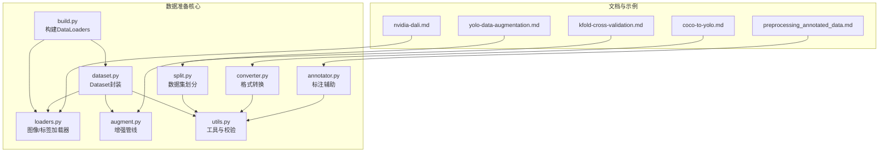
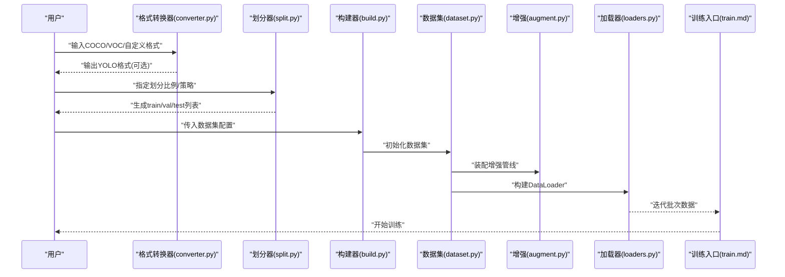
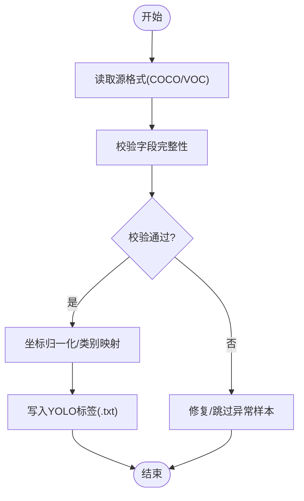
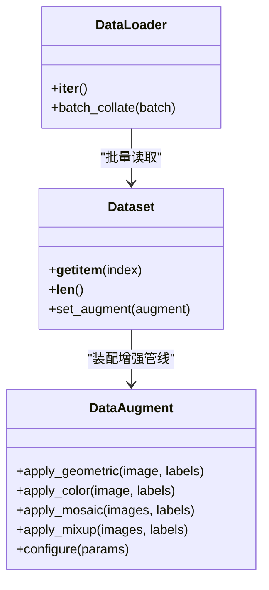
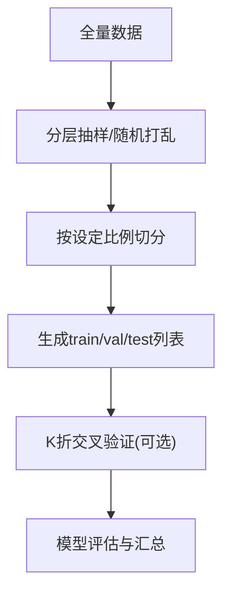
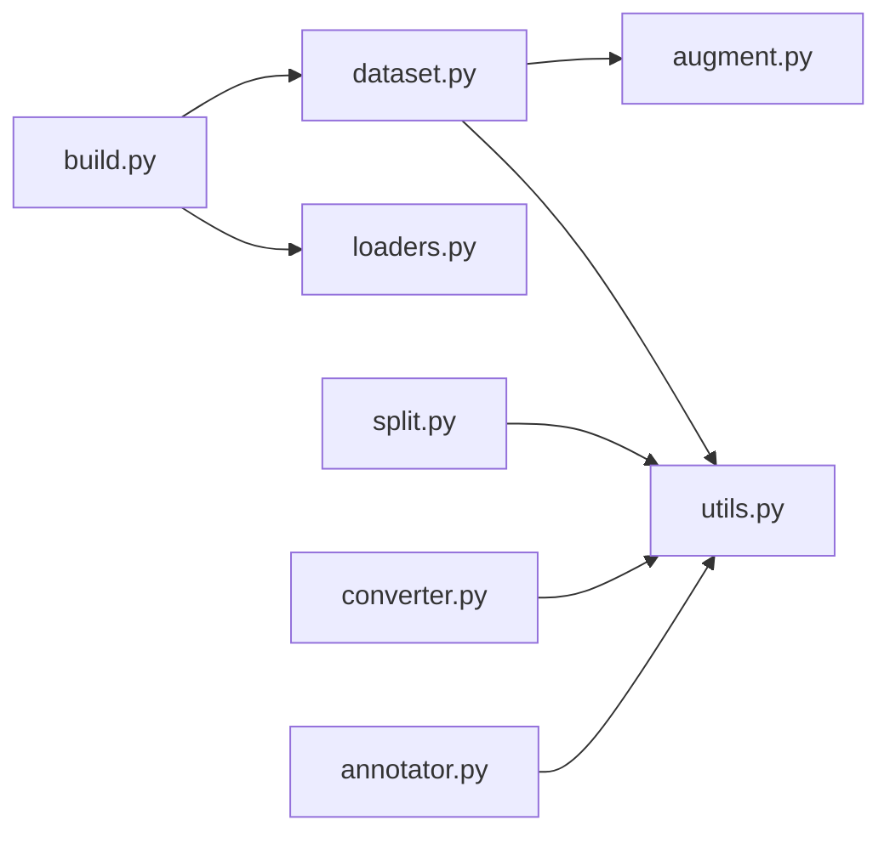

# 数据准备指南

<cite>
**本文引用的文件**
- [ultralytics/data/dataset.py](file://ultralytics/data/dataset.py)
- [ultralytics/data/build.py](file://ultralytics/data/build.py)
- [ultralytics/data/augment.py](file://ultralytics/data/augment.py)
- [ultralytics/data/split.py](file://ultralytics/data/split.py)
- [ultralytics/data/utils.py](file://ultralytics/data/utils.py)
- [ultralytics/data/annotator.py](file://ultralytics/data/annotator.py)
- [ultralytics/data/loaders.py](file://ultralytics/data/loaders.py)
- [ultralytics/data/converter.py](file://ultralytics/data/converter.py)
- [scripts/convert_voc.py](file://scripts/convert_voc.py)
- [docs/en/guides/coco-to-yolo.md](file://docs/en/guides/coco-to-yolo.md)
- [docs/en/guides/yolo-data-augmentation.md](file://docs/en/guides/yolo-data-augmentation.md)
- [docs/en/guides/kfold-cross-validation.md](file://docs/en/guides/kfold-cross-validation.md)
- [docs/en/guides/preprocessing_annotated_data.md](file://docs/en/guides/preprocessing_annotated_data.md)
- [docs/en/guides/data-collection-and-annotation.md](file://docs/en/guides/data-collection-and-annotation.md)
- [docs/en/guides/nvidia-dali.md](file://docs/en/guides/nvidia-dali.md)
- [docs/en/modes/train.md](file://docs/en/modes/train.md)
- [docs/en/reference/data/index.md](file://docs/en/reference/data/index.md)
- [docs/en/reference/data/dataset.md](file://docs/en/reference/data/dataset.md)
- [docs/en/reference/data/augment.md](file://docs/en/reference/data/augment.md)
- [docs/en/reference/data/split.md](file://docs/en/reference/data/split.md)
- [docs/en/reference/data/utils.md](file://docs/en/reference/data/utils.md)
- [docs/en/reference/data/loaders.md](file://docs/en/reference/data/loaders.md)
- [docs/en/reference/data/converter.md](file://docs/en/reference/data/converter.md)
- [docs/en/reference/data/base.md](file://docs/en/reference/data/base.md)
- [docs/en/reference/data/build.md](file://docs/en/reference/data/build.md)
</cite>

## 目录
1. [简介](#简介)
2. [项目结构](#项目结构)
3. [核心组件](#核心组件)
4. [架构总览](#架构总览)
5. [详细组件分析](#详细组件分析)
6. [依赖关系分析](#依赖关系分析)
7. [性能考虑](#性能考虑)
8. [故障排查指南](#故障排查指南)
9. [结论](#结论)
10. [附录](#附录)

## 简介
本指南面向YOLO-Master的数据准备全流程，覆盖以下主题：
- 数据集格式规范与转换（COCO、VOC、YOLO）
- 标注工具使用技巧与最佳实践
- 数据清洗、去重、格式验证的自动化脚本思路
- 数据增强技术与配置（几何变换、颜色增强、MixUp等）
- 数据划分策略（训练/验证/测试）与交叉验证
- 大数据集处理与优化（缓存、并行加载、内存管理）
- 数据质量评估与异常检测

## 项目结构
YOLO-Master的数据准备相关代码集中在 ultralytics/data 模块，配套文档位于 docs/en 下。关键路径如下：
- 数据构建与加载：ultralytics/data/build.py, ultralytics/data/loaders.py
- 数据集封装与访问：ultralytics/data/dataset.py
- 数据增强管线：ultralytics/data/augment.py
- 数据集划分：ultralytics/data/split.py
- 通用工具与校验：ultralytics/data/utils.py
- 标注辅助与可视化：ultralytics/data/annotator.py
- 格式转换：ultralytics/data/converter.py 与 scripts/convert_voc.py
- 官方文档：docs/en/guides/* 与 docs/en/reference/data/*

图表来源
- [ultralytics/data/build.py](file://ultralytics/data/build.py)
- [ultralytics/data/dataset.py](file://ultralytics/data/dataset.py)
- [ultralytics/data/augment.py](file://ultralytics/data/augment.py)
- [ultralytics/data/split.py](file://ultralytics/data/split.py)
- [ultralytics/data/utils.py](file://ultralytics/data/utils.py)
- [ultralytics/data/annotator.py](file://ultralytics/data/annotator.py)
- [ultralytics/data/converter.py](file://ultralytics/data/converter.py)
- [docs/en/guides/yolo-data-augmentation.md](file://docs/en/guides/yolo-data-augmentation.md)
- [docs/en/guides/kfold-cross-validation.md](file://docs/en/guides/kfold-cross-validation.md)
- [docs/en/guides/coco-to-yolo.md](file://docs/en/guides/coco-to-yolo.md)
- [docs/en/guides/preprocessing_annotated_data.md](file://docs/en/guides/preprocessing_annotated_data.md)
- [docs/en/guides/nvidia-dali.md](file://docs/en/guides/nvidia-dali.md)

章节来源
- [ultralytics/data/build.py](file://ultralytics/data/build.py)
- [ultralytics/data/dataset.py](file://ultralytics/data/dataset.py)
- [ultralytics/data/augment.py](file://ultralytics/data/augment.py)
- [ultralytics/data/split.py](file://ultralytics/data/split.py)
- [ultralytics/data/utils.py](file://ultralytics/data/utils.py)
- [ultralytics/data/annotator.py](file://ultralytics/data/annotator.py)
- [ultralytics/data/converter.py](file://ultralytics/data/converter.py)
- [docs/en/guides/yolo-data-augmentation.md](file://docs/en/guides/yolo-data-augmentation.md)
- [docs/en/guides/kfold-cross-validation.md](file://docs/en/guides/kfold-cross-validation.md)
- [docs/en/guides/coco-to-yolo.md](file://docs/en/guides/coco-to-yolo.md)
- [docs/en/guides/preprocessing_annotated_data.md](file://docs/en/guides/preprocessing_annotated_data.md)
- [docs/en/guides/nvidia-dali.md](file://docs/en/guides/nvidia-dali.md)

## 核心组件
- 数据构建与加载
  - 通过统一入口构建训练/验证/测试 DataLoader，负责解析数据集配置、创建 Dataset 实例、组装增强与批处理流水线。
  - 参考：[ultralytics/data/build.py](file://ultralytics/data/build.py)、[docs/en/reference/data/build.md](file://docs/en/reference/data/build.md)
- 数据集封装
  - 提供统一的 Dataset 接口，支持多任务（检测、分割、姿态等），内部维护图像索引、标签映射与批量读取逻辑。
  - 参考：[ultralytics/data/dataset.py](file://ultralytics/data/dataset.py)、[docs/en/reference/data/dataset.md](file://docs/en/reference/data/dataset.md)
- 数据增强
  - 实现几何变换、颜色空间增强、随机裁剪、Mosaic/MixUp 等高级增强，并提供可配置的增强参数宏。
  - 参考：[ultralytics/data/augment.py](file://ultralytics/data/augment.py)、[docs/en/guides/yolo-data-augmentation.md](file://docs/en/guides/yolo-data-augmentation.md)、[docs/en/reference/data/augment.md](file://docs/en/reference/data/augment.md)
- 数据集划分
  - 提供按比例或分层策略进行 train/val/test 划分，支持 K 折交叉验证流程。
  - 参考：[ultralytics/data/split.py](file://ultralytics/data/split.py)、[docs/en/guides/kfold-cross-validation.md](file://docs/en/guides/kfold-cross-validation.md)、[docs/en/reference/data/split.md](file://docs/en/reference/data/split.md)
- 工具与校验
  - 包含路径解析、格式校验、统计摘要、可视化辅助等通用能力。
  - 参考：[ultralytics/data/utils.py](file://ultralytics/data/utils.py)、[docs/en/reference/data/utils.md](file://docs/en/reference/data/utils.md)
- 标注辅助
  - 提供标注检查、可视化、自动标注辅助等工具。
  - 参考：[ultralytics/data/annotator.py](file://ultralytics/data/annotator.py)、[docs/en/guides/data-collection-and-annotation.md](file://docs/en/guides/data-collection-and-annotation.md)
- 格式转换
  - 支持 COCO/VOC/YOLO 等格式的相互转换，内置转换脚本与文档说明。
  - 参考：[ultralytics/data/converter.py](file://ultralytics/data/converter.py)、[scripts/convert_voc.py](file://scripts/convert_voc.py)、[docs/en/guides/coco-to-yolo.md](file://docs/en/guides/coco-to-yolo.md)、[docs/en/reference/data/converter.md](file://docs/en/reference/data/converter.md)

章节来源
- [ultralytics/data/build.py](file://ultralytics/data/build.py)
- [ultralytics/data/dataset.py](file://ultralytics/data/dataset.py)
- [ultralytics/data/augment.py](file://ultralytics/data/augment.py)
- [ultralytics/data/split.py](file://ultralytics/data/split.py)
- [ultralytics/data/utils.py](file://ultralytics/data/utils.py)
- [ultralytics/data/annotator.py](file://ultralytics/data/annotator.py)
- [ultralytics/data/converter.py](file://ultralytics/data/converter.py)
- [scripts/convert_voc.py](file://scripts/convert_voc.py)
- [docs/en/guides/yolo-data-augmentation.md](file://docs/en/guides/yolo-data-augmentation.md)
- [docs/en/guides/kfold-cross-validation.md](file://docs/en/guides/kfold-cross-validation.md)
- [docs/en/guides/coco-to-yolo.md](file://docs/en/guides/coco-to-yolo.md)
- [docs/en/guides/data-collection-and-annotation.md](file://docs/en/guides/data-collection-and-annotation.md)
- [docs/en/reference/data/build.md](file://docs/en/reference/data/build.md)
- [docs/en/reference/data/dataset.md](file://docs/en/reference/data/dataset.md)
- [docs/en/reference/data/augment.md](file://docs/en/reference/data/augment.md)
- [docs/en/reference/data/split.md](file://docs/en/reference/data/split.md)
- [docs/en/reference/data/utils.md](file://docs/en/reference/data/utils.md)
- [docs/en/reference/data/converter.md](file://docs/en/reference/data/converter.md)

## 架构总览
下图展示了从原始数据到训练流水线的整体数据准备架构，包括格式转换、划分、增强、加载与训练入口。

图表来源
- [ultralytics/data/converter.py](file://ultralytics/data/converter.py)
- [ultralytics/data/split.py](file://ultralytics/data/split.py)
- [ultralytics/data/build.py](file://ultralytics/data/build.py)
- [ultralytics/data/dataset.py](file://ultralytics/data/dataset.py)
- [ultralytics/data/augment.py](file://ultralytics/data/augment.py)
- [ultralytics/data/loaders.py](file://ultralytics/data/loaders.py)
- [docs/en/modes/train.md](file://docs/en/modes/train.md)

## 详细组件分析

### 数据格式规范与转换（COCO、VOC、YOLO）
- COCO 格式要点
  - 图像元信息、类别映射、目标框/掩码/关键点等字段组织方式。
  - 建议先转换为 YOLO 格式以简化后续处理。
- VOC 格式要点
  - XML 标注结构与图像目录组织；可通过专用脚本批量转换。
- YOLO 格式要点
  - 每类一个 .txt 文件，行级标注为 class x_center y_center width height（归一化）。
- 转换方法
  - 使用内置转换器与脚本完成 COCO/VOC 到 YOLO 的批量转换。
  - 参考：
    - [ultralytics/data/converter.py](file://ultralytics/data/converter.py)
    - [scripts/convert_voc.py](file://scripts/convert_voc.py)
    - [docs/en/guides/coco-to-yolo.md](file://docs/en/guides/coco-to-yolo.md)
    - [docs/en/reference/data/converter.md](file://docs/en/reference/data/converter.md)

图表来源
- [ultralytics/data/converter.py](file://ultralytics/data/converter.py)
- [scripts/convert_voc.py](file://scripts/convert_voc.py)
- [docs/en/guides/coco-to-yolo.md](file://docs/en/guides/coco-to-yolo.md)

章节来源
- [ultralytics/data/converter.py](file://ultralytics/data/converter.py)
- [scripts/convert_voc.py](file://scripts/convert_voc.py)
- [docs/en/guides/coco-to-yolo.md](file://docs/en/guides/coco-to-yolo.md)
- [docs/en/reference/data/converter.md](file://docs/en/reference/data/converter.md)

### 标注工具使用技巧与最佳实践
- 标注一致性
  - 统一类别命名、边界框精度、遮挡与截断标记策略。
- 质量控制
  - 利用标注辅助工具进行可视化检查与异常发现。
- 自动化辅助
  - 结合预标注与人工复核提升效率。
- 参考：
  - [docs/en/guides/data-collection-and-annotation.md](file://docs/en/guides/data-collection-and-annotation.md)
  - [ultralytics/data/annotator.py](file://ultralytics/data/annotator.py)

章节来源
- [docs/en/guides/data-collection-and-annotation.md](file://docs/en/guides/data-collection-and-annotation.md)
- [ultralytics/data/annotator.py](file://ultralytics/data/annotator.py)

### 数据清洗、去重、格式验证的自动化脚本
- 清洗与去重
  - 基于图像指纹/哈希去重；剔除空标注、越界框、重复样本。
- 格式验证
  - 校验标签与图像对应关系、类别ID范围、坐标合法性。
- 推荐流程
  - 扫描目录 -> 计算哈希 -> 合并重复 -> 校验标签 -> 输出报告。
- 参考：
  - [ultralytics/data/utils.py](file://ultralytics/data/utils.py)
  - [docs/en/guides/preprocessing_annotated_data.md](file://docs/en/guides/preprocessing_annotated_data.md)

章节来源
- [ultralytics/data/utils.py](file://ultralytics/data/utils.py)
- [docs/en/guides/preprocessing_annotated_data.md](file://docs/en/guides/preprocessing_annotated_data.md)

### 数据增强技术与配置方法
- 几何变换
  - 旋转、缩放、平移、仿射、随机裁剪等。
- 颜色增强
  - 亮度、对比度、饱和度、色调、噪声注入。
- 高级增强
  - Mosaic、MixUp、CutMix 等混合策略。
- 配置方式
  - 通过增强参数宏与配置文件控制强度与概率。
- 参考：
  - [ultralytics/data/augment.py](file://ultralytics/data/augment.py)
  - [docs/en/guides/yolo-data-augmentation.md](file://docs/en/guides/yolo-data-augmentation.md)
  - [docs/en/reference/data/augment.md](file://docs/en/reference/data/augment.md)

图表来源
- [ultralytics/data/augment.py](file://ultralytics/data/augment.py)
- [ultralytics/data/dataset.py](file://ultralytics/data/dataset.py)
- [ultralytics/data/loaders.py](file://ultralytics/data/loaders.py)

章节来源
- [ultralytics/data/augment.py](file://ultralytics/data/augment.py)
- [docs/en/guides/yolo-data-augmentation.md](file://docs/en/guides/yolo-data-augmentation.md)
- [docs/en/reference/data/augment.md](file://docs/en/reference/data/augment.md)

### 数据划分策略与交叉验证
- 划分策略
  - 按比例划分（如 80/10/10）；分层抽样保证类别分布均衡。
- 交叉验证
  - K 折交叉验证用于稳健评估与超参搜索。
- 参考：
  - [ultralytics/data/split.py](file://ultralytics/data/split.py)
  - [docs/en/guides/kfold-cross-validation.md](file://docs/en/guides/kfold-cross-validation.md)
  - [docs/en/reference/data/split.md](file://docs/en/reference/data/split.md)

图表来源
- [ultralytics/data/split.py](file://ultralytics/data/split.py)
- [docs/en/guides/kfold-cross-validation.md](file://docs/en/guides/kfold-cross-validation.md)

章节来源
- [ultralytics/data/split.py](file://ultralytics/data/split.py)
- [docs/en/guides/kfold-cross-validation.md](file://docs/en/guides/kfold-cross-validation.md)
- [docs/en/reference/data/split.md](file://docs/en/reference/data/split.md)

### 大数据集的处理与优化
- 数据缓存
  - 对预处理结果或索引进行缓存，减少重复IO与计算。
- 并行加载
  - 使用多进程/多线程加速图像与标签读取。
- 内存管理
  - 合理设置批大小、预取队列长度，避免峰值内存过高。
- GPU加速
  - 在NVIDIA平台上可使用DALI进行端到端加速。
- 参考：
  - [ultralytics/data/build.py](file://ultralytics/data/build.py)
  - [ultralytics/data/loaders.py](file://ultralytics/data/loaders.py)
  - [docs/en/guides/nvidia-dali.md](file://docs/en/guides/nvidia-dali.md)
  - [docs/en/reference/data/build.md](file://docs/en/reference/data/build.md)
  - [docs/en/reference/data/loaders.md](file://docs/en/reference/data/loaders.md)

章节来源
- [ultralytics/data/build.py](file://ultralytics/data/build.py)
- [ultralytics/data/loaders.py](file://ultralytics/data/loaders.py)
- [docs/en/guides/nvidia-dali.md](file://docs/en/guides/nvidia-dali.md)
- [docs/en/reference/data/build.md](file://docs/en/reference/data/build.md)
- [docs/en/reference/data/loaders.md](file://docs/en/reference/data/loaders.md)

### 数据质量评估与异常检测
- 指标与统计
  - 类别分布、框尺寸分布、缺失/越界标注统计。
- 异常检测
  - 基于阈值与规则过滤异常样本；可视化定位问题区域。
- 参考：
  - [ultralytics/data/utils.py](file://ultralytics/data/utils.py)
  - [ultralytics/data/annotator.py](file://ultralytics/data/annotator.py)
  - [docs/en/guides/preprocessing_annotated_data.md](file://docs/en/guides/preprocessing_annotated_data.md)

章节来源
- [ultralytics/data/utils.py](file://ultralytics/data/utils.py)
- [ultralytics/data/annotator.py](file://ultralytics/data/annotator.py)
- [docs/en/guides/preprocessing_annotated_data.md](file://docs/en/guides/preprocessing_annotated_data.md)

## 依赖关系分析
数据准备各模块之间的依赖关系如下：

图表来源
- [ultralytics/data/build.py](file://ultralytics/data/build.py)
- [ultralytics/data/dataset.py](file://ultralytics/data/dataset.py)
- [ultralytics/data/augment.py](file://ultralytics/data/augment.py)
- [ultralytics/data/split.py](file://ultralytics/data/split.py)
- [ultralytics/data/utils.py](file://ultralytics/data/utils.py)
- [ultralytics/data/annotator.py](file://ultralytics/data/annotator.py)
- [ultralytics/data/converter.py](file://ultralytics/data/converter.py)

章节来源
- [ultralytics/data/build.py](file://ultralytics/data/build.py)
- [ultralytics/data/dataset.py](file://ultralytics/data/dataset.py)
- [ultralytics/data/augment.py](file://ultralytics/data/augment.py)
- [ultralytics/data/split.py](file://ultralytics/data/split.py)
- [ultralytics/data/utils.py](file://ultralytics/data/utils.py)
- [ultralytics/data/annotator.py](file://ultralytics/data/annotator.py)
- [ultralytics/data/converter.py](file://ultralytics/data/converter.py)

## 性能考虑
- 优先将数据转换为 YOLO 格式以减少解析开销。
- 启用数据缓存与预取，降低磁盘IO瓶颈。
- 合理设置 batch size 与 num_workers，平衡吞吐与内存占用。
- 在GPU平台使用DALI进行端到端加速，减少CPU-GPU拷贝。
- 对大规模数据集采用分层抽样与增量处理策略。

## 故障排查指南
- 常见问题
  - 标签与图像不匹配：检查路径与文件名一致性。
  - 类别ID越界：核对类别映射与数量。
  - 坐标越界或负值：检查归一化与边界框有效性。
  - 增强导致黑图/失真：调整增强强度与概率。
- 定位手段
  - 使用工具函数打印统计与可视化异常样本。
  - 逐步关闭增强项定位问题环节。
- 参考：
  - [ultralytics/data/utils.py](file://ultralytics/data/utils.py)
  - [ultralytics/data/annotator.py](file://ultralytics/data/annotator.py)
  - [docs/en/guides/preprocessing_annotated_data.md](file://docs/en/guides/preprocessing_annotated_data.md)

章节来源
- [ultralytics/data/utils.py](file://ultralytics/data/utils.py)
- [ultralytics/data/annotator.py](file://ultralytics/data/annotator.py)
- [docs/en/guides/preprocessing_annotated_data.md](file://docs/en/guides/preprocessing_annotated_data.md)

## 结论
通过规范的格式转换、严格的标注质量控制、合理的增强与划分策略，以及针对大数据集的缓存与并行优化，可以显著提升YOLO-Master的训练效率与模型效果。建议在工程实践中建立标准化的数据流水线与自动化校验机制，确保数据一致性与可复现性。

## 附录
- 训练模式入口与数据流说明
  - [docs/en/modes/train.md](file://docs/en/modes/train.md)
- 数据模块参考文档
  - [docs/en/reference/data/index.md](file://docs/en/reference/data/index.md)
  - [docs/en/reference/data/base.md](file://docs/en/reference/data/base.md)
  - [docs/en/reference/data/build.md](file://docs/en/reference/data/build.md)
  - [docs/en/reference/data/dataset.md](file://docs/en/reference/data/dataset.md)
  - [docs/en/reference/data/augment.md](file://docs/en/reference/data/augment.md)
  - [docs/en/reference/data/split.md](file://docs/en/reference/data/split.md)
  - [docs/en/reference/data/utils.md](file://docs/en/reference/data/utils.md)
  - [docs/en/reference/data/loaders.md](file://docs/en/reference/data/loaders.md)
  - [docs/en/reference/data/converter.md](file://docs/en/reference/data/converter.md)