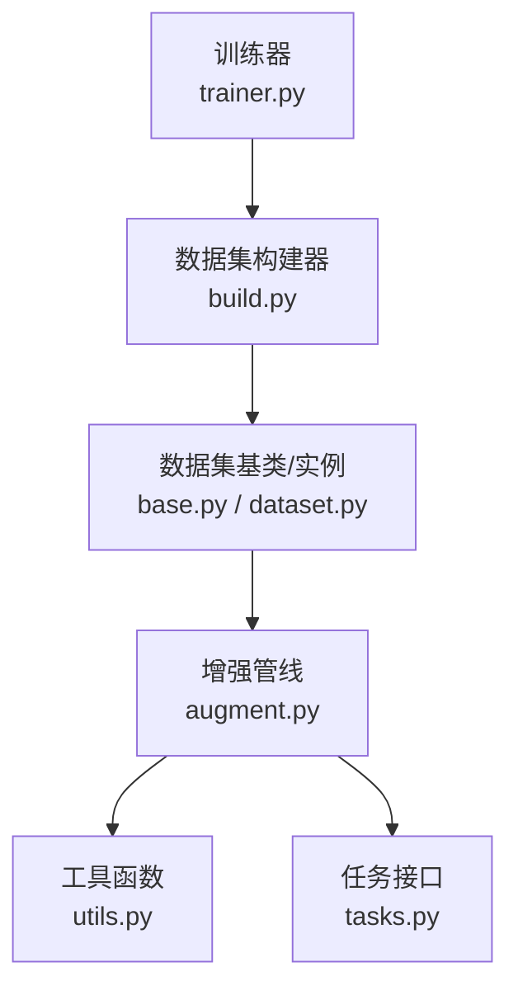
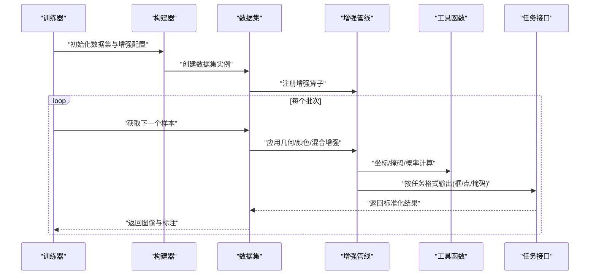
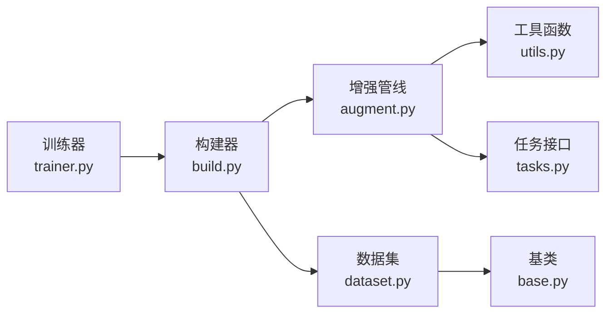

# 数据增强技术

<cite>
**本文引用的文件**
- [ultralytics/data/augment.py](file://ultralytics/data/augment.py)
- [ultralytics/data/dataset.py](file://ultralytics/data/dataset.py)
- [ultralytics/data/build.py](file://ultralytics/data/build.py)
- [ultralytics/data/base.py](file://ultralytics/data/base.py)
- [ultralytics/data/utils.py](file://ultralytics/data/utils.py)
- [ultralytics/nn/tasks.py](file://ultralytics/nn/tasks.py)
- [ultralytics/engine/trainer.py](file://ultralytics/engine/trainer.py)
- [docs/en/guides/yolo-data-augmentation.md](file://docs/en/guides/yolo-data-augmentation.md)
- [docs/macros/augmentation-args.md](file://docs/macros/augmentation-args.md)
</cite>

## 目录
1. [简介](#简介)
2. [项目结构](#项目结构)
3. [核心组件](#核心组件)
4. [架构总览](#架构总览)
5. [详细组件分析](#详细组件分析)
6. [依赖关系分析](#依赖关系分析)
7. [性能考虑](#性能考虑)
8. [故障排查指南](#故障排查指南)
9. [结论](#结论)
10. [附录](#附录)

## 简介
本技术文档聚焦于YOLO系列的数据增强体系，系统梳理几何变换（旋转、缩放、裁剪、翻转）、颜色增强（亮度、对比度、饱和度调整）、以及高级混合增强（MixUp、CutMix）等策略。文档同时给出参数配置与调优建议、面向检测/分割/分类任务的差异化策略、自定义增强的实现与集成方法、可视化与评估手段，以及在大数据集下的性能优化与内存管理实践。内容基于仓库中数据加载与增强相关源码与文档进行归纳总结，力求为工程落地提供可操作指导。

## 项目结构
本项目将数据增强能力集中在数据层，训练流程通过构建器装配数据集与增强流水线，模型侧仅消费标准化后的张量。关键路径如下：
- 数据增强实现：位于数据模块的增强文件中，集中定义各类几何与颜色增强算子及组合策略。
- 数据集装配：由构建器根据任务类型与配置组装增强管线，并对接数据加载器。
- 训练入口：训练器在迭代中调用数据管道，完成图像与标注的在线增强。
- 文档与宏：用户指南与宏文件对增强参数进行说明与汇总，便于查阅与复用。

图表来源
- [ultralytics/engine/trainer.py](file://ultralytics/engine/trainer.py)
- [ultralytics/data/build.py](file://ultralytics/data/build.py)
- [ultralytics/data/base.py](file://ultralytics/data/base.py)
- [ultralytics/data/dataset.py](file://ultralytics/data/dataset.py)
- [ultralytics/data/augment.py](file://ultralytics/data/augment.py)
- [ultralytics/data/utils.py](file://ultralytics/data/utils.py)
- [ultralytics/nn/tasks.py](file://ultralytics/nn/tasks.py)

章节来源
- [ultralytics/data/augment.py](file://ultralytics/data/augment.py)
- [ultralytics/data/dataset.py](file://ultralytics/data/dataset.py)
- [ultralytics/data/build.py](file://ultralytics/data/build.py)
- [ultralytics/data/base.py](file://ultralytics/data/base.py)
- [ultralytics/data/utils.py](file://ultralytics/data/utils.py)
- [ultralytics/nn/tasks.py](file://ultralytics/nn/tasks.py)
- [ultralytics/engine/trainer.py](file://ultralytics/engine/trainer.py)
- [docs/en/guides/yolo-data-augmentation.md](file://docs/en/guides/yolo-data-augmentation.md)
- [docs/macros/augmentation-args.md](file://docs/macros/augmentation-args.md)

## 核心组件
- 增强管线与算子
  - 几何变换：包括仿射变换（平移、缩放、旋转、剪切）、随机裁剪、水平/垂直翻转等，用于提升模型对尺度、姿态与遮挡的鲁棒性。
  - 颜色增强：亮度、对比度、饱和度、色调等通道级扰动，提升光照与色彩变化下的泛化能力。
  - 高级混合：MixUp与CutMix等样本级混合策略，促进特征空间平滑与边界学习。
- 数据集装配
  - 构建器根据任务类型（检测、分割、分类等）与配置项选择并串联增强算子，形成端到端的在线增强流水线。
  - 数据集类负责读取原始图像与标注，并在迭代时应用增强，保证图像与标注的一致性更新。
- 任务适配
  - 不同任务对标注格式与坐标归一化要求不同，增强后需同步更新边界框、关键点或掩码等标注信息。
- 工具与辅助
  - 提供坐标变换、掩码处理、概率采样、随机数种子管理等通用工具，确保增强过程的可复现性与稳定性。

章节来源
- [ultralytics/data/augment.py](file://ultralytics/data/augment.py)
- [ultralytics/data/dataset.py](file://ultralytics/data/dataset.py)
- [ultralytics/data/build.py](file://ultralytics/data/build.py)
- [ultralytics/data/base.py](file://ultralytics/data/base.py)
- [ultralytics/data/utils.py](file://ultralytics/data/utils.py)
- [ultralytics/nn/tasks.py](file://ultralytics/nn/tasks.py)

## 架构总览
下图展示从训练器到数据增强管线的整体交互流程，强调“配置驱动”的装配方式与“任务感知”的增强策略。

图表来源
- [ultralytics/engine/trainer.py](file://ultralytics/engine/trainer.py)
- [ultralytics/data/build.py](file://ultralytics/data/build.py)
- [ultralytics/data/dataset.py](file://ultralytics/data/dataset.py)
- [ultralytics/data/augment.py](file://ultralytics/data/augment.py)
- [ultralytics/data/utils.py](file://ultralytics/data/utils.py)
- [ultralytics/nn/tasks.py](file://ultralytics/nn/tasks.py)

## 详细组件分析

### 几何变换组件
- 功能要点
  - 仿射变换：统一处理平移、缩放、旋转、剪切，保持图像与标注的几何一致性。
  - 随机裁剪：支持按比例或绝对尺寸裁剪，常用于多尺度训练与小目标增强。
  - 翻转：水平/垂直翻转，提升对称性不变性。
- 参数与效果
  - 缩放范围控制小目标与背景占比；旋转角度影响姿态鲁棒性；裁剪比例影响上下文与定位精度。
- 适用任务
  - 检测：优先使用适度缩放与裁剪，配合边界框重投影。
  - 分割：注意掩码同步变换，避免边缘伪影。
  - 分类：可加大旋转与裁剪幅度以增强视角多样性。

章节来源
- [ultralytics/data/augment.py](file://ultralytics/data/augment.py)
- [ultralytics/data/utils.py](file://ultralytics/data/utils.py)
- [docs/en/guides/yolo-data-augmentation.md](file://docs/en/guides/yolo-data-augmentation.md)
- [docs/macros/augmentation-args.md](file://docs/macros/augmentation-args.md)

### 颜色增强组件
- 功能要点
  - 亮度、对比度、饱和度、色调调整，模拟不同光照与成像条件。
  - 通常采用随机区间采样，避免过度失真导致标签噪声。
- 参数与效果
  - 强度阈值决定扰动幅度；顺序与叠加次数影响最终分布。
- 适用任务
  - 分类：颜色增强收益显著，尤其在跨域迁移场景。
  - 检测/分割：需谨慎控制强度，避免破坏物体外观与边界细节。

章节来源
- [ultralytics/data/augment.py](file://ultralytics/data/augment.py)
- [docs/en/guides/yolo-data-augmentation.md](file://docs/en/guides/yolo-data-augmentation.md)
- [docs/macros/augmentation-args.md](file://docs/macros/augmentation-args.md)

### 高级混合增强（MixUp/CutMix）
- 功能要点
  - MixUp：线性插值两张图像及其标签，促使模型学习软决策边界。
  - CutMix：随机裁剪一块区域粘贴至另一图像，并相应调整标签权重与位置。
- 参数与效果
  - 混合概率与强度是关键超参；过大可能引入过多噪声，过小则收益有限。
- 适用任务
  - 分类：MixUp/CutMix普遍有效，能显著提升泛化。
  - 检测/分割：需要谨慎处理边界框/掩码的融合规则与有效性过滤。

章节来源
- [ultralytics/data/augment.py](file://ultralytics/data/augment.py)
- [docs/en/guides/yolo-data-augmentation.md](file://docs/en/guides/yolo-data-augmentation.md)
- [docs/macros/augmentation-args.md](file://docs/macros/augmentation-args.md)

### 数据集装配与任务适配
- 装配流程
  - 构建器依据任务类型与配置文件选择增强策略，串联成流水线。
  - 数据集实例在迭代时执行增强，确保图像与标注同步更新。
- 任务差异
  - 检测：关注边界框重投影与有效性校验。
  - 分割：关注掩码像素级变换与连通性维护。
  - 分类：仅需图像增强，简化管线。
- 参考实现
  - 数据集基类与具体实现定义了数据读取、缓存与增强调用接口。
  - 任务接口提供统一的输入输出规范，便于增强后直接送入模型。

章节来源
- [ultralytics/data/build.py](file://ultralytics/data/build.py)
- [ultralytics/data/dataset.py](file://ultralytics/data/dataset.py)
- [ultralytics/data/base.py](file://ultralytics/data/base.py)
- [ultralytics/nn/tasks.py](file://ultralytics/nn/tasks.py)

### 自定义增强算法的实现与集成
- 设计原则
  - 遵循统一的输入输出契约：输入为图像与标注，输出为增强后的图像与标注。
  - 保持可配置与可组合：通过参数控制强度与概率，支持与其他算子串联。
- 集成步骤
  - 在增强管线中注册自定义算子，确保其在正确阶段被调用（如几何→颜色→混合）。
  - 验证标注一致性：边界框、关键点、掩码需与图像同步变换。
  - 单元测试覆盖：针对边界情况（空标注、极小目标、全黑图像）进行测试。
- 最佳实践
  - 使用确定性随机种子以保证可复现性。
  - 对耗时算子进行批量化或向量化优化。
  - 提供可视化回调以便快速诊断异常。

章节来源
- [ultralytics/data/augment.py](file://ultralytics/data/augment.py)
- [ultralytics/data/utils.py](file://ultralytics/data/utils.py)
- [ultralytics/data/dataset.py](file://ultralytics/data/dataset.py)

### 增强效果的可视化与评估
- 可视化方法
  - 抽样回放：保存若干批次增强前后的图像与标注，人工检查合理性。
  - 统计分布：绘制关键指标（如框面积分布、颜色直方图）的变化趋势。
- 评估方法
  - 离线指标：在验证集上对比开启/关闭特定增强的mAP、mIoU、Top-1准确率等。
  - 消融实验：逐项增减增强策略，观察性能波动与收敛速度变化。
- 工具建议
  - 结合日志与回调记录增强参数与结果，便于回溯与分析。

章节来源
- [docs/en/guides/yolo-data-augmentation.md](file://docs/en/guides/yolo-data-augmentation.md)
- [ultralytics/data/augment.py](file://ultralytics/data/augment.py)

## 依赖关系分析
增强模块与数据装配、任务接口之间的依赖关系如下：

图表来源
- [ultralytics/data/augment.py](file://ultralytics/data/augment.py)
- [ultralytics/data/utils.py](file://ultralytics/data/utils.py)
- [ultralytics/nn/tasks.py](file://ultralytics/nn/tasks.py)
- [ultralytics/data/build.py](file://ultralytics/data/build.py)
- [ultralytics/data/dataset.py](file://ultralytics/data/dataset.py)
- [ultralytics/data/base.py](file://ultralytics/data/base.py)
- [ultralytics/engine/trainer.py](file://ultralytics/engine/trainer.py)

章节来源
- [ultralytics/data/augment.py](file://ultralytics/data/augment.py)
- [ultralytics/data/build.py](file://ultralytics/data/build.py)
- [ultralytics/data/dataset.py](file://ultralytics/data/dataset.py)
- [ultralytics/data/base.py](file://ultralytics/data/base.py)
- [ultralytics/data/utils.py](file://ultralytics/data/utils.py)
- [ultralytics/nn/tasks.py](file://ultralytics/nn/tasks.py)
- [ultralytics/engine/trainer.py](file://ultralytics/engine/trainer.py)

## 性能考虑
- 并行与I/O
  - 合理设置数据加载线程数与缓冲区大小，避免CPU成为瓶颈。
  - 使用预取与缓存机制减少磁盘IO抖动。
- 计算优化
  - 对常用增强进行向量化实现，减少Python循环开销。
  - 对GPU友好的增强尽量在设备端执行，降低主机-设备传输成本。
- 内存管理
  - 控制批量大小与图像分辨率，防止显存溢出。
  - 及时释放中间张量，避免累积引用导致泄漏。
- 可复现性
  - 固定随机种子，确保增强策略在不同运行中一致。

[本节为通用性能建议，不直接分析具体文件]

## 故障排查指南
- 常见问题
  - 标注不一致：增强后边界框越界或掩码错位，需检查坐标变换与有效性过滤逻辑。
  - 性能退化：过强增强引入噪声，应逐步降低强度或调整概率。
  - 内存不足：增大批量或分辨率导致OOM，需减小规模或启用梯度检查点。
- 调试技巧
  - 启用可视化回调，逐批检查增强前后结果。
  - 打印关键中间变量（如变换矩阵、概率采样值），定位异常分支。
  - 使用最小可复现示例隔离问题，逐步添加增强算子验证。

章节来源
- [ultralytics/data/augment.py](file://ultralytics/data/augment.py)
- [ultralytics/data/utils.py](file://ultralytics/data/utils.py)
- [docs/en/guides/yolo-data-augmentation.md](file://docs/en/guides/yolo-data-augmentation.md)

## 结论
本仓库的数据增强体系以模块化与任务适配为核心，通过构建器装配增强管线，在训练过程中实现高效、稳定的在线增强。针对不同任务与数据集特性，选择合适的几何与颜色增强策略，并结合MixUp/CutMix等高级混合方法，可显著提升模型泛化能力。工程实践中，应重视参数调优、可视化评估与性能优化，确保增强带来的收益稳定且可复现。

[本节为总结性内容，不直接分析具体文件]

## 附录
- 参数速查
  - 几何变换：缩放范围、旋转角度、平移比例、裁剪比例、翻转概率。
  - 颜色增强：亮度、对比度、饱和度、色调调整强度与概率。
  - 混合增强：MixUp/CutMix混合概率与强度系数。
- 任务建议
  - 检测：适度缩放+裁剪+翻转，谨慎颜色增强；必要时引入小目标增强。
  - 分割：严格同步掩码变换，避免边缘伪影；适度几何扰动。
  - 分类：较强颜色与几何扰动，配合MixUp/CutMix提升鲁棒性。
- 参考文档
  - 用户指南与宏文件提供了增强参数的详细说明与示例，便于快速上手与调优。

章节来源
- [docs/en/guides/yolo-data-augmentation.md](file://docs/en/guides/yolo-data-augmentation.md)
- [docs/macros/augmentation-args.md](file://docs/macros/augmentation-args.md)