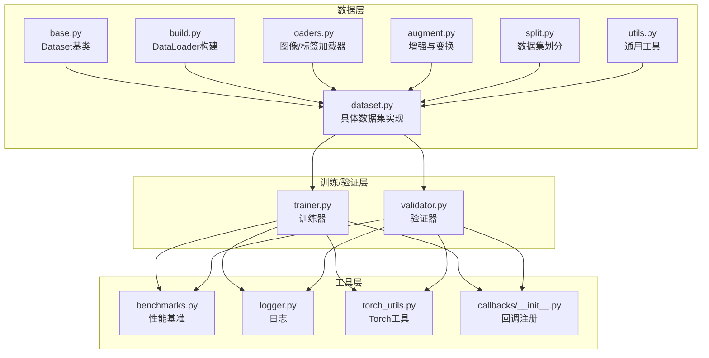
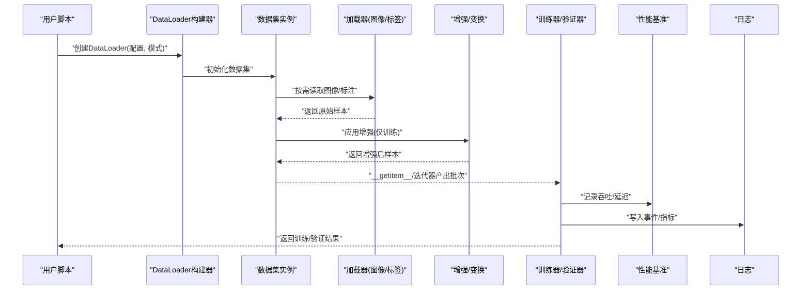
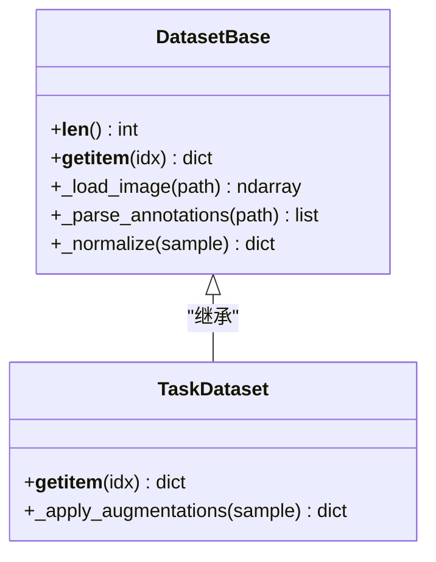
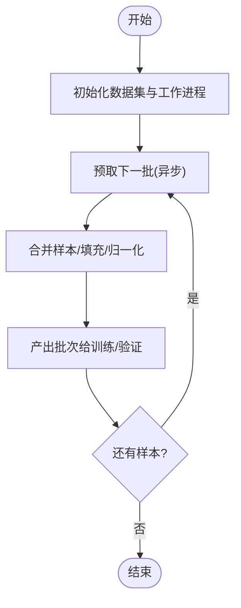
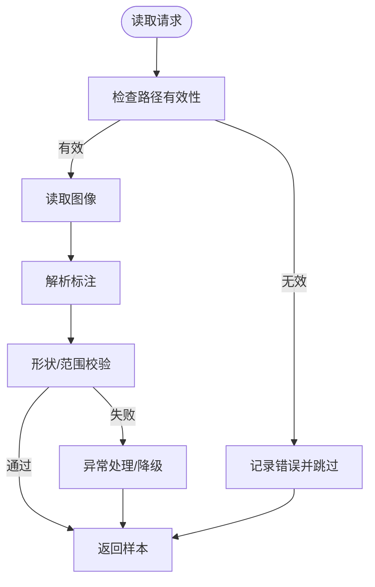
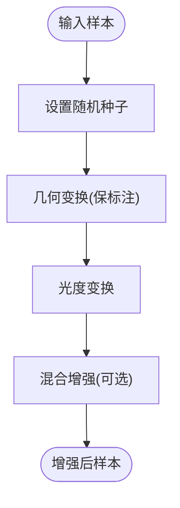
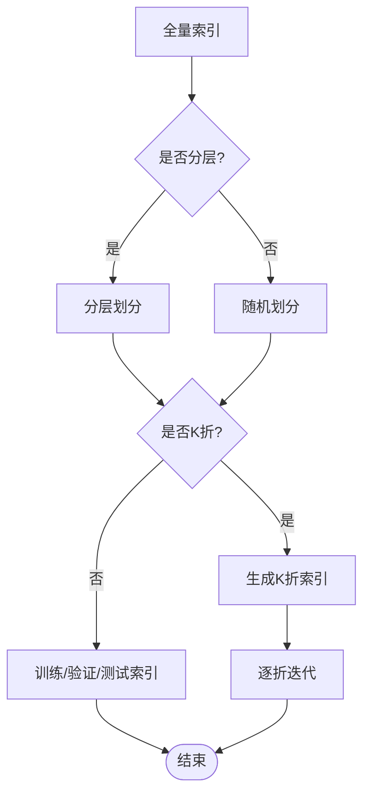
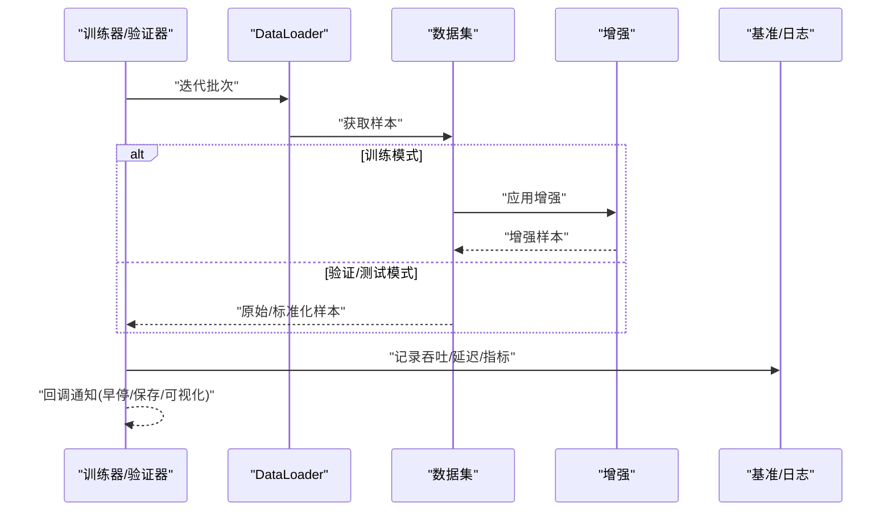
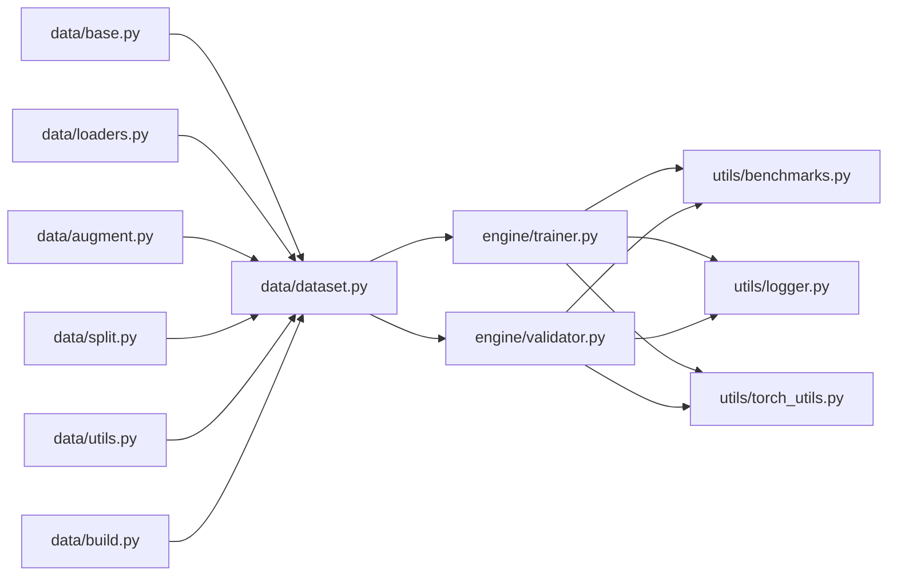

# 数据处理流水线

<cite>
**本文引用的文件**
- [ultralytics/data/base.py](file://ultralytics/data/base.py)
- [ultralytics/data/build.py](file://ultralytics/data/build.py)
- [ultralytics/data/dataset.py](file://ultralytics/data/dataset.py)
- [ultralytics/data/loaders.py](file://ultralytics/data/loaders.py)
- [ultralytics/data/augment.py](file://ultralytics/data/augment.py)
- [ultralytics/data/split.py](file://ultralytics/data/split.py)
- [ultralytics/data/utils.py](file://ultralytics/data/utils.py)
- [ultralytics/engine/trainer.py](file://ultralytics/engine/trainer.py)
- [ultralytics/engine/validator.py](file://ultralytics/engine/validator.py)
- [ultralytics/utils/benchmarks.py](file://ultralytics/utils/benchmarks.py)
- [ultralytics/utils/logger.py](file://ultralytics/utils/logger.py)
- [ultralytics/utils/torch_utils.py](file://ultralytics/utils/torch_utils.py)
- [ultralytics/utils/callbacks/__init__.py](file://ultralytics/utils/callbacks/__init__.py)
</cite>

## 目录
1. [简介](#简介)
2. [项目结构](#项目结构)
3. [核心组件](#核心组件)
4. [架构总览](#架构总览)
5. [详细组件分析](#详细组件分析)
6. [依赖关系分析](#依赖关系分析)
7. [性能考量](#性能考量)
8. [故障排查指南](#故障排查指南)
9. [结论](#结论)
10. [附录](#附录)

## 简介
本指南面向需要构建高性能、可扩展的数据处理流水线的工程师与研究者，围绕数据加载、预处理、批处理、缓存、并行、内存管理、清洗去重、异常检测、数据集划分与交叉验证、大数据与分布式方案，以及性能监控与调试工具进行系统化说明。内容基于仓库中数据模块与训练/验证引擎的实现，提供从概念到代码落地的完整路径。

## 项目结构
本项目将数据处理相关能力集中在 ultralytics/data 子包中，并通过 ultralytics/engine 的训练器与验证器串联端到端流程；性能与日志等横切能力位于 ultralytics/utils。

图表来源
- [ultralytics/data/base.py](file://ultralytics/data/base.py)
- [ultralytics/data/build.py](file://ultralytics/data/build.py)
- [ultralytics/data/dataset.py](file://ultralytics/data/dataset.py)
- [ultralytics/data/loaders.py](file://ultralytics/data/loaders.py)
- [ultralytics/data/augment.py](file://ultralytics/data/augment.py)
- [ultralytics/data/split.py](file://ultralytics/data/split.py)
- [ultralytics/data/utils.py](file://ultralytics/data/utils.py)
- [ultralytics/engine/trainer.py](file://ultralytics/engine/trainer.py)
- [ultralytics/engine/validator.py](file://ultralytics/engine/validator.py)
- [ultralytics/utils/benchmarks.py](file://ultralytics/utils/benchmarks.py)
- [ultralytics/utils/logger.py](file://ultralytics/utils/logger.py)
- [ultralytics/utils/torch_utils.py](file://ultralytics/utils/torch_utils.py)
- [ultralytics/utils/callbacks/__init__.py](file://ultralytics/utils/callbacks/__init__.py)

章节来源
- [ultralytics/data/base.py](file://ultralytics/data/base.py)
- [ultralytics/data/build.py](file://ultralytics/data/build.py)
- [ultralytics/data/dataset.py](file://ultralytics/data/dataset.py)
- [ultralytics/data/loaders.py](file://ultralytics/data/loaders.py)
- [ultralytics/data/augment.py](file://ultralytics/data/augment.py)
- [ultralytics/data/split.py](file://ultralytics/data/split.py)
- [ultralytics/data/utils.py](file://ultralytics/data/utils.py)
- [ultralytics/engine/trainer.py](file://ultralytics/engine/trainer.py)
- [ultralytics/engine/validator.py](file://ultralytics/engine/validator.py)
- [ultralytics/utils/benchmarks.py](file://ultralytics/utils/benchmarks.py)
- [ultralytics/utils/logger.py](file://ultralytics/utils/logger.py)
- [ultralytics/utils/torch_utils.py](file://ultralytics/utils/torch_utils.py)
- [ultralytics/utils/callbacks/__init__.py](file://ultralytics/utils/callbacks/__init__.py)

## 核心组件
- 数据基类与抽象接口：定义统一的数据访问协议（索引、长度、样本获取），为多任务/多格式数据集提供一致体验。
- DataLoader 构建器：负责创建可迭代的数据管道，集成线程池、预取、批合并、自动批大小等策略。
- 数据集实现：封装图像与标注的读取、解析、校验与标准化输出。
- 增强与变换：在训练阶段对图像和标注进行随机化增强，提升模型泛化能力。
- 数据集划分：提供按固定比例或分层策略生成训练/验证/测试集索引的工具。
- 训练/验证引擎：驱动数据流，组织批次迭代、前向计算、指标统计与结果记录。
- 性能与日志：提供吞吐/延迟基准、GPU/CPU资源观测、结构化日志与回调钩子。

章节来源
- [ultralytics/data/base.py](file://ultralytics/data/base.py)
- [ultralytics/data/build.py](file://ultralytics/data/build.py)
- [ultralytics/data/dataset.py](file://ultralytics/data/dataset.py)
- [ultralytics/data/augment.py](file://ultralytics/data/augment.py)
- [ultralytics/data/split.py](file://ultralytics/data/split.py)
- [ultralytics/engine/trainer.py](file://ultralytics/engine/trainer.py)
- [ultralytics/engine/validator.py](file://ultralytics/engine/validator.py)

## 架构总览
下图展示从配置到数据加载、增强、批处理、训练/验证的端到端调用链。

图表来源
- [ultralytics/data/build.py](file://ultralytics/data/build.py)
- [ultralytics/data/dataset.py](file://ultralytics/data/dataset.py)
- [ultralytics/data/loaders.py](file://ultralytics/data/loaders.py)
- [ultralytics/data/augment.py](file://ultralytics/data/augment.py)
- [ultralytics/engine/trainer.py](file://ultralytics/engine/trainer.py)
- [ultralytics/engine/validator.py](file://ultralytics/engine/validator.py)
- [ultralytics/utils/benchmarks.py](file://ultralytics/utils/benchmarks.py)
- [ultralytics/utils/logger.py](file://ultralytics/utils/logger.py)

## 详细组件分析

### 数据基类与数据集实现
- 职责
  - 定义统一的 __len__、__getitem__ 接口，屏蔽不同数据源差异。
  - 维护元信息（类别映射、路径列表、标注索引）。
  - 提供数据校验与规范化输出的方法。
- 关键设计
  - 通过工厂/构建器根据任务类型选择具体数据集实现。
  - 支持懒加载与按需解析，降低首帧延迟与峰值内存。
- 优化点
  - 使用内存映射或只读缓存减少重复 I/O。
  - 对大对象（如高分辨率图像）采用分块/缩放策略。

图表来源
- [ultralytics/data/base.py](file://ultralytics/data/base.py)
- [ultralytics/data/dataset.py](file://ultralytics/data/dataset.py)

章节来源
- [ultralytics/data/base.py](file://ultralytics/data/base.py)
- [ultralytics/data/dataset.py](file://ultralytics/data/dataset.py)

### DataLoader 构建与批处理
- 职责
  - 将数据集包装为可迭代对象，支持多线程/多进程预取、动态批大小、排序/打乱。
  - 聚合多个样本为一个批次，并做张量对齐与填充。
- 关键参数
  - 工作进程数、预取倍数、是否打乱、是否自动批大小、是否启用内存映射。
- 典型流程
  - 构建索引 -> 启动工作进程 -> 预取下一批 -> 主进程合并与转换 -> 产出批次。

图表来源
- [ultralytics/data/build.py](file://ultralytics/data/build.py)
- [ultralytics/data/dataset.py](file://ultralytics/data/dataset.py)

章节来源
- [ultralytics/data/build.py](file://ultralytics/data/build.py)
- [ultralytics/data/dataset.py](file://ultralytics/data/dataset.py)

### 图像与标注加载器
- 职责
  - 安全读取图像文件，处理损坏/缺失情况，返回统一格式的数组与尺寸信息。
  - 解析多种标注格式（坐标、掩码、关键点等），并进行一致性校验。
- 健壮性
  - 异常捕获与降级策略（跳过坏样本、记录错误计数）。
  - 可选灰度/色彩空间转换与通道顺序调整。

图表来源
- [ultralytics/data/loaders.py](file://ultralytics/data/loaders.py)
- [ultralytics/data/utils.py](file://ultralytics/data/utils.py)

章节来源
- [ultralytics/data/loaders.py](file://ultralytics/data/loaders.py)
- [ultralytics/data/utils.py](file://ultralytics/data/utils.py)

### 数据增强与变换
- 职责
  - 在训练阶段对图像与标注进行随机几何/光度变换、混合策略等，提升鲁棒性。
  - 保证增强操作与标注同步更新（如仿射变换需同步更新边界框/关键点）。
- 常见策略
  - 随机裁剪、翻转、旋转、缩放、Mosaic/CutMix 等组合增强。
  - 颜色抖动、模糊、噪声注入等。

图表来源
- [ultralytics/data/augment.py](file://ultralytics/data/augment.py)

章节来源
- [ultralytics/data/augment.py](file://ultralytics/data/augment.py)

### 数据集划分与交叉验证
- 职责
  - 将全量数据划分为训练/验证/测试子集，支持分层抽样与固定随机种子以保证可复现。
  - 提供 K 折交叉验证的索引生成器，便于模型稳健评估。
- 策略
  - 按比例划分、按场景/类别分层划分、按时间/设备分组划分。
  - 交叉验证时确保每折的分布近似一致。

图表来源
- [ultralytics/data/split.py](file://ultralytics/data/split.py)

章节来源
- [ultralytics/data/split.py](file://ultralytics/data/split.py)

### 训练/验证引擎中的数据流
- 职责
  - 组织数据迭代、批次调度、指标累积、日志记录与回调触发。
  - 在训练模式下启用增强与梯度更新，在验证/测试模式下禁用增强并关闭梯度。
- 关键流程
  - 初始化数据管道 -> 循环批次 -> 前向/损失计算 -> 指标统计 -> 回调/日志 -> 保存/导出。

图表来源
- [ultralytics/engine/trainer.py](file://ultralytics/engine/trainer.py)
- [ultralytics/engine/validator.py](file://ultralytics/engine/validator.py)
- [ultralytics/utils/benchmarks.py](file://ultralytics/utils/benchmarks.py)
- [ultralytics/utils/logger.py](file://ultralytics/utils/logger.py)

章节来源
- [ultralytics/engine/trainer.py](file://ultralytics/engine/trainer.py)
- [ultralytics/engine/validator.py](file://ultralytics/engine/validator.py)
- [ultralytics/utils/benchmarks.py](file://ultralytics/utils/benchmarks.py)
- [ultralytics/utils/logger.py](file://ultralytics/utils/logger.py)

## 依赖关系分析
- 内聚与耦合
  - data 子包内部高内聚：base/dataset/loaders/augment/split/utils 职责清晰，通过 build 组装成 DataLoader。
  - engine 与 data 解耦：通过标准迭代协议交互，避免紧耦合。
- 外部依赖
  - Torch 张量与设备管理由 torch_utils 提供统一入口。
  - 日志与回调机制贯穿训练/验证生命周期。

图表来源
- [ultralytics/data/base.py](file://ultralytics/data/base.py)
- [ultralytics/data/build.py](file://ultralytics/data/build.py)
- [ultralytics/data/dataset.py](file://ultralytics/data/dataset.py)
- [ultralytics/data/loaders.py](file://ultralytics/data/loaders.py)
- [ultralytics/data/augment.py](file://ultralytics/data/augment.py)
- [ultralytics/data/split.py](file://ultralytics/data/split.py)
- [ultralytics/data/utils.py](file://ultralytics/data/utils.py)
- [ultralytics/engine/trainer.py](file://ultralytics/engine/trainer.py)
- [ultralytics/engine/validator.py](file://ultralytics/engine/validator.py)
- [ultralytics/utils/benchmarks.py](file://ultralytics/utils/benchmarks.py)
- [ultralytics/utils/logger.py](file://ultralytics/utils/logger.py)
- [ultralytics/utils/torch_utils.py](file://ultralytics/utils/torch_utils.py)

章节来源
- [ultralytics/data/base.py](file://ultralytics/data/base.py)
- [ultralytics/data/build.py](file://ultralytics/data/build.py)
- [ultralytics/data/dataset.py](file://ultralytics/data/dataset.py)
- [ultralytics/data/loaders.py](file://ultralytics/data/loaders.py)
- [ultralytics/data/augment.py](file://ultralytics/data/augment.py)
- [ultralytics/data/split.py](file://ultralytics/data/split.py)
- [ultralytics/data/utils.py](file://ultralytics/data/utils.py)
- [ultralytics/engine/trainer.py](file://ultralytics/engine/trainer.py)
- [ultralytics/engine/validator.py](file://ultralytics/engine/validator.py)
- [ultralytics/utils/benchmarks.py](file://ultralytics/utils/benchmarks.py)
- [ultralytics/utils/logger.py](file://ultralytics/utils/logger.py)
- [ultralytics/utils/torch_utils.py](file://ultralytics/utils/torch_utils.py)

## 性能考量
- 并行与预取
  - 合理设置工作进程数与预取倍数，平衡 CPU/GPU 利用率与内存占用。
  - 对于磁盘 IO 瓶颈，优先增加预取与进程数；对于 GPU 瓶颈，关注批大小与模型算子效率。
- 内存管理
  - 使用只读缓存、内存映射与惰性加载，避免一次性载入全部数据。
  - 控制中间张量生命周期，及时释放大对象，避免碎片化。
- 批处理优化
  - 动态批大小与自动批大小策略，结合目标显存上限自适应调整。
  - 对变长序列/掩码采用高效填充与打包策略。
- 监控与诊断
  - 使用基准模块采集吞吐、延迟、GPU 利用率、CPU 使用率、IO 等待等指标。
  - 通过回调在关键节点插入断点与可视化，定位热点步骤。

章节来源
- [ultralytics/utils/benchmarks.py](file://ultralytics/utils/benchmarks.py)
- [ultralytics/utils/logger.py](file://ultralytics/utils/logger.py)
- [ultralytics/utils/torch_utils.py](file://ultralytics/utils/torch_utils.py)

## 故障排查指南
- 常见问题
  - 数据损坏或缺失：加载器应捕获异常并记录错误计数，训练继续运行。
  - 标注越界或不一致：在解析后进行范围校验，必要时丢弃或修复。
  - 内存溢出：降低批大小、减少预取、开启内存映射或分块加载。
  - 性能退化：检查工作进程数、预取倍数、磁盘 IO 与 GPU 利用率。
- 定位手段
  - 启用结构化日志，记录每个阶段的耗时与错误堆栈。
  - 使用回调在数据加载、增强、批合并前后埋点，绘制时序图。
  - 借助基准模块对比不同配置的吞吐/延迟变化。

章节来源
- [ultralytics/data/loaders.py](file://ultralytics/data/loaders.py)
- [ultralytics/data/utils.py](file://ultralytics/data/utils.py)
- [ultralytics/utils/logger.py](file://ultralytics/utils/logger.py)
- [ultralytics/utils/callbacks/__init__.py](file://ultralytics/utils/callbacks/__init__.py)

## 结论
通过将数据加载、增强、批处理与训练/验证引擎解耦，并以统一的迭代协议连接，该流水线具备良好的扩展性与可维护性。配合合理的并行与内存策略、完善的异常处理与监控工具，可在单机与分布式环境下稳定高效地处理大规模数据。建议在生产环境中持续采集性能指标，结合业务特征调优参数，形成闭环优化。

## 附录
- 最佳实践清单
  - 始终为数据管道设置随机种子以保证可复现。
  - 在训练阶段启用增强，在验证/测试阶段禁用增强。
  - 对异常样本进行“快速失败+记录”的策略，避免污染整体统计。
  - 使用分层划分与交叉验证，确保评估结果的稳定性。
  - 定期回归性能基准，防止数据管道退化。