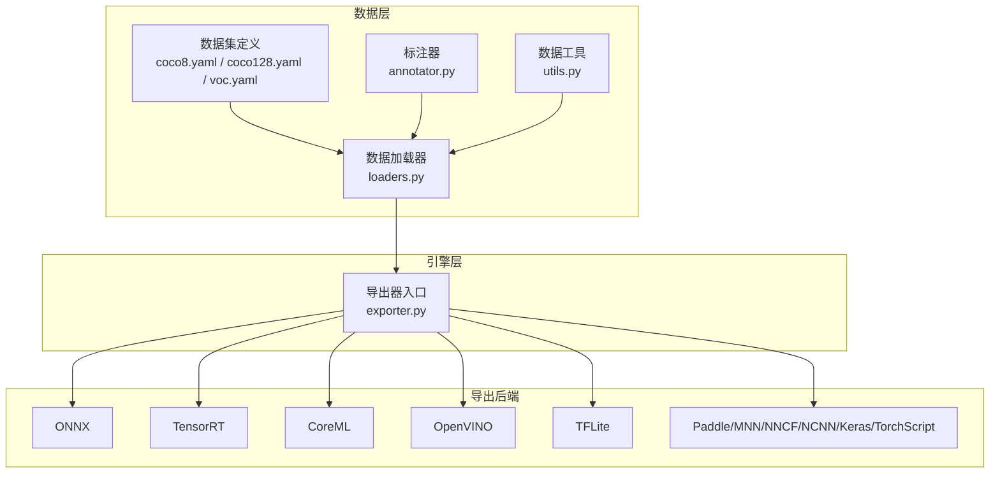
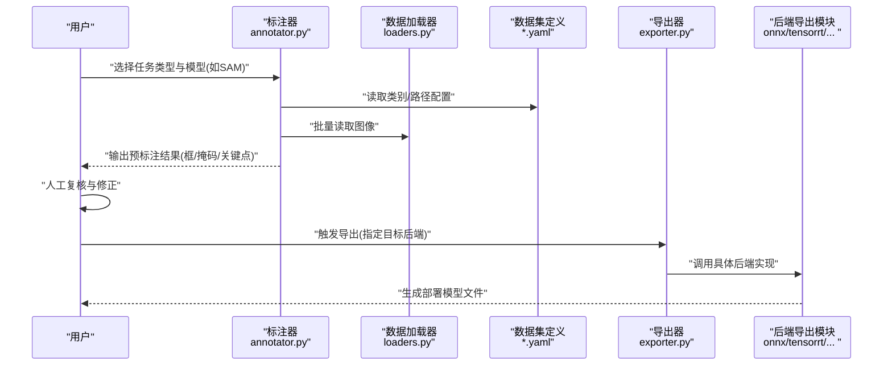
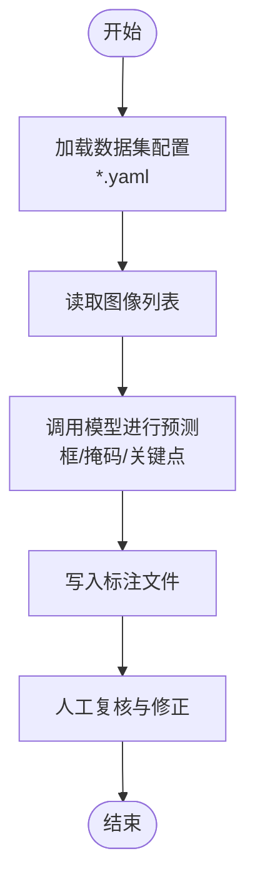
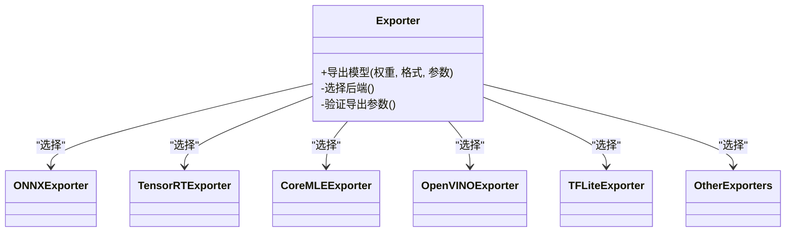
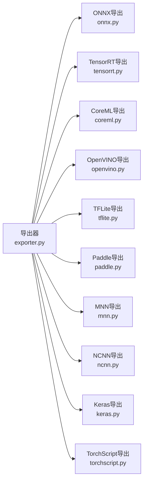

# 数据标注工具与技巧

<cite>
**本文引用的文件**
- [README.md](file://README.md)
- [data/annotator.py](file://ultralytics/data/annotator.py)
- [data/dataset.py](file://ultralytics/data/dataset.py)
- [data/loaders.py](file://ultralytics/data/loaders.py)
- [data/utils.py](file://ultralytics/data/utils.py)
- [data/scripts/coco8.yaml](file://ultralytics/cfg/datasets/coco8.yaml)
- [data/scripts/coco128.yaml](file://ultralytics/cfg/datasets/coco128.yaml)
- [data/scripts/voc.yaml](file://ultralytics/cfg/datasets/voc.yaml)
- [data/scripts/objects365.yaml](file://ultralytics/cfg/datasets/objects365.yaml)
- [data/scripts/openimages.yaml](file://ultralytics/cfg/datasets/openimages.yaml)
- [data/scripts/sam_auto_annotate.md](file://docs/macros/sam_auto_annotate.md)
- [data/scripts/preprocessing_annotated_data.md](file://docs/en/guides/preprocessing_annotated_data.md)
- [data/scripts/yolo-data-augmentation.md](file://docs/en/guides/yolo-data-augmentation.md)
- [data/scripts/export-capability-matrix.yaml](file://ultralytics/cfg/export-capability-matrix.yaml)
- [engine/exporter.py](file://ultralytics/engine/exporter.py)
- [utils/export/__init__.py](file://ultralytics/utils/export/__init__.py)
- [utils/export/onnx.py](file://ultralytics/utils/export/onnx.py)
- [utils/export/tensorrt.py](file://ultralytics/utils/export/tensorrt.py)
- [utils/export/coreml.py](file://ultralytics/utils/export/coreml.py)
- [utils/export/openvino.py](file://ultralytics/utils/export/openvino.py)
- [utils/export/tflite.py](file://ultralytics/utils/export/tflite.py)
- [utils/export/paddle.py](file://ultralytics/utils/export/paddle.py)
- [utils/export/mnn.py](file://ultralytics/utils/export/mnn.py)
- [utils/export/nncf.py](file://ultralytics/utils/export/nncf.py)
- [utils/export/ncnn.py](file://ultralytics/utils/export/ncnn.py)
- [utils/export/keras.py](file://ultralytics/utils/export/keras.py)
- [utils/export/torchscript.py](file://ultralytics/utils/export/torchscript.py)
- [utils/export/trt.py](file://ultralytics/utils/export/trt.py)
- [utils/export/bn.py](file://ultralytics/utils/export/bn.py)
- [utils/export/quantize.py](file://ultralytics/utils/export/quantize.py)
- [utils/export/shape.py](file://ultralytics/utils/export/shape.py)
- [utils/export/validate.py](file://ultralytics/utils/export/validate.py)
</cite>

## 目录
1. [简介](#简介)
2. [项目结构](#项目结构)
3. [核心组件](#核心组件)
4. [架构总览](#架构总览)
5. [详细组件分析](#详细组件分析)
6. [依赖关系分析](#依赖关系分析)
7. [性能考量](#性能考量)
8. [故障排查指南](#故障排查指南)
9. [结论](#结论)
10. [附录](#附录)

## 简介
本指南聚焦于“数据标注工具与技巧”，结合仓库中已有的数据加载、自动标注与导出能力，提供从标注到训练再到部署的完整实践路径。内容覆盖：
- 常用标注工具（LabelImg、CVAT、Roboflow等）的安装配置与使用要点
- 检测、分割、姿态估计等任务的标注方法与注意事项
- 批量标注与半自动标注的高级技巧
- 标注质量检查与一致性验证方法
- 标注数据的导出与格式转换流程
- 效率提升最佳实践与常见问题解决方案

## 项目结构
本项目围绕YOLO生态的数据与导出管线构建，关键目录与职责如下：
- ultralytics/data：数据加载、数据集定义、标注器与增强等
- ultralytics/engine：模型训练/验证/预测/导出等引擎
- ultralytics/utils/export：多后端导出实现（ONNX、TensorRT、CoreML、OpenVINO、TFLite等）
- docs：文档与宏说明，包含自动标注与预处理指南
- cfg/datasets：常见数据集的YAML配置示例

图表来源
- [data/dataset.py:1-200](file://ultralytics/data/dataset.py#L1-L200)
- [data/loaders.py:1-200](file://ultralytics/data/loaders.py#L1-L200)
- [data/annotator.py:1-200](file://ultralytics/data/annotator.py#L1-L200)
- [engine/exporter.py:1-200](file://ultralytics/engine/exporter.py#L1-L200)

章节来源
- [README.md:1-200](file://README.md#L1-L200)
- [data/dataset.py:1-200](file://ultralytics/data/dataset.py#L1-L200)
- [data/loaders.py:1-200](file://ultralytics/data/loaders.py#L1-L200)
- [data/annotator.py:1-200](file://ultralytics/data/annotator.py#L1-L200)
- [engine/exporter.py:1-200](file://ultralytics/engine/exporter.py#L1-L200)

## 核心组件
- 数据集与加载器
  - 通过YAML配置描述图像与标签路径、类别映射等；加载器负责读取图像与标注并生成训练批次。
  - 参考：[coco8.yaml](file://ultralytics/cfg/datasets/coco8.yaml)、[coco128.yaml](file://ultralytics/cfg/datasets/coco128.yaml)、[voc.yaml](file://ultralytics/cfg/datasets/voc.yaml)、[objects365.yaml](file://ultralytics/cfg/datasets/objects365.yaml)、[openimages.yaml](file://ultralytics/cfg/datasets/openimages.yaml)
- 标注器
  - 提供自动或半自动标注能力，可结合SAM等模型进行快速初标，再人工精修。
  - 参考：[annotator.py](file://ultralytics/data/annotator.py)
- 数据工具
  - 提供标注格式校验、统计、可视化辅助等通用功能。
  - 参考：[utils.py](file://ultralytics/data/utils.py)
- 导出器
  - 统一导出接口，支持多种推理后端，便于将训练好的模型转换为部署格式。
  - 参考：[exporter.py](file://ultralytics/engine/exporter.py)

章节来源
- [data/dataset.py:1-200](file://ultralytics/data/dataset.py#L1-L200)
- [data/loaders.py:1-200](file://ultralytics/data/loaders.py#L1-L200)
- [data/annotator.py:1-200](file://ultralytics/data/annotator.py#L1-L200)
- [data/utils.py:1-200](file://ultralytics/data/utils.py#L1-L200)
- [engine/exporter.py:1-200](file://ultralytics/engine/exporter.py#L1-L200)

## 架构总览
下图展示从“标注数据”到“导出部署”的整体流程，强调标注器与导出器的协作关系。

图表来源
- [data/annotator.py:1-200](file://ultralytics/data/annotator.py#L1-L200)
- [data/loaders.py:1-200](file://ultralytics/data/loaders.py#L1-L200)
- [engine/exporter.py:1-200](file://ultralytics/engine/exporter.py#L1-L200)

## 详细组件分析

### 标注器组件分析
标注器是半自动标注的核心，通常结合基础模型（如SAM）对图像进行快速初标，再由人工修正。其典型流程包括：
- 读取数据集配置与图像列表
- 调用模型进行预测（框/掩码/关键点）
- 将预测结果写入标准标注格式
- 提供可视化与批量处理接口

图表来源
- [data/annotator.py:1-200](file://ultralytics/data/annotator.py#L1-L200)
- [data/dataset.py:1-200](file://ultralytics/data/dataset.py#L1-L200)
- [data/loaders.py:1-200](file://ultralytics/data/loaders.py#L1-L200)

章节来源
- [data/annotator.py:1-200](file://ultralytics/data/annotator.py#L1-L200)
- [data/dataset.py:1-200](file://ultralytics/data/dataset.py#L1-L200)
- [data/loaders.py:1-200](file://ultralytics/data/loaders.py#L1-L200)

### 导出器组件分析
导出器提供统一的导出入口，内部根据目标后端选择相应实现。典型流程：
- 解析导出参数（格式、精度、输入尺寸等）
- 加载已训练权重
- 调用具体后端模块完成转换
- 输出部署所需文件

图表来源
- [engine/exporter.py:1-200](file://ultralytics/engine/exporter.py#L1-L200)
- [utils/export/onnx.py:1-200](file://ultralytics/utils/export/onnx.py#L1-L200)
- [utils/export/tensorrt.py:1-200](file://ultralytics/utils/export/tensorrt.py#L1-L200)
- [utils/export/coreml.py:1-200](file://ultralytics/utils/export/coreml.py#L1-L200)
- [utils/export/openvino.py:1-200](file://ultralytics/utils/export/openvino.py#L1-L200)
- [utils/export/tflite.py:1-200](file://ultralytics/utils/export/tflite.py#L1-L200)

章节来源
- [engine/exporter.py:1-200](file://ultralytics/engine/exporter.py#L1-L200)
- [utils/export/onnx.py:1-200](file://ultralytics/utils/export/onnx.py#L1-L200)
- [utils/export/tensorrt.py:1-200](file://ultralytics/utils/export/tensorrt.py#L1-L200)
- [utils/export/coreml.py:1-200](file://ultralytics/utils/export/coreml.py#L1-L200)
- [utils/export/openvino.py:1-200](file://ultralytics/utils/export/openvino.py#L1-L200)
- [utils/export/tflite.py:1-200](file://ultralytics/utils/export/tflite.py#L1-L200)

### 标注工具安装与使用要点（外部工具）
- LabelImg
  - 适用场景：矩形框标注（检测任务）
  - 安装建议：优先使用官方包管理器或虚拟环境安装，避免系统级污染
  - 使用技巧：快捷键加速绘制、批量导入图像、导出COCO/VOC/YOLO格式
- CVAT
  - 适用场景：团队协作、视频跟踪、复杂任务（分割/关键点/多边形）
  - 部署方式：Docker一键启动，支持Web端协作
  - 使用技巧：模板化类别、插值标注、自动跟踪、导出多格式
- Roboflow
  - 适用场景：云端标注、版本管理、一键导出为YOLO/COCO等
  - 使用技巧：创建数据集版本、应用增强策略、直接下载训练集

注意：以上为通用实践建议，具体安装命令与界面操作请参考各工具的官方文档。

### 不同任务的标注方法与注意事项
- 检测（Bounding Box）
  - 标注要点：边界贴合、遮挡处理、小目标不漏标
  - 格式：YOLO txt、COCO json、VOC xml
- 实例分割（Polygon/Mask）
  - 标注要点：轮廓精细度、重叠区域处理、类别一致
  - 格式：COCO segmentation、YOLO segment
- 姿态估计（Keypoints）
  - 标注要点：关键点语义一致、可见性标记、对称部位区分
  - 格式：COCO keypoints、YOLO pose

### 批量标注与半自动标注高级技巧
- 批量初标
  - 使用标注器批量生成初标结果，减少重复劳动
  - 结合SAM等模型进行快速掩码/框预测
- 半自动标注
  - 先粗后精：先生成候选框/掩码，再人工微调
  - 模板复用：将高质量样本作为模板，应用到相似图像
- 自动化脚本
  - 基于数据加载器遍历图像，调用标注器批量处理
  - 输出标准化标注文件，便于后续训练与评估

章节来源
- [data/annotator.py:1-200](file://ultralytics/data/annotator.py#L1-L200)
- [data/loaders.py:1-200](file://ultralytics/data/loaders.py#L1-L200)
- [data/dataset.py:1-200](file://ultralytics/data/dataset.py#L1-L200)

### 标注质量检查与一致性验证
- 基本检查
  - 类别完整性：确保所有类别均有标注且命名一致
  - 坐标合法性：边界框不越界、掩码非空、关键点数量正确
- 统计与可视化
  - 利用数据工具进行分布统计与异常检测
  - 抽样可视化确认标注质量
- 一致性验证
  - 多人交叉校验，记录差异并统一规范
  - 建立标注规范文档，定期培训与复盘

章节来源
- [data/utils.py:1-200](file://ultralytics/data/utils.py#L1-L200)
- [data/loaders.py:1-200](file://ultralytics/data/loaders.py#L1-L200)

### 标注数据导出与格式转换流程
- 导出目标
  - YOLO txt：适合YOLO系列训练
  - COCO json：通用格式，兼容多种框架
  - VOC xml：传统格式，适用于特定流水线
- 转换步骤
  - 准备原始标注（任意格式）
  - 使用数据工具或脚本转换为目标格式
  - 校验转换结果（类别、坐标、文件结构）
- 与导出器联动
  - 训练完成后，通过导出器将模型转换为部署格式（ONNX/TensorRT/CoreML/OpenVINO/TFLite等）

章节来源
- [data/utils.py:1-200](file://ultralytics/data/utils.py#L1-L200)
- [engine/exporter.py:1-200](file://ultralytics/engine/exporter.py#L1-L200)
- [utils/export/onnx.py:1-200](file://ultralytics/utils/export/onnx.py#L1-L200)
- [utils/export/tensorrt.py:1-200](file://ultralytics/utils/export/tensorrt.py#L1-L200)
- [utils/export/coreml.py:1-200](file://ultralytics/utils/export/coreml.py#L1-L200)
- [utils/export/openvino.py:1-200](file://ultralytics/utils/export/openvino.py#L1-L200)
- [utils/export/tflite.py:1-200](file://ultralytics/utils/export/tflite.py#L1-L200)

### 效率提升最佳实践
- 标注前规划
  - 明确任务目标与类别体系，制定标注规范
  - 设计合理的图像采集策略，覆盖长尾场景
- 标注过程优化
  - 使用半自动标注减少重复劳动
  - 建立模板库与快捷键方案
- 质量控制
  - 引入抽检机制与双人复核
  - 使用统计指标监控数据分布变化
- 持续迭代
  - 基于模型反馈定位难例，针对性补充标注
  - 定期更新标注规范与培训材料

### 常见问题解决方案
- 标注不一致
  - 统一类别命名与语义定义，建立对照表
  - 使用模板与规则约束，减少主观差异
- 小目标漏标
  - 放大查看、分层标注、增加正样本比例
- 遮挡与重叠
  - 明确遮挡处理策略，必要时拆分标注
- 格式转换错误
  - 校验源文件格式与字段完整性
  - 使用工具链提供的校验与修复功能

## 依赖关系分析
导出器与各后端模块之间的依赖关系如下：

图表来源
- [engine/exporter.py:1-200](file://ultralytics/engine/exporter.py#L1-L200)
- [utils/export/onnx.py:1-200](file://ultralytics/utils/export/onnx.py#L1-L200)
- [utils/export/tensorrt.py:1-200](file://ultralytics/utils/export/tensorrt.py#L1-L200)
- [utils/export/coreml.py:1-200](file://ultralytics/utils/export/coreml.py#L1-L200)
- [utils/export/openvino.py:1-200](file://ultralytics/utils/export/openvino.py#L1-L200)
- [utils/export/tflite.py:1-200](file://ultralytics/utils/export/tflite.py#L1-L200)
- [utils/export/paddle.py:1-200](file://ultralytics/utils/export/paddle.py#L1-L200)
- [utils/export/mnn.py:1-200](file://ultralytics/utils/export/mnn.py#L1-L200)
- [utils/export/ncnn.py:1-200](file://ultralytics/utils/export/ncnn.py#L1-L200)
- [utils/export/keras.py:1-200](file://ultralytics/utils/export/keras.py#L1-L200)
- [utils/export/torchscript.py:1-200](file://ultralytics/utils/export/torchscript.py#L1-L200)

章节来源
- [engine/exporter.py:1-200](file://ultralytics/engine/exporter.py#L1-L200)
- [utils/export/onnx.py:1-200](file://ultralytics/utils/export/onnx.py#L1-L200)
- [utils/export/tensorrt.py:1-200](file://ultralytics/utils/export/tensorrt.py#L1-L200)
- [utils/export/coreml.py:1-200](file://ultralytics/utils/export/coreml.py#L1-L200)
- [utils/export/openvino.py:1-200](file://ultralytics/utils/export/openvino.py#L1-L200)
- [utils/export/tflite.py:1-200](file://ultralytics/utils/export/tflite.py#L1-L200)

## 性能考量
- 标注阶段
  - 合理划分图像分辨率与批次大小，避免内存溢出
  - 使用缓存与并行读取提升I/O吞吐
- 导出阶段
  - 选择合适的后端与精度（FP32/INT8），平衡速度与精度
  - 针对目标平台优化输入尺寸与算子支持

## 故障排查指南
- 标注器报错
  - 检查数据集配置路径与类别映射是否正确
  - 确认模型权重与依赖库版本匹配
- 导出失败
  - 核对目标后端的环境要求（CUDA、驱动、依赖）
  - 检查模型图结构与算子兼容性
- 数据加载异常
  - 验证图像与标签文件存在性与格式一致性
  - 使用数据工具进行统计与可视化定位问题

章节来源
- [data/annotator.py:1-200](file://ultralytics/data/annotator.py#L1-L200)
- [data/loaders.py:1-200](file://ultralytics/data/loaders.py#L1-L200)
- [engine/exporter.py:1-200](file://ultralytics/engine/exporter.py#L1-L200)

## 结论
通过结合标注器与导出器，本项目提供了从“标注—训练—导出”的一体化能力。遵循本指南的最佳实践与排障建议，可显著提升标注效率与数据质量，并顺利将模型部署至多类推理后端。

## 附录
- 自动标注与预处理参考
  - SAM自动标注宏说明：[sam_auto_annotate.md](file://docs/macros/sam_auto_annotate.md)
  - 标注数据预处理指南：[preprocessing_annotated_data.md](file://docs/en/guides/preprocessing_annotated_data.md)
  - 数据增强指南：[yolo-data-augmentation.md](file://docs/en/guides/yolo-data-augmentation.md)
- 导出能力矩阵
  - 导出能力清单：[export-capability-matrix.yaml](file://ultralytics/cfg/export-capability-matrix.yaml)