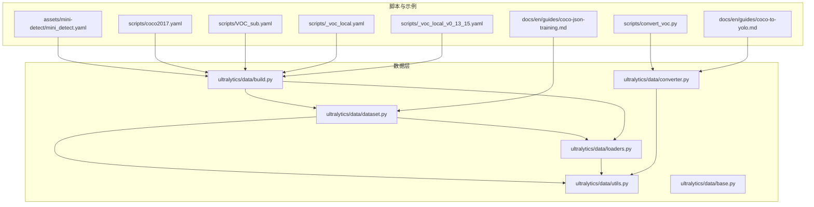
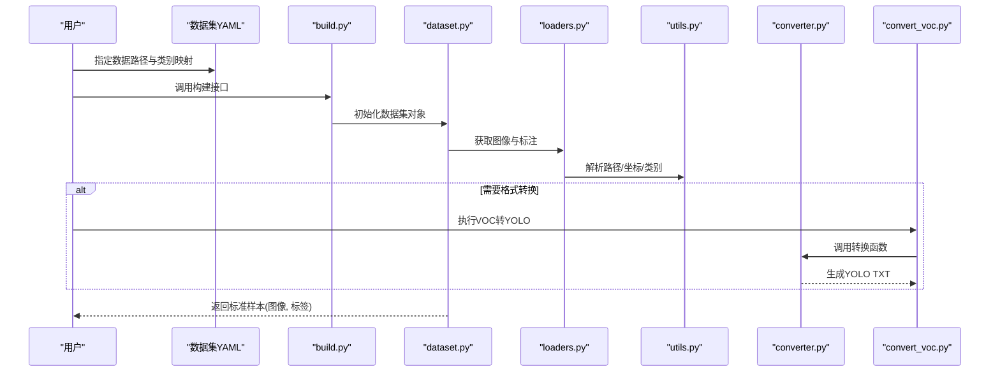
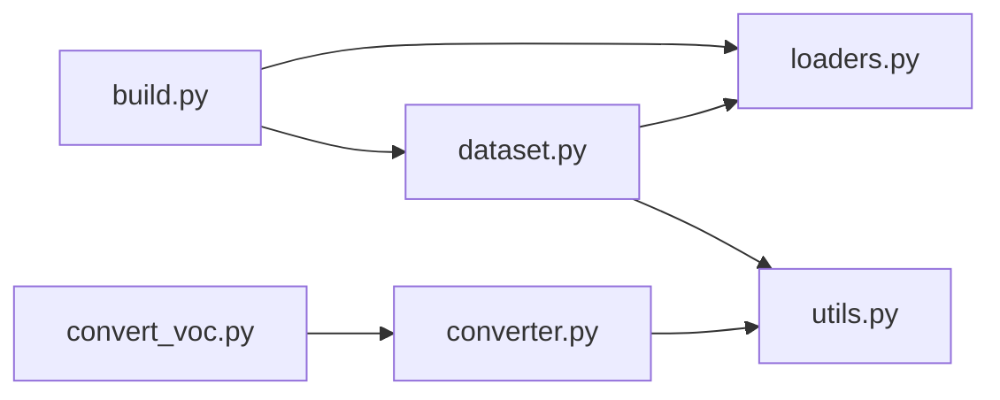

# 数据集格式规范

<cite>
**本文引用的文件**
- [ultralytics/data/dataset.py](file://ultralytics/data/dataset.py)
- [ultralytics/data/loaders.py](file://ultralytics/data/loaders.py)
- [ultralytics/data/converter.py](file://ultralytics/data/converter.py)
- [ultralytics/data/utils.py](file://ultralytics/data/utils.py)
- [ultralytics/data/base.py](file://ultralytics/data/base.py)
- [ultralytics/data/build.py](file://ultralytics/data/build.py)
- [scripts/convert_voc.py](file://scripts/convert_voc.py)
- [docs/en/guides/coco-to-yolo.md](file://docs/en/guides/coco-to-yolo.md)
- [docs/en/guides/coco-json-training.md](file://docs/en/guides/coco-json-training.md)
- [assets/mini-detect/mini_detect.yaml](file://assets/mini-detect/mini_detect.yaml)
- [scripts/coco2017.yaml](file://scripts/coco2017.yaml)
- [scripts/VOC_sub.yaml](file://scripts/VOC_sub.yaml)
- [scripts/_voc_local.yaml](file://scripts/_voc_local.yaml)
- [scripts/_voc_local_v0_13_15.yaml](file://scripts/_voc_local_v0_13_15.yaml)
</cite>

## 目录
1. [简介](#简介)
2. [项目结构](#项目结构)
3. [核心组件](#核心组件)
4. [架构总览](#架构总览)
5. [详细组件分析](#详细组件分析)
6. [依赖关系分析](#依赖关系分析)
7. [性能考虑](#性能考虑)
8. [故障排查指南](#故障排查指南)
9. [结论](#结论)
10. [附录](#附录)

## 简介
本文件面向YOLO-Master的数据集准备与使用，系统梳理COCO、VOC、YOLO等主流目标检测数据集格式的目录组织、命名约定与标注文件格式（JSON/XML/TXT），并给出从其他格式到YOLO格式的转换方法、数据验证与完整性检查流程、示例与最佳实践。文档同时结合仓库中的数据集加载器、转换器与示例配置，帮助读者快速搭建可训练的数据集工程。

## 项目结构
YOLO-Master对数据集的读取与处理集中在ultralytics/data子模块中，并提供若干脚本与示例配置文件用于常见任务（如COCO转YOLO、VOC本地化配置）。典型目录与职责如下：
- ultralytics/data：数据集构建、加载、格式解析与工具函数
- scripts：包含VOC转YOLO脚本及若干数据集YAML示例
- docs/en/guides：官方指南，含COCO转YOLO与COCO JSON训练说明
- assets/mini-detect：最小可运行检测数据集示例及其YAML配置

图表来源
- [ultralytics/data/dataset.py](file://ultralytics/data/dataset.py)
- [ultralytics/data/loaders.py](file://ultralytics/data/loaders.py)
- [ultralytics/data/converter.py](file://ultralytics/data/converter.py)
- [ultralytics/data/utils.py](file://ultralytics/data/utils.py)
- [ultralytics/data/base.py](file://ultralytics/data/base.py)
- [ultralytics/data/build.py](file://ultralytics/data/build.py)
- [scripts/convert_voc.py](file://scripts/convert_voc.py)
- [docs/en/guides/coco-to-yolo.md](file://docs/en/guides/coco-to-yolo.md)
- [docs/en/guides/coco-json-training.md](file://docs/en/guides/coco-json-training.md)
- [assets/mini-detect/mini_detect.yaml](file://assets/mini-detect/mini_detect.yaml)
- [scripts/coco2017.yaml](file://scripts/coco2017.yaml)
- [scripts/VOC_sub.yaml](file://scripts/VOC_sub.yaml)
- [scripts/_voc_local.yaml](file://scripts/_voc_local.yaml)
- [scripts/_voc_local_v0_13_15.yaml](file://scripts/_voc_local_v0_13_15.yaml)

章节来源
- [ultralytics/data/dataset.py](file://ultralytics/data/dataset.py)
- [ultralytics/data/loaders.py](file://ultralytics/data/loaders.py)
- [ultralytics/data/converter.py](file://ultralytics/data/converter.py)
- [ultralytics/data/utils.py](file://ultralytics/data/utils.py)
- [ultralytics/data/base.py](file://ultralytics/data/base.py)
- [ultralytics/data/build.py](file://ultralytics/data/build.py)
- [scripts/convert_voc.py](file://scripts/convert_voc.py)
- [docs/en/guides/coco-to-yolo.md](file://docs/en/guides/coco-to-yolo.md)
- [docs/en/guides/coco-json-training.md](file://docs/en/guides/coco-json-training.md)
- [assets/mini-detect/mini_detect.yaml](file://assets/mini-detect/mini_detect.yaml)
- [scripts/coco2017.yaml](file://scripts/coco2017.yaml)
- [scripts/VOC_sub.yaml](file://scripts/VOC_sub.yaml)
- [scripts/_voc_local.yaml](file://scripts/_voc_local.yaml)
- [scripts/_voc_local_v0_13_15.yaml](file://scripts/_voc_local_v0_13_15.yaml)

## 核心组件
- 数据集构建与加载
  - dataset.py：定义统一的数据集接口与迭代逻辑，负责将不同源格式转换为内部一致表示
  - loaders.py：图像与标注的底层加载器，提供路径解析、图像解码、归一化等能力
  - build.py：根据YAML配置组装数据集对象，管理train/val/test划分与缓存
  - base.py：通用基类与公共数据结构
  - utils.py：路径、索引、类别映射、边界框坐标变换等工具函数
- 格式转换
  - converter.py：实现COCO/VOC/YOLO等格式之间的相互转换
  - convert_voc.py：命令行脚本，批量将VOC XML标注转为YOLO TXT标注
- 示例与指南
  - coco-to-yolo.md / coco-json-training.md：COCO转YOLO与COCO JSON训练的官方指南
  - mini_detect.yaml / coco2017.yaml / VOC_sub.yaml / _voc_local*.yaml：数据集YAML模板与示例

章节来源
- [ultralytics/data/dataset.py](file://ultralytics/data/dataset.py)
- [ultralytics/data/loaders.py](file://ultralytics/data/loaders.py)
- [ultralytics/data/build.py](file://ultralytics/data/build.py)
- [ultralytics/data/base.py](file://ultralytics/data/base.py)
- [ultralytics/data/utils.py](file://ultralytics/data/utils.py)
- [ultralytics/data/converter.py](file://ultralytics/data/converter.py)
- [scripts/convert_voc.py](file://scripts/convert_voc.py)
- [docs/en/guides/coco-to-yolo.md](file://docs/en/guides/coco-to-yolo.md)
- [docs/en/guides/coco-json-training.md](file://docs/en/guides/coco-json-training.md)
- [assets/mini-detect/mini_detect.yaml](file://assets/mini-detect/mini_detect.yaml)
- [scripts/coco2017.yaml](file://scripts/coco2017.yaml)
- [scripts/VOC_sub.yaml](file://scripts/VOC_sub.yaml)
- [scripts/_voc_local.yaml](file://scripts/_voc_local.yaml)
- [scripts/_voc_local_v0_13_15.yaml](file://scripts/_voc_local_v0_13_15.yaml)

## 架构总览
下图展示从“原始数据+YAML配置”到“训练可用数据集”的整体流程，包括格式解析、转换、构建与加载的关键环节。

图表来源
- [ultralytics/data/build.py](file://ultralytics/data/build.py)
- [ultralytics/data/dataset.py](file://ultralytics/data/dataset.py)
- [ultralytics/data/loaders.py](file://ultralytics/data/loaders.py)
- [ultralytics/data/utils.py](file://ultralytics/data/utils.py)
- [ultralytics/data/converter.py](file://ultralytics/data/converter.py)
- [scripts/convert_voc.py](file://scripts/convert_voc.py)

## 详细组件分析

### YOLO格式规范（TXT）
- 目录组织
  - images：存放所有图像文件（支持jpg/png等）
  - labels：与images同名的TXT标注文件，按相同子目录结构组织
  - data.yaml：描述数据集根路径、类别数、类别名称列表以及train/val/test划分
- 标注文件命名约定
  - 图像文件名与对应标注文件名完全一致，仅扩展名不同（例如a.jpg ↔ a.txt）
- 标注文件格式（TXT）
  - 每行一个目标，字段顺序为：类别ID 中心x 中心y 宽度w 高度h
  - 坐标均为相对值，范围[0,1]，基于图像的宽和高进行归一化
  - 类别ID从0开始，连续且与data.yaml中的类别顺序严格对应
- 示例参考
  - 最小示例数据集与YAML配置见assets/mini-detect

章节来源
- [assets/mini-detect/mini_detect.yaml](file://assets/mini-detect/mini_detect.yaml)
- [ultralytics/data/dataset.py](file://ultralytics/data/dataset.py)
- [ultralytics/data/loaders.py](file://ultralytics/data/loaders.py)
- [ultralytics/data/utils.py](file://ultralytics/data/utils.py)

### COCO格式规范（JSON）
- 目录组织
  - images：存放图像
  - annotations：存放COCO JSON标注文件（如instances_train2017.json）
  - data.yaml：可选，用于在YOLO侧声明COCO路径与类别信息
- 标注文件格式（JSON）
  - 顶层字段通常包含images、annotations、categories等
  - categories定义id与name映射；annotations包含bbox、segmentation、iscrowd等
- 训练与转换
  - 可直接使用COCO JSON进行训练或先转换为YOLO TXT
  - 官方指南提供了COCO转YOLO与COCO JSON训练的流程说明

章节来源
- [docs/en/guides/coco-json-training.md](file://docs/en/guides/coco-json-training.md)
- [docs/en/guides/coco-to-yolo.md](file://docs/en/guides/coco-to-yolo.md)
- [ultralytics/data/converter.py](file://ultralytics/data/converter.py)
- [ultralytics/data/dataset.py](file://ultralytics/data/dataset.py)

### VOC格式规范（XML）
- 目录组织
  - JPEGImages：存放图像
  - Annotations：存放VOC XML标注
  - ImageSets/Main：存放train/val/test分割列表（可选）
  - data.yaml：可选，用于在YOLO侧声明VOC路径与类别信息
- 标注文件格式（XML）
  - 每个图像对应一个同名XML文件，包含object列表，每个object有name、bndbox等
- 转换建议
  - 推荐使用convert_voc.py将VOC XML批量转换为YOLO TXT，便于后续训练

章节来源
- [scripts/convert_voc.py](file://scripts/convert_voc.py)
- [ultralytics/data/converter.py](file://ultralytics/data/converter.py)
- [scripts/VOC_sub.yaml](file://scripts/VOC_sub.yaml)
- [scripts/_voc_local.yaml](file://scripts/_voc_local_v0_13_15.yaml)

### 数据集YAML配置
- 关键字段
  - path：数据集根目录
  - train/val/test：各集合的相对路径或glob模式
  - names：类别名称列表（顺序决定类别ID）
  - nc：类别数量（可由names推导）
- 示例
  - 检测任务示例：assets/mini-detect/mini_detect.yaml
  - COCO2017示例：scripts/coco2017.yaml
  - VOC本地化示例：scripts/_voc_local.yaml、scripts/_voc_local_v0_13_15.yaml、scripts/VOC_sub.yaml

章节来源
- [assets/mini-detect/mini_detect.yaml](file://assets/mini-detect/mini_detect.yaml)
- [scripts/coco2017.yaml](file://scripts/coco2017.yaml)
- [scripts/VOC_sub.yaml](file://scripts/VOC_sub.yaml)
- [scripts/_voc_local.yaml](file://scripts/_voc_local.yaml)
- [scripts/_voc_local_v0_13_15.yaml](file://scripts/_voc_local_v0_13_15.yaml)

### 格式转换工具与脚本
- 自动转换
  - converter.py：提供COCO↔YOLO、VOC↔YOLO等转换函数
  - convert_voc.py：命令行入口，遍历VOC目录，解析XML并输出YOLO TXT
- 使用方式
  - 通过命令行参数指定输入VOC根目录、输出YOLO根目录、类别映射等
  - 转换后需确保labels与images目录结构一致，且TXT命名与图像一致

章节来源
- [ultralytics/data/converter.py](file://ultralytics/data/converter.py)
- [scripts/convert_voc.py](file://scripts/convert_voc.py)
- [docs/en/guides/coco-to-yolo.md](file://docs/en/guides/coco-to-yolo.md)

### 数据验证与完整性检查
- 基本检查项
  - 图像存在性：images目录下文件是否完整
  - 标注一致性：每个图像是否有同名TXT，且TXT行数≥0
  - 坐标有效性：YOLO TXT的xywh均在[0,1]范围内
  - 类别合法性：类别ID小于nc且在names中存在
  - 路径正确性：YAML中path/train/val/test指向真实路径
- 推荐流程
  - 在构建数据集前，先运行一次轻量级校验（统计缺失、越界、非法类别等）
  - 对异常样本输出日志并跳过，保证训练稳定性

章节来源
- [ultralytics/data/utils.py](file://ultralytics/data/utils.py)
- [ultralytics/data/dataset.py](file://ultralytics/data/dataset.py)
- [ultralytics/data/loaders.py](file://ultralytics/data/loaders.py)

### 实际示例与最佳实践
- 最小可运行示例
  - 使用assets/mini-detect作为模板，复制images与labels，修改mini_detect.yaml中的path与names
- 多集合划分
  - 在YAML中分别设置train/val/test路径，确保无重复图像
- 类别管理
  - 保持names顺序稳定，避免训练中途类别映射漂移
- 转换流水线
  - 优先将外部标注统一转换为YOLO TXT，减少运行时解析开销
- 版本兼容
  - 注意不同VOC版本的目录差异，必要时使用对应的本地化YAML模板

章节来源
- [assets/mini-detect/mini_detect.yaml](file://assets/mini-detect/mini_detect.yaml)
- [scripts/_voc_local.yaml](file://scripts/_voc_local.yaml)
- [scripts/_voc_local_v0_13_15.yaml](file://scripts/_voc_local_v0_13_15.yaml)
- [scripts/VOC_sub.yaml](file://scripts/VOC_sub.yaml)

## 依赖关系分析
- 组件耦合
  - build.py依赖dataset.py与loaders.py完成数据集装配
  - dataset.py依赖loaders.py与utils.py完成图像与标注解析
  - converter.py依赖utils.py进行坐标与类别映射
- 外部依赖
  - 文件系统访问、图像解码库、JSON/XML解析库
- 潜在循环依赖
  - 当前设计分层清晰，未见明显循环依赖

图表来源
- [ultralytics/data/build.py](file://ultralytics/data/build.py)
- [ultralytics/data/dataset.py](file://ultralytics/data/dataset.py)
- [ultralytics/data/loaders.py](file://ultralytics/data/loaders.py)
- [ultralytics/data/utils.py](file://ultralytics/data/utils.py)
- [ultralytics/data/converter.py](file://ultralytics/data/converter.py)
- [scripts/convert_voc.py](file://scripts/convert_voc.py)

章节来源
- [ultralytics/data/build.py](file://ultralytics/data/build.py)
- [ultralytics/data/dataset.py](file://ultralytics/data/dataset.py)
- [ultralytics/data/loaders.py](file://ultralytics/data/loaders.py)
- [ultralytics/data/utils.py](file://ultralytics/data/utils.py)
- [ultralytics/data/converter.py](file://ultralytics/data/converter.py)
- [scripts/convert_voc.py](file://scripts/convert_voc.py)

## 性能考虑
- 预处理与缓存
  - 建议在首次构建时启用缓存，避免重复解析与解码
- 并行I/O
  - 使用多线程或多进程加载图像与标注，提升吞吐
- 坐标归一化
  - 尽量在转换阶段完成归一化，减少训练时的计算负担
- 类别映射
  - 预构建类别字典，避免运行时查找开销

## 故障排查指南
- 常见问题
  - 找不到图像或标注：检查YAML路径与文件名一致性
  - 标注越界或类别非法：检查坐标范围与类别ID映射
  - 转换失败：确认VOC目录结构与XML字段完整
- 定位步骤
  - 打印数据集统计信息（图像数量、标注总数、类别分布）
  - 针对异常样本输出具体错误原因（缺失、越界、类型不匹配）
  - 逐步缩小问题范围（单图单标验证）

章节来源
- [ultralytics/data/utils.py](file://ultralytics/data/utils.py)
- [ultralytics/data/dataset.py](file://ultralytics/data/dataset.py)
- [ultralytics/data/loaders.py](file://ultralytics/data/loaders.py)

## 结论
YOLO-Master通过统一的构建与加载接口，兼容COCO、VOC与YOLO三种主流格式。借助converter与convert_voc.py，可将外部标注高效转换为YOLO TXT，配合YAML配置与校验流程，形成稳健的数据集工程。遵循本文的目录组织、命名约定与最佳实践，可显著提升数据准备效率与训练稳定性。

## 附录
- 常用命令与路径
  - VOC转YOLO：参考scripts/convert_voc.py的使用说明
  - COCO转YOLO：参考docs/en/guides/coco-to-yolo.md
  - 示例YAML：assets/mini-detect/mini_detect.yaml、scripts/coco2017.yaml、scripts/_voc_local*.yaml、scripts/VOC_sub.yaml