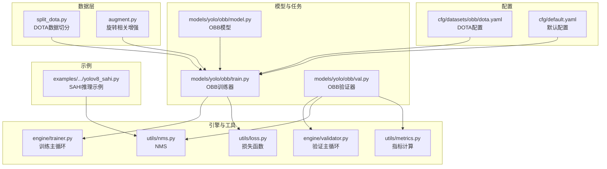
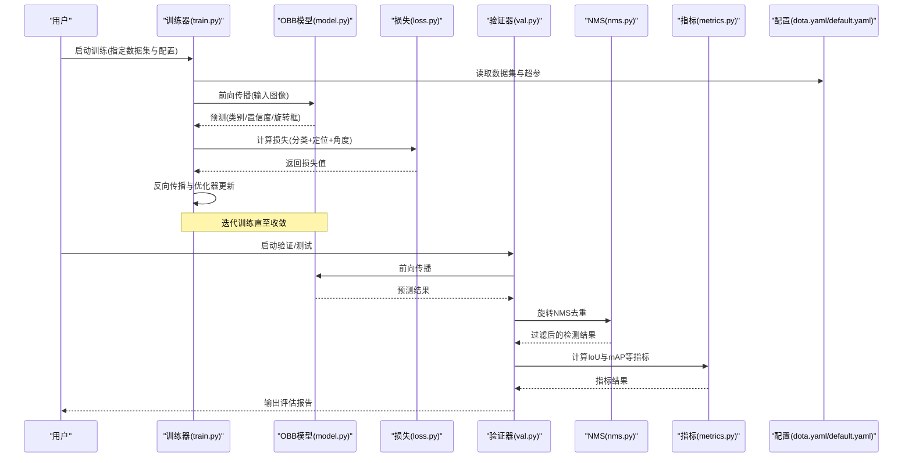
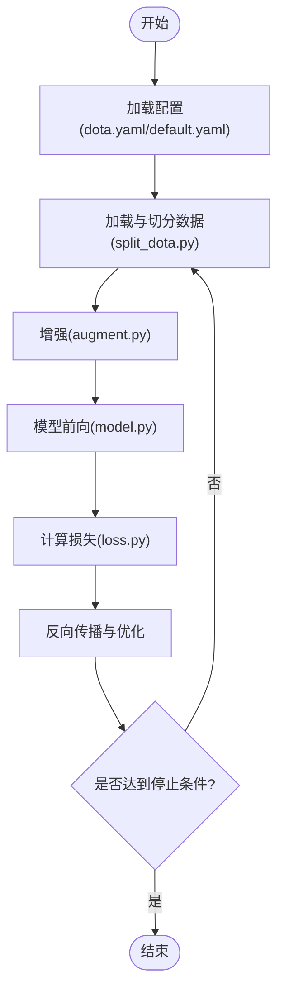
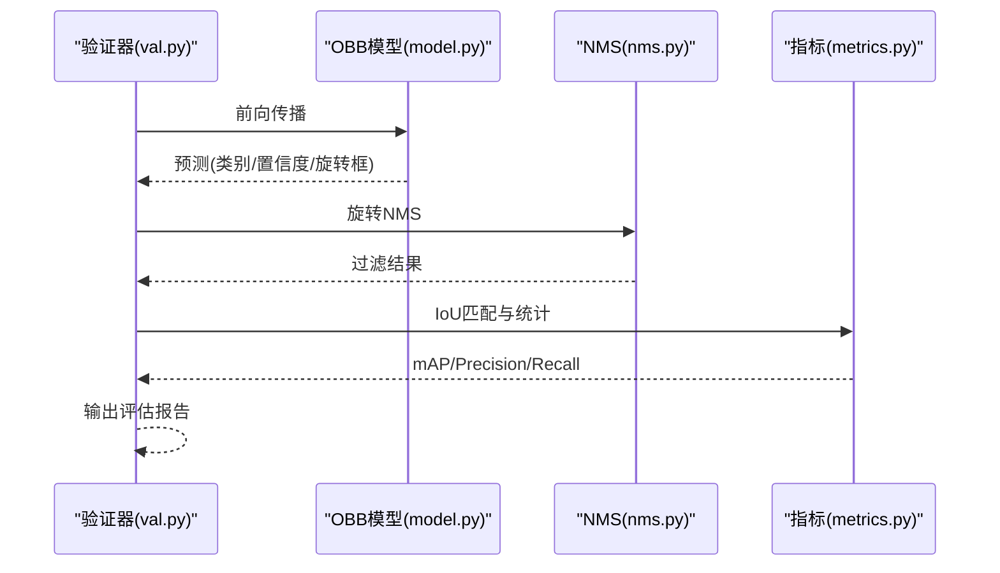
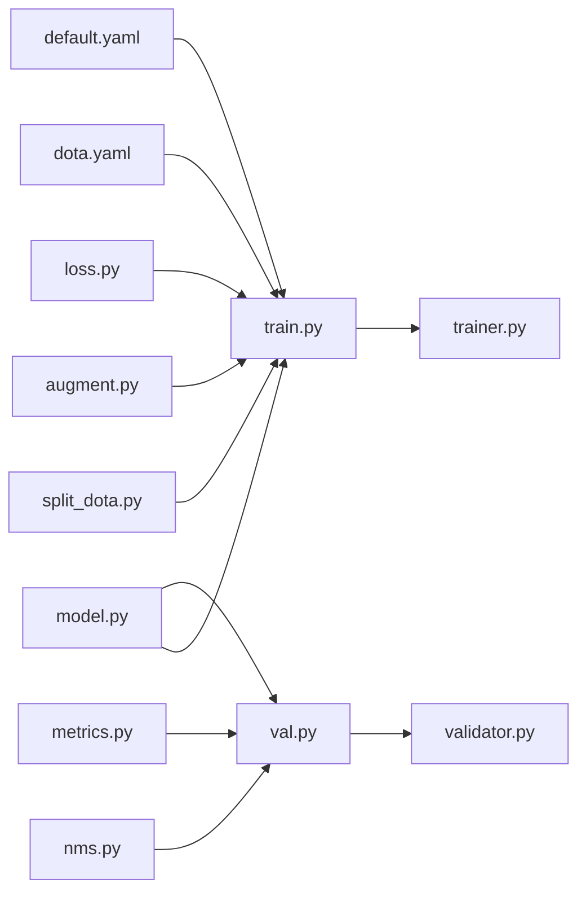

# 旋转目标检测教程

<cite>
**本文引用的文件**
- [ultralytics/data/split_dota.py](file://ultralytics/data/split_dota.py)
- [ultralytics/data/augment.py](file://ultralytics/data/augment.py)
- [ultralytics/utils/nms.py](file://ultralytics/utils/nms.py)
- [ultralytics/utils/loss.py](file://ultralytics/utils/loss.py)
- [ultralytics/utils/metrics.py](file://ultralytics/utils/metrics.py)
- [ultralytics/engine/trainer.py](file://ultralytics/engine/trainer.py)
- [ultralytics/engine/validator.py](file://ultralytics/engine/validator.py)
- [ultralytics/models/yolo/detect/train.py](file://ultralytics/models/yolo/detect/train.py)
- [ultralytics/models/yolo/detect/val.py](file://ultralytics/models/yolo/detect/val.py)
- [ultralytics/models/yolo/obb/model.py](file://ultralytics/models/yolo/obb/model.py)
- [ultralytics/models/yolo/obb/train.py](file://ultralytics/models/yolo/obb/train.py)
- [ultralytics/models/yolo/obb/val.py](file://ultralytics/models/yolo/obb/val.py)
- [ultralytics/cfg/datasets/obb/dota.yaml](file://ultralytics/cfg/datasets/obb/dota.yaml)
- [ultralytics/cfg/default.yaml](file://ultralytics/cfg/default.yaml)
- [examples/YOLOv8-SAHI-Inference-Video/yolov8_sahi.py](file://examples/YOLOv8-SAHI-Inference-Video/yolov8_sahi.py)
</cite>

## 目录
1. [简介](#简介)
2. [项目结构](#项目结构)
3. [核心组件](#核心组件)
4. [架构总览](#架构总览)
5. [详细组件分析](#详细组件分析)
6. [依赖关系分析](#依赖关系分析)
7. [性能考虑](#性能考虑)
8. [故障排查指南](#故障排查指南)
9. [结论](#结论)
10. [附录](#附录)

## 简介
本教程面向希望在YOLO-Master框架上开展“旋转目标检测（Oriented Bounding Box, OBB）”任务的工程师与研究者。内容覆盖：
- 旋转目标检测与传统轴对齐检测的区别与优势
- DOTA等旋转数据集的格式与标注规范
- 旋转框表示方法（中心点+宽高+角度）与坐标变换原理
- 训练配置要点：旋转损失、角度回归优化、NMS后处理
- 可视化方法与评估指标计算
- 遥感图像、文本检测等典型应用场景实践
- 高性能推理优化方案

## 项目结构
围绕旋转目标检测，仓库中与OBB相关的代码主要分布在以下模块：
- 数据与增强：数据切分、增强管线
- 模型与任务：OBB模型定义、训练与验证流程
- 工具库：NMS、损失函数、指标计算
- 配置：默认配置与DOTA数据集配置
- 示例：SAHI切片推理示例（可用于大场景遥感）

图表来源
- [ultralytics/data/split_dota.py](file://ultralytics/data/split_dota.py)
- [ultralytics/data/augment.py](file://ultralytics/data/augment.py)
- [ultralytics/models/yolo/obb/model.py](file://ultralytics/models/yolo/obb/model.py)
- [ultralytics/models/yolo/obb/train.py](file://ultralytics/models/yolo/obb/train.py)
- [ultralytics/models/yolo/obb/val.py](file://ultralytics/models/yolo/obb/val.py)
- [ultralytics/engine/trainer.py](file://ultralytics/engine/trainer.py)
- [ultralytics/engine/validator.py](file://ultralytics/engine/validator.py)
- [ultralytics/utils/nms.py](file://ultralytics/utils/nms.py)
- [ultralytics/utils/loss.py](file://ultralytics/utils/loss.py)
- [ultralytics/utils/metrics.py](file://ultralytics/utils/metrics.py)
- [ultralytics/cfg/datasets/obb/dota.yaml](file://ultralytics/cfg/datasets/obb/dota.yaml)
- [ultralytics/cfg/default.yaml](file://ultralytics/cfg/default.yaml)
- [examples/YOLOv8-SAHI-Inference-Video/yolov8_sahi.py](file://examples/YOLOv8-SAHI-Inference-Video/yolov8_sahi.py)

章节来源
- [ultralytics/data/split_dota.py](file://ultralytics/data/split_dota.py)
- [ultralytics/data/augment.py](file://ultralytics/data/augment.py)
- [ultralytics/models/yolo/obb/model.py](file://ultralytics/models/yolo/obb/model.py)
- [ultralytics/models/yolo/obb/train.py](file://ultralytics/models/yolo/obb/train.py)
- [ultralytics/models/yolo/obb/val.py](file://ultralytics/models/yolo/obb/val.py)
- [ultralytics/engine/trainer.py](file://ultralytics/engine/trainer.py)
- [ultralytics/engine/validator.py](file://ultralytics/engine/validator.py)
- [ultralytics/utils/nms.py](file://ultralytics/utils/nms.py)
- [ultralytics/utils/loss.py](file://ultralytics/utils/loss.py)
- [ultralytics/utils/metrics.py](file://ultralytics/utils/metrics.py)
- [ultralytics/cfg/datasets/obb/dota.yaml](file://ultralytics/cfg/datasets/obb/dota.yaml)
- [ultralytics/cfg/default.yaml](file://ultralytics/cfg/default.yaml)
- [examples/YOLOv8-SAHI-Inference-Video/yolov8_sahi.py](file://examples/YOLOv8-SAHI-Inference-Video/yolov8_sahi.py)

## 核心组件
- 数据切分与加载
  - DOTA数据切分：将大图切分为固定尺寸子图，并维护标注映射关系，便于训练与验证。
  - 增强管线：支持对旋转框的几何一致性增强（如随机仿射、裁剪、翻转），确保角度语义一致。
- 模型与任务
  - OBB模型：在通用检测头基础上扩展角度预测分支，输出类别、置信度与旋转框参数。
  - 训练器：集成旋转损失、角度回归优化策略与学习率调度。
  - 验证器：实现旋转NMS、IoU计算与mAP等指标统计。
- 工具库
  - NMS：针对旋转框的重叠抑制，避免重复检测。
  - 损失函数：包含分类、定位与角度回归项，兼顾数值稳定性。
  - 指标：按旋转框IoU阈值统计Precision、Recall、mAP等。
- 配置
  - DOTA数据集配置：路径、类别数、标签格式说明。
  - 默认配置：全局超参、设备、日志等。
- 示例
  - SAHI推理示例：用于大场景高分辨率图像的切片推理与结果拼接。

章节来源
- [ultralytics/data/split_dota.py](file://ultralytics/data/split_dota.py)
- [ultralytics/data/augment.py](file://ultralytics/data/augment.py)
- [ultralytics/models/yolo/obb/model.py](file://ultralytics/models/yolo/obb/model.py)
- [ultralytics/models/yolo/obb/train.py](file://ultralytics/models/yolo/obb/train.py)
- [ultralytics/models/yolo/obb/val.py](file://ultralytics/models/yolo/obb/val.py)
- [ultralytics/utils/nms.py](file://ultralytics/utils/nms.py)
- [ultralytics/utils/loss.py](file://ultralytics/utils/loss.py)
- [ultralytics/utils/metrics.py](file://ultralytics/utils/metrics.py)
- [ultralytics/cfg/datasets/obb/dota.yaml](file://ultralytics/cfg/datasets/obb/dota.yaml)
- [ultralytics/cfg/default.yaml](file://ultralytics/cfg/default.yaml)
- [examples/YOLOv8-SAHI-Inference-Video/yolov8_sahi.py](file://examples/YOLOv8-SAHI-Inference-Video/yolov8_sahi.py)

## 架构总览
下图展示了从数据到训练、验证与推理的整体流程，以及关键模块间的调用关系。

图表来源
- [ultralytics/models/yolo/obb/train.py](file://ultralytics/models/yolo/obb/train.py)
- [ultralytics/models/yolo/obb/model.py](file://ultralytics/models/yolo/obb/model.py)
- [ultralytics/utils/loss.py](file://ultralytics/utils/loss.py)
- [ultralytics/models/yolo/obb/val.py](file://ultralytics/models/yolo/obb/val.py)
- [ultralytics/utils/nms.py](file://ultralytics/utils/nms.py)
- [ultralytics/utils/metrics.py](file://ultralytics/utils/metrics.py)
- [ultralytics/cfg/datasets/obb/dota.yaml](file://ultralytics/cfg/datasets/obb/dota.yaml)
- [ultralytics/cfg/default.yaml](file://ultralytics/cfg/default.yaml)

## 详细组件分析

### 数据切分与标注规范（DOTA）
- 标注格式
  - 每行一个目标：类别ID + x1 y1 x2 y2 x3 y3 x4 y4（顺时针四个顶点）
  - 类别ID为整数，类别名由配置文件提供
- 切分策略
  - 将高分辨率遥感图像切分为固定尺寸的瓦片，同时保持标注与瓦片的对应关系
  - 切分后生成新的标注文件，供训练与验证使用
- 注意事项
  - 保证旋转框在切分边界处的完整性与有效性
  - 类别索引与配置文件保持一致

章节来源
- [ultralytics/data/split_dota.py](file://ultralytics/data/split_dota.py)
- [ultralytics/cfg/datasets/obb/dota.yaml](file://ultralytics/cfg/datasets/obb/dota.yaml)

### 增强与坐标变换
- 旋转框表示
  - 常用表示：中心点(x, y)、宽w、高h、角度θ（弧度或角度制需统一）
  - 与四顶点表示可相互转换，注意角度周期性与方向约定
- 几何增强
  - 随机仿射、裁剪、翻转等操作需同步更新旋转框参数，保持几何一致性
  - 角度归一化与边界处理，避免越界与歧义
- 坐标变换原理
  - 仿射矩阵作用于顶点或中心点+旋转变换
  - 注意缩放、平移、旋转的顺序与坐标系约定

章节来源
- [ultralytics/data/augment.py](file://ultralytics/data/augment.py)

### 模型与训练流程（OBB）
- 模型结构
  - 主干网络提取特征，检测头输出类别概率、置信度与旋转框参数
  - 角度分支需关注数值稳定与周期性处理
- 训练配置
  - 损失函数：分类损失、定位损失、角度回归损失组合
  - 优化策略：角度回归可采用平滑损失或周期性约束，避免角度跳变
  - 学习率调度与正则化：结合默认配置进行调优
- 训练主循环
  - 读取配置与数据，执行前向、损失计算、反向传播与权重更新

图表来源
- [ultralytics/models/yolo/obb/train.py](file://ultralytics/models/yolo/obb/train.py)
- [ultralytics/models/yolo/obb/model.py](file://ultralytics/models/yolo/obb/model.py)
- [ultralytics/utils/loss.py](file://ultralytics/utils/loss.py)
- [ultralytics/data/split_dota.py](file://ultralytics/data/split_dota.py)
- [ultralytics/data/augment.py](file://ultralytics/data/augment.py)
- [ultralytics/cfg/datasets/obb/dota.yaml](file://ultralytics/cfg/datasets/obb/dota.yaml)
- [ultralytics/cfg/default.yaml](file://ultralytics/cfg/default.yaml)

章节来源
- [ultralytics/models/yolo/obb/train.py](file://ultralytics/models/yolo/obb/train.py)
- [ultralytics/models/yolo/obb/model.py](file://ultralytics/models/yolo/obb/model.py)
- [ultralytics/utils/loss.py](file://ultralytics/utils/loss.py)
- [ultralytics/data/split_dota.py](file://ultralytics/data/split_dota.py)
- [ultralytics/data/augment.py](file://ultralytics/data/augment.py)
- [ultralytics/cfg/datasets/obb/dota.yaml](file://ultralytics/cfg/datasets/obb/dota.yaml)
- [ultralytics/cfg/default.yaml](file://ultralytics/cfg/default.yaml)

### 验证与NMS后处理
- 旋转NMS
  - 基于旋转框IoU进行重叠抑制，保留高置信度目标
  - 阈值选择影响召回与精度平衡
- 指标计算
  - 按不同IoU阈值统计Precision、Recall与mAP
  - 支持多类别汇总与逐类报告

图表来源
- [ultralytics/models/yolo/obb/val.py](file://ultralytics/models/yolo/obb/val.py)
- [ultralytics/models/yolo/obb/model.py](file://ultralytics/models/yolo/obb/model.py)
- [ultralytics/utils/nms.py](file://ultralytics/utils/nms.py)
- [ultralytics/utils/metrics.py](file://ultralytics/utils/metrics.py)

章节来源
- [ultralytics/models/yolo/obb/val.py](file://ultralytics/models/yolo/obb/val.py)
- [ultralytics/utils/nms.py](file://ultralytics/utils/nms.py)
- [ultralytics/utils/metrics.py](file://ultralytics/utils/metrics.py)

### 可视化与评估
- 可视化
  - 绘制旋转框与类别标签，注意角度显示与颜色区分
  - 支持批量图像与视频流可视化
- 评估指标
  - mAP@IoU阈值、各类别AP、混淆矩阵等
  - 建议在不同IoU阈值下对比轴对齐与旋转框的性能差异

章节来源
- [ultralytics/utils/metrics.py](file://ultralytics/utils/metrics.py)

### 典型应用场景与实践案例
- 遥感图像目标检测
  - 使用SAHI切片推理提升大场景高分辨率图像的召回与精度
  - 参考示例脚本进行端到端推理与可视化
- 文本检测
  - 文本区域通常呈细长旋转形态，旋转框能更贴合文本轮廓
  - 调整角度范围与IoU阈值以适配文本检测需求

章节来源
- [examples/YOLOv8-SAHI-Inference-Video/yolov8_sahi.py](file://examples/YOLOv8-SAHI-Inference-Video/yolov8_sahi.py)

## 依赖关系分析
- 模块耦合
  - 训练器依赖模型、损失与配置；验证器依赖模型、NMS与指标
  - 数据切分与增强为上游依赖，直接影响训练质量
- 外部依赖
  - 深度学习框架（PyTorch）、数值计算与可视化工具
- 潜在风险
  - 角度表示不一致导致损失不稳定
  - NMS阈值设置不当造成漏检或误检

图表来源
- [ultralytics/data/split_dota.py](file://ultralytics/data/split_dota.py)
- [ultralytics/data/augment.py](file://ultralytics/data/augment.py)
- [ultralytics/models/yolo/obb/model.py](file://ultralytics/models/yolo/obb/model.py)
- [ultralytics/models/yolo/obb/train.py](file://ultralytics/models/yolo/obb/train.py)
- [ultralytics/models/yolo/obb/val.py](file://ultralytics/models/yolo/obb/val.py)
- [ultralytics/utils/nms.py](file://ultralytics/utils/nms.py)
- [ultralytics/utils/loss.py](file://ultralytics/utils/loss.py)
- [ultralytics/utils/metrics.py](file://ultralytics/utils/metrics.py)
- [ultralytics/engine/trainer.py](file://ultralytics/engine/trainer.py)
- [ultralytics/engine/validator.py](file://ultralytics/engine/validator.py)
- [ultralytics/cfg/datasets/obb/dota.yaml](file://ultralytics/cfg/datasets/obb/dota.yaml)
- [ultralytics/cfg/default.yaml](file://ultralytics/cfg/default.yaml)

章节来源
- [ultralytics/data/split_dota.py](file://ultralytics/data/split_dota.py)
- [ultralytics/data/augment.py](file://ultralytics/data/augment.py)
- [ultralytics/models/yolo/obb/model.py](file://ultralytics/models/yolo/obb/model.py)
- [ultralytics/models/yolo/obb/train.py](file://ultralytics/models/yolo/obb/train.py)
- [ultralytics/models/yolo/obb/val.py](file://ultralytics/models/yolo/obb/val.py)
- [ultralytics/utils/nms.py](file://ultralytics/utils/nms.py)
- [ultralytics/utils/loss.py](file://ultralytics/utils/loss.py)
- [ultralytics/utils/metrics.py](file://ultralytics/utils/metrics.py)
- [ultralytics/engine/trainer.py](file://ultralytics/engine/trainer.py)
- [ultralytics/engine/validator.py](file://ultralytics/engine/validator.py)
- [ultralytics/cfg/datasets/obb/dota.yaml](file://ultralytics/cfg/datasets/obb/dota.yaml)
- [ultralytics/cfg/default.yaml](file://ultralytics/cfg/default.yaml)

## 性能考虑
- 训练阶段
  - 合理设置批次大小与学习率，避免梯度爆炸或收敛缓慢
  - 角度回归损失采用平滑形式，减少数值抖动
- 推理阶段
  - 使用半精度或模型导出（ONNX/TensorRT/OpenVINO）加速
  - 调整NMS阈值与置信度阈值，平衡速度与精度
- 大场景推理
  - 采用SAHI切片推理，降低显存占用并提升召回
  - 合并重叠检测结果时注意角度一致性

[本节为通用指导，不直接分析具体文件]

## 故障排查指南
- 角度异常
  - 检查角度表示与归一化逻辑，确保周期性与方向一致
  - 观察损失曲线是否出现尖峰或NaN
- NMS效果不佳
  - 调整IoU阈值与置信度阈值，查看漏检与重复检测情况
  - 确认旋转框顶点顺序与角度范围
- 指标偏低
  - 检查数据切分与标注映射是否正确
  - 验证类别索引与配置文件的一致性

章节来源
- [ultralytics/utils/loss.py](file://ultralytics/utils/loss.py)
- [ultralytics/utils/nms.py](file://ultralytics/utils/nms.py)
- [ultralytics/utils/metrics.py](file://ultralytics/utils/metrics.py)
- [ultralytics/data/split_dota.py](file://ultralytics/data/split_dota.py)
- [ultralytics/cfg/datasets/obb/dota.yaml](file://ultralytics/cfg/datasets/obb/dota.yaml)

## 结论
通过本教程，读者应掌握在YOLO-Master框架上进行旋转目标检测的关键步骤：理解旋转框表示与坐标变换、准备DOTA风格数据、配置训练与验证流程、实施旋转NMS与指标评估，并结合SAHI进行大场景推理。建议在遥感与文本检测场景中优先采用旋转框以提升贴合度与精度，同时根据实际部署需求选择合适的推理优化方案。

[本节为总结性内容，不直接分析具体文件]

## 附录
- 快速上手清单
  - 准备DOTA数据与配置文件
  - 运行训练脚本，监控损失与指标
  - 使用验证脚本评估模型性能
  - 基于SAHI示例进行大场景推理
- 常见问题
  - 角度单位与周期性问题
  - NMS阈值与类别不平衡问题
  - 大场景内存不足与切片策略

[本节为补充信息，不直接分析具体文件]